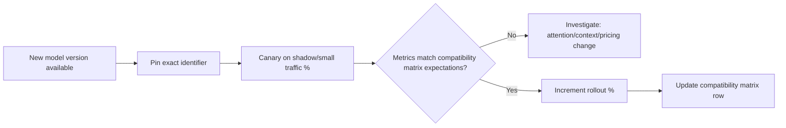

# Transformer Architecture — Professional

<!-- level-focus -->
At professional level, focus on this question:

> How do you run architecture awareness across multiple LLM vendors and model versions as a durable, org-wide operating model, so a vendor's silent attention-pattern or context-handling change doesn't quietly invalidate the latency, cost, and caching assumptions dozens of services were built on?

Use the smallest realistic scenario that exposes the decision and its failure behavior.

---

## Core Concept 1 — An Architecture-Compatibility Matrix, Owned Centrally

The senior guide treats "same model version, same architecture, same memory profile" as an invariant to defend within one deployment. At professional scale, an organization is running many services against many models across possibly several vendors, and no single team can independently track every model's architecture details, disclosed or not. The fix is the same pattern as a golden-base-image registry for containers: one centrally owned, actively maintained record, not tribal knowledge scattered across teams.

An **architecture-compatibility matrix**, one row per model version actually in use, tracked centrally:

| Field | Why it matters |
|---|---|
| Model identifier and version (exact, not a floating alias) | Distinguishes `model-x-2024-06` from `model-x-latest` — the second is not a version, it's a promise someone else controls |
| Published context length | The architectural ceiling teams are allowed to design against |
| Disclosed attention variant (if published) | GQA/MQA/sliding-window affects KV cache behavior and, for self-hosted models, your own capacity math directly |
| Known KV-cache-affecting serving changes | Vendor-side prompt caching behavior, context-caching discounts, or serving optimizations that change effective latency or cost without changing the model's outputs |
| Pricing per input/output token, and any prompt-caching discount structure | Cost assumptions baked into product economics that a vendor-side change can invalidate overnight |
| Last verified date and owner | Every row has a name attached, and a staleness signal — a matrix nobody updates is worse than no matrix, because it creates false confidence |

The matrix isn't interesting as a document — it's interesting as the thing every team building on an LLM checks *before* hardcoding a latency or cost assumption into a product plan, and the thing that gets checked first when a service's behavior changes without a corresponding code change on that service's side.

## Core Concept 2 — Canary and Regression Process for Model Version Upgrades

The container domain's lesson about tag drift applies almost unchanged: a vendor's model identifier that looks fixed (`gpt-4o`, `claude-latest`, a bare model family name with no date) can silently repoint to different underlying weights or serving behavior, the same way a mutable image tag can silently repoint to different bytes. The organizational defense is the same shape as the container professional guide's rollout discipline, adapted to model versions instead of image digests:

1. **Prefer pinned, dated model identifiers over floating aliases** wherever a vendor offers the choice — the same logic as building from a commit-SHA-tagged image instead of `:latest`.
2. **Canary any model version change** — pinned or forced by vendor deprecation — against a shadow or small-percentage traffic slice before full rollout, re-measuring the same metrics the senior guide's load tests established: time-to-first-token, time-per-output-token, KV cache/memory behavior for self-hosted models, and task-quality regression on an evaluation set (see the AI Evaluation topic, once published, for how that evaluation set should be built and maintained).
3. **Compare against the compatibility matrix row for the version being replaced**, not just against a general "does it still work" check — the specific things that break silently are context-length assumptions, attention-pattern-driven latency characteristics, and pricing structure, none of which a simple pass/fail functional test reliably catches.
4. **Roll out in percentage increments with a rollback path**, exactly as any other production change would be — a vendor forcing a deprecation deadline is pressure to move, not license to skip the increments.



## Core Concept 3 — Escalation and Ownership When a Vendor Change Breaks a Downstream Assumption

A concrete failure shape worth naming explicitly: a team built cost projections on a vendor's prompt-caching discount, which itself depends on the vendor's internal caching and attention-serving behavior for repeated prefixes. The vendor updates that behavior — perhaps changing how much of a prompt must match to hit the cache, or changing the discount itself — and the team's per-request cost assumption silently stops holding. Nothing in the application broke; the economics did, and the first signal is usually a billing anomaly discovered well after the change, not a test failure at the moment of change.

This is exactly the class of risk the compatibility matrix and canary process exist to catch early, but catching it requires clear ownership when it isn't caught early:

- **The team consuming the model owns noticing the symptom** — a cost, latency, or quality metric moving without a corresponding change on their side — because they're the ones with the dashboards closest to the actual product behavior.
- **The central team owning the compatibility matrix owns confirming the cause** — checking whether the vendor changed something matching a known pattern (version alias repoint, pricing structure change, serving-side optimization) versus a false alarm from an unrelated regression.
- **Escalation to the vendor, when warranted, is owned centrally, not per-team** — one consistent channel prevents five different teams independently discovering and separately reporting the same vendor-side change, and gives the organization one place to track "the vendor changed X on date Y" as institutional memory that the next team evaluating the same model can consult.

This mirrors the container professional guide's accountability split almost exactly: a platform-owned matrix and process absorbs the parts no single product team can sustain alone (tracking every vendor's changes), while product teams retain what only they can see (their own service's cost and latency symptoms).

## Core Concept 4 — Outcome Measures and Exit Conditions

A durable program needs measures that show it's catching real problems, not just producing a document nobody reads:

```yaml
metrics:
  cost_per_successful_request: "total spend / requests that completed without error or quality-gate failure, tracked per model version"
  p99_latency: "tracked per model version, per product surface, not aggregated across versions"
  regression_pass_rate: "canary evaluations passing quality/latency/cost gates before full rollout / total canary evaluations run"
  matrix_staleness: "compatibility matrix rows not re-verified within the owning team's committed interval"
exit_conditions:
  adopt_new_model_version_org_wide: "canary passes the quality-gate on the evaluation set, p99 latency and cost-per-successful-request are within the accepted band versus the prior version, and the compatibility matrix row is updated before the rollout reaches 100%"
  retire_a_model_version: "no active service references the version in the compatibility matrix, and the vendor's own deprecation date (if any) has passed"
```

`matrix_staleness` deserves the same suspicion the container guide gives `patch_latency`: an organization can have a complete-looking matrix while several rows haven't been re-verified in months, which means the matrix is describing what used to be true. Track it the same way, and treat a stale row as equivalent to a missing one when deciding whether to trust it for a new adoption decision.

## Core Concept 5 — Sustained Delivery: A Multi-Model-Family Migration

A realistic professional-level scenario: several services across multiple teams are running on a model family the organization has decided to move off — perhaps a vendor is deprecating it, perhaps a newer family offers a materially better cost or capability trade-off the compatibility matrix has been tracking for a quarter. This is not a single cutover; it's a coordinated migration with the same reversible-increment discipline as any large infrastructure change:

1. **Inventory every service referencing the old model family** from the compatibility matrix's consumer list (this is exactly why each row needs an owner and known consumers, not just architectural facts) — discovery should start from the matrix, not from asking every team to self-report.
2. **Pick one low-risk service as the migration pilot**, run it through the canary process in Core Concept 2 against the new model family, and use its actual measured cost, latency, and quality deltas — not the vendor's marketing comparison — to set the expected band other teams should plan against.
3. **Publish the pilot's findings back into the compatibility matrix and as a migration guide** other teams can follow without re-deriving the canary process from scratch — the same "extract structure from what the pilot needed" pattern as a golden base image.
4. **Migrate remaining services in waves, each independently canaried and independently reversible** — a wave that reveals an unexpected quality regression on a workload the pilot didn't cover is a reason to pause that wave and investigate, not a reason to halt or force through the entire remaining migration.
5. **Set a hard deprecation date for the old model family only after enough waves have completed successfully** that the remaining services are a known, small, tracked list — not an open-ended "eventually everyone will move."

Throughout, the compatibility matrix keeps the old and new model family's rows both current, so any service still on the old family has an accurate picture of what it's running and how much runway remains, rather than discovering a forced cutover on the vendor's deprecation date with no prior warning.

---

## Real-World Examples

- **A pinned model identifier turns a vendor deprecation into a planned migration instead of a fire drill.** A team that built against a dated, pinned model identifier gets weeks of advance notice from the compatibility matrix's tracked deprecation date, rather than discovering the change when a floating alias silently starts behaving differently in production.
- **A canary catches a prompt-caching cost regression before full rollout.** Rolling a new model version out to a small traffic percentage first, a team's cost-per-successful-request metric moves outside the accepted band during the canary window — investigation traces it to a change in how the vendor's prompt-caching discount applies to the team's specific prompt structure, caught before the change reached 100% of traffic instead of appearing as a surprise on the next billing cycle.
- **A migration pilot's measured numbers replace a vendor's comparison chart as the planning basis.** A pilot service migrating to a new model family measures a smaller latency improvement than the vendor's published comparison suggested, because the pilot's actual prompt structure and context length don't match the vendor's benchmark conditions — the org plans the remaining migration waves around the pilot's real numbers, avoiding an org-wide cost or latency assumption based on marketing figures.

## Common Mistakes

- **Building product cost or latency assumptions on a floating model alias.** The same failure shape as building on a mutable container tag — "the same model" is an assumption until pinned, not a fact.
- **Treating a compatibility matrix as a one-time document instead of an owned, continuously verified record.** A stale matrix creates false confidence, which is worse for decision-making than an acknowledged gap.
- **Rolling a model version upgrade to 100% of traffic on a vendor's forced deprecation deadline without canarying first.** Deadline pressure is a reason to start the canary process earlier, not a reason to skip it.
- **Letting each team independently discover and report the same vendor-side architecture or pricing change.** Without centralized ownership of escalation, the organization pays the investigation cost multiple times for one underlying change.
- **Setting a migration deprecation date before any wave has actually completed successfully.** Commits the organization to a timeline before there's evidence the migration path even works for a real workload.

## Apply it

1. Draft the first few rows of an architecture-compatibility matrix for the model versions your organization (or a project you're familiar with) actually depends on today, including at least one row with a floating (non-pinned) model identifier if one exists.
2. For that floating-identifier row, write the specific canary and pinning steps you'd take to convert it to a pinned, version-tracked dependency.
3. Design the outcome measures (cost per successful request, p99 latency, regression pass rate, matrix staleness) you'd track for this matrix, and write the exit condition that would justify adopting a new model version org-wide versus rolling it back.
4. Draft the escalation path: who notices a symptom, who confirms a vendor-side cause, and who owns contacting the vendor — for a scenario where a prompt-caching cost assumption stops holding.
5. Sketch, in five steps, how you'd migrate three services currently on one model family to a new one, including which service becomes the pilot and what would make you pause a later wave.

## Verify your work

- Every row in your compatibility matrix has a named owner and a last-verified date, not just architectural facts.
- Your canary process specifies concrete metrics and an accepted band, not just "check that it still works."
- Your escalation path names who owns each step (notice, confirm, escalate to vendor) rather than leaving it implicit.
- Your exit conditions are falsifiable (a specific metric crossing a specific threshold), not a vague statement like "the new model is ready."
- Your migration plan has an explicit, named pilot service and at least one condition that would pause a later wave, not just a fixed schedule.

## Review questions

- Why does a floating model identifier create the same category of risk as a mutable container image tag?
- What does a stale architecture-compatibility matrix row cost an organization that a missing row does not?
- Why should escalation to a vendor be owned centrally rather than left to whichever team notices a change first?
- What is the difference between a migration's outcome measure and its exit condition, and why does a durable program need both?
- Why should a migration's pilot service's measured numbers replace a vendor's own comparison figures as the basis for planning the remaining waves?
