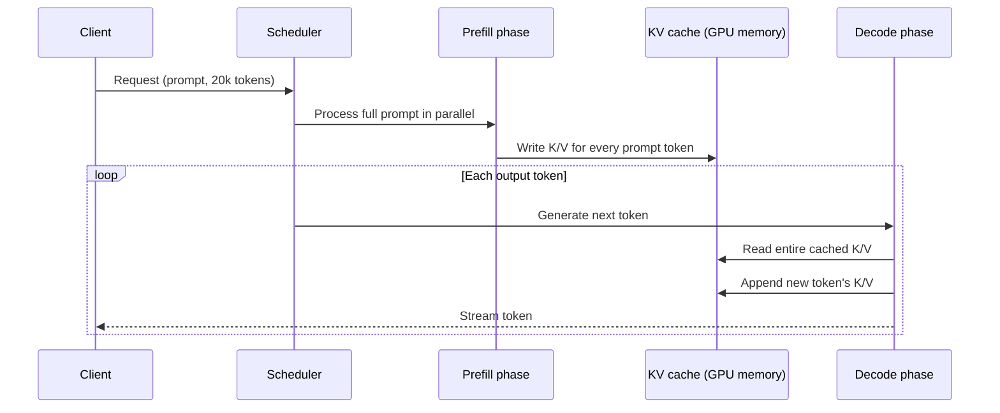

# Transformer Architecture — Senior

<!-- level-focus -->
At senior level, focus on this question:

> Given a GPU memory budget and a product that advertises a 100k-token context window, how many concurrent requests can you actually serve — and why does the KV cache, not raw FLOPs, usually decide the answer?

Use the smallest realistic scenario that exposes the decision and its failure behavior.

---

## Core Concept 1 — Continuous Batching and Why KV Cache Memory Is the Binding Constraint

Early LLM serving batched requests statically: collect a batch, run it to completion together, start the next batch. This wastes GPU time badly, because requests in a batch finish generating at different lengths — a batch waits on its longest request while the GPU sits idle on the finished ones. **Continuous batching** (also called in-flight batching, the term TensorRT-LLM uses) fixes this by treating each request's decode step independently: as soon as one request finishes, a new one is admitted into the batch immediately, keeping the GPU's compute busy at all times rather than idling between fixed batches.

Continuous batching exposes the real constraint clearly: the limiting resource is almost never raw compute (FLOPs) during decode — decode is memory-bandwidth-bound, one token at a time, reading the entire KV cache for every request in the batch on every step. The limiting resource is **how many requests' KV caches fit in GPU memory at once**, because that determines the batch size, and batch size is what continuous batching is trying to maximize to keep the GPU's compute utilized. vLLM's **PagedAttention** treats KV cache memory the way an OS treats virtual memory — allocating it in fixed-size, non-contiguous pages instead of one large contiguous block per request — specifically because naive contiguous allocation wastes GPU memory to fragmentation and over-reservation for requests that end up shorter than their maximum allowed length. The pattern to internalize: **serving throughput at scale is a memory-management problem wearing an ML-serving costume.**

## Core Concept 2 — Reasoning About the GPU Memory Budget

A GPU's memory is spent in three places, and only one of them scales with concurrent traffic:

| Component | What it holds | Scales with |
|---|---|---|
| Model weights | The model's parameters, loaded once | Model size only — fixed regardless of traffic |
| KV cache | Cached K/V vectors for every token of every in-flight request | Concurrent requests × their sequence lengths (the middle guide's formula, summed across all active requests) |
| Activation memory | Intermediate tensors during the forward pass (mostly during prefill) | Batch size and sequence length of whatever's being processed right now, but transient — freed after each step |

Weights are a fixed tax paid once at model load. Activation memory matters but is comparatively small and transient next to KV cache at any meaningful concurrency. The variable that actually determines how many concurrent users a GPU can serve is KV cache: `memory_available_for_kv_cache = total_gpu_memory − weights − reserved_activation_headroom`, and `max_concurrent_requests ≈ memory_available_for_kv_cache / average_kv_cache_per_request`.

This is precisely why **a model with a huge advertised context window can still fail in production well before that limit is reached**: the 100k-token figure on a model card is a statement about what the *architecture* can address (positional encoding range, attention mechanism), not a statement about what your *deployment* can afford concurrently. A single request at 100k tokens might fit comfortably; ten concurrent requests at 100k tokens each can exhaust the KV cache budget completely, at which point the serving stack has to queue, reject, or evict — none of which is what "100k-token context window" implied to whoever read the marketing page.

## Core Concept 3 — Prefill and Decode: Where the KV Cache Is Read and Written

Prefill is a burst: it writes a large amount of KV cache at once (proportional to prompt length) but is compute-bound and finishes in one pass — this is the phase that dominates time-to-first-token. Decode is a long tail: it reads the growing KV cache on every single step and appends one small increment, and it's memory-bandwidth-bound — this is the phase where GPU memory occupancy climbs for as long as the request stays open, and where concurrent requests compete most directly for the same memory and bandwidth. A request with a long output (many decode steps) holds its KV cache allocation for a long time, which is a different cost profile from a request with a short output, even at the same prompt length — two requests with identical prefill cost can have very different total memory-time footprints.

## Core Concept 4 — Cross-Component Scenario: The 100k-Token Feature That Collapses Under Load

A team ships a feature that lets users hold conversations up to 100,000 tokens — the model's advertised maximum. It passes functional testing: single requests at 100k tokens return correct, reasonably fast responses. It ships.

Under real traffic, throughput collapses: latency climbs sharply, then requests start timing out, well before the number of *simultaneous users* looks unusually high on any application-level dashboard. The application team's first instinct is to suspect the model itself has gotten slower, or that the load balancer is misrouting — neither of which turns out to be true.

The actual mechanism: at 100k tokens, each request's KV cache is enormous (apply the middle guide's formula at `seq_len = 100,000` instead of 20,000 and the numbers scale linearly with it). Only a handful of concurrent 100k-token conversations are needed to exhaust the memory the serving stack has available for KV cache. Once that memory is exhausted, the scheduler can no longer admit new requests into the batch — they queue. Queued requests wait for memory currently held by an active long-running decode to free up, which only happens when that request finishes generating — and a 100k-token conversation's decode phase can run for a long time. The result looks like "the service is slow," but the evidence trail (GPU memory occupancy pinned near its ceiling, queue depth climbing, per-request latency dominated by queue wait rather than actual generation time) points specifically at KV cache exhaustion, not compute saturation or model degradation.

The team's actual options, once the cause is confirmed:

| Option | What it trades |
|---|---|
| Reduce max concurrent batch size | Fewer simultaneous users served, but each gets predictable latency instead of unpredictable queuing |
| Swap to a GQA/MQA model variant | Smaller KV cache per request (the middle guide's math) at some quality cost — often the highest-leverage single change |
| Quantize the KV cache (e.g., store K/V in int8 instead of fp16) | Roughly halves (or more) KV cache memory per request at a small, measurable quality cost — separate from quantizing the model's weights |
| Cap context length per request below the model's advertised maximum | Directly caps worst-case KV cache per request, at the cost of the feature no longer offering "up to 100k tokens" to every user |

None of these is free, and the right choice depends on which cost the product can least afford — the point at senior level is having the evidence (memory occupancy, queue depth, per-request latency breakdown) to name the actual constraint before picking among these, rather than guessing at "we need a bigger GPU" as a default answer that treats symptom as cause.

## Core Concept 5 — Invariants: Same Model Version Should Mean Same Memory Profile

A useful invariant to hold a serving deployment to: **the same model version, at the same architecture, should produce the same latency and memory profile for the same workload, every time.** This is what makes capacity planning possible at all — if you've measured that a given model serves N concurrent 20k-token requests within budget, that number should still be true next week.

This invariant breaks silently when a vendor updates a "same" model behind the scenes — a hosted API's model identifier resolves to different underlying weights or a different serving configuration than it did when you last load-tested it, without you controlling or necessarily knowing the change happened. The professional guide covers the organizational process for catching this before it reaches production traffic; at senior level, the relevant discipline is not trusting a passed load test to remain valid indefinitely — re-verify after any model version change you're aware of, and build monitoring that would surface a memory or latency regression even for changes you aren't told about in advance.

## Core Concept 6 — Evidence-Gathering: Profile, Don't Trust the Spec Sheet

Vendor-quoted latency and context-length numbers describe a best case, usually measured at low or no concurrency. The evidence that actually matters for capacity planning comes from your own deployment, under your own traffic shape:

- **GPU memory occupancy over time**, broken into weights / KV cache / activation, not just a single aggregate percentage — tools like `nvidia-smi` for raw occupancy, and the serving framework's own metrics (vLLM and TensorRT-LLM both expose KV cache utilization directly) for the breakdown.
- **Tokens/sec, measured separately for prefill and decode**, since they have different bottlenecks (compute vs. memory bandwidth) and respond differently to the changes in Core Concept 4's table.
- **Time-to-first-token and time-per-output-token as separate metrics**, since a fix that helps one (say, capping context length helps TTFT by shrinking prefill) may not help the other, and a dashboard that only reports end-to-end latency hides which phase actually regressed.
- **Queue depth and queue wait time**, specifically to distinguish "the model is slow" from "requests are waiting for memory to free up" — the fix for each is completely different, and conflating them sends the team toward the wrong lever.

## Core Concept 7 — Questions That Expose Weak Assumptions

- "Have we load-tested at our actual expected concurrent long-context traffic, or only at low concurrency with a long single prompt?" Most teams have only done the latter, which validates prefill correctness but says nothing about KV cache contention.
- "If GPU memory occupancy climbed to its ceiling right now, would our dashboards show us — or would we only see it as generic 'latency is high'?" Surfaces whether memory-specific metrics exist at all, separate from end-to-end latency.
- "Does our capacity plan assume the vendor's advertised context window, or a number we measured ourselves at our real concurrency?" The gap between those two numbers is exactly what Core Concept 4's scenario exploits.
- "If the model version behind our API endpoint changed today without an announcement, would our load-tested capacity numbers still be valid, and would we notice before a production incident told us?"
- "Are we distinguishing 'the model is generating slowly' from 'the request is queued waiting for memory' anywhere in our metrics?" If not, every KV-cache-exhaustion incident will be misdiagnosed as a model performance problem.

---

## Real-World Examples

- **A "slow model" turns out to be a full queue.** A team investigating rising p99 latency initially suspects the model itself has regressed; breaking latency into queue-wait-time versus actual-generation-time shows nearly all of the regression is queue wait, and GPU memory occupancy graphs show KV cache pinned near its ceiling during the same window — the model was never slower, capacity was exhausted.
- **A context-length cap restores predictable latency without a GPU upgrade.** After confirming KV cache exhaustion as the cause of a throughput collapse, a team caps per-request context at a fraction of the model's advertised maximum for a specific high-traffic endpoint (leaving the full window available on a lower-traffic one), and observed p99 latency drops back within budget without any change to the underlying model or hardware.
- **A GQA swap changes the capacity math more than a GPU swap would have.** Facing the same exhaustion pattern, a different team evaluates moving to a GQA variant of their model family instead of adding GPUs; because KV cache size scales with `num_kv_heads`, the memory saved lets them roughly quadruple concurrent long-context capacity on the same hardware — a software-architecture change outperforming the hardware-scaling option that was the team's first instinct.

## Common Mistakes

- **Load-testing with low concurrency and long prompts, then extrapolating to high concurrency.** Prefill-dominated single-request tests don't exercise KV cache contention at all — the failure mode in Core Concept 4 only appears under concurrent load.
- **Treating "high latency" as one symptom with one cause.** Without separating queue-wait from generation time and prefill from decode, a memory-exhaustion incident and a genuine model-performance regression look identical on an aggregate dashboard and get misdiagnosed.
- **Assuming an advertised context window is a capacity guarantee.** It's an architectural ceiling for a single request, not a statement about concurrent memory budget.
- **Reaching for more GPUs before checking whether an attention-variant or quantization change would solve the actual constraint more cheaply.** Core Concept 4's real-world example shows a software change outperforming a hardware one on the same problem.
- **Re-validating capacity once and treating it as permanent.** The invariant in Core Concept 5 only holds until something changes — a silent vendor model update, a traffic-shape shift toward longer conversations — and nothing re-checks it automatically unless someone builds that monitoring.

## Apply it

1. For a model you serve or could serve, compute the KV cache memory for one request at your product's *maximum* advertised or supported context length (not p95 — the worst case that determines a ceiling).
2. Using your actual GPU's total memory and a realistic estimate of weight memory, compute the maximum number of concurrent requests at that context length before KV cache is exhausted.
3. Load test at that computed concurrency (or as close as you can get) and compare measured GPU memory occupancy and latency against your calculation — note where they diverge and why (activation memory overhead, memory fragmentation, or a wrong assumption in your inputs are the usual culprits).
4. Deliberately push concurrency past the point your calculation predicts exhaustion, and confirm from your metrics whether the resulting latency increase shows up as queue-wait time (memory exhaustion) or generation time (a different bottleneck).
5. Pick one mitigation from Core Concept 4's table, apply it (or simulate its effect via the KV cache formula), and quantify how much it changes your maximum concurrent capacity.

## Verify your work

- You have a computed, not guessed, maximum concurrent-request number for your model at its real context length ceiling and real GPU memory.
- You can point to a specific metric (not a general impression) that would tell you, during an incident, whether the cause is KV cache exhaustion versus a genuine compute or model-quality regression.
- You can explain, using the prefill/decode diagram, why time-to-first-token and time-per-output-token respond differently to a context-length cap versus an attention-variant change.
- You have evidence — a load test, not a spec sheet — behind any capacity number you'd put in a planning document.
- You can name the specific monitoring gap that would let a silent model-version change go undetected in your current setup, if one exists.

## Review questions

- Why is KV cache memory usually the binding constraint on concurrent request capacity, rather than raw GPU compute?
- What does an advertised context window actually guarantee, and what does it not guarantee about concurrent production traffic?
- How would you distinguish, using evidence rather than intuition, a KV-cache-exhaustion incident from a genuine model performance regression?
- Why can a request's prefill cost and its total memory-time footprint diverge significantly, and what causes that divergence?
- What invariant does a silent vendor model-version change break, and why does a previously passing load test not protect you from it?
