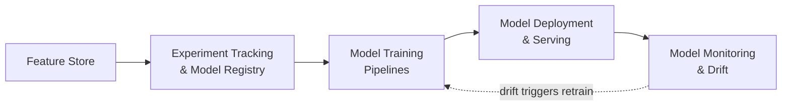

# MLOps

> Reproducible inputs, tracked experiments, orchestrated training, safe rollout, and drift detection — the operational discipline that keeps a model trustworthy after it ships, not just accurate the day it was trained.

## Topics

| # | Topic | Status | Focus |
|---|---|---|---|
| 01 | [Feature Store](feature-store/README.md) | Available | Reproducible model inputs across training and serving — offline/online stores, point-in-time correctness |
| 02 | [Experiment Tracking & Model Registry](experiment-tracking-and-model-registry/README.md) | Coming soon | Versioning models/datasets/hyperparameters, promoting a registered model to production |
| 03 | [Model Training Pipelines](model-training-pipelines/README.md) | Coming soon | Orchestrating training as a reproducible pipeline, retraining triggers, lineage |
| 04 | [Model Deployment & Serving](model-deployment-and-serving/README.md) | Coming soon | Batch vs. real-time serving, canary/shadow rollout, rollback |
| 05 | [Model Monitoring & Drift](model-monitoring-and-drift/README.md) | Coming soon | Data drift, concept drift, performance decay, and retraining triggers |

## How to use this section

Feature Store is the foundation — it's what every other MLOps topic reads from or writes to. The remaining four topics follow the lifecycle of a model in production: track and register an experiment, train it through an orchestrated pipeline, deploy it safely, then monitor it for drift that feeds back into the next training run. This section is distinct from [AI Evaluation](../ai-evaluation/README.md), which covers LLM/agent-specific observability (hallucination, groundedness, prompt regressions) — MLOps here covers classic ML model lifecycle management.

## Practice rule

Before deploying a model, confirm you can answer: what data trained it, what experiment produced it, and what signal will tell you it's drifting. If you can't answer all three, you have a model, not an operable one.

---

*Part of [Engineer Knowledge](../../README.md) → [AI Engineering](../README.md).*
