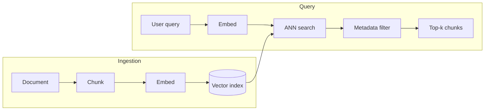

# Embeddings and Vector Databases

> An embedding turns text into a vector positioned so that semantically similar text lands nearby. Everything downstream — which database you pick, which index algorithm, which metric — is about doing that "find nearby vectors" operation correctly, fast, and at scale.

The ingestion path and the query path share one non-negotiable constraint: both embeddings must come from the same model, the same version, producing vectors in the same space — everything in this topic, from a first similarity search to an org-wide migration strategy, is downstream of protecting that constraint.

## Levels

| Level | Guide | You are done when |
|---|---|---|
| Junior | [Generate and search](junior.md) | You can generate embeddings for a small text set and run a similarity search that returns semantically relevant results. |
| Middle | [Choose the infrastructure](middle.md) | You can choose a vector database and indexing configuration that fits a product's scale, latency, and cost requirements. |
| Senior | [Migrate without breaking search](senior.md) | You can re-embed a large corpus onto a new embedding model without downtime or a silent quality collapse. |
| Professional | [Govern vector infrastructure](professional.md) | You can run a shared embedding service and vector infrastructure across an org with cost allocation, rebuild SLAs, and tenant isolation. |

## Practice rule

Before trusting a similarity search result, confirm the query and the indexed vectors came from the same embedding model and version. A search returning confidently wrong results is more often a mismatched embedding space than a bad model — check the cheap thing first.

## Related

- [RAG Techniques](../rag-techniques/junior.md) — the retrieval loop this topic's search operation feeds into.
- [Knowledge Base Design](../knowledge-base-design/junior.md) — what gets embedded and indexed in the first place.
- [Feature Store](../../feature-store/README.md) — the same reproducibility discipline (offline/online consistency, versioning) applied to model features instead of embeddings.
