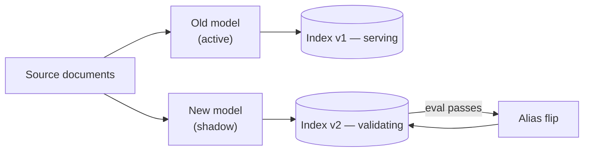

# Embeddings and Vector Databases — Senior

<!-- level-focus -->
At senior level, focus on this question:

> You need to move a production corpus onto a new or upgraded embedding model. How do you re-embed potentially millions of documents and cut over search to the new vectors without downtime, without a silent quality collapse, and with a clean rollback path?

Use the smallest realistic scenario that exposes the decision and its failure behavior.

---

## Core Concept 1 — Embedding Drift Is the Central Risk

**Embedding drift** is the fact that vectors from different embedding models — or even different versions of the *same* model — are not comparable, even when their dimensionality happens to match. A query embedded with the new model and searched against an index still holding vectors from the old model doesn't error out; it returns a similarity score that *looks* like a normal number and is, in fact, close to meaningless. This is worse than a visible failure: the system keeps serving results, just quietly worse ones, and nothing in the stack trace tells you why.

This makes an embedding-model migration fundamentally different from a typical infrastructure upgrade — there is no way to mix old and new vectors in one index and have it work "partially." The index is either fully on the old model or fully on the new one; it cannot be half-migrated at the vector level, only at the collection level (Core Concept 2).

## Core Concept 2 — The Shadow-Index Migration Pattern

The safe migration strategy mirrors a blue-green deployment, applied to indexes instead of application instances:



1. **Build a new, separate index (`docs-v2`) with the new embedding model**, while the existing index (`docs-v1`) keeps serving all production traffic unchanged. This is the "shadow index" — it exists but nothing depends on it yet.
2. **Re-embed the corpus in batches**, writing into `docs-v2` only. Track progress with a checkpoint (a table or counter recording which document IDs have been re-embedded), so the job is resumable if it's interrupted — a multi-million-document re-embed against a rate-limited hosted API can take hours to days, and assuming it completes in one uninterrupted run is a planning mistake.
3. **Validate `docs-v2` against the same eval set used in [RAG Techniques — Senior](../rag-techniques/senior.md)** before it serves a single real query — retrieval hit rate, recall@k, and a human-reviewed sample comparing old-model and new-model results side by side.
4. **Cut over via an alias, not a rewrite** — the application queries a stable name ("current-docs-index") that's repointed from `docs-v1` to `docs-v2` only after validation passes, so cutover is an atomic pointer flip, not a risky in-place migration.
5. **Keep `docs-v1` intact and queryable for a defined rollback window** after cutover, in case a production-scale issue surfaces that the eval set didn't catch.

## Core Concept 3 — Re-Embedding a Large Corpus Without Downtime

The "without downtime" requirement is satisfied entirely by Core Concept 2's shadow-index pattern — the re-embedding work happens against `docs-v2` while `docs-v1` keeps serving, so there is no window where search is unavailable. The engineering work is in making the re-embed job itself reliable and boundable:

- **Rate limits** — a hosted embedding API enforces requests-per-minute and tokens-per-minute limits; a naive re-embed job that ignores them gets throttled or errors out unpredictably. Batch requests up to the API's max batch size, and back off on rate-limit responses rather than retrying immediately.
- **Cost estimation before starting** — embedding cost scales with total tokens processed. A corpus of 10 million documents averaging 500 tokens each is 5 billion tokens; at a hosted API's per-million-token embedding price, this is a concrete, sometimes substantial cost that should be estimated and approved before the job starts, not discovered on the bill afterward. Self-hosting an open embedding model (BGE, E5) trades this per-call cost for fixed compute cost, which can be the better trade at very large, recurring re-embedding volume.
- **Checkpointing and idempotency** — the job should be safely restartable from the last checkpoint after any interruption (a deploy, an API outage, a rate-limit-triggered backoff that runs long), without re-embedding already-completed documents or leaving partial writes in `docs-v2`.
- **New documents arriving during migration** — production doesn't pause while a migration runs. Documents created or updated after the migration started need to be embedded with *both* models and written to *both* indexes until cutover, or the new index will be missing recent content the moment it goes live.

## Core Concept 4 — Versioning Strategy

Every stored vector should carry the identity of the model and version that produced it, and every index/collection name should encode that version explicitly rather than implying "whatever the current model is":

```
docs-v1  → embedded with text-embedding-3-small
docs-v2  → embedded with text-embedding-3-large
```

This isn't just documentation — it's what makes the shadow-index pattern possible at all, and what makes rollback a version-alias flip instead of a re-migration. A query router that resolves "current-docs-index" to a specific versioned collection, rather than the application code hardcoding a collection name, is what turns cutover and rollback into a configuration change instead of a deploy.

## Core Concept 5 — Validating Before Cutover

Validation needs to answer two separate questions, and conflating them is a common mistake: *is the new model's retrieval quality at least as good as the old one's*, and *does the new index actually contain everything the old one does*.

```python
# Retrieval-quality comparison — same eval set, both indexes
old_hit_rate = evaluate(index="docs-v1", eval_set=golden_queries)
new_hit_rate = evaluate(index="docs-v2", eval_set=golden_queries)
assert new_hit_rate >= old_hit_rate - TOLERANCE

# Completeness check — every source document present in both
old_ids = set(index_v1.list_ids())
new_ids = set(index_v2.list_ids())
missing = old_ids - new_ids
assert not missing, f"{len(missing)} documents missing from docs-v2"
```

A completeness check catches a class of failure the quality eval alone won't: a re-embed job that silently skipped a batch of documents (an unhandled error swallowed by a retry loop, a checkpoint bug) can leave `docs-v2` with excellent retrieval quality on the documents it *does* have, while being invisibly incomplete — the eval set, drawn from known documents, may never touch the missing ones.

## Core Concept 6 — Cross-Component Scenario: Search Quality Drops Right After a Model Upgrade

**Symptom**: a team ships an embedding-model upgrade (swapping `text-embedding-3-small` for a newer model expected to be strictly better), and within hours, search-quality complaints spike.

| Hypothesis | Confirming evidence | Disconfirming evidence |
|---|---|---|
| **Cutover happened before re-embedding finished** — queries are hitting an index that's a mix of old-model vectors (never re-embedded) and new-model vectors (from documents that were re-embedded), because the alias was flipped early | `index_v2` document count is lower than `index_v1`'s at the time of cutover; some query results reference documents with no v2 embedding at all | `index_v2` document count matches `index_v1` exactly at cutover time |
| **The application wasn't updated to embed queries with the new model** — the index holds new-model vectors, but the query path still calls the old embedding model, so every query is now mismatched against the index it searches | Query embedding calls in logs still reference the old model name after cutover | Logs show query embedding calls using the new model name, matching the index |
| **The new model is genuinely lower quality for this specific domain** — general benchmark improvements don't guarantee improvement on a specific corpus's vocabulary and query patterns | The eval-set comparison from Core Concept 5, re-run carefully, shows new_hit_rate genuinely below old_hit_rate even with both index and query path correctly matched | Eval-set comparison shows new model at or above old model's hit rate |

Checking application logs for which model actually embedded the queries after cutover is usually the fastest of these three checks and, in practice, the most common root cause — a partial deploy where the index was cut over but a query-path code change referencing the new model name lagged behind by one release, silently recreating the exact same mismatched-embedding-space problem the shadow-index pattern exists to prevent, just introduced at the query side instead of the index side.

## Questions That Expose Weak Assumptions

- "Does our re-embed job have a checkpoint, or does an interruption halfway through mean starting over from zero?"
- "If a document is created or updated *during* the migration window, is it captured by both the old and new index, or only one?"
- "Have we validated retrieval quality on a representative eval set, or only confirmed the new index 'has records in it'?"
- "Is the cutover a reversible alias flip, or does rolling back require re-running the migration in the other direction?"
- "Does every stored vector carry the model version that produced it, so a mixed-version index would be detectable rather than silent?"

---

## Real-World Examples

- **A completeness check catches a silently incomplete re-embed.** A migration job's retry logic swallows a transient API error on one batch instead of surfacing it, leaving several thousand documents unembedded in the new index; the retrieval-quality eval, drawn only from documents known to exist, shows no problem at all — the completeness check comparing document ID sets between old and new indexes is what actually catches the gap before cutover.
- **A query-path lag reproduces the exact failure the shadow index was built to prevent.** The index cuts over cleanly, fully re-embedded and validated, but a query-embedding code change referencing the new model ships one deploy late — for that window, queries embedded with the old model search an index of new-model vectors, and search quality craters until the log check in Core Concept 6 finds the mismatch.
- **A rollback that was "just flip the alias back" saves an incident.** A validated migration still surfaces a domain-specific quality regression only visible at real production query volume; because cutover was an alias flip and `docs-v1` had been kept intact and queryable, rollback takes minutes rather than requiring a fresh migration run.

## Common Mistakes

- **Cutting over before the re-embed job fully completes.** Produces a mixed index that returns confidently wrong results for the not-yet-migrated portion, with no error to flag it.
- **Validating only retrieval quality, never completeness.** A quality eval on known documents can pass cleanly while a silent gap in coverage goes undetected.
- **Deleting the old index immediately after cutover.** Removes the rollback path exactly when it might be needed — an eval set can miss a regression that only shows up under real production query volume and patterns.
- **Not accounting for documents created during the migration window.** Leaves the new index missing recent content the moment it goes live, a gap that's easy to miss because it affects only the newest, often least-tested documents.
- **Treating "the new model scored higher on a public benchmark" as sufficient validation.** Public benchmarks don't guarantee improvement on your specific corpus's vocabulary, domain, and query patterns — only your own eval set does.

---

## Apply it

1. Design a shadow-index migration plan for a corpus you have (or a realistic stand-in): naming scheme for versioned indexes, checkpointing approach, and how newly-created documents during the migration window get captured.
2. Estimate the re-embedding cost in tokens and dollars (or compute-hours for a self-hosted model) before running anything.
3. Run the migration (at whatever scale is practical for practice) and validate with both the retrieval-quality comparison and the completeness check from Core Concept 5.
4. Cut over via an alias/pointer flip rather than an in-place rewrite, and confirm you can flip it back within minutes.
5. Deliberately introduce the query-path-lag failure from Core Concept 6 (embed a test query with the wrong model against the new index) and confirm you can detect it from evidence, not by re-reading code.

## Verify your work

- You can state, from a checkpoint or log, exactly how much of the corpus has been re-embedded at any point during the migration — not just "it's running."
- The completeness check (document ID set comparison) passes with zero missing documents before cutover.
- Rollback is demonstrated, not just planned — you've actually flipped the alias back and confirmed the old index still serves correctly.
- You can distinguish, using the evidence table in Core Concept 6, a cutover-timing failure from a query-path-lag failure from a genuine model-quality regression.

## Review questions

- Why can't two embedding models' vectors be mixed within a single index, even when the vector dimensions match?
- What does the shadow-index pattern make possible that an in-place re-embed of the existing index does not?
- Why is a completeness check (document ID comparison) necessary in addition to a retrieval-quality eval before cutover?
- In the cross-component scenario, why is checking which model actually embedded the queries usually faster than re-validating the index itself?
