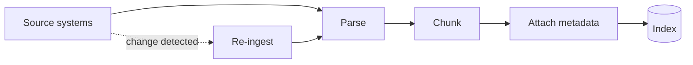

# Knowledge Base Design

> A perfect retrieval algorithm over a stale, undated, unauthorized-access-leaking knowledge base still produces a wrong or unsafe answer. The knowledge base is the foundation the rest of RAG assumes is correct.

Ingestion isn't a one-time load — the loop back from a detected source change to re-ingestion is what keeps a knowledge base from silently going stale the moment source documents change and nothing notices.

## Levels

| Level | Guide | You are done when |
|---|---|---|
| Junior | [Design the metadata](junior.md) | You can design metadata fields for a small, well-defined document set that make it filterable and citable, not just readable. |
| Middle | [Keep it fresh](middle.md) | You can design an ingestion pipeline that detects source changes and keeps the knowledge base current without a full manual re-load. |
| Senior | [Enforce access control](senior.md) | You can design retrieval that never returns a chunk from a document a user isn't authorized to see, and can defend the design under a security review. |
| Professional | [Govern it across an org](professional.md) | You can run knowledge-base ownership, freshness SLAs, and source deprecation as a durable program across multiple teams. |

## Practice rule

Before improving a retrieval or chunking technique, check whether the knowledge base itself has the answer, is current, and is correctly access-scoped. A retrieval algorithm cannot retrieve a fact that was never ingested, that's since gone stale, or that the requesting user isn't allowed to see.

## Related

- [RAG Techniques](../rag-techniques/junior.md) — the retrieval loop that queries what this topic builds.
- [Embeddings and Vector Databases](../embeddings-and-vector-db/junior.md) — where ingested, chunked content ultimately gets indexed.
- [Feature Store](../../feature-store/README.md) — a parallel discipline of reproducible, versioned, access-aware data delivery for model inputs instead of documents.
