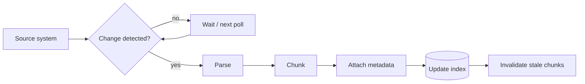

# Knowledge Base Design — Middle

<!-- level-focus -->
At middle level, focus on this question:

> Given a knowledge base whose source documents keep changing after initial ingestion, how do you design a pipeline that detects those changes and keeps the index current — without a full manual re-load every time something changes?

Use the smallest realistic scenario that exposes the decision and its failure behavior.

---

## Core Concept 1 — The Ingestion Pipeline, With a Freshness Loop

A junior-level ingestion is a one-time load: source → parse → chunk → embed → index. At middle level, the pipeline has to run continuously, because source documents change after they've already been ingested:

The loop back from `Index` through `Invalidate` and the polling/waiting cycle is the entire point of this level — without it, a knowledge base is only ever as fresh as the day it was first ingested, and every document update afterward silently doesn't exist as far as retrieval is concerned.

## Core Concept 2 — Change Detection Strategies

| Strategy | How it works | Trade-off |
|---|---|---|
| **Scheduled full re-crawl** | Periodically re-fetch and re-process every source document, regardless of whether it changed | Simplest to implement; wasteful at scale (re-embeds unchanged content) and has freshness latency equal to the schedule interval — a document updated the moment after a nightly crawl runs is stale for nearly 24 hours |
| **Polling with content-hash comparison** | Periodically fetch each document's current content, hash it, and compare against the stored `content_hash` from [junior.md](junior.md); only re-process on a mismatch | Avoids wasted re-embedding of unchanged documents; still has freshness latency bounded by the poll interval, but cheaper to poll frequently since hashing is far cheaper than re-embedding |
| **Event-driven (webhook/push)** | The source system notifies the ingestion pipeline directly on change (a Confluence page-updated webhook, a git commit hook for docs-as-code, a database change-data-capture stream) | Lowest freshness latency — near-real-time; requires the source system to support push notifications, and requires the pipeline to handle delivery failures (a missed webhook is a silent staleness gap unless there's a periodic reconciliation pass as a backstop) |

The practical default for most knowledge bases: **event-driven where the source system supports it, with a lower-frequency content-hash poll as a reconciliation backstop** that catches any change a missed or failed webhook let slip through. Pure scheduled full re-crawl is a reasonable starting point only for small, infrequently-changing sources where the wasted re-embedding cost is negligible.

## Core Concept 3 — Handling Structured and Unstructured Sources Together

A real knowledge base rarely has one uniform source type. Two distinct ingestion paths are usually needed:

- **Unstructured sources** (PDFs, Word documents, wiki pages, Markdown) need a **parsing** step that extracts clean text while preserving meaningful structure — headers, tables, and lists carry information that flattening to plain text loses. Tools built for this (e.g., `unstructured.io`, or a PDF-specific library like PyMuPDF for layout-aware extraction) exist because naive text extraction from a PDF often scrambles multi-column layouts or drops table structure entirely, silently degrading everything downstream in the pipeline.
- **Structured sources** (a database table, a ticketing system's fields, a product catalog) need **templated flattening** — turning structured fields into coherent text while preserving the original fields as metadata rather than losing them in the flattening. A support ticket with fields `{status: "resolved", priority: "high", resolution: "..."}` flattened into a sentence like *"This high-priority ticket was resolved with the following fix: ..."* is retrievable by semantic search, while the original fields remain available for metadata filtering (`status=resolved`).

Ingesting both into the same knowledge base means the pipeline needs source-type-aware branching — one parsing/chunking path per `source_type` (from [junior.md](junior.md) Core Concept 2), converging on the same metadata schema and index at the end so retrieval can search across both uniformly.

## Core Concept 4 — Deduplication

Two distinct duplication problems show up in a real pipeline:

- **Exact duplicates** — the same document ingested from two source systems (a wiki export and its live replacement, a PDF attached to both an email and a shared drive). Caught cheaply with the `content_hash` field from [junior.md](junior.md): before ingesting, check whether a chunk with the same hash already exists, and skip or merge rather than creating a second copy.
- **Near-duplicates** — two documents that are almost but not exactly the same (a policy doc and a slightly-edited copy of it saved separately, a draft and its near-final revision). Exact hash matching misses these because even a single-character difference changes the hash entirely. Detecting near-duplicates uses embedding similarity instead: if two chunks' embeddings have cosine similarity above a high threshold (e.g., 0.98), flag them for human review rather than silently keeping both — automatically picking one to keep and one to delete risks discarding the one that's actually current.

Unresolved duplicates are not a cosmetic problem — they directly cause the "two contradicting chunks both get retrieved" failure covered at senior level, where a model has to arbitrate between two source documents that disagree, with no principled way to know which is authoritative.

## Core Concept 5 — Versioning Documents

When a source document updates, naively deleting the old chunks and inserting new ones the instant a change is detected creates a race: a query that started retrieval a moment before the swap can get old and new chunks mixed, or a citation generated just before the swap can point to a chunk_id that no longer exists by the time a user clicks it.

The safer pattern, borrowing directly from the shadow-index approach in [Embeddings and Vector Databases — Senior](../embeddings-and-vector-db/senior.md):

1. Ingest the updated document's new chunks under new `chunk_id`s (keep the same `document_id`, since it's still logically the same document).
2. Mark the old chunks as **superseded** (a metadata flag, not an immediate hard delete) rather than removing them instantly.
3. Update retrieval to filter out superseded chunks by default.
4. Hard-delete superseded chunks only after a retention window (long enough that any in-flight request or generated citation referencing them has completed).

This "tombstone, don't instantly delete" pattern also matters for citations specifically: a generated answer citing a chunk that gets hard-deleted a second later leaves a user clicking a dead reference — keeping a superseded (but flagged) chunk retrievable-by-ID, even if excluded from normal search, for a retention window avoids that.

## Cross-Component Scenario: A Policy Wiki That Updates Weekly

An HR policy wiki updates several pages nearly every week — reordering sections, correcting typos, and occasionally changing an actual policy (like the reimbursement deadline from [RAG Techniques — Junior](../rag-techniques/junior.md)). A scheduled nightly full re-crawl was the original design; two problems surface:

1. **Cost**: re-embedding all 200 pages nightly regardless of whether they changed is wasteful — most nights, only 2–3 pages actually changed.
2. **A stale-policy incident**: a reimbursement deadline changes from 30 to 45 days on a Tuesday afternoon; the nightly crawl runs at 2 AM, so for nearly 10 hours, the knowledge base — and every answer generated from it — still states the old, incorrect deadline, and at least one user acts on the wrong information before the next crawl catches up.

The fix follows directly from Core Concept 2: switch to content-hash polling on a much shorter interval (e.g., every 15 minutes) for cost efficiency, and — since this wiki platform supports it — add an event-driven webhook on page save to close the remaining latency gap to near-zero for the cases that matter most, keeping the 15-minute poll only as the reconciliation backstop for any missed webhook.

## Verification at Two Levels

**Unit level — a single source change:**

- Make one deliberate change to one source document and confirm it's detected (via hash mismatch or webhook) within the expected latency window, not just "eventually."
- Confirm the re-ingested chunk carries an updated `updated_at` and a new `content_hash`, and that the old chunk is marked superseded, not left indistinguishable from current content.

**Integrated-flow level — search reflects reality:**

- After the change from the unit-level check propagates, run a query that should retrieve the updated content and confirm the *new* value is what's actually retrieved and would be cited, not the superseded one.
- Confirm a query issued *before* the update completes doesn't return a mix of old and new chunks for the same document.

## Common Mistakes

- **Choosing scheduled full re-crawl by default without checking the actual change frequency and staleness tolerance.** Fine for a source that changes monthly; a real incident risk for one that changes daily and drives decisions.
- **Hard-deleting superseded chunks immediately.** Breaks in-flight citations and creates race conditions between a document update and concurrent retrieval.
- **Treating exact-duplicate detection (content hash) as sufficient for near-duplicates.** A single-character edit defeats hash matching entirely; near-duplicate detection needs embedding similarity, a separate mechanism.
- **No reconciliation backstop for an event-driven pipeline.** A missed or failed webhook with no periodic hash-check fallback creates a silent, undetected staleness gap that can persist indefinitely.
- **Ingesting structured sources through the same parsing path built for unstructured documents.** Loses the structured fields that would otherwise be available as metadata filters, flattening everything into undifferentiated prose.

---

## Apply it

1. Take a document set that actually changes over time (a wiki, a shared drive, a set of markdown files in a git repo) and design a change-detection strategy for it, choosing among scheduled, polling, and event-driven per Core Concept 2, justified by how often it actually changes and how costly staleness would be.
2. Implement content-hash-based change detection: on each check, compare a fresh hash against the stored one and only re-process on mismatch.
3. Make a real change to one document, and measure the actual time from the change to the knowledge base reflecting it.
4. Implement the tombstone pattern from Core Concept 5: superseded chunks get flagged, not immediately deleted, and confirm a search after the update returns only the current version.
5. Pick two documents in your set with meaningfully similar content and check whether your near-duplicate detection (embedding similarity threshold) would flag them for review.

## Verify your work

- You measured the actual detection-to-reflected-in-search latency for a real change, not an assumed or theoretical number.
- Superseded chunks exist in a distinguishable, flagged state for a defined retention window rather than being deleted instantly.
- Your near-duplicate check operates on embedding similarity, separate from and in addition to exact content-hash matching.
- You can name, for your specific source, which change-detection strategy you chose and the concrete reason (change frequency, staleness cost, source system's webhook support) that justified it over the alternatives.

## Review questions

- Why does a scheduled full re-crawl strategy have a freshness latency bound by its schedule interval, and why doesn't a shorter schedule alone solve the underlying cost problem?
- What is the difference between exact-duplicate and near-duplicate detection, and why does one mechanism not catch both?
- Why does immediately hard-deleting a superseded chunk risk breaking something a user is actively looking at?
- What failure mode does an event-driven pipeline have that a polling pipeline doesn't, and what mitigates it?
