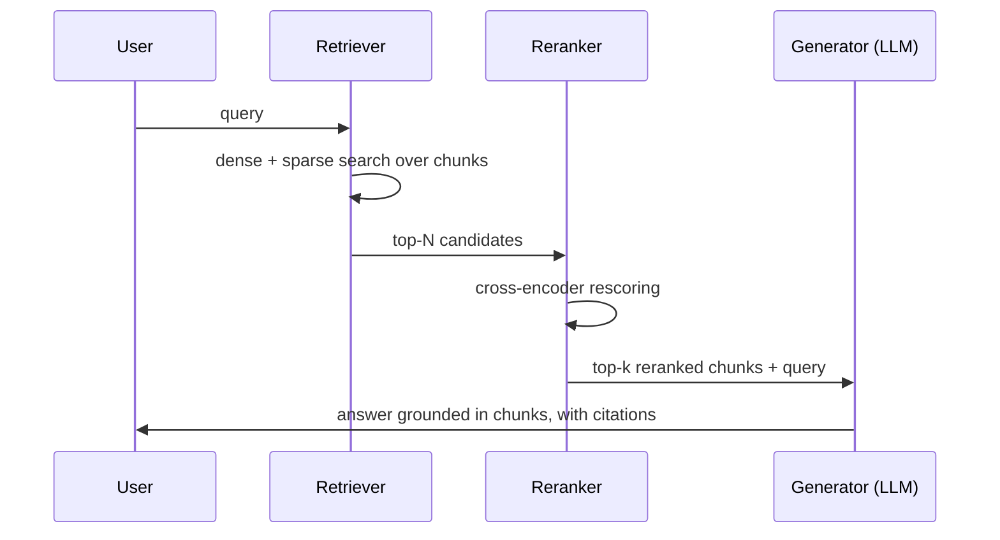

# RAG Techniques

> Retrieval-Augmented Generation only works if the right evidence gets retrieved, survives being placed in the prompt, and actually shapes the answer. Each of those three steps fails in its own distinct way.

The loop looks simple: retrieve, augment the prompt with what you retrieved, generate. Every real failure lives in the gap between "looks simple" and "works reliably" — a chunk boundary that split a sentence in half, a query whose wording doesn't match the document's wording, a context window stuffed with near-duplicate noise, a model that had the right evidence in front of it and answered from memory anyway.

## Levels

| Level | Guide | You are done when |
|---|---|---|
| Junior | [Build the loop](junior.md) | You can build a retrieve-then-generate pipeline over a small document set and show it answering from retrieved text, not memory. |
| Middle | [Choose the strategy](middle.md) | You can choose and justify a chunking strategy and a hybrid search configuration for a specific document type. |
| Senior | [Diagnose the regression](senior.md) | You can isolate whether a production quality regression is a retrieval, augmentation, or generation failure using evidence, and fix the actual cause. |
| Professional | [Run it as a platform](professional.md) | You can run a shared retrieval service and evaluation gates that block a chunking or model change before it regresses quality for every team behind it. |

## Practice rule

Before touching a chunking parameter, a prompt template, or a rerank model, isolate which stage of the loop is actually broken — retrieval, augmentation, or generation — by measuring each stage separately. Fixing the prompt when the real fault is retrieval recall wastes a cycle and hides the real problem.

## Related

- [Embeddings and Vector Databases](../embeddings-and-vector-db/junior.md) — the retrieval half of this loop, in depth.
- [Knowledge Base Design](../knowledge-base-design/junior.md) — the document foundation this loop retrieves from.
- [Context Engineering](../../llm-fundamentals/context-engineering/) — deciding what enters the context window once retrieval hands it candidates.
- [AI Evaluation](../../ai-evaluation/) — the eval harnesses referenced at senior and professional level.
