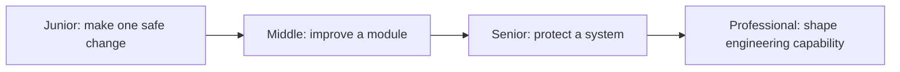

# Craftsmanship

> Craftsmanship is the discipline of making software safe to understand, change, review, operate, and improve.

This roadmap covers seven essential practices and presents each through junior, middle, senior, and professional responsibility.

## Topics

| Topic | Main outcome |
|---|---|
| [Code Review](code-review/README.md) | Improve correctness, design, security, learning, and team flow. |
| [Diagnostics](diagnostics/README.md) | Turn production symptoms into evidence, mitigation, and durable learning. |
| [Documentation](documentation/README.md) | Keep decisions, interfaces, and operations understandable and current. |
| [Legacy Code](legacy-code/README.md) | Create safety before changing code you do not fully understand. |
| [Object-Oriented Design](object-oriented-design/README.md) | Assign behavior and responsibility while controlling coupling. |
| [Professionalism](professionalism/README.md) | Make honest commitments, protect quality under pressure, and collaborate responsibly. |
| [Technical Debt](technical-debt/README.md) | Manage future change cost as an explicit engineering investment. |

## Level progression

Use the lowest level that matches your current responsibility, apply its method to real work, and move up when you can explain the trade-offs and verify the result independently.
