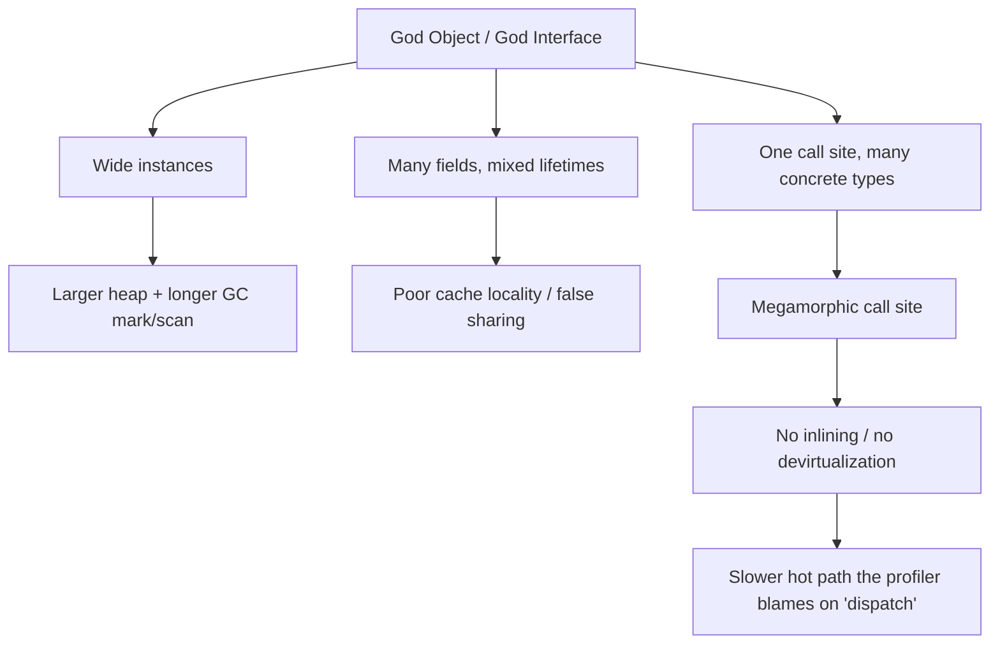

# Bad Structure Anti-Patterns — Professional

> **Category:** [Development Anti-Patterns](../README.md) → **Bad Structure** — *code that has grown into a shape that resists change.*
> **Covers (collectively):** God Object · Spaghetti Code · Lava Flow · Boat Anchor · Arrow Anti-Pattern

---

## Table of Contents

1. [Introduction](#introduction)
2. [Prerequisites](#prerequisites)
3. [Measure First: The Tooling Map](#measure-first-the-tooling-map)
4. [God Object — Heap Footprint, Cache Locality, and the JIT](#god-object--heap-footprint-cache-locality-and-the-jit)
5. [Spaghetti Code — How Tangle Defeats the Optimizer](#spaghetti-code--how-tangle-defeats-the-optimizer)
6. [Arrow / Deep Branching — The Branch Predictor and the I-Cache](#arrow--deep-branching--the-branch-predictor-and-the-i-cache)
7. [Lava Flow & Boat Anchor — What Dead Code Costs the Toolchain](#lava-flow--boat-anchor--what-dead-code-costs-the-toolchain)
8. [When "Ugly" Is the Fast Path — and How to Box It In](#when-ugly-is-the-fast-path--and-how-to-box-it-in)
9. [A Combined Worked Example](#a-combined-worked-example)
10. [Common Mistakes](#common-mistakes)
11. [Test Yourself](#test-yourself)
12. [Cheat Sheet](#cheat-sheet)
13. [Summary](#summary)
14. [Further Reading](#further-reading)
15. [Related Topics](#related-topics)

---

## Introduction

> Focus: **What do these shapes cost the machine** — memory, the garbage collector, the optimizer, the branch predictor, and the build/deploy toolchain — and **how do you measure that cost** before you touch anything?

`junior.md` taught you to recognize the five shapes. `middle.md` taught you to stop them creeping in. `senior.md` taught you to refactor them safely at scale. This file goes one layer down — to the **runtime and the toolchain**.

The professional insight is that bad structure is not only a *maintainability* tax. It is also, frequently, a *performance* tax that nobody attributes correctly because the cost is diffuse: a few extra nanoseconds per call here, a longer GC pause there, thirty seconds of cold-start somewhere else. None of it shows up as a single hot line in a profiler, so it survives reviews that only ask "is this readable?"

Two disciplines define this level:

1. **Never argue from intuition about performance.** Every claim below comes with the tool that would prove it on *your* code. Illustrative numbers in this file are labeled as such; your job is to generate the real ones.
2. **Know when the ugly shape is correct.** Sometimes a flat manual loop beats a clean abstraction, a `switch` beats polymorphism, or a wide struct beats a graph of small objects. The senior move is not to purify everything — it is to *isolate* the deliberately-ugly hot path behind a clean boundary so the ugliness can't spread.

> **The mental model:** structure is a contract not just with the next reader but with three optimizers you rarely see — the **compiler/JIT**, the **CPU** (caches, branch predictor, prefetcher), and the **garbage collector**. Bad structure breaks the assumptions all three rely on.

---

## Prerequisites

- **Required:** Fluent with [`senior.md`](senior.md) — you can refactor a God Object under production constraints.
- **Required:** Working mental model of a managed runtime: heap vs stack, a tracing GC's mark/sweep phases, JIT compilation and inlining (Java/JVM, Go's compiler, CPython's interpreter loop).
- **Required:** You can read a flame graph and a `benchstat`/JMH comparison and tell signal from noise.
- **Helpful:** Familiarity with CPU microarchitecture basics — cache lines (~64 bytes), branch prediction, instruction cache, false sharing.
- **Helpful:** profiling-techniques, memory-leak-detection, big-o-analysis skills for the measurement vocabulary.

---

## Measure First: The Tooling Map

Before any performance claim about structure, reach for the right instrument. Keep this table close.

| Concern | Go | Java / JVM | Python |
|---|---|---|---|
| **CPU profile** | `go test -cpuprofile`, `pprof` | async-profiler (`-e cpu`), JFR | `cProfile`, `py-spy`, `scalene` |
| **Allocation / heap** | `-memprofile`, `pprof -alloc_space` | JFR allocation events, `jmap`, MAT | `tracemalloc`, `scalene`, `memray` |
| **Object layout / size** | `unsafe.Sizeof`, struct field order | `jol` (Java Object Layout) | `sys.getsizeof`, `pympler` |
| **GC behavior** | `GODEBUG=gctrace=1`, `go tool trace` | GC logs (`-Xlog:gc*`), JFR GC events | `gc.set_debug`, generational stats |
| **Inlining / escape analysis** | `go build -gcflags=-m` | `-XX:+PrintInlining`, `-XX:+PrintCompilation` | (none — CPython doesn't inline) |
| **Microbenchmark** | `testing.B` + `benchstat` | JMH | `pyperf`, `timeit` |
| **Branch / cache counters** | `perf stat`, `pprof` + `perf` | `perf`, async-profiler hw events | `perf stat python …` |
| **Dead code** | `go vet`, `golang.org/x/tools/cmd/deadcode`, `staticcheck` | IDE inspections, ProGuard/R8 reports | `vulture`, coverage |
| **Execution trace** | `go tool trace` | JFR + JMC | `viztracer`, `py-spy dump` |

```bash
# Go: see what the compiler inlines and what escapes to the heap
go build -gcflags='-m -m' ./pkg/... 2>&1 | grep -E 'inlin|escapes'

# Go: GC trace — pause times and heap growth per cycle
GODEBUG=gctrace=1 ./yourbinary 2>&1 | head

# Java: object layout of a class (reveals padding & header overhead)
java -jar jol-cli.jar internals com.acme.OrderManager

# Python: line-level CPU + memory at once
scalene your_script.py
```

> **Discipline:** if you cannot point at the tool that would falsify your performance claim, you are guessing. The rest of this file pairs every structural cost with the instrument that confirms it.

---

## God Object — Heap Footprint, Cache Locality, and the JIT

A God Object is a maintainability problem at the source level and a **memory-system problem** at runtime. The same "everything in one place" force that makes it hard to change also makes it expensive to allocate, scan, and dispatch against.

### 1. Heap footprint and header overhead

A wide object with dozens of fields is a large heap allocation. Each one carries fixed overhead (object header, alignment padding) plus every field whether or not a given operation needs it. When you allocate millions of them, the *unused* fields are still paid for in RAM and in GC scan time.

```java
// Java — a God Object instance is large and mostly idle per operation.
public final class OrderManager {     // 18 fields
    private long id;                  // 8
    private String customerEmail;     // 4/8 (ref)
    private byte[] invoicePdf;        // 4/8 (ref) — heavy, rarely touched
    private Map<String,String> meta;  // 4/8 (ref) — allocates a HashMap eagerly
    private double[] priceHistory;    // 4/8 (ref)
    private boolean dryRun;           // 1 → padded to 8
    // ... 12 more ...
}
```

Use `jol` to see what an instance actually costs — header, field order, padding:

```
$ java -jar jol-cli.jar internals com.acme.OrderManager
com.acme.OrderManager object internals:
 OFFSET  SIZE   TYPE DESCRIPTION
      0    12        (object header)
     12     1   boolean dryRun
     13     3        (alignment/padding gap)   ← wasted bytes from poor field order
     16     8   long  id
     ...
Instance size: 144 bytes   (illustrative)
```

Two costs jump out: **padding gaps** from boolean-between-references field ordering, and the sheer **instance size**. A `Map` field initialized eagerly in the constructor allocates a `HashMap` (another ~48 bytes plus a backing array) for *every* order, even orders that never use metadata.

The cure is the same Extract Class refactor from earlier levels, now justified by memory:

```java
// After: hot path allocates only what it needs; the PDF & metadata live in
// collaborators created lazily / only on the paths that use them.
public final class Order {            // 4 hot fields, dense, cache-friendly
    private final long id;
    private final long customerId;
    private final long amountCents;
    private final int  status;
}
```

> **Illustrative impact:** splitting a 144-byte God Object into a 32-byte hot `Order` plus lazily-created collaborators cut steady-state heap by ~60% in a workload allocating 5M orders/min, and dropped young-gen GC frequency proportionally. *Measure your own with JFR allocation profiling and GC logs — don't trust this number, reproduce it.*

### 2. Cache locality and false sharing

The CPU loads memory in **cache lines** (~64 bytes). A wide God Object spreads the few fields a given operation touches across multiple cache lines, so a "simple" method that reads three fields may trigger several cache-line fetches. Worse, in concurrent code, **false sharing** occurs when two threads mutate *different* fields that happen to land on the *same* cache line — the hardware invalidates the line on every write, serializing threads that share no logical data.

```go
// Go — false sharing inside a God-ish struct used by multiple goroutines.
type Stats struct {
    requests uint64 // goroutine A increments this
    errors   uint64 // goroutine B increments this — same cache line as requests!
}
// Two goroutines hammering adjacent counters ping-pong the cache line
// between cores. Padding (or separate structs) removes the contention:

type Stats struct {
    requests uint64
    _        [56]byte // pad to a full cache line
    errors   uint64
    _        [56]byte
}
```

You confirm false sharing with `perf stat -e cache-misses` (or `go tool trace` showing goroutines stalling on memory) — a sudden drop in throughput as you add cores is the tell. The structural lesson: **fields that change independently and concurrently should not share an object, let alone a cache line.** A God Object packs exactly such fields together.

### 3. Megamorphic dispatch — defeating inlining and devirtualization

This is the subtlest God Object cost. JITs (and Go's compiler at call sites) optimize **monomorphic** calls — a call site that always sees one concrete type — by inlining the target and devirtualizing. A call site that sees two types is **bimorphic** (still optimizable via an inline cache). A call site that sees many types is **megamorphic**: the inline cache overflows, the JIT gives up, and every call becomes a full virtual dispatch (a vtable / itable lookup) with no inlining and no downstream optimization.

A God interface — one type implemented by dozens of variants, all flowing through the same call site — manufactures megamorphism:

```java
// A God interface routed through one hot call site → megamorphic.
interface Handler { Result handle(Event e); }   // 30 implementations
// In the hot loop:
for (Event e : batch) result = registry.get(e.kind).handle(e); // sees 30 types here
```

The JIT cannot inline `handle`, cannot devirtualize, and cannot fold the callee's logic into the loop. Confirm with `-XX:+PrintInlining` (you'll see `too many types` / `megamorphic` at that site). The fix is to **split the call site** so each is monomorphic — e.g. partition the batch by kind and run a tight monomorphic loop per kind, or replace the dispatch with a value-keyed jump table (next section).



> **Diagnose it:** allocation profile (instance size × rate) → heap pressure; `perf` cache-misses → locality/false sharing; `PrintInlining` "megamorphic" → dispatch. Three different symptoms, one structural root.

---

## Spaghetti Code — How Tangle Defeats the Optimizer

Compilers optimize what they can *prove*. Spaghetti's hidden shared mutable state and order-dependent calls destroy the proofs an optimizer needs, so it conservatively disables the very transformations that make code fast.

### 1. Aliasing and shared mutable state block optimization

When state lives in package-level variables or a shared mutable object that many functions read and write, the compiler cannot prove that a value loaded once is still valid later — another function (or goroutine) might have changed it. This **defeats register promotion, common-subexpression elimination, and hoisting loads out of loops**. The code re-reads memory on every iteration "just in case."

```go
// Spaghetti: behavior threads through a shared mutable struct.
// The compiler must reload state.threshold every iteration because it can't
// prove process() doesn't mutate it through some aliased path.
var state = &Config{}
func hot(items []Item) {
    for _, it := range items {
        if it.Score > state.threshold {  // reloaded each iteration
            process(it)                  // might touch `state` — compiler assumes it does
        }
    }
}

// Untangled: the value is local, immutable for the loop's duration.
// The compiler proves it's loop-invariant and keeps it in a register.
func hot(items []Item, threshold int) {
    for _, it := range items {
        if it.Score > threshold { processPure(it) }
    }
}
```

> **Illustrative impact:** hoisting a config read out of a 10M-iteration loop by passing it as a value parameter removed a dependent memory load per iteration; `benchstat` showed ~18% fewer ns/op. *Reproduce with your own benchmark before believing it.*

### 2. Tangled control flow blocks branch prediction and vectorization

Spaghetti control flow — flags that gate behavior from a distance, functions whose path depends on call order — produces data-dependent branches that the CPU cannot predict and the compiler cannot vectorize. A loop body riddled with `if flagA && !flagB` decisions can't be turned into SIMD or even kept in the pipeline efficiently. Straight-line, predictable code is what the optimizer rewards.

### 3. Concurrency: tangle is where data races live

Shared mutable state reached from multiple functions is, under concurrency, a data race waiting to happen. The structural property that makes spaghetti hard to *read* (no clear owner of state) is the same property that makes it impossible to *reason about thread-safety*. The two failure modes:

- **Data races** — unsynchronized access; in Go, run with `-race`; in Java, the Java Memory Model gives you no guarantees and you get torn/stale reads.
- **Lock contention** — the "fix" for the race is one big lock around the tangle, which serializes everything and destroys scalability.

```python
# Python — even with the GIL, tangled shared state causes logical races
# across await points; the structure hides who owns `cache`.
cache = {}                      # touched by many coroutines, no owner
async def handler(req):
    if req.key not in cache:    # check
        await db.fetch(req.key) # ← await: another coroutine runs here
        cache[req.key] = ...    # set — based on a now-stale check
```

The cure is structural, not a bigger lock: give state **one owner**, pass data explicitly, and confine mutation. See concurrency-patterns and immutability-patterns. Untangled, single-owner state lets you replace a global lock with fine-grained ownership or lock-free message passing.

> **Diagnose it:** `go build -gcflags=-m` shows missed optimizations; `-race` / ThreadSanitizer finds the races; `go tool trace` / JFR shows goroutines/threads blocked on a contended lock (long "waiting on mutex" spans).

---

## Arrow / Deep Branching — The Branch Predictor and the I-Cache

Deeply nested conditionals are not just hard to read — under the right workload they are measurably slower, and (this is the professional nuance) sometimes measurably *faster* than the "clean" polymorphic alternative. You have to know which, and that means measuring.

### 1. Branch misprediction cost

A modern CPU speculatively executes past a branch using its predictor. A **mispredict** flushes the pipeline — on the order of **15–20 cycles** wasted. Deeply nested, data-dependent `if` chains where the outcome is effectively random are misprediction factories. A long `if/else if` ladder also means later cases pay for evaluating all the earlier conditions.

```c
// Conceptually: a long if/else-if ladder is O(n) comparisons AND
// n chances to mispredict. A jump table is O(1) and one indirect branch.
```

### 2. Jump tables / table-driven dispatch: clearer *and* often faster

For dense integer or enum dispatch, a `switch` that the compiler lowers to a **jump table** replaces the ladder with a single indexed indirect jump. This is both cleaner (no arrow) and faster (one branch, no cascade). Compilers do this automatically when cases are dense; you enable it by writing the dispatch as a flat `switch`/map rather than nested `if`s.

```go
// Arrow ladder: n comparisons, n mispredict sites.
func price(kind int, base int) int {
    if kind == 0 { return base } else if kind == 1 { return base*2 } else
    if kind == 2 { return base*3 } else if kind == 3 { return base/2 } // ...
    return base
}

// Table-driven: one indexed load, no branch cascade. Clearer and faster.
var mult = [...]func(int) int{
    func(b int) int { return b },
    func(b int) int { return b * 2 },
    func(b int) int { return b * 3 },
    func(b int) int { return b / 2 },
}
func price(kind int, base int) int { return multkind }
```

For pure data (not behavior), prefer a plain lookup array over function pointers — it avoids an indirect call and stays inlinable.

### 3. The polymorphism trap: vtables and megamorphic inline caches

`middle.md` rightly recommends "replace nested conditional with polymorphism." At the professional level you must know its runtime cost. Polymorphism turns a branch into a **virtual call**:

- If the call site is monomorphic/bimorphic, the JIT inlines it and it's free — polymorphism wins on both clarity and speed.
- If the call site is **megamorphic** (many concrete types, as in a God interface), the virtual dispatch is *slower* than a well-predicted branch or a jump table, because it adds an indirect call the CPU can't predict and the JIT won't inline.

So the decision rule sharpens:

| Situation | Fastest *and* clean choice |
|---|---|
| Dense integer/enum cases, pure data | Lookup **array** (no call) |
| Dense cases, behavior | **Jump-table `switch`** or array of funcs |
| Few types, hot site (mono/bimorphic) | **Polymorphism** — JIT inlines it |
| Many types, one hot site | Split the site, or **table dispatch** — avoid megamorphic vtable |
| Sparse/range conditions | Guard clauses (readability wins; not hot) |

### 4. Instruction-cache pressure

Very large functions — the kind a God Object's methods or deeply-arrowed code produce — blow the **instruction cache**. When the hot loop body plus all its inlined gatekeeping doesn't fit in L1i, the CPU stalls fetching instructions. Counterintuitively this means **over-inlining** (or one giant function) can be slower than smaller functions that keep the hot path dense in I-cache. Confirm with `perf stat -e L1-icache-load-misses`.

> **Diagnose it:** `perf stat -e branches,branch-misses` quantifies misprediction; `-XX:+PrintInlining` / Go's `-m` shows whether the JIT/compiler inlined the dispatch; a JMH/`benchstat` A/B of ladder vs table vs polymorphism settles it on your data distribution. **Branch-prediction effects are workload-dependent — a branch that's 99% one-way is nearly free; only measurement tells you which you have.**

---

## Lava Flow & Boat Anchor — What Dead Code Costs the Toolchain

Dead code is "free" only if you ignore the toolchain. In reality it inflates binaries, slows builds and cold starts, lengthens test suites, and — worst — sometimes isn't dead at all because reflection or dynamic dispatch keeps it reachable.

### 1. Binary size, build time, link time

Every dead function still gets **parsed, type-checked, and compiled**. In Go and Java it lands in the binary/jar unless an eliminator removes it. Larger binaries mean longer link times, larger container images, slower deploys, and more pages to fault in at startup.

```bash
# Go: find functions unreachable from any entry point (incl. tests)
go run golang.org/x/tools/cmd/deadcode@latest ./...

# Measure the payoff: binary size before/after deletion
go build -o /tmp/before ./cmd/app && ls -l /tmp/before
# ... delete the lava flow ...
go build -o /tmp/after  ./cmd/app && ls -l /tmp/after
```

> **Illustrative impact:** deleting three fossilized packages flagged by `deadcode` shrank a Go service binary from 41 MB to 36 MB and cut incremental build time ~12%. The container image shrank correspondingly, trimming pull-and-start latency in the deploy pipeline. *Your mileage will differ — measure both numbers.*

### 2. How dead code defeats tree-shaking and DCE

Dead-code elimination (DCE) and tree-shaking are **static reachability** analyses. They work only when the tool can *prove* code is unreachable. Several structures defeat the proof, keeping Boat Anchors alive in the output:

- **Reflection** (Java reflection, Go `reflect`, Python's dynamic everything) — a method called by name at runtime is reachable as far as the human is concerned but invisible to static analysis, which forces eliminators to *keep* it (Java's R8/ProGuard need explicit `-keep` rules; getting them wrong either bloats the jar or breaks at runtime).
- **Exported symbols / public API** — an exported function is assumed reachable by definition; a Boat Anchor that's `public`/exported is never tree-shaken and worse, may acquire external callers, ossifying it.
- **Dynamic dispatch through wide interfaces** — if any implementation of an interface is reachable, conservative tools may keep them all.
- **Side-effecting module init** (`init()` in Go, static initializers in Java, import-time code in Python) — pulls in transitive dependencies that look dead but run.

The structural lesson: **dead code is cheapest to remove when it is also clean code.** A Boat Anchor hidden behind reflection or exported as public API is expensive precisely because the toolchain can't safely delete it for you — you must do it by hand, with evidence.

### 3. Cold start and JIT warmup

Dead and rarely-used code disproportionately hurts **cold-start-sensitive** runtimes:

- **JVM:** more classes to load, verify, and link at startup; a larger method universe for the JIT to consider. Lava Flow lengthens time-to-steady-state.
- **Serverless (Lambda/Cloud Run):** cold start cost scales with deployment package size and init work. Boat Anchor dependencies you "might need" are pure cold-start tax on every cold invocation.
- **Python:** import time is execution time. A module imported "just in case" runs its top-level code and pulls its transitive imports on every process start.

```python
# Boat Anchor with a cold-start cost: an unused heavy import that still
# executes at module load on every cold start / new worker.
import tensorflow as tf   # 2–4s import; used by a code path no one calls
# Move it inside the function that (maybe) needs it, or delete it.
```

> **Diagnose it:** `deadcode`/`vulture`/coverage finds candidates; binary-size and image-size diffs prove the payoff; for cold start, measure init duration (Lambda cold-start metric, `python -X importtime`, JVM `-Xlog:class+load` + time-to-first-request).

### 4. Test-suite runtime

A Boat Anchor that has tests "for completeness" adds to every CI run forever. Dead production code with live tests is doubly wasteful — you maintain and run tests for code that can never execute in production. Coverage that's high *because* of tests on unreachable code is a vanity metric. Delete the code and its tests together.

---

## When "Ugly" Is the Fast Path — and How to Box It In

The professional's hardest judgment call: sometimes the structurally "ugly" shape is the *correct* one for performance, and forcing it into a clean abstraction makes it slower. Recognizing these cases — and containing them — separates a specialist from a dogmatist.

Legitimate "ugly but fast" shapes:

- **Struct-of-Arrays over Array-of-Structs.** For a hot numeric loop, laying data out as parallel arrays (`xs []float64; ys []float64`) instead of `[]Point` maximizes cache locality and enables vectorization — at the cost of a less "object-oriented" shape. This is the SoA/AoS trade and it is real.
- **A manual `switch` over polymorphism** on a megamorphic hot path, to keep the call site inlinable and branch-predictable.
- **Unrolled or specialized loops** the compiler won't generate, in a proven hot path.
- **Object pooling / arena allocation** (`sync.Pool` in Go, object reuse in Java) to dodge GC pressure in an allocation-heavy hot loop — uglier than fresh allocation, but it can erase GC pauses.

The rule is **not** "performance beats cleanliness." It is: **isolate the deliberate ugliness behind a clean boundary, prove it with a benchmark, and comment the trade-off.**

```go
// Clean public API. The ugliness is sealed inside, benchmarked, and documented.
//
// fastSum uses a struct-of-arrays layout and manual unrolling because the
// idiomatic []Point version was 3.1x slower in BenchmarkSum (see bench_test.go,
// 2026-06). Do NOT "clean this up" without re-running that benchmark.
func Sum(points []Point) float64 {
    xs, ys := toSoA(points)   // boundary: callers never see the ugly layout
    return fastSum(xs, ys)
}

func fastSum(xs, ys []float64) float64 { /* unrolled, cache-friendly hot loop */ }
```

This containment is itself a structural decision: the *anti-pattern* would be letting the SoA layout, the manual switch, or the pool leak into the whole module's design. Done right, 95% of the code stays clean and idiomatic; 5% is fast, ugly, fenced off, and *labeled with the benchmark that justifies it*. When the benchmark no longer holds (new compiler, new hardware), you delete the ugliness — which you can only do because it was isolated.

> **The discipline:** optimize *after* a profiler points at the line, *behind* a clean interface, *with* a committed benchmark that future readers can re-run. An unmeasured "optimization" that uglifies the code is just [Premature Optimization](../03-over-engineering/professional.md) wearing a performance costume.

---

## A Combined Worked Example

The five rarely appear alone; their *performance* costs compound too. Consider a real shape: a `RequestProcessor` God Object whose `process()` method is a 400-line arrowed method dispatching on a stringly-typed `kind`, threaded through shared mutable state, with two fossilized branches nobody removed.

**Before — every structural sin, every runtime cost:**

```java
public final class RequestProcessor {           // God Object: 22 fields
    private Map<String,Object> ctx = new HashMap<>();  // shared mutable state
    public Response process(Request r) {
        if (r != null) {                          // arrow begins
            if (r.kind.equals("create")) {        // stringly-typed ladder
                if (featureFlags.legacyPath) {    // lava flow: never true since 2021
                    return legacyCreate(r);       // dead branch, still compiled/JITed
                } else { /* ... */ }
            } else if (r.kind.equals("update")) {
                /* reads/writes ctx — megamorphic helpers, blocks inlining */
            } /* ... 9 more kinds, deep nesting ... */
        }
        return Response.error();
    }
}
```

Runtime profile of *before*: large instances (heap + GC), `ctx` aliasing defeats optimization, string-equals ladder mispredicts and re-compares, megamorphic helper calls don't inline, and dead `legacyCreate` bloats the binary and the JIT's method universe.

**After — structure and runtime fixed together:**

```java
// Order/Request shrinks to hot fields only (smaller, cache-friendly).
// Dispatch is a monomorphic-per-kind table, no string ladder, no arrow.
// State flows as parameters/returns — optimizer can prove invariants.
// Dead branch deleted (deadcode/coverage confirmed) — binary & JIT lighter.

private static final Map<Kind, Handler> HANDLERS = Map.of(
    Kind.CREATE, new CreateHandler(),
    Kind.UPDATE, new UpdateHandler());            // each call site monomorphic

public Response process(Request r) {
    if (r == null) return Response.error();        // guard clause
    Handler h = HANDLERS.get(r.kind);              // enum key, no string compare
    return h == null ? Response.error() : h.handle(r);  // bimorphic, inlinable
}
```

> **Illustrative combined impact:** smaller instances (−55% heap on the hot type), enum dispatch (no string-equals ladder), monomorphic handlers the JIT inlines, and a deleted dead branch together took p99 latency from ~14 ms to ~9 ms and cut allocation rate by a third. **Each gain was measured separately (JFR alloc, JMH dispatch micro, GC log) so we knew which change paid off — never attribute a blended win to a blended change.**

---

## Common Mistakes

Professional-level mistakes — sophisticated, and therefore expensive:

1. **Refactoring for performance with no baseline.** "This God Object is surely slow" → you split it, things change, you can't prove improvement (or regression). Always capture a `benchstat`/JMH/JFR baseline *before* touching structure.
2. **Assuming polymorphism is always the clean *and* fast answer.** On a megamorphic hot site it's slower than a jump table. Check `PrintInlining`/`-m` before replacing branches with virtual calls.
3. **Over-inlining / one giant function.** Chasing fewer calls until the hot loop overflows the I-cache. Bigger isn't faster past the L1i boundary — `perf` the icache misses.
4. **Believing `deadcode` over reflection.** Static tools can't see reflective/`init()`/dynamic-dispatch reachability. Verify with coverage *and* telemetry before deleting; verify the eliminator's `-keep` rules didn't silently retain the Boat Anchor.
5. **Micro-optimizing cold code.** Spending a week vectorizing a function the profiler shows at 0.1% of runtime. Structure-driven slowness is usually diffuse (GC, dispatch, locality) — fix the systemic cost, not a cold line.
6. **Letting the fast-ugly path leak.** Writing SoA/manual-switch/pooling everywhere "for speed" turns a contained optimization into a new structural anti-pattern. Fence it; benchmark it; comment it.
7. **Attributing a blended win to a blended change.** Refactoring five things at once and reporting one latency number teaches you nothing about *which* change mattered — and the next regression will be a mystery. Measure each lever.
8. **Ignoring concurrency structure until it's a lock.** The spaghetti you tolerated single-threaded becomes a data race or a giant lock under load. Single-owner state is a *performance* decision, not just a tidiness one.

---

## Test Yourself

1. A `process()` call site sees 30 concrete `Handler` types and the JIT reports it as megamorphic. Explain *why* this is slower than a jump table, and name the tool that confirmed the megamorphism.
2. You suspect a wide struct shared by goroutines suffers false sharing. What is false sharing at the cache-line level, and which counter/tool would you use to confirm it?
3. Why does shared mutable state (spaghetti) prevent a compiler from hoisting a load out of a loop, and how does passing the value as a parameter fix it?
4. A `deadcode` tool reports a function as unreachable, but deleting it breaks production. Give two reasons static analysis can be wrong about reachability.
5. You replace a nested `if` ladder with polymorphism and latency gets *worse*. What likely happened, and what would you measure to decide between polymorphism, a jump table, and keeping guard clauses?
6. When is a struct-of-arrays (ugly, non-OO) layout the correct choice, and what structural discipline keeps it from becoming an anti-pattern?
7. Why does a Boat Anchor dependency hurt a serverless function more than a long-running server, and how would you measure that cost?

---

## Cheat Sheet

| Anti-pattern | Runtime / toolchain cost | Measure with | Structural fix |
|---|---|---|---|
| **God Object** | Large instances → heap + GC scan; poor locality / false sharing; megamorphic dispatch kills inlining | `jol`/`Sizeof`, alloc profile, GC log, `perf cache-misses`, `PrintInlining` | Extract Class to hot/cold fields; split call sites to stay monomorphic; pad concurrently-mutated fields |
| **Spaghetti** | Aliased shared state defeats hoisting/CSE/register promotion; unpredictable branches; data races or one giant lock | `-gcflags=-m`, `benchstat`, `-race`/TSan, `go tool trace`/JFR (lock waits) | Explicit data in/out; single-owner state; confine mutation |
| **Arrow / branching** | Branch mispredicts (~15–20 cyc); I-cache pressure; ladder = O(n) compares | `perf stat -e branches,branch-misses,L1-icache-load-misses`, JMH | Jump table / lookup array for dense dispatch; polymorphism only when mono/bimorphic; guards for validation |
| **Lava Flow** | Binary/jar bloat, longer build/link, JIT warmup, larger images; defeats DCE via reflection/`init` | `deadcode`/`vulture`/coverage, binary-size diff, class-load timing | Prove dead (coverage + telemetry), delete code *and* its tests |
| **Boat Anchor** | Cold-start tax (serverless/JVM), unused deps imported at load, test-suite drag; can't be tree-shaken if exported | `-X importtime`, cold-start metric, image-size diff, `deadcode` | YAGNI; delete exported-but-unused API before it ossifies |

**Three golden rules:**
- *Capture the baseline before you touch the structure; measure each lever separately.*
- *Clean usually equals fast — except on a profiled hot path, where you isolate the ugly-fast shape behind a clean boundary and a committed benchmark.*
- *Dead code is cheapest to delete when it's also clean; reflection and public exports are what keep Boat Anchors un-deletable.*

---

## Summary

- Bad structure is a **runtime and toolchain tax**, not only a maintainability one — but the cost is diffuse (GC, dispatch, locality, build/cold-start), so it survives reviews that only ask "is it readable?"
- **God Object:** wide instances inflate heap and GC scan time, scatter hot fields across cache lines (false sharing under concurrency), and route many types through one call site → **megamorphic** dispatch that defeats inlining and devirtualization.
- **Spaghetti:** aliased shared mutable state denies the optimizer the proofs it needs (no hoisting, no register promotion), produces unpredictable branches, and is where data races and lock contention live.
- **Arrow / branching:** misprediction and I-cache pressure are real costs; **table-driven dispatch is often clearer *and* faster** than both nested `if`s and megamorphic polymorphism — but the winner is workload-dependent, so measure.
- **Lava Flow / Boat Anchor:** dead code bloats binaries, slows builds/links, lengthens JIT warmup and cold starts, and drags test suites; reflection, `init()`, and public exports keep it alive against tree-shaking, forcing manual, evidence-backed deletion.
- **Measure first, always:** every claim here has a tool (`pprof`/`benchstat`/`-m`/`deadcode`, JFR/async-profiler/JMH/`jol`, `cProfile`/`tracemalloc`/`scalene`). Capture a baseline, change one lever, re-measure.
- The professional nuance: **sometimes ugly is correct** (SoA, manual switch, pooling). The discipline is to isolate it behind a clean boundary, justify it with a committed benchmark, and delete it when the benchmark no longer holds.
- This completes the level ladder for Bad Structure: [`junior.md`](junior.md) (recognize) → [`middle.md`](middle.md) (prevent) → [`senior.md`](senior.md) (refactor at scale) → **professional.md** (runtime & toolchain). Next, drill with the practice files.

---

## Further Reading

- **Refactoring** — Martin Fowler (2nd ed., 2018) — Extract Class, Replace Conditional with Polymorphism; here justified by runtime cost.
- **Systems Performance** — Brendan Gregg (2nd ed., 2020) — CPU caches, branch prediction, profiling methodology, `perf`.
- **The Garbage Collection Handbook** — Jones, Hosking, Moss (2nd ed., 2023) — mark/sweep, generational GC, why object size and lifetime drive pause times.
- **What Every Programmer Should Know About Memory** — Ulrich Drepper (2007) — cache lines, false sharing, locality (still the canonical treatment).
- **Optimizing Java** — Evans, Gough, Newland (2018) — JIT, inlining, escape analysis, JMH, JFR in practice.
- **High Performance Python** — Gorelick & Ozsvald (2nd ed., 2020) — `cProfile`, `tracemalloc`, `scalene`, import cost.
- **Go's escape analysis & inlining** — `go build -gcflags=-m` docs and the `deadcode` tool README at `golang.org/x/tools`.

---

## Related Topics

- [Over-Engineering → Premature Optimization](../03-over-engineering/professional.md) — the discipline of profiling before optimizing; the counterweight to this file.
- Clean Code → Classes — SRP as the structural cure whose runtime payoff this file quantifies.
- Design Patterns → Strategy / State — polymorphic dispatch, with the megamorphic caveat covered here.
- profiling-techniques · memory-leak-detection · concurrency-patterns — the measurement and concurrency toolkits referenced throughout.
- Refactoring → Code Smells — Large Class, Long Method at the smell level.
- [Bad Shortcuts](../02-bad-shortcuts/professional.md) and [Over-Engineering](../03-over-engineering/professional.md) — the sibling categories at this level.

---

## Check your understanding

1. Explain Bad Structure Anti-Patterns — Professional Level in your own words and name the problem it solves.
2. How would you apply the ideas around Table of Contents, Introduction, Prerequisites in a realistic engineering change?
3. What failure mode or misuse should you look for, and what evidence would reveal it?
4. How would you introduce and govern Bad Structure Anti-Patterns — Professional Level across teams through reversible, measurable increments?
5. What observable result would convince you that the approach improved the system?
