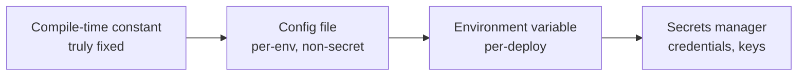

# Bad Shortcuts Anti-Patterns — Middle

> **Category:** [Development Anti-Patterns](../README.md) → **Bad Shortcuts** — *convenience taken now, paid back many times later.*
> **Covers (collectively):** Copy-Paste Programming · Magic Numbers / Strings · Hard Coding · Cargo Cult Programming · Pokémon Exception Handling · Stringly-Typed Programming

---

## Table of Contents

1. [Introduction](#introduction)
2. [Prerequisites](#prerequisites)
3. [The Real Question: When Does This Creep In?](#the-real-question-when-does-this-creep-in)
4. [Copy-Paste — and the DRY Nuance That Trips People Up](#copy-paste--and-the-dry-nuance-that-trips-people-up)
5. [Magic Values — Where Constants Should Live](#magic-values--where-constants-should-live)
6. [Hard Coding — The Configuration Spectrum](#hard-coding--the-configuration-spectrum)
7. [Cargo Cult — From Imitation to Understanding](#cargo-cult--from-imitation-to-understanding)
8. [Pokémon Exception Handling — Designing Error Flow](#pokémon-exception-handling--designing-error-flow)
9. [Stringly-Typed — Making Illegal States Unrepresentable](#stringly-typed--making-illegal-states-unrepresentable)
10. [Catching Shortcuts in Review and Tooling](#catching-shortcuts-in-review-and-tooling)
11. [Common Mistakes](#common-mistakes)
12. [Test Yourself](#test-yourself)
13. [Cheat Sheet](#cheat-sheet)
14. [Summary](#summary)
15. [Further Reading](#further-reading)
16. [Related Topics](#related-topics)

---

## Introduction

> Focus: **When does this creep in?** and **What do I do instead?**

Juniors take bad shortcuts by accident. The middle-level reality is subtler: these shortcuts are taken **on purpose, under pressure, by people who know better** — because the shortcut genuinely is faster *this minute*, and the cost is deferred and diffuse. "I'll extract it later." "I'll move it to config before launch." "I'll handle that error properly in v2." Later rarely comes.

The middle skill is twofold. First, **recognize the pressure points** where shortcuts get taken and have a cheap counter ready, so the right thing isn't meaningfully slower. Second — and this is what separates middle from junior — **know when the "fix" is itself a trap.** Over-applying DRY, over-configuring, over-wrapping exceptions, and enum-ifying things that aren't fixed sets are real failure modes. Good judgment, not reflexive rule-following, is the goal here.

---

## Prerequisites

- **Required:** Comfortable with [`junior.md`](junior.md) — you can identify all six anti-patterns and their basic fixes.
- **Required:** You've maintained code long enough to have paid back a shortcut you (or a teammate) took.
- **Helpful:** Familiarity with your language's enum/sealed-type support, error model, and configuration ecosystem.
- **Helpful:** You review code and want concrete questions to ask.

---

## The Real Question: When Does This Creep In?

| Trigger | What happens | Which shortcut |
|---|---|---|
| **Deadline + "similar code exists"** | Copy the block, tweak it, ship | Copy-Paste |
| **"I'll name it later"** | A literal goes straight into logic | Magic Number/String |
| **"Just get it working locally"** | URL/path/key typed into source | Hard Coding |
| **"This snippet fixed it on SO"** | Pasted without reading | Cargo Cult |
| **"It keeps crashing, just wrap it"** | `try/except` slapped around the symptom | Pokémon Exceptions |
| **"A string is simpler than a new type"** | `String status` instead of an enum | Stringly-Typed |

The unifying force: **the correct move has a small up-front cost and a large deferred benefit, while the shortcut has the opposite.** The middle engineer makes the correct move *cheap* — via snippets, tooling, and team conventions — so pressure doesn't tip the balance toward the shortcut.

---

## Copy-Paste — and the DRY Nuance That Trips People Up

### The countermove

When you're about to copy, ask: *am I duplicating **knowledge** or **text**?* Duplicated knowledge (a business rule, a calculation, a validation) should be extracted to one home. Use the **Rule of Three** as a practical trigger: the first time, write it; the second time, wince and tolerate it; the third time, extract.

### The trap: coincidental (incidental) duplication

This is the nuance juniors miss. Two code blocks can be **textually identical today but represent different knowledge** — and merging them is *worse* than the duplication.

```python
# These look identical — but they encode DIFFERENT rules that will diverge.
def validate_username(s):          # usernames: 3–20 chars
    return 3 <= len(s) <= 20

def validate_password(s):          # passwords: 3–20 chars TODAY, will become 8–64 soon
    return 3 <= len(s) <= 20
```

If you "DRY" these into `validate_length(s, 3, 20)`, then the day passwords require 8–64 you either add parameters (re-coupling) or split them back out. The duplication was **coincidental**. The signal: ask *"if requirement A changes, must requirement B change too?"* If no, keep them separate.

> **Rule of thumb:** DRY couples the things it merges. Only merge things that should change *together*. Premature DRY produces the flag-driven [Spaghetti](../01-bad-structure/middle.md) you were trying to avoid.

### Where to extract to

- Same class/file → a private method.
- Across classes in a module → a shared helper or a collaborator object.
- Across modules → a well-named utility, but beware creating a [God Object](../01-bad-structure/middle.md) "utils" dumping ground.

---

## Magic Values — Where Constants Should Live

The junior fix is "name it." The middle questions are *where* the name lives and *what kind* of constant it is:

| Kind of value | Belongs as | Example |
|---|---|---|
| **Universal truth** | A named constant near use, or a shared constants module | `SECONDS_PER_DAY = 86_400` |
| **Domain rule that may change** | A named constant, often grouped by domain | `FREE_SHIPPING_THRESHOLD = 100` |
| **Environment-dependent** | **Configuration**, not a constant | timeout, pool size, base URL |
| **A fixed set of categories** | An **enum**, not loose constants | order status, user role |

A common middle mistake is dumping every constant into one giant `Constants` file — which becomes a [God Object](../01-bad-structure/middle.md) of unrelated values with no cohesion. Keep constants close to the code that owns them; group by domain, not by "they're all constants."

```go
// Good: constants grouped with the concept they belong to
package billing

const (
    FreeShippingThreshold = 100_00 // cents
    SalesTaxRate          = 0.08
)
```

> **Watch for:** a constant that *should* be configuration. If `MAX_CONNECTIONS = 50` differs between dev and prod, it's not a constant — it's config wearing a constant's clothes.

---

## Hard Coding — The Configuration Spectrum

The middle skill is knowing **what goes where** on the config spectrum — not everything should be an environment variable, and secrets need special handling.



| Value type | Where it goes | Why |
|---|---|---|
| Mathematical/physical constant | Code constant | Never changes |
| Feature defaults, non-secret tuning | Config file (checked in) | Versioned, reviewable |
| Per-environment endpoints, modes | Environment variables | Differ per deploy, [12-factor](https://12factor.net) |
| Passwords, API keys, tokens | **Secrets manager / env injected at runtime** | Must never touch source control |

The cardinal rule: **secrets never enter git** — not in source, not in a committed config file. If a secret is ever committed, rotate it; git history is forever. See Secrets Management.

> **The trap (over-configuration):** making *everything* configurable adds knobs nobody turns, multiplies test combinations, and creates [Soft Coding](../03-over-engineering/middle.md) — an over-engineering anti-pattern. Configure what genuinely varies by environment; hard-code what doesn't.

---

## Cargo Cult — From Imitation to Understanding

At the middle level, cargo-culting shows up not just in pasted snippets but in **pasted patterns**: applying a design pattern, a framework idiom, or a "best practice" because it's canonical, not because the situation calls for it.

```java
// Cargo-culted "enterprise" structure: an interface + factory + impl for a class
// that has exactly one implementation and will never have another.
interface UserServiceFactory { UserService create(); }
class DefaultUserServiceFactory implements UserServiceFactory { ... }
// ...all to construct one object that `new UserService()` would have built.
```

This is cargo cult feeding [Speculative Generality](../03-over-engineering/middle.md). The countermove is the same as junior — *justify every element* — scaled up: be able to explain why **this pattern**, **this layer**, **this dependency** earns its place *here*. "It's the standard way" is not a justification; it's the ritual.

> **Review question:** "What breaks if we remove this?" If the honest answer is "nothing, but it's how we always do it," you've found cargo cult.

---

## Pokémon Exception Handling — Designing Error Flow

The junior fix ("catch what you can handle") becomes, at the middle level, **deliberate error-handling strategy**:

**1. Classify errors.** Distinguish *expected, recoverable* failures (network blip, validation error, declined card) from *bugs* (null deref, index out of range). Handle the first; let the second crash loudly so you find and fix it.

**2. Catch narrowly, near where you can act.** Catch the specific exception type, at the layer that can do something meaningful (retry, fall back, translate to a user message). Don't catch broadly "just in case."

```python
# Middle-level: specific, with context, and a clear recovery decision
try:
    resp = http.post(url, json=payload, timeout=5)
except requests.Timeout:
    return retry_later(payload)          # expected, recoverable
except requests.HTTPError as e:
    log.warning("upstream rejected payload", status=e.response.status_code)
    raise PaymentError("upstream rejected") from e   # translate + preserve cause
    # a KeyError from a bug is NOT caught — it surfaces and gets fixed
```

**3. Preserve the cause.** When wrapping, always chain (`raise ... from e` / `new Exception(msg, cause)`). Dropping the cause is a subtler Pokémon — you "handled" it but destroyed the diagnostic trail.

**4. Decide fail-fast vs fail-safe per context.** A batch job processing 10k records might log-and-skip a bad record (fail-safe); a payment must fail-fast. The choice is a design decision, not a default.

> **The trap (over-catching the other way):** wrapping every call in its own `try/catch` produces noise and hides the happy path. Let exceptions propagate to a sensible boundary (a request handler, a job runner) that has one place to log and respond. See Error Handling.

---

## Stringly-Typed — Making Illegal States Unrepresentable

The junior fix is "use an enum." The middle-level idea is broader: **encode constraints in types so the compiler does the validating.**

- **Fixed value set** → enum / sealed class.
- **Distinct concepts that happen to be strings** → wrapper/value types so they can't be mixed up:

```go
// Both are strings, but mixing a UserID and an Email is a bug. Make them distinct types.
type UserID string
type Email  string

func sendWelcome(id UserID, to Email) { ... }
sendWelcome(Email("a@b.com"), UserID("u_42")) // ← won't compile: arguments swapped, caught!
```

- **Values with invariants** (a non-empty name, a valid percentage) → a small type whose constructor enforces the invariant, so an invalid instance can't exist.

```java
// A Percentage that cannot hold an invalid value
record Percentage(double value) {
    Percentage {
        if (value < 0 || value > 100) throw new IllegalArgumentException("0..100");
    }
}
```

> **The trap (over-typing):** don't wrap *everything* — a one-off local string doesn't need a type. Reach for types when a value crosses boundaries, has invariants, or is easily confused with another value. The goal is catching real bug classes, not ceremony.

---

## Catching Shortcuts in Review and Tooling

Most bad shortcuts are mechanically detectable — let tools and review catch them so humans don't have to:

| Shortcut | Tooling that catches it |
|---|---|
| Copy-Paste | Duplication detectors: `jscpd`, PMD CPD, SonarQube, IDE "duplicate code" inspections |
| Magic Numbers | Linters: `magic-number` rules (ESLint, Checkstyle `MagicNumber`, `pylint R2004`) |
| Hard-coded secrets | `gitleaks`, `git-secrets`, `trufflehog` in pre-commit/CI |
| Pokémon exceptions | `errcheck`/`staticcheck` (Go), `pylint W0702 bare-except`, SonarQube "empty catch" |
| Stringly-typed | Harder to lint; caught in review by asking "fixed value set?" |

**Review questions to internalize:**
- "Did this PR copy a block? Should it be extracted — or is it coincidental?"
- "What does this literal mean, and should it be config?"
- "Is any credential or environment value in the diff?"
- "Can you explain every line you added — including the borrowed ones?"
- "What exceptions can this `catch` swallow that we'd actually want to know about?"
- "Does this string parameter have a fixed set of valid values?"

Put a **secret scanner in pre-commit** — it's the one shortcut whose cost (a leaked credential) is catastrophic and irreversible.

---

## Common Mistakes

1. **Over-DRYing coincidental duplication.** Merging code that looks alike but encodes different rules creates flag-driven coupling worse than the duplication. Ask: *must these change together?*
2. **A `Constants` God-file.** Dumping every constant into one module destroys cohesion. Group constants with the concept they serve.
3. **"Configuring" secrets into a committed file.** A `config.yaml` with a password in git is still a leak. Secrets come from the environment or a manager; rotate anything ever committed.
4. **Wrapping exceptions without the cause.** `throw new RuntimeException("failed")` deletes the stack trace. Always chain the cause.
5. **`try/catch` around everything.** Over-catching buries the happy path and re-creates the Pokémon problem one call at a time. Let errors propagate to a meaningful boundary.
6. **Enum-ifying open sets.** If the set of values is genuinely open or user-defined (e.g. arbitrary tags), an enum is the wrong tool — you'll be redeploying to add values. Enums are for *fixed, code-known* sets.
7. **Replacing magic strings with a constant that's still a string compared by value everywhere.** Go all the way to a real type/enum, or you've just renamed the smell.

---

## Test Yourself

1. Give a concrete example of **coincidental duplication** that you should NOT DRY, and explain how you'd know.
2. You see `MAX_UPLOAD_MB = 25` as a code constant. What question decides whether it should stay a constant or move to configuration?
3. A credential was accidentally committed to git last month and removed in the next commit. Is the codebase safe now? What must you do?
4. Rewrite this to a deliberate error strategy, distinguishing recoverable failure from bugs:
   ```python
   try:
       data = json.loads(body)
       user = db.get(data["id"])
       charge(user)
   except Exception:
       log.error("something failed")
   ```
5. When is using a `String` for a status field actually fine (i.e. *not* a stringly-typed anti-pattern)?
6. Why can over-configuration be as harmful as hard-coding?

---

## Cheat Sheet

| Anti-pattern | Creeps in when… | Countermove | The trap to avoid |
|---|---|---|---|
| **Copy-Paste** | Deadline + similar code | Extract on Rule of Three | Over-DRYing coincidental duplication |
| **Magic Values** | "Name it later" | Named constant *near its owner* | A `Constants` God-file |
| **Hard Coding** | "Just get it working" | Config spectrum; secrets via manager | Over-configuration / Soft Coding |
| **Cargo Cult** | "It's the standard way" | Justify every element | — |
| **Pokémon Exceptions** | "Just wrap it" | Classify errors; catch narrow; chain cause | Over-catching (try/catch everywhere) |
| **Stringly-Typed** | "A string is simpler" | Enums, value types, invariant types | Over-typing / enum-ifying open sets |

> **Two golden rules:** *Make the correct move cheap (snippets, tooling, conventions) so pressure doesn't pick the shortcut.* And *every fix here has an over-applied failure mode — judgment beats reflex.*

---

## Summary

- Bad shortcuts at the middle level are taken **knowingly, under pressure** — so the counter is to make the right move *cheap* with tooling and conventions, not to rely on willpower.
- The defining middle-level insight is that **each fix has a trap**: over-DRY (coincidental duplication), constants God-file, over-configuration (Soft Coding), exception-wrapping that drops the cause, try/catch everywhere, and enum-ifying open sets. Apply judgment, not reflex.
- **Secrets are the one irreversible shortcut** — scan for them in pre-commit, never commit them, and rotate anything ever leaked.
- Most of these are mechanically detectable; let linters and duplication/secret scanners carry the load so review can focus on judgment calls.
- Next: [`senior.md`](senior.md) — eliminating these at codebase scale: shared-library vs duplication trade-offs, config management strategy, error-handling architecture, and type-driven design.

---

## Further Reading

- **The Pragmatic Programmer** — Hunt & Thomas (20th anniv. ed., 2019) — DRY (and its correct scope), orthogonality, "tracer bullets."
- **Refactoring** — Martin Fowler (2nd ed., 2018) — Extract Function, Introduce Parameter Object, Replace Magic Literal with Symbolic Constant.
- **Clean Code** — Robert C. Martin (2008) — error handling, the limits of duplication.
- **The Twelve-Factor App** — [12factor.net](https://12factor.net) — configuration in the environment.
- *"The Wrong Abstraction"* — Sandi Metz (2016) — why a little duplication beats the wrong abstraction (the DRY trap).

---

## Related Topics

- Clean Code → Error Handling — designing error flow.
- DRY Principle — and Sandi Metz's "wrong abstraction" counterpoint.
- Secrets Management — handling credentials safely.
- [Over-Engineering](../03-over-engineering/middle.md) — Soft Coding and Speculative Generality (the over-applied versions of these fixes).
- [Bad Structure](../01-bad-structure/middle.md) — premature DRY produces the Spaghetti it tried to avoid.

---

## Check your understanding

1. Explain Bad Shortcuts Anti-Patterns — Middle Level in your own words and name the problem it solves.
2. How would you apply the ideas around Table of Contents, Introduction, Prerequisites in a realistic engineering change?
3. What failure mode or misuse should you look for, and what evidence would reveal it?
4. Which local design trade-off would make you choose or reject Bad Shortcuts Anti-Patterns — Middle Level in an existing codebase?
5. What observable result would convince you that the approach improved the system?
