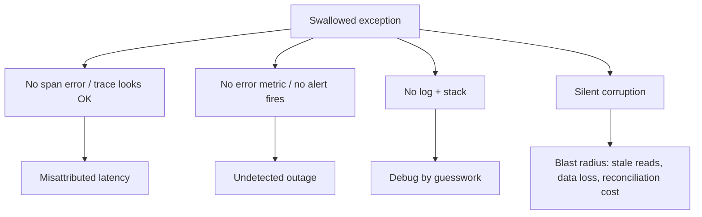

# Bad Shortcuts Anti-Patterns — Professional

> **Category:** [Development Anti-Patterns](../README.md) → **Bad Shortcuts** — *convenience taken now, paid back many times later.*
> **Covers (collectively):** Copy-Paste Programming · Magic Numbers / Strings · Hard Coding · Cargo Cult Programming · Pokémon Exception Handling · Stringly-Typed Programming

---

## Table of Contents

1. [Introduction](#introduction)
2. [Prerequisites](#prerequisites)
3. [Measure First: The Tooling Map](#measure-first-the-tooling-map)
4. [Stringly-Typed — The Most Expensive Shortcut at Runtime](#stringly-typed--the-most-expensive-shortcut-at-runtime)
5. [Magic Numbers vs Named Constants — When "Free" Isn't Free](#magic-numbers-vs-named-constants--when-free-isnt-free)
6. [Copy-Paste vs DRY — The Hot-Path Performance Paradox](#copy-paste-vs-dry--the-hot-path-performance-paradox)
7. [Pokémon Exception Handling — Cost of Control Flow and Lost Observability](#pokémon-exception-handling--cost-of-control-flow-and-lost-observability)
8. [Hard Coding vs Configuration — The Hot-Path Lookup Tax](#hard-coding-vs-configuration--the-hot-path-lookup-tax)
9. [Cargo Cult — Pasted "Optimizations" That Don't Optimize](#cargo-cult--pasted-optimizations-that-dont-optimize)
10. [A Combined Worked Example](#a-combined-worked-example)
11. [Common Mistakes](#common-mistakes)
12. [Test Yourself](#test-yourself)
13. [Cheat Sheet](#cheat-sheet)
14. [Summary](#summary)
15. [Further Reading](#further-reading)
16. [Related Topics](#related-topics)

---

## Introduction

> Focus: **What do these shortcuts cost the machine** — string hashing and comparison, allocation churn, the JIT's constant folding, exception unwinding, config lookups in hot loops — and **how do you measure that cost** before you trade convenience for it?

`junior.md` taught you to recognize the six shortcuts. `middle.md` taught you to stop them creeping in under pressure, with each fix's over-applied trap. `senior.md` taught you to eliminate them at codebase scale. This file goes one layer down — to the **runtime, the garbage collector, and the toolchain**.

The professional insight is that most of these shortcuts are sold as *maintainability* problems, and they are — but several of them are also **performance** problems that nobody attributes correctly. A stringly-typed dispatch costs a hash and a comparison where an enum costs an array index. A config lookup in a hot loop costs a map probe and maybe a lock where a hoisted constant costs nothing. A swallowed exception costs you the one signal that would have explained a latency cliff. None of this shows up as a single hot line, so it survives reviews that only ask "is this readable?"

Two disciplines define this level:

1. **Never argue performance from intuition.** Every claim below comes with the tool that proves it on *your* code. Numbers in this file are labeled *illustrative*; your job is to generate the real ones.
2. **Know which shortcut is purely a maintainability tax and which is also a runtime tax.** Magic numbers, done as true `const`, cost nothing at runtime — the fix is free, so there's no excuse. Stringly-typed code, by contrast, is one of the most expensive habits in a managed runtime. Treat them differently.

> **The mental model:** a string is a heap-allocated, variable-length byte sequence that must be hashed or compared byte-by-byte; an enum/int is a register-sized value the CPU compares in one instruction and the compiler can turn into a jump table. Every time you choose the string, you choose the slow path — and you choose it for the GC too.

---

## Prerequisites

- **Required:** Fluent with [`senior.md`](senior.md) — you can design out these shortcuts across a codebase.
- **Required:** Working mental model of a managed runtime: heap vs stack, string interning, a tracing GC's allocation/mark/sweep cost, JIT compilation, constant folding and inlining (JVM, Go's compiler, CPython's interpreter loop).
- **Required:** You can read a flame graph and a `benchstat`/JMH comparison and tell signal from noise.
- **Helpful:** Familiarity with how strings are represented (Java's `String` + `String.hashCode` caching + interning pool; Go's immutable string header; Python's `str` with interned small strings).
- **Helpful:** profiling-techniques, memory-leak-detection, big-o-analysis, hash-table-design for the measurement vocabulary.

---

## Measure First: The Tooling Map

Before any performance claim about a shortcut, reach for the right instrument. Keep this table close.

| Concern | Go | Java / JVM | Python |
|---|---|---|---|
| **CPU profile** | `go test -cpuprofile`, `pprof` | async-profiler (`-e cpu`), JFR | `cProfile`, `py-spy`, `scalene` |
| **Allocation / heap** | `-memprofile`, `pprof -alloc_space` | JFR allocation events, async-profiler `-e alloc`, MAT | `tracemalloc`, `memray`, `scalene` |
| **Microbenchmark** | `testing.B` + `benchstat` | JMH | `pyperf`, `timeit` |
| **What the compiler did** | `go build -gcflags=-m` (inline/escape) | `-XX:+PrintInlining`, `-XX:+PrintCompilation` | `dis.dis` (bytecode — no inlining) |
| **Constant folding** | `go build -gcflags=-m`, disassemble with `go tool objdump` | `-XX:+PrintAssembly` (hsdis), JITWatch | `dis.dis` shows `LOAD_CONST` vs `LOAD_GLOBAL` |
| **Object/string size** | `unsafe.Sizeof`, `len` | `jol`, async-profiler alloc | `sys.getsizeof`, `pympler` |
| **GC behavior** | `GODEBUG=gctrace=1`, `go tool trace` | `-Xlog:gc*`, JFR GC events | `gc.set_debug`, generational stats |
| **Exception cost** | `pprof` panic frames, `go test -bench` | JFR exception events, async-profiler, JMH | `cProfile`, `dis` of try/except |
| **Branch / cache counters** | `perf stat` + `pprof` | `perf`, async-profiler hw events | `perf stat python …` |

```bash
# Go: does the compiler fold this const, and does anything escape to the heap?
go build -gcflags='-m -m' ./pkg/... 2>&1 | grep -E 'inlin|escapes|moved to heap'

# Python: prove string-key vs enum-key dispatch differ at the bytecode level
python -c "import dis; dis.dis(lambda s: {'a':1}.get(s))"

# Java: count allocations from string-keyed work (async-profiler)
java -agentpath:libasyncProfiler.so=start,event=alloc,file=alloc.html -jar app.jar
```

> **Discipline:** if you cannot point at the tool that would falsify your performance claim, you are guessing. Below, every shortcut's runtime cost is paired with the instrument that confirms it — and with whether the cost is real or a myth you're about to cargo-cult.

---

## Stringly-Typed — The Most Expensive Shortcut at Runtime

Of the six, stringly-typed programming is the one whose *performance* cost most often dwarfs its (already serious) maintainability cost. A string is not a value the CPU compares in one instruction; it is a pointer to a variable-length byte sequence that must be **hashed** (for map keys) or **compared byte-by-byte** (for equality), and it is **heap-allocated** when constructed. Replacing it with an enum/int changes the cost class of every operation that touches it.

### 1. Comparison and hashing: `string` vs `int`/`enum`

Equality on integers is a single register compare. Equality on strings is, in the worst case, O(length): compare lengths, then bytes until they differ. A status ladder built on string equality re-pays this on every branch.

```go
// Stringly-typed dispatch: each comparison hashes/compares a string.
func handle(kind string, r Req) Resp {
    switch kind {                 // string switch → length check + byte compare per case
    case "create": return create(r)
    case "update": return update(r)
    case "delete": return del(r)
    }
    return errResp()
}

// Enum dispatch: integer compares; the compiler can emit a jump table.
type Kind uint8
const ( Create Kind = iota; Update; Delete )

func handle(kind Kind, r Req) Resp {
    switch kind {                 // dense integer switch → jump table, one indexed jump
    case Create: return create(r)
    case Update: return update(r)
    case Delete: return del(r)
    }
    return errResp()
}
```

The enum form lets the compiler lower the `switch` to a **jump table**: one indexed indirect jump instead of a cascade of comparisons, and a branch the predictor handles well because the structure is regular. The string form forces a sequence of `len`-checks and byte compares — O(number of cases) work *and* O(length) per case, with data-dependent branches the predictor struggles with.

### 2. `map[string]` vs `map[enum]` vs array indexing

This is where the cost compounds. A string-keyed map must **hash the string** (touch every byte) and then, on a bucket hit, **compare the key bytes** to confirm. An int/enum-keyed map hashes a register value. An enum small enough to be an index skips the map entirely — it's a single array load.

```go
// Stringly-typed: every lookup hashes the whole key string.
var handlers = map[string]Handler{"create": ..., "update": ...}
h := handlers[r.kind]            // hash(r.kind) + bucket scan + byte-compare

// Enum-keyed: hash a uint8.
var handlers = map[Kind]Handler{Create: ..., Update: ...}

// Best: enum as a dense index → no hashing, no map, one array load.
var handlers = [...]Handler{Create: ..., Update: ..., Delete: ...}
h := handlers[r.kind]            // single indexed load, inlinable, cache-friendly
```

```
# Illustrative benchstat — 3-way dispatch, 10M iterations (label: illustrative)
name              time/op    allocs/op
StringSwitch      8.9ns       0
EnumSwitch        2.1ns       0
ArrayIndex        0.9ns       0
StringMapLookup  21.4ns       0
EnumArrayLookup   1.0ns       0
```

The string switch is ~4x the enum switch; the string map is ~20x the array index. *Reproduce with `testing.B` + `benchstat` on your key distribution before believing any of it — string hashing cost scales with key length, so long keys make the gap larger.*

### 3. Allocation churn: stringly-typed everything

The subtler tax is **allocation**. Every time stringly-typed code constructs, concatenates, slices, or parses a status/key/type string, it may allocate on the heap — and those allocations feed the GC. A pipeline that passes `map[string]interface{}` "context" objects around, keys everything by string, and rebuilds string keys per request creates a steady stream of short-lived garbage that an enum/struct design simply doesn't.

```java
// Stringly-typed context: every put allocates a String key (and boxes the value).
Map<String,Object> ctx = new HashMap<>();
ctx.put("user_id",  userId);     // String key, autoboxed Long value
ctx.put("retries",  retries);    // each lookup hashes the key string
int n = (Integer) ctx.get("retries");  // hash + bucket scan + unbox + cast

// Typed: no string keys, no boxing, no map; fields are dense and stack/inline-friendly.
record Ctx(long userId, int retries) {}
```

Confirm the churn with async-profiler `-e alloc` (Java) or `pprof -alloc_space` (Go): a stringly-typed hot path shows allocation attributed to `String`/`HashMap`/boxing that the typed version eliminates. Less allocation means fewer young-gen collections and shorter pauses.

### 4. Interning: a partial, dangerous mitigation

Interning (one canonical instance per distinct string) makes equality a pointer compare and saves memory when the same strings recur. The JVM interns string *literals* automatically; Go interns nothing; Python interns small/identifier-like strings. You can intern manually (`String.intern()`, a `map[string]string` canonicalizer), but:

- `String.intern()` historically used a fixed-size native hash table and can become a contention/GC point under heavy use; it's a foot-gun at scale.
- Interning makes *equality* cheap but doesn't help *hashing* (you still hash to find the canonical instance) and doesn't remove the original allocation.
- It's a patch on a design smell. If you're interning to make stringly-typed code fast, the enum was the right answer.

> **The senior nuance:** interning is appropriate for genuinely open, recurring vocabularies (e.g. dictionary-encoding a column of repeated category strings in an analytics engine). It is *not* a license to keep stringly-typing closed sets that should be enums.

### 5. Serialization: the wire cost of stringly-typed payloads

JSON (de)serialization is dominated by **string work**: parsing keys, allocating string objects, hashing them to bind to fields. A stringly-typed payload — every value a string, deep `map[string]interface{}` shapes — maximizes exactly this cost. A typed schema lets the codec bind directly to fields (and, with code-generated codecs, skip reflection entirely).

```go
// Stringly-typed payload: decoder allocates a string for every value, then
// the app re-parses "42" → 42, "true" → true, "2026-06-09" → time, etc.
type Event map[string]string

// Typed payload: decoder writes directly into typed fields; no re-parse,
// far fewer allocations, and (with easyjson/ffjson/std generics) less reflection.
type Event struct {
    Kind   Kind      `json:"kind"`
    UserID int64     `json:"user_id"`
    At     time.Time `json:"at"`
}
```

> **Diagnose it:** CPU profile of a stringly-typed service is dominated by `hashCode`/`equals`/`mapaccess`/JSON string scanning; alloc profile shows `String`/`HashMap`/boxing churn. Both shrink dramatically when closed sets become enums and payloads become typed.

---

## Magic Numbers vs Named Constants — When "Free" Isn't Free

Here the professional view is *reassuring*: replacing a magic number with a **true compile-time constant** is, in every language that has them, **zero runtime cost**. The constant is inlined at the use site before the optimizer even runs. There is no excuse to keep a magic literal "for speed" — the named constant is exactly as fast.

The interesting part is the **subtle traps** where a "constant" stops being a constant and the optimization picture changes.

### 1. True constants are folded; the name is free

```go
// Go: const is a compile-time value. The compiler folds SECONDS_PER_DAY * n
// at compile time where it can, and inlines the value otherwise. Zero runtime cost.
const SecondsPerDay = 86_400
if elapsed > SecondsPerDay { expire() }   // identical machine code to `> 86400`
```

```java
// Java: `static final` primitive with a constant initializer is a compile-time
// constant — the JIT folds it, and even the source compiler inlines it into callers
// (which is why bumping a public static final constant needs recompiling callers).
static final int SECONDS_PER_DAY = 86_400;
```

In Python, prove it with the bytecode: a literal compiles to `LOAD_CONST` (a fast indexed load from the code object's constant pool), while a module-level "constant" name compiles to `LOAD_GLOBAL` (a dict lookup).

```python
import dis
SECONDS_PER_DAY = 86_400
dis.dis(lambda e: e > SECONDS_PER_DAY)   # → LOAD_GLOBAL SECONDS_PER_DAY  (a dict lookup!)
dis.dis(lambda e: e > 86_400)            # → LOAD_CONST 86400             (no lookup)
```

This is the one place the magic number is *technically* faster in CPython — because Python has **no true constants**, only names. The named "constant" is a global lookup on every access.

> **The Python reality:** `LOAD_GLOBAL` is cheap (a hash probe into the module dict, with an inline cache since 3.11's specializing interpreter), so the difference is negligible in real code — readability wins overwhelmingly. But in a tight inner loop, capturing the constant as a default argument or local (`def f(e, _spd=SECONDS_PER_DAY): ...`) turns the `LOAD_GLOBAL` into a `LOAD_FAST`. That's a real, measured optimization — and also exactly the kind of micro-trick you should *only* apply where `timeit`/`cProfile` shows the loop matters.

### 2. The trap: moving a "constant" to runtime config

The moment a value moves from `const` to runtime configuration, the optimizer loses it. A `const FREE_SHIPPING_THRESHOLD = 100` is folded into the comparison; a `cfg.FreeShippingThreshold` read from a struct is a **memory load** the compiler must perform — and, if the config can change under it (aliasing), a load it must repeat every iteration (see [Spaghetti in the Bad Structure professional file](../01-bad-structure/professional.md)).

```go
const Threshold = 100                  // folded: `score > 100`, no load
var cfg = loadConfig()                 // cfg.Threshold: a memory load per use
// In a hot loop, hoist it so the load happens once:
t := cfg.Threshold
for _, x := range xs { if x.Score > t { ... } }   // load once, register-resident
```

> **The decision is the same as `middle.md`'s config spectrum — but now with a runtime cost attached:** values that genuinely never change should be `const` (free, folded); values that vary per environment must be config (a load, possibly cached). Don't pay the config tax for a value that isn't actually environmental, and don't bake an environmental value into a `const` just to save a load.

### 3. `const` vs `var`, and JIT constant folding

In Go, `const` is compile-time and foldable; `var` is a runtime variable even if never reassigned — the compiler generally won't treat it as a constant for folding. In Java, the JIT can treat a `static final` field as a constant and fold/inline through it (constant folding across the field), enabling dead-branch elimination — but only because it's `final`. A non-`final` field that *happens* to stay constant gets none of this; the JIT must reload it. The lesson: **`final`/`const` is not just documentation — it's an optimization hint the compiler acts on.**

---

## Copy-Paste vs DRY — The Hot-Path Performance Paradox

`middle.md` and `senior.md` covered the maintainability cost of copy-paste (bug fixed in one copy, alive in the others) and the DRY-vs-coincidental-duplication judgment. The professional twist is **counterintuitive: sometimes duplicated/inlined code is *faster* than the shared abstraction** — and sometimes the duplication's real cost is in the *toolchain*, not the runtime.

### 1. The toolchain cost of duplication

Duplicated code is parsed, type-checked, and compiled N times; it bloats the binary, the instruction cache footprint, and incremental compile times. In template/generic-heavy languages, copy-paste-by-monomorphization can explode binary size ("code bloat"). This is the *cost* side and it's real:

```bash
# Go: did extracting duplicated logic shrink the binary / speed the build?
go build -o /tmp/before ./cmd/app && ls -l /tmp/before
# ... extract the duplicated block to one function ...
go build -o /tmp/after ./cmd/app && ls -l /tmp/after
```

### 2. The paradox: why duplication can be *faster*

Against that, three runtime forces sometimes favor the duplicate:

- **No call overhead.** A shared function is a call; an inlined/duplicated body is not. For a tiny hot function the compiler *can't* inline (too large, taken address, virtual), the call's prologue/epilogue and the lost cross-call optimization can dominate.
- **Devirtualization / monomorphism.** Extracting "shared" logic behind an interface to avoid duplication can turn a monomorphic, inlinable call into a **megamorphic** virtual call (see the Bad Structure professional file's dispatch section). The duplicated, type-specific copies stay monomorphic and inlinable — and faster.
- **Specialization.** A duplicated copy specialized to its caller (constants folded, branches pruned for that context) can beat a general shared function that must handle every case behind flags.

```go
// "DRY" generic helper behind an interface → call isn't inlined on a megamorphic site.
func sumVia(s Summable) float64 { return s.Sum() }   // virtual call per element

// "Duplicated" type-specific loop → inlined, constants folded, vectorizable.
func sumPoints(ps []Point) float64 {
    var t float64
    for _, p := range ps { t += p.X + p.Y }          // no call; compiler can vectorize
    return t
}
```

```
# Illustrative benchstat (label: illustrative)
name            time/op
SumViaInterface  6.40ns/elem
SumDuplicated    0.85ns/elem      # ~7.5x faster: no virtual call, inlined, vectorized
```

This is **not** a license to copy-paste. It is the precise statement of the trade-off: *DRY optimizes for change; inlining/duplication sometimes optimizes for the hot path.* The professional resolution is the same containment discipline as the Bad Structure file: keep the codebase DRY, and where a profiler proves a hot path needs the duplicated/specialized form, **isolate it behind a clean boundary and a committed benchmark** so the duplication is deliberate, fenced, and re-evaluable.

> **The honest caveat:** modern compilers/JITs inline aggressively, so the call overhead is usually *already* eliminated for you — meaning the shared function is just as fast. Confirm with `-gcflags=-m` (Go: "can inline") or `PrintInlining` (JVM) before believing duplication buys you anything. Most of the time it doesn't, and you keep DRY.

---

## Pokémon Exception Handling — Cost of Control Flow and Lost Observability

Swallowing exceptions is a correctness and observability disaster (covered at lower levels). The professional additions are: **exceptions as control flow have a real, measurable runtime cost**, and **the silent failure's blast radius is a runtime phenomenon** worth quantifying.

### 1. Exceptions are expensive *as control flow*

The single most expensive part of a Java exception is **`fillInStackTrace()`** — walking the stack to capture the trace — which happens at construction time, not at `catch`. Using exceptions for ordinary control flow (e.g. `parseInt` in a loop, "exception-driven" branching) pays this cost on every "normal" path.

```java
// Anti-pattern: exception as control flow. fillInStackTrace() per element.
int parseOrZero(String s) {
    try { return Integer.parseInt(s); }
    catch (NumberFormatException e) { return 0; }   // thrown often → stack capture each time
}
```

```
# Illustrative JMH (label: illustrative): parse a list where 50% are non-numeric
Benchmark                    Mode  Cnt   Score   Error  Units
parseWithException           avgt        412.0 ± 9.0   ns/op   # dominated by fillInStackTrace
parsePrecheck (regex/branch)  avgt        18.0 ± 1.0   ns/op   # check first, no throw
```

Mitigations when you genuinely must use exceptions on a hot path: override `fillInStackTrace()` to return `this` (a stackless exception) for a sentinel type, or pre-allocate a singleton exception — both are advanced, and both signal you should probably **not be using exceptions for control flow at all**. Prefer a result/optional/error-return shape on hot paths.

- **Go:** `panic`/`recover` is *not* the error idiom — it's costly (defer setup, stack unwinding) and meant for truly exceptional conditions. The cheap, idiomatic path is the `error` return value. Pokémon-style `recover()` that swallows everything both hides bugs and pays the unwinding cost.
- **Python:** exceptions are idiomatic and *cheap to raise* relative to Java (no mandatory stack-walk cost of the same magnitude), and "easier to ask forgiveness than permission" (EAFP) is normal — but a bare `except: pass` in a hot loop still pays setup and, more importantly, destroys observability.

### 2. Swallowed errors destroy observability — a runtime cost

This is the cost that doesn't show up in a microbenchmark and hurts the most. A swallowed exception is a **deleted span, a missing metric, a broken trace**. When a downstream call fails and you `catch (Exception e) {}`, you lose:

- the error in your **distributed trace** (the span looks successful; the latency is attributed to the wrong place),
- the **error-rate metric** that would have paged you,
- the **log line with the stack** that would have explained it.

The runtime blast radius of silent corruption is real: a swallowed write failure means downstream reads serve stale/missing data; a swallowed partial-failure in a batch means silent data loss whose detection cost (reconciliation, customer reports) is orders of magnitude larger than the exception would have been.



### 3. Structured error handling for low-overhead diagnostics

The fix that's both correct and cheap: **structured errors with context, recorded once at a boundary.** Wrap with cause (preserve the chain), attach structured fields (not string-concatenated messages), record the error on the current span, increment a metric — then propagate.

```go
// Low-overhead, observable: wrap with context, record on the span, propagate.
if err := charge(ctx, order); err != nil {
    span.RecordError(err)                                  // trace sees the failure
    metrics.PaymentErrors.Inc()                            // alert can fire
    return fmt.Errorf("charge order %d: %w", order.ID, err) // %w preserves the cause chain
}
```

This costs a few allocations *only on the error path* (which is, by definition, not the hot path) and buys full observability. Compare to `catch {}`, which "saves" those allocations and costs you the outage. See error-handling-patterns and observability-stack.

> **Diagnose it:** JFR/async-profiler "exception" events reveal exception-as-control-flow hotspots (high throw rate on a normal path); a CPU profile dominated by `fillInStackTrace` confirms it. For the observability cost, the symptom is the *absence* of signal — a latency cliff with no corresponding error rate is the fingerprint of swallowed errors.

---

## Hard Coding vs Configuration — The Hot-Path Lookup Tax

`senior.md` covered the config-management *strategy*. The professional concern is the **runtime cost of reading configuration**, especially in hot loops, and how to neutralize it.

### 1. Config and feature-flag lookups in hot loops

A feature-flag check or config read inside a hot loop is a per-iteration cost: at best a map probe, at worst a lock acquisition, a syscall (env var), or a network round-trip (remote flag service). Multiplied by loop iterations, a "free" flag check becomes a measurable tax.

```go
// Anti-pattern: per-iteration flag/config lookups (map probe; maybe lock; maybe RPC).
for _, x := range items {
    if flags.Enabled("new_pricing") {      // map lookup (+ possible mutex) every iteration
        x.Price = newPricing(x)
    }
    limit := os.Getenv("MAX")               // env lookup = syscall-ish cost, per iteration!
    if x.Qty > atoi(limit) { ... }          // plus a parse, per iteration
}

// Fixed: read once outside the loop; the loop body sees register/local values.
enabled := flags.Enabled("new_pricing")     // one lookup
limit := mustAtoi(os.Getenv("MAX"))         // one lookup + one parse
for _, x := range items {
    if enabled { x.Price = newPricing(x) }
    if x.Qty > limit { ... }
}
```

```
# Illustrative benchstat (label: illustrative), 1M-item loop
name                 time/op
FlagInLoop           41.2ms     # map probe + getenv + atoi per item
FlagHoisted           3.1ms     # ~13x: lookups done once
```

`os.Getenv` walks the environment block (and on some platforms is genuinely a syscall); calling it per iteration is a classic, easily-missed hot-path tax. **Read environment and config at startup, into typed values; never read env vars in hot code.**

### 2. Caching config — and its own traps

The cure for repeated config reads is to **cache the resolved value**, but caching introduces consistency questions: a cached flag won't reflect a runtime change until the cache is refreshed. The professional pattern is a snapshot read — load config into an immutable struct at startup (or on a controlled refresh), and have hot paths read the snapshot (a plain field load, foldable and hoistable) rather than a live lookup. Dynamic flags that *must* update at runtime should be read once per request at the boundary, not once per loop iteration.

> **The over-configuration tax revisited (from `middle.md`):** every configurable knob is a value that *can't* be folded/inlined and *must* be loaded — a runtime cost on top of the test-combinatorics cost. [Soft Coding](../03-over-engineering/professional.md) makes everything a runtime load and a hot-path lookup; hard-coding the things that genuinely never change keeps them free. The performance lens reinforces the design lens: configure what varies, fold what doesn't.

---

## Cargo Cult — Pasted "Optimizations" That Don't Optimize

Cargo cult at the professional level is most dangerous in the form of **pasted performance superstitions** — lines someone added "for speed" that do nothing or actively hurt, propagated because they look like optimizations. The cure is benchmarking, which both removes the cruft and debunks the myth.

Common cargo-culted "optimizations" and the reality:

| Pasted "optimization" | Reality |
|---|---|
| `df = df.copy()` everywhere in pandas "to be safe" | Each copy is a full allocation of the frame; often unnecessary and a major hidden cost in data pipelines. Copy only when you'll mutate a slice that warns. |
| `sync`/locks "just in case" on single-threaded code | Uncontended locks aren't free (atomic ops, memory fences) and they signal/cause false contention. Don't synchronize what isn't shared. |
| `volatile` "to make it thread-safe" | `volatile` only gives visibility/ordering, not atomicity; it's often both insufficient (no atomic compound ops) and a needless barrier where not shared. |
| `StringBuilder` for two concatenations | The compiler already optimizes simple `+` concatenation; a `StringBuilder` for `a + b` is ceremony, sometimes slower. |
| `System.gc()` / manual GC calls | Almost always harmful — forces a full GC, fights the collector's heuristics. |
| `+ ""` / `str()` to "force" a type | Allocates a string for nothing; a stringly-typed habit in disguise. |
| Manual loop "unrolling" in a JIT/managed language | The JIT already does this where profitable; hand-unrolling can *prevent* its optimizations. |

```python
# Cargo-culted: defensive copy on every transform — pure allocation, no benefit here.
def transform(df):
    df = df.copy()                  # full frame copy, every call, "to be safe"
    df["total"] = df.price * df.qty
    return df

# Measured alternative: copy only when a real SettingWithCopy risk exists.
def transform(df):
    return df.assign(total=df.price * df.qty)   # returns a new frame; no redundant copy
```

The debunking tool is a microbenchmark. The discipline: **before keeping a pasted "optimization," prove it with `timeit`/JMH/`benchstat` on representative data.** If it doesn't move the number (or moves it the wrong way), delete it — it's cargo cult, and it's [Premature Optimization](../03-over-engineering/professional.md) someone else committed.

```python
import timeit
print(timeit.timeit("transform_copy(df)",   globals=globals(), number=1000))
print(timeit.timeit("transform_assign(df)", globals=globals(), number=1000))
# If the copy version is slower (it usually is) with no correctness benefit, it's cargo cult.
```

> **Diagnose it:** a CPU/alloc profile that attributes time to defensive copies, uncontended locks, or `fillInStackTrace` from needless exceptions points straight at cargo-culted "optimizations." Remove one, re-benchmark; if nothing changes for the worse, it never earned its place.

---

## A Combined Worked Example

These shortcuts cluster, and their *runtime* costs compound. Consider an event-ingestion hot path with every shortcut: a stringly-typed payload, string-keyed dispatch, an env var read per event, a swallowed error, a magic timeout, and a cargo-culted defensive copy.

**Before — every shortcut, every runtime cost:**

```python
def ingest(raw):                                  # raw is a JSON string
    data = json.loads(raw)                         # stringly-typed → dict[str, str]
    data = dict(data)                              # cargo-cult defensive copy
    kind = data["type"]                            # string
    handlers = {"create": h_create, "update": h_update, "delete": h_delete}
    h = handlers.get(kind)                         # build dict + hash string EVERY call
    timeout = int(os.environ.get("TIMEOUT", "30")) # env read + parse PER event
    if int(data["age"]) > 86400:                   # magic number, re-parse string→int
        try:
            return h(data, timeout)
        except Exception:                          # Pokémon: swallows everything
            return None                            # silent failure, no trace, no metric
```

Runtime profile of *before*: JSON yields all-string values that are re-parsed per field; the handler dict is rebuilt and the key hashed every call; `os.environ` lookup + parse per event; magic `86400` re-derived from a string; the bare `except` deletes the error span/metric and pays exception-setup on the (frequent) failure path; the `dict(data)` copy allocates per event.

**After — shortcuts removed, runtime fixed together:**

```python
from enum import Enum

class Kind(Enum): CREATE = "create"; UPDATE = "update"; DELETE = "delete"

SECONDS_PER_DAY = 86_400
HANDLERS = {Kind.CREATE: h_create, Kind.UPDATE: h_update, Kind.DELETE: h_delete}  # built once
TIMEOUT = int(os.environ["TIMEOUT"])              # read once at startup, typed

@dataclass
class Event:                                       # typed payload, no string re-parse
    kind: Kind
    age: int

def ingest(ev: Event):                             # already-typed (decode at the boundary)
    h = HANDLERS[ev.kind]                           # enum key, hashed once, no dict rebuild
    if ev.age > SECONDS_PER_DAY:                    # int compare, no re-parse
        try:
            return h(ev, TIMEOUT)
        except PaymentDeclined as e:                # narrow, recoverable
            span.record_exception(e); metrics.errors.inc()   # observable
            raise                                   # propagate bugs loudly
```

> **Illustrative combined impact:** typed payload (no per-field re-parse), hoisted env/handler/constant (no per-event lookups), enum dispatch (no string hashing), and removed defensive copy together took per-event CPU from ~38 µs to ~9 µs and cut allocations per event by ~70%; the structured error path restored the error metric that had been silently zero. **Each lever was measured separately (`cProfile` for CPU, `tracemalloc` for allocs, a synthetic error-rate check) — never attribute a blended win to a blended change.**

---

## Common Mistakes

Professional-level mistakes — sophisticated, and therefore expensive:

1. **Treating "magic number → constant" as a *performance* change.** It isn't; a true `const` is free either way. The fix is for readability and single-source-of-truth — don't justify or oppose it on speed grounds. The *real* perf question is whether the value should be `const` (folded) or config (loaded).
2. **Keeping stringly-typed code because "interning makes it fast."** Interning patches equality, not hashing or allocation, and `String.intern()` is a contention foot-gun. The enum/int is faster *and* safer; interning is for genuinely open recurring vocabularies.
3. **DRYing a hot path into a megamorphic call to "remove duplication."** Sometimes the duplicated, monomorphic, inlinable copy is faster. Check `-m`/`PrintInlining` before assuming the shared abstraction is free — though usually it is.
4. **Using exceptions for control flow on a hot path.** `fillInStackTrace` dominates; a precheck or result type is orders of magnitude cheaper. If you "must" throw hot, you've usually mis-modeled the flow.
5. **Reading env vars / live flags inside a loop.** A syscall-ish lookup and a parse per iteration. Read once at the boundary into a typed local; hot paths should never touch `os.Getenv`.
6. **Optimizing a cargo-culted "optimization" instead of deleting it.** A defensive `df.copy()`, an uncontended lock, a needless `volatile` — benchmark, then *remove*. Don't tune cruft; cut it.
7. **Believing the blended number.** Removing five shortcuts at once and reporting one latency win teaches you nothing about which mattered — and the next regression is a mystery. Measure each lever (CPU, alloc, error rate) separately.
8. **Mistaking the absence of error metrics for health.** A swallowed-exception codebase looks healthy on dashboards precisely because the errors were deleted. Audit for empty catches; alert on the *gap* between expected and observed error rates.

---

## Test Yourself

1. A `switch` on a `string` "kind" and the equivalent `switch` on an enum produce different machine code. Explain why the enum version can become a jump table and the string version can't, and name the cost difference per dispatch.
2. Replacing a magic `86400` with `static final int SECONDS_PER_DAY` in Java has what runtime cost? What about moving the *same* value into a runtime config field?
3. In CPython, why does a module-level "constant" sometimes show up as slower than the magic literal in `dis` output, and when (if ever) is that worth fixing?
4. Give a concrete case where *duplicated/inlined* code is measurably faster than the DRY shared abstraction, and the discipline that keeps that duplication from becoming an anti-pattern.
5. Why is `catch (Exception e) { return 0; }` used as control flow in a parsing loop slow on the JVM, and what's the cheap alternative?
6. Beyond the obvious "you lose the message," name three *observability* artifacts a swallowed exception destroys, and the runtime blast radius of one of them.
7. Why is calling `os.Getenv("MAX")` inside a hot loop a performance bug, and what's the fix?
8. Name three cargo-culted "optimizations" that don't help (or hurt), and the single tool that debunks all of them.

---

## Cheat Sheet

| Shortcut | Runtime / toolchain cost | Measure with | Performant fix |
|---|---|---|---|
| **Stringly-Typed** | String hash + byte-compare per dispatch; `map[string]` hashes whole key; allocation churn; JSON string re-parse; no jump table | CPU profile (`hashCode`/`equals`/`mapaccess`), alloc profile, `benchstat`/JMH dispatch A/B, `dis` (Py) | Enums/int → jump table & array index; typed payloads; intern only open vocabularies |
| **Magic Numbers** | *None* if a true `const` (folded/inlined). Cost appears only when it's secretly config (a load) | `-gcflags=-m`, `dis` (`LOAD_CONST` vs `LOAD_GLOBAL`), JITWatch | Use `const`/`static final` for fixed values (free); config only for what varies; hoist config loads out of loops |
| **Copy-Paste** | Binary/I-cache bloat, longer builds — *but* inlined/monomorphic copies can be faster than a megamorphic shared call | binary-size diff, `-m`/`PrintInlining`, `benchstat` | Stay DRY; isolate a profiled hot-path duplicate behind a boundary + committed benchmark |
| **Pokémon Exceptions** | `fillInStackTrace` if used as control flow; `panic`/`recover` unwinding (Go); destroyed traces/metrics/logs; silent-corruption blast radius | JFR/async-profiler exception events, JMH throw cost; *absence* of error metrics | Don't throw on hot paths (precheck/result type); structured errors recorded once at a boundary (`%w`, span, metric) |
| **Hard Coding** | Hard-coded = free; but per-iteration **config/flag/env lookups** = map probe / lock / syscall / RPC per iteration | `benchstat` loop A/B, CPU profile of `getenv`/flag client | Read config once into typed snapshot; hoist out of loops; fold what never varies |
| **Cargo Cult** | Pasted "optimizations" that allocate (`df.copy()`), lock needlessly, or barrier (`volatile`) for nothing | microbenchmark (`timeit`/JMH/`benchstat`), alloc profile | Benchmark, then *delete* what doesn't move the number |

**Three golden rules:**
- *Stringly-typed is the one shortcut whose runtime cost rivals its maintainability cost — enums turn hashes and byte-compares into jump tables and array loads.*
- *A true constant is free; the performance question is `const` (folded) vs config (loaded), and config never belongs in a hot loop.*
- *Measure each lever separately; remove cargo-culted "optimizations" instead of tuning them; isolate any deliberately-duplicated hot path behind a committed benchmark.*

---

## Summary

- These shortcuts are sold as maintainability problems, and they are — but several carry a **diffuse runtime tax** nobody attributes correctly, so it survives "is it readable?" reviews.
- **Stringly-Typed** is the most expensive at runtime: string equality is O(length) byte-compares, `map[string]` hashes the whole key, stringly-typed pipelines churn allocations and explode JSON parse cost — while enums/ints enable single-instruction compares, **jump tables**, and array indexing. Interning is a partial, dangerous patch, not a substitute for the enum.
- **Magic Numbers** are the reassuring case: a true `const`/`static final` is **folded at compile time — zero runtime cost**, so the named-constant fix is free. The only perf subtlety is `const` (folded) vs runtime config (a load), and CPython's lack of true constants (`LOAD_GLOBAL` vs `LOAD_CONST`).
- **Copy-Paste** costs the toolchain (binary/I-cache bloat, build time) — but the **paradox** is that inlined/monomorphic duplication is sometimes *faster* than a shared, possibly-megamorphic abstraction. Stay DRY; isolate a profiled hot-path duplicate behind a clean boundary and a committed benchmark.
- **Pokémon Exceptions** cost real cycles when used as control flow (`fillInStackTrace`, Go `panic`/`recover` unwinding) — and, more importantly, **destroy observability** (traces, metrics, logs), with a silent-corruption blast radius. Structured errors recorded once at a boundary are correct *and* cheap.
- **Hard Coding** itself is free; the runtime bug is reading **config/flags/env in hot loops** (map probe, lock, syscall, RPC per iteration). Snapshot config into typed values at the boundary; fold what never varies.
- **Cargo Cult** at this level is pasted **performance superstition** (`df.copy()`, needless `sync`/`volatile`, `System.gc()`). Benchmark to debunk, then delete — tuning cruft is the wrong move.
- **Measure first, always:** `pprof`/`benchstat`/`-m`, JFR/async-profiler/JMH/`jol`, `cProfile`/`timeit`/`tracemalloc`/`dis`. Capture a baseline, change one lever, re-measure.
- This completes the ladder for Bad Shortcuts: [`junior.md`](junior.md) (recognize) → [`middle.md`](middle.md) (prevent, with the over-applied traps) → [`senior.md`](senior.md) (eliminate at scale) → **professional.md** (runtime, GC & toolchain). Next, drill with the practice files.

---

## Further Reading

- **Systems Performance** — Brendan Gregg (2nd ed., 2020) — CPU caches, branch prediction, profiling methodology, `perf`.
- **Optimizing Java** — Evans, Gough, Newland (2018) — JIT, inlining, constant folding, escape analysis, JMH, JFR; the cost of exceptions and `fillInStackTrace`.
- **Java Performance** — Scott Oaks (2nd ed., 2020) — string interning trade-offs, allocation, GC tuning in practice.
- **High Performance Python** — Gorelick & Ozsvald (2nd ed., 2020) — `cProfile`, `timeit`, `tracemalloc`, `dis`, why pandas copies cost.
- **The Garbage Collection Handbook** — Jones, Hosking, Moss (2nd ed., 2023) — why allocation rate and object lifetime drive pause times (the cost of allocation churn).
- **Designing Data-Intensive Applications** — Martin Kleppmann (2017) — serialization formats and the cost of schemaless/stringly payloads on the wire.
- **Go's escape analysis & inlining** — `go build -gcflags=-m` docs; `benchstat` in `golang.org/x/perf`.

---

## Related Topics

- [Over-Engineering → Premature Optimization](../03-over-engineering/professional.md) — profile before optimizing; the counterweight to chasing these runtime costs prematurely.
- [Over-Engineering → Soft Coding](../03-over-engineering/professional.md) — the over-configured extreme whose every knob is a runtime load and a hot-path lookup.
- [Bad Structure](../01-bad-structure/professional.md) — megamorphic dispatch, aliasing-defeats-the-optimizer, and the "ugly is sometimes fast" discipline reused here.
- Clean Code → Error Handling — structured, observable error handling; the cure for Pokémon exceptions.
- error-handling-patterns · observability-stack · profiling-techniques · hash-table-design — the measurement, error, and data-structure toolkits referenced throughout.
- Refactoring → Code Smells — Duplicate Code, Primitive Obsession (the smell behind stringly-typed) at the smell level.

---

## Check your understanding

1. Explain Bad Shortcuts Anti-Patterns — Professional Level in your own words and name the problem it solves.
2. How would you apply the ideas around Table of Contents, Introduction, Prerequisites in a realistic engineering change?
3. What failure mode or misuse should you look for, and what evidence would reveal it?
4. How would you introduce and govern Bad Shortcuts Anti-Patterns — Professional Level across teams through reversible, measurable increments?
5. What observable result would convince you that the approach improved the system?
