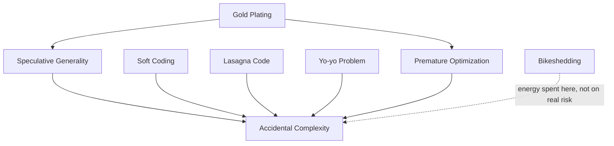

# Over-Engineering Anti-Patterns — Junior

> **Category:** [Development Anti-Patterns](../README.md) → **Over-Engineering** — *effort spent solving problems you don't have.*
> **Covers (collectively):** Premature Optimization · Speculative Generality · Gold Plating · Yo-yo Problem · Lasagna Code · Accidental Complexity · Soft Coding · Bikeshedding

---

## Introduction

> Focus: **What does it look like?** and **Why is it bad?**

The other development anti-patterns are about doing *too little* — too little structure ([Bad Structure](../01-bad-structure/junior.md)) or too little care ([Bad Shortcuts](../02-bad-shortcuts/junior.md)). This family is the opposite failure: **doing too much.** Building flexibility nobody asked for, optimizing code that isn't slow, adding layers that add nothing, polishing features beyond the requirement, and arguing about trivia while the real work waits.

Over-engineering is sneaky because it doesn't *feel* like a mistake — it feels like diligence, craftsmanship, "thinking ahead." But every line of code you write is a line someone must read, test, and maintain forever. Code you add "just in case" is a permanent cost paid for a benefit that usually never arrives.

The two guiding principles that fight over-engineering are old and blunt:

- **YAGNI** — *You Aren't Gonna Need It.* Build for the requirement in front of you, not the one you imagine.
- **KISS** — *Keep It Simple, Stupid.* The simplest thing that solves the actual problem is usually the right thing.

At the junior level your goal is to recognize when "being thorough" has tipped into solving problems you don't have — and to feel comfortable writing the *simple* version.

> **The mindset shift:** the goal isn't the most clever or future-proof code — it's the simplest code that correctly solves today's real problem and is easy to change when tomorrow's real problem actually shows up.

---

## Prerequisites

- **Required:** You can write functions and classes, and you've used abstraction (interfaces, inheritance, configuration) at least a little.
- **Required:** You understand what "requirements" are — what the code is actually being asked to do.
- **Helpful:** You've read [Bad Structure](../01-bad-structure/junior.md) — over-engineering often *causes* the structure problems (Lasagna is the inverse of Spaghetti; Speculative Generality is a [Boat Anchor](../01-bad-structure/junior.md)).
- **Helpful:** You've felt the frustration of reading code that's "too clever" to follow.

---

## Glossary

| Term | Definition |
|------|-----------|
| **YAGNI** | "You Aren't Gonna Need It" — don't build features/flexibility until a real requirement demands them. |
| **KISS** | "Keep It Simple, Stupid" — prefer the simplest solution that works. |
| **Premature** | Done before there's evidence it's needed (optimization, generalization). |
| **Abstraction** | A layer that hides detail. Useful when it earns its keep; over-used, it becomes noise. |
| **Essential complexity** | Complexity inherent to the problem itself — unavoidable. |
| **Accidental complexity** | Complexity *we* added through our solution — avoidable. (Term from *No Silver Bullet*, Fred Brooks.) |
| **Indirection** | A layer that points to another layer instead of doing the work. Some helps; too much is Lasagna. |
| **Bikeshedding** | Spending disproportionate time on a trivial decision (Parkinson's Law of Triviality). |

---

## The Eight at a Glance

| Anti-pattern | One-line symptom | The cost |
|---|---|---|
| **Premature Optimization** | Tuning code before profiling | Complexity for speed you didn't need |
| **Speculative Generality** | Abstractions for imagined futures | Unused flexibility, harder to read |
| **Gold Plating** | Features beyond what was asked | Wasted effort, more to maintain |
| **Yo-yo Problem** | Bouncing up/down an inheritance chain | Can't find where behavior lives |
| **Lasagna Code** | Too many thin layers | Open 8 files to follow one call |
| **Accidental Complexity** | Self-inflicted difficulty | Hard problem made harder |
| **Soft Coding** | Everything configurable | Logic hidden in config; nobody can read it |
| **Bikeshedding** | Endless debate over trivia | Real decisions starved of attention |

---

## Premature Optimization

### What it looks like

Hand-tuning code for performance *before* you have any evidence it's a bottleneck — replacing clear code with cryptic "fast" code, building a custom data structure, or micro-managing memory, all on a hunch.

```go
// Go — "optimized" before any profiling. Cryptic, and probably not the bottleneck.
func sumEven(nums []int) int {
    s, i, n := 0, 0, len(nums)
    for ; i < n-3; i += 4 {              // manual loop unrolling
        if nums[i]&1 == 0 { s += nums[i] }
        if nums[i+1]&1 == 0 { s += nums[i+1] }
        if nums[i+2]&1 == 0 { s += nums[i+2] }
        if nums[i+3]&1 == 0 { s += nums[i+3] }
    }
    for ; i < n; i++ { if nums[i]&1 == 0 { s += nums[i] } }
    return s
}
```

### Why it's bad

- **You're guessing.** Without measuring, you usually optimize the wrong thing — the real bottleneck is elsewhere (often I/O, not CPU).
- **You trade away clarity for nothing.** The clever version is harder to read, test, and change — a permanent cost for a speed-up that may be irrelevant.
- **Donald Knuth's famous line:** *"Premature optimization is the root of all evil."* He meant: get it correct and clear first; optimize the measured hot spots later.

### The junior-level fix

Write the clear, simple version first. If something is slow, **profile** to find the actual bottleneck, then optimize *that* — with a benchmark proving it helped.

```go
func sumEven(nums []int) int {
    s := 0
    for _, n := range nums {       // clear, idiomatic, fast enough until proven otherwise
        if n%2 == 0 { s += n }
    }
    return s
}
```

> **Smell test:** if you're making code faster but can't point to a measurement showing it's slow, stop. Clarity first; optimize what the profiler flags.

---

## Speculative Generality

### What it looks like

Building abstraction "for the future" — extra parameters, hooks, abstract base classes, plugin systems — when there's exactly one current use case.

```java
// Java — a configurable, pluggable "engine" to greet someone. One caller. One greeting.
interface GreetingStrategy { String greet(String name); }
class DefaultGreetingStrategy implements GreetingStrategy {
    public String greet(String name) { return "Hello, " + name; }
}
class GreetingEngine {
    private final GreetingStrategy strategy;
    GreetingEngine(GreetingStrategy s) { this.strategy = s; }
    String run(String name) { return strategy.greet(name); }
}
// Usage that a one-line function would have covered:
new GreetingEngine(new DefaultGreetingStrategy()).run("Sam");
```

### Why it's bad

- **You pay now for a maybe-later.** The flexibility is real cost (more code, more indirection) for a use case that usually never arrives.
- **It's a [Boat Anchor](../01-bad-structure/junior.md).** Unused extension points still must be read, understood, and maintained.
- **It's often wrong anyway.** When the real second use case shows up, it rarely matches what you guessed, so you rebuild the abstraction.

### The junior-level fix

Write the concrete, simple version for the one case you actually have. Generalize *when the second real case appears* — you'll design it better against reality.

```java
String greet(String name) { return "Hello, " + name; }   // YAGNI
```

> **Smell test:** "we might need to swap this out someday" with no current second implementation is speculative. One use case → one concrete implementation.

---

## Gold Plating

### What it looks like

Adding features, options, or polish **beyond what was asked for**, on your own initiative — the export feature also gains PDF, XML, and email-it options nobody requested.

```python
# Task: "save the report to a file."
# What got built:
def save_report(report, path, *, fmt="txt", compress=False, encrypt=False,
                email_to=None, watermark=None, theme="dark", retries=3):
    ...   # 200 lines implementing options nobody asked for
```

### Why it's bad

- **Wasted effort** on work that delivers no value — time that the real backlog needed.
- **More surface to maintain, test, and document** — every unused option is a liability and a place for bugs.
- **It delays delivery** and can introduce risk into a feature that should have been simple.

### The junior-level fix

Build exactly what the ticket asks for. If you spot a genuinely valuable addition, raise it as a separate item for the team to prioritize — don't smuggle it in.

```python
def save_report(report, path):
    path.write_text(report.render())   # exactly the requirement
```

> **Smell test:** if a reviewer asks "where did this option come from?" and the answer is "I thought it'd be nice," it's gold plating. Scope to the ticket.

---

## Yo-yo Problem

### What it looks like

To understand what a piece of code does, you have to bounce **up and down a deep inheritance hierarchy** — the behavior is scattered across `A extends B extends C extends D`, and the method you want is overridden three levels up and called from two levels down.

```java
class Animal        { void move() { step(); } protected void step(){...} }
class Mammal extends Animal     { protected void step(){ super.step(); ... } }
class Dog    extends Mammal     { protected void step(){ ... super.step(); } }
class Puppy  extends Dog        { protected void step(){ ... } }
// To answer "what does puppy.move() do?" you yo-yo through four files.
```

### Why it's bad

- **Behavior has no single home.** Reading one class never tells the whole story; you climb the chain.
- **Fragile.** A change in a base class silently alters every subclass — the *fragile base class* problem.
- **Cognitive overload** to trace even simple behavior.

### The junior-level fix

Prefer **composition over inheritance**: give a class the behavior it needs as a collaborator instead of inheriting a tower of it. Keep inheritance shallow (one level is usually plenty).

```java
class Dog {
    private final Gait gait;          // composed behavior, lives in one place
    Dog(Gait gait) { this.gait = gait; }
    void move() { gait.step(); }      // no climbing required
}
```

> **Smell test:** if answering "what does this method do?" means opening three parent classes, the hierarchy is too deep. Flatten it; compose.

---

## Lasagna Code

### What it looks like

The inverse of [Spaghetti](../01-bad-structure/junior.md): **too many thin layers**, each adding almost nothing. Following one call means opening eight files, each just forwarding to the next.

```text
Controller → Service → Manager → Handler → Helper → Repository → DAO → Mapper
   (each layer just calls the next and renames the arguments)
```

```java
// Each layer "delegates" without adding value
class OrderService  { Order get(int id){ return manager.get(id); } }
class OrderManager  { Order get(int id){ return handler.get(id); } }
class OrderHandler  { Order get(int id){ return repo.get(id); } }
// ...four more hops to reach the actual query.
```

### Why it's bad

- **Pure overhead to read.** You traverse many files to find the one line that does work.
- **Every change ripples** through all the pass-through layers.
- **The layers don't earn their keep** — a layer is justified only if it adds a real responsibility (validation, mapping, transactions), not if it just forwards.

### The junior-level fix

Collapse pass-through layers. Keep a layer only when it has a genuine, distinct job. Two or three meaningful layers beat eight empty ones.

> **Smell test:** if a class's methods only call the next class and rename the parameters, it's a Lasagna layer — inline it.

---

## Accidental Complexity

### What it looks like

Difficulty that comes from **our solution**, not from the problem. The problem is simple; the code around it is tangled with framework ceremony, needless abstraction, and clever tricks.

```python
# Problem: turn a list of names into uppercase. Essentially one line.
# Accidental complexity: a "pipeline framework" for a map().
class Transformer:
    def __init__(self, steps): self.steps = steps
    def run(self, data):
        for s in self.steps: data = s.apply(data)
        return data
class UpperStep:
    def apply(self, data): return [x.upper() for x in data]

result = Transformer([UpperStep()]).run(names)
```

### Why it's bad

- **It buries a simple truth** under machinery, so readers can't see what's actually happening.
- It's the umbrella under which the other over-engineering anti-patterns live — Speculative Generality, Soft Coding, and Lasagna all *add accidental complexity*.
- Fred Brooks (*No Silver Bullet*) split complexity into **essential** (the problem's own difficulty) and **accidental** (what we add). Our job is to minimize the accidental kind.

### The junior-level fix

Solve the actual problem as directly as the language allows. Remove machinery that isn't carrying weight.

```python
result = [name.upper() for name in names]   # the essential problem, directly
```

> **Smell test:** if the code is much more complicated than a plain description of the problem, the extra is probably accidental — and removable.

---

## Soft Coding

### What it looks like

The over-correction of [Hard Coding](../02-bad-shortcuts/junior.md): making **everything** configurable, until business logic lives in config files, databases, or rule engines instead of code — and nobody can read the program anymore.

```json
// Logic encoded as configuration nobody can follow
{
  "rules": [
    {"if": {"field": "age", "op": ">=", "val": 18}, "then": {"set": "adult", "to": true}},
    {"if": {"field": "country", "in": ["US","CA"]}, "then": {"apply": "rule_47"}}
  ]
}
```

### Why it's bad

- **Logic becomes invisible.** You can't read the `.json`/DB to understand behavior; you've built a worse programming language inside your config.
- **No type-checking, no tests, no debugger** for logic that lives in data.
- **It's often justified as "so non-developers can change it,"** but they rarely do, and when they do they break it.

### The junior-level fix

Keep logic in code. Configure only what genuinely varies by environment or deployment (see the [config spectrum in Bad Shortcuts](../02-bad-shortcuts/middle.md)). A business rule that changes via a code review and deploy is *fine* in code.

> **Smell test:** if changing config requires `if/then/else` *in the config*, you've soft-coded logic. Move it back to code.

---

## Bikeshedding

### What it looks like

Spending disproportionate time and energy on a **trivial** decision while the important, hard decisions get little attention. Named from Parkinson's Law of Triviality: a committee approving a nuclear plant rubber-stamps the reactor but argues for hours about the color of the bike shed — because everyone has an opinion on bike sheds, and few understand reactors.

```text
PR discussion (47 comments): tabs vs spaces, should the variable be `i` or `idx`,
                              is this comment necessary...
The actual concurrency bug in the same PR: 0 comments.
```

### Why it's bad

- **Attention is finite.** Time spent on trivia is stolen from the decisions that actually carry risk.
- **It stalls progress** and frustrates the team.
- **It often masquerades as rigor** — lots of activity, little value.

### The junior-level fix

Automate the trivial (formatters, linters, style guides) so it's never debated. Reserve human discussion for decisions that are hard to reverse or carry real risk. When you notice a debate over trivia, name it and move on.

> **Smell test:** if a discussion's length is inversely proportional to the decision's importance, it's bikeshedding. Defer to a tool or a convention and spend the energy where it matters.

---

## How They Reinforce Each Other

Over-engineering anti-patterns share one root — **adding more than the problem needs** — and feed each other:



- **Speculative Generality, Soft Coding, Lasagna, Yo-yo,** and **Premature Optimization** are all specific *sources* of **Accidental Complexity** — they each add machinery the problem didn't require.
- **Gold Plating** breeds Speculative Generality (extra features need extra flexibility) and Premature Optimization (polish includes "making it fast").
- **Bikeshedding** is the meta-version: over-investing effort where it isn't warranted.

The cure for all of them is the same instinct: **YAGNI + KISS** — solve today's real problem, simply.

---

## A Quick Spotting Checklist

Run over code you're about to write or review:

- [ ] Am I making this faster without a measurement proving it's slow? → **Premature Optimization**
- [ ] Am I adding flexibility for a use case that doesn't exist yet? → **Speculative Generality**
- [ ] Am I building more than the ticket asked for? → **Gold Plating**
- [ ] To understand this, must I climb an inheritance chain? → **Yo-yo Problem**
- [ ] Do these layers just forward calls without adding value? → **Lasagna Code**
- [ ] Is the code far more complex than the problem? → **Accidental Complexity**
- [ ] Is business logic living in config/data? → **Soft Coding**
- [ ] Are we debating trivia while real risks go unreviewed? → **Bikeshedding**

---

## Common Mistakes

1. **Confusing "simple" with "easy" or "lazy."** Simple code is a deliberate achievement — the simplest design that *fully* solves the real problem, not a half-solution.
2. **Believing abstraction is always good.** Abstraction has a cost. A good abstraction pays for itself by hiding real, repeated complexity; a speculative one is pure debt.
3. **Optimizing because it's fun.** Performance work is satisfying, which is exactly why it gets done prematurely. Measure first.
4. **Adding a layer "for separation of concerns" that separates nothing.** Layers must carry distinct responsibilities, or they're Lasagna.
5. **Treating YAGNI as "never abstract."** YAGNI means *don't abstract speculatively* — when you have two or three real cases, abstracting is correct. (See the Rule of Three in [Bad Shortcuts](../02-bad-shortcuts/middle.md).)
6. **Over-correcting hard-coding into soft-coding.** The fix for a hard-coded value is usually a named constant or simple config — not a rules engine.

---

## Test Yourself

1. Name the eight Over-Engineering anti-patterns and a one-line symptom of each.
2. What do **YAGNI** and **KISS** stand for, and how does each fight over-engineering?
3. What's the difference between **essential** and **accidental** complexity? Give an example of each.
4. Your colleague rewrote a readable loop into a cryptic "optimized" version. What's the first question to ask before accepting it?
5. When is adding an abstraction (e.g. an interface) *not* Speculative Generality?
6. A teammate proposes moving all the discount rules into a database table "so the business team can edit them." What anti-pattern is the risk, and what would you ask?

---

## Cheat Sheet

| Anti-pattern | Spot it by | Fix it with |
|---|---|---|
| **Premature Optimization** | Speed work without a measurement | Profile first; optimize the proven hotspot |
| **Speculative Generality** | Abstraction with one real use case | Concrete code now; generalize on the 2nd real case |
| **Gold Plating** | Work beyond the ticket | Scope to the requirement; propose extras separately |
| **Yo-yo Problem** | Deep inheritance to find behavior | Composition over inheritance; shallow hierarchies |
| **Lasagna Code** | Thin pass-through layers | Collapse layers that add no responsibility |
| **Accidental Complexity** | Code ≫ complexity of the problem | KISS; solve the problem directly |
| **Soft Coding** | Logic living in config/data | Keep logic in code; configure only what varies |
| **Bikeshedding** | Long debate over trivia | Automate trivia; spend attention on real risk |

> **Two rules to remember:** **YAGNI** (don't build for imagined futures) and **KISS** (simplest thing that fully solves the real problem).

---

## Summary

- Over-engineering is the failure of doing **too much**: optimizing without evidence, generalizing without a use case, polishing beyond the ask, stacking empty layers, hiding logic in config, and debating trivia.
- It's dangerous precisely because it *feels* like diligence — but every line is a permanent maintenance cost, and flexibility built "just in case" usually never pays off.
- **Accidental Complexity** is the umbrella; the others are specific ways we add it. **YAGNI** and **KISS** are the antidotes.
- At the junior level, get comfortable writing the *simple, concrete* version. Generalize and optimize only when a real, measured need appears.
- Next: [`middle.md`](middle.md) — when over-engineering creeps in (it often looks like good engineering), and how to find the right altitude of abstraction.

---

## Further Reading

- **The Pragmatic Programmer** — Hunt & Thomas (20th anniv. ed., 2019) — YAGNI, "good-enough software," orthogonality.
- **No Silver Bullet — Essence and Accident in Software Engineering** — Fred Brooks (1986) — the essential/accidental complexity distinction.
- **A Philosophy of Software Design** — John Ousterhout (2018) — complexity, deep vs shallow modules (the cure for Lasagna).
- **Refactoring** — Martin Fowler (2nd ed., 2018) — Collapse Hierarchy, Inline Class, Remove Speculative Generality.
- *"Structured Programming with go to Statements"* — Donald Knuth (1974) — origin of the "premature optimization" quote.

---

## Related Topics

- [Bad Structure](../01-bad-structure/junior.md) — Lasagna is the inverse of Spaghetti; Speculative Generality is a Boat Anchor.
- [Bad Shortcuts](../02-bad-shortcuts/junior.md) — Soft Coding is the over-correction of Hard Coding.
- Clean Code → Classes — composition over inheritance; cohesion.
- Design Patterns — patterns are tools, not goals; applying them speculatively is over-engineering.
- Refactoring → Code Smells — Speculative Generality and Middle Man (Lasagna) as smells.

---

## Check your understanding

1. Explain Over-Engineering Anti-Patterns — Junior Level in your own words and name the problem it solves.
2. How would you apply the ideas around Table of Contents, Introduction, Prerequisites in a realistic engineering change?
3. What failure mode or misuse should you look for, and what evidence would reveal it?
4. What small example would prove that you can apply Over-Engineering Anti-Patterns — Junior Level correctly?
5. What observable result would convince you that the approach improved the system?
