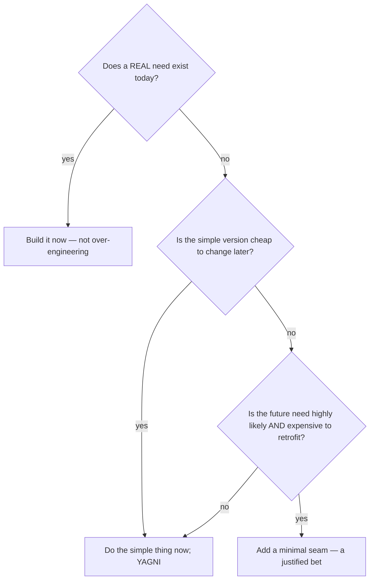

# Over-Engineering Anti-Patterns — Middle

> **Category:** [Development Anti-Patterns](../README.md) → **Over-Engineering** — *effort spent solving problems you don't have.*
> **Covers (collectively):** Premature Optimization · Speculative Generality · Gold Plating · Yo-yo Problem · Lasagna Code · Accidental Complexity · Soft Coding · Bikeshedding

---

## Table of Contents

1. [Introduction](#introduction)
2. [Prerequisites](#prerequisites)
3. [The Real Question: When Does This Creep In?](#the-real-question-when-does-this-creep-in)
4. [Premature Optimization — Measure, Don't Guess](#premature-optimization--measure-dont-guess)
5. [Speculative Generality — The Rule of Three and Real Seams](#speculative-generality--the-rule-of-three-and-real-seams)
6. [Gold Plating — Scope Discipline](#gold-plating--scope-discipline)
7. [Yo-yo & Lasagna — Finding the Right Number of Layers](#yo-yo--lasagna--finding-the-right-number-of-layers)
8. [Accidental Complexity — The Core Skill](#accidental-complexity--the-core-skill)
9. [Soft Coding — Where the Line Really Is](#soft-coding--where-the-line-really-is)
10. [Bikeshedding — Protecting Attention](#bikeshedding--protecting-attention)
11. [The Hardest Part: Telling Over- from Under-Engineering](#the-hardest-part-telling-over--from-under-engineering)
12. [Catching It in Review](#catching-it-in-review)
13. [Common Mistakes](#common-mistakes)
14. [Test Yourself](#test-yourself)
15. [Cheat Sheet](#cheat-sheet)
16. [Summary](#summary)
17. [Further Reading](#further-reading)
18. [Related Topics](#related-topics)

---

## Introduction

> Focus: **When does this creep in?** and **What do I do instead?**

Over-engineering is the most *flattering* anti-pattern family: it looks like skill. The engineer who builds a plugin architecture for a one-off script, who hand-optimizes a cold loop, who adds a fifth layer "for separation of concerns," is usually trying to do *good* work. That's what makes it hard to catch — it wears the costume of craftsmanship.

The junior lesson was YAGNI and KISS. The middle-level lesson is harder: **knowing the difference between abstraction that pays for itself and abstraction that's a bet on an imagined future** — and recognizing that the same instinct that prevents over-engineering can tip into *under*-engineering if applied without judgment. There's no rule that fires automatically here. The skill is calibration: building exactly enough structure for the problem you actually have, with cheap room to grow.

---

## Prerequisites

- **Required:** Comfortable with [`junior.md`](junior.md) — you can identify all eight anti-patterns and know YAGNI/KISS.
- **Required:** You've designed at least one small system end-to-end and lived with the design afterward.
- **Helpful:** Basic profiling experience in your language (you've seen a flame graph or a benchmark).
- **Helpful:** Familiarity with the [Rule of Three](../02-bad-shortcuts/middle.md) and the cost of the wrong abstraction.

---

## The Real Question: When Does This Creep In?

| Trigger | What happens | Which anti-pattern |
|---|---|---|
| **"This loop feels slow"** | Hand-tuning on a hunch | Premature Optimization |
| **"We'll probably need to support X later"** | Abstraction with one use case | Speculative Generality |
| **"While I'm in here…"** | Extra features bolted on | Gold Plating |
| **"Best practice says add a service layer"** | Layers added by reflex | Lasagna / cargo-culted architecture |
| **"Make it configurable to be safe"** | Logic pushed into config | Soft Coding |
| **"Reuse via a base class"** | Deep inheritance | Yo-yo Problem |
| **A code review with an easy target** | Everyone debates naming | Bikeshedding |

The unifying force is **anxiety about the future** dressed as foresight — and the cure is almost always *defer the decision until you have information*. A simpler design keeps more options open than a speculative one, because it's cheaper to change.

---

## Premature Optimization — Measure, Don't Guess

The middle skill is having an actual **performance workflow** instead of intuition:

1. **Establish it matters.** Is there a latency/throughput requirement this code is failing? If not, "slow" is hypothetical.
2. **Profile.** Find where time actually goes. It's almost never where you guessed — and it's often I/O, serialization, or N+1 queries, not your arithmetic.
3. **Benchmark the change.** Prove the optimization helped, with numbers, on representative data.
4. **Keep the clear version if the gain is trivial.** A 2% win that triples the reading cost is a net loss.

```go
// Go: a benchmark is the entry ticket for an optimization
func BenchmarkSumEven(b *testing.B) {
    nums := makeData(1_000_000)
    b.ResetTimer()
    for i := 0; i < b.N; i++ { _ = sumEven(nums) }
}
// $ go test -bench=. -benchmem   →  compare with benchstat before/after
```

> **The nuance:** *algorithmic* improvement (O(n²) → O(n log n)) chosen at design time is **not** premature — picking the right data structure up front is good engineering. Premature optimization is *micro*-tuning correct, clear code without evidence. Know which one you're doing.

---

## Speculative Generality — The Rule of Three and Real Seams

The middle-level discipline distinguishes a **speculative** abstraction from a **justified seam**.

**Apply the Rule of Three.** One use case → write it concretely. Two → tolerate a little duplication, watch the shape. Three → now you understand the variation well enough to abstract correctly.

**A seam is justified — today — when it serves one of:**

| Justified seam | Why it's not speculative |
|---|---|
| **Test double** | You need to inject a fake/mock to test (a `Clock`, a `PaymentGateway`) |
| **Published API / contract** | External consumers depend on the boundary |
| **A confirmed, imminent second implementation** | The requirement exists *now*, not "maybe" |
| **A volatile dependency** | A genuinely likely-to-change external (a vendor SDK) you want to isolate |

```java
// Speculative: interface + strategy for behavior that has one form and no test need.
interface DiscountStrategy { Money apply(Cart c); }   // only one impl, never mocked → delete it

// Justified: the interface exists so the order flow can be tested without a real gateway.
interface PaymentGateway { Receipt charge(Money m); } // prod impl + test fake → keep it
```

> **The wrong-abstraction trap:** Sandi Metz's rule — *"duplication is far cheaper than the wrong abstraction."* If you abstracted early and the second case doesn't fit, **inline it back** to duplication and re-derive the abstraction from the real cases. Don't bend the code to fit a premature interface.

---

## Gold Plating — Scope Discipline

Gold plating creeps in through good intentions ("the user will love this") and through boredom (the assigned task is dull, the gold-plate is fun). The countermoves are process, not willpower:

- **Define "done" before starting** — acceptance criteria scoped to the ticket. If it's not in the criteria, it's not in this PR.
- **Capture ideas, don't build them.** A genuinely good idea becomes a backlog item the team can prioritize — not a surprise in your diff.
- **Smaller PRs.** A 40-line PR scoped to one criterion rarely hides gold plating; a 1,500-line PR routinely does.
- **YAGNI for features, too.** "Users might want to export to XML" is the feature-level version of speculative generality.

> **Review heuristic:** when a diff contains capability the ticket didn't request, ask for the ticket. No ticket → split it out or drop it. Shipping the *right* small thing beats shipping a bigger thing nobody asked for.

---

## Yo-yo & Lasagna — Finding the Right Number of Layers

Both are *layering* failures. Yo-yo is too much **vertical** layering (inheritance depth); Lasagna is too much **horizontal** layering (call-chain depth). The middle skill is judging when a layer earns its place.

**A layer is justified only if it adds a distinct responsibility:**

| Earns its keep | Pure pass-through (Lasagna) |
|---|---|
| Validates / sanitizes input | Renames arguments and forwards |
| Maps between representations (DTO ↔ domain) | Calls the next layer 1:1 with no change |
| Owns a transaction boundary | Exists "because the pattern has this layer" |
| Enforces auth / a security boundary | Wraps a single call for "symmetry" |

```java
// Lasagna: collapse these — none adds a responsibility
class OrderService { Order get(int id){ return manager.get(id); } }
class OrderManager { Order get(int id){ return repo.get(id); } }
// → one class that talks to the repo, plus layers ONLY where a real job exists.
```

For Yo-yo: prefer **composition**. Inheritance is justified for genuine *is-a* with stable, shallow hierarchies; use it for one level, reach for delegation/strategy beyond that. (See Replace Inheritance with Delegation.)

> **Ousterhout's framing:** prefer **deep modules** — a simple interface hiding substantial implementation — over **shallow modules** that add interface without hiding much. Lasagna is a stack of shallow modules.

---

## Accidental Complexity — The Core Skill

This is the umbrella, and managing it is *the* central engineering skill. The middle-level move is to constantly separate the **essential** (the problem's real difficulty) from the **accidental** (what your solution adds):

1. **Describe the problem in plain language.** If the code is dramatically more complex than the description, the gap is accidental.
2. **Question every layer, parameter, and abstraction:** "what real difficulty does this hide?" If the honest answer is "none," it's accidental.
3. **Prefer boring solutions.** A standard library call, a plain function, a flat data structure — boring is readable, testable, and usually fast enough.
4. **Watch your dependencies.** Pulling in a framework to solve a one-function problem imports its accidental complexity wholesale.

```python
# Essential: "group orders by customer and sum totals."
# Accidental version drags in a generic reducer framework.
# Direct version — the essential problem, nothing more:
from collections import defaultdict
totals = defaultdict(float)
for o in orders:
    totals[o.customer_id] += o.total
```

> **A Philosophy of Software Design** calls this *complexity is incremental* — it accrues a little at a time, so you must push back continuously, in every review and every PR, not in one big cleanup.

---

## Soft Coding — Where the Line Really Is

The middle question isn't "config or code?" but "**what kind** of thing is this?" Use this test:

| The thing | Where it goes | Why |
|---|---|---|
| **Environment value** (URL, pool size, timeout) | Configuration | Genuinely varies per deploy |
| **A simple tunable** (page size, retry count) | Configuration with a sane default | Varies, but the *logic* stays in code |
| **A business rule** (how a discount is computed) | **Code** | Needs tests, types, review, a debugger |
| **A frequently-changing ruleset edited by non-devs** | A *narrow, validated* DSL/table — last resort | Only if the need is proven and the format is constrained |

The failure is pushing the third row into config. A rule like "VIP customers in the EU get 15% off orders over €100" belongs in tested code, not a JSON `if/then` tree. If you truly need business-user-editable rules, that's a deliberate, validated, tested feature — not a reflexive "make it configurable."

> **Rule of thumb:** if your config file grows operators (`if`, `and`, `>=`), you've started writing a programming language in JSON. Stop and move the logic back to code.

---

## Bikeshedding — Protecting Attention

At the middle level you're often *in* the review, so you can steer it. Practical moves:

- **Automate the trivial out of existence.** A formatter (`gofmt`, Prettier, Black) and a linter end tabs-vs-spaces and naming-style debates permanently — there's nothing left to argue.
- **Set defaults and conventions** so trivial choices are pre-decided (style guide, lint config, ADRs for the big ones).
- **Name it gently in the moment:** "this feels like bikeshedding — let's take the lint default and focus on the locking bug."
- **Match scrutiny to risk.** A throwaway script doesn't need the review intensity of an auth change. Spend reviewer attention proportional to blast radius.

> Bikeshedding thrives on *accessible* problems. The fix is to remove the accessible problems (automation) and consciously redirect energy to the inaccessible, important ones.

---

## The Hardest Part: Telling Over- from Under-Engineering

There is no automatic rule, so build judgment heuristics:



- **Reversibility is the key variable.** If a decision is cheap to change later (most code), defer it — do the simple thing. If it's expensive and irreversible (a public API, a data schema, a wire format), invest in getting it right up front; *there*, "simple now" can be under-engineering.
- **Over-engineering bets on a future you're guessing at; under-engineering ignores a future you can clearly see.** The art is honest assessment of which one you're in.

---

## Catching It in Review

- **"What real, present need does this abstraction serve?"** "Future flexibility" → Speculative Generality.
- **"Where's the profile showing this is a bottleneck?"** None → Premature Optimization.
- **"Which acceptance criterion is this code for?"** None → Gold Plating.
- **"What responsibility does this layer add?"** "It forwards the call" → Lasagna.
- **"Could a new dev understand this without climbing the class hierarchy?"** No → Yo-yo.
- **"Is there logic in this config file?"** Yes → Soft Coding.
- **As a reviewer:** notice when *you're* about to leave the tenth comment about naming while ignoring the concurrency model — that's you bikeshedding.

---

## Common Mistakes

1. **Calling all up-front design "over-engineering."** Choosing the right algorithm, schema, or API shape early is good engineering — those are expensive to change. YAGNI targets *speculative flexibility*, not *thoughtful design*.
2. **Refusing to abstract even at the third repetition.** YAGNI taken too far becomes copy-paste. The Rule of Three says: now is the time.
3. **Optimizing without a benchmark, then "proving" it with another guess.** If you can't measure the before and after, you don't know if you helped.
4. **Adding a layer for "separation of concerns" that separates none.** A layer needs a concern of its own.
5. **Soft-coding to empower non-developers who never use it.** Validate the assumption that someone will actually edit the config before you build the machinery.
6. **Mistaking deep modules for over-engineering.** A small interface over a large, complex implementation is *good* — that's hiding essential complexity, not adding accidental complexity.
7. **Over-correcting after being burned.** An engineer once bitten by a rewrite sometimes over-builds the next thing "to be safe." Recognize the reflex.

---

## Test Yourself

1. Give an example of optimization that is **not** premature, and one that is. What distinguishes them?
2. You wrote an interface six months ago expecting a second implementation. It never came, and the code is awkward. What does Sandi Metz's "wrong abstraction" advice tell you to do?
3. A service has layers `Controller → Service → Manager → Repository`. How do you decide which layers to keep?
4. What single variable most helps you decide between "do the simple thing (YAGNI)" and "invest up front"? Explain.
5. A teammate wants discount rules in a database "so business can change them." What do you check before agreeing, and what's the over-engineering risk?
6. Why is over-engineering harder to catch in review than under-engineering?

---

## Cheat Sheet

| Anti-pattern | Creeps in when… | Countermove |
|---|---|---|
| **Premature Optimization** | "This feels slow" | Require a profile + benchmark; keep clear version if gain is trivial |
| **Speculative Generality** | "We'll need it later" | Rule of Three; only build justified seams (test/API/imminent) |
| **Gold Plating** | "While I'm in here" | Define "done"; capture ideas as backlog; small PRs |
| **Yo-yo Problem** | "Reuse via base class" | Composition; shallow hierarchies |
| **Lasagna Code** | "Best practice has this layer" | Keep layers with a distinct responsibility; collapse pass-throughs |
| **Accidental Complexity** | Reflexive frameworks/abstraction | Compare code to plain problem description; prefer boring |
| **Soft Coding** | "Make it configurable to be safe" | Logic in code; config only for env/tunables |
| **Bikeshedding** | Easy target in review | Automate trivia; match scrutiny to risk |

> **The deciding question:** *Is this a real need today, and how expensive is it to add later?* Reversible + no present need → keep it simple. Irreversible + clearly coming → invest now.

---

## Summary

- Over-engineering disguises itself as craftsmanship, which is why it's hard to catch — the cure is judgment, not a reflex rule.
- **Premature Optimization**: measure, don't guess (but design-time algorithmic choices are fair game). **Speculative Generality**: Rule of Three; build only justified seams; inline the wrong abstraction. **Gold Plating**: scope to "done." **Yo-yo/Lasagna**: keep only layers with a real responsibility; prefer deep modules and composition. **Accidental Complexity**: continuously separate it from essential complexity; prefer boring. **Soft Coding**: logic in code, config for what varies. **Bikeshedding**: automate trivia, spend attention on risk.
- The master variable is **reversibility**: defer cheap-to-change decisions (YAGNI), invest in expensive-to-change ones (don't under-engineer the schema/API).
- Next: [`senior.md`](senior.md) — over-engineering at architecture scale (frameworks, microservices, gold-plated platforms), and leading teams away from it.

---

## Further Reading

- **A Philosophy of Software Design** — John Ousterhout (2018) — deep vs shallow modules, complexity is incremental, "design it twice."
- **The Pragmatic Programmer** — Hunt & Thomas (20th anniv. ed., 2019) — YAGNI, good-enough software, reversibility.
- *"The Wrong Abstraction"* — Sandi Metz (2016) — duplication is cheaper than the wrong abstraction.
- **Refactoring** — Martin Fowler (2nd ed., 2018) — Remove Speculative Generality, Collapse Hierarchy, Inline Class, Replace Subclass with Delegate.
- **No Silver Bullet** — Fred Brooks (1986) — essential vs accidental complexity.

---

## Related Topics

- [Bad Shortcuts → middle](../02-bad-shortcuts/middle.md) — the Rule of Three and the wrong-abstraction trap; Soft Coding as the over-correction of Hard Coding.
- [Bad Structure → middle](../01-bad-structure/middle.md) — Lasagna vs Spaghetti; over-correcting one creates the other.
- Clean Code → Classes — composition over inheritance, cohesion.
- Refactoring → Techniques — Collapse Hierarchy, Inline Class, Replace Subclass with Delegate.
- Design Patterns — patterns applied speculatively become over-engineering.

---

## Check your understanding

1. Explain Over-Engineering Anti-Patterns — Middle Level in your own words and name the problem it solves.
2. How would you apply the ideas around Table of Contents, Introduction, Prerequisites in a realistic engineering change?
3. What failure mode or misuse should you look for, and what evidence would reveal it?
4. Which local design trade-off would make you choose or reject Over-Engineering Anti-Patterns — Middle Level in an existing codebase?
5. What observable result would convince you that the approach improved the system?
