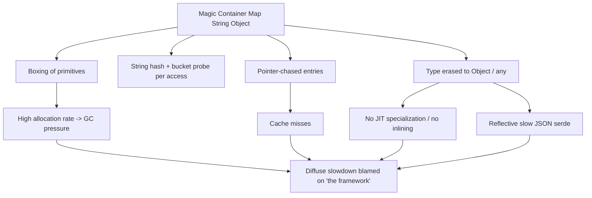

# OO Misuse Anti-Patterns — Professional

> **Category:** [Design Anti-Patterns](../README.md) → **OO Misuse** — *object-orientation applied as procedure-with-classes.*
> **Covers (collectively):** Anemic Domain Model · BaseBean · Constant Interface · Poltergeist · Object Orgy · Functional Decomposition · Call Super · Magic Container · Flag Arguments · Telescoping Constructor · Fragile Base Class

---

## Table of Contents

1. [Introduction](#introduction)
2. [Prerequisites](#prerequisites)
3. [Measure First: The Tooling Map](#measure-first-the-tooling-map)
4. [Magic Container — The Type System You Pay For Twice](#magic-container--the-type-system-you-pay-for-twice)
5. [Anemic Model & Getter/Setter Churn — Allocation and Megamorphic Access](#anemic-model--gettersetter-churn--allocation-and-megamorphic-access)
6. [Fragile Base Class, Deep Inheritance & Call Super — Dispatch, Inlining, Deopt](#fragile-base-class-deep-inheritance--call-super--dispatch-inlining-deopt)
7. [Poltergeist, Functional Decomposition & BaseBean — Allocation Churn and Escape Analysis](#poltergeist-functional-decomposition--basebean--allocation-churn-and-escape-analysis)
8. [Flag Arguments — Branch Misprediction and the Monomorphic Split](#flag-arguments--branch-misprediction-and-the-monomorphic-split)
9. [Telescoping Constructor vs Builder — The Allocation You Can Usually Ignore](#telescoping-constructor-vs-builder--the-allocation-you-can-usually-ignore)
10. [When the "Misuse" Is the Fast Path](#when-the-misuse-is-the-fast-path)
11. [A Combined Worked Example](#a-combined-worked-example)
12. [Common Mistakes](#common-mistakes)
13. [Test Yourself](#test-yourself)
14. [Cheat Sheet](#cheat-sheet)
15. [Summary](#summary)
16. [Further Reading](#further-reading)
17. [Related Topics](#related-topics)

---

## Introduction

> Focus: **what these eleven OO mistakes cost the machine** — the heap, the garbage collector, the JIT's inlining and devirtualization, the CPU's branch predictor — and **how you measure that cost** before you "fix" anything.

[`junior.md`](junior.md) taught you to name the eleven shapes. [`middle.md`](middle.md) taught you the design forces that produce them. [`senior.md`](senior.md) taught you to detect them in review and migrate them at scale. This file goes one layer down — to the **runtime and the toolchain** — and adds a second discipline the lower levels deliberately omit: sometimes one of these "anti-patterns" is the *right* performance call, and dogmatically purifying it makes the system slower.

The professional insight: OO misuse is rarely a single hot line. It is **diffuse cost** — a few nanoseconds of indirection per call, a few extra allocations per request, a megamorphic getter the JIT refuses to inline, a `Map<String,Object>` that boxes every value and hashes every key. None of it shows up as one fat frame in a flame graph, so it survives reviews that ask only "is this clean OO?"

Two disciplines define this level:

1. **Never argue from intuition about performance.** Every claim below names the tool that would prove or falsify it on *your* code. Illustrative numbers are labeled as such; your job is to reproduce them.
2. **Know when the "misuse" is correct.** An anemic DTO at a serialization boundary, a typed struct chosen *over* a map, a flat `switch` over polymorphism — these can be the fast and right choice. The senior move is not to purify everything; it is to *isolate* the deliberate choice behind a clean boundary and a committed benchmark.

> **The mental model:** an object is a contract not only with the next reader but with three optimizers you rarely see — the **compiler/JIT** (inlining, devirtualization, escape analysis), the **CPU** (caches, branch predictor), and the **garbage collector** (allocation rate, object lifetime). OO misuse breaks the assumptions all three rely on.

---

## Prerequisites

- **Required:** Fluent with [`senior.md`](senior.md) — you can refactor an anemic model or collapse a deep hierarchy under production constraints.
- **Required:** Working mental model of a managed runtime: heap vs stack, a tracing GC's mark/sweep phases, JIT inlining and devirtualization (JVM C2, Go's compiler, CPython's bytecode loop), escape analysis.
- **Required:** You can read a flame graph and a `benchstat`/JMH comparison and tell signal from noise.
- **Helpful:** CPU microarchitecture basics — cache lines (~64 bytes), branch prediction, inline caches (mono/bi/megamorphic call sites).
- **Helpful:** the measurement vocabulary from profiling-techniques, memory-leak-detection, big-o-analysis.

---

## Measure First: The Tooling Map

Before any performance claim about object shape, reach for the right instrument. Keep this table close.

| Concern | Go | Java / JVM | Python |
|---|---|---|---|
| **CPU profile** | `go test -cpuprofile`, `pprof` | async-profiler (`-e cpu`), JFR | `cProfile`, `py-spy`, `scalene` |
| **Allocation / heap** | `-memprofile`, `pprof -alloc_objects` | JFR allocation events, `jmap`, MAT | `tracemalloc`, `memray`, `scalene` |
| **Object layout / size** | `unsafe.Sizeof`, field order | `jol` (Java Object Layout) | `sys.getsizeof`, `pympler` |
| **GC behavior** | `GODEBUG=gctrace=1`, `go tool trace` | GC logs (`-Xlog:gc*`), JFR GC events | `gc.set_debug`, generational stats |
| **Inlining / devirtualization** | `go build -gcflags=-m` | `-XX:+PrintInlining`, `-XX:+PrintCompilation` | (none — CPython doesn't inline) |
| **Escape analysis** | `go build -gcflags='-m -m'` | `-XX:+PrintEscapeAnalysis` (debug JVM) | (n/a) |
| **Microbenchmark** | `testing.B` + `benchstat` | JMH | `pyperf`, `timeit`, `dis` |
| **Branch / cache counters** | `perf stat`, `pprof` + `perf` | `perf`, async-profiler hw events | `perf stat python …` |
| **Deopt / recompilation** | (recompile is rare; check `-m` stability) | `-XX:+PrintCompilation` (`made not entrant`) | (n/a) |

```bash
# Go: what inlines, what escapes to the heap (the two levers in this file)
go build -gcflags='-m -m' ./pkg/... 2>&1 | grep -E 'inlin|escapes|does not escape'

# Go: allocation rate of a benchmark (Magic Container vs typed struct)
go test -bench=. -benchmem -memprofile=mem.out ./...

# Java: does the hot getter inline? does a base override force a deopt?
java -XX:+PrintInlining -XX:+PrintCompilation -jar app.jar | grep -E 'getAmount|made not entrant'

# Java: real instance size of an anemic DTO (header + padding)
java -jar jol-cli.jar internals com.acme.OrderDTO

# Python: see the bytecode a flag-branch compiles to; profile allocations
python -c "import dis,svc; dis.dis(svc.process)"
python -m tracemalloc your_script.py
```

> **Discipline:** if you cannot point at the tool that would falsify your performance claim, you are guessing. The rest of this file pairs every OO-misuse cost with the instrument that confirms it.

---

## Magic Container — The Type System You Pay For Twice

`Map<String,Object>`, `dict[str, Any]`, `Bundle`, `map[string]interface{}` — the stringly-typed bag passed everywhere. At the source level it bypasses the compiler. At runtime it makes you **pay for the type system twice**: once in the boxing/hashing/indirection the container imposes, and again in the JIT optimizations you forfeit because no concrete type flows through.

### 1. Boxing and allocation churn

A `Map<String,Object>` cannot hold primitives. Every `int`, `long`, `double`, `boolean` you put in is **autoboxed** into an `Integer`/`Long`/`Double`/`Boolean` — a heap allocation with an object header (~16 bytes for an 8-byte value). A typed struct stores the primitive inline, for free.

```java
// Magic Container: 4 boxed allocations + a HashMap + its backing array, per order.
Map<String,Object> order = new HashMap<>();
order.put("id", 1001L);           // Long box
order.put("amountCents", 4999L);  // Long box
order.put("status", 2);           // Integer box
order.put("priority", true);      // Boolean box (cached for true/false — but the lookup still boxes-on-read paths)

// Typed struct: zero boxing, one dense allocation, fields inline.
record Order(long id, long amountCents, int status, boolean priority) {}
```

`jol` makes the difference concrete: the `record` is one ~32-byte object; the map is a `HashMap` (~48 bytes) + an `Object[]` backing array + a `Node` per entry (~32 bytes each) + the boxed values. Confirm the allocation rate gap with JFR allocation profiling or, in Go, `-benchmem`.

### 2. Hashing and string-key lookup cost

Every read from a magic container is `hash(key) → bucket → equals` — for a `String` key that means hashing the whole string (cached after first `hashCode`, but still a memory chase) and walking a bucket chain. A struct field access is a **constant offset load** — one instruction, no hashing, no branch.

```go
// Magic Container: hash a string, probe a bucket, type-assert the value.
func amount(m map[string]any) int64 {
    v, ok := m["amountCents"] // hash "amountCents", probe, return interface{}
    if !ok { return 0 }
    return v.(int64)          // dynamic type assertion — runtime type check
}

// Typed struct: a single offset load, inlinable, no hash, no assertion.
func amount(o Order) int64 { return o.AmountCents }
```

The `v.(int64)` assertion is a runtime type check the compiler cannot elide because `any` erases the type. In a hot loop this is per-iteration work the typed version doesn't have. In Python the same shape is `dict[str, Any]`: every `d["amountCents"]` is a hash + `__getitem__` dispatch, and the value arrives as an opaque `object` the interpreter can't specialize. CPython 3.11+'s adaptive specializing interpreter (PEP 659) can specialize `BINARY_SUBSCR` for a `dict[str]` access, but it still hashes the key and boxes nothing it didn't already box — every Python int *is* a heap object, so the "boxing" cost is permanent; the typed escape hatch in Python is a `@dataclass(slots=True)` or a `NamedTuple`, whose `__slots__` lay attributes out in a fixed array and skip the per-instance `__dict__`.

### 3. Cache-unfriendliness and loss of JIT specialization

A struct lays its fields out contiguously — reading three fields touches one or two cache lines. A map scatters entries across the heap via pointers; each lookup is a pointer chase that's likely to miss cache. Worse for the optimizer: because the values are `Object`/`any`/`interface{}`, **no concrete type flows through the call site**, so the JIT cannot specialize, inline the consumer, or devirtualize anything downstream. The magic container is a type-information black hole.

### 4. (De)serialization cost

Teams reach for `Map<String,Object>` "to avoid writing a DTO," then serialize it to JSON. But generic-map (de)serialization is *slower* than typed: the serializer must reflect over runtime types entry by entry, box/unbox, and resolve each value's writer dynamically, where a typed struct lets libraries (Jackson `afterburner`, `jsoniter`, Go `easyjson`/generated marshalers) emit straight-line field-by-field code.



> **Illustrative impact:** replacing a `map[string]any` request payload with a generated typed struct + generated marshaler cut allocations/op from ~28 to ~3 and ns/op by ~40% on a decode-transform-encode hot path. *Reproduce with `-benchmem` and `benchstat` before believing it — and note the magic container may still be right at a truly dynamic boundary (next section).*

---

## Anemic Model & Getter/Setter Churn — Allocation and Megamorphic Access

The Anemic Domain Model puts data in objects and behavior in service classes, shuttling data between layers through getters, setters, and DTOs. The maintainability cost is covered at lower levels; the **runtime** cost is allocation and dispatch.

### 1. DTO allocation and defensive copies

Anemic architectures map the same data three or four times — entity → domain DTO → API DTO → response — each mapping a fresh allocation, often with **defensive copies** of collections and dates to preserve "immutability" across layers. On a hot endpoint, the mapping layer can allocate more than the business logic.

```java
// Each layer reallocates and defensively copies. Per request, on the hot path.
OrderEntity e   = repo.find(id);
OrderDomain d   = mapper.toDomain(e);          // new object + copied List
OrderResponse r = presenter.toResponse(d);     // new object + copied List again
```

The cure is not "never map" — boundaries legitimately need DTOs (see [§When the misuse is the fast path](#when-the-misuse-is-the-fast-path)). It is to **stop mapping through layers that add no transformation**, and to avoid eager defensive copies where an unmodifiable view suffices.

### 2. Megamorphic getters defeat inlining

A getter is the cheapest possible method — *if the JIT inlines it*. It inlines when the call site is monomorphic (always one concrete type). An anemic design that funnels many DTO types through one generic processing path makes `obj.getAmount()` **megamorphic**: the inline cache overflows, the JIT stops inlining, and a one-instruction field load becomes a full virtual dispatch per call.

```java
// A generic pipeline sees dozens of DTO types at this site → getAmount() megamorphic.
long total = 0;
for (HasAmount dto : mixedBatch)   // 30 implementations flow through here
    total += dto.getAmount();      // can't inline; virtual call per element
```

Confirm with `-XX:+PrintInlining` (you'll see `not inlined: megamorphic` at the getter). The fix is the same as for any megamorphic site: split the path so each is monomorphic, or partition the batch by type. Note the irony — a *rich* domain object that does the work in place often produces fewer, more monomorphic call sites than the anemic getter-shuttle.

### 3. The data-shuttling tax

"Tell, don't ask" is not only an encapsulation slogan; it is a *performance* one. Asking an object for five fields and computing outside it means five virtual getters + the external method; telling the object to compute means one (inlinable, monomorphic) call that the JIT can fold. Measure with a JMH micro of `sum-of-getters` vs `object.total()`.

> **Illustrative impact:** collapsing a three-layer mapping (entity→domain→response) to a single direct projection on a read-heavy endpoint cut allocations/request ~45% and trimmed p99 by ~2 ms, mostly from reduced young-gen GC. *Measure with JFR allocation events + GC logs; the win is GC-bound, not CPU-bound, so a CPU profile alone would have missed it.*

---

## Fragile Base Class, Deep Inheritance & Call Super — Dispatch, Inlining, Deopt

Deep inheritance hierarchies and the Call Super contract are maintainability hazards (an unenforced `super.method()` call, a base change that silently breaks subclasses). At runtime they tax **dispatch, inlining, object layout, and — on the JVM — deoptimization**.

### 1. Virtual dispatch and devirtualization defeated

The JVM aggressively **devirtualizes**: if a call site only ever sees one concrete type (or the method is effectively final because no override is loaded), it inlines the body and skips the vtable lookup. A deep hierarchy with many overrides at a hot call site keeps it polymorphic, blocking devirtualization. Go has no inheritance, but interface method calls through `itable`s have the same property: a monomorphic interface call can be devirtualized and inlined; a megamorphic one cannot.

### 2. Deoptimization when a base method is overridden

This is the subtle, JVM-specific cost. C2 will speculatively devirtualize and inline a call assuming the current class hierarchy — it inlines `Base.process()` because no override is loaded yet. When a subclass that overrides `process()` is later class-loaded, the assumption breaks: the JIT **deoptimizes** the compiled method (`made not entrant`), falls back to the interpreter, and recompiles. A Fragile Base Class whose subclasses load lazily can trigger repeated deopt/recompile churn, visible as latency spikes well after warmup.

```
# -XX:+PrintCompilation excerpt — a base override forces a deopt:
  1234  712       4   com.acme.Pipeline::process (38 bytes)   made not entrant
```

Confirm with `-XX:+PrintCompilation` (look for `made not entrant` / `made zombie`) and JFR's "compilation" and "deoptimization" events.

### 3. Object header and layout overhead in deep hierarchies

Each level of a hierarchy can add fields; a deep chain produces wide instances with poor locality and (from naive field ordering across levels) padding gaps. The object **header** is fixed overhead per instance regardless of depth, but deep hierarchies tempt "one more field at each level" until the leaf instance is large and cache-hostile. `jol internals` shows the layout, padding, and total size per concrete leaf.

### 4. Call Super: the cost of the enforced indirection

The Call Super shape forces every override to call back into the base, adding an extra (frequently virtual) call per operation and an ordering dependency the optimizer must respect. The Template Method cure — base owns control flow, subclass implements a small `protected abstract` hook — produces a *better* runtime shape: the hot control flow lives in one inlinable place, and the hook is a single monomorphic-per-subclass call.

```go
// Go has no inheritance, so the "base class" tax appears as interface depth.
// A monomorphic interface call here is devirtualized + inlined by the compiler:
type Hook interface{ Step(x int) int }
func run(h Hook, xs []int) (s int) { for _, x := range xs { s += h.Step(x) } }
// If `run` is called with one concrete Hook type from a hot site, -gcflags=-m
// shows Step inlined. Many types → it stays an indirect itable call.
```

### 5. Object Orgy and false sharing — when exposed fields collide on a cache line

Object Orgy (objects exposing their internals so freely that encapsulation is fiction) and a wide inherited instance share a concurrency hazard: **false sharing**. The CPU loads memory in ~64-byte cache lines. If two threads mutate two *different* public fields that happen to land on the *same* line, the hardware invalidates the line on every write, serializing threads that share no logical data. An object that exposes mutable fields for any caller to write is exactly where this happens unnoticed.

```go
// Two goroutines write different exposed fields on the same cache line.
type Counters struct {
    Hits   uint64 // goroutine A
    Misses uint64 // goroutine B — same 64-byte line as Hits → false sharing
}
// Encapsulate + separate, or pad to a full line:
type Counters struct {
    Hits   uint64
    _      [56]byte // pad so Misses starts a new cache line
    Misses uint64
    _      [56]byte
}
```

Confirm with `perf stat -e cache-misses` and a throughput-vs-cores curve that flattens as you add cores. The structural lesson is the encapsulation one with a runtime edge: **fields mutated independently and concurrently should not be exposed on the same object, let alone the same cache line.** Tightening visibility (the Object Orgy cure) often separates them by construction.

> **Diagnose it:** `-XX:+PrintInlining` (devirtualization at the site), `-XX:+PrintCompilation` (`made not entrant` deopts), `jol` (leaf instance size/padding), `perf stat -e cache-misses` (false sharing on exposed fields), Go `-gcflags=-m` (interface call inlined or not). The structural fix — shallow hierarchies, `final`/`sealed` by default, tight visibility, composition — is also the fast one because it keeps call sites monomorphic and stable and keeps concurrently-mutated state apart.

---

## Poltergeist, Functional Decomposition & BaseBean — Allocation Churn and Escape Analysis

These three share a runtime signature: **needless short-lived objects and needless indirection** that pressure the GC and defeat escape analysis.

### 1. Poltergeist: short-lived objects that should never have been allocated

A Poltergeist is created, calls one method on a real object, and dies. Each one is a heap allocation (plus its own field initialization) that exists only to forward a call. In an allocation-heavy loop, Poltergeists are pure young-gen churn.

```java
// Poltergeist: new object per item, exists only to forward to `engine`.
for (Item it : items) {
    new ItemProcessor(engine).process(it);  // allocate, forward, discard
}
// Inlined: the intermediate is gone; no allocation, direct call.
for (Item it : items) engine.process(it);
```

### 2. Escape analysis: when the allocation is actually free — and when the Poltergeist defeats it

Modern JITs (and Go's compiler) perform **escape analysis**: if an object provably does not escape its creating method, it can be **stack-allocated or scalar-replaced** — no heap allocation, no GC cost. A simple Poltergeist *might* be scalar-replaced and cost nothing. But escape analysis is fragile: if the Poltergeist is passed to another method, stored in a field, or its type is polymorphic, it **escapes** to the heap. The needless indirection these patterns add is exactly what tips an object from "scalar-replaced, free" to "heap-allocated, GC's problem."

```go
// Go: -gcflags='-m' tells you the truth, per allocation.
func sumDirect(xs []int) int { s := 0; for _, x := range xs { s += x }; return s }
// $ go build -gcflags='-m'   → no heap allocations reported.

func sumViaBox(xs []int) int {
    s := 0
    for _, x := range xs { b := &box{x}; s += b.v }  // does &box{} escape?
    return s
}
// -m says "does not escape" → stack; but add `store b in a slice` and it escapes
// to the heap, one allocation per iteration. Indirection is what flips it.
```

### 3. Functional Decomposition & BaseBean: indirection without specialization

A Functional-Decomposition "class" is free functions wearing an object; a BaseBean forces unrelated classes through a utility base for helper access. Both add a layer of dispatch (often virtual) and an object lifetime where a free function or a value would do. The runtime cost is the indirection itself: an extra call the JIT may not inline, an object that may escape, and a type funnel that can become megamorphic. In Go and Python, the idiomatic cure (free functions / module-level functions) is also the fastest — a package-level function call is direct and inlinable; a method on a needless wrapper struct is not always.

> **Diagnose it:** Go `-gcflags='-m -m'` (does it escape? is it inlined?); JVM JFR allocation profiling + `-XX:+PrintInlining`; Python `tracemalloc` for the allocation count and `dis` to see the extra `CALL` ops. **The headline number to watch is allocations/op, not ns/op — these patterns are GC-bound.**

---

## Flag Arguments — Branch Misprediction and the Monomorphic Split

`process(retry=true, async=false)`, `render(bool fastPath)` — a boolean parameter that flips behavior. The method is two methods in one, and at runtime that costs a branch and a lost specialization.

### 1. The in-method branch and misprediction

A flag argument forces an `if (flag)` inside the method body. If the flag's value is data-dependent and unpredictable, every call risks a **branch mispredict** (~15–20 cycles, pipeline flush). Even when predictable, the branch sits in the hot path and the method body contains the instructions for *both* paths, bloating it and hurting I-cache density and inlinability.

```python
# Flag argument: one body, two behaviors, a branch per call.
def fetch(url, *, stream: bool):
    if stream:                       # branch on every call
        return _fetch_streaming(url)
    return _fetch_buffered(url)

# `dis.dis(fetch)` shows the POP_JUMP_IF_* on the flag at the top of the body.
```

### 2. Splitting enables monomorphic, inlinable call sites

Split `process(flag)` into `process()` and `processAsync()`. Now:

- **No runtime branch** — the choice was made at the call site, at compile time.
- **Each method is smaller** — only the instructions for its one behavior, more likely to inline and stay I-cache-dense.
- **Each call site is monomorphic** — a given caller always calls the same concrete method, so the JIT inlines it; the flag version forced one method to handle both, blocking specialization to either.

```go
// Flag version: branch inside, both paths compiled into one body.
func Write(w io.Writer, b []byte, sync bool) error {
    if sync { return writeSync(w, b) }
    return writeBuffered(w, b)
}

// Split: caller picks at the call site; each is a tight, inlinable function.
func WriteSync(w io.Writer, b []byte) error     { /* ... */ }
func WriteBuffered(w io.Writer, b []byte) error { /* ... */ }
```

### 3. The bytecode view in Python

CPython doesn't inline, so the flag-argument cost there is purely the branch and the doubled body — but `dis` makes it visible and is the cheapest way to teach the trade-off:

```python
import dis
def fetch(url, stream):
    if stream: return _stream(url)
    return _buffered(url)
dis.dis(fetch)
#   ...  LOAD_FAST   stream
#        POP_JUMP_IF_FALSE  →   # the per-call branch on the flag
#   ...  CALL _stream
#   ...  CALL _buffered
```

Two named functions (`fetch_stream`, `fetch_buffered`) each compile to straight-line bytecode with no `POP_JUMP_IF_*` on a flag and one `CALL` site the adaptive interpreter can specialize. The win in CPython is small (no inlining to gain) but the *clarity* and the monomorphic-call-site argument still hold, and they transfer directly to the JIT'd languages where the win is real.

> **Illustrative impact:** splitting a hot `serialize(obj, pretty bool)` into `serialize`/`serializePretty` let the compact path inline and dropped its ns/op ~12% (the body shrank below the inlining budget). *Verify with `benchstat`/JMH and the inliner's report — on a cold path the win is zero, and the real reason to split is still clarity.*

---

## Telescoping Constructor vs Builder — The Allocation You Can Usually Ignore

The Telescoping Constructor (`new Pizza(size)`, `new Pizza(size, crust)`, …) is a *readability* and *correctness* anti-pattern; the cure is usually a Builder or named arguments. The professional question is the one juniors over-worry: **does the Builder's extra allocation matter?**

Almost always: **no.** A Builder allocates one short-lived helper object that is constructed, mutated, and discarded in the same scope — the textbook escape-analysis candidate. The JVM frequently **scalar-replaces** it (zero heap allocation); Go's compiler stack-allocates it; even when it does hit the heap, it's one young-gen object that dies immediately, the cheapest thing a generational GC handles.

```java
// Builder: one extra object that almost certainly never reaches the heap.
Pizza p = new Pizza.Builder()   // escape analysis → scalar replacement likely
    .size(L).crust(THIN).cheese(true)
    .build();
```

When it *can* matter (rare, and only if a profiler says so):

- **Tight construction loops** building millions of objects/second, where even scalar-replacement fails (the builder escapes because it's passed to a helper). Confirm escape with `-XX:+PrintEscapeAnalysis` / Go `-m`; if it escapes, a constructor with a parameter object or direct field set avoids it.
- **The builder retains state** (a reused builder, a builder that allocates internal collections) — then it's no longer a free temporary.

The wrong move is to keep a Telescoping Constructor "for performance" without a benchmark. The right move: use the Builder/named-args for clarity, and *if and only if* a profiler flags construction as hot and `-m`/`PrintEscapeAnalysis` shows the builder escaping, drop to a direct constructor on that path — isolated and commented.

> **Illustrative impact:** in a 50M-objects/sec construction microbench, a Builder that *escaped* (passed to a factory) cost ~1 extra allocation/op; the same Builder kept local was scalar-replaced to **zero**. *The lesson is the measurement, not the verdict — `-benchmem`/JMH `-prof gc` tells you which case you have.*

---

## When the "Misuse" Is the Fast Path

The hardest professional judgment: several of these "anti-patterns" are the *correct* choice in the right context. Recognizing them — and isolating them — separates a specialist from a dogmatist.

- **Anemic DTO at a boundary.** A serialization/wire DTO with no behavior is *correct*: it exists to be (de)serialized and to decouple the API contract from the domain. Forcing behavior into it would couple the wire format to business logic. The anti-pattern is anemic *domain* objects, not anemic *boundary* DTOs.
- **A typed struct chosen over a map** — already the recommendation; the inverse (a *map over a struct*) is right when the schema is **genuinely dynamic** (user-defined fields, plugin payloads, sparse heterogeneous config). There, a struct would be a lie; the magic container is honest. Isolate it at the dynamic boundary and convert to a typed struct as early as possible inside.
- **Flat `switch`/table dispatch over polymorphism** on a megamorphic hot path — the "Functional Decomposition"-looking flat function can be faster than a class hierarchy when the polymorphic site would be megamorphic (see [Bad Structure professional](../../01-development/01-bad-structure/professional.md)).
- **Free functions over objects** in Go and Python — not Functional Decomposition when the problem genuinely has no state; it's idiomatic and faster.

The rule is **not** "performance beats clean OO." It is: **isolate the deliberate choice behind a clean boundary, prove it with a committed benchmark, and comment the trade-off** so a future reader can re-evaluate it when the compiler, hardware, or workload changes.

```go
// Honest dynamic boundary: the map is correct HERE because the payload schema
// is user-defined. Convert to a typed struct the moment the schema is known.
func Decode(raw map[string]any) (Order, error) { // map only at the edge
    // ... validate & project into a typed Order; the rest of the system is typed.
}
```

---

## A Combined Worked Example

These eleven rarely appear alone; their *performance* costs compound. Consider a request handler that is Functionally Decomposed into a `Service` god-helper, operates on an Anemic `Map<String,Object>` payload, dispatches behavior on a boolean flag, and shuttles data through three DTO mappings.

**Before — several OO-misuse shapes, each a runtime cost:**

```java
public Response handle(Map<String,Object> req, boolean legacy) { // Magic Container + Flag
    if (legacy) { /* dead-ish path, both compiled into the body */ }
    Long id      = (Long) req.get("id");          // boxed read + cast
    Long amount  = (Long) req.get("amountCents");  // boxed read + cast
    OrderDomain d   = mapper.toDomain(req);        // anemic: alloc + copy
    OrderResponse r = presenter.toResponse(d);     // anemic: alloc + copy again
    return enrich(r, legacy);                       // flag threaded through
}
```

Runtime profile of *before*: boxing on every field read, string-hash lookups, two reflective-ish mapping allocations per request, a flag branch in the hot body that blocks inlining and bloats the method, and type erasure (`Object`) that denies the JIT any specialization.

**After — structure and runtime fixed together:**

```java
// Typed payload (no boxing, no hashing, fields inline, JIT can specialize).
record OrderRequest(long id, long amountCents, int status) {}

// Flag split into two monomorphic, inlinable methods — no in-body branch.
public Response handle(OrderRequest req)        { return process(req); }
public Response handleLegacy(OrderRequest req)  { return processLegacy(req); }

private Response process(OrderRequest req) {
    long total = req.amountCents();      // offset load, inlinable getter
    return Response.ok(total);           // single direct projection — one alloc
}
```

> **Illustrative combined impact:** typed payload (no boxing/hashing), one projection instead of three mappings, and the flag split (smaller inlinable bodies) together cut allocations/request from ~31 to ~4 and p99 from ~11 ms to ~7 ms. **Each lever was measured separately — JFR allocation events for the boxing/mapping win, `PrintInlining` for the flag-split inlining, GC logs for the pause reduction — so we knew which change paid off. Never attribute a blended win to a blended change.**

---

## Common Mistakes

Professional-level mistakes — sophisticated, and therefore expensive:

1. **"Fixing" a Magic Container with no allocation baseline.** You replace `map[string]any` with a struct and assume it's faster. Capture `-benchmem`/JFR allocation *before*; sometimes the map was at a genuinely dynamic boundary where the struct can't go.
2. **Assuming every getter is free.** A getter is free only when inlined, and it inlines only when monomorphic. On a generic anemic pipeline it can be megamorphic — `PrintInlining` will say so.
3. **Keeping a Telescoping Constructor "for performance."** The Builder's allocation is almost always scalar-replaced to zero. Prove the builder *escapes* with `-m`/`PrintEscapeAnalysis` before you regress readability.
4. **Treating deep inheritance as free dispatch.** A base override loaded late can trigger JVM **deoptimization** (`made not entrant`) and recompilation churn long after warmup. Watch `-XX:+PrintCompilation`.
5. **Inlining away a Poltergeist that the JIT already eliminated.** Escape analysis may have made it free; confirm with `-m`/escape-analysis output before "optimizing" code that already costs nothing.
6. **Forgetting that anemic *boundary* DTOs are correct.** Pushing behavior into a wire DTO couples your API to your domain. The anti-pattern is anemic *domain* models, not anemic serialization objects.
7. **Attributing a blended win to a blended change.** Fixing the map, the flag, and the mapping at once and reporting one latency number teaches you nothing about which mattered — and the next regression will be a mystery. Measure each lever.
8. **Micro-optimizing a cold constructor / cold flag branch.** Splitting a flag method or de-boxing a map on a path the profiler shows at 0.1% of runtime buys nothing. Spend the effort where the allocation/dispatch is actually hot.

---

## Test Yourself

1. A `Map<String,Object>` payload is read in a hot loop. Name three distinct runtime costs versus a typed struct, and the tool that confirms each.
2. A getter `dto.getAmount()` shows as "not inlined: megamorphic." Explain *why* this happens in an anemic design and how you'd make the site monomorphic.
3. The JVM logs `made not entrant` for a base-class method minutes after warmup. What happened at the class-loading level, and what structural choice prevents it?
4. You suspect a Builder is hurting a tight construction loop. What does escape analysis do for the Builder, and which flag tells you whether it escaped?
5. Why does splitting `process(flag bool)` into two methods enable inlining that the flag version blocks? Name two distinct mechanisms.
6. A Poltergeist is allocated once per loop iteration. Under what condition does it cost *zero* at runtime, and what defeats that condition?
7. Give one case where a `map[string]any` (Magic Container) is the *correct* choice over a struct, and the discipline that keeps it from spreading.

---

## Cheat Sheet

| Anti-pattern | Runtime / toolchain cost | Measure with | Structural fix |
|---|---|---|---|
| **Magic Container** | Boxing → alloc churn; string hash + probe per access; cache-missing pointer chase; type erasure kills JIT specialization; slow reflective serde | `-benchmem`/JFR alloc, `jol`, `perf cache-misses`, `PrintInlining` | Typed struct/record with named fields; map only at a dynamic edge |
| **Anemic Model / getter churn** | DTO + defensive-copy allocations across layers; megamorphic getters defeat inlining | JFR alloc events, GC logs, `PrintInlining`, JMH | Collapse no-op mappings; rich behavior (Tell-don't-ask); keep boundary DTOs |
| **Fragile Base Class / deep inheritance** | Polymorphic sites block devirtualization; wide leaf instances; padding | `jol`, `PrintInlining`, Go `-m` | Shallow hierarchies; `final`/`sealed`; composition |
| **Call Super** | Extra (virtual) call + ordering dependency per op | `PrintInlining`, JMH | Template Method: base owns flow, one `abstract` hook |
| **Poltergeist / Functional Decomp / BaseBean** | Short-lived alloc churn; indirection defeats escape analysis/inlining | Go `-gcflags='-m -m'`, JFR alloc, `dis`/`tracemalloc` | Inline the intermediate; free functions; composition |
| **Flag Arguments** | In-body branch (mispredict ~15–20 cyc); bloated body blocks inlining; non-monomorphic site | `perf branch-misses`, `PrintInlining`, `dis`, JMH | Split into two methods (`process`/`processAsync`); strategy/enum |
| **Telescoping Constructor → Builder** | Builder = 1 short-lived object, usually scalar-replaced to zero; cost only if it escapes/retains state | `-XX:+PrintEscapeAnalysis`, Go `-m`, `-benchmem`/JMH `-prof gc` | Builder/named args for clarity; direct ctor only on a proven-hot escaping path |

**Three golden rules:**
- *Capture the baseline before you touch the object shape — and watch allocations/op, not just ns/op; most of these are GC-bound, not CPU-bound.*
- *Clean OO usually equals fast — except where the misuse is honest (boundary DTO, dynamic-schema map, megamorphic-avoiding flat dispatch); isolate those behind a clean boundary and a committed benchmark.*
- *Inlining and escape analysis are the levers: monomorphic, small, non-escaping shapes are both clean and fast; megamorphic, bloated, escaping shapes are neither.*

---

## Summary

- OO misuse is a **runtime and toolchain tax**, not only a maintainability one — but it is *diffuse* (boxing, allocation, dispatch, lost inlining), so it survives reviews that ask only "is this clean OO?"
- **Magic Container:** you pay for the type system twice — boxing + string-hash lookups + cache-missing layout at runtime, *and* lost JIT specialization + slow reflective serde because no concrete type flows through. A typed struct stores fields inline and lets the optimizer specialize.
- **Anemic model / getter churn:** layered DTO mappings and defensive copies are an allocation tax, and generic pipelines make getters **megamorphic**, defeating the inlining that would make them free. "Tell, don't ask" is a performance argument too.
- **Fragile Base Class / deep inheritance / Call Super:** polymorphic sites block devirtualization and inlining, a late-loaded override can trigger JVM **deoptimization** after warmup, and deep hierarchies produce wide, cache-hostile instances. Shallow + `final`/`sealed` + composition is also the fast shape.
- **Poltergeist / Functional Decomposition / BaseBean:** needless short-lived objects and indirection pressure the GC and **defeat escape analysis** — the difference between an object that's scalar-replaced (free) and one that escapes to the heap (per-iteration churn).
- **Flag Arguments:** an in-body branch (misprediction + body bloat) that blocks inlining; **splitting into two methods** removes the branch and yields monomorphic, inlinable, I-cache-dense call sites.
- **Telescoping Constructor vs Builder:** the Builder's allocation is almost always scalar-replaced to **zero**; keep the Builder for clarity and drop to a direct constructor only if a profiler shows construction hot *and* the builder escapes.
- **Measure first, always:** every claim here names a tool (`-benchmem`/`benchstat`/`-m`, JFR/JMH/`jol`/`PrintInlining`/`PrintCompilation`, `cProfile`/`tracemalloc`/`dis`). Capture a baseline, change one lever, re-measure.
- The professional nuance: **sometimes the "misuse" is correct** — an anemic boundary DTO, a dynamic-schema map, a flat dispatch avoiding megamorphism. Isolate it behind a clean boundary, justify it with a committed benchmark, and re-evaluate when the compiler, hardware, or workload changes.
- This completes the level ladder for OO Misuse: [`junior.md`](junior.md) (recognize) → [`middle.md`](middle.md) (prevent) → [`senior.md`](senior.md) (detect & migrate) → **professional.md** (runtime & toolchain). Next, drill with the practice files.

---

## Further Reading

- **Patterns of Enterprise Application Architecture** — Martin Fowler (2002) — coined *Anemic Domain Model*; the boundary-DTO nuance lives here.
- **Optimizing Java** — Evans, Gough, Newland (2018) — JIT inlining, devirtualization, escape analysis, deoptimization, JMH and JFR in practice.
- **The Garbage Collection Handbook** — Jones, Hosking, Moss (2nd ed., 2023) — why allocation rate and object lifetime drive pause times (the cost behind boxing and DTO churn).
- **Java Performance** — Scott Oaks (2nd ed., 2020) — escape analysis, scalar replacement, megamorphic call sites, the Builder allocation question.
- **Effective Java** — Joshua Bloch (3rd ed., 2018) — Item 2 (Builder over telescoping constructors), Item 18 (composition over inheritance) — here justified by runtime cost.
- **High Performance Python** — Gorelick & Ozsvald (2nd ed., 2020) — `cProfile`, `tracemalloc`, `dis`, the cost of dynamic `dict[str, Any]` shuttling.
- **Systems Performance** — Brendan Gregg (2nd ed., 2020) — caches, branch prediction, `perf` methodology behind the flag-argument and cache-locality claims.
- **Go's escape analysis & inlining** — `go build -gcflags='-m -m'` documentation; `pprof` and `benchstat` guides.

---

## Related Topics

- [Bad Structure → Professional](../../01-development/01-bad-structure/professional.md) — God Object, megamorphic dispatch, jump tables; the sibling runtime treatment this file builds on.
- [Coupling & State → Professional](../02-coupling-and-state/professional.md) and [Abstraction Failures → Professional](../03-abstraction-failures/professional.md) — the sibling Design categories at this level.
- Design Patterns → Builder · Behavioral patterns — Builder and Template Method, the positive counterparts to Telescoping Constructor and Call Super.
- Clean Code → Objects and Data Structures — Tell-don't-ask, the encapsulation cure for the Anemic Model whose runtime payoff this file quantifies.
- Clean Code → Immutability — the discipline that makes single-owner, non-escaping data both safe and fast.
- Refactoring → Code Smells — Primitive Obsession and Data Class at the smell level (Magic Container, Anemic Model).
- profiling-techniques · memory-leak-detection · big-o-analysis — the measurement toolkits referenced throughout.

---

## Check your understanding

1. Explain OO Misuse Anti-Patterns — Professional Level in your own words and name the problem it solves.
2. How would you apply the ideas around Table of Contents, Introduction, Prerequisites in a realistic engineering change?
3. What failure mode or misuse should you look for, and what evidence would reveal it?
4. How would you introduce and govern OO Misuse Anti-Patterns — Professional Level across teams through reversible, measurable increments?
5. What observable result would convince you that the approach improved the system?
