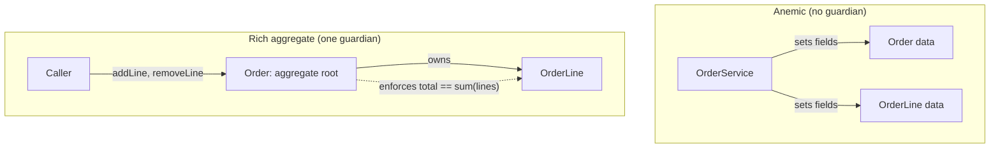

# OO Misuse Anti-Patterns — Senior

> **Category:** [Design Anti-Patterns](../README.md) → **OO Misuse** — *object-orientation applied as procedure-with-classes; the wrong allocation of behavior, the wrong reuse mechanism.*
> **Covers (collectively):** Anemic Domain Model · BaseBean · Constant Interface · Poltergeist · Object Orgy · Functional Decomposition · Call Super · Magic Container · Flag Arguments · Telescoping Constructor · Fragile Base Class

---

## Table of Contents

1. [Introduction](#introduction)
2. [Prerequisites](#prerequisites)
3. [How Did the Codebase Get Here? — Root-Cause Forces](#how-did-the-codebase-get-here--root-cause-forces)
4. [The Senior Refactoring Toolkit](#the-senior-refactoring-toolkit)
5. [Anemic Domain Model: Migrating to a Rich Model at Scale](#anemic-domain-model-migrating-to-a-rich-model-at-scale)
6. [Fragile Base Class & the Inheritance Family: Replace Inheritance with Delegation](#fragile-base-class--the-inheritance-family-replace-inheritance-with-delegation)
7. [Magic Container: Recovering a Type from `Map<String, Object>`](#magic-container-recovering-a-type-from-mapstring-object)
8. [Constructors & Flags: Builders and Two-Method Splits](#constructors--flags-builders-and-two-method-splits)
9. [The Remaining Smells — Summary Table](#the-remaining-smells--summary-table)
10. [When These Are Acceptable](#when-these-are-acceptable)
11. [Preventing OO Misuse Organizationally](#preventing-oo-misuse-organizationally)
12. [Common Mistakes](#common-mistakes)
13. [Test Yourself](#test-yourself)
14. [Cheat Sheet](#cheat-sheet)
15. [Summary](#summary)
16. [Further Reading](#further-reading)
17. [Related Topics](#related-topics)

---

## Introduction

> Focus: **How did the codebase get here?** and **How do I refactor safely at scale?**

At the junior level you learned to *name* these eleven shapes; at the middle level you learned the local cure — move a method, split a boolean, introduce a builder. This file is about the version you inherit as a senior: the Anemic Domain Model is not one class but an entire architectural *style* — fifty `*Entity` classes of pure getters and a parallel fifty `*Service` classes holding all the behavior, wired by an ORM and a transaction-script habit that the whole team shares. You can't "move a method"; you have to migrate a model while it serves traffic, and persuade the people who built the current style that the move is worth it.

Two questions define the work:

1. **How did it get this way?** OO misuse at scale is rarely ignorance of OO — it is the *deterministic output* of forces: layered/transaction-script architectures that push behavior up out of the data; ORM tooling that rewards public setters; an inheritance-first culture that reaches for `extends` before composition; schema-less data passing (`Map`, `dict`, `Bundle`) that defers the type decision forever. Fix the code without fixing the force and the anemic model regrows on the next entity.

2. **How do I change it without an outage?** The model is load-bearing and persisted. The answer is the same disciplined kit from [`bad-structure/senior.md`](../../01-development/01-bad-structure/senior.md) — seams, characterization tests, parallel-change, branch-by-abstraction — specialized for *behavior-placement* moves: Move Method into the entity, Replace Inheritance with Delegation, Replace Constructor with Builder, Replace Boolean Parameter with two methods or a Strategy.

> **The senior mindset shift:** the junior asks "does this class have behavior?"; the senior asks "is behavior placed where the invariants live, who pays when it isn't, and what is the smallest reversible move that relocates it?" You are migrating an object model, not grading one.

---

## Prerequisites

- **Required:** Fluency with [`junior.md`](junior.md) and [`middle.md`](middle.md) — you can recognize all eleven anti-patterns and apply Move Method / Introduce Builder / split-the-boolean with a test.
- **Required:** You have shipped to production and maintained an object model you did not design, behind an ORM.
- **Helpful:** Working knowledge of Domain-Driven Design — entities, value objects, aggregates, invariants.
- **Helpful:** SOLID (especially SRP, LSP, ISP) and Refactoring techniques.
- **Helpful:** The structural-refactoring kit in [`bad-structure/senior.md`](../../01-development/01-bad-structure/senior.md) — seams, characterization tests, parallel-change. This file reuses it.

---

## How Did the Codebase Get Here? — Root-Cause Forces

Every anemic model and every fragile hierarchy has a biography. Name the force before you touch a line, because **the same force will undo your refactor if it persists.**

### Transaction-script & layered architecture

The single largest cause of the Anemic Domain Model. A strict `Controller → Service → Repository → Entity` layering, where "business logic lives in the service layer" is doctrine, *structurally forbids* behavior on the entity. Each use case becomes a transaction script — a procedure that fetches data bags, mutates them, and saves them. The entity is demoted to a DTO with persistence annotations. This is Fowler's original complaint: the model has the *vocabulary* of OO (classes, fields) but the *paradigm* of 1970s procedural programming. Functional Decomposition is the same disease one level down: a "class" that is really a namespace for free functions because the language demanded a class.

### ORM habits

JPA/Hibernate, ActiveRecord, the Django ORM, GORM — all historically reward **public getters and setters** on every field (frameworks hydrate via reflection or setters; tutorials model `@Entity` as a property bag). The path of least resistance is `@Data` / `lombok` / auto-properties on everything, which is **Object Orgy** by default: encapsulation is fiction, any caller can mutate any field, and invariants have nowhere to live. The ORM didn't *force* it, but it made the anemic shape the one-line option.

### Inheritance-first culture

Teams that learned OO as "inheritance = reuse" reach for `extends` to share *code*, not to model *is-a*. A `BaseService` accretes helper methods; everything `extends BaseService` to get them (**BaseBean**). A base class adds a step every subclass must remember to invoke (**Call Super**). A change to the base silently breaks subclasses that depended on its internal call order (**Fragile Base Class**). The force is a cultural default — `extends` is the first tool reached for — compounded by frameworks whose own base classes (`HttpServlet`, `Activity`, `Spec`) trained the reflex.

### Schema-less data passing

Under deadline pressure, defining a type for a new payload is "ceremony"; shoving it into a `Map<String, Object>` / `dict[str, Any]` / `Bundle` is "fast." The type decision is deferred forever (**Magic Container**). Keys become stringly-typed lore; the compiler is blinded. This compounds with the anemic model — a service that operates on maps can't have a rich domain to move behavior *into*.

### The constructor ratchet

Each new requirement adds one optional field to an object. The "fast" move is one more constructor overload (**Telescoping Constructor**) or one more boolean parameter to flip the new behavior (**Flag Arguments**). Individually rational; collectively a `new Pizza(12, true, false, true, null, false)` call site nobody can read.


The practical takeaway, same as for structure: **a senior plan names the force, not just the smell.** "Make `Order` rich" is a wish. "Establish that invariants live on the aggregate, move balance/limit logic off `OrderService` onto `Order`, make setters package-private, and add an architecture test forbidding services from mutating entity fields directly" is a plan that *stays fixed*.

---

## The Senior Refactoring Toolkit

These are the structural kit from [`bad-structure/senior.md`](../../01-development/01-bad-structure/senior.md) — **seams, characterization tests, parallel-change, branch-by-abstraction, feature flags** — plus four moves specific to behavior placement. They compose: a real anemic-model migration uses all of them.

| Move | What it does | Anti-pattern it cures |
|---|---|---|
| **Move Method** | Relocate behavior from a service onto the class that owns the data it manipulates | Anemic Domain Model, Functional Decomposition |
| **Replace Inheritance with Delegation** | Make the subclass *hold* the former base as a field and forward only what it needs | BaseBean, Fragile Base Class, Call Super |
| **Introduce Parameter Object / Whole Type** | Replace a `Map<String,Object>` or a long parameter list with a named type | Magic Container, Telescoping Constructor |
| **Replace Constructor with Builder** | Replace overload chains / long ctors with a fluent, validated builder | Telescoping Constructor |
| **Replace Boolean Parameter with two methods / Strategy** | Split a flag-driven method into intention-revealing methods, or inject behavior | Flag Arguments |

Two reminders that carry over wholesale:

- **Characterization tests first.** Before relocating behavior, pin *what the code does today* (not what it should) with tests, so the move can prove it preserved behavior. Frozen bugs get fixed *later*, in a separate labeled commit.
- **Parallel-change (expand / migrate / contract).** Add the new shape *alongside* the old (a rich method beside the service method, a builder beside the telescoping constructors), migrate callers one at a time, delete the old form only when the last caller is gone. Everything stays on trunk, integrated.


---

## Anemic Domain Model: Migrating to a Rich Model at Scale

You inherit an `Account` that is pure data and an `AccountService` that holds every rule. The model is persisted, hydrated by an ORM, mutated from forty call sites. You cannot rewrite it; you migrate behavior onto it via Move Method, one invariant at a time.

### The starting shape

```java
// BEFORE — anemic: Account is a property bag; the rule lives in the service.
// Nothing stops a caller from setting a negative balance directly.
@Entity
public class Account {
    @Id private Long id;
    private long balanceCents;
    private long dailyWithdrawnCents;
    public long getBalanceCents()        { return balanceCents; }
    public void setBalanceCents(long c)  { this.balanceCents = c; }     // open mutation
    public long getDailyWithdrawnCents() { return dailyWithdrawnCents; }
    public void setDailyWithdrawnCents(long c) { this.dailyWithdrawnCents = c; }
}

public class AccountService {
    public void withdraw(Account a, long amount) {
        if (amount <= 0) throw new IllegalArgumentException("amount");
        if (amount > a.getBalanceCents()) throw new InsufficientFundsException();
        if (a.getDailyWithdrawnCents() + amount > DAILY_LIMIT) throw new LimitException();
        a.setBalanceCents(a.getBalanceCents() - amount);                // invariant logic
        a.setDailyWithdrawnCents(a.getDailyWithdrawnCents() + amount);  // spread across setters
    }
}
```

The invariant — *balance never negative, daily limit never exceeded* — is enforced only inside `AccountService.withdraw`. Any other code path that calls `setBalanceCents` bypasses it. That is the anemic model's core defect: the data has no guardian.

### Step 1 — Move the method onto the entity (expand)

Add a rich `withdraw` *on* `Account`, owning the invariant, **alongside** the service method. Don't change callers yet.

```java
// EXPAND — behavior moves to where the data and invariant live. The service
// method still exists; it now delegates. No external behavior changed yet.
@Entity
public class Account {
    @Id private Long id;
    private long balanceCents;
    private long dailyWithdrawnCents;

    public void withdraw(Money amount) {                 // the rule lives WITH the data
        if (amount.isNonPositive())        throw new IllegalArgumentException("amount");
        if (amount.cents() > balanceCents) throw new InsufficientFundsException();
        if (dailyWithdrawnCents + amount.cents() > DAILY_LIMIT) throw new LimitException();
        balanceCents       -= amount.cents();            // mutates its own state, atomically
        dailyWithdrawnCents += amount.cents();
    }
    public long balanceCents() { return balanceCents; }  // query, no setter exposed
}

public class AccountService {
    public void withdraw(Account a, long amount) {
        a.withdraw(Money.ofCents(amount));               // delegate through the new method
    }
}
```

Write characterization tests against `AccountService.withdraw` (capturing today's exceptions and resulting balances) *before* this move, and confirm they still pass after. You have relocated the invariant without changing what production does.

### Step 2 — Close the bypass (migrate, then contract setters)

The rich method is worthless while `setBalanceCents` remains public — a caller can still corrupt state. Use parallel-change on the *setters*: find every external caller (`grep`/IDE), migrate each to a domain operation, then tighten visibility.

```java
// CONTRACT — setters become package-private (ORM still reflects/sets via field
// access or a package-level hook); external mutation now goes through behavior.
@Entity
public class Account {
    @Id private Long id;
    @Column(name = "balance_cents") private long balanceCents;   // field-access mapping
    void setBalanceCents(long c) { this.balanceCents = c; }       // package-private: ORM only
    // public setter deleted; the only public path to change balance is withdraw()/deposit()
}
```

This is the move from **Object Orgy** (everything mutable by everyone) to encapsulation. With Hibernate/JPA, prefer *field access* (`@Access(FIELD)`) so you owe the ORM no setter at all; with ActiveRecord/Django use `private`-by-convention attributes plus domain methods. The entity now *guards* its invariants — the definition of a rich domain model in DDD.

### Step 3 — Pull true value objects out

`Money`, `DailyLimit`, `AccountNumber` are value objects: immutable, equal-by-value, self-validating. Extracting them removes whole classes of primitive-obsession bugs and gives behavior a home smaller than the entity.

```python
# Python — a value object: immutable, validated at construction, behavior-rich.
# A negative or non-integer-cents Money simply cannot exist.
from dataclasses import dataclass

@dataclass(frozen=True)
class Money:
    cents: int
    def __post_init__(self):
        if self.cents < 0:
            raise ValueError("Money cannot be negative")
    def __add__(self, other: "Money") -> "Money":
        return Money(self.cents + other.cents)
    def __sub__(self, other: "Money") -> "Money":
        return Money(self.cents - other.cents)   # raises if it would go negative
```

### The aggregate boundary

The senior judgment, from DDD: decide which entity is the **aggregate root** and route all mutation through it, so the invariant spanning several objects (an `Order` and its `OrderLine`s must sum to the `Order.total`) has exactly one guardian. The anemic model has *no* guardian; the over-corrected model has *many* (every object mutable). The aggregate is the disciplined middle: one root owns the consistency boundary.



> **Migrating a model is the God Object playbook in reverse.** There you *split* a class that did too much; here you *concentrate* behavior that was scattered across services back onto the data. Both are Move Method at scale, both behind characterization tests and parallel-change, both on trunk.

---

## Fragile Base Class & the Inheritance Family: Replace Inheritance with Delegation

BaseBean, Call Super, and Fragile Base Class are three faces of one mistake: **using inheritance for code reuse instead of for substitutable polymorphism (`is-a`).** The senior cure is almost always *Replace Inheritance with Delegation* (composition), applied with parallel-change so the hierarchy can be dismantled while it ships.

### Why the base class is fragile

A base class is fragile when subclasses depend on its *internal* behavior — the order it calls its own methods, which methods it calls, its protected fields. A change that is invisible from the base's public contract silently breaks a subclass.

```python
# FRAGILE — CountingSet overrides add() to count, and addAll() to add in bulk.
# It assumes the base's addAll does NOT call add() internally.
class InstrumentedSet(set):
    def __init__(self): super().__init__(); self.added = 0
    def add(self, x):    self.added += 1; return super().add(x)
    def update(self, it): self.added += len(list(it)); return super().update(it)
    # If a future Python made set.update() call self.add() per element, `added`
    # would DOUBLE-count: this is the Fragile Base Class trap. The subclass
    # depends on an UNDOCUMENTED internal-call assumption of the base.
```

The count breaks not because the subclass is wrong, but because it depended on a base-class implementation detail that was never part of the contract. This is the textbook Fragile Base Class / "inheritance breaks encapsulation" problem (Bloch, *Effective Java*).

### The fix: wrap, don't extend

```python
# DELEGATION — InstrumentedSet HAS-A set instead of IS-A set. It cannot be
# surprised by the wrapped set's internal calls, because it only ever calls
# the public interface. The contract is the public API, fully owned here.
class InstrumentedSet:
    def __init__(self, inner: set | None = None):
        self._inner = inner if inner is not None else set()
        self.added = 0
    def add(self, x):
        if x not in self._inner: self.added += 1
        self._inner.add(x)
    def update(self, items):
        for x in items: self.add(x)        # we control composition explicitly
    def __contains__(self, x): return x in self._inner
    def __iter__(self):        return iter(self._inner)
    def __len__(self):         return len(self._inner)
```

### Replacing a BaseBean / Call Super hierarchy at scale

A `BaseController` everything extends to reach helper methods, with a `Call Super` hook (`super.onInit()` must run first), is dismantled with parallel-change:

```go
// Go has no inheritance, which is instructive — the idiomatic shape is already
// the cure. The shared behavior is a field (composition), and the "must run
// first" sequencing is owned by a Template Method that the base controls, so
// subclasses CANNOT forget to call super.

// 1. The shared capability becomes a collaborator, not a superclass.
type RequestContext struct{ /* auth, logger, db handle */ }
func (c *RequestContext) init(r *http.Request) error { /* the former onInit() */ return nil }

// 2. A Handler interface defines only the variable part — the hook.
type Handler interface { Handle(ctx *RequestContext, r *http.Request) (Response, error) }

// 3. The framework (base) owns control flow; it calls init() ITSELF, then the
//    hook. No subclass can "forget super" because subclasses never call init().
func Serve(h Handler, w http.ResponseWriter, r *http.Request) {
    ctx := &RequestContext{}
    if err := ctx.init(r); err != nil { writeErr(w, err); return }  // Call Super, automated
    resp, err := h.Handle(ctx, r)                                   // the variable hook
    if err != nil { writeErr(w, err); return }
    write(w, resp)
}
```

This is the **Template Method** pattern (see Behavioral patterns) replacing the Call Super smell: the base owns the *invariant sequence* and exposes only an abstract hook, so forgetting the super-call is impossible by construction. The migration: introduce the interface (expand), move each subclass's logic into a `Handle` implementation that takes the context (migrate), delete the old base class (contract).

> **Senior judgment on inheritance.** Keep inheritance only for genuine `is-a` substitutability that honors the Liskov Substitution Principle — a `Subclass` usable anywhere a `Base` is, with no surprises. The moment inheritance is being used to *share helper code* (BaseBean) or *force a sequence* (Call Super), reach for delegation or Template Method. Default classes to `final`/`sealed`; make extension a deliberate, documented contract, not the path of least resistance.

---

## Magic Container: Recovering a Type from `Map<String, Object>`

A `Map<String, Object>` (or `dict[str, Any]`, or Android `Bundle`) threaded through the codebase is the type system *switched off*: keys are stringly-typed lore, the compiler can't help, and every read is a cast-and-pray. At scale, dozens of call sites read `ctx.get("user_id")` with no guarantee the key exists or holds the right type.

### The migration: parallel type, then strangle the map

```java
// BEFORE — the Magic Container: undocumented keys, runtime casts everywhere.
Map<String, Object> ctx = new HashMap<>();
ctx.put("userId", 42L);
ctx.put("locale", "en-US");
ctx.put("retry", true);
// ...300 lines and 5 files later...
long uid = (Long) ctx.get("userId");          // NPE / ClassCastException waiting to happen
String loc = (String) ctx.get("locale");      // typo "local" → silent null
```

```java
// EXPAND — introduce the real type the map was pretending to be. The compiler
// now enforces presence and type; the keys are fields with documentation.
public record RequestContext(long userId, Locale locale, boolean retry) {}

// MIGRATE — at each boundary, convert map → type once, then pass the type.
// Old map-based code and new type-based code coexist during the migration.
RequestContext ctx = new RequestContext(42L, Locale.forLanguageTag("en-US"), true);
long uid = ctx.userId();        // no cast, no missing-key risk, autocomplete works
```

The strategy is parallel-change: build the typed shape, convert at the *edges* (where the map is first constructed), let the typed value flow inward, and delete the map plumbing once the last reader is migrated. Where a map is genuinely dynamic (truly open-ended, user-supplied keys), that is the *legitimate* use — see below — but a fixed, known set of keys masquerading as a map is the anti-pattern, and recovering the type is pure profit: every "what keys does this have?" archaeology question becomes a struct definition.

---

## Constructors & Flags: Builders and Two-Method Splits

### Telescoping Constructor → Builder

```java
// BEFORE — the telescoping chain. Call sites are unreadable positional soup;
// you cannot tell what `new Pizza(12, true, false, true)` means without the docs.
public Pizza(int size) { this(size, false); }
public Pizza(int size, boolean cheese) { this(size, cheese, false); }
public Pizza(int size, boolean cheese, boolean pepperoni) { this(size, cheese, pepperoni, false); }
public Pizza(int size, boolean cheese, boolean pepperoni, boolean olives) { /* ... */ }
```

```java
// AFTER — Replace Constructor with Builder. Names at the call site, validation
// in one place (build()), immutable result, and optional fields are obvious.
Pizza p = new Pizza.Builder(12)
    .cheese()
    .pepperoni()
    .build();          // validates invariants once, returns an immutable Pizza

// The builder lives alongside the constructors during migration (expand),
// callers move one at a time (migrate), the public constructors are then made
// private/deleted (contract). Each step is a small, reversible PR.
```

In languages with named/default arguments (Python, Kotlin, C#), the builder is often unnecessary — named parameters *are* the cure, and reaching for a builder there is over-engineering. The builder earns its keep when you also need staged validation, immutability, or a fluent DSL. (See Builder pattern.)

### Flag Arguments → two methods or a Strategy

```python
# BEFORE — the flag argument. `process(order, async_=True, retry=False)` reads
# as nothing at the call site; the body is two methods fused with branches.
def process(order, async_=False, retry=False):
    if async_:
        if retry: return _enqueue_with_retry(order)
        return _enqueue(order)
    if retry: return _run_with_retry(order)
    return _run(order)
```

```python
# AFTER (small cases) — split into intention-revealing methods. The boolean
# permutations become named, discoverable, individually testable entry points.
def process(order):              return _run(order)
def process_async(order):        return _enqueue(order)
def process_with_retry(order):   return _run(RetryPolicy.default(), order)
```

When the flags multiply (three booleans = eight behaviors), splitting into eight methods is itself a smell; inject the variation as a **Strategy** instead:

```python
# AFTER (combinatorial cases) — Replace Boolean with Strategy. Execution mode
# and retry policy are objects, composed at the boundary, not flags in the body.
def process(order, executor: Executor, retry: RetryPolicy):
    return executor.run(retry.wrap(lambda: _do(order)))
```

The rule: split a *single* behavior-flipping boolean into two methods; promote *combinatorial* flags to injected strategies/enums. Either way, a method whose body is `if flag:` doing two unrelated things is two methods wearing a trench coat.

---

## The Remaining Smells — Summary Table

The deepest treatments above cover the common, high-leverage cases. The remaining OO-misuse smells share the same root forces and the same kit; here they are at senior altitude.

| Anti-pattern | Senior-level tell | Root force | Refactoring move at scale | When acceptable |
|---|---|---|---|---|
| **Functional Decomposition** | A "class" with only static methods and no state — a namespace pretending to be an object | Transaction-script habit / language requires a class | In Python/Go: make them free functions in a module. In Java: a `final` class with a private ctor *is* the idiom — name it `…Utils` honestly, don't pretend it's an object | Pure stateless utilities (`Math`, `Collections`) — these are *correct* as static, not anemic |
| **Constant Interface** | An `interface` with only `static final` constants that classes `implement` to import names | Pre-`static import` Java idiom, cargo-culted | Replace with a `final` constants class + `import static`, or an `enum` for a closed set | Never as an interface; the *intent* (shared constants) is fine via the right mechanism |
| **Poltergeist** | A short-lived object that exists only to call another object's method, holding no state, contributing no behavior | Misapplied "everything is an object"; over-eager controller/manager classes | Inline the call site; delete the intermediary. The work belongs to the object it was delegating to | A thin adapter at a genuine boundary (anti-corruption layer) is *not* a poltergeist — it translates |
| **Object Orgy** | Public fields / `friend` access / setters everywhere; encapsulation is fiction | ORM setter habits + `@Data`/auto-property defaults | Tighten visibility incrementally (parallel-change on setters, as in the anemic migration); push mutation through behavior; favor immutability | An immutable record/struct exposing read-only fields is *not* an orgy — exposure without mutability is safe |
| **BaseBean** | `class X extends BaseUtil` purely to reach helper methods | Inheritance-first culture | Replace Inheritance with Delegation; or free functions / injected collaborator | — (genuine `is-a` is the only good reason to extend) |
| **Call Super** | Every override must call `super.m()` or invariants break | Inheritance-first + framework base classes | Template Method: base owns control flow, subclass fills an abstract hook | A framework you don't control may *require* it; document and lint for it |

---

## When These Are Acceptable

The senior skill juniors lack: knowing when the "anti-pattern" is the *right* tool. These shapes are smells *in a domain model*; many are correct *at a boundary* or *in the small*.

- **An anemic object at a boundary is fine — it's a DTO.** A wire/API/persistence DTO *should* be a behavior-free property bag: it crosses a serialization boundary, it has no invariants of its own, behavior on it would couple the boundary to the domain. The anti-pattern is anemic *domain* objects (the ones with invariants), not anemic *transfer* objects. Map DTO → rich entity at the edge; keep them distinct types.
- **A flag in a private helper is fine.** `_render(html=True)` inside one file, called twice, never part of a public API, is not worth two methods. The Flag Argument smell bites when the boolean is *public*, *combinatorial*, or *toggles unrelated behaviors*. A single private boolean that selects a format is just a parameter.
- **A `Map`/`dict` for genuinely dynamic data is correct.** Parsed JSON of unknown shape, a plugin's arbitrary user-supplied config, an event bag with open-ended attributes — these are *legitimately* dynamic and a map is the right type. The anti-pattern is a *fixed, known* set of keys masquerading as a map.
- **Static utilities are not Functional Decomposition.** `Math.max`, `Collections.sort` — stateless pure functions with no invariants. Forcing them into stateful objects would be the actual mistake.
- **Inheritance for true `is-a` substitutability is correct.** Template Method, sealed hierarchies modeling a closed set of variants (`Shape` → `Circle`/`Square`), framework extension points — inheritance honoring LSP is a tool, not a smell. The misuse is inheritance-for-code-reuse and undocumented fragile contracts.
- **A telescoping constructor with two args is fine.** The builder earns its keep at ~4+ optional fields or when you need staged validation/immutability. For `new Point(x, y)`, a builder is over-engineering — see Over-Engineering.

> **The frame:** these patterns describe *misplaced* behavior and *bypassed* types. At a boundary, in a private helper, for genuinely dynamic data, or for honest stateless utilities, the same shape is the correct engineering choice. Context decides; dogma doesn't.

---

## Preventing OO Misuse Organizationally

Refactoring fixes today's anemic model; *prevention* stops it regrowing. The root causes are cultural and architectural, so the durable fixes are automated and social — they outlast the engineer who cares.

### Architecture tests / fitness functions

Encode the boundaries you fought for as **executable tests in CI**, so a regression fails the build instead of relying on a reviewer noticing.

```java
// Java — ArchUnit. The rules below encode "rich model, no inheritance-for-reuse,
// no constant interfaces" so the anti-patterns fail the build, not the reviewer.
@ArchTest
static final ArchRule entities_are_not_anemic =
    classes().that().areAnnotatedWith(Entity.class)
        .should(haveAtLeastOneNonAccessorPublicMethod())   // a smoke alarm for ADM
        .as("entities should own behavior, not just getters/setters");

@ArchTest
static final ArchRule no_public_setters_on_aggregates =
    noMethods().that().haveNameStartingWith("set")
        .and().areDeclaredInClassesThat().areAnnotatedWith(AggregateRoot.class)
        .should().bePublic();                               // closes Object Orgy / ADM bypass

@ArchTest
static final ArchRule no_constant_interfaces =
    noClasses().that().areInterfaces()
        .should(onlyDeclareConstants())
        .as("use a final constants class + static import, or an enum");
```

```go
// Go — a linter rule (custom analyzer or go-arch-lint) can flag a struct whose
// methods are all field accessors, or forbid a package of only-static "managers".
// Layering rules also help: services may NOT import entity setters directly.
```

Other useful gates: forbid `Map<String, Object>` / `interface{}` in domain-package signatures (catches Magic Container), flag methods with `boolean` parameters in *public* API (catches Flag Arguments), and a max-constructor-arity gate (nudges toward builders). Each is a smoke alarm that routes attention, not an absolute law.

### Lint rules

- `lombok`/`@Data` banned on `@Entity`/aggregate types (forces deliberate accessors).
- Boolean-parameter linters (`flake8-boolean-trap` in Python, custom Checkstyle/Detekt rules) for public methods.
- `final`/`sealed`-by-default lint: extending a non-`final` class outside its package requires an explicit annotation.

### Review norms and ADRs

- **A modeling review norm:** when a PR adds an `*Entity` and an `*Service` that does all its work, the reviewer asks *"why doesn't this behavior live on the entity?"* — the OO-misuse counterpart of "what ticket needs this now?"
- **An ADR for the modeling style:** write down *"this codebase uses rich domain models behind a layered API; entities guard their invariants; services orchestrate, they do not mutate entity fields."* Six months later the engineer tempted to write a transaction script reads the rationale instead of re-introducing the style.
- **Small, scoped PRs** so a behavior-placement change is reviewable, and **a bounded boy-scout rule** so each PR may move *one* method onto its rightful owner (separate commit), slowly reversing the anemic drift.

> **The senior's real product is not the rich model — it's the system that keeps the model from re-anemifying:** an architecture test, a lint rule, an ADR, and a review norm. Code rots back to the team's defaults; change the defaults and the model holds.

---

## Common Mistakes

Mistakes seniors make when refactoring OO misuse at scale:

1. **Making *every* object rich, including DTOs and the persistence edge.** Wire/API/DB transfer objects *should* be anemic; pushing behavior onto them couples the boundary to the domain. *Rich domain objects, anemic transfer objects — and keep them distinct types.*
2. **Moving behavior onto the entity but leaving the public setters.** A rich `withdraw()` is theatre while `setBalance()` is public — the invariant is still bypassable. *Close the bypass with parallel-change on the setters, or you've changed nothing.*
3. **Replacing inheritance with delegation by forwarding the *entire* interface.** Wrapping a base class and re-exposing all 40 methods recreates the coupling and adds boilerplate. *Delegate only what the type actually needs; that smaller surface is the point.*
4. **Turning a 2-arg constructor into a builder because "builders are good."** In a language with named arguments, or for few-field objects, the builder is over-engineering. *Builders earn their keep at ~4+ optional fields or staged validation/immutability.*
5. **Splitting one private boolean helper into two public methods.** The Flag Argument cure applies to *public, combinatorial, behavior-toggling* booleans, not a private `_render(html=True)`. *Don't bureaucratize a harmless parameter.*
6. **Recovering a type from a *genuinely* dynamic map.** Forcing a struct onto open-ended user config or unknown-shape JSON fights the problem. *Type the fixed-key impostors; leave the truly dynamic maps as maps.*
7. **Treating fitness-function thresholds as truth.** A "max 0 boolean params" gate produces an enum with two values named `TRUE`/`FALSE`, gaming the metric. *Metrics route attention; humans judge.*
8. **Mixing the behavior-relocation move with a bug fix in one commit.** When the deploy regresses you can't tell whether Move Method or the fix did it. *Separate, always — including the bug a characterization test froze.*

---

## Test Yourself

1. You inherit fifty `@Entity` classes of pure getters/setters and fifty matching `*Service` classes holding all the logic, all hydrated by Hibernate. Name the two forces most likely responsible, and outline the *first three* concrete steps to make one entity rich without an outage.
2. Why is moving a method onto an entity *insufficient* on its own to fix the Anemic Domain Model? What second move is required, and how do you do it safely?
3. A subclass `extends` a base class purely to reuse helper methods, and overrides one method that must call `super` first. Which two anti-patterns are present, and what single refactoring addresses both? What pattern replaces the "must call super" requirement?
4. Explain the Fragile Base Class problem in one sentence, then explain why Replace Inheritance with Delegation makes the subclass robust to base-class changes.
5. Give two situations where an anemic, behavior-free object is the *correct* design, not an anti-pattern.
6. You find a `Map<String, Object>` threaded through five files with a fixed set of nine keys. Outline the parallel-change migration to a real type, and state the one case where keeping the map would be correct.
7. When do you split a Flag Argument into two methods, and when do you instead inject a Strategy? Give the deciding factor.
8. Name two automated mechanisms you'd add so a freshly de-anemified model doesn't regrow, and state which root-cause force each addresses.

---

## Cheat Sheet

| Anti-pattern at scale | Root-cause force | Senior refactoring move | Safety / governance |
|---|---|---|---|
| **Anemic Domain Model** | Transaction-script doctrine + ORM setter habits | Move Method onto entity → close setter bypass → extract value objects → define aggregate root | Characterization tests + parallel-change on setters; ArchUnit "entities own behavior" + ADR |
| **Object Orgy** | ORM/`@Data` defaults | Tighten visibility via parallel-change; mutation through behavior; immutability | Lint: no `@Data` on entities; ArchUnit no public setters on aggregates |
| **Functional Decomposition** | Transaction-script habit / language needs a class | Free functions (Py/Go); honest `…Utils` (Java) — don't fake an object | Distinguish from legitimate stateless utilities |
| **BaseBean / Call Super / Fragile Base Class** | Inheritance-first culture + framework base classes | Replace Inheritance with Delegation; Template Method for forced sequencing | `final`/`sealed`-by-default lint; delegate only the needed surface |
| **Magic Container** | Schema-less data passing under deadline | Introduce real type; convert at edges; strangle the map | Lint: no `Map<String,Object>`/`interface{}` in domain signatures |
| **Telescoping Constructor** | Constructor ratchet | Replace Constructor with Builder (or named args) | Max-arity gate; skip builder for few-field / named-arg langs |
| **Flag Arguments** | Constructor/flag ratchet | Two methods (single bool) or Strategy/enum (combinatorial) | Boolean-trap linter on public APIs |
| **Constant Interface / Poltergeist** | Cargo-cult idiom / over-eager objects | `final` constants class + static import / enum; inline & delete the intermediary | ArchUnit no-constant-interfaces; review norm |

**Three golden rules:**
- *Behavior belongs where the invariant lives — Move Method onto the data, then close the bypass, or you've changed nothing.*
- *Inheritance only for substitutable `is-a`; for code reuse and forced sequencing, use delegation and Template Method. Default to `final`.*
- *These are smells in a domain model, not at a boundary — an anemic DTO, a private flag, a dynamic map, and a stateless utility are all correct. Context decides.*

---

## Summary

- **How it got here:** OO misuse at scale is the deterministic output of forces — **transaction-script/layered doctrine** and **ORM setter habits** (Anemic Domain Model, Object Orgy), an **inheritance-first culture** (BaseBean, Call Super, Fragile Base Class), **schema-less data passing** (Magic Container), and the **constructor ratchet** (Telescoping Constructor, Flag Arguments). Fix the code without the force and the anemic model regrows.
- **The toolkit:** the structural kit — **seams, characterization tests, parallel-change, branch-by-abstraction, feature flags** — plus four behavior-placement moves: **Move Method**, **Replace Inheritance with Delegation**, **Replace Constructor with Builder**, **Replace Boolean with two methods / Strategy**.
- **Anemic Domain Model:** Move Method onto the entity (behind characterization tests), *then* close the setter bypass via parallel-change, extract value objects, and route mutation through the **aggregate root** — the one guardian of a cross-object invariant. It's the God Object playbook in reverse: concentrate scattered behavior instead of splitting it.
- **Inheritance family:** Replace Inheritance with Delegation (wrap, forwarding only what's needed) for BaseBean/Fragile Base Class; **Template Method** for Call Super so forgetting `super` is impossible. Keep inheritance only for LSP-honoring `is-a`; default classes `final`.
- **Magic Container:** introduce the real type the map was pretending to be, convert at the edges, strangle the plumbing — but leave *genuinely dynamic* maps alone.
- **Constructors & flags:** Builder for ~4+ optional fields / staged validation (named args suffice in Python/Kotlin); split a single behavior-flipping boolean into two methods, promote combinatorial flags to a Strategy.
- **When not to:** an anemic **DTO** at a boundary, a **private** flag, a **dynamic** map, **stateless utilities**, and true `is-a` inheritance are all correct. The smell is in the *domain model*, not everywhere.
- **Prevention is organizational and automated:** **architecture tests** (ArchUnit / go-arch-lint), **lint rules** (no `@Data` on entities, boolean-trap linters, `final`-by-default), **ADRs** for the modeling style, and review norms. The senior's real deliverable is the system that keeps the model from re-anemifying.
- Next: [`professional.md`](professional.md) — testability, performance, and observability implications of these shapes and their fixes.

---

## Further Reading

- **Patterns of Enterprise Application Architecture** — Martin Fowler (2002) — coined *Anemic Domain Model*; Transaction Script vs. Domain Model.
- **Domain-Driven Design** — Eric Evans (2003) — rich models, entities, value objects, aggregates; the antidote to anemia. See also DDD.
- **Effective Java** — Joshua Bloch (3rd ed., 2018) — Item 18 "Favor composition over inheritance" (the Fragile Base Class / Replace Inheritance with Delegation argument), Item 2 (Builder), Item 22 (Constant Interface anti-pattern).
- **Refactoring** — Martin Fowler (2nd ed., 2018) — Move Method, Replace Superclass with Delegate, Introduce Parameter Object, Replace Constructor with Factory/Builder, Parallel Change.
- **Working Effectively with Legacy Code** — Michael Feathers (2004) — seams and characterization tests for relocating behavior in test-less code.
- **Clean Code** — Robert C. Martin (2008) — Tell-Don't-Ask, flag arguments, the limits of accessors.
- **Implementing Domain-Driven Design** — Vaughn Vernon (2013) — aggregate design rules and the practical mechanics of rich models behind a persistence layer.

---

## Related Topics

- [`junior.md`](junior.md) · [`middle.md`](middle.md) — recognizing the eleven shapes and the local cures this file scales up.
- [`professional.md`](professional.md) — testability, performance, and observability angles.
- DDD — rich domain models, value objects, and the aggregate boundary that the anemic model lacks.
- Clean Code → Classes — SRP, ISP, LSP — the principles these anti-patterns violate.
- Refactoring → Refactoring Techniques — Move Method, Replace Inheritance with Delegation, Introduce Parameter Object as mechanical recipes.
- Design Patterns → Builder — the positive counterpart to the Telescoping Constructor.
- Design Patterns → Behavioral (Template Method, Strategy) — the cures for Call Super and combinatorial Flag Arguments.
- Clean Code → Immutability — the defense against Object Orgy.
- [Bad Structure](../../01-development/01-bad-structure/senior.md) — the structural sibling; the God Object migration is this file's Move-Method-at-scale in reverse.
- Over-Engineering — the failure mode of *over*-applying these fixes: a builder for two fields, a hierarchy where a map would do.

---

## Check your understanding

1. Explain OO Misuse Anti-Patterns — Senior Level in your own words and name the problem it solves.
2. How would you apply the ideas around Table of Contents, Introduction, Prerequisites in a realistic engineering change?
3. What failure mode or misuse should you look for, and what evidence would reveal it?
4. How would you validate a system-level decision about OO Misuse Anti-Patterns — Senior Level under uncertainty?
5. What observable result would convince you that the approach improved the system?
