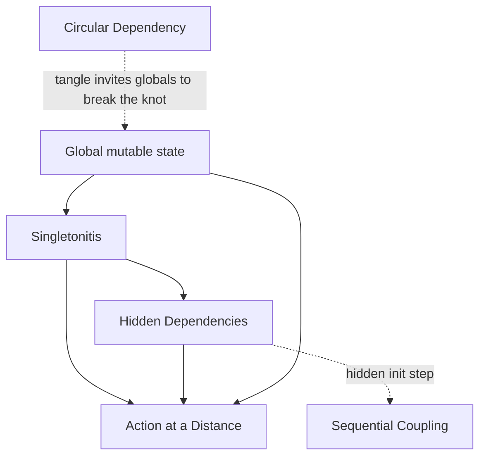

# Coupling & State Anti-Patterns — Junior

> **Category:** [Design Anti-Patterns](../README.md) → **Coupling & State** — *modules that know or share too much.*
> **Covers (collectively):** Singletonitis · Circular Dependency · Action at a Distance · Hidden Dependencies · Sequential Coupling

---

## Introduction

> Focus: **What does it look like?** and **Why is it bad?**

The previous category — [OO Misuse](../01-oo-misuse/junior.md) — was about getting the *shape* of a single class wrong. This category is about getting the **relationships between classes** wrong: who depends on whom, who shares state with whom, and whether those connections are honest and visible or secret and surprising.

The unifying root symptom here is: **a module knows or shares more than its interface admits.** You call a function expecting it to take inputs and produce an output, but it secretly reads a global, reaches into another module, mutates state somewhere else, or only works if you called three other things first in the right order. The connection is real, but it isn't written down anywhere the compiler or the reader can see.

That gap — between *what the signature says* and *what the code actually depends on* — is what makes coupled code feel haunted. You change one thing and a distant, unrelated test fails. The five anti-patterns here are the named shapes of that haunting:

- **Singletonitis** — global single-instance objects reached from anywhere, hiding who depends on what.
- **Circular Dependency** — module A needs B, B needs A; neither can stand alone.
- **Action at a Distance** — code here silently changes state over there.
- **Hidden Dependencies** — a function's signature lies about what it actually needs to run.
- **Sequential Coupling** — methods that only work if called in one exact order.

At the junior level your goal is to **recognize each shape** and understand **why** it makes code fragile and hard to test. You don't need to redesign large systems — that's `senior.md`. You need to stop *writing* code whose real dependencies are invisible.

> **The mindset shift:** the most valuable property of a function is that **its inputs and outputs tell the whole truth.** If you can understand and test a piece of code by reading its signature, it's honest. If you have to know about globals, call order, or hidden side effects, it's coupled — and coupling is what makes change expensive.

---

## Prerequisites

- **Required:** You can read and write functions, classes, and modules/packages in at least one language (examples here use Go, Java, and Python).
- **Required:** You understand the difference between a function's **parameters** (what it declares it needs) and **global/shared state** (what it can reach without asking).
- **Helpful:** You've tried to write a unit test and discovered you couldn't, because the thing under test reached out to a database, a clock, or a global config. That frustration is what this whole category explains.
- **Helpful:** Basic familiarity with `import` / `package` graphs — Circular Dependency is literally a cycle in that graph.

---

## Glossary

| Term | Definition |
|------|-----------|
| **Coupling** | How much one piece of code depends on another. The looser the coupling, the more independently each piece can change, be understood, and be tested. |
| **State** | Data that persists and can change over time — a field, a global variable, a row in a database. Shared mutable state is the fuel for most anti-patterns here. |
| **Global state** | Data reachable from anywhere in the program without being passed in — a global variable, a static field, a singleton. Convenient to reach, impossible to track. |
| **Singleton** | A design where exactly one instance of a class exists, reachable globally (e.g. `Logger.getInstance()`). Useful rarely; overused constantly — that overuse is *Singletonitis*. |
| **Dependency** | Anything a piece of code needs in order to work — another object, a config value, the filesystem, the current time. |
| **Explicit dependency** | A dependency passed in as a parameter or constructor argument — visible in the signature. |
| **Hidden dependency** | A dependency reached secretly (global, env var, file) — invisible in the signature; the signature *lies*. |
| **Side effect** | Anything a function does besides returning a value — mutating a global, writing a file, printing. *Action at a Distance* is side effects you didn't expect. |
| **Dependency Injection (DI)** | Passing a component its dependencies from outside instead of letting it fetch them itself. The single most common cure in this category. |
| **Invariant** | A condition that should always hold true for an object. Sequential Coupling exists when an invariant ("connection is open") is only true after a specific call. |

---

## The Five at a Glance

| Anti-pattern | One-line symptom | The smell you feel |
|---|---|---|
| **Singletonitis** | Everything is a global single instance | "I just call `Config.get()` from anywhere." |
| **Circular Dependency** | A needs B, B needs A | "I can't import this module without that one." |
| **Action at a Distance** | Code here mutates state there | "Why did *that* break when I changed *this*?" |
| **Hidden Dependencies** | Signature lies about what's needed | "It compiles, but crashes unless the env var is set." |
| **Sequential Coupling** | Must call methods in a fixed order | "You have to call `init()` first or it blows up." |

These are **relationship** anti-patterns: you spot them by looking at how two or more units connect, not at one bad line. Read each section below for the shape, a concrete example, and the junior-level fix.

---

## Singletonitis

### What it looks like

A **Singleton** is a class that allows only one instance, reachable globally. Used sparingly it's fine. **Singletonitis** is the disease where *everything* becomes a singleton — the config, the logger, the database connection, the session, the cache, the "manager" — each a globally reachable single instance that any code can grab out of thin air.

```python
# Python — Singletonitis: every dependency is a global instance
class Config:
    _instance = None
    @classmethod
    def get(cls):
        if cls._instance is None:
            cls._instance = cls()
        return cls._instance

class Database:
    _instance = None
    @classmethod
    def get(cls):
        ...

# ...and now this function reaches out and grabs them from nowhere:
def create_user(name):
    if Config.get().feature_enabled("signups"):   # global #1
        Database.get().insert("users", {"name": name})  # global #2
        Logger.get().info(f"created {name}")             # global #3
```

`create_user(name)` *claims* to need only a name. In reality it needs a configured `Config`, a live `Database`, and a `Logger` — none of which appear in its signature.

### Why it's bad

- **Untestable.** To test `create_user` you must set up real global config, a real database, and a real logger — there's no seam to pass in fakes.
- **Hidden coupling.** Every singleton call is a [Hidden Dependency](#hidden-dependencies). The function's signature lies about what it needs.
- **Global mutable state.** Two tests (or two requests) share the same `Database.get()` instance, so one can corrupt another's state — a textbook setup for [Action at a Distance](#action-at-a-distance).
- **You can't have two.** The day you need two database connections (a read replica, a test DB), the "only one instance ever" assumption fights you.

### The junior-level fix

**Pass dependencies in** instead of fetching them globally. This is Dependency Injection — and at the junior level it's as simple as adding parameters.

```python
# Dependencies are now explicit and swappable
def create_user(name, config, db, logger):
    if config.feature_enabled("signups"):
        db.insert("users", {"name": name})
        logger.info(f"created {name}")

# In a test, pass fakes — no globals, no real database:
create_user("ada", FakeConfig(signups=True), FakeDB(), SilentLogger())
```

> **Smell test:** if a function reaches `.get()` / `.getInstance()` / a global to find what it needs, ask *"could I write a unit test for this without touching the real world?"* If the answer is no, you've got Singletonitis. Reserve true singletons for genuinely process-wide, stateless resources — and even then, prefer passing them in.

---

## Circular Dependency

### What it looks like

A **Circular Dependency** is when module A depends on module B, and B depends back on A (directly, or through a longer chain A → B → C → A). The import graph has a *cycle*, so neither module can be understood, compiled, or tested without dragging in the other.

```go
// Go — package "order" imports "user", and "user" imports "order"

// order/order.go
package order
import "app/user"
type Order struct { Owner *user.User }
func (o *Order) NotifyOwner() { o.Owner.SendEmail("your order shipped") }

// user/user.go
package user
import "app/order"      // ← cycle! user now needs order, which needs user
type User struct { Orders []*order.Order }
func (u *User) TotalSpent() float64 { /* iterates order.Order */ }
```

Go will refuse to compile this — it reports `import cycle not allowed`. In Python it manifests as `ImportError` or half-initialized modules; in Java it compiles but ties the two classes together forever.

### Why it's bad

- **Nothing is independent.** You cannot reuse, move, or understand `order` without also pulling in `user`, and vice versa. They've become one tangled unit wearing two names.
- **Tests drag everything in.** A unit test for `order` must construct `user` too, because they refer to each other.
- **Changes ripple both ways.** A change in either module risks breaking the other, with no clear "owner."
- **It blocks compilation** in stricter languages, forcing ugly workarounds (merging files, reflection, lazy imports) that hide the real design problem.

### The junior-level fix

Break the cycle by making the dependency point **one way**. Two common junior moves:

1. **Extract the shared piece** into a third module both can depend on.
2. **Invert one direction with an interface** — let the lower-level module define an interface, and have the higher-level one implement it, so the arrow points only one way.

```go
// Fix: "order" no longer imports "user". It depends on a small interface
// that it defines itself. "user" depends on "order" — one direction only.

// order/order.go
package order
type Notifiable interface { SendEmail(msg string) }   // order defines what it needs
type Order struct { Owner Notifiable }
func (o *Order) NotifyOwner() { o.Owner.SendEmail("your order shipped") }

// user/user.go
package user
import "app/order"                 // user → order, and nothing back
type User struct { /* ... */ }
func (u *User) SendEmail(msg string) { /* ... */ }   // satisfies order.Notifiable
```

Now the graph is `user → order` with no return arrow. The cycle is gone.

> **Smell test:** if you draw arrows between your modules and find a loop — or the compiler says "import cycle" — you have a Circular Dependency. The fix is always to make one of the arrows go away, usually by introducing an interface or a shared third module.

---

## Action at a Distance

### What it looks like

**Action at a Distance** is when code in one place silently changes state that affects a completely different, seemingly unrelated place. You edit or call something *here*, and behavior breaks *over there* — with no visible connection between the two.

The fuel is almost always **shared mutable state**: a global variable, a static field, or a passed-by-reference object that more than one part of the program holds onto and mutates.

```java
// Java — a shared mutable global; mutating it "here" breaks behavior "there"
public class Settings {
    public static int pageSize = 20;   // public, static, mutable: a loaded gun
}

// Module A, run during a CSV export, tweaks it "temporarily"...
Settings.pageSize = 10000;            // and forgets to set it back

// Module B, a totally unrelated web handler, paginates with it:
int size = Settings.pageSize;          // suddenly serves 10,000 rows per page
List<Row> page = repo.fetch(offset, size);  // ...mystery production incident
```

Nothing in Module B's code mentions Module A. Yet A's write reached across the entire program and changed B's behavior. That's action at a distance.

### Why it's bad

- **The cause and effect are far apart.** The line that *broke* the behavior and the line that *exhibits* the bug are in different files, written by different people. Debugging means searching the entire codebase for "who else touches this."
- **Order-of-execution bugs.** Behavior now depends on *what ran before*, which is invisible and timing-dependent — a nightmare with concurrency.
- **Tests pass alone, fail together.** A test that mutates global state can poison the next test, producing failures that depend on test order.

### The junior-level fix

Make state **explicit and local**. Pass values in as parameters and return new values out, instead of reaching into shared mutable globals. Where you can, prefer immutability so the value *can't* be changed from afar.

```java
// pageSize is now passed in — local, explicit, no spooky reach-around
public List<Row> fetchPage(int offset, int pageSize) {
    return repo.fetch(offset, pageSize);
}

// The CSV export uses its own large size, with zero effect on anyone else:
exporter.export(fetchPage(0, 10_000));
webHandler.render(fetchPage(offset, 20));   // unaffected, always 20
```

> **Smell test:** if changing or calling code in one place causes a bug somewhere that *doesn't mention it*, look for shared mutable state — a `public static`, a module-level global, a long-lived object multiple owners mutate. Make the data flow through parameters and return values instead.

---

## Hidden Dependencies

### What it looks like

A **Hidden Dependency** is a dependency a piece of code needs but doesn't declare. The signature promises one thing; the body secretly requires more — an environment variable, a global, the filesystem, the system clock, a network call. The code **lies about what it needs to run.**

```python
# Python — the signature says "give me an amount"; the truth is much bigger
import os, requests

def charge_customer(amount):
    api_key = os.environ["STRIPE_KEY"]          # hidden dep: an env var
    rate = requests.get("https://fx.example/usd").json()["rate"]  # hidden dep: network
    fee = GLOBAL_FEE_TABLE["standard"]          # hidden dep: a global
    return requests.post("https://api.stripe...", ...)  # hidden dep: a live API
```

Read the signature — `charge_customer(amount)` — and you'd think you could call it with a number. In reality it needs an env var set, a working network, a populated global table, and a reachable payment API. None of that is visible until it crashes.

### Why it's bad

- **The signature lies.** A reader (or caller) can't tell what the function actually requires, so they call it wrong and get runtime crashes instead of compile-time guidance.
- **Untestable in isolation.** You can't unit-test `charge_customer` without setting an env var and hitting two live HTTP endpoints. There's no seam to substitute fakes.
- **Fragile across environments.** It works on your machine (env var set, network up) and dies in CI or production where those hidden requirements differ.
- **Hidden coupling everywhere.** Singletons, globals, and `os.environ` reads are all hidden dependencies — which is why this anti-pattern is the connective tissue of the whole category.

### The junior-level fix

**Promote every hidden dependency into the signature.** If the function needs it, make it ask for it. Now the signature tells the truth, and callers (and tests) can supply real or fake versions.

```python
# Every requirement is now explicit. The signature tells the whole truth.
def charge_customer(amount, api_key, fx_rate, fee, payment_client):
    return payment_client.post(amount * fx_rate + fee, api_key)

# Test it with no env vars, no network, no globals:
charge_customer(100, api_key="test", fx_rate=1.0, fee=2.5, payment_client=FakeClient())
```

> **Smell test:** read the signature, then read the body. Does the body need anything the signature didn't mention — `os.environ`, a global, a file, the clock, a network call? Each one is a hidden dependency. Pull it into the parameter list (or constructor) and the lie disappears.

---

## Sequential Coupling

### What it looks like

**Sequential Coupling** (also called *temporal coupling*) is when an object's methods must be called in one specific order, but nothing enforces it. Call them out of order — or skip a step — and the object misbehaves or crashes. The required sequence lives only in documentation, comments, or tribal knowledge.

```python
# Python — a connection that only works if you call methods in the "right" order
class Connection:
    def open(self):    self.sock = make_socket()     # must run first
    def send(self, m): self.sock.write(m)            # crashes if open() wasn't called
    def close(self):   self.sock.shutdown()          # must run last

# The happy path — but nothing FORCES this order:
c = Connection()
c.open()
c.send("hello")
c.close()

# Easy, silent mistake — no compiler, no warning, just a crash at runtime:
c2 = Connection()
c2.send("hi")     # AttributeError: 'Connection' object has no attribute 'sock'
```

The class *requires* `open()` → `send()` → `close()`, but the type system doesn't know that. A caller who forgets `open()` gets a runtime explosion, not a helpful error.

### Why it's bad

- **The compiler can't help.** The required order is invisible to the type system, so mistakes surface only at runtime — often in production, often far from the cause.
- **Easy to get wrong.** New callers, refactors that reorder lines, or early-`return`s that skip `close()` all break the invisible contract.
- **Leaked resources.** Forgetting the final step (`close()`, `commit()`, `unlock()`) leaks sockets, file handles, or locks — a classic source of slow, mysterious outages.

### The junior-level fix

Make the language enforce the order for you. Three junior-friendly techniques:

1. **Bundle the sequence into one safe operation** so callers can't get it wrong.
2. **Use the language's scope-based cleanup** — Python's `with`, Go's `defer`, Java's try-with-resources / C++ RAII — so setup and teardown are automatic.
3. **Make invalid states unconstructable** — return the "open" object only *from* `open()`, so you can't have a `send`-able object that wasn't opened.

```python
# Fix: a context manager makes open→use→close automatic and impossible to skip.
from contextlib import contextmanager

@contextmanager
def connection():
    conn = _open_socket()        # setup
    try:
        yield conn               # the only window in which you can use it
    finally:
        conn.shutdown()          # teardown ALWAYS runs, even on error

# Callers literally cannot forget the order or the cleanup:
with connection() as conn:
    conn.send("hello")
# close() happened automatically here — even if send() raised
```

```go
// Go — the same idea with defer: cleanup is pinned to the open, can't drift apart.
conn, err := Open()
if err != nil { return err }
defer conn.Close()        // guaranteed to run when the function returns
conn.Send("hello")
```

> **Smell test:** if a class's docs or comments say *"call `init()` / `open()` / `begin()` first"* and nothing in the type system enforces it, you have Sequential Coupling. Replace the convention with a mechanism — a single combined call, a `with`/`defer` scope, or a type that can only exist in the valid state.

---

## How They Reinforce Each Other

Coupling & state anti-patterns are deeply interlinked — most of them are different *views* of the same underlying problem: **a dependency that isn't honestly declared.**



Reading the graph:

- A **Singleton** is, by definition, a [Hidden Dependency](#hidden-dependencies) (code grabs it globally instead of receiving it) **and** a vector for [Action at a Distance](#action-at-a-distance) (everyone shares one mutable instance).
- **Global mutable state** is the shared fuel: it makes Singletonitis convenient and Action at a Distance possible.
- A **Circular Dependency** is often "solved" the wrong way — by hoisting shared data into a global to break the import knot — which then spawns the other three.
- A **Hidden Dependency** on an init step (the object secretly needs `open()` called) is exactly what **Sequential Coupling** feels like from the caller's side.

The practical lesson: these five aren't five separate problems. They're five symptoms of one habit — **letting code reach for what it needs instead of declaring what it needs.** The unifying cure is the same too: **make dependencies and state explicit.** Pass things in, return things out, point your import arrows one way, and let scope (not convention) manage lifecycles.

---

## A Quick Spotting Checklist

Run this over any file you touch this week:

- [ ] Does this code call `.getInstance()` / `.get()` / reach a global to find what it needs? → **Singletonitis**
- [ ] If I draw arrows between my modules, is there a loop? Does the compiler say "import cycle"? → **Circular Dependency**
- [ ] Did changing code *here* break a test or behavior *there* that doesn't mention it? → **Action at a Distance**
- [ ] Does the body need things the signature never mentioned (env var, global, file, clock, network)? → **Hidden Dependencies**
- [ ] Do the docs/comments say "call X first"? Does anything *enforce* that order? → **Sequential Coupling**

If you check any box, you've found a coupling problem — and usually a smaller, safer fix than you fear (often just "add a parameter").

---

## Common Mistakes

Mistakes juniors make *about* these anti-patterns (not just the patterns themselves):

1. **Thinking globals are "just convenient."** A global is convenient to *write* and expensive to *test, change, and reason about*. The cost is paid later, by everyone, repeatedly.
2. **Confusing "a singleton" with "Singletonitis."** One genuinely process-wide, stateless resource as a singleton can be fine. The anti-pattern is making *everything* a singleton and reaching for them everywhere.
3. **Breaking a circular dependency by merging the two modules.** That makes the cycle disappear by deleting the boundary — the wrong fix. Keep the boundary; point the arrow one way with an interface.
4. **Believing "it works on my machine" means there are no hidden dependencies.** It works because *your* environment happens to satisfy the hidden requirements. CI and production may not.
5. **Documenting call order instead of enforcing it.** A comment that says "call `open()` first" is a confession, not a solution. Use `with` / `defer` / try-with-resources so the order can't be wrong.
6. **Adding more globals to "share" data between functions.** Every shared global is a new channel for Action at a Distance. Pass the data through parameters instead.
7. **Hiding a dependency to "keep the signature clean."** A short signature that lies is worse than a longer one that tells the truth. Honesty beats brevity.

---

## Test Yourself

1. Name the five Coupling & State anti-patterns and give the one-line symptom of each.
2. A function `send_invoice(order_id)` reads `os.environ["SMTP_HOST"]`, grabs `Logger.getInstance()`, and opens `/etc/billing.conf`. Which anti-pattern(s) is this, and what's the general fix?
3. Your `package payments` imports `package accounts`, and `package accounts` imports `package payments`. What is this called, and name two ways to break it.
4. Explain *Action at a Distance* in your own words. What single property of shared state makes it possible?
5. This class has Sequential Coupling. Rewrite the *usage* (in Python) so the order and cleanup can't be skipped:
   ```python
   f = FileWriter("out.txt")
   f.open()
   f.write("data")
   f.close()
   ```

---

## Cheat Sheet

| Anti-pattern | Spot it by | Fix it with |
|---|---|---|
| **Singletonitis** | `.getInstance()` / `.get()` everywhere; untestable code | Dependency injection — pass it in, don't fetch it |
| **Circular Dependency** | An import loop; compiler says "import cycle" | One-way arrow: extract a shared module or invert with an interface |
| **Action at a Distance** | Change here, break there; tests poison each other | Explicit params/returns; immutability; kill shared mutable globals |
| **Hidden Dependencies** | Body needs env/global/file/clock the signature hides | Promote every dependency into the signature |
| **Sequential Coupling** | "Call `init()` first"; order enforced only by comments | `with` / `defer` / try-with-resources; combine the sequence into one safe call |

> **One rule to remember:** *A function's inputs and outputs should tell the whole truth. Reach for what you need and you create coupling; declare what you need and you stay free.*

---

## Summary

- **Coupling & State anti-patterns** are *relationship* problems: a module knows or shares more than its interface admits. The human signal is "why did *that* break when I changed *this*?"
- **Singletonitis** makes everything a hidden global; **Circular Dependency** ties two modules into one tangled knot; **Action at a Distance** lets code here mutate state there; **Hidden Dependencies** make a signature lie about what it needs; **Sequential Coupling** demands an unenforced call order.
- At the junior level your job is to **recognize each shape** and **avoid creating it** — pass dependencies in, point import arrows one way, keep state explicit and (ideally) immutable, and let scope manage lifecycles.
- They share one root habit — *reaching for what you need instead of declaring it* — and one root cure: **make dependencies and state explicit.** Fix one and you usually weaken the others.
- Next: [`middle.md`](middle.md) — *when these creep in during real projects, and the structural patterns (DI containers, layering, state machines) that keep them out.*

---

## Further Reading

- **AntiPatterns: Refactoring Software, Architectures, and Projects in Crisis** — Brown, Malveau, McCormick, Mowbray (1998) — the canonical catalog, including the dangers of global state.
- **The Pragmatic Programmer** — Hunt & Thomas (20th anniv. ed., 2019) — coined "Action at a Distance" and "temporal coupling"; argues relentlessly for decoupling.
- **Clean Code** — Robert C. Martin (2008) — chapters on functions (argument honesty), objects, and dependency management.
- **Working Effectively with Legacy Code** — Michael Feathers (2004) — how hidden dependencies and singletons destroy testability, and how to introduce seams to fix them.
- **Refactoring** — Martin Fowler (2nd ed., 2018) — Parameterize Method, Replace Global with Injection, Encapsulate Variable.

---

## Related Topics

- [OO Misuse](../01-oo-misuse/junior.md) — the sibling category: getting a single class's shape wrong (Anemic Domain Model, Object Orgy, and more).
- Clean Code → Immutability — the antidote to Action at a Distance: state that can't be changed from afar.
- Refactoring — the mechanical moves (extract module, parameterize, encapsulate global) for untangling coupling.
- Design Patterns — the positive counterparts: Dependency Injection, Builder, and State patterns that cure this category.
- Backend → Dependency Injection — DI in practice, the single most common cure for Singletonitis and Hidden Dependencies.

---

## Check your understanding

1. Explain Coupling & State Anti-Patterns — Junior Level in your own words and name the problem it solves.
2. How would you apply the ideas around Table of Contents, Introduction, Prerequisites in a realistic engineering change?
3. What failure mode or misuse should you look for, and what evidence would reveal it?
4. What small example would prove that you can apply Coupling & State Anti-Patterns — Junior Level correctly?
5. What observable result would convince you that the approach improved the system?
