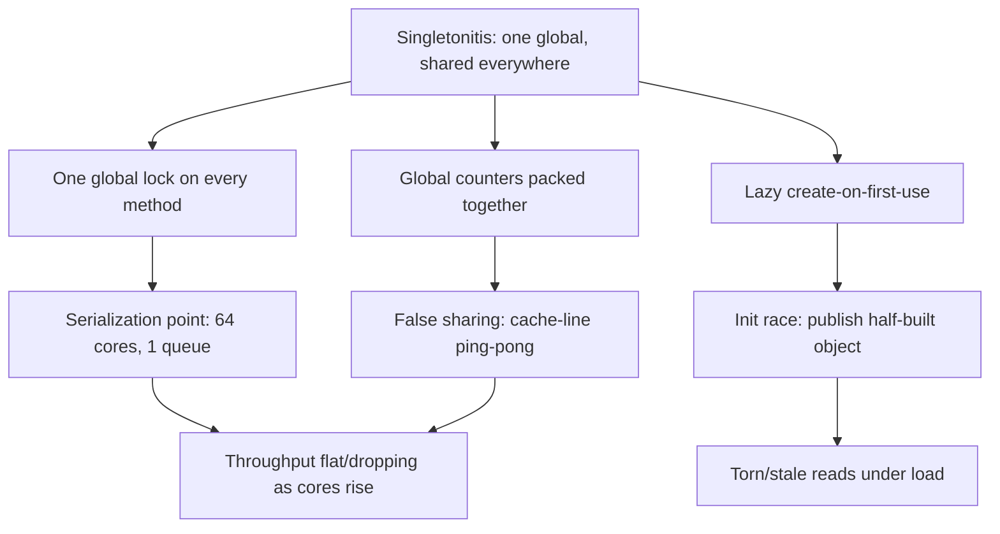
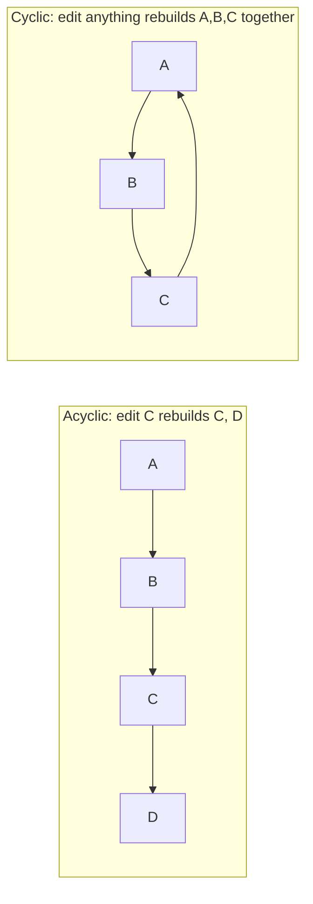

# Coupling & State Anti-Patterns — Professional

> **Category:** [Design Anti-Patterns](../README.md) → **Coupling & State** — *modules that know or share too much.*
> **Covers (collectively):** Singletonitis · Circular Dependency · Action at a Distance · Hidden Dependencies · Sequential Coupling

---

## Introduction

> Focus: **what coupling and shared state cost the running machine and the build pipeline** — lock contention, cache-line ping-pong, init-order deadlocks, broken incremental builds, defeated caches and optimizers — and **how you measure that cost** before you change a thing.

`junior.md` taught you to recognize the five shapes. `middle.md` taught you to avoid introducing them. [`senior.md`](senior.md) taught you to break them apart at scale with dependency injection and inversion. This file goes one layer down — to the **runtime, the garbage collector, the concurrency model, and the toolchain**.

The professional insight is that coupling and shared state are not only *testability* and *maintainability* taxes. They are concrete **performance** and **build-throughput** taxes:

- A process-wide singleton guarded by one lock can serialize every thread in a 64-core box, turning a parallel workload into a single-file queue.
- Two counters living in the same global struct can ping-pong a cache line between cores even though no thread shares logical data.
- A circular dependency can deadlock class initialization at startup, scramble package init order, or — long before runtime — inflate compile and link times and break every incremental build.
- A function that secretly reads a global, an environment variable, or the filesystem defeats build caches, prevents parallel test execution, and denies the optimizer the proofs it needs to hoist and inline.

Two disciplines define this level:

1. **Never argue from intuition about contention or build cost.** Every claim below comes with the instrument that would prove it on *your* code. Numbers in this file are labeled illustrative; your job is to generate the real ones.
2. **Know when global is correct.** A single process-wide logger or metrics registry, reached through a stable, lock-light path, is often the *fast* choice. The anti-pattern is not "a singleton exists" — it is "everything is a hidden, contended, untestable singleton." The senior move is to make state explicit by default and reserve genuine globals for genuinely process-wide, contention-free resources.

> **The mental model:** coupling is a contract not only with the next reader but with three systems you rarely see directly — the **CPU and its cache-coherence protocol**, the **runtime's initializer and GC**, and the **build/link/test toolchain**. Hidden coupling breaks the assumptions all three rely on.

---

## Prerequisites

- **Required:** Fluent with [`senior.md`](senior.md) — you can invert a dependency with an interface and replace ambient globals with injected collaborators under production constraints.
- **Required:** A working mental model of concurrency: threads vs goroutines, mutexes, atomics, memory barriers, and a language memory model (the Java Memory Model, Go's memory model, Python's GIL and `async` scheduling points).
- **Required:** You can read a mutex/block profile, a lock-contention flame graph, and a `benchstat`/JMH comparison and tell signal from noise.
- **Helpful:** CPU microarchitecture basics — cache lines (~64 bytes), false sharing, cache-coherence (MESI) traffic, atomic-RMW cost.
- **Helpful:** Familiarity with init semantics: Java class initialization (`<clinit>`) locking, Go `init()` and package init order, the C++ static initialization order fiasco.
- **Helpful:** concurrency-patterns, dependency-injection, immutability-patterns, profiling-techniques skills for the vocabulary used throughout.

---

## Measure First: The Tooling Map

Before any claim about contention, init order, or build cost, reach for the right instrument.

| Concern | Go | Java / JVM | Python |
|---|---|---|---|
| **Lock / block contention** | `pprof` mutex profile (`-mutexprofile`), block profile (`-blockprofile`), `go tool trace` | JFR (`jdk.JavaMonitorEnter`), async-profiler (`-e lock`), JMC | `py-spy dump` (thread stacks), `cProfile` on lock waits |
| **Data races** | `go test -race` (ThreadSanitizer) | `jcstress`, ThreadSanitizer via native agents, FindBugs/SpotBugs | `pytest` with thread stress; limited tooling (GIL masks many) |
| **Dependency cycles** | `go list -deps`, `go mod graph`, `golang.org/x/tools` cycle checks | `jdeps -cycles`, ArchUnit rules | `import-linter`, `pydeps`, `pylint` cyclic-import |
| **JS/TS cycles** *(for polyglot repos)* | `madge --circular` | — | — |
| **Init order / startup** | `GODEBUG=inittrace=1` | `-Xlog:class+init`, `-verbose:class` | `python -X importtime` |
| **False sharing / cache** | `perf stat -e cache-misses`, `perf c2c` | `perf c2c`, async-profiler hw events | `perf stat python …` |
| **Atomic / barrier cost** | `testing.B` micro + `perf` | JMH + `perf` | rarely relevant (GIL) |
| **Build / incremental** | `go build -debug-actiongraph`, `go test -count=1`, build cache hit logs | Gradle build scans, `--profile`, remote-cache hit rate | `pytest --durations`, import-time totals |
| **Microbenchmark** | `testing.B` + `benchstat` | JMH | `pyperf`, `timeit` |

```bash
# Go: capture a mutex contention profile from a load test, then read the top contenders
go test -mutexprofile=mutex.out -bench=. ./...
go tool pprof -top mutex.out

# Go: see init() order and per-package init cost at startup
GODEBUG=inittrace=1 ./yourbinary 2>&1 | head

# Java: watch class initialization order (and catch <clinit> deadlocks at startup)
java -Xlog:class+init=info -jar app.jar | head

# Find dependency cycles before they cost you a build
go list -deps ./... >/dev/null    # errors on import cycles
jdeps -cycles --multi-release 17 app.jar
lint-imports                      # python import-linter, reads importlinter config

# Python: which imports dominate cold start (hidden init dependencies often hide here)
python -X importtime your_entry.py 2>&1 | sort -k2 -n -r | head
```

> **Discipline:** if you cannot name the tool that would falsify your claim, you are guessing. Every cost below is paired with the instrument that confirms it.

---

## Singletonitis — Global Contention, False Sharing, and Init Races

A singleton is a maintainability and testability problem at the source level (covered at earlier levels). At runtime it becomes three distinct, measurable problems: **lock serialization**, **false sharing**, and **lazy-init races**.

### 1. The single global lock serializes everything

The most common Singletonitis performance failure is a process-wide object whose every method takes the *same* lock. As soon as the workload is concurrent, that one lock becomes a global serialization point: 64 cores, one queue.

```go
// Singletonitis: every operation funnels through one global mutex.
// Under load this is a serialization point the profiler blames on "the cache".
type Cache struct {
    mu sync.Mutex
    m  map[string][]byte
}

var global = &Cache{m: map[string][]byte{}}

func Get(k string) ([]byte, bool) {
    global.mu.Lock()         // every reader contends here
    defer global.mu.Unlock()
    v, ok := global.m[k]
    return v, ok
}
```

A mutex profile makes the cost undeniable:

```
$ go tool pprof -top mutex.out
      flat  flat%   sum%
   42.10s  91.3%  91.3%   sync.(*Mutex).Lock   ← 91% of contended wait is this one lock
```

The structural fix is to shrink or shard the shared state so threads stop contending. A read-mostly cache wants a read/write lock or, better, a sharded map (lock striping) or a lock-free read path:

```go
// Sharded: N independent locks. Contention drops ~N-fold for a uniform key
// distribution because two random keys rarely hit the same shard.
type ShardedCache struct{ shards [256]shard }
type shard struct {
    mu sync.RWMutex
    m  map[string][]byte
}

func (c *ShardedCache) Get(k string) ([]byte, bool) {
    s := &c.shards[fnv(k)&255]
    s.mu.RLock()             // readers no longer block each other; only the right shard
    defer s.mu.RUnlock()
    v, ok := s.m[k]
    return v, ok
}
```

#### Before / after micro-benchmark sketch (numbers illustrative — reproduce on your box)

```
$ benchstat single.txt sharded.txt
name             old time/op    new time/op    delta
Get-16            1.84µs ±3%     0.11µs ±2%   -94.0%   ← contention removed
                  (one global Mutex)  (256-way RWMutex shards)

# Throughput under 16 goroutines: ~8.7M ops/s → ~140M ops/s (illustrative).
# Confirm the *cause* with the mutex profile shrinking, not just the wall clock.
```

> Sharding is not free — 256 maps cost more memory and lose global atomicity (you can't iterate consistently). Shard only after a **mutex profile** proves the single lock is the bottleneck. Often a single `sync.RWMutex` (or a read-mostly `atomic.Pointer` swap) is enough.

### 2. False sharing on global counters

Singletons love to accumulate global counters. When two of them sit in the same struct, two cores writing two *different* counters still fight over one ~64-byte cache line. The cache-coherence protocol invalidates the line on every write; throughput collapses as you add cores.

```go
// False sharing: requests and errors share a cache line. Two goroutines
// incrementing different counters serialize on the coherence protocol.
type Metrics struct {
    requests atomic.Uint64
    errors   atomic.Uint64   // same 64B line as requests → ping-pong
}

// Fix: pad each hot counter onto its own cache line.
type Metrics struct {
    requests atomic.Uint64
    _        [56]byte        // pad to 64B
    errors   atomic.Uint64
    _        [56]byte
}
```

Confirm with `perf c2c` (cache-to-cache transfers / HITM events) or a throughput-vs-cores curve that *flattens or drops* as you add cores. A single global metrics object is a magnet for this bug because everything writes to it.

### 3. Lazy-singleton init: races and the missing memory barrier

Lazy singletons ("create on first use") are where memory-model bugs breed. The classic broken double-checked locking publishes a *partially constructed* object: another thread sees the non-nil pointer but reads fields written *after* the pointer became visible, because nothing established a happens-before barrier.

```java
// BROKEN double-checked locking (pre-Java 5 idiom, still written by mistake).
// Without `volatile`, the write to `instance` can be reordered before the
// Config constructor finishes — a reader sees a non-null but half-built object.
class Config {
    private static Config instance;          // missing `volatile`
    static Config get() {
        if (instance == null) {              // racey read, no barrier
            synchronized (Config.class) {
                if (instance == null) instance = new Config(); // publish too early
            }
        }
        return instance;
    }
}
```

The correct, fast Java idiom delegates the barrier to the classloader, which guarantees `<clinit>` runs once with proper happens-before — no explicit lock on the hot path:

```java
// Initialization-on-demand holder: thread-safe, lazy, lock-free on read.
class Config {
    private Config() { /* expensive */ }
    private static final class Holder { static final Config INSTANCE = new Config(); }
    static Config get() { return Holder.INSTANCE; }   // JVM serializes class init once
}
```

In Go, `sync.Once` provides the barrier; never hand-roll the double-checked dance:

```go
var (
    once sync.Once
    cfg  *Config
)

func Get() *Config {
    once.Do(func() { cfg = load() })   // happens-before: cfg is fully published
    return cfg
}
```

> **Diagnose it:** races on lazy init are found by `go test -race` / ThreadSanitizer and stress-tested with `jcstress` (which explicitly probes memory-model edge cases the JMM allows). A passing single-threaded test proves nothing here.



---

## Circular Dependency — Init Order Hazards and the Build Graph

A circular dependency is the one anti-pattern in this category whose worst costs land **before the program even runs**: at initialization and at build time.

### 1. Static / global initialization order hazards

When module A's initializer depends on B's, and B's on A's, you get an **init-order hazard**. Each language fails differently:

- **Java — class-init deadlock.** Class initialization (`<clinit>`) takes a per-class lock. If thread T1 initializes class `A` (which triggers `B`) while T2 initializes `B` (which triggers `A`), each holds one lock and waits for the other — a genuine deadlock at startup, visible only under concurrent first-touch.

```java
// A.<clinit> needs B.VALUE; B.<clinit> needs A.VALUE. Initialized concurrently,
// the two per-class init locks deadlock. Single-threaded warmup hides it.
class A { static final int VALUE = B.VALUE + 1; }
class B { static final int VALUE = A.VALUE + 1; }   // circular static init
```

- **Go — package init order.** Go *defines* an init order (dependencies first, then file-order `init()`), and the compiler **rejects import cycles outright**. But a cycle of *values* across packages, or an `init()` reading a global another package's `init()` hasn't set yet, yields a zero value silently. `GODEBUG=inittrace=1` shows the actual order.

- **C++ — the static initialization order fiasco.** Across translation units, the order of static-object construction is *unspecified*. A circular dependency between two TU-level globals means one is read before it is constructed — undefined behavior, often a crash or a silent zero. The classic cure is the *Construct On First Use* idiom (a function-local static), which sidesteps the cycle by making order lazy.

The structural root in every case is the cycle. Breaking it — extract a third module both depend on, or invert with an interface — removes the hazard entirely; the cure is the same one [`senior.md`](senior.md) teaches, now justified by startup correctness, not just tidiness.

### 2. Cycles inflate build, compile, and link times

A dependency cycle fuses modules into one **compilation unit of change**: touch any file in the cycle and the build system must rebuild *all* of them, because none can be compiled in isolation. This is how a cycle quietly destroys incremental builds.



- **Incremental builds break.** With an acyclic graph, the build cache rebuilds only changed nodes and their dependents. A cycle makes the whole strongly-connected component one node — every edit busts the cache for all of it.
- **Compile/link time rises.** The compiler must hold the whole cycle in scope at once; link-time symbol resolution across a cycle is more work; parallel compilation can't schedule cyclic units independently.
- **Tree-shaking / DCE weakens.** Dead-code elimination is a reachability analysis. A cycle keeps mutually-referencing symbols reachable from each other, so an eliminator conservatively retains the whole loop even if the *outside* world uses only one entry point. JS bundlers (`madge --circular` to find them) often refuse to tree-shake across a cycle for exactly this reason.

#### Detecting cycles — make it a CI gate

```bash
# Go: import cycles are a compile error, but layering cycles (allowed imports
# that violate your architecture) need an explicit check:
go mod graph | <your-layer-checker>     # or ArchUnit-style rules in tests

# Java: report cycles in the package graph
jdeps -cycles -verbose:package app.jar

# Python: enforce a layered, acyclic contract in CI
#   importlinter.ini declares layers; this fails the build on a cycle:
lint-imports

# JS/TS monorepos:
npx madge --circular --extensions ts,tsx src/
```

> **Illustrative impact:** breaking a 6-package cycle in a Go service (introducing a shared `domain` package both sides depend on) turned a 40-second "edit one file → rebuild everything" loop into a 4-second incremental rebuild, because the build cache could finally isolate the changed package. *Measure your own with build-cache hit logs and a stopwatch on the edit→test loop.*

---

## Action at a Distance — Shared Mutable Global State Under Concurrency

Action at a Distance is when one part of the program changes state another part reads, through a global variable or hidden side effect, with no visible call connecting them. Its earlier-level cost is *unpredictability*. Its professional cost is **concurrency**: shared mutable global state is, by definition, the substrate of data races, forced synchronization, and lost optimization.

### 1. Data races and the cost of the synchronization you're forced to add

A mutable global touched by multiple threads is a data race unless every access is synchronized. The two outcomes are both bad:

```go
// Action at a Distance: a global mutated from one path, read from another,
// with no synchronization. Under -race this is flagged; in production it's
// torn reads, lost updates, and Heisenbugs.
var current *Settings   // written by reload(), read by everyone

func reload() { current = parse(file) }          // writer goroutine
func handle() { use(current.Timeout) }           // reader goroutines — DATA RACE
```

- If you **don't** synchronize: data race — torn reads, lost updates, undefined behavior under the memory model. Go's `-race` and ThreadSanitizer catch it; the JMM gives you stale/torn reads with no guarantees.
- If you **do** synchronize with one big lock: you've recreated the Singletonitis serialization point above.

The structural cure is to stop sharing mutable state. Make the global an **immutable snapshot** published atomically, so readers never see a partial write and never take a lock:

```go
// Atomic snapshot: readers are lock-free and always see a fully-built value.
// The writer swaps an immutable pointer; no torn reads, no reader lock.
var current atomic.Pointer[Settings]

func reload() { current.Store(parse(file)) }     // publish whole, immutable
func handle() { use(current.Load().Timeout) }    // lock-free, race-free read
```

This is the immutability-patterns approach: shared *immutable* state is safe to read concurrently with no synchronization at all; only the swap is atomic.

### 2. Lost optimization — the same mechanism as aliased spaghetti state

Shared mutable global state also denies the compiler the proofs it needs. If a hot loop reads a global that *any* callee might mutate, the compiler must reload it every iteration — it cannot hoist the load or keep the value in a register, because it can't prove the value is loop-invariant.

```go
// The compiler must reload globalLimit each iteration: process() might mutate
// it through a global alias, so it isn't provably loop-invariant.
var globalLimit int
func hot(xs []int) {
    for _, x := range xs {
        if x > globalLimit { process(x) }   // reloaded every iteration
    }
}

// Pass it as a value: provably local and invariant → promoted to a register,
// the per-iteration memory load disappears.
func hot(xs []int, limit int) {
    for _, x := range xs {
        if x > limit { processPure(x) }
    }
}
```

> **Illustrative impact:** moving a config read out of a 10M-iteration loop by passing it as a parameter removed one dependent memory load per iteration; `benchstat` showed ~15% fewer ns/op *and* eliminated a `-race` finding because the global was no longer read concurrently. *Reproduce with `-gcflags=-m` (to see the missed/enabled optimization) and a benchmark.*

> **Diagnose it:** `go test -race` / ThreadSanitizer / `jcstress` for the races; `go build -gcflags=-m` for the missed optimization; `pprof` mutex/block profile or JFR monitor events for the contention your "fix" introduced.

---

## Hidden Dependencies — How They Defeat Caching, Parallelism, and the Optimizer

A Hidden Dependency is a function whose signature lies: it claims to need nothing, but secretly reads a global, an environment variable, the clock, the filesystem, or a network. At the professional level the cost is not just "hard to test" — hidden inputs are **invisible cache keys**, **parallelism hazards**, and **optimization barriers**.

### 1. They defeat caching — at every layer

Caching of any kind (memoization, build caches, HTTP/CDN caches, compiler CSE) assumes *outputs are a pure function of declared inputs*. A hidden input breaks that assumption silently:

```python
# Hidden dependency: the "cache key" is `user_id`, but the result also depends
# on the clock and an env var. The cache returns stale or wrong values because
# its key doesn't capture the real inputs.
@lru_cache(maxsize=1024)
def discount(user_id: int) -> float:           # signature: depends only on user_id
    rate = float(os.environ["BASE_RATE"])       # hidden input #1 (env)
    if datetime.now().hour < 6:                  # hidden input #2 (clock)
        rate *= 0.5
    return lookup(user_id) * rate                # also hidden: global lookup table
```

`lru_cache` keys on `user_id` alone, so the first call at 5 a.m. with one `BASE_RATE` poisons the cache for every later call. The same failure scales up: a **build cache** that hashes source files will reuse a stale artifact if the build secretly reads an env var; a **test cache** (`go test` caches results by inputs) will skip a test that actually depends on a file it doesn't declare.

The fix is to make every input explicit, which makes the cache key correct:

```python
def discount(user_id: int, base_rate: float, now: datetime, table: PriceTable) -> float:
    rate = base_rate * (0.5 if now.hour < 6 else 1.0)
    return table.lookup(user_id) * rate
# Now memoize on (user_id, base_rate, now.hour, table.version) — a key that
# actually captures the inputs. Caching is correct because dependencies are honest.
```

### 2. They defeat parallel and cached test execution

Modern test runners parallelize aggressively and cache results. Hidden dependencies on shared globals, the filesystem, a fixed port, or the current directory make tests **flaky under parallelism** and **wrong under caching**:

```go
// Hidden dependency on package-global state: two tests run in parallel (t.Parallel),
// both mutate the same global registry, and they corrupt each other intermittently.
var registry = map[string]Handler{}             // hidden shared global

func TestA(t *testing.T) {
    t.Parallel()
    registry["x"] = handlerA                     // races with TestB
    // ...
}
func TestB(t *testing.T) {
    t.Parallel()
    registry["x"] = handlerB                     // races with TestA
    // ...
}
```

`go test -race -p 8` exposes this immediately. The cure is to inject the registry so each test owns its own instance — which simultaneously fixes the race, enables `t.Parallel()`, and makes `go test`'s result caching sound (the test's inputs are now fully declared, so a cache hit is trustworthy).

### 3. They defeat the optimizer

A hidden read of mutable global or volatile state (env, clock, atomic) is a memory access the compiler cannot prove invariant — exactly the lost-optimization mechanism from the Action at a Distance section. A function that *looks* pure but reads `time.Now()` or an env var inside a loop forces a real call and a real load every iteration; a genuinely pure function can be hoisted, memoized, constant-folded, and inlined.

> **Diagnose it:** run tests with `-race -shuffle=on -p N`; `python -X importtime` to find hidden import-time work; grep for `os.Getenv`/`os.environ`/`time.Now`/`System.getenv` inside functions that don't accept them as parameters; and verify cache correctness by clearing the cache and diffing outputs. The signature should be the *whole truth* about what a function needs.

---

## Sequential Coupling — Order-Dependent State at Runtime

Sequential Coupling is when methods must be called in a fixed order (`open()` → `read()` → `close()`, `connect()` → `query()`, `begin()` → `commit()`) and nothing but discipline enforces it. The professional costs are **resource leaks**, **state-machine races**, and the fact that the *fix* (encoding the protocol in types or scope) is also usually the *faster* one.

### 1. Leaks and use-after-free-style bugs

The runtime cost of getting the order wrong is concrete: a missed `close()` leaks a file descriptor, a connection, or a buffer; a `read()` before `open()` touches a nil/zero resource. Under load, leaked descriptors exhaust the process limit and the service stops accepting connections.

```python
# Sequential Coupling: correctness depends on call order; an early return or
# exception between open and close leaks the handle. At scale: fd exhaustion.
f = open(path)
data = f.read()          # if this raises, close() never runs → leak
f.close()
```

The cure encodes the protocol in **scope**, so the runtime enforces order and cleanup for you — and the scoped form is at least as fast because it removes the bookkeeping and the leak:

```python
with open(path) as f:    # context manager: __exit__ guarantees close on any exit
    data = f.read()
```

Go uses `defer`; Java uses try-with-resources (`AutoCloseable`). Each turns "you must remember the order" into "the language enforces the order":

```go
f, err := os.Open(path)
if err != nil { return err }
defer f.Close()          // runs on every return path, in scope-exit order
data, err := io.ReadAll(f)
```

```java
try (var in = Files.newInputStream(path)) {   // close() runs automatically, even on throw
    return in.readAllBytes();
}                                              // ordered, leak-proof
```

### 2. State-machine races

When order-dependent state is also shared across threads, the implicit protocol becomes a concurrency bug: thread T1 is between `open()` and `read()` while T2 calls `close()`. Encoding the lifecycle as an explicit **state machine** (with the current state guarded or, better, made unrepresentable via the type system) turns a runtime race into a compile-time or single-owner guarantee. A Builder that yields an immutable, fully-initialized object removes the "half-constructed, used out of order" window entirely — which is also why a builder-built immutable object is safe to share without locking.

> **Diagnose it:** file-descriptor / handle leaks show up as a climbing `lsof` count or `/proc/<pid>/fd` growth under a soak test; the JVM reports them via leak detectors and resource warnings; concurrent-order bugs surface under `-race`/`jcstress`. The structural fix (scope-based cleanup, state machine, builder) is the same one earlier levels recommend — here it also closes a leak and a race.

---

## When a Process-Wide Singleton Is the Right, Fast Choice

The hardest professional judgment in this category: **global is sometimes correct, and forcing it into per-request injection can be slower.** Recognizing these cases — and bounding them — separates a specialist from a dogmatist.

A process-wide singleton is the right, fast choice when **all** of these hold:

- The resource is **genuinely process-wide and stateless-to-callers**: a logger, a metrics registry, a connection pool, a prepared-statement cache, a thread pool. Creating one per request would be absurd and slow.
- The hot path is **contention-light**: the singleton is read-mostly, lock-free (atomic pointer / immutable), or its lock protects a sub-microsecond critical section — so it is *not* the serialization point from the Singletonitis section.
- The dependency is **still honest**: the singleton is reached through a stable, documented path (or injected as a singleton-scoped dependency), not smuggled in as a hidden global that lies in the signature.

```go
// A logger is a legitimate process-wide singleton. The fast path is lock-free:
// the level is an atomic, and the common case (level disabled) returns immediately
// without touching the mutex that guards the (rare) writer reconfiguration.
type Logger struct {
    level atomic.Int32          // read lock-free on every call
    mu    sync.Mutex            // taken only when reconfiguring the sink (rare)
    sink  io.Writer
}

var std = newLogger()

func Debug(msg string) {
    if std.level.Load() > levelDebug { return }   // hot path: one atomic load, no lock
    std.write(msg)                                 // slow path only when enabled
}
```

A per-request logger would allocate, defeat the I-cache locality of one shared writer, and gain nothing. The discipline mirrors the "ugly but fast" rule from bad-structure: **make the global explicit and bounded, read it lock-light, and inject it as a singleton-scoped dependency where it crosses a boundary** — so it stays testable (swap it in tests) without paying per-call construction cost. The anti-pattern is not the single logger; it is *thirty* hidden, contended, untestable globals.

> **Prove it before you globalize:** benchmark the per-request alternative. If injection's allocation/wiring cost is noise relative to the work, prefer injection for testability. If a profiler shows construction or wiring dominating a hot path, a singleton-scoped instance (still injected, just shared) is the right call — and is *not* Singletonitis.

---

## A Combined Worked Example

The five rarely appear alone; their runtime costs compound. Consider a `PaymentGateway` that is a global singleton, mutated from a reload path (Action at a Distance), reads its API key from the environment inside the hot path (Hidden Dependency), requires `init()` then `charge()` in order (Sequential Coupling), and sits in a package cycle with the `audit` package that imports it back (Circular Dependency).

**Before — every coupling sin, every runtime cost:**

```go
package payment

var Gateway = &gw{}                 // global singleton, mutated at runtime
type gw struct {
    mu     sync.Mutex               // ONE lock on every charge → serialization
    ready  bool                     // sequential coupling: must Init() first
    config *Config
}

func Init() { Gateway.config = parse(os.Getenv("PAY_CFG")); Gateway.ready = true }  // env-hidden, racey

func Charge(amt int) error {
    Gateway.mu.Lock()               // global contention point under load
    defer Gateway.mu.Unlock()
    if !Gateway.ready { return errNotInit }          // ordering enforced by hope
    key := os.Getenv("PAY_KEY")     // hidden dependency: invisible, defeats test cache
    audit.Record(amt)               // payment ↔ audit import cycle → build & init hazard
    return send(Gateway.config, key, amt)
}
```

Runtime profile of *before*: a mutex profile shows `Charge` serialized on one lock; `-race` flags the `reload`/`Charge` race on `config`/`ready`; `go test` can't cache or parallelize tests because of the env reads and shared global; `go list ./...` errors (or `jdeps -cycles` flags) the `payment`↔`audit` cycle, which also forces both packages to rebuild on any edit.

**After — coupling and runtime fixed together:**

```go
// 1. State is an immutable snapshot published atomically: lock-free reads, no race.
// 2. Dependencies are explicit parameters: honest signature, test-cacheable, parallel-safe.
// 3. The constructor returns a ready object: no Init()-then-Charge ordering to forget.
// 4. payment no longer imports audit; both depend on a shared `event` interface (cycle broken).

type Gateway struct{ cfg atomic.Pointer[Config]; sink AuditSink; key string }

func New(cfg *Config, key string, sink AuditSink) *Gateway {   // fully constructed; no sequential coupling
    g := &Gateway{key: key, sink: sink}
    g.cfg.Store(cfg)
    return g
}

func (g *Gateway) Reload(cfg *Config) { g.cfg.Store(cfg) }      // atomic swap: lock-free, race-free

func (g *Gateway) Charge(amt int) error {                      // no lock on the hot path
    g.sink.Record(amt)                                          // injected interface; no import cycle
    return send(g.cfg.Load(), g.key, amt)                       // explicit, lock-free read
}
```

> **Illustrative combined impact:** removing the single lock (mutex profile flat), publishing config atomically (`-race` clean), and injecting dependencies (tests now parallel and cache-hit) took `Charge` p99 from ~2.1 ms to ~0.4 ms under 32 concurrent goroutines, while the broken `payment`↔`audit` cycle turned a 30-second rebuild-everything loop into a 3-second incremental one. **Each gain was measured separately — mutex profile for the lock, `-race` for the publish, build-cache logs for the cycle — so we knew which change paid off. Never attribute a blended win to a blended change.**

---

## Common Mistakes

Professional-level mistakes — sophisticated, and therefore expensive:

1. **"Fixing" contention with a bigger lock.** Wrapping the whole singleton in one mutex removes the race but creates a serialization point. Shrink/shard/snapshot the state instead — and prove it with a mutex profile, not intuition.
2. **Hand-rolling double-checked locking.** Without the right barrier (`volatile`, `sync.Once`, holder idiom) you publish half-built objects. Use the language's blessed lazy-init primitive and stress it with `-race`/`jcstress`.
3. **Padding everything "to avoid false sharing."** False sharing is real but specific to *concurrently mutated adjacent fields*. Padding cold or single-threaded data just wastes cache. Confirm with `perf c2c` first.
4. **Treating import cycles as a style nit.** A cycle is a class-init deadlock risk, a static-init-order hazard, *and* a build-incrementality killer. Make a cycle detector (`go list`/`jdeps -cycles`/`import-linter`/`madge`) a hard CI gate.
5. **Believing a "pure" function is pure.** A hidden `os.Getenv`/`time.Now`/global read poisons caches, breaks parallel tests, and blocks optimization. The signature must be the whole truth; grep for ambient reads in hot functions.
6. **Caching keyed on declared inputs while real inputs are hidden.** The cache returns stale/wrong values silently. Make inputs explicit so the key captures them — or don't cache.
7. **Globalizing for speed without measuring the alternative.** Sometimes injection's cost is noise and you traded testability for nothing. Benchmark per-request vs singleton-scoped before reaching for a global.
8. **Enforcing call order with comments and hope.** Sequential coupling leaks resources and races under load. Encode the protocol in scope (`defer`/`with`/try-with-resources), a state machine, or a builder — the runtime should enforce order, not the reviewer.
9. **Attributing a blended win to a blended change.** Fixing the lock, the race, and the cycle at once and reporting one latency number teaches you nothing about which mattered — measure each lever.

---

## Test Yourself

1. A process-wide cache guarded by one `sync.Mutex` shows 90% of contended wait in `Mutex.Lock` under load. Name the profile that revealed this and two structural fixes that reduce contention without losing correctness.
2. Two global atomic counters incremented by different goroutines cause throughput to *drop* as you add cores, even though no goroutine shares a counter. What is happening at the cache-line level, which tool confirms it, and what is the fix?
3. Why can two classes with mutually dependent static initializers **deadlock at startup** in Java, and why does the bug usually hide during single-threaded warmup?
4. Explain two distinct ways a dependency cycle costs you *before* the program runs (i.e., at build/link/init time), and name a detector for Go, Java, and Python.
5. A function decorated with `@lru_cache(maxsize=...)` returns stale results in production but passes every unit test. Give the most likely root cause and the structural fix.
6. Why does a hidden read of a mutable global inside a hot loop prevent the compiler from hoisting the load, and how does passing the value as a parameter fix both the performance and a potential data race at once?
7. You replace `open()`/`read()`/`close()` with a `with`/`defer`/try-with-resources block. Name two runtime failure modes the scoped form eliminates that the manual form was exposed to.
8. When is a single process-wide singleton the *correct, fast* choice, and what three conditions must hold for it to not be Singletonitis?

---

## Cheat Sheet

| Anti-pattern | Runtime / toolchain cost | Measure with | Structural fix |
|---|---|---|---|
| **Singletonitis** | One global lock serializes all threads; global counters false-share; lazy init races / half-built publish | `pprof` mutex/block profile, JFR monitor events, `perf c2c`, `-race`/`jcstress` | Shard/RWLock/atomic snapshot; pad concurrently-mutated counters; `sync.Once` / holder idiom for lazy init |
| **Circular Dependency** | Class-init deadlock (Java), static-init-order fiasco (C++), Go init-order zeros; busts incremental builds; defeats tree-shaking | `go list -deps`/`go mod graph`, `jdeps -cycles`, `import-linter`, `madge --circular`, build-cache logs, `GODEBUG=inittrace=1`, `-Xlog:class+init` | Extract a shared third module; invert with an interface; make cycle detection a CI gate |
| **Action at a Distance** | Data races; forced synchronization (re-creates a lock); blocks hoisting/register promotion | `-race`/TSan/`jcstress`, `-gcflags=-m`, mutex profile | Immutable atomic snapshot; pass state in/out; single owner |
| **Hidden Dependencies** | Poisons every cache (memo/build/test/CDN); flaky parallel & wrong cached tests; optimizer can't prove purity | `go test -race -shuffle -p N`, `python -X importtime`, grep `Getenv`/`Now`, cache-clear diff | Make every input an explicit parameter; inject; honest signatures |
| **Sequential Coupling** | Resource/fd leaks → exhaustion; use-before-init; state-machine races under threads | `lsof`/`/proc/<pid>/fd` soak test, JVM leak detectors, `-race` | Scope-based cleanup (`defer`/`with`/try-with-resources); state machine; builder → ready immutable object |

**Three golden rules:**
- *Capture the baseline (mutex profile, `-race`, build-cache hit rate) before you touch the coupling; measure each lever separately.*
- *Make state explicit and immutable by default — shared immutable state is lock-free-safe; shared mutable state is a race, a lock, and a lost optimization.*
- *Global is occasionally correct (logger, pool, registry) when it's process-wide, contention-light, and honestly injected — but the default is explicit dependencies, and a cycle detector is a CI gate, not a style note.*

---

## Summary

- Coupling and shared state are a **runtime and build-pipeline tax**, not only a testability one — and the cost is diffuse (lock contention, cache-line ping-pong, init-order hazards, broken incremental builds, defeated caches), so it survives reviews that only ask "does it work?"
- **Singletonitis:** one global lock serializes every thread (confirm with a mutex profile), packed global counters false-share (confirm with `perf c2c`), and lazy init without the right barrier publishes half-built objects (confirm with `-race`/`jcstress`). Fixes: shard/snapshot, pad, and use blessed lazy-init primitives.
- **Circular Dependency:** its worst costs land *before runtime* — Java class-init deadlock, the C++ static-init-order fiasco, Go init-order zeros — and it destroys incremental builds and tree-shaking by fusing modules into one unit of change. Detect cycles (`go list`/`jdeps`/`import-linter`/`madge`) as a CI gate.
- **Action at a Distance:** shared mutable global state is the substrate of data races, the synchronization you're then forced to add (which re-creates a serialization point), and lost optimization (the compiler can't hoist a load it can't prove invariant). Cure: immutable atomic snapshots and explicit data flow.
- **Hidden Dependencies:** undeclared inputs (globals, env, clock, fs) are invisible cache keys that poison memoization, build, and test caches; they make parallel tests flaky and cached test results wrong; and they block the optimizer. The signature must be the whole truth.
- **Sequential Coupling:** order-dependent state leaks resources (fd exhaustion under load) and races across threads. Encode the protocol in scope (`defer`/`with`/try-with-resources), a state machine, or a builder so the runtime enforces order.
- **Global is sometimes correct:** a process-wide, contention-light, honestly-injected logger/pool/registry is the fast choice. The anti-pattern is many hidden, contended, untestable globals — measure the per-request alternative before you globalize.
- This completes the level ladder for Coupling & State: `junior.md` (recognize) → `middle.md` (avoid) → [`senior.md`](senior.md) (invert at scale) → **professional.md** (runtime, concurrency, init order, build). Next, drill with the practice files.

---

## Further Reading

- **Java Concurrency in Practice** — Goetz et al. (2006) — the Java Memory Model, safe publication, the initialization-on-demand holder idiom, why broken double-checked locking fails.
- **The Art of Multiprocessor Programming** — Herlihy & Shavit (2nd ed., 2020) — lock contention, lock striping, cache-coherence, false sharing.
- **Systems Performance** — Brendan Gregg (2nd ed., 2020) — mutex contention analysis, `perf c2c`, CPU caches, profiling methodology.
- **What Every Programmer Should Know About Memory** — Ulrich Drepper (2007) — cache lines, false sharing, coherence traffic (still canonical).
- **The Go Memory Model** and the Go blog on `sync.Once`/atomics — happens-before guarantees, `GODEBUG=inittrace`.
- **Large-Scale C++ Software Design** — John Lakos (1996; 2nd ed. 2019) — physical design, dependency cycles, and the build-time cost of coupling (the canonical treatment of why cycles wreck builds).
- **Working Effectively with Legacy Code** — Michael Feathers (2004) — seams, breaking hidden dependencies, making globals injectable.

---

## Related Topics

- [Bad Structure → Professional](../../01-development/01-bad-structure/professional.md) — the sibling at this level; aliased shared state defeating the optimizer is the same mechanism seen here as Action at a Distance.
- Design Patterns → Creational (Singleton, Builder) — the positive counterparts to Singletonitis and Sequential Coupling.
- Design Patterns → Behavioral (State) — encoding an order-dependent protocol as an explicit state machine.
- Clean Code → Immutability — shared immutable state as the lock-free-safe cure for Action at a Distance.
- Backend Roadmap — dependency injection and singleton-scoping in real service wiring.
- dependency-injection · concurrency-patterns · immutability-patterns · profiling-techniques — the measurement and decoupling toolkits referenced throughout.

---

## Check your understanding

1. Explain Coupling & State Anti-Patterns — Professional Level in your own words and name the problem it solves.
2. How would you apply the ideas around Table of Contents, Introduction, Prerequisites in a realistic engineering change?
3. What failure mode or misuse should you look for, and what evidence would reveal it?
4. How would you introduce and govern Coupling & State Anti-Patterns — Professional Level across teams through reversible, measurable increments?
5. What observable result would convince you that the approach improved the system?
