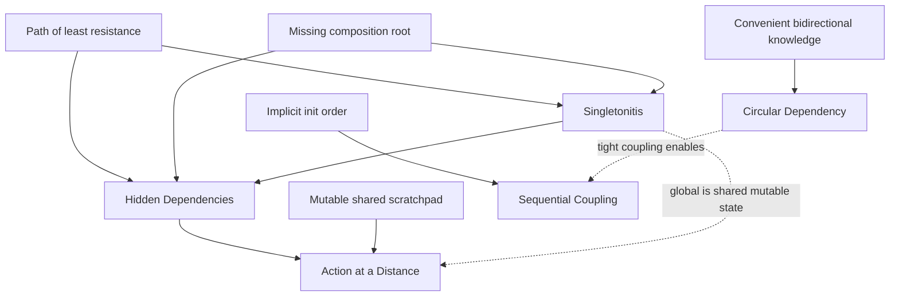
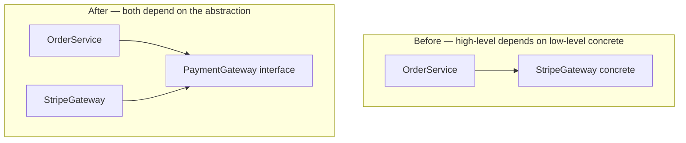
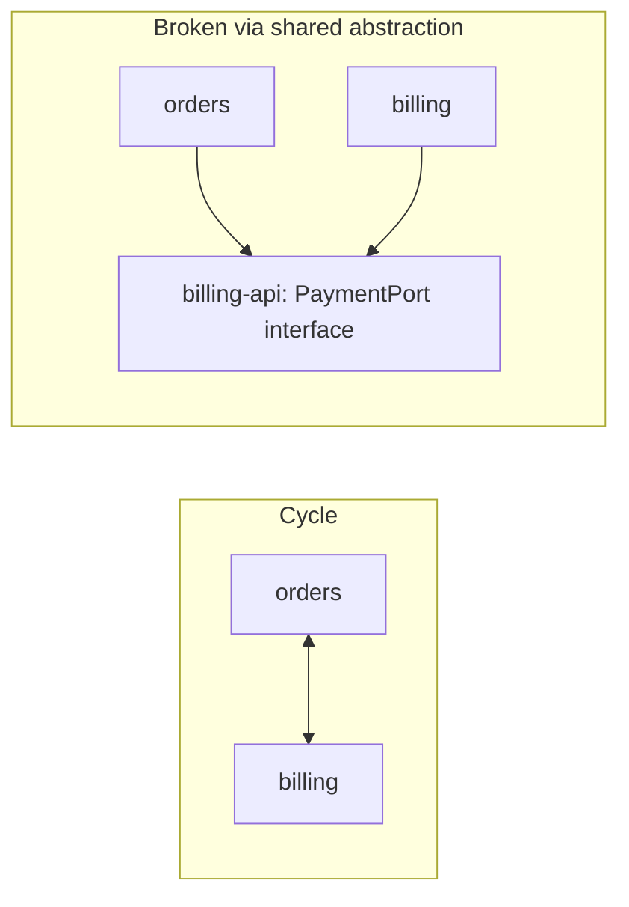

# Coupling & State Anti-Patterns — Senior

> **Category:** [Design Anti-Patterns](../README.md) → **Coupling & State** — *modules that know or share too much.*
> **Covers (collectively):** Singletonitis · Circular Dependency · Action at a Distance · Hidden Dependencies · Sequential Coupling

---

## Introduction

> Focus: **How did the codebase get here?** and **How do I refactor safely at scale?**

At the junior level you learned to *spot* a global singleton, a cyclic import, a method that reads a hidden global. At the middle level you learned to *invert* a dependency and pass state explicitly in a single class. This file is about the situation you inherit as a senior: a `Config.getInstance()` called from 400 sites, a package graph with a dozen cycles that the build tool only tolerates because the language is lenient, an integration test suite that takes 40 minutes because nothing can be constructed without booting the whole world.

These five anti-patterns are not five problems. They are **one problem — implicit, ambient state — wearing five masks.** A `Singleton` is ambient state with a global accessor. A `Hidden Dependency` is ambient state a constructor lies about. `Action at a Distance` is ambient state mutated far from where the effect is felt. `Sequential Coupling` is ambient state that must be initialized in a secret order. And `Circular Dependency` is what happens when two modules both reach into each other's ambient state instead of agreeing on a contract. Cure the ambience — make every dependency explicit, injected, and acyclic — and all five recede together.

Two questions define senior-level work here:

1. **How did it get this way?** Coupling-and-state rot is rarely one bad decision. It is the compounding interest on a thousand "just grab it from the global" shortcuts, each locally faster, collectively producing a codebase where you cannot reason about, test, or change one part without dragging in all of it.

2. **How do I change it without an outage?** A `getInstance()` on the revenue path cannot be deleted in a flag day. The answer is the same disciplined toolkit as structural refactoring — **seams, characterization tests, parallel-change** — applied to the dependency graph instead of to class boundaries.

> **The senior mindset shift:** the junior asks "is this global bad?"; the senior asks "what is the *blast radius* of this dependency, who can observe it, and what is the smallest reversible step that makes it explicit?" You are managing the **shape of the dependency graph of a system that cannot stop.**

---

## Prerequisites

- **Required:** Fluency with [`junior.md`](junior.md) and [`middle.md`](middle.md) — you can recognize all five anti-patterns, invert a single dependency with an interface, and pass state explicitly in one class.
- **Required:** You have written tests against a legacy system, felt the pain of a global you couldn't reset between tests, and shipped to production.
- **Helpful:** Working knowledge of a DI container *and* of manual constructor injection (knowing when **not** to use the container).
- **Helpful:** Familiarity with the Dependency Inversion Principle and SOLID, and with Refactoring techniques.
- **Helpful:** Exposure to import linters / architecture tests (ArchUnit, `import-linter`, `go-arch-lint`/`depguard`).

---

## How Did the Codebase Get Here? — Root-Cause Forces

Every `getInstance()` has a biography. Before you touch the graph, understand the forces, because **the same forces will recreate the coupling after you cut it.**

### The path of least resistance

A global accessor is the cheapest possible way to get a collaborator: no constructor parameter, no wiring, no thinking about lifecycle. `Logger.getInstance()` is one line at the call site versus threading a `Logger` through five constructors. Multiply by a deadline and you get Singletonitis — not because anyone wanted globals, but because every individual shortcut was rational. **Hidden Dependencies and Singletonitis are the sediment of the path of least resistance.**

### Missing composition root

Most coupling rot traces to one absence: there is **no single place where the object graph is assembled.** When the application has no *composition root* — one location (often `main`) where concrete implementations are constructed and injected downward — every class is forced to source its own collaborators, and "source your own" means "reach for a global." The composition root is to dependencies what a module boundary is to structure: when it's missing, the dependency is wired *wherever it was first needed.*

### Convenience of bidirectional knowledge

Circular dependencies form when two modules each find it convenient to call the other. `Order` needs to know its `Customer`; `Customer` needs a list of its `Order`s. Each reference is individually reasonable; together they weld the two into a single un-decomposable unit. Nobody draws the cycle on a whiteboard — it accretes one "I'll just import that" at a time, and the build tool's tolerance hides it until the unit can no longer be built, tested, or deployed apart.

### The mutable shared scratchpad

Action at a Distance grows from a shared mutable object — a `Context`, a `Session`, a `Registry`, a god-`Config` — that many components read *and write*. It starts as a convenience ("just stash it on the context") and becomes a coordination nightmare: a write in module A changes behavior in module Z, with no call edge between them to follow.

### The implicit init order

Sequential Coupling grows from objects that need setup the type system doesn't enforce: `connect()` then `authenticate()` then `query()`; `setConfig()` before `start()`. The first author knew the order. The order lived in their head, then in a wiki, then nowhere — and now a misordered call corrupts state silently.



The practical takeaway, identical to structural refactoring: **a senior plan names the force, not the smell.** "Remove the singleton" is a wish. "Establish a composition root in `main`, inject the config object from there, replace `Config.getInstance()` call by call via parallel-change, and add an import-linter rule forbidding new `getInstance` references" is a plan that *stays fixed.*

---

## The Five as One Disease: Implicit, Ambient State

It pays to make the unifying frame concrete before treating each mask, because the cure for one is usually the cure for all.

| Mask | What is implicit | The signature lie | The cure makes it… |
|---|---|---|---|
| **Singletonitis** | The collaborator's *identity and lifecycle* (one global instance) | constructor takes nothing, yet the class needs a logger/db/config | an injected parameter |
| **Hidden Dependencies** | The collaborator's *existence* (read from global/env/clock/fs) | constructor lies; "needs nothing" but reads `System.getenv` | an explicit parameter |
| **Action at a Distance** | The *write*: who mutates the shared state, and when | a method that looks pure mutates a shared `Context` | a return value / a passed-in, owned argument |
| **Sequential Coupling** | The *order*: which method must run before which | `query()` compiles before `connect()`, then NPEs | a type-enforced state transition |
| **Circular Dependency** | The *contract*: each module depends on the other's internals | A imports B imports A; neither can be built alone | an inverted dependency on a shared abstraction |

Read top to bottom: each one is *state or behavior the call site cannot see in the signature*. The senior's universal move is **make it visible** — promote the hidden thing into the type system, where the compiler, the reviewer, and the next reader can all observe it. Everything below is a specialization of that one move.

---

## The Testability Crisis as the Early Warning

You rarely get a ticket that says "we have Singletonitis." You get a ticket that says "the test suite takes 40 minutes and is flaky." **Untestability is the first and loudest symptom of all five anti-patterns** — and the most reliable detector, because a test is just *another caller* that tries to construct your object in isolation. If it can't, the dependencies aren't explicit.

The diagnostic chain a senior runs:

- **"I can't unit-test this class without booting the database."** → it has a Hidden Dependency on a global connection, or it reads `Db.getInstance()`. Singletonitis.
- **"Tests pass alone but fail when run together / order-dependently."** → a shared mutable global leaks state between tests. Action at a Distance, via a Singleton holding mutable state.
- **"This test mysteriously breaks at midnight UTC / in CI's timezone."** → a hidden dependency on the system clock (`time.Now()`, `new Date()`) or environment.
- **"I have to call `setUp()` in exactly the right order or the test NPEs."** → Sequential Coupling.
- **"I can't even import this module in a test without importing half the app."** → Circular Dependency dragging the cycle along.

```python
# The smell, in one test. If THIS is hard, you have a coupling-and-state problem.
def test_price_includes_tax():
    # Why does pricing need a live DB, a real clock, and an SMTP server?
    svc = PricingService()          # constructor takes nothing...
    assert svc.price(order) == 110  # ...yet this hits Db.instance(), time.now(),
                                    # and Config.getInstance(). The test is the
                                    # canary: the dependencies are hidden & ambient.
```

> **The senior reframe:** "make it testable" is not a QA goal; it is the *operational definition* of "decouple it." The refactor that lets you construct the object with fakes in a millisecond is the same refactor that makes its dependencies explicit, breaks its hidden globals, and severs its cycles. **Testability is decoupling you can measure.** This is why characterization tests (below) are not just a safety net — getting them in place *is* the first half of the cure.

---

## Dependency Inversion: The Master Cure

Four of the five masks are cured by one principle. The **Dependency Inversion Principle (DIP)** has two halves:

> *High-level modules should not depend on low-level modules. Both should depend on abstractions.*
> *Abstractions should not depend on details. Details should depend on abstractions.*

The arrow of dependency at *compile time* points **away from** the concrete and **toward** the abstraction — which is often the *opposite* of the runtime call direction. That inversion is the whole game: it severs cycles (both sides point at a third thing), it eliminates hidden globals (the dependency is now a parameter of an abstract type), and it dissolves Singletonitis (the one-true-instance becomes one *injected* instance of an interface).



Note: *Dependency Inversion* (the principle, about the direction of source dependencies) is not the same as *Dependency Injection* (the mechanism — passing collaborators in via constructor/parameter). DI is *how* you usually achieve DIP. And neither requires a framework: **manual constructor injection from a composition root is the default; a DI container is an optimization you reach for only when manual wiring becomes unwieldy.**

```go
// Go — DIP via constructor injection. PricingService depends on an interface it
// declares; concrete TaxClient depends on (satisfies) that interface. Both point
// at the abstraction. No global, no hidden dependency, trivially fakeable.
type TaxRates interface {
    RateFor(region string) (float64, error)
}

type PricingService struct {
    rates TaxRates // injected; the only way pricing learns of taxes
    now   func() time.Time // even the clock is injected — no hidden dep
}

func NewPricingService(r TaxRates, clock func() time.Time) *PricingService {
    return &PricingService{rates: r, now: clock}
}
```

```python
# Python — same shape. The composition root (main/factory) is the ONLY place that
# knows the concretes; everything else receives abstractions.
class PricingService:
    def __init__(self, rates: TaxRates, clock: Callable[[], datetime]):
        self._rates = rates
        self._clock = clock          # inject the clock; never call datetime.now() inline

def build_app() -> App:              # the composition root
    rates  = HttpTaxRates(http_client)        # concrete chosen here, once
    clock  = datetime.now
    pricing = PricingService(rates, clock)
    return App(pricing=pricing)
```

Everything downstream of the composition root receives what it needs and sources *nothing* on its own. That single architectural fact is what kills Singletonitis and Hidden Dependencies wholesale rather than one global at a time.

---

## Killing Singletonitis at Scale

`Config.getInstance()` is called from 400 sites. You cannot delete it in one PR. Use **parallel-change** on the dependency, exactly as you'd evolve any other widely-depended-on contract.

### Step 0 — Stop the bleeding

Before migrating anything, add an import-linter / architecture-test rule that **fails CI on any *new* `getInstance` reference.** The set of globals must only shrink. This is the dependency-graph version of a ratcheting quality gate — it converts "we'll clean it up someday" into "it cannot get worse."

### Step 1 — Make the singleton injectable without removing it

Give the singleton an injectable seam *defaulted to the current global*, so behavior is unchanged in production but tests (and future callers) can supply their own.

```java
// EXPAND: the class now accepts a Config; if none is passed, it falls back to the
// legacy global. Zero behavior change in prod; instantly testable in isolation.
class PricingService {
    private final Config config;

    PricingService() { this(Config.getInstance()); }   // legacy path preserved
    PricingService(Config config) { this.config = config; }  // new seam, injectable
    // ...
}
```

### Step 2 — Migrate call sites one at a time

Walk the 400 call sites in small PRs. Each PR changes a handful of sites to construct `PricingService` with an injected `Config` sourced from the composition root, instead of relying on the global default. Both forms work throughout; nothing is a flag day.

### Step 3 — Contract

When the global default is no longer reached (prove it: instrument `Config.getInstance()` with a hit-counter and watch it fall to zero across a full business cycle), delete the no-arg constructor and finally the `getInstance()` method itself.

```java
// Instrument before deleting — the global mirrors the dead-code campaign discipline.
public static Config getInstance() {
    deprecationMetrics.increment("config.getInstance");  // who still reaches for it?
    return INSTANCE;
}
```

> **The hardest part is the global *mutable* state, not the global access.** A read-only singleton (immutable config loaded once) is benign; a singleton whose fields are *mutated at runtime* is Action at a Distance with a global accessor — two anti-patterns fused. Migrate those first, because they cause the flaky, order-dependent tests that are bleeding the team daily.

---

## Making Hidden Dependencies Explicit

A hidden dependency is a constructor that lies. The cure is **promote the hidden read into a parameter** — for ambient services (db, cache), for the environment, and — the one juniors forget — for *non-determinism*: the clock, the RNG, the UUID generator, the filesystem.

```python
# BEFORE — three hidden dependencies. The signature claims this needs nothing.
class TokenIssuer:
    def issue(self, user_id: str) -> Token:
        secret  = os.environ["JWT_SECRET"]       # hidden: env
        expires = datetime.utcnow() + timedelta(hours=1)  # hidden: clock
        jti     = uuid.uuid4()                    # hidden: RNG
        return Token(user_id, secret, expires, jti)
        # Untestable deterministically; lies about what it depends on.
```

```python
# AFTER — every dependency is explicit and injected. Now fully deterministic
# in a test (pass a fixed clock, a seeded RNG, a literal secret).
@dataclass
class TokenIssuer:
    secret: str
    clock: Callable[[], datetime]
    new_id: Callable[[], uuid.UUID]

    def issue(self, user_id: str) -> Token:
        return Token(user_id, self.secret,
                     self.clock() + timedelta(hours=1),
                     self.new_id())
```

```java
// Java — the clock as a first-class injected dependency. java.time.Clock exists
// precisely so you can stop calling Instant.now() and start injecting it.
class TokenIssuer {
    private final String secret;
    private final Clock clock;          // inject java.time.Clock
    TokenIssuer(String secret, Clock clock) { this.secret = secret; this.clock = clock; }
    Token issue(String userId) {
        return new Token(userId, secret, clock.instant().plus(1, HOURS));
    }
}
// In prod: new TokenIssuer(secret, Clock.systemUTC());
// In test: new TokenIssuer("x", Clock.fixed(FIXED_INSTANT, UTC));  // deterministic
```

At scale, the migration is again parallel-change: add the parameters with defaults that preserve the hidden behavior, move construction into the composition root, then remove the defaults. The architecture-test rule that prevents regression: **forbid direct references to `os.environ`, `time.now`/`Instant.now()`, `uuid`, `os.Open` outside an approved `infra`/`adapters` package.** Make the hidden read a *lint failure* everywhere except the one place allowed to source it.

---

## Taming Action at a Distance

Action at a Distance is the hardest of the five to refactor because the coupling has **no call edge to follow** — module A writes a shared `Context`, module Z reads it, and grep finds no connection between them. The senior cure is to **shrink the surface of shared mutability** until the spooky channel disappears.

Three escalating moves:

1. **Make the shared state immutable.** If the `Context` is read-only after construction, no distant write can exist — Action at a Distance becomes structurally impossible. This is the highest-leverage move; reach for it first. (See Immutability.)
2. **Replace the write with a return value.** A function that mutated the shared object now *returns* its result; the caller decides what to do with it. The data flow becomes visible in the signature.
3. **Narrow ownership.** If state must be mutable, give it exactly *one* writer (a single owner module), and let everyone else read through a query API. The "distance" collapses because there is only one place a change can originate.

```go
// BEFORE — action at a distance via a shared mutable Context. A write deep in
// applyPromo() changes what shipping() does, with no call edge between them.
type Context struct{ Discount float64; FreeShipping bool } // mutated everywhere

func applyPromo(ctx *Context, code string) {
    ctx.Discount = 0.2
    ctx.FreeShipping = true   // spooky: shipping() three modules away now behaves differently
}
```

```go
// AFTER — promo computes a value and RETURNS it; the data flow is explicit and
// the Context is no longer a mutable scratchpad shared across the codebase.
type Promo struct{ Discount float64; FreeShipping bool }

func evalPromo(code string) Promo {        // pure: input -> output, no hidden write
    return Promo{Discount: 0.2, FreeShipping: true}
}

func checkout(cart Cart, p Promo) Receipt { // shipping reads p explicitly, by parameter
    // ...
}
```

> **Detection at scale:** the tell is a struct/object passed by reference into many functions that each *write* to it. An architecture test or a simple grep for fields mutated in more than one package flags the candidates. Convert read-mostly fields to immutable, convert mutations to returns, and what's left gets a single owner.

---

## Breaking Module Cycles at Scale

A handful of cyclic imports is an annoyance; a package graph with *strongly-connected components* spanning dozens of files is a structural emergency — you cannot build, test, deploy, or reason about any member of the cycle in isolation. The governing law is the **Acyclic Dependencies Principle (ADP):** *the dependency graph of packages must be a directed acyclic graph.* Three techniques break a cycle, in rough order of preference.

### 1. Invert with a shared abstraction (DIP)

The canonical fix. A↔B becomes A→I←B: extract the interface that B needs from A (or vice versa) into a third module both depend on. The concrete dependency that closed the loop is now an *inverted* dependency on an abstraction.



```python
# orders ↔ billing cycle. Extract the contract orders needs into billing_api.
# orders imports billing_api (abstraction); billing imports billing_api to implement it.
# Neither orders nor billing imports the other concretely. Cycle broken.

# billing_api/ports.py  (the new acyclic-leaf module)
class PaymentPort(Protocol):
    def charge(self, order_id: str, amount: Money) -> Receipt: ...

# orders/service.py
class OrderService:
    def __init__(self, payments: PaymentPort):   # depends on abstraction only
        self._payments = payments

# billing/stripe.py
class StripePayments:                            # implements the port
    def charge(self, order_id, amount): ...
```

### 2. Extract the shared kernel

When two modules cycle because they share *types* (both use `Money`, `Customer`, `OrderId`), the cycle is a missing module: the shared types belong in a `domain`/`shared` package both depend on, which depends on neither. This is the most common real-world cause of cycles and the cheapest fix.

### 3. Merge or split

Sometimes the cycle is honest: A and B are *one* concept the org split prematurely (merge them), or they're genuinely two concepts entangled by one rogue reference (move that one reference out). Use sparingly — merging can recreate a God Object.

> **Doing it safely at scale:** introducing the abstraction module is *additive* (a new package, new interface) — it can't break anything. Then migrate importers one at a time via parallel-change. The instant the cycle is broken, add an **import-linter / `go-arch-lint` / ArchUnit rule** that fails CI if the cycle ever returns. Without that rule, the next "I'll just import that" re-welds it.

---

## Encapsulating Sequential Coupling

Sequential Coupling — `connect()` then `auth()` then `query()`, or `setX()` before `start()` — is *temporal coupling*: a hidden ordering the type system doesn't enforce. The senior fix is to **make the illegal order impossible to express**, not to document the legal one. Four tools, by situation:

### Builder — for "configure, then build"

When the coupling is "set everything up, *then* use it," collapse the multi-step setup into a Builder that yields a fully-formed, immutable object. There is no "use before configure" because the object doesn't exist until `build()`. (See Builder pattern.)

```java
// BEFORE: server.setPort(8080); server.setTls(cfg); server.start();
//         — call start() first and it crashes. Order lives in tribal knowledge.
// AFTER: the object can't exist mis-configured; there is no temporal window.
HttpServer server = HttpServer.builder()
    .port(8080)
    .tls(cfg)
    .build();      // fully formed & validated here
server.start();    // the only method available on a built server
```

### State machine — for "must move through phases"

When the lifecycle is genuinely multi-phase (`Created → Connected → Authenticated → Closed`), encode each phase as a *distinct type* that exposes only the operations legal in that state — "type-state." `query()` doesn't exist on an unauthenticated connection, so calling it is a *compile error*. (See State pattern.)

```go
// Type-state: each phase is its own type; the next operation consumes the previous
// type and returns the next. "query before auth" cannot be written.
type Disconnected struct{ addr string }
type Connected    struct{ conn net.Conn }
type Authenticated struct{ conn net.Conn }

func (d Disconnected) Connect() (Connected, error)        { /* ... */ }
func (c Connected)    Authenticate(creds Creds) (Authenticated, error) { /* ... */ }
func (a Authenticated) Query(q string) (Rows, error)      { /* ... */ }
// You literally cannot call Query() without first holding an Authenticated value.
```

### RAII / `with` / `defer` — for "acquire, use, must release"

When the coupling is "open *then* must close" (files, locks, transactions, spans), bind release to scope so the close *cannot be forgotten or misordered*.

```python
# Python — the with-statement makes "open then must close" un-skippable and
# exception-safe. The temporal coupling is encapsulated in the context manager.
with db.transaction() as tx:        # __enter__ begins; __exit__ commits/rolls back
    tx.execute(...)                 # no way to "forget to commit" or commit twice
# release is guaranteed at scope exit, in the right order, even on exception.
```

```go
// Go — defer pins release to the acquiring scope, in LIFO (correct) order.
conn, err := pool.Acquire()
if err != nil { return err }
defer conn.Release()   // cannot be forgotten; runs in reverse order of acquisition
```

> **The senior judgment:** Builder for *one-shot configuration*, type-state/State machine for *multi-phase lifecycles*, RAII/`with`/`defer` for *acquire-release pairs*. In each case the goal is identical and is the unifying theme of this whole file: **promote the implicit ordering into the type system, so the compiler enforces what the wiki used to.**

---

## Safe Refactoring with Seams & Characterization Tests

Every migration above (parallel-change on a global, extracting an abstraction module, introducing a Builder) is a change to *load-bearing, widely-depended-on* code. The discipline is the same as structural refactoring, and the irony is precious: **the very untestability that signals the anti-pattern is the obstacle to fixing it safely.** You break the deadlock with seams.

- **Seam first.** Before changing the coupled code, introduce a seam — most often constructor injection defaulted to current behavior (the Step 1 move above). The seam changes nothing in production but lets a test substitute a fake. *Getting the seam in is itself the first, behavior-preserving PR.*
- **Characterize through the seam.** With the seam in place, pin current behavior with characterization tests (capture real inputs → outputs; "golden master" for the gnarly cases). Now you can prove the decoupling preserved behavior.
- **Parallel-change the dependency.** Expand (add the injected form), migrate (call sites one at a time, both forms valid), contract (delete the global/old form when its hit-counter reads zero).
- **Shadow/parallel run for the risky cutovers.** When replacing a singleton-backed code path with an injected one on the revenue path, run both and log divergence before serving the new result — the dependency-graph version of dark launching.

```python
# Seam + characterization, in order. Step 1 of EVERY coupling refactor.
class ReportBuilder:
    def __init__(self, clock=None, rates=None):     # seam: injectable...
        self._clock = clock or datetime.utcnow      # ...defaulted to legacy behavior
        self._rates = rates or TaxRates.instance()  # (no prod change yet)

def test_report_is_deterministic():                  # now characterizable
    rb = ReportBuilder(clock=lambda: FIXED, rates=FakeRates())
    assert rb.build(order) == GOLDEN_OUTPUT          # pins behavior before we change it
```

> **The cardinal rule, restated for dependencies:** never delete a global, break a cycle, or replace a setup sequence on a long-lived branch. Everything happens on trunk, behind seams and parallel-change, integrated continuously, each step shippable and reversible.

---

## When These Are Acceptable

The senior skill juniors lack: knowing when the "anti-pattern" is the right call. These shapes are tools that have been *overused*, not crimes. Legitimate uses:

- **A genuinely process-wide singleton.** A **logger**, a **metrics registry**, a **process-wide config root** loaded once at startup, a connection *pool* (not a connection) — resources that are *by definition* one-per-process. The litmus test: **is it immutable (or internally-synchronized) and is there a real, not theoretical, reason there can be only one?** A process has one stdout; a metrics registry that scrapers read must be the one registry. The sin is not *one instance* — it's the **global static accessor** that hides the dependency. You can have a single instance *and* inject it: construct it once in the composition root, pass it down. Singleton-the-lifecycle is fine; Singleton-the-`getInstance()` is the anti-pattern.
- **A documented, validated init sequence.** Some sequences are irreducibly ordered (you cannot authenticate before connecting). When you can't make it type-state for cost or interop reasons, the acceptable fallback is: a *small, documented* sequence, *validated at runtime* (each method asserts the precondition and fails loudly, never silently), ideally wrapped behind a facade that performs the steps for the caller. The anti-pattern is the *silent* misorder, not the order.
- **Framework-mandated globals.** Some frameworks (and most languages' standard streams, the default RNG, the system clock *as a default*) expose ambient state. Wrapping every one in an injected abstraction can be over-engineering for a 200-line tool. Match the rigor to the blast radius: a script can call `time.now()`; a billing engine must inject its clock.
- **Performance-critical hot paths** where threading a dependency through a tight inner loop measurably costs more than it's worth — *measured*, not assumed, and documented.

> **The frame:** the cure for over-coupling is decoupling, and the cure for *over-decoupling* is judgment. A logger injected through forty constructors that all pass it straight through is its own anti-pattern (Speculative Generality / ceremony). Inject what *varies* or what tests *need to fake*; a stable, process-wide, immutable resource can be a singleton you construct once and pass once.

---

## Preventing Regrowth: Architecture Tests & Norms

Refactoring removes today's coupling; *prevention* stops it regrowing. Because the root causes are habits and absent boundaries, the durable fixes are **automated and organizational** — they outlast the engineer who cares.

### Import linters & dependency tests in CI

Encode the dependency rules you fought for as executable tests, so a violation fails the build instead of relying on a reviewer noticing.

```java
// Java — ArchUnit. Three rules that prevent the three regressions you just fixed.
@ArchTest static final ArchRule noCycles =
    slices().matching("..(*)..").should().beFreeOfCycles();          // ADP, enforced

@ArchTest static final ArchRule domainHasNoInfra =
    noClasses().that().resideInAPackage("..domain..")
        .should().dependOnClassesThat().resideInAPackage("..infra..");  // DIP direction

@ArchTest static final ArchRule noNewSingletonsOutsideRoot =
    noClasses().that().resideOutsideOfPackage("..bootstrap..")
        .should().callMethodWhere(target -> target.getName().equals("getInstance"));
```

```ini
# Python — import-linter (.importlinter): forbid the cycle and pin layer direction.
[importlinter:contract:layers]
type = layers
layers =
    web
    services
    domain          # domain may not import services or web
[importlinter:contract:no-env-outside-config]
type = forbidden
source_modules = myapp.domain
forbidden_modules = os, datetime    # no hidden clock/env reads in the domain
```

```yaml
# Go — go-arch-lint / depguard: acyclic layers; only adapters may touch infra.
deps:
  domain:   []                 # depends on nothing — the acyclic leaf
  service:  [domain]
  adapter:  [domain, service]  # the only layer allowed to import the DB/clock/env
```

### Review norms

- **One composition root, defended.** Code review rejects new `getInstance()`, new `os.environ`/`time.now()` reads outside the approved infra layer, and new cross-module concrete imports that could close a cycle. The import linter does most of it; the reviewer catches the rest.
- **"Where is this constructed?"** A standing review question. If the answer isn't "in the composition root, injected down," it's a hidden dependency in the making.
- **Inject what varies or what tests fake; don't ceremony-inject the stable.** Prevent the over-correction as deliberately as the under-correction.
- **ADRs for the boundaries.** When you decide "`domain` depends on nothing" or "billing exposes a port that orders depends on," record *why*. Six months later the engineer tempted to add the back-import reads the rationale instead of re-learning it via an outage.

> **The senior's real product is not the decoupling — it's the system that keeps it decoupled:** an import linter enforcing acyclicity and DIP direction, a composition root that's the only place concretes are born, and a team norm about what gets injected. Dependencies rot back toward the path of least resistance; automate the boundary, and the graph stays acyclic.

---

## Common Mistakes

Mistakes seniors make when refactoring coupling-and-state at scale:

1. **Replacing a global singleton with a global DI container.** A `Container.resolve(X)` called everywhere is `X.getInstance()` with extra steps — same hidden dependency, same untestability. *Inject through constructors from a composition root; the container wires the root, it isn't summoned from leaf code (service-locator anti-pattern).*
2. **Breaking a cycle by merging the two modules.** Fast, but it can recreate a God Object and lose the boundary entirely. *Prefer inverting with a shared abstraction or extracting a shared kernel; merge only when they're genuinely one concept.*
3. **Documenting the init order instead of encoding it.** A wiki page or a `// call connect() first` comment is not enforcement; the next caller misorders it anyway. *Make the illegal order un-expressible — Builder, type-state, RAII.*
4. **Injecting everything, including stable process-wide resources.** Threading a logger through forty pass-through constructors is ceremony that obscures the real dependencies. *Inject what varies or what tests fake; a stable immutable singleton can be constructed once and passed once.*
5. **Deleting `getInstance()` before proving it's unreached.** The 401st call site you didn't grep (reflection, a config string, a downstream service) NPEs in prod. *Instrument the global with a hit-counter, watch it hit zero across a full business cycle, then delete.*
6. **Refactoring the coupling without an import linter to lock it in.** You invert the dependency beautifully; six months later someone re-adds the back-import and the cycle returns. *Add the architecture test in the same PR that breaks the cycle.*
7. **Treating the clock/RNG/env as "not a real dependency."** They're the most insidious hidden dependencies — they make tests flaky and time-bomb at midnight UTC. *Inject the clock, the RNG, the UUID source; forbid direct `time.now()`/`os.environ` in the domain via lint.*
8. **Doing it on a long-lived branch.** A "decouple everything" branch diverges and is abandoned, like every big-bang. *Seam → characterize → parallel-change on trunk, each step shippable.*

---

## Test Yourself

1. The five anti-patterns in this category are described as "one disease wearing five masks." Name the disease and explain how Hidden Dependencies, Singletonitis, and Action at a Distance are each a face of it.
2. Why is "the test suite is slow and flaky" the most reliable detector for *all five* of these anti-patterns? What is the operational connection between testability and coupling?
3. Distinguish the Dependency Inversion *Principle* from Dependency *Injection*. Does achieving DIP require a DI framework? Justify.
4. You inherit `Config.getInstance()` called from 400 sites on the revenue path. Outline the parallel-change migration, and explain how you'd prove it's safe to finally delete the method.
5. Two packages `orders` and `billing` import each other. Give the preferred technique to break the cycle, the cheaper technique when the cycle exists only because they share *types*, and the architecture-test rule you'd add to keep it broken.
6. A connection object requires `connect()` → `authenticate()` → `query()` in that order, enforced by nothing. Give two structurally different ways to make the illegal order *impossible to express*, and say which you'd pick for a multi-phase lifecycle versus a one-shot setup.
7. Give two situations where a process-wide singleton is the *correct* design. What is the precise distinction between the acceptable form and the anti-pattern form?

---

## Cheat Sheet

| Anti-pattern at scale | Root-cause force | Senior refactoring move | Safety / prevention |
|---|---|---|---|
| **Singletonitis** | Path of least resistance + missing composition root | Inject the instance from a composition root; parallel-change off `getInstance()` | Hit-counter before delete; import-linter bans new `getInstance` |
| **Hidden Dependencies** | Constructor convenience; ambient clock/env/RNG | Promote every hidden read to an injected parameter (incl. clock, RNG, env) | Lint forbids `time.now`/`os.environ` outside infra layer |
| **Action at a Distance** | Mutable shared scratchpad (`Context`/`Session`) | Make shared state immutable → return values → single owner | Grep/arch-test for fields mutated in >1 package |
| **Circular Dependency** | Convenient bidirectional knowledge | Invert via shared abstraction (DIP); or extract shared kernel | Acyclic-dependencies architecture test in CI |
| **Sequential Coupling** | Implicit init order in someone's head | Builder (one-shot) / type-state machine (lifecycle) / RAII-`with`-`defer` (acquire-release) | Make illegal order un-expressible; validate loudly if not |

**Three golden rules:**
- *Five masks, one disease — implicit ambient state. Make it explicit (inject it, return it, type it) and all five recede together.*
- *DIP is the master cure; manual constructor injection from one composition root is the default mechanism — a container is an optimization, never summoned from leaf code.*
- *Testability is decoupling you can measure; the seam that makes the object testable is the first, behavior-preserving step of the cure.*

---

## Summary

- **How it got here:** coupling-and-state rot is the compounding interest on a thousand "just grab it from the global" shortcuts — driven by the **path of least resistance**, a **missing composition root**, **convenient bidirectional knowledge**, a **mutable shared scratchpad**, and **implicit init order**. Name the force, not the smell.
- **One disease, five masks:** Singletonitis, Hidden Dependencies, Action at a Distance, Sequential Coupling, and Circular Dependency are all *implicit, ambient state* the call site can't see. The universal cure is to **make it explicit** — promote it into the type system.
- **Testability is the early warning and the operational definition of the cure.** A class you can't construct with fakes in a millisecond has hidden, ambient, global dependencies. The seam that makes it testable is the first step of decoupling.
- **Dependency Inversion is the master cure** for four of the five: both sides depend on an abstraction, severing cycles, hidden globals, and Singletonitis at once. The mechanism is **constructor injection from one composition root** — manual by default, a container only as an optimization, never a service locator.
- **Singletonitis:** inject the instance; parallel-change off `getInstance()`, prove the global is unreached with a hit-counter, then delete. **Hidden Dependencies:** promote every hidden read — *including the clock, RNG, and env* — to an injected parameter. **Action at a Distance:** make shared state immutable, replace writes with returns, narrow to a single owner.
- **Circular Dependency:** obey the **Acyclic Dependencies Principle** — invert via a shared abstraction module (additive, safe) or extract a shared kernel; lock it with a cycle-detecting architecture test. **Sequential Coupling:** make the illegal order un-expressible — Builder for one-shot config, type-state/State for lifecycles, RAII/`with`/`defer` for acquire-release.
- **Safe at scale:** seam → characterize → parallel-change on trunk, with shadow runs for risky cutovers. Never on a long-lived branch.
- **When acceptable:** a genuinely process-wide *immutable, injected* singleton (logger, metrics registry, config root, pool); a small, documented, runtime-validated init sequence; framework-mandated ambient state for low-blast-radius code. The sin is the hidden global accessor and the *silent* misorder — not the single instance or the order itself.
- **Prevention is automated and organizational:** import linters / architecture tests enforcing acyclicity and DIP direction, one defended composition root, and norms about what gets injected (what varies or what tests fake — not everything). Next: [`professional.md`](professional.md) — the testability, concurrency, and observability implications of these shapes and their fixes.

---

## Further Reading

- **Working Effectively with Legacy Code** — Michael Feathers (2004) — seams, characterization tests, and breaking the global/singleton dependencies that make code untestable. The senior's primary text here.
- **Agile Software Development, Principles, Patterns, and Practices** — Robert C. Martin (2002) — the original full statements of the **Dependency Inversion Principle** and the **Acyclic Dependencies Principle**.
- **Dependency Injection: Principles, Practices, and Patterns** — Seemann & van Deursen (2019) — composition roots, the service-locator anti-pattern, and DI without (and with) a container.
- **Refactoring** — Martin Fowler (2nd ed., 2018) — Parallel Change, Replace Constructor with Factory, Introduce Parameter Object — the mechanical moves for making dependencies explicit.
- **Clean Architecture** — Robert C. Martin (2017) — dependency direction, boundaries, and why the arrow points at the abstraction.
- **Building Evolutionary Architectures** — Ford, Parsons, Kua (2nd ed., 2022) — fitness functions / architecture tests (cycle and layering rules) as executable governance.
- **Growing Object-Oriented Software, Guided by Tests** — Freeman & Pryce (2009) — letting testability drive the dependency design; "listen to the tests."

---

## Related Topics

- Design Patterns → Builder and State — the positive counterparts to Sequential Coupling.
- Clean Code → Immutability — the highest-leverage cure for Action at a Distance: state that can't be mutated at a distance.
- Clean Code → Modules and Packages — package boundaries and acyclic dependencies at the source level.
- Refactoring → Refactoring Techniques — Parallel Change, Introduce Parameter, and inverting dependencies mechanically.
- Refactoring → Code Smells — Feature Envy, Inappropriate Intimacy, and Middle Man at the smell level.
- [OO Misuse](../01-oo-misuse/senior.md) — the sibling category; Object Orgy and Magic Container feed Hidden Dependencies.
- [Abstraction Failures](../03-abstraction-failures/senior.md) — the over-correction risk: over-injecting and Speculative Generality.
- Architecture → Software Architect (SOLID & boundaries) and DDD — Dependency Inversion, layering, and bounded contexts as the boundary-defining cure.

---

## Check your understanding

1. Explain Coupling & State Anti-Patterns — Senior Level in your own words and name the problem it solves.
2. How would you apply the ideas around Table of Contents, Introduction, Prerequisites in a realistic engineering change?
3. What failure mode or misuse should you look for, and what evidence would reveal it?
4. How would you validate a system-level decision about Coupling & State Anti-Patterns — Senior Level under uncertainty?
5. What observable result would convince you that the approach improved the system?
