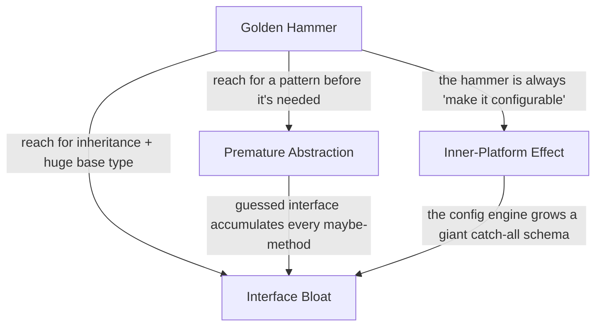

# Abstraction Failures Anti-Patterns — Junior

> **Category:** [Design Anti-Patterns](../README.md) → **Abstraction Failures** — *the chosen abstraction fights the problem instead of fitting it.*
> **Covers (collectively):** Golden Hammer · Inner-Platform Effect · Interface Bloat · Premature Abstraction

---

## Introduction

> Focus: **What does it look like?** and **Why is it bad?**

An *abstraction* is a name for an idea that hides detail: an interface, a base class, a config system, a chosen tool. A good abstraction makes the next change cheap because it captures the *real* shape of the problem. The four anti-patterns in this file are all the same mistake from different angles — **the abstraction has the wrong shape**, so instead of helping, it fights you.

The other design categories are about objects knowing too much ([OO Misuse](../01-oo-misuse/junior.md)) or sharing too much ([Coupling & State](../02-coupling-and-state/junior.md)). This category is about *choosing or building the wrong level of abstraction* in the first place:

- **Golden Hammer** — you reach for the same tool for every problem because you know it well, even when it doesn't fit.
- **Inner-Platform Effect** — you make a system so configurable it becomes a slow, buggy copy of the platform it already runs on.
- **Interface Bloat** — you pile so many methods onto one interface that nobody can actually implement all of them, so implementers fake the rest with `UnsupportedOperation`.
- **Premature Abstraction** — you build an abstraction before you have a *second* real example, so you guess the shape — and guess wrong.

At the junior level your job is to **recognize each shape** and understand **why** it costs you later. You don't need to redesign large systems yet — that's `senior.md`. You need to stop *creating* these shapes, and the single best habit is restraint: **don't abstract until the problem shows you its real shape.**

> **The mindset shift:** abstraction is not free. Every layer you add is something the next reader must understand and the next change must route through. A wrong abstraction is *worse* than no abstraction — you pay to build it, pay to maintain it, and pay again to tear it down. When in doubt, wait.

---

## Prerequisites

- **Required:** You can read and write functions, classes, and interfaces in at least one language (examples use Go, Java, and Python).
- **Required:** You know what an *interface* is — a contract that lists methods an implementer must provide.
- **Helpful:** You've used a configuration file or a framework, so you have a feel for what a "platform" provides for free.
- **Helpful:** You've felt the pain at least once — built a "flexible" abstraction that turned out to fit only the one case you had, then had to rip it out. That pain is what this file explains.

---

## Glossary

| Term | Definition |
|------|-----------|
| **Abstraction** | A name that hides detail behind a stable contract — an interface, a base class, a config schema, a chosen tool. |
| **Anti-pattern** | A recurring "solution" that looks reasonable but reliably produces fragile, hard-to-change code. |
| **Golden Hammer** | Using one familiar tool for every problem regardless of fit ("if all you have is a hammer, everything looks like a nail"). |
| **Platform** | The language, runtime, database, or framework you already build on — it gives you features for free (functions, types, queries). |
| **Inner-Platform Effect** | A configurable system that grows into a worse re-implementation of the platform underneath it. |
| **Soft coding** | Pushing logic out of code and into config/database/rules — taken too far, it produces the Inner-Platform Effect. |
| **Interface Segregation** | The principle that many small, focused interfaces beat one big one — the cure for Interface Bloat. |
| **Rule of Three** | Extract an abstraction only after you see the *third* concrete case; two points don't reveal the real shape. |
| **YAGNI** | "You Aren't Gonna Need It" — don't build for a requirement you don't have yet. The cure for Premature Abstraction. |

---

## The Four at a Glance

| Anti-pattern | One-line symptom | The smell you feel |
|---|---|---|
| **Golden Hammer** | Same tool for every problem | "We solve everything with a queue / regex / inheritance." |
| **Inner-Platform Effect** | A config system that re-invents the platform | "We built our own little query language inside the database." |
| **Interface Bloat** | An interface too big to implement | "Half these methods just `throw new UnsupportedOperationException`." |
| **Premature Abstraction** | An abstraction with only one real case | "This `Strategy` interface has exactly one implementation." |

These are **abstraction-level** anti-patterns: you spot them by asking *"does this abstraction match the number and shape of real cases?"* — not by a single bad line. Read each section for the shape, a concrete example, and the junior-level fix.

---

## Golden Hammer

> *"If all you have is a hammer, everything looks like a nail."* — Abraham Maslow (the *law of the instrument*)

### What it looks like

A **Golden Hammer** is a tool, pattern, or technology that a person (or team) knows so well that they apply it to *every* problem — whether or not it fits. The tell isn't that the tool is bad; it's that it's the *only* tool ever reached for. Common golden hammers: "everything is a microservice," "everything goes through the message queue," "everything is a regex," "everything is solved with inheritance," "every storage problem is a relational table."

```python
# Python — a regex golden hammer.
# Someone who loves regex uses it even where a simple split is clearer and safer.

import re

def parse_csv_line(line: str) -> list[str]:
    # A baroque regex to do what `line.split(",")` does — and it breaks
    # on quoted commas, which a real CSV parser handles for free.
    return re.findall(r'(?:^|,)("(?:[^"]*)"|[^,]*)', line)

def is_even(n: int) -> bool:
    # Yes, someone really does this when regex is their hammer.
    return re.fullmatch(r"(..)*", "x" * n) is not None
```

The same shape appears at architecture scale: a team that built one successful Kafka pipeline now routes *every* feature — including a simple synchronous form submission — through Kafka, because Kafka is what they know.

### Why it's bad

- **The tool fights the problem.** A regex for CSV misses quoting rules a real parser handles; a queue for a synchronous request adds latency and failure modes you don't need.
- **It hides simpler solutions.** `n % 2 == 0` is obvious; the regex version is a puzzle. The hammer makes easy problems look hard.
- **It spreads.** Once "we always use X" is the norm, every new feature inherits X's complexity whether it benefits or not.
- **It blocks learning.** The team never reaches for the *right* tool because the familiar one is always "good enough."

### The junior-level fix + smell test

Let the **problem** pick the tool, not your comfort. Before reaching for your favorite, ask: *"What does this specific problem actually need?"* Often the answer is a built-in you already have.

```python
def parse_csv_line(line: str) -> list[str]:
    import csv, io
    return next(csv.reader(io.StringIO(line)))   # the right tool, handles quoting

def is_even(n: int) -> bool:
    return n % 2 == 0                            # the obvious tool
```

> **Smell test:** if your team's answer to *every* new problem is the same word — "a queue," "a microservice," "inheritance," "a regex" — you have a Golden Hammer. Healthy teams pause and ask what the problem needs first.

---

## Inner-Platform Effect

### What it looks like

The **Inner-Platform Effect** happens when a system becomes so configurable that it ends up re-implementing — badly — the platform it already runs on. Instead of writing code, you build a config-driven engine, a rule table, or a tiny scripting language inside your application. Over time that engine grows conditionals, variables, and control flow until it *is* a programming language — just slower, buggier, and with no debugger.

A classic form is **storing logic in the database** and interpreting it at runtime:

```java
// Java — an in-database "rule engine" that re-invents if/else, badly.
// The rules table:  id | field | operator | value | action
//
//   1 | "age"    | ">="  | "18"  | "ALLOW"
//   2 | "country"| "=="  | "US"  | "ALLOW"
//   3 | "score"  | "<"   | "0.3" | "DENY"

class RuleEngine {
    boolean evaluate(User u, List<Rule> rules) {
        for (Rule r : rules) {
            Object field = reflectField(u, r.field);   // stringly-typed field lookup
            switch (r.operator) {                       // re-implementing operators
                case ">=": if (!gte(field, r.value)) return false; break;
                case "==": if (!eq(field, r.value))  return false; break;
                case "<":  if (!lt(field, r.value))  return false; break;
                // ...and now someone wants AND/OR, then nesting, then variables...
            }
        }
        return true;
    }
}
```

This started as "let business users edit rules without a deploy." It ends as a half-built interpreter: no type checking, no tests, no IDE support, and every new requirement ("can we group rules with OR?") means extending *your* language instead of writing one `if`.

### Why it's bad

- **You re-implement the platform, worse.** The host language already has `>=`, `&&`, variables, and a debugger — all battle-tested. Your config engine has none of that, and you maintain it.
- **It only ever grows.** Configurable systems attract "just one more option." Each option adds a code path, and the engine slowly turns into a programming language nobody designed.
- **It's unverifiable.** Logic in a database table isn't covered by your tests, your type checker, or code review. Bugs hide in data, not code.
- **It's slow and opaque.** Interpreting rules at runtime is slower than compiled code, and "why did this user get denied?" becomes a forensic exercise.

### The junior-level fix + smell test

For most cases at the junior level: **just write the code.** A rule is an `if`. Three rules are three `if`s — clear, typed, testable, and debuggable.

```java
// The same logic as plain code: typed, testable, debuggable.
boolean isAllowed(User u) {
    if (u.age() < 18)            return false;
    if (!u.country().equals("US")) return false;
    if (u.score() < 0.3)         return false;
    return true;
}
```

If non-developers *genuinely* need to change behavior without a deploy, expose a small set of named, vetted **options** (a plugin or a fixed config of toggles) — not a general-purpose language. The line to hold: configuration chooses *between behaviors you wrote*; it does not *define new behavior*.

> **Smell test:** if your config or database is starting to need operators, variables, conditionals, or nesting, you're building a programming language. Stop — the platform already has one.

---

## Interface Bloat

### What it looks like

**Interface Bloat** (sometimes "fat interface") is an interface with so many methods that no realistic implementer can satisfy them all. The giveaway: implementations that "support" the interface by *refusing* most of it — throwing `UnsupportedOperationException`, returning `null`, or leaving methods as no-ops.

```java
// Java — a bloated interface that tries to cover every device.
interface Device {
    void print(Document d);
    void scan(Document d);
    void fax(Document d);
    void staple();
    void duplex(boolean on);
    void sortOutput();
}

// A cheap printer can only print — so it lies about the rest:
class SimplePrinter implements Device {
    public void print(Document d) { /* real */ }
    public void scan(Document d)  { throw new UnsupportedOperationException("can't scan"); }
    public void fax(Document d)   { throw new UnsupportedOperationException("can't fax"); }
    public void staple()          { throw new UnsupportedOperationException("no stapler"); }
    public void duplex(boolean on){ /* silently ignored */ }
    public void sortOutput()      { /* no-op */ }
}
```

Now every caller must guess which methods actually work, and the type `Device` *promises* things it can't deliver. The compiler thinks `SimplePrinter` can fax; it can't.

### Why it's bad

- **The contract lies.** An interface is a promise. If half the methods throw, the promise is false — and the compiler can't warn you, so the failure shows up at runtime.
- **Every implementer pays the bloat tax.** A printer that only prints still has to write five fake methods, and add a sixth when the interface grows.
- **Callers can't trust the type.** `device.scan(d)` compiles fine but blows up at runtime depending on the concrete object — exactly the bug interfaces are supposed to prevent.
- **It violates the Interface Segregation Principle:** no client should be forced to depend on methods it doesn't use.

### The junior-level fix + smell test

Split the fat interface into small **role interfaces** — one per capability. Each implementer declares only what it can truly do, and the compiler enforces it.

```java
interface Printer { void print(Document d); }
interface Scanner { void scan(Document d); }
interface Fax     { void fax(Document d); }

// Honest: SimplePrinter is exactly a Printer, nothing more.
class SimplePrinter implements Printer {
    public void print(Document d) { /* real */ }
}

// A multifunction device composes the roles it genuinely supports.
class OfficeMFP implements Printer, Scanner, Fax {
    public void print(Document d) { /* ... */ }
    public void scan(Document d)  { /* ... */ }
    public void fax(Document d)   { /* ... */ }
}
```

Now `void copy(Scanner s, Printer p)` asks for exactly the two capabilities it needs — and you *cannot* pass it something that can't scan.

> **Smell test:** if implementing an interface means writing methods that throw `UnsupportedOperation`, return `null`, or do nothing, the interface is too big. One thrown "not supported" is a design smell, not an edge case.

---

## Premature Abstraction

### What it looks like

**Premature Abstraction** is introducing an abstraction — an interface, a base class, a `Strategy`, a factory, a generic parameter — *before* you have a second real case to abstract over. With only one example, you can't see the real shape, so you guess. The guess is almost always wrong, and now the wrong shape is baked into a contract that other code depends on.

The tell is an abstraction with exactly **one** implementation:

```go
// Go — a Strategy interface invented for a single, hypothetical future need.

// "We might support multiple discount strategies someday."
type DiscountStrategy interface {
    Apply(price float64, customer Customer, cart Cart, season string) float64
}

// ...but there is, and has only ever been, ONE implementation:
type StandardDiscount struct{}

func (StandardDiscount) Apply(price float64, c Customer, cart Cart, season string) float64 {
    return price * 0.9 // 10% off. That's the whole "strategy".
}

// Every caller now routes through an interface, a factory, and a 4-parameter
// method signature — to multiply by 0.9.
func checkout(s DiscountStrategy, price float64, c Customer, cart Cart, season string) float64 {
    return s.Apply(price, c, cart, season)
}
```

The signature already shows the guess going wrong: it takes `customer`, `cart`, and `season` "in case a future strategy needs them" — parameters the only real strategy ignores. When a *real* second discount finally appears, it needs something *not* in that signature, and the whole abstraction has to be reworked anyway.

### Why it's bad

- **You guessed the shape from one example.** One data point can't define a line. The contract you locked in fits the imagined case, not the real second one when it arrives.
- **It adds cost with no payoff.** An interface + factory + indirection that wraps a single behavior is pure overhead — more to read, more to navigate, nothing gained.
- **It's harder to change than no abstraction.** Inlined code is easy to refactor when the real need appears. A premature abstraction is a *contract* — other code depends on its shape, so changing it is a breaking change.
- **It misleads readers.** A `Strategy` interface signals "there are multiple strategies." Finding only one is confusing — readers waste time hunting for the others.

### The junior-level fix + smell test

Write the **concrete, simple thing first.** Don't introduce the interface until a *second real* case forces it — and let the second case reveal the shape.

```go
// Just the behavior, inline. Trivial to change later.
func checkout(price float64) float64 {
    return price * 0.9 // 10% off
}
```

When (if) a second discount type genuinely appears, *then* extract — and you'll see what the abstraction actually needs to capture, because you'll have two real examples to compare. This is the **Rule of Three**: duplicate freely until the third occurrence, which finally shows the true shape, then abstract.

> **Smell test:** if your `interface` / abstract base / `Strategy` / factory has exactly one implementation, you abstracted too early. One implementation is not a pattern — it's a guess. Inline it and wait.

---

## How They Reinforce Each Other

Abstraction failures feed each other — a wrong instinct about abstraction shows up in several shapes at once:



- A **Golden Hammer** whose favorite move is "make everything configurable" produces the **Inner-Platform Effect**: config grows into a language.
- A **Golden Hammer** whose favorite move is "design the grand interface up front" produces **Premature Abstraction** and, as it accumulates speculative methods, **Interface Bloat**.
- **Premature Abstraction** guesses a contract; since you can't predict the real cases, you add every method you *might* need — which bloats the interface.
- An **Inner-Platform** rule schema keeps absorbing new options until its catch-all shape is itself a bloated, do-everything contract.

The practical lesson: all four are the same root habit — **abstracting before the problem has shown you its shape.** The cure for all four is restraint: match the tool to the problem, write the concrete code first, and wait for real cases (the [Rule of Three](#premature-abstraction)) before generalizing.

---

## A Quick Spotting Checklist

Run this over any abstraction you touch this week:

- [ ] Is the team's answer to *every* problem the same tool/pattern/tech? → **Golden Hammer**
- [ ] Is config, a DB table, or a "rule" growing operators, variables, or conditionals? → **Inner-Platform Effect**
- [ ] Does implementing an interface mean throwing `UnsupportedOperation` or writing no-ops? → **Interface Bloat**
- [ ] Does an interface / base class / `Strategy` / factory have exactly **one** implementation? → **Premature Abstraction**

If you check any box, you've found a simplification opportunity — usually a *smaller, more concrete* design than the one you have.

---

## Common Mistakes

Mistakes juniors make *about* these anti-patterns (not just the patterns themselves):

1. **Equating "abstract" with "good."** Adding an interface, a base class, or a config layer feels senior — but a wrong or unneeded abstraction is a *liability*. The skill is knowing when *not* to abstract.
2. **Believing duplication must be removed immediately.** Two similar code blocks aren't yet a pattern. Removing duplication before the third case (the [Rule of Three](#premature-abstraction)) is how Premature Abstraction is born. A little duplication beats the wrong abstraction.
3. **Treating "flexible" as free.** "Make it configurable" sounds safe, but every option is a code path you maintain forever — the seed of the Inner-Platform Effect. Configurability is a cost, not a default.
4. **Cramming everything into one interface "for convenience."** A fat interface feels tidy (one type to import). It pushes the pain onto every implementer and lies to every caller. Prefer many small role interfaces.
5. **Defending a tool because you're good at it.** "I know regex, so I'll use regex" is exactly the Golden Hammer. Comfort with a tool is a reason to *watch yourself*, not a reason to reach for it.
6. **Confusing "one implementation today" with "needs an interface."** An interface earns its place when there are real, multiple implementers — or a genuine seam for testing. Speculative future implementers don't count.

---

## Test Yourself

1. Name the four Abstraction Failure anti-patterns and give the one-line symptom of each.
2. A teammate stores business rules in a database table with `field`, `operator`, and `value` columns, and a loop that interprets them with a `switch` on the operator. Which anti-pattern is this, and what's the simplest fix for three rules?
3. What is the **Rule of Three**, and which anti-pattern does it prevent?
4. You find an interface `Device` with `print`, `scan`, `fax`, `staple`. A `SimplePrinter` implements it but throws `UnsupportedOperationException` for everything except `print`. Which anti-pattern is this, and how do you fix it?
5. Why is a *wrong* abstraction often worse than *no* abstraction at all?

---

## Cheat Sheet

| Anti-pattern | Spot it by | Fix it with |
|---|---|---|
| **Golden Hammer** | Every problem solved with the same tool/pattern/tech | Let the problem pick the tool; learn a wider toolkit |
| **Inner-Platform Effect** | Config/DB growing operators, variables, conditionals | Write the logic as code; expose fixed named options, never a language |
| **Interface Bloat** | Implementers throw `UnsupportedOperation` / no-op methods | Split into small role interfaces (ISP) |
| **Premature Abstraction** | An interface/base/`Strategy` with exactly one implementation | Write concrete code first; abstract on the third real case ([Rule of Three](#premature-abstraction)) |

> **One rule to remember:** *An abstraction must earn its place. Match the tool to the problem, write the concrete thing first, and don't generalize until real cases show you the shape.*

---

## Summary

- **Abstraction Failures** are the wrong *shape* for the problem — the abstraction fights you instead of fitting. The cure for all four is restraint.
- **Golden Hammer** applies one familiar tool everywhere; **Inner-Platform Effect** re-invents the platform inside a config engine; **Interface Bloat** builds a contract too big to honor (methods throw `UnsupportedOperation`); **Premature Abstraction** generalizes from a single guessed case.
- At the junior level your job is to **recognize each shape** and **avoid creating it** — let the problem pick the tool, write logic as code instead of config-languages, split fat interfaces into role interfaces, and wait for the [Rule of Three](#premature-abstraction) before extracting.
- They reinforce each other because they share one root habit: *abstracting before the problem has shown its shape.*
- This category is closely tied to **YAGNI**, the **Rule of Three**, and the Over-Engineering pair **Speculative Generality** and **Soft Coding / Inner-Platform** — see [Over-Engineering](../../../anti-patterns/01-development/03-over-engineering/junior.md).
- Next: [`middle.md`](middle.md) — *when these abstractions creep in during real projects, and how to choose the right level before they take root.*

---

## Further Reading

- **AntiPatterns: Refactoring Software, Architectures, and Projects in Crisis** — Brown, Malveau, McCormick, Mowbray (1998) — the canonical catalog, including the Golden Hammer.
- **Clean Code** — Robert C. Martin (2008) — the Interface Segregation Principle and the cost of speculative design.
- **Refactoring** — Martin Fowler (2nd ed. 2018) — the Rule of Three and the dangers of Speculative Generality.
- **The Pragmatic Programmer** — Hunt & Thomas (20th anniv. ed., 2019) — "Don't Repeat Yourself," orthogonality, and choosing the right tool.
- **Worse Is Better** / *The Inner-Platform Effect* — folklore essays on configurable systems that grow into bad platforms.

---

## Related Topics

- Interface Bloat → Interface Segregation Principle — the positive principle: many small role interfaces over one fat one.
- [OO Misuse](../01-oo-misuse/junior.md) — the sibling category: objects that misuse inheritance and encapsulation.
- [Coupling & State](../02-coupling-and-state/junior.md) — the sibling category: modules that know or share too much.
- [Over-Engineering](../../../anti-patterns/01-development/03-over-engineering/junior.md) — YAGNI, Speculative Generality, and Soft Coding / Inner-Platform from the development-process angle.
- Refactoring — Inline Class, Collapse Hierarchy, and the Rule of Three for safely removing wrong abstractions.
- Design Patterns — the positive catalog; learn patterns so you don't reach for the same one as a Golden Hammer.

---

## Check your understanding

1. Explain Abstraction Failures Anti-Patterns — Junior Level in your own words and name the problem it solves.
2. How would you apply the ideas around Table of Contents, Introduction, Prerequisites in a realistic engineering change?
3. What failure mode or misuse should you look for, and what evidence would reveal it?
4. What small example would prove that you can apply Abstraction Failures Anti-Patterns — Junior Level correctly?
5. What observable result would convince you that the approach improved the system?
