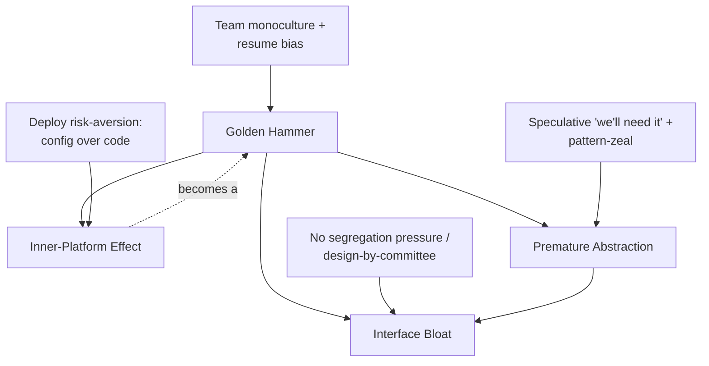
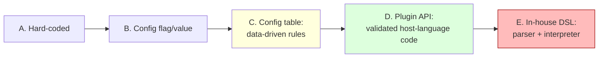

# Abstraction Failures Anti-Patterns — Senior

> **Category:** [Design Anti-Patterns](../README.md) → **Abstraction Failures** — *the chosen abstraction fights the problem instead of fitting it.*
> **Covers (collectively):** Golden Hammer · Inner-Platform Effect · Interface Bloat · Premature Abstraction

---

## Table of Contents

1. [Introduction](#introduction)
2. [Prerequisites](#prerequisites)
3. [How Did the Codebase Get Here? — Root-Cause Forces](#how-did-the-codebase-get-here--root-cause-forces)
4. [Golden Hammer: Breaking a Team Monoculture](#golden-hammer-breaking-a-team-monoculture)
5. [Inner-Platform Effect: Config → Rule Engine → DSL](#inner-platform-effect-config--rule-engine--dsl)
6. [Interface Bloat: Segregating Fat Interfaces at Scale](#interface-bloat-segregating-fat-interfaces-at-scale)
7. [Premature Abstraction: Inlining the Wrong Abstraction](#premature-abstraction-inlining-the-wrong-abstraction)
8. [When These Are Acceptable](#when-these-are-acceptable)
9. [Prevention: Design It Twice, Reviews, ADRs](#prevention-design-it-twice-reviews-adrs)
10. [Common Mistakes](#common-mistakes)
11. [Test Yourself](#test-yourself)
12. [Cheat Sheet](#cheat-sheet)
13. [Summary](#summary)
14. [Further Reading](#further-reading)
15. [Related Topics](#related-topics)

---

## Introduction

> Focus: **How did the codebase get here?** and **How do I fix the wrong abstraction safely at scale?**

At the junior level you learned to *recognize* these four shapes; at the middle level you learned to *avoid* them by deferring abstraction and matching the tool to the problem. This file is about the situation you actually inherit as a senior: the wrong abstraction is already three years old, two hundred files import the bloated interface, the in-house rule engine has its own (undocumented) syntax that one customer's invoices depend on, and the entire team reaches for the same framework because that is what the last four hires were hired for.

Abstraction failures are insidious because, unlike a God Object, **they often look like good engineering.** A fat interface looks like thoroughness. A configurable rule engine looks like flexibility. A `Strategy` with one strategy looks like foresight. The cost is deferred and diffuse — it shows up later as `UnsupportedOperationException`, as a "config" change that requires a deploy anyway, as a half-built interpreter nobody can debug. The senior's job is to see the cost *before* it compounds, and to unwind it without breaking the consumers who have already wired themselves into it.

> **The senior mindset shift:** the junior asks "is this abstraction good?"; the senior asks "what real variation does this abstraction earn its keep against, who depends on its current shape, and is the cheapest correct move to *add* abstraction, *segregate* it, or *delete* it back to duplication?" The hardest senior judgment in this whole chapter is **the wrong abstraction is more expensive than no abstraction** — and the cure is often to go *backwards*, inlining a clever generalization into honest, boring duplication.

---

## Prerequisites

- **Required:** Fluency with [`junior.md`](junior.md) and [`middle.md`](middle.md) — you can recognize all four anti-patterns and apply Extract Interface, the Rule of Three, and "use the host platform."
- **Required:** You have shipped to production and maintained an abstraction you did not design — felt the friction of a wrong one firsthand.
- **Helpful:** Working knowledge of SOLID (especially the Interface Segregation and Dependency Inversion principles).
- **Helpful:** Familiarity with the Refactoring techniques — Extract Interface, Inline Class, Collapse Hierarchy, Remove Middle Man.
- **Helpful:** Exposure to deprecation / versioning of a published API (you will need it for the bloated-interface migration).

---

## How Did the Codebase Get Here? — Root-Cause Forces

Each of these four anti-patterns has a distinct biography. Naming the *force* matters as much as naming the smell, because — exactly as with [bad structure](../../01-development/01-bad-structure/senior.md) — if the force survives your refactor, the bad abstraction regrows.

### Team monoculture and resume bias (Golden Hammer)

A team made of five people who all know Spring deeply will solve every problem with Spring — not because Spring fits, but because the *cost of evaluation* is highest for the unfamiliar option and the *cost of failure* is socially lowest for the familiar one ("nobody got fired for using the standard stack"). **Resume bias** adds a darker engine: an individual choosing a hot technology because it looks good on a CV, not because the problem needs it. Hiring compounds it — you hire for the stack you have, which deepens the monoculture, which narrows the next hire. The Golden Hammer is an *organizational competency*, not an individual mistake.

### The configurability slippery slope (Inner-Platform Effect)

Nobody sets out to build a programming language. It starts with one honest config flag. Then a stakeholder wants "rules" instead of a flag, so you add condition rows in a table. Then conditions need *and*/*or*, so you add a boolean tree. Then they need "if the rule before this one matched," so you add ordering and state. Each step is locally reasonable; the sum is a Turing-complete interpreter with no debugger, no type checker, and no tests — a **worse, slower copy of the language you wrote it in.** The force is *risk aversion to deploys*: "we don't want to ship code for every rule change," which quietly trades a well-tooled deploy pipeline for a homemade, un-tooled one.

### "Be thorough" and interface-by-committee (Interface Bloat)

A fat interface is usually the residue of *additive design under no segregation pressure*. A `Repository` interface starts with `save`/`findById`; then someone needs `bulkInsert`, someone else `streamAll`, someone else `findByComplexCriteria`, and each addition is the path of least resistance — adding a method nobody can veto is easier than arguing for a new role interface. Interfaces designed *by committee* or *to be exhaustive* ("a connector should support everything a connector might do") bloat fastest, because no single implementer's pain is felt at design time.

### Speculative generality and pattern-zeal (Premature Abstraction)

The Premature Abstraction is cast the moment someone says *"we'll probably need this to be pluggable later."* It is driven by **fear of future change cost** and by **pattern-zeal** — a developer who just learned `Strategy`/`Factory`/generics sees a place to apply it. The abstraction's shape is *guessed* from one example, and one example never reveals the axis of variation. When the real second case arrives, it doesn't fit the guessed shape — so it gets bent to fit, and the abstraction starts lying.



Reading the graph: a Golden Hammer is the gateway drug — once a team over-trusts one tool, it over-builds with it (Inner-Platform), over-specifies its interfaces (Bloat), and over-generalizes its code (Premature Abstraction). The remedies cluster too: widen the toolkit, defer abstraction, and segregate by role.

> The practical takeaway, same as the sibling category: **a senior plan names the force, not just the smell.** "Replace the rule engine" is a wish. "Establish that pricing rules change at most monthly, prove a simple deploy is fast enough, migrate the three live rule-sets into reviewed code behind a flag, and freeze new rule-engine features behind an ADR" is a plan that stays fixed.

---

## Golden Hammer: Breaking a Team Monoculture

The Golden Hammer at scale is rarely one misused tool — it's a whole codebase where *every* problem has been forced through one shape: every persistence problem is a giant ORM mapping (including the analytics export that should be raw SQL), every async problem is the one message broker the team likes (including the request that should be a synchronous call), every data structure is a `HashMap` (including the hot inner loop that should be an array).

### Detecting it in review and architecture

The tell is a **mismatch between the tool's sweet spot and the problem's shape**, repeated. In review, the diagnostic question is not "is this tool good?" but **"what made this the right tool *here*, and what did we rule out?"** If the answer is "it's what we use," that's the monoculture talking. At the architecture level, look for: ORM gymnastics around queries that are 10 lines of SQL; a Kafka topic with one producer and one consumer that's really an RPC; a microservice carved out for something that's a function call; deeply nested generics emulating a feature the language gives you for free.

### Fixing it: introduce the second tool deliberately, at one seam

You do **not** rip out the Golden Hammer everywhere — that's just a new monoculture swung the other way. You introduce the right second tool *at the one place the mismatch hurts most*, behind an abstraction, and let the comparison speak.

```go
// BEFORE — the analytics export forced through the ORM: 400 ms, N+1 queries,
// objects materialized only to be flattened back to rows.
func (s *Reporting) MonthlyRevenue(ctx context.Context, month string) ([]Row, error) {
    orders, err := s.orm.Preload("Items").Preload("Customer").
        Where("month = ?", month).Find() // hydrates thousands of full aggregates
    // ... then manually re-aggregate in Go ...
}

// AFTER — the right tool at one seam: raw SQL for the set-oriented job, behind
// the same Reporting interface the callers already use. The ORM stays for the
// transactional paths where it earns its keep. No monoculture either direction.
func (s *Reporting) MonthlyRevenue(ctx context.Context, month string) ([]Row, error) {
    const q = `SELECT customer_id, SUM(total) AS revenue
               FROM orders WHERE month = $1 GROUP BY customer_id`
    rows, err := s.db.QueryContext(ctx, q, month) // 8 ms, one round trip
    // ... scan ...
}
```

The senior moves are: (1) **pick the highest-pain mismatch**, not a religious war; (2) **introduce the alternative behind an existing interface** so the blast radius is one implementation; (3) **measure** — make the win (latency, lines, clarity) visible so the team's mental model of "our default tool" updates. The durable fix isn't the SQL — it's the team *learning that the default has exceptions*, which you cement with an ADR ("use the ORM for transactional aggregates; use raw SQL for set-oriented reporting").

The Golden Hammer shows up at the *data-structure* level too, and the fix is the same shape — match the structure to the access pattern, not to habit:

```java
// BEFORE — HashMap as the universal hammer, in a hot path that only ever
// iterates a small, fixed set of enum-keyed counters. Boxing, hashing, and
// pointer-chasing on every access; cache-hostile in the inner loop.
Map<Status, Integer> counts = new HashMap<>();
for (Event e : millionsOfEvents) {
    counts.merge(e.status(), 1, Integer::sum);   // hash + box per event
}

// AFTER — the access pattern (dense, enum-keyed, hot) wants an array, not a map.
int[] counts = new int[Status.values().length];  // contiguous, no boxing/hashing
for (Event e : millionsOfEvents) {
    counts[e.status().ordinal()]++;               // one array write
}
```

Neither version is "better" in the abstract — the point is that `HashMap` was reached for *by default*, and the dense, enum-keyed, hot-loop access pattern is exactly its worst case. The Golden Hammer is the *unexamined default*, and the senior cure is to make the examination a habit, not to ban the tool.

---

## Inner-Platform Effect: Config → Rule Engine → DSL

This is the most expensive abstraction failure because the asset you build (a half-language) is the hardest to migrate off — its "programs" are data your customers depend on, written in a syntax only your code understands.

### The escalation ladder — and where to stop



The senior judgment is **knowing which rung the requirement actually needs** — and that the answer is almost never E:

- **B / C (config & data-driven rules)** — correct when the variation is *closed and data-like*: a tax rate, a feature toggle, a table of `(condition, action)` rows where conditions are a fixed, small vocabulary. Stop here if you can. A config table is not an Inner-Platform; a config table with branching, ordering, variables, and "call the previous rule" *is*.
- **D (a constrained plugin API)** — correct when extenders need *real computation* but you control the boundary. You expose a validated, sandboxed extension point in the **host language** (or a well-known embeddable one — Lua, Starlark, CEL, WASM), with a typed contract, resource limits, and tests. You get the host's debugger, profiler, and type checker *for free*. This is the legitimate face of extensibility (see [When These Are Acceptable](#when-these-are-acceptable)).
- **E (a home-grown DSL with its own parser/interpreter)** — almost always the anti-pattern. You are now maintaining a programming language: a lexer, a parser, error messages, an evaluator, and the eternal feature requests ("can rules call other rules?", "can we have variables?", "loops?") that recreate, badly, the language you started in.

> **The deciding question:** *"Is the thing we're configuring actually a program?"* If rule authors need conditionals, variables, and composition, they need a programming language — so give them a real one (a plugin API, rung D), not a worse one you wrote yourself (rung E).

### What rung D actually looks like

The legitimate alternative to a home-grown DSL is a *constrained, validated* plugin contract. The host does parsing, type-checking, sandboxing, and resource limits for you — the extension is just a typed function:

```python
# Rung D — extensibility as a validated plugin contract, not a parser.
# The "rule" is host-language code behind a typed interface; the platform
# enforces the boundary (timeout, sandbox, no I/O) instead of inventing syntax.
class DiscountRule(Protocol):
    def applies(self, ctx: CartContext) -> bool: ...
    def discount(self, ctx: CartContext) -> Money: ...

# A rule author writes this — debuggable, type-checked, unit-testable, with the
# full host language available. No lexer, no interpreter, no bespoke error messages.
class GoldTierBulkRule:
    def applies(self, ctx):  return ctx.tier == "gold" and ctx.total > Money(100)
    def discount(self, ctx): return ctx.total * 0.10

# The platform loads rules through a guarded registry: validate the contract,
# run under a timeout, deny network/filesystem. You get governance for free.
REGISTRY: dict[str, DiscountRule] = {}
def register(name: str, rule: DiscountRule) -> None:
    assert hasattr(rule, "applies") and hasattr(rule, "discount")  # contract check
    REGISTRY[name] = rule
```

If the *deployment* friction was the original motivation ("we can't ship code for every rule change"), the senior answer is to fix the *pipeline* — make rule deploys fast, safe, and reviewable — not to build a parser that smuggles untooled "code" past it. A constrained embeddable language (CEL, Starlark, Lua, WASM) is the middle ground when you need third-party rules you can't trust as native code.

### Migrating off an in-house DSL safely

You inherit a `RuleEngine` that parses a custom string syntax (`"if cart.total > 100 and customer.tier == 'gold' then discount 10%"`) and live customer rule-sets depend on it. You cannot break those rules. The migration mirrors the [strangler-fig](../../01-development/01-bad-structure/senior.md) discipline:

```python
# 1. CHARACTERIZE: snapshot every live rule's behavior as golden tests, by
#    replaying real production inputs through the old engine and recording outputs.
#    These pin behavior; the new path must reproduce them exactly.
def test_rule_golden(rule_id, recorded_input, recorded_output):
    assert OldRuleEngine.eval(rule_id, recorded_input) == recorded_output

# 2. EXPAND: build the replacement behind the SAME interface. The target is a
#    constrained plugin API (rung D), e.g. rules-as-validated-Python-callables
#    or CEL expressions — NOT another bespoke parser.
class Rule(Protocol):
    def apply(self, ctx: CartContext) -> Discount: ...

# 3. PARALLEL-RUN: evaluate BOTH engines on live traffic, serve the OLD result,
#    log any divergence. Verify the new path on real rules before it serves one.
def evaluate(rule_id, ctx):
    old = OldRuleEngine.eval(rule_id, ctx)
    new = new_rules[rule_id].apply(ctx)        # shadow
    if new != old:
        metrics.inc("rule.divergence", tags={"rule": rule_id})
    return old                                  # old still authoritative

# 4. MIGRATE + CONTRACT: translate rule-sets one customer at a time (often
#    automatable: parse the DSL once, emit the new form), flip authority per
#    customer behind a flag, then delete the parser when divergence is zero.
```

The key realization: the DSL's *programs* (the rule strings) are the migration's payload, and translating them is often a one-time, scriptable compilation — you parse the old syntax once to emit the new form, rather than hand-porting. The parser/interpreter you delete; the rules you preserve.

---

## Interface Bloat: Segregating Fat Interfaces at Scale

A bloated interface is one no realistic implementer can honor in full, so implementations lie — they `throw new UnsupportedOperationException()`, return `null`, or silently no-op. This is a direct violation of the **Interface Segregation Principle**: *no client should be forced to depend on methods it does not use.*

### The smell: implementations that refuse

```java
// SMELL — a fat interface. The read-only cache CANNOT honor half of it,
// so it lies at runtime. Every caller now depends on methods that may throw.
interface DataStore {
    Item get(Id id);
    List<Item> query(Criteria c);
    void put(Item i);
    void delete(Id id);
    void bulkImport(Stream<Item> items);
    Transaction beginTx();
    void registerChangeListener(Listener l);
    Stats stats();
}

class ReadOnlyCache implements DataStore {
    public Item get(Id id) { /* real */ }
    public List<Item> query(Criteria c) { /* real */ }
    public void put(Item i)    { throw new UnsupportedOperationException(); } // lies
    public void delete(Id id)  { throw new UnsupportedOperationException(); } // lies
    public void bulkImport(Stream<Item> s) { throw new UnsupportedOperationException(); }
    public Transaction beginTx() { throw new UnsupportedOperationException(); }
    public void registerChangeListener(Listener l) { /* no-op */ }            // lies
    public Stats stats() { /* real */ }
}
```

`UnsupportedOperationException` is the single loudest signal of Interface Bloat. The runtime exception is the type system *telling you* the abstraction is wrong — a method that's part of the contract but can't be supported means the contract is too broad.

### Segregate into role interfaces

The fix is to split the fat interface into **role interfaces** — small interfaces named for *what a client needs*, not what an implementer happens to provide. Compose them where an implementation genuinely supports several.

```java
// FIXED — role interfaces. Each names a capability; clients depend only on what
// they use; ReadOnlyCache simply doesn't implement the ones it can't honor —
// the compiler enforces honesty instead of UnsupportedOperationException at run time.
interface Reader      { Item get(Id id); List<Item> query(Criteria c); }
interface Writer      { void put(Item i); void delete(Id id); }
interface BulkLoader  { void bulkImport(Stream<Item> items); }
interface Transactional { Transaction beginTx(); }

class ReadOnlyCache implements Reader { /* only what it can actually do */ }
class SqlStore implements Reader, Writer, BulkLoader, Transactional { /* all */ }

// A consumer that only reads now CANNOT even be handed write capability:
class ReportBuilder {
    ReportBuilder(Reader source) { ... }   // honest dependency, can't call put()
}
```

This is the design behind Go's standard library: `io.Reader` and `io.Writer` are one-method role interfaces, and `io.ReadWriteCloser` is a *composition* of three small ones — broad where it's genuinely needed, but built up from minimal parts so a write-only sink can implement just `Writer`.

```go
// Go's stdlib — the antidote to bloat as a design idiom: tiny role interfaces,
// composed. A read-only thing satisfies io.Reader and nothing more.
type Reader      interface { Read(p []byte) (n int, err error) }
type Writer      interface { Write(p []byte) (n int, err error) }
type Closer      interface { Close() error }
type ReadWriteCloser interface { Reader; Writer; Closer } // composition, not bloat
```

### Splitting a *published* bloated interface

If the fat interface is internal, you split and update all call sites in one campaign. If it is **published** — depended on by code outside your blast radius — you cannot just change it. Use **parallel-change applied to a contract**, the same discipline as deprecating a public API in the [bad-structure](../../01-development/01-bad-structure/senior.md) playbook:

1. **Expand.** Introduce the new role interfaces *alongside* the fat one. Make the fat interface extend the small ones (`interface DataStore extends Reader, Writer, ...`) so existing implementers and callers keep compiling — nothing breaks on day one.
2. **Migrate.** Change *consumers* to depend on the narrowest role they actually use (`Reader` instead of `DataStore`), one at a time. New implementers implement only the roles they support.
3. **Deprecate.** Mark the fat interface `@Deprecated(forRemoval=true)`, instrument it if you can, announce the window.
4. **Contract.** When no consumer depends on the fat interface, remove it — leaving only role interfaces.

A subtle but important detail: in step 1 you make `DataStore` *extend* the role interfaces (`interface DataStore extends Reader, Writer, BulkLoader, Transactional`). This is the move that makes the migration non-breaking — every existing implementer still satisfies `DataStore` (it now satisfies the union of its parts), and every existing caller still compiles. You have introduced the *seam* (callers can start depending on `Reader`) without forcing anyone to move yet. Only then do you migrate consumers, deprecate, and contract.

> **Senior judgment:** segregate by *client role*, not by mechanical method-count. The goal is "each consumer depends only on what it uses," not "no interface has more than N methods." A cohesive five-method interface that every implementer fully supports is fine; a two-method interface where one implementer throws on one method is already bloated. The metric is a smoke alarm that routes attention; the human judges by asking "does any implementer lie, and does any consumer over-depend?"

---

## Premature Abstraction: Inlining the Wrong Abstraction

This is the anti-pattern with the most counter-intuitive senior cure: **you often fix it by deleting the abstraction and restoring duplication.**

### The wrong-abstraction cost

Sandi Metz's law governs this whole section: **"Duplication is far cheaper than the wrong abstraction."** Here is why, mechanically. When a premature abstraction meets a case it didn't anticipate, the path of least resistance is to *parameterize* it — add a boolean, a flag, a special-case branch — so the one abstraction now serves two subtly different purposes. Repeat, and you get a generalization riddled with conditionals, where every caller passes flags to steer it and no caller understands the whole. The abstraction now *couples* unrelated callers: a change for caller A's needs risks breaking caller B, because they share the bent-to-fit code.

Duplication, by contrast, is *local and honest*: two copies that drift apart are two independent things you can change independently. The reader sees exactly what each does. The Rule of Three exists precisely because **two occurrences don't reveal the axis of variation** — only the third tells you what genuinely varies versus what's coincidentally similar.

### Sunk-cost is the trap; inlining is the exit

The reason wrong abstractions persist is **sunk-cost**: "someone built this `AbstractProcessorFactory`, surely we should use it." Metz's prescription is exact and worth following literally: when you're modifying code under a wrong abstraction, **re-inline it** — push the abstraction's behavior back down into each caller, recreating the duplication — and *then* you can see the real pattern and re-abstract correctly (or leave it duplicated if the cases are actually distinct).

```python
# WRONG ABSTRACTION — one Exporter forced to serve CSV, JSON, and PDF via flags.
# Every export need added a parameter; now no caller understands the whole thing.
class Exporter:
    def export(self, data, *, fmt, include_header=True, delimiter=",",
               pretty=False, page_size=None, watermark=None):
        if fmt == "csv":
            ... # uses delimiter, include_header; ignores pretty/page_size/watermark
        elif fmt == "json":
            ... # uses pretty; ignores delimiter/include_header/page_size
        elif fmt == "pdf":
            ... # uses page_size/watermark; ignores everything CSV/JSON
        # the conditionals couple three unrelated formats into one class
```

```python
# STEP 1 — INLINE IT BACK: recreate the honest duplication. Each export is now a
# small, self-contained function. Yes, there's repeated I/O scaffolding — that
# duplication is cheaper than the flag-tangle above, and now the REAL axis of
# variation (it's the *formatting*, not the I/O) is visible.
def export_csv(data, *, include_header=True, delimiter=","): ...
def export_json(data, *, pretty=False): ...
def export_pdf(data, *, page_size, watermark=None): ...

# STEP 2 — RE-ABSTRACT correctly, only if the third case confirms the shape.
# The real common interface is "data -> bytes", a tiny role, not a god-method.
class Format(Protocol):
    def render(self, data: Sequence[Row]) -> bytes: ...
# CsvFormat, JsonFormat, PdfFormat each implement render(); no cross-format flags.
```

The senior sequence is: **inline → observe the real variation → re-abstract (or stay duplicated).** Doing this safely needs a characterization test around the abstraction first (capture inputs/outputs of `export` for each format), so the inline-and-rebuild provably preserves behavior. The Extract/Inline mechanics live in Refactoring techniques; the principle that powers them is the DRY principle correctly understood — DRY is about *knowledge*, not *text*; two pieces of identical-looking code that encode *different decisions* are not a violation, and merging them is the wrong abstraction.

### Why two cases mislead — and what the third reveals

The Rule of Three is not superstition; it is a statement about *information*. With one case you have nothing to generalize from. With **two**, the two are usually similar enough that you can extract *something* — but you can't tell which similarities are *essential* (the real axis of variation) and which are *coincidental* (they happen to match today). The extracted abstraction encodes your guess, and the guess is biased toward the two examples you happen to have.

```go
// TWO cases: a CSV and a JSON exporter. They share "write a header line, then
// one line per row." Tempting to extract a LineExporter that owns that shape.
func ExportCSV(w io.Writer, rows []Row)  { writeHeader(w); for _, r := range rows { writeCSVLine(w, r) } }
func ExportJSON(w io.Writer, rows []Row) { writeHeader(w); for _, r := range rows { writeJSONLine(w, r) } }
// The "header + line-per-row" similarity looks essential. It is coincidental.

// THE THIRD case — PDF — has NO header line and NO one-line-per-row shape; it
// paginates, draws tables, embeds a watermark. The guessed LineExporter doesn't
// fit, so it would have been bent (a "skipHeader bool", a "paginate bool") into
// the wrong abstraction. The third case reveals the REAL axis: it's "render rows
// to bytes" — the line-orientation was never the essence.
func ExportPDF(w io.Writer, rows []Row) { /* paginate, draw, watermark — different shape */ }
```

The third case is what disambiguates essential from coincidental similarity. This is why "wait for three" beats "abstract at two": the abstraction you'd extract at two is fitted to a sample that can't show you what varies. A senior treats the Rule of Three as the default and overrides it only with a *named present reason* (two real implementations already in hand, or a published contract boundary), never with a guessed future one.

---

## When These Are Acceptable

Every anti-pattern in this chapter has a legitimate twin. The senior skill is telling them apart — the difference is almost always **"is this a deliberate, justified choice against a real requirement, or a default reached for out of habit/fear?"**

| Anti-pattern | Looks identical to | The legitimate version is acceptable when… |
|---|---|---|
| **Golden Hammer** | A standardized tool chosen for consistency | The team *deliberately* picks one tool (one HTTP framework, one DB) for the *organizational* benefits — shared expertise, fewer ways to fail, easier hiring/on-call — and documents the choice. Consistency is a real value; uniformity-by-decision is not Golden Hammer, uniformity-by-default is. The line: was a fit assessment done, and are exceptions allowed? |
| **Inner-Platform Effect** | A constrained, validated plugin API | Extensibility is a *real, current* requirement and you expose it as a **typed, sandboxed plugin contract in the host language** (or an embeddable one — Lua/Starlark/CEL/WASM) with resource limits and tests — getting a debugger, profiler, and type checker for free. You are using a language, not inventing one. |
| **Interface Bloat** | A stable, broad interface composed from small ones | The broad interface is a *composition* of minimal role interfaces (`io.ReadWriteCloser` from `Reader`+`Writer`+`Closer`), every full implementer genuinely supports all of it, and narrow clients can still depend on the small parts. Broad ≠ bloated when it's composed and fully honored. |
| **Premature Abstraction** | A justified up-front abstraction | The abstraction is forced by a *known* second case (you have two real implementations *today*), by a published stability boundary (a public API/SDK you must keep stable), or by a cost asymmetry (the abstraction is far cheaper to add now than to retrofit across a contract boundary). The Rule of Three is a default, not a law — a known second concrete case satisfies it immediately. |

> The unifying test: **a deliberate standard tool, a constrained plugin API, a composed broad interface, and an abstraction with two real cases are all good engineering.** Their anti-pattern twins are the same shapes produced by *default, fear, or thoroughness* instead of *a named, current requirement.* When you find one of these in review, don't reflexively flag it — ask which version it is.

---

## Prevention: Design It Twice, Reviews, ADRs

Refactoring removes today's bad abstraction; prevention stops the next one. Since the forces are about *how decisions get made*, the durable fixes are decision-process changes.

### "Design it twice"

> *"Design it twice."* — John Ousterhout, *A Philosophy of Software Design*

The cheapest defense against all four anti-patterns: before committing to an abstraction (an interface shape, an extensibility mechanism, a tool choice), sketch **at least two materially different designs** and articulate why one wins. A monoculture can't survive this honestly done — comparing "Kafka" against "a synchronous call" forces the fit question the Golden Hammer skips. A premature abstraction rarely survives it — the second design is often "just don't abstract yet," which usually wins on cost. The act of generating an alternative is what breaks default-reaching.

### Review questions that catch abstraction failures

Bake these into the review checklist (and your [definition of done]):

- **For a new abstraction:** "How many *real, current* concrete cases does this serve?" One → defer (Premature Abstraction). "What ticket needs this pluggability *now*?" None → defer.
- **For a new interface:** "Will every implementer support every method, or will some throw `UnsupportedOperationException`?" Some throw → segregate (Interface Bloat).
- **For a config/rules feature:** "Does the thing we're configuring need conditionals, variables, or composition?" Yes → it's a program; use a plugin API, not a home-grown DSL (Inner-Platform).
- **For a tool choice:** "What did we rule out, and what makes this the right tool *here*?" "It's what we use" → monoculture flag (Golden Hammer).

### ADRs: record the decision *and the rejected alternatives*

An **Architecture Decision Record** is the antidote to forces that re-emerge after you leave. Crucially, a good ADR records the **options considered and why they were rejected** — that's what stops the next engineer re-litigating (or repeating) the mistake. "We chose a constrained Lua plugin API over a custom rule DSL because [reasons]" prevents the Inner-Platform Effect from regrowing the moment a stakeholder asks for "just one more rule feature." "We standardize on PostgreSQL; reach for an alternative only with an ADR" makes the Golden Hammer a *conscious* choice with a defined escape hatch. ADRs turn a senior's hard-won judgment into a durable team asset.

---

## Common Mistakes

Mistakes seniors make when fixing abstraction failures at scale:

1. **Swinging the Golden Hammer the other way.** Reacting to "everything is the ORM" by ripping the ORM out everywhere and hand-rolling SQL — a new monoculture. *Introduce the second tool at the one seam where the mismatch hurts; keep the default where it fits.*
2. **Replacing a home-grown DSL with another home-grown DSL.** Migrating off the bad rule engine onto a slightly nicer bespoke parser. *Migrate to a constrained plugin API in a real (host or embeddable) language, so you stop maintaining a language.*
3. **Splitting a published interface without parallel-change.** Deleting the fat interface and breaking every external implementer in one release. *Expand (fat extends roles) → migrate consumers → deprecate with a window → contract.*
4. **Re-abstracting at the inline step.** Inlining a wrong abstraction and immediately extracting a *new* clever one before the real variation is visible. *Inline, then live with the duplication until the third case reveals the true axis — then abstract, or stay duplicated.*
5. **Mistaking coincidental duplication for a DRY violation.** Merging two identical-looking blocks that encode *different* business decisions, creating a wrong abstraction that couples them. *DRY is about knowledge, not text; don't unify two things that just look alike today.*
6. **Treating the Rule of Three as a hard law.** Refusing to abstract when you genuinely have two real implementations *and* a published stability boundary. *Three is a default against speculation; a known second case or a contract boundary justifies abstracting now.*
7. **Reflexively flagging every broad interface or standard tool as an anti-pattern.** A composed `ReadWriteCloser` and a deliberately-standardized DB are good engineering. *Ask whether it's the deliberate twin or the default-reached anti-pattern before flagging.*
8. **Refactoring the wrong abstraction without characterization tests.** Inlining and rebuilding a flag-laden generalization by hand, silently changing behavior for one of its callers. *Pin behavior with golden tests first; inline-and-rebuild must provably preserve it.*

---

## Test Yourself

1. Your codebase routes every async need through one message broker, including a request that's logically a synchronous RPC (one producer, one consumer, caller blocks on the reply). Name the anti-pattern, the root-cause force, and the senior fix that *doesn't* create a new monoculture.
2. A stakeholder wants pricing rules that support `and`/`or`, variables, and "if the previous rule matched." Engineering proposes extending the in-house rule-string parser. What anti-pattern is this heading toward, and what is the senior alternative — and on what single question does the decision turn?
3. You find a `DataStore` interface where the `ReadOnlyCache` implementation throws `UnsupportedOperationException` on `put`, `delete`, and `beginTx`. What principle is violated, what's the fix, and how do you do it if `DataStore` is a *published* interface other teams implement?
4. Explain Sandi Metz's "duplication is far cheaper than the wrong abstraction." Why is the senior cure for a flag-laden generalization often to *inline it back* rather than to fix it in place?
5. Give the legitimate twin of each anti-pattern (Golden Hammer, Inner-Platform Effect, Interface Bloat, Premature Abstraction) and the single distinguishing test that tells the good version from the bad.
6. A teammate adds an `AbstractStrategy` interface with one implementation "because we'll likely need a second pricing strategy next quarter." Is the Rule of Three being violated? When is up-front abstraction with one current case actually justified?
7. What two decision-process mechanisms most directly prevent abstraction failures from regrowing, and which force does each address?

---

## Cheat Sheet

| Anti-pattern at scale | Root-cause force | Senior fix | Safety / governance |
|---|---|---|---|
| **Golden Hammer** | Team monoculture + resume bias | Introduce the right tool at the *one* worst-fit seam, behind the existing interface; measure | ADR naming default + allowed exceptions; "what did we rule out?" in review |
| **Inner-Platform Effect** | Deploy risk-aversion → config-over-code escalation | Stop at config table (closed/data-like) or a **constrained plugin API in a real language** (open/computational) — never a home-grown DSL | Characterize live rules as golden tests → parallel-run → migrate per-customer → delete parser |
| **Interface Bloat** | No segregation pressure / design-by-committee | Split into **role interfaces**; compose broad ones from small (`io.ReadWriteCloser`) | Published: expand (fat extends roles) → migrate consumers → deprecate → contract |
| **Premature Abstraction** | Speculation + pattern-zeal + sunk-cost | **Inline it back** → observe real variation → re-abstract or stay duplicated | Characterization tests before inlining; Rule of Three as default |

**Three golden rules:**
- *The wrong abstraction is more expensive than no abstraction — duplication is cheaper; inline back, then re-abstract against the real, revealed axis of variation.*
- *Don't invent a language — if the config needs conditionals/variables/composition, expose a constrained plugin API in a real one, not a home-grown DSL.*
- *Segregate interfaces by client role, not by method count; `UnsupportedOperationException` is the type system telling you the contract is too broad.*

---

## Summary

- **How it got here:** abstraction failures are the deterministic output of *how decisions get made* — **team monoculture / resume bias** (Golden Hammer), **deploy risk-aversion escalating config into a language** (Inner-Platform), **no segregation pressure / design-by-committee** (Interface Bloat), and **speculation + pattern-zeal + sunk-cost** (Premature Abstraction). Name the force or it regrows.
- **They look like good engineering** — thoroughness, flexibility, foresight — which is what makes them dangerous; the cost is deferred and diffuse (`UnsupportedOperationException`, un-debuggable rule engines, flag-laden generalizations).
- **Golden Hammer:** introduce the right tool at the single worst-fit seam behind the existing interface and *measure* — never swing to a new monoculture; cement the lesson in an ADR.
- **Inner-Platform Effect:** know which rung the requirement needs (config table for closed/data-like; a **constrained plugin API in a real language** for open/computational); the deciding question is *"is the thing we're configuring actually a program?"* Migrate off a DSL by characterizing live rules, parallel-running, and translating per-customer — preserve the rules, delete the parser.
- **Interface Bloat:** split fat interfaces into **role interfaces** named for client needs, composed where genuinely broad (`io.ReadWriteCloser`); for a *published* interface, use parallel-change (expand → migrate → deprecate → contract).
- **Premature Abstraction:** **"duplication is far cheaper than the wrong abstraction"** — the cure is to **inline it back**, observe the real variation, then re-abstract (or stay duplicated); the Rule of Three is a default against speculation, not a hard law.
- **When acceptable:** a deliberate standard tool, a constrained plugin API, a broad interface *composed* from small ones, and an abstraction with two real cases — all good engineering; the test is *deliberate-against-a-current-requirement* vs *default/fear/thoroughness.*
- **Prevention is decision-process:** **design it twice**, targeted review questions, and **ADRs that record the rejected alternatives** — turning a senior's judgment into a durable team asset that outlasts the engineer who held it.
- Next: [`professional.md`](professional.md) — the testability, performance, and observability implications of these abstraction shapes and their fixes.

---

## Further Reading

- **A Philosophy of Software Design** — John Ousterhout (2nd ed., 2021) — "design it twice," deep vs shallow modules, the true cost of the wrong interface. The primary senior text for this chapter.
- **Refactoring** — Martin Fowler (2nd ed., 2018) — Extract Interface, Inline Class, Collapse Hierarchy, Remove Middle Man, Parallel Change applied to contracts.
- **Working Effectively with Legacy Code** — Michael Feathers (2004) — characterization tests and seams, used here to inline-and-rebuild a wrong abstraction safely.
- **99 Bottles of OOP** — Sandi Metz & Katrina Owen (2nd ed., 2020) — the definitive treatment of "duplication is cheaper than the wrong abstraction" and the inline-then-reabstract discipline.
- **The Pragmatic Programmer** — Hunt & Thomas (20th anniv. ed., 2019) — DRY correctly understood (knowledge, not text), orthogonality, and the cost of premature commitment.
- **AntiPatterns** — Brown et al. (1998) — the original catalog naming the Golden Hammer and the Inner-Platform Effect.
- **Building Evolutionary Architectures** — Ford, Parsons, Kua (2nd ed., 2022) — ADRs and fitness functions as durable governance against regrowth.

---

## Related Topics

- Clean Code → Classes (SOLID) — the Interface Segregation and Dependency Inversion principles that Interface Bloat and Golden Hammer violate.
- Clean Code → DRY — DRY as *knowledge* not *text*, the principle behind not over-merging into a wrong abstraction.
- Refactoring → Refactoring Techniques — Extract Interface, Inline Class, Collapse Hierarchy, Remove Middle Man.
- Design Patterns → Behavioral — Strategy/State, the positive counterparts most often *prematurely* applied.
- Design Patterns → Structural — Adapter and Facade, the right tools for bridging a tool mismatch instead of swinging the Golden Hammer.
- [Bad Structure](../../01-development/01-bad-structure/senior.md) — the strangler-fig / parallel-change discipline reused here for DSL and published-interface migrations.
- [OO Misuse](../01-oo-misuse/senior.md) — the sibling category; Constant Interface and Interface Bloat both misuse the `interface` construct.
- [Coupling & State](../02-coupling-and-state/senior.md) — the third design category; a wrong abstraction is also a coupling mechanism.
- Architecture → SOLID & System Design — plugin architectures, extensibility boundaries, and ADRs at the system level.

---

## Check your understanding

1. Explain Abstraction Failures Anti-Patterns — Senior Level in your own words and name the problem it solves.
2. How would you apply the ideas around Table of Contents, Introduction, Prerequisites in a realistic engineering change?
3. What failure mode or misuse should you look for, and what evidence would reveal it?
4. How would you validate a system-level decision about Abstraction Failures Anti-Patterns — Senior Level under uncertainty?
5. What observable result would convince you that the approach improved the system?
