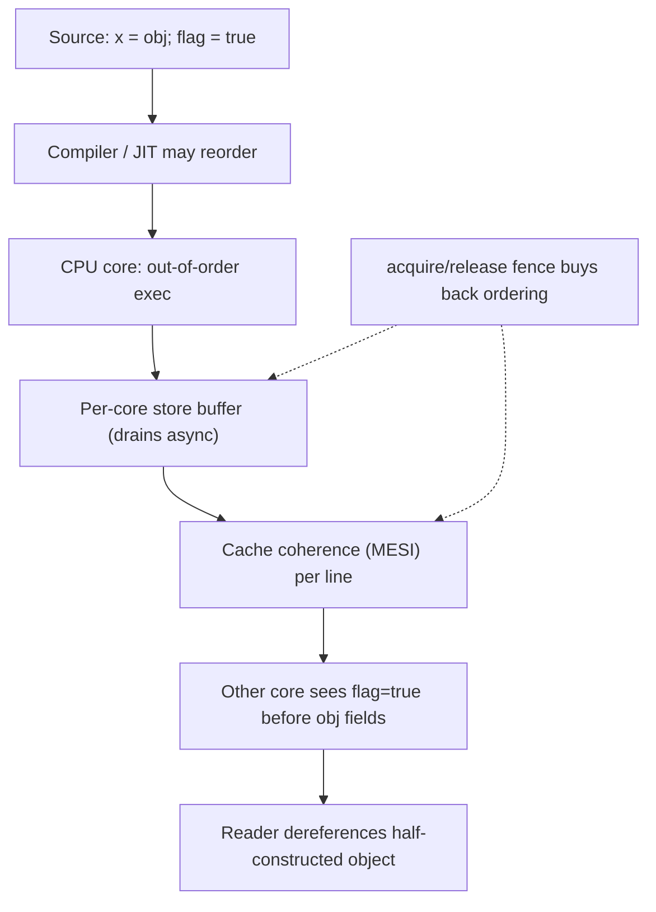

# Synchronization Misuse Anti-Patterns — Professional

> **Category:** [Concurrency Anti-Patterns](../README.md) → **Synchronization Misuse** — *locks and memory primitives applied against a memory model nobody read.*
> **Covers (collectively):** Double-Checked Locking · Volatile Misuse / Wrong Memory Ordering · Race-Prone Lazy Init

---

## Table of Contents

1. [Introduction](#introduction)
2. [Prerequisites](#prerequisites)
3. [The Hardware You Are Actually Programming](#the-hardware-you-are-actually-programming)
4. [Measure First: The Tooling Map](#measure-first-the-tooling-map)
5. [Race-Prone Lazy Init — What the Hardware Actually Does](#race-prone-lazy-init--what-the-hardware-actually-does)
6. [Volatile Misuse / Wrong Memory Ordering — The Cost of a Fence](#volatile-misuse--wrong-memory-ordering--the-cost-of-a-fence)
7. [Double-Checked Locking — Micro-Optimizing One Acquire-Read](#double-checked-locking--micro-optimizing-one-acquire-read)
8. [The Cost of the Lock You Were Avoiding](#the-cost-of-the-lock-you-were-avoiding)
9. [False Sharing on the Guard Variable](#false-sharing-on-the-guard-variable)
10. [Python: Why the GIL Does Not Save You](#python-why-the-gil-does-not-save-you)
11. [A Combined Micro-Benchmark Sketch](#a-combined-micro-benchmark-sketch)
12. [Common Mistakes](#common-mistakes)
13. [Test Yourself](#test-yourself)
14. [Cheat Sheet](#cheat-sheet)
15. [Summary](#summary)
16. [Further Reading](#further-reading)
17. [Related Topics](#related-topics)

---

## Introduction

> Focus: **what the CPU and the runtime actually do** when you write `volatile`, `atomic`, `synchronized`, or a hand-rolled double-checked lock — store buffers, fences, cache coherence, monitor inflation — and **how to measure** whether the clever lock-free init you wrote is even faster than the boring correct one.

`junior.md` showed you the broken-object symptom. `middle.md` taught the safe idioms (`sync.Once`, `Lazy`, holder classes). `senior.md` covered debugging and refactoring contended init paths. This file goes down to the memory model and the silicon, because the three anti-patterns in this category are *all the same bug* viewed at different levels: **publishing a reference before the writes that constructed the object are visible to another core.**

Two disciplines define this level:

1. **The bug is a hardware-visibility bug, not a logic bug.** "Read the code, it's obviously fine" is exactly how these survive review. The reordering happens in the store buffer and the compiler, not in the source. You reason about it with a *memory model*, and you find it with a *memory-model fuzzer*, not a unit test.
2. **The optimization is almost never worth it.** Double-checked locking exists to skip *one* acquire on the fast path. On modern hardware and runtimes a correctly-published read is nearly free and an uncontended lock is cheap. The professional move is to *measure the gap* before trading correctness risk for nanoseconds — and the gap is usually nanoseconds.

> **The mental model:** between your source and the other thread's eyes sit three reorderers — the **compiler/JIT**, the **CPU's out-of-order core + store buffer**, and the **cache coherence protocol**. A memory model is the contract that tells you which reorderings are observable. Synchronization primitives are how you buy back the ordering you need — and each one has a price.

---

## Prerequisites

- **Required:** Fluent with [`senior.md`](senior.md) — you can debug a contended lazy-init path in production and reason about happens-before.
- **Required:** A working definition of *happens-before* and *data race* in at least one language's memory model (Java JMM / Go Memory Model / C++11).
- **Required:** You can read a `benchstat` / JMH comparison and tell signal from noise, and you know what a CAS and a memory fence are.
- **Helpful:** CPU microarchitecture basics — store buffer, out-of-order execution, cache lines (~64 bytes), MESI coherence states.
- **Helpful:** concurrency-patterns, profiling-techniques, big-o-analysis skills for vocabulary and method.

---

## The Hardware You Are Actually Programming

You write `x = obj; flag = true`. You assume another thread that sees `flag == true` also sees the fully-constructed `obj`. Nothing in the hardware guarantees that for free. Here is why.

**Store buffer.** A core does not write directly to cache. Stores go into a per-core **store buffer** and drain to L1 asynchronously, often *out of program order* (x86 keeps store→store order; ARM/POWER do not). A second core reading the cache can see `flag = true` before `x = obj` has drained. The reference is published; the object's fields are not yet visible.

**Out-of-order execution + compiler reordering.** The core executes independent instructions in whatever order keeps its pipelines full, and the compiler/JIT reorders too — `obj`'s field stores and the `flag` store are independent as far as either can prove, so either may move them.

**Cache coherence (MESI).** Each cache line is in one of Modified / Exclusive / Shared / Invalid per core. Coherence guarantees you eventually see a *consistent* value for a *single* line — it does **not** order writes to *different* lines, and it costs real cycles: a write to a `Shared` line must send an *invalidate* to other cores (a coherence message) and wait, the source of contention cost.

A **memory barrier / fence** is an instruction that forces ordering: a *store fence* drains the store buffer before later stores become visible; a *load fence* prevents later loads from being satisfied early; a *full fence* (x86 `MFENCE`, or the implicit fence in a `LOCK`-prefixed CAS) does both and is the expensive one. **A relaxed atomic load is just a load — nearly free. A fence or a CAS is a pipeline-and-coherence event — not free.** That asymmetry is the entire performance story of this category.



> **Discipline:** you cannot reason your way to "this is safe" from the source. You reason from the *memory model* (which reorderings are legal) and confirm with a fuzzer (jcstress) or a race detector (`-race` / TSan). Intuition about "obvious" ordering is the failure mode.

---

## Measure First: The Tooling Map

Two distinct jobs here: (1) prove a *correctness* bug exists (memory-model fuzzing / race detection), and (2) prove an *optimization* is worth it (microbenchmark + hardware counters). Keep both columns close.

| Concern | Go | Java / JVM | Python |
|---|---|---|---|
| **Find the race / ordering bug** | `go test -race` (ThreadSanitizer) | **jcstress** (memory-model fuzzer), ThreadSanitizer via Panama | `pytest` under contention; logic only |
| **Microbenchmark** | `testing.B` + `benchstat` | **JMH** (`@Benchmark`, blackholes) | `pyperf`, `timeit` |
| **Contention profile** | `pprof` mutex & block profiles (`-mutexprofile`, `-blockprofile`) | JFR `jdk.JavaMonitorEnter`, async-profiler `-e lock` | `cProfile` (coarse), `py-spy` |
| **See the emitted code** | `go build -gcflags=-S` (asm) | `-XX:+PrintAssembly` (needs hsdis), `-XX:+PrintInlining` | (interpreter; check C-ext) |
| **Atomic vs mutex A/B** | `sync/atomic` vs `sync.Mutex` benches | `AtomicReference`/`VarHandle` vs `synchronized` JMH | `threading.Lock` vs nothing |
| **Hardware: fences & coherence** | `perf stat -e ...` around bench binary | `perf` / async-profiler hw events | `perf stat python …` |
| **Lock internals at runtime** | `GODEBUG`, `go tool trace` (block spans) | JFR monitor events, `-XX:+PrintConcurrentLocks` | n/a (GIL) |

```bash
# Go: how much time is spent blocked on mutexes vs the work itself?
go test -bench=Init -mutexprofile=mutex.out -blockprofile=block.out ./...
go tool pprof -top mutex.out

# Go: does -race agree the lock-free version is actually race-free?
go test -race ./...

# Java: fuzz the memory model — jcstress runs the snippet billions of times
#   across cores and reports FORBIDDEN/ACCEPTABLE outcomes it actually observed.
java -jar jcstress.jar -t DoubleCheckedLocking

# Linux: cache-coherence traffic around a contended guard (false sharing tell)
perf stat -e cache-misses,LLC-load-misses,cycles ./bench
```

> **Discipline:** a microbenchmark proves *speed*; only jcstress / `-race` proves *correctness*. Never report "the lock-free version is 2x faster" without also reporting "and jcstress/`-race` says it's actually correct." A fast wrong answer is the worst answer in concurrency.

---

## Race-Prone Lazy Init — What the Hardware Actually Does

The base anti-pattern. Two threads race the null check; both construct; one instance leaks — and worse, a reader can publish a *partially* constructed object.

```go
// RACE-PRONE — two goroutines both see nil, both construct; `go test -race`
// flags the unsynchronized read/write of `instance`.
var instance *Config

func Get() *Config {
    if instance == nil {        // unsynchronized read
        instance = load()       // unsynchronized write — and a torn publish
    }
    return instance
}
```

Three separate hardware/runtime failures hide in those three lines:

1. **Lost update.** Both goroutines observe `nil`, both call `load()`, the second store wins; callers may hold *different* instances (catastrophic if `Config` owns a connection pool).
2. **Torn publication.** Even if only one constructs, the store to `instance` can become visible *before* the stores that initialized `*instance`'s fields drain the store buffer / get reordered by the compiler. A reader sees a non-nil pointer to a zero-or-partial object.
3. **Stale read.** A reader's core may hold a cached `nil` for `instance` indefinitely without a synchronizing event forcing it to re-read.

The cure is to introduce a **happens-before edge** between the write that publishes and the read that observes. The simplest correct primitive — `sync.Once` in Go — does exactly that, and is fast:

```go
// CORRECT and fast. sync.Once provides the release/acquire edge: everything
// the init func wrote happens-before every return from Do across goroutines.
var (
    once     sync.Once
    instance *Config
)

func Get() *Config {
    once.Do(func() { instance = load() })
    return instance
}
```

`sync.Once.Do` already implements the fast-path optimization you would hand-roll: it reads an atomic `done` flag first (cheap, no lock) and only takes the mutex on the slow first call. You get double-checked locking, correct, for free — which is the whole point of "the simplest correct primitive is usually fast enough."

In Java the equivalent low-effort correct idiom is the **initialization-on-demand holder**, which leans on the JVM's guaranteed class-initialization lock:

```java
// CORRECT, lazy, lock-free on the fast path. The JVM guarantees a class is
// initialized exactly once with full happens-before to every reader — no
// volatile, no DCL, no manual fence. The class loads on first Holder access.
public final class Config {
    private Config() { /* expensive setup */ }
    private static final class Holder { static final Config INSTANCE = new Config(); }
    public static Config get() { return Holder.INSTANCE; }
}
```

> **Why prefer these over hand-rolled DCL:** they encode the correct memory barriers *for you*, they are obviously correct on review, and on the steady-state hot path the holder is a plain `getstatic` (the JIT proves the class is initialized and emits a bare load) and `Once` is one relaxed atomic load. There is essentially no faster *correct* option to chase.

---

## Volatile Misuse / Wrong Memory Ordering — The Cost of a Fence

`volatile` (Java) / `atomic` (Go `sync/atomic`, C++ `std::atomic`) is **not a lock**. It gives you two things and nothing more: (1) atomicity of single reads/writes of one variable, and (2) ordering — a `volatile`/release write *publishes* everything written before it, and a `volatile`/acquire read *sees* it. It does **not** give you mutual exclusion or atomic read-modify-write.

### The compound-operation trap

```java
volatile int count;
count++;   // BROKEN under contention: this is read, add, write — three ops.
           // Two threads interleave, an increment is lost. volatile makes each
           // step visible but does NOT make the trio atomic.
```

`volatile` makes the *individual* read and the *individual* write atomic and ordered; it does nothing for the *gap between them*. The fix for a counter is an atomic RMW (`AtomicInteger.incrementAndGet`, Go `atomic.AddInt64`) or a lock — not louder `volatile`.

### The performance asymmetry: read vs write/RMW

This is the crux for the professional. The three operations cost wildly different amounts:

| Operation | What the hardware does | Relative cost |
|---|---|---|
| **Relaxed/acquire atomic load** | Plain load (on x86 even a `volatile` load is a normal `MOV`; ordering is free) | ~a normal load |
| **Release atomic store** | Store + ensure prior stores ordered; on x86 a normal store, on ARM a `STLR`/barrier | cheap–moderate |
| **Sequentially-consistent store** | Full fence after the store (x86 `MFENCE` or `LOCK`-add); drains store buffer | **expensive** |
| **CAS / atomic RMW** | `LOCK`-prefixed instruction: full fence + may need exclusive ownership of the line (coherence) | **expensive, worse under contention** |

The asymmetry drives design. **A correct guard *read* is essentially free**, which is *why* double-checked locking can skip the lock on the fast path at all. But the *write* that publishes, and any CAS-based init, pays a fence. So:

```go
// Go: prefer acquire/release semantics (atomic.Pointer) over a heavier
// lock when you genuinely have a single-variable publish. The Load is cheap;
// only the one-time Store/CAS pays the fence.
var cfg atomic.Pointer[Config]

func Get() *Config {
    if p := cfg.Load(); p != nil {   // cheap acquire load on the hot path
        return p
    }
    n := load()
    if cfg.CompareAndSwap(nil, n) {  // one fenced CAS; loser discards `n`
        return n
    }
    return cfg.Load()                // someone else won; re-read
}
```

This *is* a correct double-checked lock built on acquire/release — but note the cost it carries even when correct: a wasted `load()` for the CAS loser. Use it only when `load()` is cheap or first-call contention is rare; otherwise `sync.Once` (which serializes init) is both simpler and avoids the duplicate construction.

> **Sequential consistency vs acquire/release.** SC (the default for Java `volatile`, C++ `atomic` without an order arg, Go's `sync/atomic`) is the easiest to reason about and on x86 the *read* side is usually free anyway — the cost shows up on SC *stores* and RMWs that emit a full fence. On weakly-ordered ARM/POWER, choosing `acquire`/`release` over SC (where the language exposes it, e.g. C++ `memory_order_acquire`) can remove a fence on the hot path. **Measure before reaching for relaxed orderings — they are a foot-gun and the win is often zero on x86.**

> **Diagnose it:** `go test -race` catches `volatile`-as-lock compound-op races; JMH + `-XX:+PrintAssembly` shows whether a `volatile` read compiled to a bare `MOV` (free) or a fenced sequence; `perf stat -e cycles,cache-misses` around the bench reveals coherence cost of a contended CAS.

---

## Double-Checked Locking — Micro-Optimizing One Acquire-Read

DCL is the attempt to keep lazy init *and* skip the lock once initialized:

```java
// THE CLASSIC BUG (pre-fix). Without `volatile`, the JMM permits the write
// publishing `instance` to be reordered before Config's constructor stores,
// so a thread on the fast path can return a half-built object.
private static Config instance;             // <-- missing volatile = BROKEN
public static Config get() {
    if (instance == null) {                  // 1st check, no lock (fast path)
        synchronized (Config.class) {
            if (instance == null) {          // 2nd check, under lock
                instance = new Config();     // publish — may reorder!
            }
        }
    }
    return instance;
}
```

The fix is *exactly one keyword* — and it is mandatory, not optional:

```java
// CORRECT DCL. `volatile` gives the publishing store release semantics and
// the fast-path read acquire semantics: the constructor's writes happen-before
// any reader that sees a non-null `instance`.
private static volatile Config instance;     // <-- the fix
public static Config get() {
    Config local = instance;                  // read volatile ONCE into a local
    if (local == null) {
        synchronized (Config.class) {
            local = instance;
            if (local == null) {
                instance = local = new Config();
            }
        }
    }
    return local;
}
```

Note the `local` variable: it reduces two volatile reads on the fast path to one, the *only* legitimate micro-optimization in the whole idiom.

**Now the professional question: what did DCL actually buy you?** On the steady-state path it replaced an uncontended `synchronized` acquire with a single `volatile` (acquire) read. On x86 that read is a plain `MOV` — free. So DCL trades:

- **You save:** one uncontended monitor enter/exit per call (lightweight, but not zero — see next section).
- **You risk:** getting the `volatile` (or the publication ordering) wrong, which is an *intermittent, unreproducible, corrupt-object* bug.

Against the **holder idiom** (which is also lock-free on the fast path *and* impossible to get wrong), hand-rolled DCL has **no advantage** for a singleton — the holder is strictly better. DCL earns its keep only when initialization is *parameterized* (a per-key lazy cache where you can't use a static holder) and even then a concurrent map's `computeIfAbsent` / `LoadOrStore` is usually clearer:

```go
// Per-key lazy init without hand-rolled DCL: a map of *sync.Once (or
// sync.Map.LoadOrStore) gives you correct, contention-scoped lazy init.
var (
    mu    sync.Mutex
    onces = map[string]*sync.Once{}
    vals  = map[string]*Conn{}
)
func GetConn(key string) *Conn {
    mu.Lock(); o := onces[key]; if o == nil { o = &sync.Once{}; onces[key] = o }; mu.Unlock()
    o.Do(func() { mu.Lock(); vals[key] = dial(key); mu.Unlock() })
    mu.Lock(); defer mu.Unlock(); return vals[key]
}
```

> **The rule:** DCL is a micro-optimization that removes one uncontended lock acquire at the cost of memory-model risk. For a singleton, the holder idiom dominates it. Reach for DCL only when no library primitive fits, and then write it from the canonical template, with `volatile`, and fuzz it with jcstress.

---

## The Cost of the Lock You Were Avoiding

DCL exists to avoid "the lock." How expensive is that lock, really? On modern runtimes the *uncontended* case — which is the steady state DCL optimizes — is cheap, and that is precisely why DCL's payoff is small.

**JVM monitor lifecycle.** A `synchronized` block on an uncontended object historically used **biased locking** (no atomic op at all once biased to a thread) or **thin/lightweight locking** (one CAS on the object header's mark word). Only under *actual contention* does the JVM **inflate** the monitor to a heavyweight OS-backed monitor with a wait queue and `park`/`unpark` syscalls.

> Note: biased locking was deprecated and disabled by default in JDK 15+ (JEP 374) because the rebias/revoke bookkeeping cost more than the CAS it saved on modern CPUs — itself a perfect example of "the clever lock optimization wasn't worth it." Uncontended `synchronized` today is a CAS on enter and a CAS on exit: cheap, but not zero.

**Go mutex.** `sync.Mutex` is a hybrid: the fast, uncontended path is a single atomic CAS in user space (no syscall). Under contention it spins briefly, then parks the goroutine via a **futex** (`futexsleep`/`futexwakeup` on Linux) — a syscall. So an uncontended `Mutex.Lock` is roughly one CAS; a *contended* one is spin + futex + scheduler involvement, orders of magnitude more.

```
Uncontended:   Lock() ≈ 1 CAS (user space, ~tens of ns)
Contended:     Lock() ≈ spin → futex syscall → park/unpark + scheduler  (µs+, and it serializes)
```

The implication for this whole category: **the lock DCL avoids is, on the fast path, about one CAS — and a `volatile`/atomic load is even cheaper, often free.** So DCL saves you ~one CAS per call. That can matter in a multi-million-call-per-second hot path; it is noise everywhere else. The honest framing:

> If the path is hot enough that one CAS matters, use the holder idiom or `sync.Once` — they have *zero* steady-state lock cost and zero risk. DCL is the option you reach for almost never.

> **Diagnose it:** `pprof` mutex/block profiles tell you whether you have *contention* (if not, you have nothing to optimize); JFR `JavaMonitorEnter` events with a duration histogram show inflation; a JMH/`benchstat` A/B of `synchronized`/`Mutex` vs holder/`Once` quantifies the actual gap on *your* hardware — usually small.

---

## False Sharing on the Guard Variable

A subtle professional trap specific to fast-path guards. The whole point of the DCL/atomic fast path is a cheap *read* of the guard. But if that guard variable shares a **64-byte cache line** with a *frequently-written* variable, every write to the neighbor **invalidates the line** in every reader's cache, turning your cheap read into a coherence miss.

```go
// False sharing turns a "free" guard read into a cache miss on every call.
type registry struct {
    ready    atomic.Bool   // read on every fast path
    requests atomic.Uint64 // incremented constantly by all goroutines
    // ^ same cache line: every requests++ invalidates `ready` for all readers
}

// Fix: pad so the read-mostly guard sits alone on its line.
type registry struct {
    ready atomic.Bool
    _     [63]byte        // pad to a full cache line
    requests atomic.Uint64
}
```

The read-mostly guard *wants* to live in `Shared` state across all cores' caches (cheap reads everywhere). A write to a line-mate forces it to `Invalid`, and the next read pays a coherence fetch. This silently erases the entire benefit of the lock-free fast path. **A read-mostly synchronization flag should sit on its own cache line.**

> **Diagnose it:** `perf stat -e cache-misses,LLC-load-misses` around the bench; a throughput curve that *drops* as you add cores (instead of flat or rising) is the false-sharing signature. Confirm by padding and re-measuring.

---

## Python: Why the GIL Does Not Save You

The CPython GIL serializes *bytecode execution*, which tempts people to assume "Python threads can't race." That assumption fails in three concrete ways relevant to lazy init:

1. **Compound operations are not atomic.** The GIL can be released *between bytecodes*. A lazy-init `if _inst is None: _inst = build()` compiles to multiple bytecodes; the interpreter can switch threads after the `is None` check and before the assignment, so two threads both build:

   ```python
   # RACE even under the GIL — the check and the assignment are separate
   # bytecodes; a thread switch between them lets both threads build.
   _inst = None
   def get():
       global _inst
       if _inst is None:        # thread A and B both see None here
           _inst = Config()     # both assign; A's instance is leaked
       return _inst
   ```

   The fix is the same as everywhere: a lock (or `functools.lru_cache` / module-level init at import, which Python *does* serialize). The GIL makes a single `dict[key] = v` or `list.append` atomic, but it does **not** make a multi-bytecode check-then-act atomic.

   ```python
   import threading
   _lock = threading.Lock()
   _inst = None
   def get():
       global _inst
       if _inst is None:                 # cheap unlocked check (fast path)
           with _lock:
               if _inst is None:         # re-check under lock (correct DCL)
                   _inst = Config()
       return _inst
   ```

   This DCL is actually *safe* in CPython because reference-assignment is atomic and the GIL provides a memory barrier on lock acquire — but it is **not portable** to free-threaded (`--disable-gil`, PEP 703) builds, where you need the lock unconditionally. Write the lock; the unlocked fast check is the only thing the GIL lets you safely keep.

2. **C-extension threads run without the GIL.** NumPy, database drivers, and any C extension that releases the GIL for a long computation run *truly in parallel*. Shared state touched by a C extension thread and a Python thread is a genuine data race the GIL never covered.

3. **Free-threaded CPython is arriving.** PEP 703 removes the GIL. Code that "worked because of the GIL" becomes racy on those builds. Treating the GIL as a synchronization primitive is borrowing against an interpreter detail that is being removed.

> **The takeaway:** the GIL guarantees *single-bytecode* atomicity, not *operation* atomicity, and not on free-threaded builds or across the C boundary. Lazy init still needs an explicit lock.

---

## A Combined Micro-Benchmark Sketch

Put the claims to the test. The point is the *method*, not the absolute numbers (which are **illustrative** — reproduce on your hardware).

```go
// bench_init_test.go — A/B the four lazy-singleton strategies on the HOT
// (already-initialized) path, where DCL claims its win.
// Run: go test -bench=. -benchmem -mutexprofile=m.out
//      benchstat baseline.txt new.txt
func BenchmarkMutex(b *testing.B)  { for i := 0; i < b.N; i++ { _ = getViaMutex() } }   // lock every call
func BenchmarkOnce(b *testing.B)   { for i := 0; i < b.N; i++ { _ = getViaOnce() } }    // sync.Once
func BenchmarkAtomic(b *testing.B) { for i := 0; i < b.N; i++ { _ = getViaAtomicPtr() } }// atomic.Pointer DCL
func BenchmarkPlain(b *testing.B)  { for i := 0; i < b.N; i++ { _ = pkgVar } }          // eager, no sync (baseline)
```

```text
# ILLUSTRATIVE benchstat output — DO NOT quote these; generate your own.
name        time/op    note
Plain-8     0.30ns     eager var, no synchronization (lower bound)
Atomic-8    0.55ns     atomic.Pointer.Load on hot path  ← acquire load, near-free
Once-8      0.70ns     sync.Once fast path (atomic done check)
Mutex-8    14.0ns      lock+unlock every call (uncontended CAS pair)

# The lesson the numbers teach:
#  - Lock-every-call is ~20-40x the lock-free reads — so DON'T lock every call.
#  - But Once/Atomic are within ~2x of an eager plain var: the "expensive"
#    correct primitives are already near the floor. DCL's hand-rolled win over
#    Once would be a fraction of a nanosecond — not worth the memory-model risk.
```

And the correctness gate, which no microbenchmark replaces:

```bash
go test -race ./...          # must pass — fast is meaningless if it's racy
# Java equivalent: java -jar jcstress.jar -t YourSingletonTest
```

> **Read the table the right way:** the real finding is not "atomic beats mutex" — it's that **`sync.Once` is already within a hair of the theoretical floor**, so the correct simple primitive is fast enough and the hand-rolled DCL on top of it is optimizing a gap you can't see. Lock-every-call is the only genuinely slow option, and it's slow only because it locks on a path that doesn't need to.

---

## Common Mistakes

Professional-level mistakes — subtle, and therefore the ones that ship:

1. **Treating `volatile`/`atomic` as a lock.** They give visibility and single-variable atomicity, not mutual exclusion. `volatile count++` loses increments under contention. Use an atomic RMW or a lock for compound operations.
2. **Hand-rolling DCL when a holder/`Once` exists.** For a singleton, the initialization-on-demand holder (Java) and `sync.Once` (Go) are lock-free on the fast path *and* impossible to get wrong. DCL adds memory-model risk for, at best, a fraction of a nanosecond.
3. **Omitting `volatile` from DCL** (or its language equivalent). The single most common production data-corruption bug in this category: the publishing store reorders before the constructor, and a fast-path reader returns a half-built object. Fuzz with jcstress; don't trust review.
4. **Optimizing an uncontended lock.** You "removed the lock" from a path that had *zero* contention — `pprof`/JFR shows no mutex wait. You spent risk to save a single uncontended CAS that wasn't on any critical path.
5. **Reaching for relaxed memory orderings for speed.** On x86 the acquire-load is already free, so `memory_order_relaxed` buys nothing and removes the ordering you needed. Measure the SC version first; relax only with a benchmark and a memory-model argument.
6. **False sharing on the guard.** Putting the read-mostly `ready` flag on the same cache line as a hot counter turns the "free" fast-path read into a coherence miss on every call. Pad read-mostly flags to their own line.
7. **Trusting the GIL as a synchronizer.** It serializes single bytecodes, not check-then-act, not C-extension threads, and not on free-threaded builds. Lazy init in Python still needs a lock.
8. **Reporting speed without correctness.** "The lock-free version is 2x faster" with no `-race`/jcstress result. In concurrency a fast wrong answer is worthless; the correctness gate comes first, always.

---

## Test Yourself

1. Without `volatile`, the DCL fast path can return a non-null but half-constructed object. Explain the exact sequence of hardware/compiler events that produces this, and how `volatile` (release/acquire) prevents it.
2. Why is a `volatile`/acquire *read* often free on x86 while a sequentially-consistent *store* or a CAS is expensive? What does the expensive one make the hardware do?
3. You benchmark hand-rolled DCL against the initialization-on-demand holder and they're statistically identical. Why would you still choose the holder? What does DCL cost that the benchmark doesn't show?
4. A read-mostly `ready` atomic flag sits next to a hot `requests` counter in the same struct. Throughput *drops* as you add cores. Name the effect, the cache-line mechanism, the counter you'd check, and the fix.
5. `volatile int count; count++;` loses updates under contention even though `count` is `volatile`. Why doesn't `volatile` fix it, and what does?
6. A Python team says "the GIL makes our lazy singleton thread-safe." Give two concrete reasons that's wrong, and the minimal correct fix.
7. Your `pprof` mutex profile shows ~0% time blocked on the singleton's mutex, yet someone proposes replacing it with DCL "for performance." What's your response, and what would change your mind?

---

## Cheat Sheet

| Anti-pattern | What the hardware/runtime really does | Measure with | Correct, fast fix |
|---|---|---|---|
| **Race-Prone Lazy Init** | Lost update + torn publication (store buffer/compiler reorder the publish before field writes) + stale cached read | `go test -race`, jcstress | `sync.Once` (Go), holder idiom (Java) — lock-free fast path, correct by construction |
| **Volatile Misuse** | `volatile` gives visibility + single-var atomicity, *not* mutual exclusion or atomic RMW; SC stores/CAS emit full fences | `-race`, JMH + `PrintAssembly`, `perf` | Atomic RMW for compound ops; lock for invariants over multiple vars; SC by default, relax only with proof |
| **Double-Checked Locking** | Skips one uncontended lock acquire (~1 CAS) by reading a guard; needs `volatile` publish or it returns half-built objects | jcstress, JMH A/B vs holder/`Once` | Prefer holder/`Once`; use canonical `volatile`+`local` template only when no primitive fits (e.g. parameterized init) |

**Cost ladder (cheap → expensive):** acquire/relaxed atomic **load** (often free on x86) < release store < uncontended lock/CAS (~1 CAS) < SC store / contended CAS (full fence + coherence) < contended lock (spin + futex/park + scheduler).

**Three golden rules:**
- *The simplest correct primitive (`sync.Once` / holder idiom) is within a hair of the lock-free floor — DCL optimizes a gap you can't measure.*
- *Prove correctness (jcstress / `-race`) before you ever report speed — a fast race is the worst outcome.*
- *Optimize a lock only after a contention profile shows contention; an uncontended lock is ~one CAS and not worth the memory-model risk to remove.*

---

## Summary

- The three anti-patterns are one bug at three altitudes: **publishing a reference before the writes that built the object are visible to another core.** It is a hardware/memory-model bug, not a logic bug — you reason about it with a memory model and find it with jcstress/`-race`, never by reading the source.
- **Between your code and the other thread sit three reorderers:** the compiler/JIT, the out-of-order core + store buffer, and cache coherence (MESI). A fence/`volatile`/atomic buys back the ordering you need — and an **acquire load is nearly free while a fence/CAS is expensive** (full barrier + coherence traffic). That asymmetry is why a fast-path *read* is cheap but the publishing *write* is not.
- **Race-Prone Lazy Init:** cured by `sync.Once` (Go) or the initialization-on-demand holder (Java) — both lock-free on the hot path and correct by construction.
- **Volatile Misuse:** `volatile`/`atomic` is visibility + single-variable atomicity, **not** mutual exclusion; `volatile count++` still loses updates. Use atomic RMW or a lock for compound operations; prefer sequential consistency and relax orderings only with a benchmark and a memory-model argument.
- **Double-Checked Locking:** with the mandatory `volatile`, it's correct; without it, it returns half-built objects. But it only saves ~one uncontended CAS, which the holder idiom and `Once` already avoid with zero risk — so DCL is the tool you reach for almost never.
- **The lock you're avoiding is cheap when uncontended** (JVM thin lock = a CAS; Go `Mutex` fast path = a CAS), and only expensive when *contended* (monitor inflation, futex/park). So measure contention with `pprof`/JFR before optimizing — usually there's nothing to optimize.
- **Watch for false sharing on the guard variable** and remember the **GIL is not a synchronizer** (single-bytecode atomicity only; fails across C extensions and on free-threaded builds).
- The professional discipline: **measure contention, gate on correctness, and trust that the simplest correct primitive is fast enough** — because, as the benchmark shows, it almost always is.
- This completes the level ladder for Synchronization Misuse: [`junior.md`](junior.md) (symptom) → [`middle.md`](middle.md) (safe idioms) → [`senior.md`](senior.md) (debug/refactor) → **professional.md** (memory model & hardware). Drill with the practice files next.

---

## Further Reading

- **Java Concurrency in Practice** — Brian Goetz et al. (2006) — the canonical treatment of the JMM, safe publication, `volatile`, and the broken/correct DCL idiom (§16).
- **The Go Memory Model** — [go.dev/ref/mem](https://go.dev/ref/mem) — happens-before for `sync`, `sync/atomic`, channels; required before hand-rolling any of this.
- **C++ Concurrency in Action** — Anthony Williams (2nd ed., 2019) — `std::atomic`, `memory_order_*`, acquire/release vs seq-cst, lock-free init.
- **What Every Programmer Should Know About Memory** — Ulrich Drepper (2007) — cache lines, MESI, false sharing, the cost of coherence traffic.
- **A Primer on Memory Consistency and Cache Coherence** — Nagarajan, Sorin, Hill, Wood (2nd ed., 2020) — the rigorous model behind store buffers, fences, and SC vs relaxed.
- **jcstress** — OpenJDK Java Concurrency Stress tests — the memory-model fuzzer that actually reproduces these bugs; read its sample tests.
- **JSR-133 (Java Memory Model) FAQ** — Jeremy Manson & Brian Goetz — why the old DCL was broken and what `volatile` fixed.
- **PEP 703 — Making the GIL Optional** — why "the GIL protects us" stops being true.

---

## Related Topics

- [Coordination Anti-Patterns](../02-coordination/) — deadlock, holding a lock during I/O, wrong granularity — the *progress* failures that follow once you do lock.
- [Shared State Anti-Patterns](../03-shared-state/) — unprotected mutable state, busy waiting — the root cause this category tries (and often fails) to coordinate.
- Clean Code → Immutability — the structural cure: an immutable, safely-published value needs no DCL at all.
- [Over-Engineering → Premature Optimization](../../01-development/03-over-engineering/professional.md) — DCL is premature optimization wearing a concurrency costume; profile contention first.
- concurrency-patterns · profiling-techniques · big-o-analysis — the positive-patterns, measurement, and analysis toolkits referenced throughout.
- [Concurrency Anti-Patterns overview](../README.md) — the nine-pattern map this category sits inside.

---

## Check your understanding

1. Explain Synchronization Misuse Anti-Patterns — Professional Level in your own words and name the problem it solves.
2. How would you apply the ideas around Table of Contents, Introduction, Prerequisites in a realistic engineering change?
3. What failure mode or misuse should you look for, and what evidence would reveal it?
4. How would you introduce and govern Synchronization Misuse Anti-Patterns — Professional Level across teams through reversible, measurable increments?
5. What observable result would convince you that the approach improved the system?
