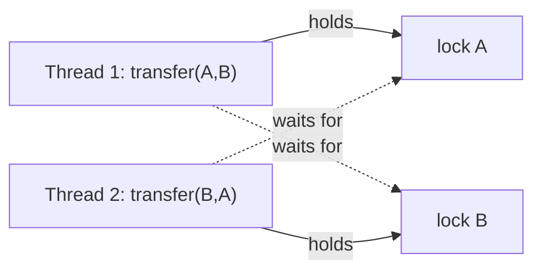

# Coordination Anti-Patterns — Middle

> **Category:** [Concurrency Anti-Patterns](../README.md) → **Coordination** — *two or more lock holders that fail to make progress together.*
> **Covers (collectively):** Lock Ordering Inconsistency → Deadlock · Holding a Lock During I/O · Wrong Lock Granularity

---

## Table of Contents

1. [Introduction](#introduction)
2. [Prerequisites](#prerequisites)
3. [The Real Question: When Does This Creep In?](#the-real-question-when-does-this-creep-in)
4. [Lock Ordering Inconsistency — Establishing a Global Order](#lock-ordering-inconsistency--establishing-a-global-order)
5. [Holding a Lock During I/O — Copy Out, Then Call](#holding-a-lock-during-io--copy-out-then-call)
6. [Wrong Lock Granularity — Right-Sizing the Critical Section](#wrong-lock-granularity--right-sizing-the-critical-section)
7. [Detection: Deadlock and Contention Tooling](#detection-deadlock-and-contention-tooling)
8. [Common Mistakes](#common-mistakes)
9. [Test Yourself](#test-yourself)
10. [Cheat Sheet](#cheat-sheet)
11. [Summary](#summary)
12. [Further Reading](#further-reading)
13. [Related Topics](#related-topics)

---

## Introduction

> Focus: **When does this creep in?** and **What do I do instead?**

At the junior level you learned to *recognize* the coordination failures: a deadlock that hangs two threads forever, a request that gets slow because everyone is queued behind one lock, a `synchronized` block that throttles a whole service. The middle-level skill is different. These three anti-patterns are not bugs you write on purpose — they **emerge from individually reasonable decisions** made by people who never looked at each other's code.

Two engineers each grab two locks. Neither agrees on the order, because they never spoke. A function already holds a lock and "just needs to read one more thing from the database." A class is slow under contention, so someone shards its lock into twenty — and re-introduces a deadlock the single lock could never have.

This file is about the **forces** that produce coordination failures and the **practical countermoves**: a documented global lock order, the copy-out-then-I/O pattern, and right-sizing critical sections — *with the trap each countermove carries.* Fine-grained locking is not free; read-write locks are not free; tryLock-with-timeout converts a hang into a different problem you must still handle.

---

## Prerequisites

- **Required:** Comfortable with [`junior.md`](junior.md) — you can spot a deadlock and a coarse lock by reading code.
- **Required:** You have shipped code using a `Mutex`/`sync.Mutex`/`synchronized` and understand mutual exclusion.
- **Helpful:** You know the difference between a thread blocking (parked, no CPU) and spinning (burning CPU) — see [Busy Waiting](../03-shared-state/middle.md).
- **Helpful:** Familiarity with your platform's concurrency story: Go goroutines + `sync`, Java threads + `java.util.concurrent`, and the Python GIL.
- **Helpful:** Awareness that the *root cause* under all of this is shared mutable state — see [Shared State](../03-shared-state/middle.md).

---

## The Real Question: When Does This Creep In?

Coordination failures have predictable triggers. Name the moment and you can intervene before production hangs:

| Trigger | What happens | Which anti-pattern |
|---|---|---|
| **Two features each lock two things** | Engineer A locks `(account, ledger)`; engineer B locks `(ledger, account)` | Lock Ordering → Deadlock |
| **"While I hold the lock, just read one more thing"** | A DB query / RPC happens inside the critical section; latency multiplied by contention | Holding Lock During I/O |
| **"It's slow — shard the lock"** | One mutex becomes per-bucket mutexes, but the order across buckets is now unconstrained | Wrong Granularity → *new* Deadlock |
| **"Just wrap the whole method in `synchronized`"** | A single coarse lock serializes work that didn't need serializing | Wrong Granularity (too coarse) |
| **"Reads dominate, use a RWLock"** | RWLock added for read concurrency, but writes starve or the lock costs more than it saves | Wrong Granularity (wrong tool) |
| **Callback under lock** | A locked method invokes a user-supplied callback that locks back | Lock Ordering → Deadlock |

The common thread: **the cheap local move (grab another lock, do the call here, shard the lock) ignores the global invariant that keeps the system live.** The middle engineer pays the small cost of making that invariant explicit.

---

## Lock Ordering Inconsistency — Establishing a Global Order

### How it creeps in

Deadlock needs four conditions to hold simultaneously (Coffman conditions): **mutual exclusion**, **hold-and-wait**, **no preemption**, and **circular wait**. You cannot easily remove the first three — locks are exclusive, holding-while-waiting is what nested locks do, and you can't yank a lock back. So the practical cure attacks the fourth: **break the cycle by imposing a total order on locks.** If every thread always acquires locks in the same order, a cycle is impossible.

The classic failure is a money transfer:

```go
// BUG: lock order depends on the *arguments*, so two concurrent transfers
// in opposite directions deadlock. transfer(A,B) holds A waits B;
// transfer(B,A) holds B waits A.
func transfer(from, to *Account, amount int) {
    from.mu.Lock()
    defer from.mu.Unlock()
    to.mu.Lock()           // <- ordering is data-dependent: latent deadlock
    defer to.mu.Unlock()
    from.balance -= amount
    to.balance += amount
}
```



That cycle — T1 holds A wants B, T2 holds B wants A — is the deadlock.

### What to do instead

**1. Impose a global order, derived from a stable key.** Pick any consistent, total ordering of the lockable objects (a unique ID, a memory address, a name) and always acquire in that order regardless of the call's direction.

```go
// FIX: order locks by a stable ID, so every caller agrees on the sequence.
func transfer(from, to *Account, amount int) {
    first, second := from, to
    if from.id > to.id {            // canonical order: lower id first
        first, second = to, from
    }
    first.mu.Lock()
    defer first.mu.Unlock()
    second.mu.Lock()
    defer second.mu.Unlock()
    from.balance -= amount
    to.balance += amount
}
// Edge case: from.id == to.id (transfer to self) — handle before locking
// to avoid locking the same mutex twice (a self-deadlock with non-reentrant locks).
```

**2. Document the order as a hierarchy.** When locks span subsystems, write the rule down and enforce it in review: *"Always acquire `cacheLock` before `dbLock`; never the reverse."* Java's Guava ships a runtime checker for exactly this:

```java
// Java: CycleDetectingLockFactory enforces a declared lock hierarchy at runtime.
// In tests it throws if any thread acquires locks out of the declared order.
CycleDetectingLockFactory factory =
    CycleDetectingLockFactory.newInstance(CycleDetectingLockFactory.Policies.THROW);
ReentrantLock cacheLock = factory.newReentrantLock("cache");  // rank by name/order
ReentrantLock dbLock    = factory.newReentrantLock("db");
// Acquiring dbLock then cacheLock anywhere now surfaces a PotentialDeadlockException.
```

**3. Hold only one lock at a time.** The simplest cure: if you never nest locks, you can never form a cycle. Restructure so each lock guards an independent step, releasing one before taking the next (accepting that the composite operation is no longer atomic — often fine).

**4. `tryLock` with timeout — escape, don't hang.** When a global order is impractical (e.g., locks chosen dynamically), acquire with a timeout: if the second lock doesn't come, back off, release everything, and retry. This converts a *permanent* deadlock into a *transient* livelock you can bound.

```java
// Java: tryLock with timeout + total back-off. Avoids deadlock without a global order.
boolean transfer(Account a, Account b, long amt) throws InterruptedException {
    while (true) {
        if (a.lock.tryLock(50, TimeUnit.MILLISECONDS)) {
            try {
                if (b.lock.tryLock(50, TimeUnit.MILLISECONDS)) {
                    try {
                        a.balance -= amt; b.balance += amt;
                        return true;
                    } finally { b.lock.unlock(); }
                }
            } finally { a.lock.unlock(); }   // release a if we couldn't get b
        }
        Thread.sleep(ThreadLocalRandom.current().nextInt(1, 10)); // jitter avoids livelock lock-step
    }
}
```

> **TRAP:** `tryLock` is a fallback, not a default. It adds retry loops, jitter tuning, and the risk of *livelock* (both threads politely backing off forever in lock-step). Prefer a documented global order; reach for `tryLock` only when the order genuinely cannot be fixed.

> **Countermove in review:** when a PR acquires a second lock, ask *"is the acquisition order the same on every code path?"* If the order depends on arguments or runtime state, demand a canonical ordering or a `tryLock` escape.

---

## Holding a Lock During I/O — Copy Out, Then Call

### How it creeps in

A method takes a lock to read some state, and then — because the data is *right there* and the lock is *already held* — it does the slow thing inside the critical section: a network call, a DB query, a disk write, a log flush, even a callback into unknown code. It works in dev where you are the only caller. In production, the lock is held for the entire I/O latency, and **every other caller queues behind it.** Throughput collapses to `1 / (I/O latency)`, no matter how many cores you have.

```go
// BUG: the HTTP call runs while the lock is held. Every concurrent caller
// serializes behind the slowest network round-trip.
func (c *Cache) Refresh(key string) error {
    c.mu.Lock()
    defer c.mu.Unlock()
    url := c.endpoints[key]            // fast: a map read
    resp, err := http.Get(url)         // SLOW: network I/O under the lock (~100ms)
    if err != nil {
        return err
    }
    c.values[key] = readBody(resp)     // fast: a map write
    return nil
}
```

The lock protects two *fast* map accesses. Wrapping the *slow* network call in it is pure accident of code shape.

### What to do instead — copy out, release, do I/O, re-lock

Split the critical section around the I/O. Hold the lock only to read inputs and to commit results:

```go
// FIX: lock → copy out → UNLOCK → do I/O → lock → commit.
func (c *Cache) Refresh(key string) error {
    c.mu.Lock()
    url := c.endpoints[key]            // copy out what I/O needs
    c.mu.Unlock()                      // release BEFORE the slow call

    resp, err := http.Get(url)         // no lock held here
    if err != nil {
        return err
    }
    body := readBody(resp)

    c.mu.Lock()                        // re-acquire only to commit
    c.values[key] = body
    c.mu.Unlock()
    return nil
}
```

Three rules make this safe:

1. **Never call out to unknown code under a lock.** A callback, an interface method, an event handler, or an RPC may block, may run for seconds, or may try to acquire *your* lock (re-entrancy deadlock) or *another* lock (ordering deadlock). Copy the data out and invoke the callback unlocked.
2. **Re-validate after re-acquiring.** Between unlock and re-lock the world can change (another thread refreshed the same key). Decide whether last-writer-wins is acceptable, or use a version/CAS check, or `sync.Once`/single-flight to dedupe concurrent refreshes of the same key.
3. **Shrink the critical section to the smallest consistent unit.** Everything that doesn't *need* the lock — formatting, parsing, allocation, logging — moves outside it.

```java
// Java: identical principle. Snapshot under lock, do work outside, commit under lock.
void notifyObservers(Event e) {
    List<Observer> snapshot;
    synchronized (this) {
        snapshot = new ArrayList<>(observers);   // copy the list under lock
    }
    for (Observer o : snapshot) {
        o.onEvent(e);   // call OUTSIDE the lock: observers may be slow or lock back
    }
}
```

> **TRAP:** copy-out-then-I/O trades atomicity for liveness. The operation is no longer a single atomic transaction — there is a window where state is stale. That is almost always the right trade for I/O, but you must *consciously* handle the stale window (re-validate, dedupe, or accept last-writer-wins), not pretend it doesn't exist.

---

## Wrong Lock Granularity — Right-Sizing the Critical Section

Granularity is a spectrum, and **both ends are anti-patterns.**

- **Too coarse:** one lock guards far more than one consistent unit of state. Unrelated operations serialize; throughput is capped at one core regardless of hardware.
- **Too fine:** so many small locks that the locking overhead (acquire/release, cache-line bouncing, bookkeeping) costs more than the work being protected — and you've multiplied the surface for ordering deadlocks.

### How it creeps in

The coarse end is the "just wrap the method in `synchronized`" reflex — easy, correct, and quietly serial. The fine end is the over-correction: someone profiles a hot coarse lock, shards it into per-entry locks, and ships a system that now deadlocks (because there's no order across shards) or spends more time managing locks than doing work.

```java
// TOO COARSE: one monitor guards an entire map. Every get/put serializes globally,
// even for unrelated keys.
class Registry {
    private final Map<String, Conn> conns = new HashMap<>();
    synchronized Conn get(String k) { return conns.get(k); }     // serializes ALL reads
    synchronized void put(String k, Conn c) { conns.put(k, c); } // and all writes
}
```

### What to do instead

**1. Size the lock to the smallest *consistent* unit of state.** A lock should protect exactly the data that must change together to preserve an invariant — no more, no less. If two pieces of state never participate in the same invariant, they want separate locks (or no shared lock at all).

**2. Lock striping — `N` locks instead of one or one-per-item.** Hash the key to a fixed number of stripes. This is the sweet spot between a single global lock and a lock per entry: bounded memory, real concurrency, and (critically) a *fixed* set of locks you can still order.

```java
// Lock striping: fixed number of stripes — concurrency without unbounded locks.
class StripedMap<V> {
    private static final int STRIPES = 16;
    private final Object[] locks = new Object[STRIPES];
    private final Map<String, V> map = new HashMap<>();
    { for (int i = 0; i < STRIPES; i++) locks[i] = new Object(); }

    private Object lockFor(String key) {
        return locks[(key.hashCode() & 0x7fffffff) % STRIPES];
    }
    V get(String key) {
        synchronized (lockFor(key)) { return map.get(key); }  // only one stripe contends
    }
}
// In real Java code, reach for ConcurrentHashMap first — it does striping for you.
```

**3. Use the built-in concurrent collection before hand-rolling.** `java.util.concurrent.ConcurrentHashMap` is internally striped and battle-tested; in Go a `sync.Map` (for read-mostly, disjoint-key workloads) or a sharded map; do not reinvent these.

**4. Read-write locks — *measure first*.** A `RWLock` lets many readers proceed concurrently while writers get exclusivity. It helps **only** when reads vastly outnumber writes *and* read critical sections are long enough to amortize the lock's higher overhead.

```go
// RWLock: many concurrent readers, exclusive writers. Worth it ONLY when reads
// dominate and the critical section is non-trivial.
type Config struct {
    mu   sync.RWMutex
    data map[string]string
}
func (c *Config) Get(k string) string {
    c.mu.RLock()                 // shared: many readers at once
    defer c.mu.RUnlock()
    return c.data[k]
}
func (c *Config) Set(k, v string) {
    c.mu.Lock()                  // exclusive: blocks all readers
    defer c.mu.Unlock()
    c.data[k] = v
}
```

> **TRAP — RWLock is not free:**
> - A `RWMutex` has **higher acquire/release overhead** than a plain `Mutex`. For short critical sections and balanced read/write ratios it is *slower*, not faster.
> - Naïve RWLocks can **starve writers** (a steady stream of readers never lets a writer in) — or, with writer-preference, starve readers.
> - Go's `sync.RWMutex` is **not re-entrant**: an `RLock` holder that calls a method which also takes `RLock` can deadlock if a writer is queued between them.
> - **Default to a plain `Mutex`.** Switch to `RWMutex` only after a profile shows read contention is your bottleneck.

> **TRAP — fine-grained locking re-creates deadlocks:** the moment you go from one lock to many, you re-introduce *lock ordering* as a concern. Every multi-stripe / multi-shard operation must acquire its locks in a consistent order, or you've cured contention by adding deadlock. Granularity and ordering are coupled problems.

---

## Detection: Deadlock and Contention Tooling

You rarely *reason* your way to these bugs — you *observe* them. Know the tools per platform.

### Deadlock detection

| Platform | Tool / signal | What it shows |
|---|---|---|
| **Go** | Runtime **`fatal error: all goroutines are asleep - deadlock!`** | Fires only when *every* goroutine is blocked (whole-program deadlock). Partial deadlocks need a goroutine dump. |
| **Go** | `SIGQUIT` goroutine dump (`kill -QUIT <pid>`) or `GOTRACEBACK=all` | Stack of every goroutine; look for many parked on `sync.(*Mutex).Lock`. |
| **Go** | **`go test -race`** / `-race` build | Detects data races (not deadlocks directly), but races and ordering bugs cluster together. |
| **Java** | `jstack <pid>` or `kill -3` thread dump | Prints **"Found one Java-level deadlock"** with the exact cycle and the two threads/monitors involved. |
| **Java** | `ThreadMXBean.findDeadlockedThreads()` | Programmatic deadlock check — wire into a health endpoint. |
| **Java** | JFR / VisualVM / `jcmd Thread.print` | Live monitor contention and blocked-thread inspection. |
| **Python** | `faulthandler.dump_traceback_later()` / `py-spy dump` | Dumps stacks of a hung process; `py-spy` works without modifying the program. |

```bash
# Java: dump threads of a running JVM; grep the deadlock report.
jstack <pid> | grep -A 30 "Found one Java-level deadlock"

# Go: trigger a full goroutine dump on a hung process.
kill -QUIT <pid>          # writes all goroutine stacks to stderr
```

### Contention detection (the lock that's held too long / too hot)

| Platform | Tool | What it reveals |
|---|---|---|
| **Go** | **`runtime.SetMutexProfileFraction`** + `go tool pprof` mutex profile | Where goroutines block on contended mutexes — points straight at coarse locks and locks-held-during-I/O. |
| **Go** | **block profile** (`runtime.SetBlockProfileRate`) | Time goroutines spend blocked (on locks, channels, I/O). |
| **Java** | **JFR** `jdk.JavaMonitorEnter` events, async-profiler `-e lock` | Lock contention hot spots and how long monitors are held. |
| **Java** | `jstack` repeated sampling | Same thread repeatedly `BLOCKED` on the same monitor = a hot/coarse lock. |
| **Python** | `cProfile` + `py-spy` (note GIL caveat below) | Where wall-time goes; GIL contention shows as threads waiting to run. |

```go
// Go: enable the mutex profile, then collect it.
import "runtime"
func init() { runtime.SetMutexProfileFraction(5) } // sample 1/5 contention events
// go tool pprof http://localhost:6060/debug/pprof/mutex
```

### Python GIL note

CPython's **Global Interpreter Lock** serializes bytecode execution: only one thread runs Python at a time. This has two consequences for *this* category:

- **It does not save you from deadlock.** Two `threading.Lock`s acquired in inconsistent order deadlock exactly as in Java/Go — the GIL is released while a thread *waits* on a lock.
- **It changes the granularity calculus.** For CPU-bound work, fine-grained locking buys little parallelism (the GIL already serializes you); the real fix is `multiprocessing` or a native extension that releases the GIL. For **I/O-bound** work the GIL is released during the I/O, so holding a `threading.Lock` across that I/O *still* serializes your threads needlessly — the copy-out-then-I/O pattern applies unchanged. (Python 3.13+ offers an experimental free-threaded build that removes the GIL; the deadlock rules are unaffected by it.)

---

## Common Mistakes

1. **Acquiring two locks in argument-dependent order.** `transfer(a, b)` vs `transfer(b, a)` is the textbook deadlock. Always derive a canonical order from a stable key.
2. **Calling unknown code under a lock.** Callbacks, observers, interface methods, RPCs — any of them can block forever or lock back. Copy out and invoke unlocked.
3. **Treating `tryLock` as the default cure.** It hides the ordering problem behind retry loops and risks livelock. Fix the order first; use `tryLock` only when order is genuinely undecidable.
4. **Sharding a lock without re-imposing order.** Going fine-grained to fix contention while forgetting that `N` locks now need a consistent acquisition order — trading contention for deadlock.
5. **Reaching for `RWMutex` by reflex.** It's slower than a plain mutex for short or write-heavy sections and can starve writers. Default to `Mutex`; switch only on profiler evidence.
6. **Re-acquiring without re-validating.** After copy-out-then-I/O you re-lock to commit, but the state may have changed. Decide last-writer-wins vs CAS vs single-flight explicitly.
7. **Optimizing granularity by guess.** Splitting or coarsening locks without a mutex/contention profile usually moves the bottleneck rather than removing it. Measure, then size.
8. **Assuming the GIL makes Python deadlock-proof.** It does not — inconsistent lock order deadlocks in Python just like everywhere else.

---

## Test Yourself

1. A `transfer(from, to)` function locks `from` then `to`. Two threads call it with swapped arguments and the program hangs. What are the four Coffman conditions, which one does the standard fix attack, and what is the fix?
2. A cache `Refresh` method holds a mutex across an `http.Get`. Throughput is terrible under load even though the maps are tiny. Explain why, and give the safer code shape.
3. Why is `tryLock`-with-timeout a *fallback* rather than the preferred cure for lock-ordering deadlock? What new failure mode does it introduce, and how do you mitigate it?
4. You shard a single hot map lock into 16 stripes and throughput improves — but now you occasionally deadlock on operations that touch two keys. What did sharding re-introduce, and how do you fix it?
5. Reads outnumber writes 100:1 on a small in-memory map with sub-microsecond accesses. A teammate proposes a `RWMutex`. Is that obviously right? Name two reasons it might be *slower* or *unsafe*.
6. Your Go service is hung. Which single command gives you every goroutine's stack, and what specific frame are you scanning for to confirm a lock deadlock?
7. Does CPython's GIL prevent deadlock from two inconsistently-ordered `threading.Lock`s? Justify.

---

## Cheat Sheet

| Anti-pattern | Creeps in when… | Countermove | Trap to watch |
|---|---|---|---|
| **Lock Ordering → Deadlock** | Two code paths lock two things in different orders | **Global lock order** from a stable key; hold one lock at a time; `tryLock`+timeout as fallback | `tryLock` risks **livelock** — add jitter; it's a fallback, not a default |
| **Holding Lock During I/O** | "While I hold the lock, just call the DB/RPC" | **Copy out → unlock → do I/O → re-lock to commit**; never call unknown code under a lock | Trades atomicity for liveness — **re-validate** the stale window |
| **Wrong Granularity (coarse)** | "Just `synchronized` the whole method" | Size lock to smallest **consistent** unit; **lock striping** / `ConcurrentHashMap` | — |
| **Wrong Granularity (fine)** | "Shard the lock to fix contention" | Use a **fixed** set of stripes you can still order | Re-creates **ordering deadlock** across stripes |
| **Wrong Tool (RWLock)** | "Reads dominate, use RWLock" | Use it only with a profile showing read contention | RWLock has **higher overhead**, can **starve writers**, is **non-reentrant** (Go) |

**Three golden rules:**
- *Make the lock-acquisition order explicit and identical on every path — circular wait is the only Coffman condition you can cheaply kill.*
- *Never do I/O or call unknown code while holding a lock — copy out, release, then call.*
- *Default to one plain `Mutex`; change granularity or lock type only after a contention profile, and remember finer locks need an order.*

---

## Summary

- Coordination failures **emerge from independently reasonable decisions** by people who never compared notes; the middle skill is making the shared invariant (lock order, critical-section size) explicit.
- **Lock Ordering → Deadlock:** of the four Coffman conditions, attack **circular wait** with a **documented global lock order** derived from a stable key. Hold one lock at a time where possible; use `tryLock`+timeout+jitter only as a fallback (it risks livelock).
- **Holding a Lock During I/O:** apply **copy-out-then-I/O** — lock to read inputs, unlock, do the slow call, re-lock to commit. Never invoke callbacks/RPCs under a lock. Re-validate the stale window.
- **Wrong Lock Granularity:** size locks to the **smallest consistent unit**; use **lock striping** / built-in concurrent collections between the extremes. **RWLock is not free** (overhead, writer starvation, non-reentrancy), and **fine-grained locking re-introduces ordering deadlocks** — granularity and ordering are coupled.
- **Detect, don't guess:** `jstack`/`kill -QUIT` for deadlock cycles; mutex/block profiles and JFR lock events for contention. The **GIL** does not prevent Python deadlocks and changes only the granularity calculus.
- Next: [`senior.md`](senior.md) — debugging a production deadlock from a thread dump, and refactoring a hot contended path under load.

---

## Further Reading

- **Java Concurrency in Practice** — Brian Goetz et al. (2006) — Ch. 10 ("Avoiding Liveness Hazards") covers lock ordering, open calls, and `tryLock`; Ch. 11 covers granularity and lock striping. Canonical.
- **The Go Memory Model** — [go.dev/ref/mem](https://go.dev/ref/mem) — what `sync.Mutex` and channels actually guarantee.
- **The Go Blog — "Diagnostics"** & `runtime/pprof` docs — mutex and block profiling in practice.
- **Effective Concurrency** — Herb Sutter — the columns on lock hierarchies and "prefer to do the minimum work under a lock."
- **Operating System Concepts** — Silberschatz, Galvin, Gagne — the Coffman conditions and deadlock-avoidance theory.

---

## Related Topics

- [Synchronization Misuse](../01-synchronization/middle.md) — the sibling category: locks and memory primitives applied wrongly.
- [Shared State](../03-shared-state/middle.md) — the root cause beneath all coordination failures, plus Busy Waiting (the spin-loop alternative to blocking).
- [Async Anti-Patterns](../../04-async/README.md) — the event-loop sibling chapter; deadlocks have async analogues there.
- [Bad Structure → middle](../../01-development/01-bad-structure/middle.md) — the same "creeps in one commit at a time" framing for non-concurrent code.
- Concurrency Roadmap — the positive patterns and primitives behind these cures.

---

## Check your understanding

1. Explain Coordination Anti-Patterns — Middle Level in your own words and name the problem it solves.
2. How would you apply the ideas around Table of Contents, Introduction, Prerequisites in a realistic engineering change?
3. What failure mode or misuse should you look for, and what evidence would reveal it?
4. Which local design trade-off would make you choose or reject Coordination Anti-Patterns — Middle Level in an existing codebase?
5. What observable result would convince you that the approach improved the system?
