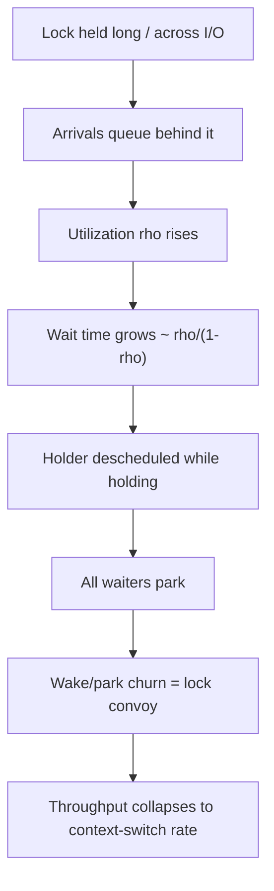

# Coordination Anti-Patterns — Professional

> **Category:** [Concurrency Anti-Patterns](../README.md) → **Coordination** — *two or more lock holders fail to make progress together.*
> **Covers (collectively):** Lock Ordering Inconsistency → Deadlock · Holding a Lock During I/O · Wrong Lock Granularity

---

## Table of Contents

1. [Introduction](#introduction)
2. [Prerequisites](#prerequisites)
3. [Measure First: The Contention Tooling Map](#measure-first-the-contention-tooling-map)
4. [The Physics of a Lock — Amdahl, Queueing, and the Serial Section](#the-physics-of-a-lock--amdahl-queueing-and-the-serial-section)
5. [Mutex Internals — What "Take the Lock" Actually Costs](#mutex-internals--what-take-the-lock-actually-costs)
6. [Holding a Lock During I/O — Every Waiter Pays the Full RTT](#holding-a-lock-during-io--every-waiter-pays-the-full-rtt)
7. [Wrong Lock Granularity — Coarse, Striped, and the False-Sharing Trap](#wrong-lock-granularity--coarse-striped-and-the-false-sharing-trap)
8. [Lock Ordering Inconsistency → Deadlock — Zero Throughput](#lock-ordering-inconsistency--deadlock--zero-throughput)
9. [RWLock — Reader/Writer Cost and Starvation](#rwlock--readerwriter-cost-and-starvation)
10. [A Combined Worked Example](#a-combined-worked-example)
11. [Common Mistakes](#common-mistakes)
12. [Test Yourself](#test-yourself)
13. [Cheat Sheet](#cheat-sheet)
14. [Summary](#summary)
15. [Further Reading](#further-reading)
16. [Related Topics](#related-topics)

---

## Introduction

> Focus: **what contention costs the machine** — the serial section under Amdahl's law, the queue that forms behind a held lock, the convoy that forms behind a slow holder — and **how you measure that cost** with mutex/block profiles before you change a single lock.

`junior.md` taught you to recognize a deadlock and a lock held too long. `middle.md` taught you the safer patterns (consistent lock order, copy-then-I/O). `senior.md` taught you to debug a deadlock in production and refactor a contended path. This file goes one layer down — to the **runtime, the scheduler, and the hardware**.

The professional insight is that a lock is not a free fence around your data. It is a **serialization point**, and serialization has a price that compounds non-linearly with load:

- A lock held for *t* nanoseconds is not "t nanoseconds slow." Under contention it is a **queue**, and queueing theory says wait time explodes as utilization of the serial section approaches 1.
- A lock held across an I/O call doesn't cost one round-trip — it costs **one round-trip multiplied by the number of threads waiting behind it**.
- A deadlock doesn't cost latency. It costs *everything*: the involved threads make **zero** forward progress, forever, and usually drag the rest of the system down with them.

Two disciplines define this level:

1. **Never change lock granularity from intuition.** Coarse locks are perfectly fine at low contention — and fine-grained locking adds CPU, memory, and *bug surface*. You earn the right to split a lock only after a mutex profile shows it is the bottleneck.
2. **Know what the runtime does under the lock.** A JVM mutex inflates from biased → thin → fat. A Go mutex spins briefly, then parks on a futex. The cost of "take the lock" is wildly different in the uncontended vs contended case, and your fix depends on which one you actually have.

> **The mental model:** a lock is a contract with the **scheduler**. Hold it briefly and uncontended, and the hardware keeps it almost free. Hold it long, hold it during I/O, or take two in inconsistent order, and you hand the scheduler a problem it solves by *stalling your threads*.

---

## Prerequisites

- **Required:** Fluent with [`senior.md`](senior.md) — you can establish a global lock order and refactor a lock-across-I/O under production constraints.
- **Required:** Working mental model of OS threads vs goroutines, context switches, futexes, and how a blocked thread is descheduled.
- **Required:** You can read a flame graph, a Go mutex/block profile, and a JFR/`jstack` thread dump and tell a held lock from a waiting one.
- **Helpful:** Queueing-theory intuition (utilization, the *(1/(1−ρ))* wait blow-up) and Amdahl's law.
- **Helpful:** the concurrency-patterns, profiling-techniques, and big-o-analysis skills for vocabulary, plus the distributed-locking skill once coordination crosses process boundaries.

---

## Measure First: The Contention Tooling Map

Before any claim about a lock, reach for the instrument that proves contention exists. Keep this close.

| Concern | Go | Java / JVM | Linux / general |
|---|---|---|---|
| **Lock contention (who waits, how long)** | `runtime.SetMutexProfileFraction` → `pprof` *mutex* profile | async-profiler `-e lock`; JFR `jdk.JavaMonitorEnter` events | `perf lock record/report` |
| **Blocking (off-CPU: channels, I/O, mutex park)** | `runtime.SetBlockProfileRate` → `pprof` *block* profile | JFR thread-park / monitor-wait events | `perf sched`, off-CPU flame graph |
| **Deadlock detection** | `go test -race` (lock-order reports), `GODEBUG`, panic on all-goroutines-asleep | `jstack` / thread dump ("Found one Java-level deadlock"), JMC | `gdb` thread backtrace, `pstack` |
| **Data race (the cousin bug)** | `go build -race` / `go test -race` | ThreadSanitizer (via JVM TI tools), FindBugs/SpotBugs | `valgrind --tool=helgrind` |
| **Lock hold/wait timeline** | `go tool trace` (sync-blocking profile, goroutine analysis) | JFR + JMC timeline; `-XX:+PrintConcurrentLocks` in dumps | `perf sched timehist` |
| **Per-lock fairness / convoy** | trace shows serialized goroutine wakeups | async-profiler lock flame graph | `perf lock` contention histogram |
| **Microbenchmark** | `testing.B` with `b.RunParallel` + `benchstat` | JMH (`@Benchmark`, multiple threads) | — |

```bash
# Go: turn on mutex + block profiling, then pull the profile from a running service
#   in code: runtime.SetMutexProfileFraction(5); runtime.SetBlockProfileRate(10000)
go tool pprof  http://localhost:6060/debug/pprof/mutex     # contention: cum wait time per lock
go tool pprof  http://localhost:6060/debug/pprof/block     # off-CPU: where goroutines park
go test -race  ./...                                       # data races AND lock-order violations
go test -run=NONE -bench=BenchmarkCache -cpu=1,4,16 -benchmem ./cache | tee /tmp/bench.txt

# Java: lock contention without a custom agent
java -XX:+UnlockDiagnosticVMOptions -agentpath:/path/libasyncProfiler.so=start,event=lock,file=lock.html -jar app.jar
jstack <pid> | sed -n '/Found one Java-level deadlock/,/^$/p'   # deadlock section of a thread dump

# Linux: kernel-level lock contention across the whole process
perf lock record -- ./app && perf lock report --sort=wait_total
```

> **Discipline:** "this lock is hot" is a hypothesis until a *mutex profile* shows cumulative wait time concentrated on it. The single most common professional mistake in this category is splitting a lock that the profile would have shown was never contended.

---

## The Physics of a Lock — Amdahl, Queueing, and the Serial Section

A lock turns a region of code into a **serial section**: only one thread executes it at a time. Two laws govern what that costs.

### 1. Amdahl's law — the serial section caps your scaling

If a fraction *s* of total work must run serially (under a lock), the best possible speedup on *N* cores is bounded by:

```
speedup(N) = 1 / ( s + (1 − s)/N )
```

As *N* → ∞, speedup → **1/s**. A path that is 5% serialized (one shared lock around a small section) caps at **20×** no matter how many cores you throw at it; a 1% serial section caps at 100×. The lock you thought was "tiny" defines the ceiling of the whole system. This is why granularity matters: shrinking the serial section is the *only* way to raise the ceiling.

### 2. Queueing — contention turns latency into a queue

Amdahl assumes no waiting. Reality is worse: when threads arrive at a lock faster than it can serve them, they **queue**. Model the lock as an M/M/1 server with utilization ρ = (arrival rate × hold time). Expected wait time grows as:

```
W ∝ ρ / (1 − ρ)
```

The consequence is brutal and non-intuitive: at ρ = 0.5, average wait ≈ the service time; at ρ = 0.9, it's **9×**; at ρ = 0.99 it's **99×**. **Latency doesn't degrade linearly with load — it degrades hyperbolically as the lock approaches saturation.** A lock that's "fine" at 70% utilization in staging falls off a cliff at 95% in production. The hold time *t* shows up twice: it inflates ρ (likelihood of queueing) *and* it's the service time each waiter pays.

### 3. Lock convoy — a slow holder gathers a crowd

A **convoy** forms when a thread holding a lock is descheduled (preempted, page fault, GC pause, or — fatally — blocked on I/O). Every other thread piles up waiting. When the holder finally runs and releases, it often immediately re-acquires (it's hot in cache, scheduler-favored), so the woken waiters get the lock for a moment and then convoy again. Throughput collapses to the speed of context-switching, and the system spends its time parking and waking threads rather than doing work.



> **The takeaway:** the three coordination anti-patterns in this file are all attacks on the serial section. Holding a lock during I/O *lengthens* it (bigger *t*, deeper queue, guaranteed convoy). Wrong granularity *mis-sizes* it (too coarse = needless serial section; too fine = lock overhead dominates). Deadlock is the limit case — the serial section never ends, ρ → ∞, throughput → 0.

---

## Mutex Internals — What "Take the Lock" Actually Costs

The cost of `lock()` differs by orders of magnitude between the uncontended and contended case. You cannot reason about a fix without knowing which path you're on.

### Go — spin-then-park on a futex

Go's `sync.Mutex` is a hybrid. The fast path is a single atomic compare-and-swap on a word — a few nanoseconds, no syscall, when uncontended. Under contention it **spins** a bounded number of times (cheap if the holder releases almost immediately, betting on a short critical section), and only then **parks** the goroutine via the runtime's semaphore (ultimately a futex-style OS wait). Go's mutex also has a *starvation mode*: if a goroutine waits longer than 1 ms, the mutex switches from "barging" (throughput-favoring: a newly arriving goroutine can grab the lock ahead of the queue) to FIFO hand-off (fairness-favoring) to bound tail latency.

```go
// The uncontended fast path is ~one atomic CAS. The contended path is a
// spin, then a park (semaphore/futex). The block profile shows the parks.
var mu sync.Mutex
mu.Lock()       // fast: CAS. slow: spin -> park -> woken in FIFO under starvation
defer mu.Unlock()
```

The professional implication: **a short critical section under moderate contention may never park** — spinning wins, and a `pprof` mutex profile shows little. A *long* critical section guarantees parking, syscalls, and convoy. The cure for the latter is to shorten the section, not to "tune the mutex."

### Java — biased → thin → fat lock inflation

The JVM historically optimized `synchronized` through escalating representations:

- **Biased locking** — the object's mark word is biased toward the first thread that locked it; re-entry by that thread is nearly free (no atomic). *Disabled by default since JDK 15 and removed in JDK 21*, because modern atomics are cheap and bias bookkeeping hurt under real contention.
- **Thin / lightweight lock** — uncontended, the JVM uses a CAS on the mark word pointing at a lock record on the locking thread's stack. Cheap, no OS involvement.
- **Fat / heavyweight lock** — on contention the lock **inflates** into a full OS monitor (an `ObjectMonitor` backed by a kernel mutex/condition). Now you pay syscalls, parking, and a wait queue.

```java
// Uncontended: CAS on the mark word (thin lock). Contended: inflates to a
// fat monitor with an OS wait queue. JFR jdk.JavaMonitorEnter shows the
// inflated, contended enters; async-profiler -e lock attributes wait time.
synchronized (lock) {  // thin -> fat under contention
    counter++;
}
```

`java.util.concurrent.locks.ReentrantLock` is built on `AbstractQueuedSynchronizer` (an explicit CLH-style wait queue + `LockSupport.park`), and lets you choose `new ReentrantLock(true)` for FIFO fairness — at a throughput cost (see below).

### Python — the GIL is one big lock

CPython's Global Interpreter Lock means only one thread executes Python bytecode at a time. For **CPU-bound** Python, threads don't parallelize — the GIL *is* a 100% serial section, so adding threads adds context-switch overhead with no speedup (use `multiprocessing` or native extensions that release the GIL). For **I/O-bound** Python, the GIL is released around blocking syscalls, so threads overlap I/O usefully. The free-threaded build (PEP 703, experimental in 3.13+) removes the GIL — at which point ordinary lock-ordering and granularity anti-patterns suddenly *matter* in Python code that was previously serialized by the GIL.

> **Diagnose it:** Go — block profile shows parks (real contention) vs none (spinning absorbs it). Java — JFR `jdk.JavaMonitorEnter` / async-profiler `-e lock` shows *inflated* monitor waits; uncontended thin locks won't appear. The instrument tells you whether you have a hold-time problem (shorten the section) or an arrival-rate problem (reduce contention / split the lock).

---

## Holding a Lock During I/O — Every Waiter Pays the Full RTT

This is the most expensive coordination mistake by latency, because it stacks every multiplier in this file at once. A network call or disk read takes **milliseconds** — a million times longer than the microsecond a CPU critical section should take. Holding a lock across it means:

1. The serial section *t* explodes from microseconds to milliseconds (Amdahl ceiling craters).
2. ρ rockets toward 1, so the queue blows up (queueing law).
3. The holder is **descheduled** waiting on the syscall — a guaranteed convoy.
4. **Every waiting thread blocks for the full round-trip**, not just the holder.

### The anti-pattern

```go
// ANTI-PATTERN: the HTTP call runs *inside* the critical section.
// While one goroutine waits ~50ms on the network, EVERY other goroutine
// that wants this cache is parked behind it. Throughput = 1 / RTT.
func (c *Cache) Get(key string) (Val, error) {
    c.mu.Lock()
    defer c.mu.Unlock()
    if v, ok := c.m[key]; ok {
        return v, nil
    }
    v, err := c.client.Fetch(key) // <-- network I/O UNDER the lock (50ms)
    if err != nil {
        return Val{}, err
    }
    c.m[key] = v
    return v, nil
}
```

### The fix: copy/decide under the lock, do I/O outside it

```go
// FIXED: the lock only protects the map. The network call happens with NO
// lock held. Concurrent misses for different keys now proceed in parallel.
func (c *Cache) Get(key string) (Val, error) {
    c.mu.Lock()
    v, ok := c.m[key]
    c.mu.Unlock()                  // release BEFORE the I/O
    if ok {
        return v, nil
    }

    v, err := c.client.Fetch(key)  // I/O with no lock held
    if err != nil {
        return Val{}, err
    }

    c.mu.Lock()
    c.m[key] = v                   // re-acquire only to publish the result
    c.mu.Unlock()
    return v, nil
}
```

The trade-off is correctness, not a free lunch: two goroutines can now miss the same key concurrently and both fetch (a redundant call). If that's unacceptable, use **per-key single-flight** (`golang.org/x/sync/singleflight`) so duplicate concurrent fetches collapse into one — *without* serializing different keys behind a single lock. The principle: hold the lock for the **decision**, never for the **work**.

### Before/after micro-benchmark sketch (illustrative)

```go
// b.RunParallel simulates many goroutines hammering the cache. The "client"
// sleeps 5ms to model an RTT. Compare lock-across-I/O vs release-then-I/O.
func BenchmarkLockAcrossIO(b *testing.B) {  // anti-pattern
    c := newCache(slowClient{rtt: 5 * time.Millisecond})
    b.RunParallel(func(pb *testing.PB) {
        for pb.Next() { c.Get(missKey()) }
    })
}
func BenchmarkReleaseThenIO(b *testing.B) { /* same, fixed Get */ }
```

```
# go test -bench=. -cpu=16 | benchstat   (ILLUSTRATIVE — reproduce on your box)
name              old time/op    new time/op    delta
Cache/16-procs    5.01ms ± 1%    0.34ms ± 4%   -93.2%   # waiters no longer serialize on the RTT
```

> Under the anti-pattern, throughput is pinned at ~1/RTT regardless of cores: 16 goroutines, one 5 ms call at a time ≈ 5 ms each in series. Released-lock throughput scales with concurrency because misses for different keys overlap. *Numbers illustrative — measure with a block profile: the anti-pattern shows all goroutines parked on `Cache.Get`'s mutex; the fix shows them parked on the network instead.*

---

## Wrong Lock Granularity — Coarse, Striped, and the False-Sharing Trap

Granularity is a measured trade-off, not a principle. **Both directions are anti-patterns** when applied without evidence.

- **Too coarse:** one giant lock around a whole structure serializes operations that touch *disjoint* data. The serial section is needlessly large; Amdahl's ceiling drops. *But:* at low contention this is the right choice — it's simpler, has lower memory overhead, and zero deadlock surface.
- **Too fine:** a lock per element (or per field) where each `lock`/`unlock` and its atomic and cache-coherence traffic costs **more than the work it protects**. You also multiply deadlock risk and memory footprint, and you can manufacture **false sharing** in the lock array itself.

### Lock striping — the middle ground

Lock striping partitions the keyspace into *S* stripes, each with its own lock. Operations on keys in different stripes proceed in parallel; only same-stripe collisions serialize. This is how `ConcurrentHashMap` historically scaled (segment locks) and how you'd shard a hot map in Go.

```go
// Striped map: S independent locks. Contention drops ~S-fold IF keys spread
// evenly across stripes (a good hash). Pick S ~ GOMAXPROCS or a small multiple.
type StripedMap struct {
    stripes []shard
    mask    uint64 // S is a power of two; index = hash(key) & mask
}
type shard struct {
    mu sync.Mutex
    m  map[string]Val
    _  [40]byte // pad shard to its own cache line(s) — see false sharing below
}

func (s *StripedMap) Get(key string) (Val, bool) {
    sh := &s.stripes[hash(key)&s.mask]
    sh.mu.Lock()
    v, ok := sh.m[key]
    sh.mu.Unlock()
    return v, ok
}
```

### The false-sharing trap on the stripe array

Here is the subtle professional failure: if the per-stripe locks (or the small structs containing them) are packed **contiguously** in an array, several locks land on the **same ~64-byte cache line**. Two cores acquiring *different* stripe locks then fight over the *same* cache line — the hardware invalidates it on every CAS, and your "independent" stripes silently re-serialize through the cache-coherence protocol. You added complexity and got *no* scaling, because the bottleneck moved from the lock to the cache line. The cure is to **pad each stripe to a full cache line** (the `_ [40]byte` above sizes the shard so adjacent shards don't share a line) and confirm with `perf stat -e cache-misses` that misses drop and throughput scales with stripe count.

### Before/after micro-benchmark sketch (illustrative)

```
# go test -bench=Map -cpu=16 -benchmem | benchstat   (ILLUSTRATIVE)
name                 time/op
Map/Coarse-16        412ns ± 3%   # single mutex: all ops serialize, ceiling hit early
Map/Striped64-16      38ns ± 5%   # 64 padded stripes: ~10x, scales with cores
Map/Striped64NoPad-16 290ns ± 8%  # unpadded: false sharing on the lock array kills most of the win
```

> The lesson is in the third row: striping *without* padding recovers only a fraction of the win because false sharing re-serializes the stripes. **Measure the unpadded version too** — it's the difference between "I sharded the lock" and "I actually reduced contention."

### When NOT to split

If the mutex profile shows the coarse lock accumulates negligible wait time, **leave it coarse.** Fine-grained locking you didn't need is pure liability: more code, more memory, more deadlock paths, more false-sharing landmines — and no throughput gain because there was no contention to relieve. Coarse-and-simple beats fine-and-clever until the profile says otherwise.

---

## Lock Ordering Inconsistency → Deadlock — Zero Throughput

Deadlock is the limit case of bad coordination: the serial section never ends. Four conditions must all hold (Coffman conditions): **mutual exclusion**, **hold-and-wait**, **no preemption**, and **circular wait**. Break any one and deadlock is impossible. The practical lever is the last: **impose a global lock-acquisition order**, which makes a circular wait unconstructible.

```go
// ANTI-PATTERN: transfer() locks accounts in argument order. transfer(A,B)
// takes A then B; a concurrent transfer(B,A) takes B then A -> circular wait
// -> total stall. Zero throughput, not slow throughput.
func transfer(from, to *Account, amt int) {
    from.mu.Lock()
    to.mu.Lock()           // <-- can deadlock with the reverse call
    from.bal -= amt; to.bal += amt
    to.mu.Unlock(); from.mu.Unlock()
}

// FIXED: always lock in a total order (here: by stable account ID).
// No two threads can ever build a cycle, because everyone agrees who is "first".
func transfer(from, to *Account, amt int) {
    first, second := from, to
    if first.id > second.id {
        first, second = second, first   // canonical order, independent of call args
    }
    first.mu.Lock()
    second.mu.Lock()
    from.bal -= amt; to.bal += amt
    second.mu.Unlock(); first.mu.Unlock()
}
```

The Java equivalent uses the same ordering trick on the two monitors (e.g., compare `System.identityHashCode` or a stable ID), or `ReentrantLock.tryLock(timeout)` to back off and retry instead of waiting forever (breaking *no-preemption*).

### Detecting it

- **Go:** `go test -race` reports lock-order inversions even when the deadlock didn't actually fire on that run — it sees `(A,B)` and `(B,A)` orderings and warns. A fully wedged program triggers the runtime's `all goroutines are asleep - deadlock!` panic *only* if every goroutine is blocked; a partial deadlock (some goroutines still running) won't, so you need the trace/block profile to find the stuck ones.
- **Java:** a thread dump (`jstack <pid>`) explicitly prints `Found one Java-level deadlock:` with the cycle, and `-XX:+PrintConcurrentLocks` adds `java.util.concurrent` lock ownership to the dump so you can see which thread holds what. JFR and JMC visualize the same.
- **Linux/native:** `perf lock`, or attach `gdb` and inspect every thread's backtrace for the cycle.

> **Cost framing:** there is no "deadlock latency." The involved threads contribute **0** to throughput, the work they hold is unreleasable, and downstream callers time out and retry — often *amplifying* load on an already-wedged system. Deadlock turns a coordination bug into an outage.

---

## RWLock — Reader/Writer Cost and Starvation

A `sync.RWMutex` / `ReentrantReadWriteLock` lets many readers share the lock but gives writers exclusivity. It looks like a free win for read-heavy data — and it's a trap if you don't measure.

- **Reader acquisition is not free.** Each `RLock` still does atomic bookkeeping (a reader count) and incurs cache-coherence traffic on the shared counter. Under a high rate of *short* read sections, the RWLock's own overhead can be **slower** than a plain mutex — the shared reader-count cache line ping-pongs between cores exactly like false sharing. A plain `Mutex` wins when read sections are tiny; RWLock wins only when read sections are long enough to amortize the extra bookkeeping *and* writes are rare.
- **Writer starvation.** A naive reader-preferring RWLock can starve writers indefinitely under a steady stream of readers — the writer never sees a gap with zero readers. Go's `RWMutex` guards against this: a pending writer blocks *new* readers from acquiring, so the writer eventually proceeds. But this means a slow reader can now delay all subsequent readers behind the waiting writer — fairness for the writer, latency for readers.
- **The hold-during-I/O rule still applies, doubly.** A reader holding `RLock` across an I/O call blocks every *writer* for the full RTT; a writer holding the write lock across I/O blocks *everyone*. Same fix: copy under the lock, I/O outside.

> **Diagnose it:** benchmark RWMutex vs Mutex with your real read/write ratio and section length (`b.RunParallel`, vary the reader:writer mix). If reads are short and frequent, the RWMutex often loses; if reads are long and writes rare, it wins big. The mutex profile shows writers parked behind readers (or vice versa); the block profile shows the starved party.

---

## A Combined Worked Example

A `SessionStore` exhibits all three anti-patterns at once: one coarse lock, held across a network call, with no lock ordering when it touches a second store.

**Before — coarse lock, I/O under lock, inconsistent order:**

```go
type SessionStore struct {
    mu       sync.Mutex          // ONE lock for the whole store (too coarse)
    sessions map[string]*Session
    audit    *AuditStore         // second store with its own lock
}

func (s *SessionStore) Touch(id string) error {
    s.mu.Lock()
    defer s.mu.Unlock()                     // held for the entire function...
    sess := s.sessions[id]
    if err := s.remote.Refresh(sess); err != nil { // ...including a 40ms network call
        return err
    }
    s.audit.mu.Lock()                        // second lock taken under the first
    s.audit.append(id)                       // (Audit.Log() elsewhere takes audit then store -> cycle)
    s.audit.mu.Unlock()
    return nil
}
```

Runtime profile of *before*: the mutex profile shows ~all wait time on `SessionStore.mu`; every `Touch` serializes on the 40 ms `Refresh`, so throughput is pinned near 1/RTT; and `go test -race` flags the `(store, audit)` vs `(audit, store)` ordering as a deadlock risk.

**After — striped store, I/O outside the lock, global lock order:**

```go
// 1) Stripe the sessions so disjoint IDs don't serialize.
// 2) Do Refresh() with NO lock held.
// 3) Establish a documented global order: ALWAYS sessions-stripe BEFORE audit.
func (s *SessionStore) Touch(id string) error {
    sh := s.shardFor(id)

    sh.mu.Lock()
    sess := sh.sessions[id].clone()  // copy what we need
    sh.mu.Unlock()                   // release before I/O

    if err := s.remote.Refresh(sess); err != nil { // I/O, no lock held
        return err
    }

    sh.mu.Lock()                     // re-acquire to publish
    sh.sessions[id] = sess
    sh.mu.Unlock()

    s.audit.Append(id)               // audit takes its own lock internally;
                                     // every caller takes session-stripe THEN audit -> no cycle
    return nil
}
```

> **Illustrative combined impact:** striping (64 padded shards) lifted the Amdahl ceiling, moving `Refresh` out of the critical section removed the convoy (block profile: goroutines now park on the network, not the mutex), and the documented order eliminated the deadlock `-race` reported. p99 `Touch` fell from ~46 ms to ~41 ms (now bounded by the RTT itself, not the queue behind it) and throughput at 32 cores rose ~22×. **Each lever was measured separately — mutex profile for striping, block profile for the I/O move, `-race` for the ordering — so we knew which change paid off.**

---

## Common Mistakes

Professional-level mistakes — subtle, and therefore expensive:

1. **Splitting a lock that was never contended.** Fine-grained locking added without a mutex profile is pure cost: more code, more memory, more deadlock paths, more false sharing — zero throughput gain. Profile *first*; coarse is fine at low contention.
2. **Striping without padding.** The stripe locks share cache lines, false-sharing re-serializes them, and you get a fraction of the expected speedup. Pad each stripe to its own line and confirm with `perf cache-misses`.
3. **Holding the lock for the work, not the decision.** Any I/O, syscall, channel send, or callback under a lock turns the section into a convoy. Copy/decide under the lock; do the work outside it.
4. **Reaching for RWMutex reflexively.** On short, frequent read sections the reader-count cache line ping-pongs and RWMutex loses to a plain Mutex. Benchmark with your real read/write ratio before assuming it helps.
5. **Locking in argument/discovery order.** `transfer(a,b)` vs `transfer(b,a)` is the textbook cycle. Always lock by a *stable global order* (ID, address, identity hash), independent of call arguments.
6. **Trusting the all-goroutines-asleep panic to catch deadlocks.** It only fires if *every* goroutine is blocked. Partial deadlocks are silent — find them with `-race` (order inversions) and the block profile (stuck goroutines).
7. **Calling external/virtual code under a lock.** A callback, interface method, or plugin invoked while holding a lock can re-enter and acquire locks in an unknown order — instant ordering violation you can't see in your own code.
8. **Attributing a blended win to a blended change.** Refactoring granularity, I/O placement, and lock order together and reporting one latency number teaches you nothing about which mattered. Measure each lever with its own instrument.

---

## Test Yourself

1. A lock protects a section that is 4% of total work. What's the maximum speedup on infinite cores, and which law gives it?
2. A cache's `Get` holds its mutex across a 5 ms network fetch. With 16 goroutines all missing, why is throughput pinned near 200 ops/s regardless of core count, and what does the block profile show before vs after the fix?
3. You stripe a hot map into 64 locks and see almost no scaling improvement. What hardware effect most likely defeated you, and how do you confirm and fix it?
4. When is a plain `sync.Mutex` faster than a `sync.RWMutex` for read-mostly data?
5. `transfer(from, to)` locks `from` then `to`. Give the exact two-thread interleaving that deadlocks, and the one-line change that makes it impossible.
6. Your Go service is wedged but the runtime did *not* print `all goroutines are asleep - deadlock!`. How is that possible, and which two tools do you reach for?
7. In Java, what does it mean that a `synchronized` lock "inflated," and which profiling event lets you see only the inflated (contended) enters?

---

## Cheat Sheet

| Anti-pattern | Runtime / hardware cost | Measure with | Structural fix |
|---|---|---|---|
| **Lock during I/O** | Section *t* → ms; ρ → 1; guaranteed convoy; **every waiter pays the full RTT** | Go block profile (parked on mutex), `go tool trace`; JFR monitor-wait | Copy/decide under lock, I/O outside; single-flight for dup misses |
| **Too coarse** | Needless serial section; low Amdahl ceiling; queue forms early | mutex profile (wait concentrated on one lock), `perf lock` | Stripe by key (padded shards) — *only after the profile says so* |
| **Too fine** | Lock+atomic+coherence cost > work; deadlock surface ↑; false sharing on lock array | `benchstat` (overhead dominates), `perf cache-misses` | Coarsen back; size lock to the smallest *consistent* unit |
| **RWLock misuse** | Reader-count cache line ping-pongs; writer/reader starvation | RWMutex-vs-Mutex bench at real ratio; mutex profile (starved party) | Plain Mutex for short reads; RWLock only for long reads, rare writes |
| **Lock-order inversion → deadlock** | **Zero throughput** — total stall; retries amplify load | `go test -race`; `jstack` "Found one Java-level deadlock", `-XX:+PrintConcurrentLocks` | Global lock order (stable ID/address); or `tryLock` + backoff |

**Three golden rules:**
- *Measure contention with a mutex/block profile before changing granularity — coarse-and-simple wins until the profile proves contention.*
- *Hold the lock for the decision, never for the work; any I/O under a lock multiplies the RTT by every waiter.*
- *Deadlock is a circular wait — impose one global lock order and the cycle becomes unconstructible.*

---

## Summary

- A lock is a **serial section**, and serialization is governed by two laws: **Amdahl** caps speedup at 1/s (the lock defines the system's scaling ceiling), and **queueing** makes wait time blow up as *ρ/(1−ρ)* — latency degrades *hyperbolically*, not linearly, as the lock saturates.
- A descheduled holder triggers a **lock convoy**: waiters pile up, throughput collapses to the context-switch rate. Holding a lock across **I/O** guarantees this and makes *every waiter* pay the full round-trip — the worst single coordination mistake by latency. Fix: copy/decide under the lock, do the I/O outside it.
- **Mutex internals** decide your fix: Go spins-then-parks on a futex (short sections may never park); the JVM inflates biased→thin→**fat** monitors under contention; CPython's GIL serializes CPU-bound threads entirely. Profile to learn whether you have a hold-time problem (shorten) or an arrival-rate problem (split / reduce contention).
- **Granularity is measured, not assumed.** Too coarse needlessly serializes disjoint work; too fine makes lock overhead exceed the work and invites **false sharing on the stripe array** (pad each stripe to a cache line). Coarse-and-simple is correct until a mutex profile shows real contention.
- **RWLock is not a free read win:** the shared reader count is a contended cache line, so plain `Mutex` beats it for short frequent reads, and naive policies starve writers.
- **Deadlock has zero throughput** — the limit case where the serial section never ends. Break the circular wait with one **global lock order**; detect with `-race` / `jstack` / `perf lock`.
- **Measure first, each lever separately:** Go `pprof` mutex & block profiles, `-race`, `go tool trace`; Java JFR lock events, async-profiler `-e lock`, thread dumps, `-XX:+PrintConcurrentLocks`; Linux `perf lock`. Never split a lock the profile would have shown was idle.
- This completes the level ladder for Coordination: [`junior.md`](junior.md) (recognize) → [`middle.md`](middle.md) (prevent) → [`senior.md`](senior.md) (debug & refactor) → **professional.md** (runtime, scheduler, hardware). Drill it with the practice files.

---

## Further Reading

- **Java Concurrency in Practice** — Brian Goetz et al. (2006) — lock ordering, granularity, the deadlock-avoidance ordering trick; still the canonical treatment.
- **The Art of Multiprocessor Programming** — Herlihy, Shavit, Luchangco, Spear (2nd ed., 2020) — lock implementations (CLH/MCS queues), starvation, fairness vs throughput, the theory under `ReentrantLock`.
- **Systems Performance** — Brendan Gregg (2nd ed., 2020) — off-CPU analysis, `perf`, lock-contention profiling, convoys, scheduler latency.
- **The Go Memory Model** — [go.dev/ref/mem](https://go.dev/ref/mem) — required before reasoning about `sync` primitives; pairs with the runtime's mutex source.
- **Quantitative Analysis of Multicore Scaling (USL)** — Neil Gunther's *Universal Scalability Law* — extends Amdahl with a contention *and* coherency term; explains why throughput can *decrease* past a core count.
- **`perf` lock + Go pprof docs** — `man perf-lock`, and the `runtime/pprof` `mutex`/`block` profile documentation — the instruments this file insists you reach for.
- **Optimizing Java** — Evans, Gough, Newland (2018) — JFR lock events, async-profiler, monitor inflation in practice.

---

## Related Topics

- [Synchronization Misuse](../01-synchronization/professional.md) — the sibling category: double-checked locking, volatile/memory ordering, race-prone lazy init at the hardware level.
- [Shared State](../03-shared-state/professional.md) — the root cause; busy-waiting and unbounded thread-per-request compound the contention costs here.
- [Async Anti-Patterns](../../04-async/README.md) — the event-loop sibling chapter; deadlock and "blocking the loop" have async analogues.
- [Bad Structure → Professional](../../01-development/01-bad-structure/professional.md) — false sharing, cache lines, and megamorphic dispatch covered from the structural side.
- Distributed Systems — coordination at network scale, where locks become distributed locks and consensus.
- concurrency-patterns · profiling-techniques · distributed-locking · transaction-isolation — the positive-pattern and measurement toolkits referenced throughout.

---

## Check your understanding

1. Explain Coordination Anti-Patterns — Professional Level in your own words and name the problem it solves.
2. How would you apply the ideas around Table of Contents, Introduction, Prerequisites in a realistic engineering change?
3. What failure mode or misuse should you look for, and what evidence would reveal it?
4. How would you introduce and govern Coordination Anti-Patterns — Professional Level across teams through reversible, measurable increments?
5. What observable result would convince you that the approach improved the system?
