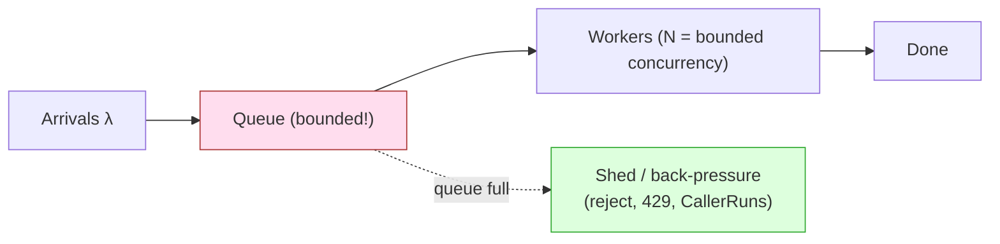

# Shared State Anti-Patterns — Professional

> **Category:** [Concurrency Anti-Patterns](../README.md) → **Shared State** — *mutable data crosses threads without protection, or with protection that doesn't scale.*
> **Covers (collectively):** Shared Mutable State Without Protection · Busy Waiting / Spin Loop · Thread-Per-Request Without Bounds

---

## Introduction

> Focus: **What does shared state cost the machine** — cache-coherence traffic, wasted cores, OS thread memory, scheduler churn — and **how do you measure that cost** before you "fix" it by adding a lock, a spin, or another thread?

`junior.md` taught you to recognize an unprotected race, a spin loop, and an unbounded thread spawn. `middle.md` gave you the safe replacements. `senior.md` taught you to debug them in production. This file goes one layer down — to the **CPU cache, the OS scheduler, and the queue** — because at this level the *correct* fix is frequently the *slow* one, and only measurement tells you which trade you're making.

Three professional truths drive this file:

1. **A correct lock can still destroy throughput.** Adding `mutex.Lock()` makes the race disappear and the scalability curve invert. The cost is not the lock instruction; it is the cache line bouncing between cores.
2. **Waiting has a price, and it is paid on the wrong CPU.** A spin loop doesn't just waste cycles — it can starve the very thread you're waiting for. Blocking has a price too (a context switch). The professional knows when each wins.
3. **Concurrency is bounded by physics, not by your `for` loop.** You have N cores and M gigabytes. Spawning a thread (or even a cheap goroutine) per request pretends otherwise; queueing theory says the pretence ends in a memory blow-up or a latency cliff.

> **The mental model:** shared state is a contract with three systems you rarely see — the **cache-coherence protocol** (MESI and friends), the **OS scheduler**, and the **queue** in front of your workers. Each anti-pattern in this category breaks one of those contracts, and each has a counter you can read to prove it.

---

## Prerequisites

- **Required:** Fluent with [`senior.md`](senior.md) — you can find and fix a race in a running service.
- **Required:** A working model of cache coherence (cache lines ~64 bytes, MESI states, why a write invalidates other cores' copies), and of OS threads vs. user-space schedulers (goroutines, virtual threads).
- **Required:** You can read a CPU profile, a mutex/block profile, and a `benchstat`/JMH A/B and tell signal from noise.
- **Helpful:** Little's Law and basic queueing intuition (arrival rate, service time, utilization).
- **Helpful:** profiling-techniques, concurrency-patterns, connection-pooling, and rate-limiting-throttling skills for the measurement and bounding vocabulary.

---

## Measure First: The Tooling Map

Before any claim about a shared-state cost, reach for the instrument that would falsify it.

| Concern | Go | Java / JVM | Python |
|---|---|---|---|
| **Data race** | `go test -race`, `go run -race` | ThreadSanitizer (limited), `jcstress`, FindBugs/SpotBugs | `pytest` + ThreadSanitizer (C ext), logic review |
| **CPU profile (spin)** | `pprof` CPU profile, `go tool trace` | async-profiler `-e cpu`, JFR | `py-spy`, `cProfile`, `scalene` |
| **Lock contention** | `pprof` mutex & block profiles (`runtime.SetMutexProfileFraction`, `SetBlockProfileRate`) | JFR `jdk.JavaMonitorEnter`, async-profiler `-e lock`, thread dumps | `cProfile` on lock acquire, logic review (GIL dominates) |
| **Cache misses / false sharing** | `perf stat -e cache-misses,cache-references`, `perf c2c` | `perf` + async-profiler hw events, `perf c2c` | `perf stat python …` |
| **Scheduler / context switches** | `go tool trace` (proc/goroutine view), `GODEBUG=schedtrace=1000` | JFR thread events, thread dumps, `vmstat` (cs column) | `perf sched`, `vmstat` |
| **Thread / goroutine count** | `runtime.NumGoroutine()`, `pprof` goroutine profile | thread dump, JFR, `/proc/<pid>/status` | `threading.active_count()`, `/proc` |
| **Parallelism cap** | `GOMAXPROCS`, `runtime.NumCPU()` | `Runtime.availableProcessors()`, pool sizing | n/a (GIL) |
| **Microbenchmark** | `testing.B` + `benchstat` | JMH | `pyperf`, `timeit` |

```bash
# Go: detect the race itself (instruments memory access; ~5-10x slowdown — use in CI)
go test -race ./...

# Go: capture mutex + block profiles to see WHERE contention lives
#   in code: runtime.SetMutexProfileFraction(5); runtime.SetBlockProfileRate(1)
go test -bench=. -mutexprofile=mutex.out -blockprofile=block.out
go tool pprof -http=:8080 mutex.out

# Go: scheduler trace — runnable goroutines, idle procs, steals, every 1s
GODEBUG=schedtrace=1000,scheddetail=1 ./yourbinary 2>&1 | head

# Linux: who's sharing a cache line (HITM = modified line stolen from another core)
perf c2c record -- ./yourbinary && perf c2c report

# Linux: context-switch rate (cs column) and run-queue length (r column)
vmstat 1
```

```bash
# Java: record locks, allocations, threads with JFR, then read in JMC
java -XX:+FlightRecorder -XX:StartFlightRecording=duration=60s,filename=rec.jfr -jar app.jar
# async-profiler: where threads block on monitors
asprof -e lock -d 30 -f lock.html <pid>
# A live thread dump shows BLOCKED/WAITING threads and the monitor they want
jstack <pid> | grep -A3 'BLOCKED'
```

> **Discipline:** "the lock is slow" is not a finding — a mutex profile pointing at one `Lock()` call site with 4 ms cumulative wait is. "We need more threads" is not a finding — a scheduler trace showing idle CPUs while requests queue is. Pair every shared-state claim with its counter.

---

## Shared Mutable State — The Hardware Bill for a Contended Word

The unprotected version is a correctness bug: two threads write the same word, you get a torn or lost update, and `-race` / `jcstress` proves it. That part is settled at `senior.md`. The *professional* problem starts **after** you make it correct — because the obvious fix, a shared atomic or a mutex around a hot counter, has a hardware cost that does not show up in the source.

### 1. Cache-line ping-pong: why a correct atomic counter doesn't scale

A single `int64` counter incremented by every core looks free — one `LOCK XADD` instruction. It is not free, because the counter lives on a cache line, and a cache line can be in the *Modified* state in exactly **one** core's L1 at a time. When core A increments, it must take exclusive ownership; core B's copy is invalidated. When B increments, it pulls the line back, invalidating A. The line **ping-pongs** across the interconnect on every increment. Throughput doesn't merely fail to scale — it gets *worse* as you add cores, because the coherence traffic grows.

```go
// Anti-pattern at scale: one global atomic counter, hammered by every goroutine.
// Correct (no race) but does NOT scale — the cache line ping-pongs across cores.
var globalRequests atomic.Int64

func handle() {
    globalRequests.Add(1) // every core fights for exclusive ownership of one line
    // ...
}
```

### 2. False sharing: the bug you can't see in the source

Worse than a deliberately-shared counter is *accidental* sharing. Two counters that are logically independent — `requests` and `errors` — sit adjacent in a struct and land on the **same 64-byte cache line**. Two goroutines updating different counters still invalidate each other's line. The source looks contention-free; the hardware says otherwise.

```go
// False sharing: requests and errors are logically independent,
// but they share a cache line, so updating one invalidates the other's core.
type Stats struct {
    requests atomic.Int64 // goroutine A
    errors   atomic.Int64 // goroutine B — SAME cache line as requests
}

// Fix: pad so each counter owns its own cache line.
type PaddedStats struct {
    requests atomic.Int64
    _        [56]byte // 64 - 8 = 56 bytes of padding to fill the line
    errors   atomic.Int64
    _        [56]byte
}
```

You detect false sharing with `perf c2c` (it names the cache line and the two instructions fighting over it) or by watching a throughput-vs-cores curve flatten or invert. Padding fixes *accidental* sharing; it does **not** fix a counter that is genuinely shared (section 3).

### 3. The real cure for a hot counter: shard it (per-CPU / striped counters)

Padding stops false sharing but not true contention. For a counter every core must increment, the scalable answer is to **not share the word**: give each shard (ideally each CPU) its own counter on its own cache line, increment the local shard with no contention, and sum the shards only when someone reads the total. This is the idea behind Java's `LongAdder` and Go's sharded-counter pattern.

```go
// Sharded counter: each goroutine touches one shard; reads sum all shards.
// No cross-core invalidation on the hot path (increment); cost moves to the
// rare read. Each shard is padded to its own cache line.
type shard struct {
    v atomic.Int64
    _ [56]byte
}
type Counter struct {
    shards [256]shard
}

func (c *Counter) Add(key uint64, n int64) {
    c.shards[key&255].v.Add(n) // pick a shard by hash; usually uncontended
}
func (c *Counter) Sum() int64 {
    var t int64
    for i := range c.shards {
        t += c.shards[i].v.Load() // contention-free reads, summed lazily
    }
    return t
}
```

```java
// Java: LongAdder IS this pattern, battle-tested. Prefer it over AtomicLong
// for write-heavy counters; AtomicLong for read-heavy or low-contention.
LongAdder requests = new LongAdder();
requests.increment();   // updates a per-thread cell, no global CAS contention
long total = requests.sum();  // sums cells on read
```

> **The trade is explicit:** `AtomicLong`/single atomic is cheap to *read* and cheap under *low* contention; `LongAdder`/sharded is cheap to *write* under *high* contention but pays O(shards) on every read and uses more memory. Choose by your read/write ratio and your contention level — and prove it with a benchmark, not a hunch.

### Micro-benchmark sketch — padded vs. unpadded (illustrative)

```go
// bench_test.go — two goroutines, each hammering its own counter.
// Run: go test -bench=Counter -cpu=2 -count=10 | benchstat
func BenchmarkUnpadded(b *testing.B) { /* Stats with adjacent counters */ }
func BenchmarkPadded(b *testing.B)   { /* PaddedStats, separate lines  */ }
```

```
# Illustrative benchstat output — DO NOT trust, reproduce on your hardware:
name        old ns/op    new ns/op    delta
Counter     18.4ns       3.1ns        -83.2%   # unpadded → padded
# perf stat -e cache-misses confirmed the unpadded run had ~6x the misses.
```

> **Diagnose it:** `-race` proves the correctness bug; `perf c2c` / `perf stat -e cache-misses` proves false sharing; a throughput-vs-`GOMAXPROCS` curve that *inverts* proves true contention; a `benchstat` A/B of padded vs. unpadded vs. sharded settles the cure. Three different counters, three different cures — never assume which one you have.

---

## Busy Waiting — Burning a Core to Wait Slower

A spin loop is correct only when the thing you wait for is *imminent*. Used as a general synchronization mechanism, it is the rare anti-pattern that makes the program both slower **and** hotter.

### 1. Why naive spinning is doubly destructive

```go
// Anti-pattern: burn 100% of a core polling a flag another goroutine will set.
for !done.Load() {
    // nothing — pure busy wait
}
```

Two costs compound here:

- **It burns a whole CPU.** That core does no useful work and draws full power. On a cloud VM you are paying for a core to compute nothing.
- **It can starve the worker you're waiting for.** This is the subtle, vicious part. If the spinner and the worker share a CPU (or you've oversubscribed cores), the spinner's runnable thread competes for scheduler time with the very thread that would set `done`. You spin *longer* because you spun *at all*. On a single-core container, a busy-wait can deadlock-by-starvation: the setter never gets scheduled.

It is also a memory-coherence cost: each spin iteration reads the shared flag, and once the writer flips it, the read forces a cache-line transfer.

### 2. The correct spectrum: spin a little, then park

The professional answer is rarely "never spin" or "always block." It is **adaptive**: spin briefly (the wakeup might be nanoseconds away — cheaper than a context switch, which costs ~1–5 µs plus cold caches), then **park** (block, yielding the CPU) if it doesn't arrive. This is exactly what a modern **adaptive mutex** does, and what `sync.Mutex` in Go and `java.util.concurrent` locks do internally.

If you *must* spin (a tight, proven-short wait), tell the CPU you're spinning so it can relax the pipeline, save power, and let a hyperthread sibling make progress:

```go
// Go: yield the processor so the runtime can schedule the worker.
for !done.Load() {
    runtime.Gosched() // cooperatively yield; far better than a hot empty loop
}
```

```java
// Java 9+: hint to the CPU that this is a spin-wait (emits PAUSE on x86).
while (!done) {
    Thread.onSpinWait(); // reduces power + memory-order traffic, frees the sibling HT
}
```

The hardware primitive underneath these is the x86 `PAUSE` instruction (and ARM's `YIELD`/`WFE`): it hints to the core that this is a spin so it can de-prioritize the pipeline and reduce coherence pressure. `Thread.onSpinWait()` emits it; Go's runtime uses it in its own lock fast paths.

### 3. The right tool: wake on the event, don't poll for it

For anything but a sub-microsecond wait, **block on the event** so the OS scheduler hands the CPU to runnable work and wakes you precisely when the condition holds:

```go
// Go: a channel IS the wakeup. The waiter consumes zero CPU until signaled.
done := make(chan struct{})
go func() { /* work */ ; close(done) }()
<-done // parked by the runtime; no CPU burned, woken on close
```

```java
// Java: condition variable — wait() releases the monitor AND parks the thread.
synchronized (lock) {
    while (!done) {       // ALWAYS loop: guard against spurious wakeups
        lock.wait();      // parks; scheduler reuses the CPU; woken by notify()
    }
}
// elsewhere: synchronized (lock) { done = true; lock.notifyAll(); }
```

### Micro-benchmark sketch — spin vs. condvar CPU (illustrative)

```
# Workload: 1000 waiters, each waiting ~5ms for a signal.
# Measure with /usr/bin/time -v or pidstat; read the CPU% and elapsed.

  busy-wait (empty loop):   CPU ~100% per waiter,  high context-switch churn
  Gosched/onSpinWait spin:  CPU ~40-70%,           still wasteful for 5ms waits
  channel / condvar park:   CPU ~0% while waiting,  one wakeup per signal

# Illustrative: a service replacing a 200-thread busy-wait pool with channels
# dropped steady-state CPU from ~3 full cores to <0.1 core. Reproduce with a
# CPU profile (pprof) showing the spin frames vanish.
```

> **Diagnose it:** a CPU profile dominated by a tight loop with no I/O, or `top` showing a thread pinned at 100% while "doing nothing," is the tell. `go tool trace` shows a goroutine in a perpetual run state; a JVM thread dump shows a `RUNNABLE` thread stuck on your loop instead of `WAITING`. The fix moves CPU from ~100% to ~0% during the wait.

---

## Thread-Per-Request — When the Scheduler Becomes the Bottleneck

Spawning a thread (or goroutine) per request is the natural first design. It scales until it doesn't, and the wall it hits is the **C10k problem**: at ten thousand concurrent connections, the per-thread overhead — memory and scheduling — overwhelms the machine before the actual work does.

### 1. OS threads are expensive; the costs are memory and context switches

An OS thread costs on two axes:

- **Memory.** Each thread reserves a stack — commonly **~1 MB** on Linux (`ulimit -s` default 8 MB virtual, but real reservations and structures add up). 10,000 threads ≈ gigabytes of stack reservation before a single byte of request data. You OOM, or the kernel thrashes.
- **Context switches and scheduler overhead.** The OS scheduler must time-slice every runnable thread. Each context switch costs ~1–5 µs *plus* the invisible cost of cold caches and TLB flushes afterward. With thousands of runnable threads, the machine spends a growing fraction of its time *switching* rather than *working* — visible as a high `cs` column in `vmstat` and rising CPU with falling throughput.

```java
// Anti-pattern (classic Java): one OS thread per connection. Dies at C10k.
ServerSocket server = new ServerSocket(8080);
while (true) {
    Socket conn = server.accept();
    new Thread(() -> handle(conn)).start(); // unbounded OS threads → OOM / thrash
}
```

### 2. Goroutines and virtual threads are cheap — but still not free

Go goroutines start with a **~2–8 KB** growable stack and are multiplexed onto a small pool of OS threads by the runtime (the M:N scheduler, sized by `GOMAXPROCS`). Java 21 **virtual threads** do the same on the JVM. This raises the ceiling by orders of magnitude — millions of goroutines are routine — but it does **not** repeal physics:

- Each goroutine still holds a stack and a scheduler entry; a million idle goroutines is gigabytes and a long scheduler scan.
- They still contend for **`GOMAXPROCS` cores** of *actual* CPU and for downstream resources (DB connections, file handles, memory). Cheap-to-spawn becomes a footgun: it's now trivial to admit more *concurrent work* than your database or your memory can serve.

```go
// "Cheap" goroutines still let you overrun a downstream resource.
for conn := range listener {
    go handle(conn) // unbounded: each handle() grabs a DB conn → pool exhausted,
}                   // or buffers a request body → memory blows up
```

The lesson: cheap concurrency moves the bottleneck from *thread overhead* to *the scarcest downstream resource*. Unbounded spawning just exhausts that instead.

### 3. The cure: bound concurrency + async I/O

Two complementary tools:

- **Bounded worker pool / semaphore.** Cap the number of in-flight requests to what the machine and downstreams can serve. Excess requests queue (briefly) or are shed (rate-limited). This is the connection-pooling idea applied to compute.
- **Async / non-blocking I/O.** Instead of one thread *blocked* per in-flight I/O, a handful of threads drive thousands of connections via an event loop / `epoll` / Go's netpoller. This is *how* Go and virtual threads achieve their scale under the hood — and why thread-per-request without async I/O hits C10k while goroutine-per-request doesn't.

```go
// Bounded concurrency with a semaphore: cap in-flight work to N.
sem := make(chan struct{}, 256) // tune N to cores AND downstream capacity
for conn := range listener {
    sem <- struct{}{}          // blocks (back-pressure) when 256 are in flight
    go func(c net.Conn) {
        defer func() { <-sem }()
        handle(c)
    }(conn)
}
```

```java
// Java: a BOUNDED pool with a BOUNDED queue and a back-pressure policy.
// CallerRunsPolicy makes the submitter do the work when full — natural throttle.
ExecutorService pool = new ThreadPoolExecutor(
    32, 64, 60, TimeUnit.SECONDS,
    new ArrayBlockingQueue<>(1000),                 // BOUNDED queue, not unbounded
    new ThreadPoolExecutor.CallerRunsPolicy());     // back-pressure, not OOM
// Java 21: virtual threads remove the thread cost, but you STILL bound admission
// (e.g. a Semaphore) to protect downstreams — cheap threads ≠ infinite DB conns.
Semaphore admit = new Semaphore(256);
```

### Micro-benchmark sketch — thread-per-request vs. pool (illustrative)

```
# Load test at rising concurrency (e.g. wrk/vegeta), watch throughput & p99.

  thread-per-request (OS threads):
    throughput rises, peaks ~2-4k conns, then COLLAPSES (thrash) → p99 spikes, OOM
  bounded pool (N≈cores, bounded queue):
    throughput plateaus at machine capacity, p99 stays flat, no OOM
  goroutine-per-request + downstream bound:
    scales far higher, but ONLY because async I/O + bounded DB pool absorb it

# Illustrative: capping a goroutine-per-request handler at GOMAXPROCS*32 in-flight
# turned a memory-blowup-under-spike into a flat p99. Prove with NumGoroutine(),
# a goroutine profile, and the load-test throughput/latency curves.
```

> **Diagnose it:** `vmstat 1` (high `cs`, high `r` run-queue) and `NumGoroutine()`/thread-dump counts climbing without bound are the tells; `go tool trace` or JFR shows the scheduler saturated; rising CPU with *falling* throughput is the classic thrash signature. The fix is a bound, sized by benchmark — not "more threads."

---

## Queueing Theory: Why Unbounded Anything Eventually Falls Over

All three anti-patterns are special cases of one mistake: **letting demand exceed capacity without a bound, and hoping it works out.** Queueing theory says it won't, and gives you the math to size the bound.

**Little's Law:** `L = λ × W` — the average number of items *in the system* (`L`) equals the arrival rate (`λ`) times the average time each spends in the system (`W`). Rearranged: `W = L / λ`. If `L` (in-flight requests) is unbounded and arrivals exceed your service rate, `W` (latency) grows without limit, and `L` is your memory footprint — so an **unbounded queue trades a fast failure for a slow one**: instead of shedding load, you buffer it until latency is useless *and* you OOM.



The professional design principles that fall out of this:

- **Bound the queue.** An unbounded `LinkedBlockingQueue` or an unbuffered "just spawn another goroutine" is a memory leak with extra steps. Size the queue to your latency budget: if you can tolerate 200 ms and serve 500 req/s, your queue should hold ≈ 100 items, not infinity.
- **Shed or apply back-pressure when full.** Better to reject (429, `CallerRunsPolicy`, block the producer) than to accept work you can't finish in time. See rate-limiting-throttling.
- **Size workers to capacity, not to demand.** As `λ` rises, you don't add workers without limit — past the point where workers exceed useful parallelism (cores for CPU work, downstream slots for I/O work), more workers *reduce* throughput via contention and context switches. This is the same curve the thread-per-request anti-pattern rides off the cliff.

> **The unifying insight:** unprotected shared state, busy-waiting, and unbounded threads all share a refusal to acknowledge a hard limit — the single cache line, the single CPU, the finite core/memory budget. The cure in every case is to **make the limit explicit and design for it**: shard the counter, park instead of spin, bound the pool and the queue.

---

## A Combined Worked Example

A metrics-collecting request handler that commits all three sins at once — and how each fix is measured separately.

**Before — unprotected counter, busy-wait warmup, unbounded goroutines:**

```go
type Server struct {
    requests int64 // (1) shared mutable state, no protection → data race
    ready    bool  // flipped once at startup
}

func (s *Server) Serve(l net.Listener) {
    for !s.ready { /* spin */ }          // (2) busy-wait burns a core at startup
    for {
        conn, _ := l.Accept()
        go func(c net.Conn) {            // (3) unbounded goroutine per request
            s.requests++                 // (1) racy increment — torn under -race
            s.handle(c)                  // grabs a DB conn from a 20-slot pool
        }(conn)
    }
}
```

Runtime profile of *before*: `-race` flags `s.requests++`; a CPU profile shows the startup spin pinning a core; under a load spike, `NumGoroutine()` climbs into the hundreds of thousands, the 20-slot DB pool is exhausted, request bodies buffer in memory, and the process OOMs while `vmstat` shows context-switch thrash.

**After — sharded counter, channel signal, bounded admission:**

```go
type Server struct {
    requests Counter        // (1) sharded, padded counter — race-free AND scalable
    ready    chan struct{}  // (2) close to broadcast readiness — no spin
    sem      chan struct{}  // (3) bounded in-flight concurrency
}

func NewServer() *Server {
    return &Server{
        ready: make(chan struct{}),
        sem:   make(chan struct{}, runtime.GOMAXPROCS(0)*16), // tune to DB pool size
    }
}

func (s *Server) Serve(l net.Listener) {
    <-s.ready                            // (2) parked, zero CPU, woken on close
    for {
        conn, _ := l.Accept()
        s.sem <- struct{}{}              // (3) back-pressure when full
        go func(c net.Conn) {
            defer func() { <-s.sem }()
            s.requests.Add(rand.Uint64(), 1) // (1) uncontended shard increment
            s.handle(c)
        }(conn)
    }
}
```

> **Illustrative combined impact:** `-race` clean; startup CPU dropped from one pinned core to ~0; under a 3× spike, in-flight goroutines stayed capped, the DB pool was never exhausted, memory stayed flat, and p99 held instead of spiking before an OOM. **Each fix was verified by its own counter — `-race` for the counter, a CPU profile for the spin, `NumGoroutine()` + a load-test p99 curve for the bound — so we know which change bought which win. Never attribute a blended improvement to a blended change.**

---

## Common Mistakes

Professional-level mistakes — they survive review precisely because the code is *correct*:

1. **Fixing the race, ignoring the scalability.** You wrap the hot counter in a mutex or `atomic`, `-race` goes quiet, and throughput *inverts* as you add cores because the cache line ping-pongs. Always check the throughput-vs-cores curve; shard or use `LongAdder` for write-heavy counters.
2. **Padding to fix true contention.** Padding cures *false* sharing (independent fields on one line); it does nothing for a counter every core genuinely writes. Distinguish the two with `perf c2c` before reaching for `[56]byte`.
3. **Spinning "because blocking is slow."** A context switch is ~1–5 µs; a 5 ms busy-wait squanders that thousand-fold and may starve the very thread you wait on. Spin only for proven sub-microsecond waits, and then with `onSpinWait`/`Gosched` — otherwise park.
4. **Trusting "goroutines/virtual threads are free."** They're cheap to *spawn*, but a million of them is real memory and scheduler load, and each still consumes a scarce downstream slot. Bound admission with a semaphore regardless of thread cost.
5. **Unbounded queues as a "buffer."** An unbounded queue converts a fast, honest rejection into a slow OOM with terrible latency. Bound the queue to your latency budget (Little's Law) and choose a shedding/back-pressure policy.
6. **Sizing the pool to demand instead of capacity.** Adding workers past useful parallelism *reduces* throughput (contention, switches). Size to cores (CPU work) or downstream slots (I/O work) and let the queue + back-pressure absorb the rest.
7. **Believing the Python GIL makes you safe.** The GIL serializes *bytecode*, not *logical* operations: `counter += 1` across threads can still lose updates because it's multiple bytecodes, and the GIL means CPU-bound threads don't parallelize at all (use `multiprocessing` or C extensions; `async` for I/O). It is not a substitute for a lock or an atomic.
8. **One blended benchmark for a multi-lever fix.** Sharding + parking + bounding at once, reported as one p99 number, teaches you nothing about which lever paid off and leaves the next regression a mystery. Measure each.

---

## Test Yourself

1. A single `AtomicLong` request counter shows *decreasing* throughput as you scale from 1 to 16 cores, even though there's no lock and no race. Explain the hardware cause and name two cures and when each applies.
2. What is false sharing, how does it differ from true contention, and which tool names the exact cache line and instructions involved?
3. You replace a `channel`-based wait with a busy-wait loop and the program gets *slower* and sometimes hangs on a single-core container. Give the two distinct mechanisms causing this.
4. When is a brief spin genuinely faster than parking on a condition variable, and what instruction/hint should the spin use?
5. Goroutines are cheap, so why does "one goroutine per request" still fall over under a traffic spike, and what bound fixes it?
6. Using Little's Law, size the worker pool and queue for a service with λ = 500 req/s, mean service time W_s = 40 ms, and a 200 ms end-to-end latency budget.
7. Why does Python's GIL fail to protect `counter += 1` across threads, and what *does* it prevent?

---

## Cheat Sheet

| Anti-pattern | Runtime / hardware cost | Measure with | Scalable fix |
|---|---|---|---|
| **Shared mutable state (unprotected)** | Torn/lost updates; the "fix" (shared atomic/mutex) ping-pongs a cache line and *inverts* scaling | `-race`/`jcstress`; `perf c2c`, `perf stat -e cache-misses`; throughput-vs-cores curve | Shard / per-CPU counter (`LongAdder`); pad to a cache line for *false* sharing; confine ownership |
| **Busy waiting / spin loop** | Burns a whole core; starves the awaited thread; coherence traffic per poll | CPU profile (tight loop, no I/O); `top` thread at 100%; `go tool trace`/thread dump | Park on channel / condition variable; if you must spin, brief + `onSpinWait`/`Gosched`/`PAUSE` (adaptive) |
| **Thread-per-request (unbounded)** | ~1 MB/OS-thread stack → OOM; context-switch thrash; even cheap goroutines exhaust downstream slots | `vmstat` (`cs`,`r`); `NumGoroutine()`/thread dump; `go tool trace`/JFR; load-test p99 | Bounded pool + **bounded** queue + back-pressure (`CallerRunsPolicy`/semaphore); async I/O; size by Little's Law |

**Three golden rules:**
- *Making a race correct is step one; check the scalability curve, because a correct shared word still ping-pongs across cores.*
- *Don't poll for an event you can wait on — spin only for sub-microsecond waits, with a CPU hint, then park.*
- *Every concurrency design needs an explicit bound (cores, in-flight, queue depth); unbounded anything trades a fast failure for a slow OOM. Size it with Little's Law and prove it with a load test.*

---

## Summary

- Shared state is a contract with the **cache-coherence protocol**, the **OS scheduler**, and the **queue**; each anti-pattern here breaks one, and each break has a counter you can read.
- **Shared mutable state:** the correctness fix (`-race`-clean atomic/mutex) is not the scalability fix. A contended counter ping-pongs a single cache line; **false sharing** does the same accidentally for adjacent fields (cure: padding); **true contention** needs **sharding / per-CPU counters** (`LongAdder`) — cheap writes, O(shards) reads.
- **Busy waiting:** a spin loop burns a full core *and* can starve the thread it waits on. The professional answer is **adaptive** — spin briefly with `onSpinWait`/`Gosched`/`PAUSE` for sub-µs waits, then **park** on a channel/condition variable so the scheduler reuses the CPU.
- **Thread-per-request:** OS threads cost ~1 MB of stack and context-switch overhead → the **C10k** wall (OOM and scheduler thrash). Goroutines/virtual threads raise the ceiling but don't repeal physics — they still bottleneck on cores and downstream slots. Cure: **bounded pool + bounded queue + async I/O + back-pressure**.
- **Queueing theory unifies all three:** `L = λ × W`. Unbounded in-flight work means unbounded memory and latency — an unbounded queue is an OOM with extra steps. Bound the queue to your latency budget; shed or back-pressure when full; size workers to *capacity*, not *demand*.
- **Python note:** the GIL serializes bytecode, not logical operations — `counter += 1` still races, and CPU-bound threads don't parallelize. Use locks/atomics, `multiprocessing`, or async I/O; C extensions release the GIL and change the rules.
- **Measure first, always:** `-race`/`jcstress`, `perf c2c`/`cache-misses`, CPU/mutex/block profiles, `vmstat`/scheduler traces, `NumGoroutine()`/thread dumps, and load-test latency curves. Capture a baseline, change one lever, re-measure.
- This completes the level ladder for Shared State: [`junior.md`](junior.md) (recognize) → [`middle.md`](middle.md) (prevent) → [`senior.md`](senior.md) (debug in prod) → **professional.md** (hardware, scheduler, queueing). Drill the practice files next.

---

## Further Reading

- **Java Concurrency in Practice** — Brian Goetz et al. (2006) — the canonical treatment of shared state, atomics, and pool sizing; `LongAdder` postdates it but the contention reasoning is here.
- **The Art of Multiprocessor Programming** — Herlihy, Shavit, Luchangco, Spear (2nd ed., 2020) — cache coherence, contention, sharded/striped counters, and the theory of lock-free scaling.
- **What Every Programmer Should Know About Memory** — Ulrich Drepper (2007) — cache lines, false sharing, coherence traffic; still the canonical reference for the hardware cost in this file.
- **Systems Performance** — Brendan Gregg (2nd ed., 2020) — `perf`, scheduler analysis, context-switch and run-queue interpretation, the C10k context.
- **The Go Memory Model** — [go.dev/ref/mem](https://go.dev/ref/mem) — what is and isn't guaranteed before you reach for `atomic` or channels.
- **The C10k problem** — Dan Kegel — the original framing of why thread-per-connection hits a wall and why event-driven / bounded models scale.
- **Performance Modeling and Design of Computer Systems** — Mor Harchol-Balter (2013) — Little's Law and queueing theory for engineers sizing pools and queues.
- **JEP 444: Virtual Threads** — the JDK 21 design notes on cheap threads, and why you still bound admission to protect downstreams.

---

## Related Topics

- [Synchronization Misuse](../01-synchronization/professional.md) — the memory-ordering and lazy-init siblings; `atomic`/`volatile` cost meets the cache-coherence cost here.
- [Coordination → Wrong Lock Granularity](../02-coordination/professional.md) — the lock-contention counterpart to cache-line contention; both decided by profiling.
- [Async Anti-Patterns](../../04-async/README.md) — the event-loop sibling chapter; busy-waiting and unbounded concurrency recur in the single-threaded async world.
- [Bad Structure → Professional](../../01-development/01-bad-structure/professional.md) — false sharing inside a God Object; the runtime-cost methodology this file extends to shared state.
- Clean Code → Immutability — eliminating shared *mutable* state at the source: the deepest cure for this whole category.
- profiling-techniques · concurrency-patterns · connection-pooling · rate-limiting-throttling — the measurement, coordination, and bounding toolkits referenced throughout.
- Distributed Systems — the same shared-state and bounding problems at the network scale.

---

## Check your understanding

1. Explain Shared State Anti-Patterns — Professional Level in your own words and name the problem it solves.
2. How would you apply the ideas around Table of Contents, Introduction, Prerequisites in a realistic engineering change?
3. What failure mode or misuse should you look for, and what evidence would reveal it?
4. How would you introduce and govern Shared State Anti-Patterns — Professional Level across teams through reversible, measurable increments?
5. What observable result would convince you that the approach improved the system?
