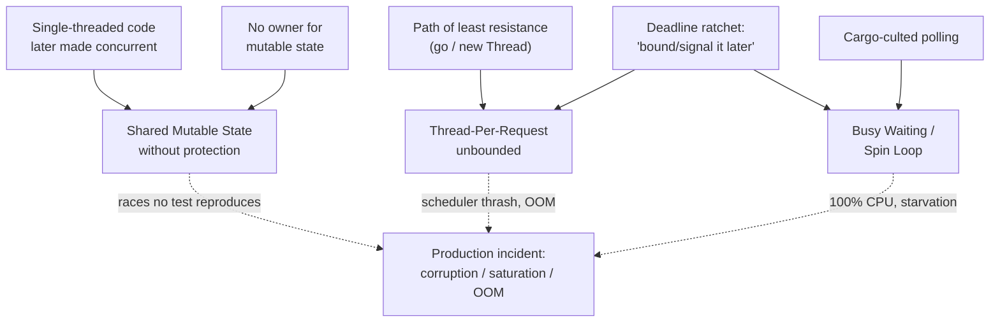
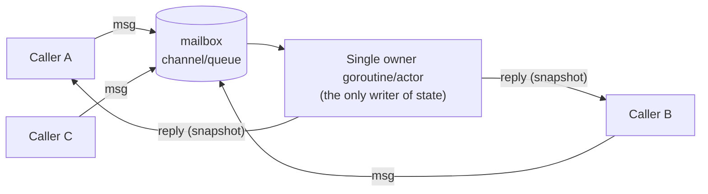
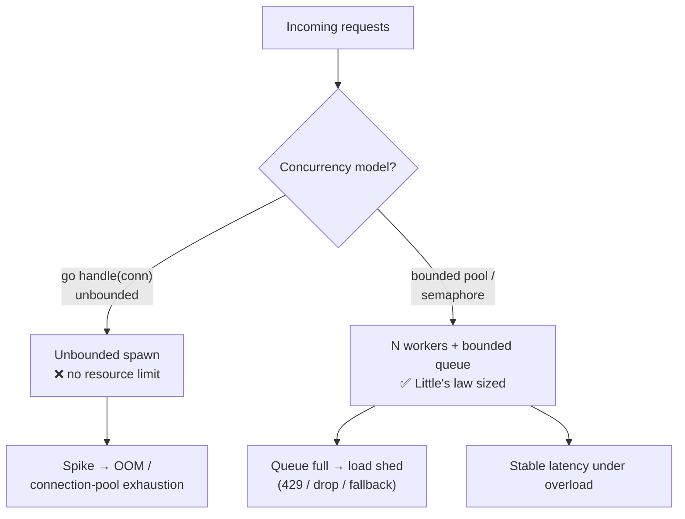

# Shared State Anti-Patterns — Senior

> **Category:** [Concurrency Anti-Patterns](../README.md) → **Shared State** — *mutable data crosses threads without protection, or with the wrong protection.*
> **Covers (collectively):** Shared Mutable State Without Protection · Busy Waiting / Spin Loop · Thread-Per-Request Without Bounds

---

## Introduction

> Focus: **How did the codebase get here?** and **How do I fix it safely at scale?**

At the junior level you learned what a data race *looks* like and why it survives 9,999 test runs before corrupting on the 10,000th. At the middle level you learned to reach for a `Mutex`, a channel, or an `atomic` and to bound a worker pool. This file is about the system you actually inherit as a senior: a service where shared mutable state is woven through forty files, a hot loop somewhere spins at 100% CPU "waiting for the cache to warm," and the request handler does `go handle(conn)` — unbounded — so the box falls over at 30k concurrent connections instead of degrading gracefully.

Three questions define senior-level work here:

1. **How did it get this way?** Shared-state bugs at scale are rarely one bad commit. They are the deterministic output of an *architecture* that never decided who owns mutable state — plus a default reflex (`new Thread`, `go func`, a `while (!ready)`) that is locally easy and globally fatal. Fix the reflex and the boundary, or the races regrow.

2. **How do I fix it without an outage?** Shared-state fixes are *behavior-preserving by intent but timing-altering in fact*: changing a lock to a channel, or `go` to a bounded pool, changes throughput, latency, and failure modes. You need the same disciplined, reversible, instrumented approach you use for any load-bearing change — plus tools that make races *observable* (the race detector, stress tests, divergence canaries) because you cannot eyeball them.

3. **How do I size it?** Thread-per-request and pool sizing are not vibes; they obey **Little's law** and queueing theory. A senior turns "how many workers?" from a guess into a calculation with an SLO, a bound, and a load-shedding policy for when the bound is hit.

> **The senior mindset shift:** the junior asks "where do I put the lock?"; the senior asks "why is this state shared at all, who is its single owner, and what is the smallest reversible step that confines it?" The deepest cure for every anti-pattern in this category is the same — **stop sharing mutable state** — and the second-deepest is **bound everything that can grow without limit.**

---

## Prerequisites

- **Required:** Fluency with [`junior.md`](junior.md) and [`middle.md`](middle.md) — you can recognize a data race, use a mutex/channel correctly, and bound a worker pool.
- **Required:** You have run a service in production under real load and watched it degrade — saturation, GC pressure, connection exhaustion, or a thundering herd.
- **Helpful:** Comfort reading flame graphs and a basic mental model of your runtime's scheduler (Go's GMP, the JVM thread model + virtual threads, Python's GIL + asyncio loop).
- **Helpful:** Familiarity with Clean Code → Concurrency and Clean Code → Immutability — the positive disciplines this file scales up.
- **Helpful:** Exposure to the other concurrency categories: Synchronization Misuse and Coordination — wrong-protection bugs are cousins of no-protection bugs.

---

## How Did the Codebase Get Here? — Root-Cause Forces

Every unprotected global, every spin loop, every unbounded `go` has a biography. Name the force before you touch the code, because the same force will recreate the bug behind your fix.

### The "it worked single-threaded" inheritance

Most shared mutable state was correct *once* — when the code was single-threaded. Someone later added a worker pool, an async handler, or a second goroutine, and the previously-private state became shared without anyone making a decision. The package-level `var cache = map[string]T{}` was fine until two requests hit it concurrently. **No one introduced the race; concurrency was bolted onto code that assumed it would never happen.**

### The path of least resistance

`go handleRequest(conn)` is one line and works perfectly in the demo and in load tests up to the point where it doesn't. `new Thread(task).start()` is the first thing the API teaches. A bounded pool, a semaphore, an actor — all require *more* code and a decision about the bound. The unbounded, unprotected version is always the lower-energy state. Entropy favors the race.

### The deadline ratchet (again)

"Add a lock later." "The spin loop is temporary until we wire up the real signal." "We'll bound the pool after launch." Each is locally rational and never gets undone, because the cleanup is never itself a deadline. Busy-wait loops and unbounded spawns are the ratchet's sediment, identical in mechanism to the structural decay in [bad-structure/senior.md](../../01-development/01-bad-structure/senior.md).

### No owner for mutable state

When no module owns a piece of mutable state, every module reads and writes it directly — the concurrency analogue of the God Object's missing boundary. State with many writers and no owner is the precondition for *every* race. The cure is the **single-writer principle**: give each piece of mutable state exactly one goroutine/thread/actor that may write it, and make everyone else ask.

### Cargo-culted polling

Busy waiting often arrives copied from a tutorial: `while not ready: pass`, or a `for {}` poll of a flag. It "works," so it spreads. Nobody measured that it pins a core. The fix exists in the same standard library (`sync.Cond`, a channel, `Object.wait`/`notify`, a `Future`) but requires knowing it's there.



The practical takeaway, identical in spirit to structural refactoring: **a senior fix names the force, not just the smell.** "Add a mutex" is a patch. "Confine this counter to a single-writer goroutine fed by a channel, delete the four direct writers, and add `-race` to CI so a new direct writer fails the build" is a fix that *stays fixed*.

---

## The Senior Cure: Designing Out Shared Mutable State

There is a hierarchy of cures. Reach for the highest one the situation allows, not the first one that compiles.

| Rank | Cure | What it eliminates | Cost |
|---|---|---|---|
| 1 | **Don't share** — confine state to one owner | The race entirely; no sync needed | Restructuring ownership |
| 2 | **Don't mutate** — immutable values, copy-on-write | Write-write & read-write races | Allocation / copying |
| 3 | **Communicate, don't share** — channels / actors / queues | Shared memory replaced by message passing | Indirection, latency |
| 4 | **Protect** — mutex / RWMutex / atomic | Nothing structural; you still own the discipline | Contention, deadlock risk |

Locks are *rank 4* — the last resort, not the first. A senior treats "we need a lock" as a signal to first ask whether the state needs to be shared and mutable at all. The three anti-patterns in this category are all failures to climb this ladder: unprotected sharing skips it entirely; busy waiting is a broken attempt at rank 3 coordination; thread-per-request is rank-4 thinking (every thread touches shared scheduler/memory) where rank 3 (a bounded queue) belongs.

> **The single-writer principle** is the spine of ranks 1–3. *Mutable state has exactly one writer.* Readers either get an immutable snapshot (rank 2) or send a message to the writer and await a reply (rank 3). This is how Go's "share memory by communicating," the actor model, LMAX Disruptor, and Redis's single-threaded core all win: contention on a thing with one writer is *zero* by construction.

---

## Eliminating Races Structurally: Immutability, Confinement, Message Passing

### Rank 1–2: confine and freeze

The cheapest race to fix is the one you delete by making the state un-shared or un-mutable. A shared, mutated config map becomes an *immutable snapshot* that the writer replaces atomically; readers take a pointer and are guaranteed it never changes under them.

```go
// BEFORE — shared mutable map, multiple readers + a reloader writing concurrently.
// Data race: a reader iterating while reload() writes corrupts the map (and on Go's
// runtime, concurrent map read/write is a hard panic, not just stale data).
type Config struct {
    mu   sync.Mutex
    data map[string]string // every read AND write must hold mu — contention central
}

// AFTER — copy-on-write with an atomic pointer. The map is NEVER mutated after publish;
// reload swaps in a brand-new immutable map. Readers are lock-free and always see a
// consistent snapshot. Single writer (the reloader); unlimited lock-free readers.
type Config struct {
    snap atomic.Pointer[map[string]string]
}

func (c *Config) Get(k string) string { return (*c.snap.Load())[k] } // lock-free

func (c *Config) Reload(fresh map[string]string) {
    c.snap.Store(&fresh) // publish a new immutable snapshot atomically
}
```

The race is gone not because we locked better but because **the shared thing stopped being mutable.** This is the immutability discipline applied as a concurrency tool. In Java the same shape is an `AtomicReference<Map<...>>` holding an unmodifiable map; in Python (where the GIL makes single-statement dict reads atomic but multi-step updates are not) it's swapping a reference to a frozen `MappingProxyType`.

### Rank 3: communicate, don't share — the single-writer goroutine

When state must change over time and be queried, give it one owner and a mailbox. This is Go's idiom and the actor model in one shape.

```go
// A counter owned by exactly ONE goroutine. No mutex anywhere: the state is never
// touched by two goroutines, so there is no race to protect against. Callers send
// messages; the owner serializes all access by being the only one who touches `n`.
type Counter struct {
    inc chan int
    get chan chan int
}

func NewCounter() *Counter {
    c := &Counter{inc: make(chan int), get: make(chan chan int)}
    go func() { // the single writer/owner
        n := 0
        for {
            select {
            case d := <-c.inc:
                n += d
            case reply := <-c.get:
                reply <- n // hand back a snapshot
            }
        }
    }()
    return c
}

func (c *Counter) Add(d int) { c.inc <- d }
func (c *Counter) Value() int {
    reply := make(chan int)
    c.get <- reply
    return <-reply
}
```

This is more code than `atomic.AddInt64`, and for a bare counter the atomic is the right call. The actor shape earns its keep when the state is *rich and invariant-laden* — an order book, a session table, a rate-limiter's token buckets — where "serialize all mutation through one owner" turns a swarm of subtle invariants into ordinary single-threaded code inside the loop. The same model in the JVM is a single-consumer queue feeding one worker thread (or an Akka/Pekko actor); in Python it's an `asyncio.Queue` drained by one task.

The payoff is conceptual, not just mechanical: **inside the owner's loop you are single-threaded again.** Every invariant that was a minefield under shared access — "the balance must never go negative," "these two fields must update together," "this index must stay consistent with that list" — becomes a plain sequential assertion, because nothing else can observe or touch the state mid-update. You have traded the cost of message-passing indirection for the disappearance of an entire class of bug. That trade is almost always worth it for state with more than one invariant; it is rarely worth it for a single independent word, where an atomic is simpler and faster.



### Sharding state to scale a single writer

The single-writer principle seems to cap throughput at one core. It doesn't — you **shard**. Partition the keyspace across N owners; each shard is single-writer internally, and N shards run in parallel. A sharded map (`N` buckets, each `mu` guarding its slice of keys, hashed by key) or `N` actor goroutines keyed by customer ID gives you near-linear scaling with zero cross-shard contention, as long as a request touches one shard. This is the same partitioning logic as a database's, applied in-process — and the moment a request must touch two shards, you've reintroduced multi-lock ordering, so the shard key must match the access pattern.

---

## Replacing Busy Waiting with Real Synchronization and Backpressure

A spin loop — `for !done {}`, `while not ready: pass` — burns a full core polling for an event a peer is supposed to signal. At scale it doesn't just waste a core: it *starves the very goroutine/thread that would flip the flag* (especially under a cooperative or oversubscribed scheduler), turning a wait into a near-deadlock. The cure is to **block on the event**, so the scheduler parks the waiter and wakes it on the signal.

```go
// BEFORE — spin loop. Pins a core; under GOMAXPROCS pressure can starve the producer.
for !atomic.LoadInt32(&ready) { /* nothing — 100% CPU */ }
use(data)

// AFTER — block on a channel close. The waiter is parked by the runtime and woken
// exactly when ready fires; zero CPU while waiting. close() is the idiomatic
// broadcast "this happened" to any number of waiters.
<-readyCh // producer does: close(readyCh)
use(data)
```

In Java the parallel mistake is `while (!ready) {}`; the fix is `synchronized`/`wait`/`notifyAll`, a `CountDownLatch`, or a `CompletableFuture`. In Python a `while not ready: pass` *under threads* is doubly bad — it spins AND holds the GIL against the producer; replace it with `threading.Event().wait()`; under `asyncio`, `await event.wait()`.

### From "wait for a flag" to backpressure

The deeper senior insight: a spin loop is usually a *symptom of missing backpressure.* The code spins because a producer is outrunning a consumer and someone bolted on a poll instead of a flow-control mechanism. Replace the poll with a **bounded channel/queue** whose fullness *is* the backpressure signal — a fast producer blocks on `send` when the buffer is full, automatically pacing itself to the consumer with no spinning and no flag.

```go
// Backpressure for free: the bounded buffer paces the producer. When the consumer
// falls behind, the buffer fills and `jobs <- j` blocks — no spin, no flag, no
// unbounded memory growth. This is the antidote to BOTH busy-waiting and the
// unbounded queue that thread-per-request hides behind.
jobs := make(chan Job, 256) // bound = backpressure threshold
go func() {
    for j := range producer() {
        jobs <- j // blocks (parks) when full — natural rate limiting
    }
    close(jobs)
}()
for j := range jobs { // consumer
    process(j)
}
```

> **The rule:** never poll for something another thread can *signal*. Polling is acceptable only when there is genuinely no signal to subscribe to (an external resource you don't control, like a third-party file or a database row another system writes) — and even then, poll with a **sleep/backoff**, never a tight loop, and prefer a real notification (inotify, `LISTEN/NOTIFY`, a webhook) if one exists.

---

## Choosing a Concurrency Architecture — and the C10k Lesson

Thread-per-request without bounds is not just "forgot to add a pool" — it's an *architectural* choice that fails predictably. The senior job is to pick the right model deliberately.

### The C10k lesson

In 1999 Dan Kegel framed the **C10k problem**: a server using one OS thread per connection cannot reach 10,000 concurrent connections, because each thread costs ~1 MB of stack plus scheduler overhead, and the kernel scheduler thrashes context-switching thousands of threads. The lesson that reshaped server design: **decouple the number of concurrent connections from the number of OS threads.** Every modern high-concurrency model is an answer to C10k:

| Model | How it decouples | Sweet spot | Failure mode if misused |
|---|---|---|---|
| **Thread-per-request (unbounded)** | Doesn't — 1 thread per request | Low, *bounded* concurrency (admin tools, small fan-out) | OOM / scheduler thrash under load spikes |
| **Bounded thread/worker pool** | N threads serve M requests via a queue | CPU-bound work; predictable parallelism | Queue grows unbounded if you forget the queue bound |
| **Event loop / async I/O** | 1 thread multiplexes thousands of I/O waits via epoll/kqueue | I/O-bound, high connection count (the C10k answer) | One blocking call stalls everything; CPU work starves the loop |
| **Goroutines / virtual threads** | M:N — many lightweight tasks on few OS threads | I/O-bound *and* you want blocking-style code | Still need bounds — cheap ≠ free |

Go's goroutines and Java 21's virtual threads (Project Loom) are the synthesis: they give you *thread-per-request programming model* (simple, blocking-style code) on top of an *event-loop runtime* (M:N scheduling over a few carrier threads). They solve C10k's cost-per-task problem — a goroutine starts at ~2 KB, a virtual thread similarly — but **they do not solve the unboundedness problem.** A million goroutines each holding a DB connection still exhausts the connection pool; a million virtual threads each buffering a 1 MB response still OOMs. Cheap concurrency removes the *thread* limit and exposes the *resource* limit underneath.



> **The senior framing:** "thread-per-request without bounds" is wrong even with cheap goroutines, because the bound that matters is on the *scarce downstream resource* (DB connections, memory, an upstream's rate limit), not on the threads. Pick the model by the *workload* (I/O-bound → async/goroutines/virtual threads; CPU-bound → pool sized to cores), then **bound it at the resource that breaks first.**

---

## Capacity Planning for Pools: Little's Law, Bounds, Load Shedding

Sizing a pool is arithmetic, not intuition. The senior tool is **Little's law**:

> **L = λ × W** — the average number of in-flight requests (L) equals arrival rate (λ) times average time-in-system (W).

To serve `λ` requests/sec each taking `W` seconds, you need on average `L = λ × W` of them in flight simultaneously. That `L` is your concurrency requirement — and it tells you the pool/semaphore size.

**Worked example.** A handler calls a downstream that takes `W = 200 ms` on average. You must serve `λ = 500 req/s`. Then `L = 500 × 0.2 = 100` concurrent in-flight calls. So you need a concurrency limit of ~100 (plus headroom for variance — size to the *tail* latency `W_p99`, not the mean, or the pool saturates during latency spikes). If the downstream's connection pool only allows 50, that 50 — not your CPU — is the real bound, and at `λ=500` you are *over-subscribed by 2×*; the excess must queue or be shed.

```go
// Semaphore-bounded concurrency sized from Little's law. The buffered channel is a
// counting semaphore: at most `limit` calls run at once. Sized to λ × W_p99.
type Limiter struct{ sem chan struct{} }

func NewLimiter(limit int) *Limiter { return &Limiter{sem: make(chan struct{}, limit)} }

func (l *Limiter) Do(ctx context.Context, fn func() error) error {
    select {
    case l.sem <- struct{}{}: // acquire a slot
        defer func() { <-l.sem }() // release
        return fn()
    case <-ctx.Done(): // LOAD SHEDDING: don't queue forever — fail fast
        return ctx.Err() // caller maps to 429/503; the queue stays bounded
    }
}
```

```java
// Java equivalent — a bounded pool with a bounded queue and an explicit rejection
// policy. The two bounds together cap memory; CallerRuns/AbortPolicy is the shed.
ThreadPoolExecutor pool = new ThreadPoolExecutor(
    /* core   */ 100,           // ≈ L from Little's law
    /* max    */ 100,
    60, TimeUnit.SECONDS,
    new ArrayBlockingQueue<>(200),                 // BOUNDED queue — never unbounded
    new ThreadPoolExecutor.AbortPolicy());         // reject (→ 429) when full = shed
// Anti-pattern to avoid: Executors.newCachedThreadPool() (unbounded threads) or a
// LinkedBlockingQueue with no capacity (unbounded queue → OOM under overload).
```

### The two bounds and load shedding

A bounded pool has **two** bounds, and forgetting the second is the classic trap: bounded workers + an *unbounded* queue just moves the OOM from "too many threads" to "too many queued items." You need:

1. **A worker bound** — `≈ L` from Little's law, sized to tail latency, capped by the scarcest downstream resource.
2. **A queue bound** — how much burst you absorb before shedding. Past it, **shed load**: return `429/503`, drop low-priority work, or serve a degraded fallback. *Shedding is a feature, not a failure* — it keeps the service up and latency bounded instead of letting an unbounded queue drive every request's latency to infinity (and the box to OOM).

The deepest queueing insight a senior internalizes: **an unbounded queue does not add capacity, it adds latency.** If `λ > μ` (arrival exceeds service rate) even briefly, a bounded queue with shedding keeps p99 flat and drops the excess; an unbounded queue accepts everything and every request's latency climbs without limit until the system collapses. Bound the queue; shed the overflow.

There is a second, subtler trap: **queued work that the client has already given up on.** Under overload, a request may sit in the queue longer than the caller's timeout, so by the time a worker picks it up, no one is listening for the answer — you spend a scarce worker producing a result that goes straight to the bit bucket, making the overload *worse*. The fix is to thread a deadline (a `context.Context` in Go, a request deadline in Java) through the queue and have the worker check it before starting: if the deadline has passed, drop the item immediately rather than process it. This is *deadline-aware shedding* — it sheds the work that is already worthless, reclaiming capacity for work that still has a waiting client. Combined with the queue bound, it keeps a saturated service doing only useful work.

---

## Auditing for Races at Scale

You cannot find a data race by reading code carefully — by definition it only manifests under a timing your eyes don't simulate. Seniors make races *observable and reproducible* with tooling, then keep them out with automation.

### Run the race detector — and run it in CI

Go's `-race` flag, the JVM with thread-sanitizer-style tools (or the `jcstress` harness for memory-model probing), and Python's `ThreadSanitizer` builds instrument every memory access to detect unsynchronized concurrent access *that actually happened in this run*.

```bash
# Go — the single highest-leverage concurrency tool. Run the whole suite under -race.
go test -race ./...

# It only reports races that the test EXECUTION exercised — so the value is entirely
# in whether your tests create concurrent access. Hence: stress tests (below).
```

The race detector finds only races your tests *trigger*. So two disciplines compound it:

- **Make `-race` a required CI gate.** A new unprotected shared write fails the build, addressing the "single-threaded code made concurrent" root cause mechanically. Accept the ~5–10× slowdown; run it on a dedicated CI lane if the full suite is too slow.
- **Write stress tests that maximize interleavings.** Fire N goroutines/threads hammering the shared structure with random operations; under `-race`, this surfaces what a single-threaded test never will.

```go
// Stress test: many writers + readers in parallel maximize the chance the detector
// observes an unsynchronized interleaving. Without -race this passes silently; WITH
// -race it reliably catches an unprotected map/counter.
func TestCounterRace(t *testing.T) {
    c := NewCounter()
    var wg sync.WaitGroup
    for i := 0; i < 100; i++ {
        wg.Add(1)
        go func() { defer wg.Done(); for j := 0; j < 1000; j++ { c.Add(1) } }()
    }
    wg.Wait()
    if got := c.Value(); got != 100*1000 {
        t.Fatalf("lost updates: got %d, want %d", got, 100*1000)
    }
}
```

### Verify pool behavior under overload, not just under load

A pool that's correct at `λ = 0.5×μ` can fail catastrophically at `λ = 2×μ`. Load-test *past* the bound: confirm the service sheds (returns 429s, holds p99 flat) instead of OOMing or letting latency run away. The interesting test is the overload test, not the happy-path throughput number.

> **The cardinal audit rule:** absence of a race-detector report is *not* proof of correctness — it's proof that *this run* had no observed race. Combine `-race` + stress tests + overload tests + the type-level cures (immutability, confinement) so that most races *can't be written*, and the ones that can are caught by a build that fails. Detection is the safety net; structural cures are the floor.

---

## When Each Anti-Pattern Is Actually Acceptable

The senior skill juniors lack: knowing the *narrow* conditions under which each "anti-pattern" is the correct engineering choice. Misapplying these exceptions is how people justify the real bug, so the conditions are strict.

- **A tight bounded spin (busy wait) is correct when** the wait is *known to be sub-microsecond* and the cost of parking + waking the thread exceeds the spin. This is why real mutexes spin briefly before parking (adaptive/`sync.Mutex` does this internally), and why lock-free ring buffers (LMAX Disruptor) spin: a context switch costs ~1–5 µs, so if the data will be ready in 100 ns, spinning wins. **The conditions:** bounded iterations (then fall back to a park/yield), a genuinely tiny known wait, and you've measured that parking is the bottleneck. An *unbounded* spin on an *arbitrary-length* wait is never acceptable.

- **Unbounded spawning is acceptable when** the fan-out is *small and fixed by the code, not by external input* — e.g., querying 3 replicas in parallel and taking the first response, or a `errgroup` over a known 5-element slice. The number of goroutines is bounded by a constant the programmer controls, so there's no path to exhaustion. **The line:** bounded-by-constant is fine; bounded-by-untrusted-input (one goroutine per incoming request, per file in an uploaded archive, per row in a user-supplied list) is the anti-pattern, because the attacker/load picks the number.

- **Shared mutable state without a lock is acceptable when** access is *provably* never concurrent (confined to one goroutine/thread by construction — e.g., state owned by a single event-loop task, or a per-request struct never escaping its handler) **or** when it's a single word protected by atomics with no compound invariant. The danger is "provably" usually meaning "I believe" — the proof must be structural (the type never escapes, the channel hands off ownership), not a comment.

> **The frame:** these exceptions are *optimizations under proof*, not defaults. The default is confine → freeze → communicate → (last) lock; bound everything sized by external input; block on signals, don't poll. You depart from the default only with a measurement (the spin is faster) or a structural proof (the fan-out is constant; the state can't escape). "It's probably fine" is not a proof.

---

## Preventing Shared-State Decay Organizationally

Fixing today's races doesn't stop tomorrow's. Since the root causes are organizational — no owner, path of least resistance, deadline ratchet — the durable fixes are automated and social, outlasting the engineer who cares.

### Make the safe path the easy path

The strongest prevention is removing the unsafe primitive from reach. Ban raw `new Thread` / `Executors.newCachedThreadPool()` / naked `go` in long-lived code via lint rules, and provide a *blessed* bounded-pool/limiter helper that's easier to call than rolling your own. If the easy thing is also the safe thing, the path of least resistance stops producing races.

```yaml
# Example CI gates (conceptual) that address each root-cause force:
#  - go test -race ./...          # fails build on an observed data race
#  - lint: forbid `go ` in handlers without a limiter wrapper (custom analyzer)
#  - lint: forbid unbounded queues / cached thread pools (e.g. errcheck/forbidigo)
#  - load test in CI: assert p99 stays flat and service sheds at 2× nominal λ
```

### Immutability and single-writer as conventions

Establish, in review and in an ADR, that **shared state is immutable by default** and **mutable state has one writer.** A PR that adds a package-level mutable `var` touched by handlers gets the question: *"who owns this, and why does it need to be mutable and shared?"* — the concurrency twin of the "needs-a-ticket" gate for speculative abstraction. Encode it where you can: `-race` in CI, a lint against exported mutable package vars, code-owner review on the package that owns shared state.

### Capacity planning as a review artifact

Every new pool/limiter PR states its **Little's-law sizing, its queue bound, and its load-shedding behavior** in the description — "sized to λ=500 × W_p99=0.3s ≈ 150, queue 300, sheds with 429." This turns pool sizing from folklore into a reviewable, documented decision, and makes "unbounded" visibly unacceptable.

> **The senior's real product is the system that keeps races from regrowing:** a `-race` gate, a blessed bounded-pool helper that's easier than the unsafe one, an immutability-by-default norm with single-writer ownership, and capacity numbers in the PR. Code reverts to its easiest path; make the easy path safe, and the structure holds.

---

## Common Mistakes

Mistakes seniors make when fixing shared-state anti-patterns at scale:

1. **Adding a lock instead of removing the sharing.** A mutex makes the race go away *and* makes the design harder to reason about and a contention point. *First try to confine (rank 1), freeze (rank 2), or communicate (rank 3); reach for the lock last.*
2. **Assuming cheap concurrency means no bounds.** "Goroutines/virtual threads are free, so unbounded spawn is fine." They're cheap, not free — and the real bound is on the *downstream resource* (DB connections, memory), which a million cheap tasks exhaust just the same. *Bound at the resource that breaks first.*
3. **Bounding the workers but not the queue.** A bounded pool with an unbounded queue just relocates the OOM. *Both bounds, plus a load-shedding policy when the queue fills.*
4. **Treating an unbounded queue as added capacity.** It's added *latency*; if `λ > μ` even briefly, latency runs away. *Bound the queue and shed the overflow — flat p99 beats accepting everything.*
5. **Polling where you could signal.** Replacing a spin with a `sleep(10ms)` loop is better but still a poll. *Subscribe to the event (channel close, `Cond`, `Future`, `LISTEN/NOTIFY`); poll only when no signal exists, and then with backoff.*
6. **Trusting a green `-race` run as proof.** The detector only sees races *this execution* triggered. *Pair it with stress tests that maximize interleavings, make it a CI gate, and prefer structural cures that make races unwritable.*
7. **Sizing a pool to mean latency.** Sized to `W_mean`, the pool saturates during every tail-latency spike. *Size `L = λ × W_p99` with headroom; the tail is when you most need the slots.*
8. **Sharding on a key that doesn't match access.** Shard state by a key the workload doesn't access by, and every request touches multiple shards — reintroducing multi-lock ordering and cross-shard contention. *The shard key must match the dominant access pattern.*
9. **Changing timing without a rollback path.** Swapping a lock for a channel or `go` for a pool alters throughput and failure modes; shipping it flag-less turns a regression into an incident. *Roll out behind a flag with a shadow/canary, watch p99 and saturation, keep the kill switch.*

---

## Test Yourself

1. You inherit a service with a package-level `var sessions = map[string]*Session{}` written by every request handler with no lock — and Go panics on concurrent map writes in prod. Give the *highest-rank* cure on the confine→freeze→communicate→lock ladder that fits, and why a mutex is the wrong first move.
2. A hot loop does `for !atomic.LoadInt32(&ready) {}` and burns a core in production. Why can this loop, under scheduler pressure, make the situation *worse* than slow — and what's the idiomatic Go fix?
3. Your handler does `go process(req)` for every request. The team says "goroutines are cheap, so this is fine." Construct the argument for why it's still wrong, and name the bound that actually matters.
4. A downstream call averages 150 ms (p99 = 400 ms); you must serve 400 req/s. Using Little's law, what concurrency limit do you set, and against which value of W — and what do you do when the downstream's connection pool caps you below that?
5. Explain why a bounded worker pool with an *unbounded* queue is still an anti-pattern, and what "load shedding" buys you over accepting all work.
6. Give the strict conditions under which a busy-wait spin loop is the *correct* choice, and the conditions under which unbounded goroutine spawning is acceptable.
7. Your `-race` CI run is green. Why is that not proof the code is race-free, and what two things do you add to raise confidence?

---

## Cheat Sheet

| Anti-pattern at scale | Root-cause force | Senior fix | Safety mechanism |
|---|---|---|---|
| **Shared mutable state w/o protection** | Single-threaded code made concurrent + no owner | Climb the ladder: confine → freeze (immutable snapshot / `atomic.Pointer`) → single-writer actor → shard; lock last | `-race` CI gate + stress tests; structural cures make races unwritable |
| **Busy waiting / spin loop** | Cargo-culted polling + missing backpressure | Block on the signal (channel close, `Cond`, `Future`); replace polling with a bounded channel as backpressure | Verify no core pinned; bounded buffer paces producer |
| **Thread-per-request unbounded** | Path of least resistance (`go` / `new Thread`) + deadline ratchet | Pick model by workload (async/goroutines I/O-bound; pool CPU-bound); bound at the scarcest downstream resource | Little's law sizing (`L = λ × W_p99`) + bounded queue + load shedding |

**Three golden rules:**
- *Don't share mutable state — confine, freeze, or communicate; the lock is the last resort, not the first.*
- *Cheap concurrency (goroutines/virtual threads) removes the thread limit and exposes the resource limit — bound at the resource that breaks first.*
- *Block on signals, never poll; size pools with Little's law; bound the queue and shed the overflow — flat p99 beats accepting everything.*

---

## Summary

- **How it got here:** shared-state bugs at scale are the deterministic output of organizational forces — single-threaded code later made concurrent, no owner for mutable state, the path of least resistance (`go` / `new Thread` / `while (!ready)`), the deadline ratchet, and cargo-culted polling. A lock that ignores the force is a patch on an un-fixed leak.
- **The cure is a ladder:** **confine** (rank 1) → make **immutable** (rank 2) → **communicate** via channels/actors (rank 3) → **lock** (rank 4, last). The **single-writer principle** — mutable state has exactly one writer — is the spine; **sharding** scales it across cores without contention.
- **Shared mutable state:** prefer an immutable snapshot behind an `atomic.Pointer`/`AtomicReference`, or a single-writer goroutine/actor with a mailbox, over a mutex around shared writes.
- **Busy waiting:** never poll for what a peer can signal — block on a channel/`Cond`/`Future`. A spin loop is usually missing **backpressure**; a bounded channel paces the producer automatically.
- **Thread-per-request:** the **C10k lesson** is to decouple concurrency from OS threads (event loops, goroutines, virtual threads) — but cheap tasks still need bounds, because the real limit is the **scarcest downstream resource**. Size pools by **Little's law** (`L = λ × W_p99`), bound the **queue**, and **shed load** past it — an unbounded queue adds latency, not capacity.
- **Auditing:** races are invisible to reading — make them observable with the **race detector as a CI gate**, **stress tests** that maximize interleavings, and **overload tests** that confirm the service sheds instead of OOMing. A green `-race` is a safety net, not a proof; structural cures are the floor.
- **When acceptable:** a *bounded* spin on a *known sub-microsecond* wait; *constant*-bounded fan-out spawning; truly confined or single-word-atomic shared state — each an optimization under measurement or structural proof, never the default.
- **Prevention is organizational:** ban the unsafe primitive and provide a blessed bounded helper, make immutability-by-default and single-writer ownership a reviewed norm, and require Little's-law sizing + queue bound + shedding policy in every pool PR.
- Next: [`professional.md`](professional.md) — memory models, false sharing, lock-free structures, and runtime scheduler internals behind these fixes.

---

## Further Reading

- **Java Concurrency in Practice** — Brian Goetz et al. (2006) — confinement, immutability, the single-writer discipline, thread-pool sizing, and `ThreadPoolExecutor` rejection policies. The canonical text.
- **The Go Memory Model** — [go.dev/ref/mem](https://go.dev/ref/mem) — what "happens-before" guarantees channels and `sync` actually give you; required before relying on any of them.
- **"The C10k Problem"** — Dan Kegel — the essay that reframed server architecture around decoupling connections from threads.
- **JEP 444: Virtual Threads** — the Project Loom design — how the JVM gives thread-per-request programming on an event-loop runtime, and where the resource bounds still bite.
- **Systems Performance** — Brendan Gregg (2nd ed., 2020) — Little's law, utilization/saturation, and load as applied to capacity planning.
- **Release It!** — Michael Nygard (2nd ed., 2018) — bounded pools, bulkheads, load shedding, and the stability patterns for systems under overload.
- **LMAX Disruptor technical paper** — Thompson et al. — the single-writer principle and bounded-spin waiting taken to their high-performance extreme.

---

## Related Topics

- Clean Code → Concurrency — the positive disciplines (confine data, copies, immutable shared state) this file scales to production.
- Clean Code → Immutability — immutability as the rank-2 cure that deletes whole classes of race.
- Synchronization Misuse — the sibling category: wrong protection (DCL, volatile, lazy-init) where this one is *no* protection.
- Coordination — what goes wrong once you *do* lock: ordering deadlocks, holding locks during I/O, wrong granularity.
- [Async Anti-Patterns](../../04-async/README.md) — the event-loop / Promise sibling chapter; the C10k async model's own failure modes.
- [Bad Structure → Senior](../../01-development/01-bad-structure/senior.md) — the same trunk-only, reversible, flag-guarded discipline for changing load-bearing code, here applied to timing-altering fixes.
- Distributed Systems — shared state, single-writer, and backpressure at the network scale.

---

## Check your understanding

1. Explain Shared State Anti-Patterns — Senior Level in your own words and name the problem it solves.
2. How would you apply the ideas around Table of Contents, Introduction, Prerequisites in a realistic engineering change?
3. What failure mode or misuse should you look for, and what evidence would reveal it?
4. How would you validate a system-level decision about Shared State Anti-Patterns — Senior Level under uncertainty?
5. What observable result would convince you that the approach improved the system?
