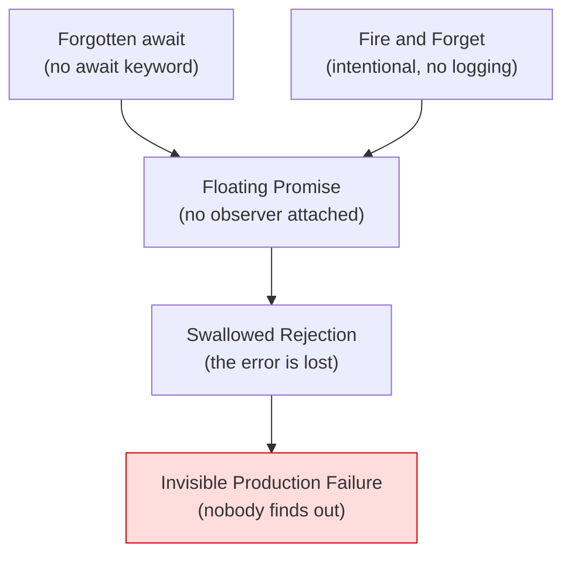

# Async Error-Handling Anti-Patterns — Junior

> **Category:** [Async Anti-Patterns](../README.md) → **Error Handling** — *errors that fall on the floor instead of propagating.*
> **Covers (collectively):** Swallowed Promise Rejection · Floating Promise · Fire and Forget (Without Logging) · Forgotten `await`

---

## Table of Contents

1. [Introduction](#introduction)
2. [Prerequisites](#prerequisites)
3. [Glossary](#glossary)
4. [The Four at a Glance](#the-four-at-a-glance)
5. [Swallowed Promise Rejection](#swallowed-promise-rejection)
6. [Floating Promise](#floating-promise)
7. [Fire and Forget (Without Logging)](#fire-and-forget-without-logging)
8. [Forgotten `await`](#forgotten-await)
9. [How They Reinforce Each Other](#how-they-reinforce-each-other)
10. [A Quick Spotting Checklist](#a-quick-spotting-checklist)
11. [Common Mistakes](#common-mistakes)
12. [Test Yourself](#test-yourself)
13. [Cheat Sheet](#cheat-sheet)
14. [Summary](#summary)
15. [Further Reading](#further-reading)
16. [Related Topics](#related-topics)

---

## Introduction

> Focus: **What does it look like?** and **Why is it bad?**

Synchronous error handling is forgiving. If a function throws and nobody catches it, the program crashes loudly — you get a stack trace, a red screen, an exit code. The failure is impossible to miss.

Asynchronous error handling is the opposite. An async operation can fail **and your program keeps running as if nothing happened.** The error doesn't bubble up the call stack you're looking at, because by the time it fails, that call stack is long gone — the operation finished *later*, on its own. If no observer is attached at the right moment, the error simply vanishes. No crash, no log, no trace. The bug ships, and you only learn about it from a confused user three weeks later.

Every anti-pattern in this file produces the same outcome: **a failure that nobody sees.** They differ only in *how* the observer goes missing:

- **Swallowed Promise Rejection** — you attached a success handler but no error handler.
- **Floating Promise** — you attached *no* handler at all; the Promise just drifts off.
- **Fire and Forget (Without Logging)** — you intentionally don't wait, but you also don't log, so failures are invisible in production.
- **Forgotten `await`** — you forgot to wait for the value, so you operate on a *Promise* as if it were the *result*.

At the junior level your goal is to **recognize each shape on sight** and to build two reflexes: *every async call gets either an `await` inside a `try/catch`, or an explicit `.catch()`.* That single habit eliminates most of this category.

> **The mindset shift:** in async code, "it didn't crash" does **not** mean "it worked." Silence is the most dangerous outcome, because a silent failure is a bug you can't even see yet.

The canonical language for these patterns is **JavaScript/TypeScript**, where Promises and `async`/`await` are built into the language — so that's our primary example throughout. We show **Python `asyncio`** equivalents alongside, and note how **Go**'s error-as-value model reshapes the same mistakes.

---

## Prerequisites

- **Required:** You can write and call an `async` function and you know that `await` pauses until a Promise settles. Examples are primarily JavaScript/TypeScript, with Python and Go alongside.
- **Required:** You understand that an async function returns *immediately* — it hands back a Promise (JS) / coroutine or Task (Python) / and in Go, that goroutines run independently. The work finishes *later*.
- **Helpful:** You've used `try`/`catch` for synchronous errors and know the difference between a *thrown* error and a *returned* error value.
- **Helpful:** You've seen the warning `UnhandledPromiseRejection` in Node, or `coroutine ... was never awaited` in Python, at least once — and wondered what it meant.

---

## Glossary

| Term | Definition |
|------|-----------|
| **Promise / Future** | An object representing a value that isn't ready yet. It is *pending*, then settles as either **fulfilled** (has a value) or **rejected** (has an error). Python calls the rough equivalent a *coroutine* / *Future*; Go has no direct analog — it uses goroutines + channels + returned errors. |
| **Rejection** | The async equivalent of a thrown exception: a Promise that settled with an error instead of a value. A rejection is only "handled" if something is attached to receive it. |
| **`unhandledRejection`** | A runtime-level event fired when a Promise rejects and *no* handler was ever attached. In modern Node it crashes the process by default; in browsers it logs to the console. It is the runtime shouting "you dropped an error." |
| **Microtask** | A tiny unit of work the runtime runs right after the current synchronous code, before the next timer or I/O. `.then` / `.catch` callbacks and code after `await` run as microtasks. This is *why* errors arrive "later" than the line that started them. |
| **`await`** | The keyword that pauses an `async` function until a Promise settles, then *unwraps* it: a fulfilled value is returned, a rejection is *thrown* (so `try/catch` can catch it). Without `await`, you hold the Promise itself, not the value. |
| **Event loop** | The single-threaded scheduler that runs your synchronous code, then drains queued microtasks and macrotasks (timers, I/O). Async code is cooperative multitasking on one thread — there is no second thread catching your dropped errors. |
| **Fire-and-forget** | Starting an async task and deliberately *not* waiting for it. Legitimate sometimes, but dangerous when done without logging, because its failures have no observer. |

---

## The Four at a Glance

| Anti-pattern | One-line symptom | The smell you feel |
|---|---|---|
| **Swallowed Promise Rejection** | `p.then(onOk)` with no `.catch` | "It works in the happy path; failures just... disappear." |
| **Floating Promise** | `doAsync();` — no `await`, no `.then`, no `.catch` | "Why didn't my function wait? Why is this error a mystery?" |
| **Fire and Forget (no logging)** | Background task started, no log on failure | "It failed in prod and we have zero record of it." |
| **Forgotten `await`** | `const u = getUser(); u.name` → `undefined` | "Why is this `undefined`? Why does it say `[object Promise]`?" |

All four are **observer-missing** anti-patterns: the failure happens, but nobody is positioned to notice. You spot them by asking one question of every async call — *"if this fails, who finds out?"*

---

## Swallowed Promise Rejection

### What it looks like

You attach a *success* handler to a Promise with `.then(...)` but forget the *failure* handler. The happy path works perfectly in testing. Then the operation rejects in production, and the rejection has nowhere to go.

```javascript
// JavaScript — the success handler is there; the error handler is not.
function loadProfile(userId) {
  fetchUser(userId).then((user) => {
    render(user);           // runs fine when fetchUser resolves
  });
  // No .catch(). If fetchUser rejects (network down, 500, timeout),
  // the rejection is UNHANDLED. No error reaches your code.
}
```

The Promise rejects, the rejection finds no handler, and it becomes an `unhandledRejection` event — which, depending on the runtime, either crashes the process, logs a cryptic warning, or is silently ignored.

```python
# Python asyncio — the same shape: an exception raised in a task with no
# one to receive it. Here, create_task launches it, but nothing awaits
# the result, so the exception is logged late (or lost) as "never retrieved".
import asyncio

async def load_profile(user_id):
    asyncio.create_task(fetch_user(user_id))  # fire it...
    # ...but never `await` the task, so if fetch_user raises,
    # asyncio only complains when the task is garbage-collected.
```

```go
// Go — errors are values, not thrown. The analog is calling something
// that returns an error and ignoring it with the blank identifier.
user, _ := fetchUser(userID) // the _ silently discards the error
render(user)                 // user may be a zero value; nobody knows it failed
```

### Why it's bad

- **Failures are invisible.** The whole point of error handling is to *do something* when things go wrong — retry, show a message, log. With no handler, none of that happens.
- **The symptom is far from the cause.** Users see a blank screen or a half-loaded page; you see nothing, because no error was reported where you'd look.
- **Runtime behavior is unpredictable.** "Unhandled rejection" might crash the process, might just warn — so the *same bug* behaves differently across Node versions, browsers, and environments.

### The junior fix

Every `.then()` that can reject needs a `.catch()`. Better still, switch to `async`/`await` with `try/catch`, which makes the error path impossible to forget visually.

```javascript
// Fix 1: add .catch
fetchUser(userId)
  .then(render)
  .catch((err) => showError("Could not load profile", err));

// Fix 2 (preferred): async/await + try/catch reads like sync code
async function loadProfile(userId) {
  try {
    const user = await fetchUser(userId); // rejection becomes a thrown error
    render(user);
  } catch (err) {
    showError("Could not load profile", err);
  }
}
```

> **Smell test:** you see `.then(` somewhere and your eyes scan down for the matching `.catch(` — and there isn't one. That gap *is* the bug.

---

## Floating Promise

### What it looks like

A **Floating Promise** is an async call written as if it were synchronous and fire-able: you call the function, but you attach *nothing* — no `await`, no `.then`, no `.catch`. The Promise is created, starts running, and floats away with no string tied to it.

```javascript
// JavaScript — saveAudit returns a Promise that is never awaited or caught.
async function checkout(cart) {
  const order = await placeOrder(cart);  // this one is awaited — good
  saveAuditLog(order);                    // FLOATING: no await, no .catch
  return order;                           // returns before the audit even finishes
}
```

Two things go wrong at once. First, `checkout` returns *before* `saveAuditLog` completes — so the caller thinks the whole job is done when it isn't. Second, if `saveAuditLog` rejects, it's an unhandled rejection (the Swallowed Rejection problem) — *nobody* finds out.

```python
# Python asyncio — calling an async function WITHOUT await doesn't even run it.
async def checkout(cart):
    order = await place_order(cart)
    save_audit_log(order)   # BUG: this just creates a coroutine object and
                            # discards it. The body never executes at all.
    return order
# Python warns at runtime: "coroutine 'save_audit_log' was never awaited"
```

> Note the subtle difference: in **JavaScript**, a floating Promise *does* run (it just isn't waited on or caught). In **Python**, an un-awaited coroutine *never runs at all* — calling it only builds the coroutine object. Same anti-pattern, two different failure modes.

```go
// Go — the analog is launching a goroutine and ignoring whether it failed.
func checkout(cart Cart) (Order, error) {
    order, err := placeOrder(cart)
    if err != nil {
        return Order{}, err
    }
    go saveAuditLog(order) // fire-and-forget goroutine; if it errors,
    return order, nil      // there is no channel/errgroup to report it.
}
```

### Why it's bad

- **The function lies about completion.** It returns before its async work finishes, so callers can't trust that "returned" means "done."
- **Rejections are unhandled.** A floating Promise that fails is, by definition, a swallowed rejection — these two anti-patterns are the same root with different names.
- **Order of operations breaks.** Code that should run after the floating work runs *before* it, producing race-like bugs that are maddening to reproduce.

### The junior fix

Decide explicitly: do you need to wait for this, or not?

- **If you need the result or need it to finish first → `await` it** (inside `try/catch`).
- **If you genuinely don't want to wait → make that intent explicit**, and attach a `.catch` so a failure is at least logged. In TypeScript, prefix with `void` to tell the linter "yes, I meant to not await this."

```javascript
// You need it done before returning → await it.
async function checkout(cart) {
  const order = await placeOrder(cart);
  await saveAuditLog(order);   // now checkout truly finishes when it returns
  return order;
}

// You truly don't need to wait → say so, and never drop the error.
void saveAuditLog(order).catch((err) => logger.error("audit failed", err));
```

> **Smell test:** an async function is called on its own line, its return value is thrown away, and there's no `await` in front of it. Ask: *"Did I mean to wait for this?"* Almost always, yes.

---

## Fire and Forget (Without Logging)

### What it looks like

Sometimes you *deliberately* don't wait for a task — sending a metric, warming a cache, kicking off a non-critical email. That's a legitimate **fire-and-forget**. It becomes an anti-pattern the moment you fire it **without any observability**: no `.catch`, no log, no metric. When it fails in production, there is zero record it ever existed.

```javascript
// JavaScript — intentional background work, but failures vanish completely.
function onUserSignup(user) {
  createAccount(user);          // critical — but ALSO floating (separate bug)
  sendWelcomeEmail(user);       // fire-and-forget... with no logging
  trackSignupMetric(user);      // fire-and-forget... with no logging
}
// If sendWelcomeEmail throws (SMTP down), no one ever knows. Users silently
// stop receiving welcome emails and there is no trail to discover it.
```

```python
# Python — a background task stored nowhere and never logged.
async def on_user_signup(user):
    asyncio.create_task(send_welcome_email(user))  # no error handler attached
    # If it raises, asyncio logs "Task exception was never retrieved" only
    # when the task is GC'd — easy to miss, and you have no app-level signal.
```

```go
// Go — a goroutine with no error path is the classic "forget" in Go.
func onUserSignup(user User) {
    go sendWelcomeEmail(user) // returned error (if any) is discarded by `go`
    // No log line, no metric. Failures are completely invisible.
}
```

### Why it's bad

- **Production failures leave no trace.** Unlike the Swallowed Rejection (where the runtime may at least warn), a deliberately fired task that fails quietly looks *identical* to one that succeeded.
- **You debug blind.** "Users say they didn't get the email" — and you have no logs, no metrics, no way to confirm or measure the failure rate.
- **Failures compound silently.** A 5%-failing background task is invisible until it's a 50%-failing background task and someone notices the business impact.

### The junior fix

Fire-and-forget is fine — *forget-and-go-silent* is not. At minimum, **capture and log** every failure. Never let a background task reject into the void.

```javascript
// Always attach a handler that logs (and ideally emits a metric).
function fireAndForget(promise, label) {
  promise.catch((err) => logger.error(`background task failed: ${label}`, err));
}

function onUserSignup(user) {
  fireAndForget(sendWelcomeEmail(user), "welcome-email");
  fireAndForget(trackSignupMetric(user), "signup-metric");
}
```

```python
# Python — store the task (so it isn't GC'd) AND attach a done-callback to log.
def fire_and_forget(coro, label):
    task = asyncio.create_task(coro)
    task.add_done_callback(
        lambda t: logger.error("background task failed: %s", label, exc_info=t.exception())
        if t.exception() else None
    )
    return task  # keep a reference somewhere so it survives until done
```

> **Smell test:** you find a background task and ask "where does its error go?" — and the honest answer is "nowhere." If a task can fail, its failure must be *logged*, even when you don't wait for its result.

---

## Forgotten `await`

### What it looks like

You call an async function and assign its result — but you forget the `await`. Now your variable holds a **Promise**, not the value inside it. The next line treats the Promise as if it were the result, and everything quietly goes wrong.

```javascript
// JavaScript — the missing word is `await`.
async function greet(userId) {
  const user = getUser(userId);   // BUG: user is a Promise<User>, not a User
  console.log(user.name);         // undefined — a Promise has no `.name`
  return `Hello, ${user.name}`;   // "Hello, undefined"
}
```

`user` is a `Promise`. `Promise` objects have no `.name` property, so `user.name` is `undefined` — no error thrown, just a wrong value flowing downstream. Worse, if you stringify the Promise you get the literal `[object Promise]`.

```python
# Python — forgetting await leaves you holding a coroutine object.
async def greet(user_id):
    user = get_user(user_id)   # BUG: `user` is a coroutine, not the result
    print(user.name)           # AttributeError: 'coroutine' object has no attribute 'name'
    # Python also warns: "coroutine 'get_user' was never awaited"
```

> Python is slightly kinder here: a coroutine object has no `.name`, so you usually get a loud `AttributeError` *and* a "never awaited" warning. JavaScript is quieter — `Promise.name` is just `undefined`, so the bug slips through to your output.

```go
// Go — there is no `await`, so this specific mistake can't happen the same way.
// The closest analog: forgetting that a result isn't ready until a goroutine
// finishes, and reading a variable before a sync point (channel/WaitGroup).
// Go's type system + the explicit (value, error) return shape make
// "I used the wrapper instead of the value" far harder to write by accident.
```

### Why it's bad

- **Silent wrong values (in JS).** No crash — just `undefined`, `NaN`, or `[object Promise]` propagating through your logic and into the user's face.
- **The `if` trap.** A Promise is always *truthy*. So `if (await isAllowed())` (correct) versus `if (isAllowed())` (forgotten `await`) — the forgotten version is **always true**, silently bypassing your security or validation check.
- **It hides until far away.** The wrong value may travel through several functions before it causes a visible symptom, making the real cause hard to trace.

### The junior fix

`await` the call. Then lean on tooling so you never rely on memory:

- **TypeScript types** catch most of these at compile time: `Promise<User>` is not assignable to `User`, so `user.name` is a type error before it ever runs.
- **The ESLint rule [`@typescript-eslint/no-floating-promises`](https://typescript-eslint.io/rules/no-floating-promises/)** flags un-awaited Promises; **`require-await`** and **`no-misused-promises`** catch related mistakes.

```typescript
// Add the keyword; let the type checker back you up.
async function greet(userId: string): Promise<string> {
  const user = await getUser(userId);   // user: User
  return `Hello, ${user.name}`;          // type-safe, correct
}
```

> **Smell test:** you assigned from a function you *know* is async, but there's no `await` on that line. Or you see `[object Promise]` / unexpected `undefined` in output. Or an `if` condition is "always true." Check for a missing `await`.

---

## How They Reinforce Each Other

These four are not independent — they collapse into one another. A Forgotten `await` *is* a Floating Promise; a Floating Promise that fails *is* a Swallowed Rejection; a Fire-and-Forget without logging is the deliberate version of the same hole.



Read it as a funnel: **all roads lead to an invisible failure.**

- You **forget `await`** → the Promise is now unattended → it's a **Floating Promise**.
- A Floating Promise that **rejects** has no handler → it's a **Swallowed Rejection**.
- Choosing **Fire-and-Forget** but skipping the log lands in the same place by a different door.
- The end state is always identical: **a failure with no observer.**

The practical lesson: you don't need to memorize four separate fixes. One reflex covers the whole category — *every async call gets either `await` (inside `try/catch`) or an explicit `.catch()` that logs.*

---

## A Quick Spotting Checklist

Run this over any async code you touch this week:

- [ ] Is there a `.then(` with no matching `.catch(`? → **Swallowed Rejection**
- [ ] Is an async function called on its own line with no `await` and no `.then`/`.catch`? → **Floating Promise**
- [ ] Is there a background task whose failure goes to *nowhere* (no log, no metric)? → **Fire and Forget without logging**
- [ ] Did you assign from an async function with no `await`, or are you seeing `undefined` / `[object Promise]`? → **Forgotten `await`**
- [ ] For every async call, can you answer *"if this fails, who finds out?"* If the answer is "nobody" → one of the four.

If you check any box, you've found a silent-failure waiting to ship.

---

## Common Mistakes

Mistakes juniors make *about* this category (not just the patterns themselves):

1. **Thinking "no crash" means "it worked."** In async code, silence is the *worst* signal, not the best. A swallowed rejection produces no crash *and* no result.
2. **Adding `.catch(() => {})` to "fix" the warning.** An empty catch silences the unhandled-rejection warning while making the bug *worse* — now the error is swallowed *on purpose*. Log it; don't muzzle it.
3. **Assuming a forgotten `await` will throw.** In JavaScript it usually doesn't — you get `undefined` or `[object Promise]`. The damage is silent. (Python is louder, which is why its "never awaited" warning is a gift.)
4. **Believing fire-and-forget is always wrong.** It isn't. The anti-pattern is fire-and-forget *without logging*. Background work is legitimate — invisible background work is not.
5. **Trusting `if (someAsyncCheck())` without `await`.** A Promise is always truthy, so the condition is always true. This is how forgotten `await` silently disables a security or validation gate.
6. **Relying on memory instead of tooling.** Humans forget `await`. Linters (`no-floating-promises`) and TypeScript's types don't. Turn them on and let the machine catch what you miss.

---

## Test Yourself

1. Name the four async error-handling anti-patterns and give the one-line symptom of each.
2. In JavaScript, what is the actual value of `user` after `const user = getUser(id);` if `getUser` is `async` and you forgot `await`? What does `user.name` evaluate to?
3. What is the difference between a **Floating Promise** and **Fire-and-Forget**? (Hint: it's about *intent*.)
4. Why is `someCheck().then(doThing)` — with no `.catch` — dangerous, even though it "works" in your tests?
5. Fix this so failures are never silent and the function truly completes its work before returning:
   ```javascript
   async function publish(post) {
     savePost(post);
     notifyFollowers(post);
     return post.id;
   }
   ```

---

## Cheat Sheet

| Anti-pattern | Spot it by | Fix it with |
|---|---|---|
| **Swallowed Promise Rejection** | `.then(` with no matching `.catch(` | Add `.catch()`, or use `await` inside `try/catch` |
| **Floating Promise** | Async call alone on a line, no `await`/`.then`/`.catch` | `await` it (in `try/catch`), or `void p.catch(log)` if intentional |
| **Fire and Forget (no logging)** | Background task whose failure goes nowhere | Always `.catch()` and **log**; ideally emit a metric |
| **Forgotten `await`** | `undefined` / `[object Promise]`; always-true `if` | Add `await`; enable TS types + `no-floating-promises` |

> **One rule to remember:** *every async call gets either an `await` inside `try/catch`, or an explicit `.catch()` that logs. No async call leaves the room without an observer.*

---

## Summary

- **Async error-handling anti-patterns** all produce the same outcome: **a failure that nobody sees.** In async code, "it didn't crash" does not mean "it worked" — silence is the danger.
- **Swallowed Rejection** = `.then` with no `.catch`. **Floating Promise** = no handler at all. **Fire-and-Forget without logging** = intentional, but invisible. **Forgotten `await`** = you hold the Promise instead of the value.
- These four **collapse into each other** — a forgotten `await` becomes a floating Promise becomes a swallowed rejection. So one reflex covers them all: *`await` it in `try/catch`, or `.catch()` and log it.*
- **JavaScript** is the canonical home (Promises are native); **Python `asyncio`** has the same shapes (with louder "never awaited" warnings); **Go** sidesteps several of them with errors-as-values and explicit goroutine coordination.
- At the junior level, lean on **tooling** — TypeScript types and the `no-floating-promises` lint rule catch the forgotten-`await` family before runtime.
- Next: [`middle.md`](middle.md) — *how to handle these correctly under real load: propagating errors across boundaries, retrying transient failures, and supervising background tasks.*

---

## Further Reading

- **JavaScript: The Definitive Guide** — David Flanagan (7th ed., 2020) — the `async`/`await` chapter and its section on Promise error handling.
- **You Don't Know JS: Async & Performance** — Kyle Simpson — why errors "arrive later" (event loop + microtasks) and how rejections propagate.
- **MDN — [Using Promises](https://developer.mozilla.org/en-US/docs/Web/JavaScript/Guide/Using_promises)** — the official guide, including the "Common mistakes" section on chaining and error handling.
- **Node.js docs — [`unhandledRejection`](https://nodejs.org/api/process.html#event-unhandledrejection)** — what the runtime does when you drop a rejection.
- **Python docs — [`asyncio` Developer Guide](https://docs.python.org/3/library/asyncio-dev.html)** — covers the "coroutine was never awaited" and "task exception was never retrieved" warnings.
- **typescript-eslint — [`no-floating-promises`](https://typescript-eslint.io/rules/no-floating-promises/)** — the lint rule that catches most of this category automatically.

---

## Related Topics

- [Execution Shape Anti-Patterns](../02-execution-shape/junior.md) — the sibling category: `await` in a loop, Promise chain hell, mixing callbacks and Promises.
- [Misuse Anti-Patterns](../03-misuse/junior.md) — the Promise constructor anti-pattern and `async` without `await`.
- [Async Anti-Patterns (category overview)](../README.md) — all nine async anti-patterns and how they relate.
- Clean Code → Error Handling — the positive principles: never swallow, fail loudly, handle at the right boundary.
- Clean Code → Async and Functional — writing async code that reads clearly and handles errors by design.

---

## Check your understanding

1. Explain Async Error-Handling Anti-Patterns — Junior Level in your own words and name the problem it solves.
2. How would you apply the ideas around Table of Contents, Introduction, Prerequisites in a realistic engineering change?
3. What failure mode or misuse should you look for, and what evidence would reveal it?
4. What small example would prove that you can apply Async Error-Handling Anti-Patterns — Junior Level correctly?
5. What observable result would convince you that the approach improved the system?
