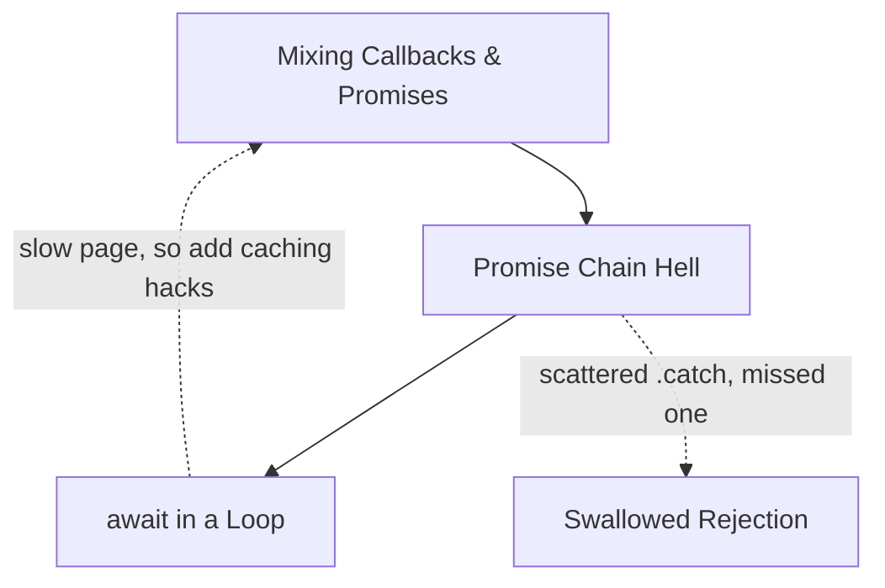

# Execution-Shape Anti-Patterns — Junior

> **Category:** [Async Anti-Patterns](../README.md) → **Execution Shape** — *async control flow that runs differently than the code reads.*
> **Covers (collectively):** `await` in a Loop · Promise Chain Hell / Callback Pyramid · Mixing Callbacks and Promises

---

## Table of Contents

1. [Introduction](#introduction)
2. [Prerequisites](#prerequisites)
3. [Glossary](#glossary)
4. [The Three at a Glance](#the-three-at-a-glance)
5. [`await` in a Loop](#await-in-a-loop)
6. [Promise Chain Hell / Callback Pyramid](#promise-chain-hell--callback-pyramid)
7. [Mixing Callbacks and Promises](#mixing-callbacks-and-promises)
8. [How They Reinforce Each Other](#how-they-reinforce-each-other)
9. [Quick Spotting Checklist](#quick-spotting-checklist)
10. [Common Mistakes](#common-mistakes)
11. [Test Yourself](#test-yourself)
12. [Cheat Sheet](#cheat-sheet)
13. [Summary](#summary)
14. [Further Reading](#further-reading)
15. [Related Topics](#related-topics)

---

## Introduction

> Focus: **What does it look like?** and **Why is it bad?** — plus the one basic fix for each.

These three anti-patterns all corrupt the same thing: **the shape of execution**. The code *reads* one way and *runs* another.

- You write a loop that looks like "do these N things" — and it quietly does them **one at a time**, ten times slower than it needed to.
- You write a chain of `.then(...).then(...)` that drifts so far to the right it becomes a staircase nobody can follow.
- You write a function that *both* takes a callback *and* returns a Promise, so callers can't tell which one is the truth — and sometimes both fire.

None of these are "bugs" in the sense that the program crashes immediately. They are **shape problems**: the code works on the happy path, passes a quick manual test, and then bites you with slowness, double-execution, or unreadability later. At the junior level your job is to **see the shape** and apply the standard fix:

- `await` in a loop over *independent* work → `Promise.all(items.map(...))`.
- Nested `.then` pyramid → flatten with `async`/`await`.
- Callback + Promise mixed → pick **one** model; in Node, use `util.promisify`.

> **The mindset shift:** in async code, *"it ran and returned a value"* is not the whole story. **How** it ran — serial or parallel, once or twice, on the callback path or the Promise path — is the part that costs you in production.

---

## Prerequisites

- **Required:** You can write a `function`, an `async function`, and a `for...of` loop in JavaScript or TypeScript.
- **Required:** You know that `await someAsyncFn()` pauses the current async function until the Promise settles, then gives you the resolved value.
- **Helpful:** You've seen a Node-style callback (`fn(args, (err, result) => {...})`) at least once.
- **Helpful (Python track):** Basic `asyncio` — you can write `async def`, `await`, and have seen `asyncio.gather`.
- **Helpful:** You've felt the pain — a page that loads slowly because it fetches things one by one, or a `.then` chain you couldn't read.

---

## Glossary

| Term | Definition |
|------|-----------|
| **Concurrency** | *Dealing with* many tasks in overlapping time. In single-threaded JS, while one task waits on I/O, another can make progress. |
| **Parallelism** | Many tasks literally running *at the same instant* (multiple cores). For I/O-bound async work the distinction rarely matters — what you want is *overlap*, and people loosely call it "running in parallel." |
| **`Promise.all`** | Takes an array of Promises, runs them concurrently, and resolves to an array of results **once all succeed**. If **any** rejects, the whole thing rejects immediately. |
| **`Promise.allSettled`** | Like `Promise.all` but waits for *every* Promise and returns each outcome (`{status: 'fulfilled'|'rejected', ...}`) — one failure does not abort the rest. |
| **Microtask** | A tiny unit of work the engine runs after the current synchronous code finishes — `.then` callbacks and code after `await` resume as microtasks. |
| **`util.promisify`** | A Node.js helper that converts a callback-style function (`(err, result) => ...`) into one that returns a Promise — the correct, safe way to bridge the two models. |
| **Callback** | A function passed in to be called later with the result (or error). The original async style, before Promises. |
| **Independent work** | Tasks where none needs the *output* of another. These can overlap. The opposite is **dependent work** — step B needs step A's result. |

---

## The Three at a Glance

| Anti-pattern | One-line symptom | The smell you feel |
|---|---|---|
| **`await` in a Loop** | `for (const x of xs) { await f(x) }` over independent work | "Why is this page so slow? It's just fetching a list." |
| **Promise Chain Hell** | `.then(a => .then(b => .then(c => ...)))` marching right | "I can't tell which `.then` belongs to which." |
| **Mixing Callbacks and Promises** | A function takes a callback **and** returns a Promise | "Do I `await` this or pass a callback? Both?" |

The first is a **performance** shape problem (correct but slow). The second is a **readability** shape problem. The third is a **correctness** shape problem (the callback can fire twice, or errors leak). Read each section for the shape, why it bites, and the fix.

---

## `await` in a Loop

### What it looks like

You have a list and you want a result for each item. The obvious code is a loop with `await` inside:

```javascript
// JavaScript — fetch a profile for each user id, ONE AT A TIME
async function loadProfiles(userIds) {
  const profiles = [];
  for (const id of userIds) {
    const profile = await fetchProfile(id); // ← waits for THIS before starting the next
    profiles.push(profile);
  }
  return profiles;
}
```

This reads like "fetch all the profiles." It actually means: *fetch #1, wait for it to come back, then fetch #2, wait, then #3...* If each fetch takes 200 ms and there are 10 users, this takes **~2 seconds** — when it could take ~200 ms.

The Python equivalent has the same trap:

```python
# Python asyncio — same serial mistake
import asyncio

async def load_profiles(user_ids):
    profiles = []
    for uid in user_ids:
        profile = await fetch_profile(uid)  # ← serialized
        profiles.append(profile)
    return profiles
```

### Why it's bad

- **It's needlessly slow.** Independent I/O that *could* overlap is forced into a single-file line. Total time = sum of all calls instead of the time of the slowest one.
- **It doesn't read as serial.** A reviewer skims "loop over ids, fetch each" and assumes it's fast. The serialization is invisible.
- **It scales badly.** 10 users is annoying; 1,000 users is a timeout. The cost grows linearly with the list.

Here is the difference, drawn as a timeline:


Serial finishes at 600 ms; parallel finishes at ~200 ms.

### The junior-level fix

When the items are **independent**, start them all and wait for the batch. The standard JS idiom is `Promise.all` over a `.map`:

```javascript
// JavaScript — start all fetches, then wait for the whole batch
async function loadProfiles(userIds) {
  return Promise.all(userIds.map(id => fetchProfile(id)));
}
// or shorter, since fetchProfile takes one arg:
// return Promise.all(userIds.map(fetchProfile));
```

`userIds.map(...)` builds an array of Promises that are **already in flight**; `Promise.all` resolves to the array of results in the same order. (`map` preserves order even though the fetches finish out of order.)

The Python equivalent is `asyncio.gather`:

```python
# Python asyncio — run all concurrently
import asyncio

async def load_profiles(user_ids):
    return await asyncio.gather(*(fetch_profile(uid) for uid in user_ids))
```

> **Error note:** `Promise.all` / `gather` reject as soon as **one** task fails, and you lose the successful results. If you want *every* result regardless of individual failures, use `Promise.allSettled` (JS) or `asyncio.gather(..., return_exceptions=True)` (Python). That nuance is `middle.md` territory — for now, just know the tool exists.

### When sequential `await` is actually REQUIRED

This is the critical caveat: **`await` in a loop is only an anti-pattern when the iterations are independent.** Sometimes each step *depends on the previous one's result*, and serial is correct:

```javascript
// CORRECT serial: pagination — each page needs the previous page's cursor
async function fetchAllPages(api) {
  const all = [];
  let cursor = null;
  do {
    const page = await api.fetch(cursor); // ← MUST wait: next cursor comes from this page
    all.push(...page.items);
    cursor = page.nextCursor;
  } while (cursor);
  return all;
}
```

You **cannot** parallelize this — you don't know page 2's cursor until page 1 returns. Other legitimately-serial cases:

- **Ordered side effects** — step B must commit only after step A succeeded (e.g. "create account, *then* charge card, *then* send receipt").
- **Rate limits / backpressure** — you deliberately do one-at-a-time (or N-at-a-time) to avoid overwhelming a downstream service. (Bounded concurrency with a limiter is `middle.md`.)

> **Smell test:** ask *"does iteration N+1 need the result of iteration N?"* If **no** → it's the anti-pattern; use `Promise.all`. If **yes** → the serial `await` is correct, leave it. The bug is parallelizable work written serially, not all serial loops.

---

## Promise Chain Hell / Callback Pyramid

### What it looks like

Before `async`/`await`, you sequenced async steps by nesting. The old shape is the **callback pyramid** ("callback hell"):

```javascript
// JavaScript — callback pyramid: the staircase that marches right
getUser(userId, (err, user) => {
  if (err) return handle(err);
  getOrders(user, (err, orders) => {
    if (err) return handle(err);
    getInvoices(orders, (err, invoices) => {
      if (err) return handle(err);
      renderPage(invoices, (err, html) => {
        if (err) return handle(err);
        send(html); // ← the actual goal, buried 4 levels deep
      });
    });
  });
});
```

Promises were supposed to fix this — but a poorly-written chain just rebuilds the pyramid with `.then`:

```javascript
// JavaScript — Promise Chain Hell: nesting .then instead of chaining flatly
getUser(userId).then(user => {
  return getOrders(user).then(orders => {
    return getInvoices(orders).then(invoices => {
      return renderPage(invoices).then(html => {
        return send(html); // ← still buried, still drifting right
      });
    });
  });
});
```

Each `.then` callback opens *another* `.then` inside it, so you get the same rightward staircase — plus error handling scattered across every level.

### Why it's bad

- **It drifts right.** Like the [Arrow Anti-Pattern](../../01-development/01-bad-structure/junior.md), the meaningful line is the deepest one; everything around it is plumbing.
- **Error handling is duplicated or forgotten.** Each nested level needs its own `if (err)` (callbacks) or `.catch` (Promises). Miss one and a failure vanishes silently — see [Swallowed Promise Rejection](../01-error-handling/junior.md).
- **It's hard to change.** Inserting a step in the middle means re-indenting a whole block and re-threading the variables.

### The junior-level fix

Flatten it with `async`/`await`. Sequential async code then reads like ordinary top-to-bottom code, and a single `try/catch` covers every step:

```javascript
// JavaScript — flat, linear, one error handler
async function showInvoices(userId) {
  try {
    const user     = await getUser(userId);
    const orders   = await getOrders(user);
    const invoices = await getInvoices(orders);
    const html     = await renderPage(invoices);
    return send(html);
  } catch (err) {
    handle(err); // one place catches a failure from ANY step
  }
}
```

The Python `asyncio` version of the same flattening:

```python
# Python asyncio — flat sequential awaits, one try/except
async def show_invoices(user_id):
    try:
        user = await get_user(user_id)
        orders = await get_orders(user)
        invoices = await get_invoices(orders)
        html = await render_page(invoices)
        return await send(html)
    except SomeError as err:
        handle(err)
```

> **Note:** these steps *are* genuinely dependent (orders need the user, invoices need the orders), so the sequential `await`s are correct here — this is not an `await`-in-a-loop problem. We are flattening the *nesting*, not parallelizing. If some of the steps were independent, you'd combine flattening **with** `Promise.all` (`middle.md`).

> **Smell test:** if each `.then` callback contains *another* `.then` (instead of returning a Promise that the *next* flat `.then` handles), or your indentation marches right step by step, flatten it to `async`/`await`.

---

## Mixing Callbacks and Promises

### What it looks like

A function that can't decide which async style it speaks. It **takes a callback** *and* **returns a Promise**, so callers don't know which contract to trust:

```javascript
// JavaScript — a function speaking both languages at once
function loadConfig(path, callback) {
  return readFile(path)              // returns a Promise...
    .then(data => {
      const config = JSON.parse(data);
      callback(null, config);        // ...AND also calls the callback
      return config;
    });
}

// Caller A awaits it:        const cfg = await loadConfig('a.json');
// Caller B passes a callback: loadConfig('a.json', (e, cfg) => {...});
// Both "work" — until they don't.
```

The other common version is **hand-wrapping a callback API** into a Promise and getting it subtly wrong:

```javascript
// JavaScript — hand-rolled wrapper with a bug
function readFilePromise(path) {
  return new Promise((resolve, reject) => {
    fs.readFile(path, (err, data) => {
      if (err) reject(err);
      resolve(data); // ← BUG: runs even after reject; missing `return`/`else`
    });
  });
}
```

### Why it's bad

- **Errors can leak or fire twice.** In the wrapper above, on error it calls `reject(err)` *and then* `resolve(data)` with `undefined` — a settled Promise ignores the second call, but the bug hides real failures and confuses readers. (A Promise can only settle once, so whichever runs *first* wins — here both run, which is a clear smell.)
- **Callbacks can be invoked twice.** If a function both `.then`s *and* fires a callback, an error path may call the callback once for success and the runtime may also reject the returned Promise — double notifications, double side effects.
- **Nobody knows the contract.** Half the callers `await`, half pass callbacks. The function has two truths and they drift apart over time.

### The junior-level fix

**Pick one model.** For modern code that means Promises (`async`/`await`). Don't both-return-and-callback:

```javascript
// JavaScript — ONE model: returns a Promise, no callback parameter
async function loadConfig(path) {
  const data = await readFile(path);
  return JSON.parse(data);
}
// Every caller: const cfg = await loadConfig('a.json');
```

To bridge an existing **Node-style callback** API into a Promise, don't hand-roll it — use the built-in `util.promisify`, which handles the `(err, result)` convention correctly:

```javascript
// JavaScript (Node) — promisify a callback API the safe way
const util = require('util');
const fs = require('fs');

const readFile = util.promisify(fs.readFile);   // callback API → Promise API
// modern Node also ships fs.promises.readFile directly:
// const { readFile } = require('fs/promises');

async function loadConfig(path) {
  const data = await readFile(path, 'utf8');
  return JSON.parse(data);
}
```

If you *must* wrap by hand, the safe pattern always uses `return` (or `else`) so exactly one of `resolve`/`reject` runs:

```javascript
function readFilePromise(path) {
  return new Promise((resolve, reject) => {
    fs.readFile(path, (err, data) => {
      if (err) return reject(err); // ← return: nothing after this runs
      resolve(data);
    });
  });
}
```

Python rarely hits this because `asyncio` standardized on `async`/`await` and coroutines. The equivalent advice: don't mix callback-based libraries with coroutines ad hoc — wrap the callback API once with `loop.run_in_executor` or the library's async adapter, then `await` it everywhere:

```python
# Python — bridge a blocking/callback API once, then await it
import asyncio

async def load_config(path):
    loop = asyncio.get_running_loop()
    data = await loop.run_in_executor(None, read_file_blocking, path)
    return json.loads(data)
```

> **Smell test:** if a function signature has a `callback` parameter **and** you can `await` its return value, it speaks two languages. Pick one. And never hand-write `new Promise(...)` around a callback when `util.promisify` (or a `*/promises` module) already does it correctly.

---

## How They Reinforce Each Other

These three rarely show up alone — they grow out of the same habit of writing async code by feel instead of by shape:



- A codebase **mixing callbacks and Promises** can't use clean `async`/`await`, so sequential steps get expressed as nested `.then` → **Promise Chain Hell**.
- Once you're nesting `.then`s, batching independent work feels hard, so people fall back to a `for` loop with `await` inside → **`await` in a Loop**, now serialized and slow.
- Every nested level needs its own `.catch`; miss one and a rejection falls on the floor → [Swallowed Rejection](../01-error-handling/junior.md).

The cure for all three is the same first move: **adopt `async`/`await` consistently.** It flattens chains, makes serial-vs-parallel an explicit choice (`await` in sequence vs. `Promise.all`), and removes the temptation to mix models.

---

## Quick Spotting Checklist

Run this over any async code you touch this week:

- [ ] Is there a `for`/`forEach`/`while` loop with `await` inside, over items that **don't depend on each other**? → **`await` in a Loop** (use `Promise.all`).
- [ ] Does iteration N+1 actually need iteration N's result? → serial `await` is **correct**, leave it.
- [ ] Does a `.then` callback open *another* `.then` inside it, drifting right? → **Promise Chain Hell** (flatten to `async`/`await`).
- [ ] Does a function both take a `callback` parameter **and** return an awaitable? → **Mixing Models** (pick one).
- [ ] Do you see `new Promise((resolve, reject) => ...)` wrapping a Node callback by hand? → use `util.promisify` / a `promises` module instead.
- [ ] In a hand-rolled wrapper, can both `resolve` and `reject` run (missing `return`/`else`)? → bug; gate them.

If you check a box, you've usually found a small, safe change — not a rewrite.

---

## Common Mistakes

1. **Parallelizing dependent steps.** Slapping `Promise.all` onto work where step B needs step A's output produces a race or wrong data. `Promise.all` is for **independent** work only. Check dependency first.
2. **Thinking `forEach` with `async` runs serially or even waits.** `array.forEach(async x => await f(x))` does **neither** — `forEach` ignores the returned Promises, so it fires them all and *doesn't wait for any*. Use `for...of` + `await` (serial) or `Promise.all(array.map(...))` (parallel).
3. **Believing `async`/`await` is automatically parallel.** It is not. `await a(); await b();` runs `a` fully before `b` even starts. Parallel is opt-in via `Promise.all`.
4. **Forgetting `Promise.all` is all-or-nothing.** One rejection discards every other result. If you need partial results, reach for `Promise.allSettled`.
5. **Hand-wrapping callbacks without a `return` before `reject`.** Leads to "resolve runs after reject" bugs. Use `util.promisify`, or `return reject(...)`.
6. **Leaving a function that both callbacks and returns a Promise "because it's backwards compatible."** It's a trap — callers double-handle results. Migrate to one model.

---

## Test Yourself

1. Name the three execution-shape anti-patterns and give the one-line symptom of each.
2. This code fetches 5 independent reports and takes 5 seconds. Why, and how do you make it ~1 second?
   ```javascript
   async function getReports(ids) {
     const out = [];
     for (const id of ids) out.push(await fetchReport(id));
     return out;
   }
   ```
3. Here is a loop with `await` inside. Is it the anti-pattern or correct? Explain.
   ```javascript
   let node = head;
   while (node) {
     await save(node.value);
     node = await fetchNext(node.id);
   }
   ```
4. What is wrong with this wrapper, and what's the safe fix?
   ```javascript
   function getJson(url) {
     return new Promise((resolve, reject) => {
       request(url, (err, body) => {
         if (err) reject(err);
         resolve(JSON.parse(body));
       });
     });
   }
   ```
5. A teammate says "`async/await` made our list page parallel and fast." They replaced `.then` chains with `await` in a loop. Are they right?

---

## Cheat Sheet

| Anti-pattern | Spot it by | Fix it with |
|---|---|---|
| **`await` in a Loop** (independent work) | `for`/`while` with `await` inside; slow page over a list | `Promise.all(items.map(fn))` (JS) / `asyncio.gather(*coros)` (Py) |
| **Serial loop — but dependent** | iteration N+1 needs N's result (pagination, ordered side effects) | **Leave it** — serial is correct |
| **Promise Chain Hell** | `.then` nested inside `.then`, drifting right; scattered `.catch` | Flatten to `async`/`await` + one `try/catch` |
| **Mixing Callbacks & Promises** | function takes `callback` **and** returns awaitable; hand-rolled `new Promise` around a callback | Pick one model; `util.promisify` / `fs/promises`; `return reject(...)` |

> **One rule to remember:** *In async code, the shape — serial vs. parallel, one model vs. two — is the design decision. Make it on purpose, not by accident.*

---

## Summary

- **Execution-shape anti-patterns** make async code *run* differently than it *reads*. The program "works" but is slow, unreadable, or subtly double-firing.
- **`await` in a Loop** serializes independent work that could overlap — fix with `Promise.all(items.map(...))` (JS) or `asyncio.gather` (Python). But when each step **depends** on the previous (pagination, ordered effects), serial `await` is **correct** — always check dependency first.
- **Promise Chain Hell / Callback Pyramid** nests callbacks or `.then`s into a rightward staircase — flatten with `async`/`await` and a single `try/catch`.
- **Mixing Callbacks and Promises** gives a function two contracts and leaks or double-fires errors — pick **one** model, and use `util.promisify` instead of hand-wrapping callbacks.
- All three dissolve under the same habit: **adopt `async`/`await` consistently**, and decide serial-vs-parallel on purpose.
- Next: [`middle.md`](middle.md) — bounded concurrency (`p-limit`/semaphores), `Promise.allSettled` for partial results, and combining flattening *with* parallelism in real services.

---

## Further Reading

- **JavaScript: The Definitive Guide** — David Flanagan (7th ed., 2020) — the async/await chapter and Promise pitfalls.
- **You Don't Know JS: Async & Performance** — Kyle Simpson — callback hell, Promises, and the event loop, in depth.
- **MDN — `Promise.all` / `Promise.allSettled`** — reference and worked examples for batching concurrent work.
- **Node.js docs — `util.promisify`** — the canonical callback-to-Promise bridge.
- **Python docs — `asyncio.gather`** — running coroutines concurrently and collecting results.

---

## Related Topics

- [Async → Error Handling](../01-error-handling/junior.md) — the sibling category; flattening chains is also how you stop swallowing rejections.
- [Async Anti-Patterns (overview)](../README.md) — all 9 async anti-patterns and how they cluster.
- [Bad Structure → Arrow Anti-Pattern](../../01-development/01-bad-structure/junior.md) — Promise Chain Hell is the async cousin of arrow-shaped nesting.
- Clean Code → Async and Functional — the positive patterns for writing async code well.

---

## Check your understanding

1. Explain Execution-Shape Anti-Patterns — Junior Level in your own words and name the problem it solves.
2. How would you apply the ideas around Table of Contents, Introduction, Prerequisites in a realistic engineering change?
3. What failure mode or misuse should you look for, and what evidence would reveal it?
4. What small example would prove that you can apply Execution-Shape Anti-Patterns — Junior Level correctly?
5. What observable result would convince you that the approach improved the system?
