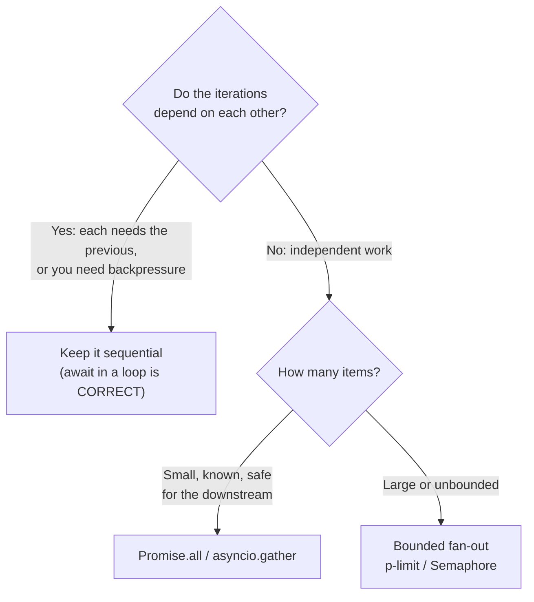

# Async Execution-Shape Anti-Patterns — Middle

> **Category:** [Async Anti-Patterns](../README.md) → **Execution Shape** — *code whose async control flow runs differently than it reads.*
> **Covers (collectively):** `await` in a Loop · Promise Chain Hell / Callback Pyramid · Mixing Callbacks and Promises

---

## Introduction

> Focus: **When does this creep in?** and **What do I do instead?**

At the junior level you learned to *read* async code correctly — to see that `await fetch(url)` inside a loop runs one request at a time, and that a five-deep `.then()` chain is doing sequentially what reads like a staircase. The middle-level skill is the **decision**: given a piece of async work, choosing the right *shape* — sequential, fully parallel, or bounded — and refactoring tangled chains into something a teammate can change six months from now without fear.

The trap at this level is over-correction. The first lesson everyone learns is "loops are slow, parallelize them," and the natural reflex becomes `Promise.all(items.map(...))` on *everything*. That reflex will eventually take down a downstream service or your own process: ten thousand simultaneous connections is not concurrency, it is a self-inflicted denial-of-service. The mature engineer knows that **`await` in a loop is sometimes exactly right**, that unbounded parallelism is a liability, and that the usually-correct answer is **bounded** fan-out.

This file is about choosing the execution shape on purpose, and about flattening the historical tangles (`.then` pyramids, callback nests, half-promisified APIs) into one consistent model.

---

## Prerequisites

- **Required:** Comfortable with [`junior.md`](junior.md) — you can trace what async code *does* versus what it *reads like*.
- **Required:** You understand `async`/`await`, that an `async` function returns a Promise, and that `await` suspends only the current function.
- **Helpful:** Familiarity with the error-handling siblings — a parallelized loop changes *when* and *how* errors surface (see [Error Handling](../01-error-handling/middle.md)).
- **Helpful:** Basic Python `asyncio` (`async def`, `await`, the event loop) if you work in both ecosystems.
- **Helpful:** You call external services (HTTP APIs, databases) where rate limits and connection pools are real.

---

## The Real Question: When Does This Creep In?

Execution-shape problems have predictable triggers. Name the moment and you can intervene:

| Trigger | What happens | Which anti-pattern |
|---|---|---|
| **"Just loop over the items and await each"** | N independent calls serialized; latency = sum, not max | `await` in a loop (the slow kind) |
| **"Parallelize it — wrap the map in `Promise.all`"** | Unbounded fan-out hammers a downstream / exhausts sockets/memory | Unbounded `Promise.all` (the trap) |
| **Pre-`async/await` code, or a habit from older codebases** | `.then().then().then()` grows a step at a time | Promise Chain Hell |
| **Wrapping a callback API to "use it with await"** | Hand-rolled `new Promise` that drops errors or resolves twice | Mixing callbacks and Promises |
| **A library that takes a callback *and* returns a Promise** | Callers invoke it both ways; one path never settles | Mixing callbacks and Promises |
| **"Add one more dependent step to the chain"** | Each `.then` reads from the previous; nesting deepens for closure access | Callback Pyramid |

The common thread: **the cheap reflex (await-each, or `Promise.all`-everything, or wrap-in-`new Promise`) is locally easy but globally wrong.** The middle engineer pauses to ask *are these calls independent?* and *how many fire at once?* before writing the loop.



---

## `await` in a Loop — Parallel vs Sequential

### How it forms

You have a list of work and the obvious code is a loop:

```js
// Serial: each fetch waits for the previous to finish. Total time ≈ sum of all latencies.
async function fetchAll(urls) {
  const results = [];
  for (const url of urls) {
    results.push(await fetch(url));   // ← suspends the whole loop on every iteration
  }
  return results;
}
```

For 50 URLs at 100 ms each, that is **5 seconds**. The calls are independent, so they *could* overlap and finish in ~100 ms. This is the classic accidental serialization.

### The decision that matters

Before changing anything, answer one question: **does each iteration depend on the previous one?**

**Independent → parallelize.** Map to Promises, then await them together:

```js
// Parallel: all requests start "at once"; total time ≈ the slowest single request.
async function fetchAll(urls) {
  return Promise.all(urls.map(url => fetch(url)));
}
```

```python
# Python asyncio — gather is the equivalent of Promise.all
import asyncio, aiohttp

async def fetch_all(session, urls):
    async with asyncio.TaskGroup() as tg:          # 3.11+: structured, cancels siblings on error
        tasks = [tg.create_task(session.get(u)) for u in urls]
    return [t.result() for t in tasks]
    # Pre-3.11 equivalent: return await asyncio.gather(*(session.get(u) for u in urls))
```

**Dependent → keep it sequential — and `await` in the loop is now *correct*.** When iteration *n* needs the result of *n−1*, there is nothing to parallelize:

```js
// Pagination: you cannot fetch page N+1 until page N tells you the next cursor.
async function fetchAllPages(client) {
  const all = [];
  let cursor = undefined;
  do {
    const page = await client.list({ cursor });   // genuinely sequential — depends on prior result
    all.push(...page.items);
    cursor = page.nextCursor;
  } while (cursor);
  return all;
}
```

**Backpressure → keep it sequential on purpose.** If you are writing to a slow sink (a rate-limited queue, a single DB connection, a file stream), serializing is a *feature*: it stops you from queuing a million in-flight operations the downstream cannot absorb. Awaiting each iteration is the simplest form of backpressure.

> **Rule:** `await` in a loop is a bug only when the iterations are **independent**. When each depends on the last, or you are deliberately throttling, it is the right shape. Don't let "loops are slow" turn into a reflex that breaks correctness.

### Watch the error semantics

`Promise.all` is **fail-fast**: the returned Promise rejects as soon as *any* input rejects, but the others keep running (they aren't cancelled in JS) and their rejections may go unobserved. If you need *all* outcomes regardless of failures, use `Promise.allSettled`:

```js
const results = await Promise.allSettled(urls.map(fetch));
const ok   = results.filter(r => r.status === "fulfilled").map(r => r.value);
const bad  = results.filter(r => r.status === "rejected").map(r => r.reason);
```

```python
# asyncio.gather is fail-fast by default; return_exceptions=True is the allSettled analogue.
results = await asyncio.gather(*coros, return_exceptions=True)
# Each entry is either a value or an Exception instance — inspect, don't assume success.
```

---

## The Trap: Unbounded `Promise.all` Is a DoS on Yourself

This is the single most important lesson at this level, and the reason "just use `Promise.all`" is dangerous advice.

```js
// Looks elegant. With 10,000 ids, it opens 10,000 simultaneous connections.
async function loadUsers(ids) {
  return Promise.all(ids.map(id => api.getUser(id)));   // ← unbounded fan-out
}
```

What actually happens with a large list:

- **You DoS the downstream.** Ten thousand concurrent requests can knock over the API you depend on, or trip its rate limiter and get you a wave of `429`s — turning a slow job into a *failed* job.
- **You exhaust local resources.** Each in-flight request holds a socket, a DNS entry, buffers, and a slice of memory. Tens of thousands at once can blow the file-descriptor limit, exhaust the connection pool, or OOM the process.
- **You lose all backpressure.** Everything starts at once; nothing throttles. The event loop is flooded with pending callbacks.

The fix is not "go back to a serial loop" (too slow) — it is **bound the concurrency**.

> **The trap stated plainly:** `Promise.all` / `gather` have *no concurrency limit*. They start everything immediately. That is fine for 5 items and catastrophic for 50,000. The size of the input decides whether `Promise.all` is correct or an outage.

---

## Bounded Fan-Out — The Concurrency You Actually Want

The usually-right answer for a large list of independent work: run **at most N at a time**. You get most of the speedup of full parallelism while protecting the downstream and yourself.

### JavaScript / TypeScript — `p-limit`

```js
import pLimit from "p-limit";

const limit = pLimit(10);                       // at most 10 in flight at once
async function loadUsers(ids) {
  return Promise.all(
    ids.map(id => limit(() => api.getUser(id))) // each task waits for a free slot
  );
}
```

`p-limit` wraps each task so that only `N` execute concurrently; the rest queue and start as slots free up. You still collect results with `Promise.all`, but the *fan-out* is capped. (`p-map` offers the same with a `concurrency` option and built-in mapping.)

### Python asyncio — `Semaphore`

```python
import asyncio

async def load_users(client, ids, concurrency=10):
    sem = asyncio.Semaphore(concurrency)

    async def one(uid):
        async with sem:                 # acquire a slot; releases on exit
            return await client.get_user(uid)

    return await asyncio.gather(*(one(uid) for uid in ids))
```

The semaphore caps how many coroutines are inside the `async with` block simultaneously. All tasks are *created*, but only `concurrency` of them progress past the gate at once.

### Processing results as they finish — `as_completed`

When you want to handle each result the moment it is ready (e.g., stream to disk) rather than waiting for the whole batch:

```python
async def stream_results(coros):
    for fut in asyncio.as_completed(coros):
        result = await fut             # yields in completion order, not submission order
        handle(result)
```

### Choosing the limit

There is no universal number. Anchor it to a real constraint:

| Constraint | Sensible limit |
|---|---|
| Downstream rate limit (e.g., 100 req/s) | Concurrency × per-request time ≈ the rate cap |
| DB connection pool size | ≤ pool size (else tasks block waiting for a connection anyway) |
| Provider's documented concurrency cap | At or below it |
| Memory per in-flight item | total_memory_budget ÷ per-item footprint |

Start conservative (5–20 is a common default), measure, and raise it only with evidence. A bounded job that finishes is infinitely faster than an unbounded one that fails.

---

## Promise Chain Hell / Callback Pyramid — Flattening to `async/await`

### How it forms

Two roots, same shape. **Callback pyramids** predate Promises: each async step nests inside the previous callback so it can see the prior result, marching the code to the right ("the pyramid of doom"). **Promise chain hell** is the Promise-era version — long `.then()` chains, often *re-nested* when an inner step needs a value from an outer one, recreating the pyramid with `.then` instead of callbacks.

```js
// Callback pyramid — drifts right, error handling duplicated at every level.
getUser(id, (err, user) => {
  if (err) return done(err);
  getOrders(user, (err, orders) => {
    if (err) return done(err);
    getInvoices(orders, (err, invoices) => {
      if (err) return done(err);
      done(null, summarize(user, orders, invoices));
    });
  });
});
```

```js
// Promise chain hell — re-nested so the last step can still see `user`.
getUser(id)
  .then(user =>
    getOrders(user).then(orders =>
      getInvoices(orders).then(invoices =>
        summarize(user, orders, invoices)   // needs user, orders, invoices in scope
      )
    )
  )
  .then(done)
  .catch(fail);
```

### What to do instead — flatten with `async/await`

`await` gives every intermediate value a flat, in-scope variable. Error handling collapses into a single `try/catch`:

```js
async function buildSummary(id) {
  const user     = await getUser(id);        // dependent steps, sequential by necessity
  const orders   = await getOrders(user);
  const invoices = await getInvoices(orders);
  return summarize(user, orders, invoices);  // all three still in scope — no nesting
}
// Caller handles the single rejection: buildSummary(id).catch(fail)
```

Three follow-on moves keep the flattened version clean:

1. **Extract steps into named functions.** If `buildSummary` grows past a handful of awaits, pull cohesive groups into helpers (`loadCustomer`, `enrichOrders`). The top-level function should read like a table of contents.
2. **Parallelize the independent parts of the chain.** A chain often serializes work that doesn't depend on each other. If `getOrders` and `getProfile` both need only `user`, run them together:
   ```js
   const user = await getUser(id);
   const [orders, profile] = await Promise.all([getOrders(user), getProfile(user)]);
   ```
3. **Don't mix `.then()` into an `async` function.** Inside `async` code, prefer `await` throughout; sprinkling `.then` back in recreates the nesting you just removed and scatters error handling.

> **Python note:** the same applies. `await` flattens what would otherwise be nested callbacks or chained futures; independent awaits become an `asyncio.gather` / `TaskGroup`.

---

## Mixing Callbacks and Promises — Standardize at the Boundary

### How it forms

A function ends up speaking two async dialects at once:

```js
// Anti-pattern: takes a callback AND returns a Promise. Callers can't tell which to use,
// and one of the two paths often never settles.
function loadConfig(path, cb) {
  return new Promise((resolve, reject) => {
    fs.readFile(path, "utf8", (err, data) => {
      if (err) { if (cb) cb(err); reject(err); return; }
      const parsed = JSON.parse(data);   // ← throws synchronously → neither cb nor reject fires!
      if (cb) cb(null, parsed);
      resolve(parsed);
    });
  });
}
```

This has every classic bug: a duplicated contract (callback *and* Promise), and a hand-rolled `new Promise` where a synchronous throw (`JSON.parse`) escapes the executor's error handling, leaving the Promise **pending forever**.

### What to do instead — one model, wrapped correctly at the edge

**1. Pick Promises as the project standard.** Modern JS and Python are Promise/coroutine-first. Expose Promises everywhere; treat callbacks as a legacy detail of specific third-party APIs.

**2. Convert callback APIs at the boundary with the right tool — not by hand.** Node provides `util.promisify` for standard `(err, result)`-style callbacks:

```js
import { promisify } from "node:util";
import fs from "node:fs";

const readFile = promisify(fs.readFile);       // now returns a Promise, errors reject correctly

async function loadConfig(path) {
  const data = await readFile(path, "utf8");
  return JSON.parse(data);                      // a throw here rejects the async fn's Promise — safe
}
```

Many libraries ship a promise variant already (`fs.promises`, `dns.promises`) — prefer those over wrapping.

**3. When you must use `new Promise`, do it *only* at the callback boundary, and never around something that is already a Promise.** Wrapping an existing Promise in `new Promise` is a separate anti-pattern (covered in [Misuse](../03-misuse/middle.md)). The only legitimate `new Promise` is adapting a genuinely callback- or event-based source:

```js
// Correct minimal wrapper: one resolve OR reject path, nothing async inside the executor that can throw.
function once(emitter, event) {
  return new Promise((resolve, reject) => {
    emitter.once(event, resolve);
    emitter.once("error", reject);
  });
}
```

```python
# Python: asyncio has loop.run_in_executor for blocking callback/sync APIs,
# and asyncio.to_thread (3.9+) as the simple front door.
import asyncio

async def read_config(path):
    data = await asyncio.to_thread(blocking_read, path)   # runs sync code off the event loop
    return json.loads(data)
```

**4. Never offer both.** A function should return a Promise *or* take a callback — not both. If you must support legacy callers during a migration, write one canonical Promise-returning function and a thin callback shim that calls it, so there is a single source of truth:

```js
export async function loadConfig(path) { /* the real implementation */ }

// Legacy shim — delegates; does not duplicate logic.
export function loadConfigCb(path, cb) {
  loadConfig(path).then(v => cb(null, v), err => cb(err));
}
```

---

## Tooling and Lint

Catch these shapes mechanically so review can focus on judgment.

| Tool / rule | Catches |
|---|---|
| **`eslint-plugin-promise`** (`no-nesting`, `no-return-wrap`, `prefer-await-to-then`, `prefer-await-to-callbacks`) | Re-nested `.then` chains, needless `new Promise` wrapping, mixed callback/Promise style |
| **`@typescript-eslint/no-floating-promises`** | A parallelized task whose rejection is never observed |
| **`@typescript-eslint/no-misused-promises`** | Passing an async function where a sync callback is expected (a common mixing bug) |
| **`unicorn/no-await-in-loop`** | Flags `await` in loops — useful as a *prompt to decide*, **not** an auto-fix; sequential loops are sometimes correct, so review each hit |
| **TypeScript types** | `Promise<T>` does not assign to `T`, so a forgotten `await` after refactoring is a compile error |
| **Python: `ruff` / `flake8-async`, `mypy`** | `async`/`await` misuse; un-awaited coroutines (`RuntimeWarning: coroutine was never awaited`) |

> **Caution on `no-await-in-loop`:** treat it as a smoke detector, not a law. Suppress it deliberately (with a comment explaining the dependency or backpressure reason) when the sequential shape is intentional — don't blindly rewrite every loop into `Promise.all`, or you will re-introduce the unbounded-fan-out trap.

For bounded concurrency, standardize on a small set of utilities so the codebase has one way to do it: `p-limit` / `p-map` in JS/TS, `asyncio.Semaphore` (or a shared helper wrapping it) in Python.

---

## Common Mistakes

1. **`Promise.all`-ing everything.** The reflex that turns "loops are slow" into unbounded fan-out. The size of the input decides correctness; large lists need a bound.
2. **Parallelizing dependent work.** Wrapping a paginated or each-depends-on-previous loop in `Promise.all` and getting wrong or out-of-order results. Dependent steps stay sequential.
3. **Forgetting `Promise.all` is fail-fast.** One rejection rejects the whole batch; the rest still run but their results (and rejections) are dropped. Use `allSettled` / `gather(return_exceptions=True)` when you need every outcome.
4. **Re-nesting `.then` inside an `async` function.** Mixing the two recreates the pyramid and scatters error handling. Inside `async`, use `await` throughout.
5. **Hand-rolling `new Promise` around a callback and dropping synchronous throws.** A `JSON.parse` or validation throw inside the executor (but outside the callback) leaves the Promise pending forever. Use `util.promisify`, or keep the executor body trivial.
6. **Wrapping an existing Promise in `new Promise`.** Pointless and error-swallowing — return the inner Promise directly (see [Misuse](../03-misuse/middle.md)).
7. **A function that takes a callback *and* returns a Promise.** Two contracts, one of which usually never settles. Pick one; shim the other.
8. **Picking a concurrency limit by guessing.** Anchor it to the real constraint (rate limit, pool size, memory), then measure.

---

## Test Yourself

1. You have `for (const id of ids) { await save(id); }` writing to a database with a connection pool of 10. Is the `await`-in-loop here a bug? What changes your answer?
2. `Promise.all(userIds.map(fetchUser))` works great in your tests with 12 users. Why might it page you at 3 a.m. in production, and what's the fix?
3. Give two concrete signals that tell you a list of async calls can be run in parallel rather than sequentially.
4. What is the difference in *error behavior* between `Promise.all` and `Promise.allSettled`? When do you want each?
5. You're wrapping a Node-style `(err, data)` callback API so you can `await` it. What's the safest way, and what's the classic bug in hand-rolled `new Promise` wrappers?
6. After flattening a `.then` chain to `async/await`, you notice two of the awaited calls don't depend on each other. What's the next refactor?

---

## Cheat Sheet

| Anti-pattern | Creeps in when… | Countermove |
|---|---|---|
| **`await` in a loop (slow kind)** | "Just await each item" on independent work | Independent → `Promise.all` / `gather`; **large** list → bound it |
| **`await` in a loop (correct kind)** | Each iteration depends on the previous, or you need backpressure | **Keep it sequential** — this is the right shape |
| **Unbounded `Promise.all`** | "Parallelize it" reflex on a large list | `p-limit` (JS) / `asyncio.Semaphore` (Py); cap to rate limit / pool size |
| **Promise Chain Hell / Pyramid** | `.then().then()` grows; re-nested for scope | Flatten with `async/await`; extract steps; parallelize independent parts |
| **Mixing callbacks & Promises** | Wrapping a callback API by hand; offering both | Standardize on Promises; `util.promisify`; `new Promise` **only** at the boundary |

**Three golden rules:**
- *Independent → `Promise.all`; dependent → sequential; large → bounded.* Decide on purpose.
- *Unbounded fan-out is a DoS on yourself.* The input size decides whether `Promise.all` is correct or an outage.
- *One async model per API.* Wrap callbacks at the edge with `util.promisify`; never return a Promise **and** take a callback.

---

## Summary

- Execution-shape anti-patterns are about async flow that **runs differently than it reads** — serialized when it could overlap, or unbounded when it should be throttled, or nested when it should be flat.
- **`await` in a loop** is a bug only for *independent* work: parallelize with `Promise.all` / `asyncio.gather`. When iterations are *dependent* or you need *backpressure*, the sequential loop is correct — don't let a lint rule talk you out of it.
- **The trap:** `Promise.all` / `gather` are unbounded. On a large list they DoS the downstream or exhaust local resources. The usually-right answer is **bounded fan-out** — `p-limit` / `p-map` in JS, `asyncio.Semaphore` / `as_completed` in Python — with the limit anchored to a real constraint (rate limit, pool size, memory).
- **Promise Chain Hell / Callback Pyramids** flatten cleanly with `async/await`: in-scope variables, one `try/catch`, named extracted steps, and `Promise.all` for the independent branches.
- **Mixing callbacks and Promises** is cured by standardizing on one model: `util.promisify` (or existing `.promises` APIs) at the boundary, `new Promise` only when adapting a genuine callback/event source, and never offering both contracts from one function.
- **Lint catches the shapes; you make the calls.** `no-await-in-loop` is a prompt to decide, not an auto-fix.
- Next: [`senior.md`](senior.md) — refactoring async-heavy systems at scale, structured concurrency, cancellation, and instrumenting async failures.

---

## Further Reading

- **JavaScript: The Definitive Guide** — David Flanagan (7th ed., 2020) — `async`/`await`, `Promise.all`/`allSettled`, and Promise pitfalls.
- **You Don't Know JS: Async & Performance** — Kyle Simpson — the event loop, callback hell, and why Promises flatten it.
- **Node.js `util.promisify` docs** — the canonical, correct way to adapt `(err, result)` callbacks.
- **Python `asyncio` docs** — `gather`, `as_completed`, `Semaphore`, `TaskGroup`, `to_thread`; read the cancellation and exception sections.
- **`p-limit` / `p-map`** — Sindre Sorhus — small, focused libraries for bounded concurrency in JS/TS.
- **Notes on structured concurrency** — Nathaniel J. Smith (2018) — why unbounded fan-out and fire-and-forget are language-level smells.

---

## Related Topics

- [`await` in a loop & friends — Junior](junior.md) — recognizing the shapes before deciding on them.
- [Async Misuse → Middle](../03-misuse/middle.md) — the Promise Constructor anti-pattern and `async` without `await` (the `new Promise` wrapping referenced here).
- [Async Error Handling → Middle](../01-error-handling/middle.md) — fail-fast vs allSettled, and observing rejections in parallel work.
- [Concurrency Anti-Patterns](../../03-concurrency/README.md) — the multi-thread sibling chapter (locks, races); different failure modes, shared themes.
- Backend → Distributed Systems — fan-out, rate limiting, and timeouts at the network layer.

---

## Check your understanding

1. Explain Async Execution-Shape Anti-Patterns — Middle Level in your own words and name the problem it solves.
2. How would you apply the ideas around Table of Contents, Introduction, Prerequisites in a realistic engineering change?
3. What failure mode or misuse should you look for, and what evidence would reveal it?
4. Which local design trade-off would make you choose or reject Async Execution-Shape Anti-Patterns — Middle Level in an existing codebase?
5. What observable result would convince you that the approach improved the system?
