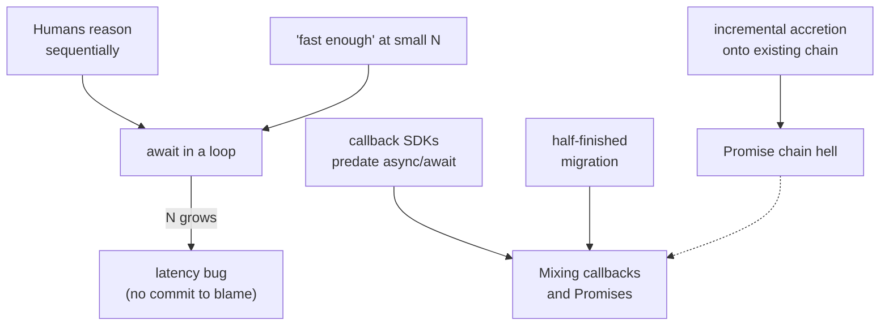
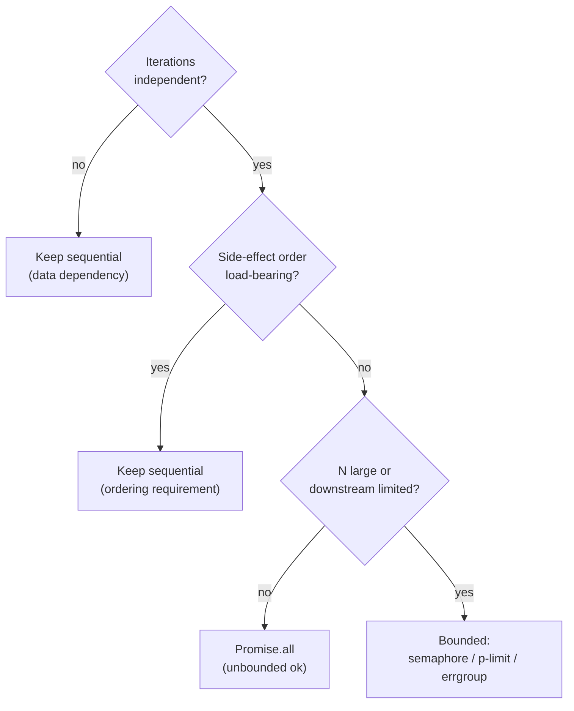

# Async Execution-Shape Anti-Patterns — Senior

> **Category:** [Async Anti-Patterns](../README.md) → **Execution Shape** — *async control flow that runs differently than the code reads.*
> **Covers (collectively):** `await` in a Loop · Promise Chain Hell / Callback Pyramid · Mixing Callbacks and Promises

---

## Table of Contents

1. [Introduction](#introduction)
2. [Prerequisites](#prerequisites)
3. [How Did the Codebase Get Here? — Root-Cause Forces](#how-did-the-codebase-get-here--root-cause-forces)
4. [Designing Concurrency Shape: The Four Axes](#designing-concurrency-shape-the-four-axes)
5. [`await` in a Loop: Serialization, Bounded Parallelism, Backpressure](#await-in-a-loop-serialization-bounded-parallelism-backpressure)
6. [When Sequential `await` Is Correct](#when-sequential-await-is-correct)
7. [The N+1 Async Query Problem and DataLoader Batching](#the-n1-async-query-problem-and-dataloader-batching)
8. [Streaming vs Buffering Large Fan-Outs](#streaming-vs-buffering-large-fan-outs)
9. [Cancellation and Timeouts Across Fan-Out](#cancellation-and-timeouts-across-fan-out)
10. [Promise Chain Hell: Flattening at Scale](#promise-chain-hell-flattening-at-scale)
11. [Migrating a Legacy Callback Codebase at Scale](#migrating-a-legacy-callback-codebase-at-scale)
12. [Preventing Shape Decay: Lint, Review, Perf Budgets](#preventing-shape-decay-lint-review-perf-budgets)
13. [Common Mistakes](#common-mistakes)
14. [Test Yourself](#test-yourself)
15. [Cheat Sheet](#cheat-sheet)
16. [Summary](#summary)
17. [Further Reading](#further-reading)
18. [Related Topics](#related-topics)

---

## Introduction

> Focus: **How did the codebase get here?** and **How do I fix the shape safely at scale?**

At the junior level you learned to *recognize* these three shapes — the serialized loop, the nested `.then` pyramid, the API that takes a callback *and* returns a Promise. At the middle level you learned the corrective moves: `Promise.all`, `async/await`, `util.promisify`. This file is about what you actually inherit as a senior: a 200-endpoint service where a hot path serializes 400 S3 reads in a loop, a `processOrder` function that is a 14-level `.then` pyramid wired into a callback-based payments SDK, and a half-finished async/await migration where some modules still pass callbacks. "Rewrite it cleanly" is not on the table; the system serves traffic right now.

Two questions define senior work here:

1. **How did it get this way?** Execution-shape decay is not ignorance — it is the deterministic output of forces: the code was written to *read* sequentially (because that's how humans reason), a callback SDK predates the team's async/await adoption, and each new dependency was bolted onto the chain that was already there. The serial loop is often a *correct* program that became a *latency* bug only when N grew from 3 to 4,000.

2. **How do I change the shape without a regression or an outage?** Changing concurrency shape changes *failure modes*, *resource pressure*, and *ordering* — not just speed. Naïvely replacing `for await` with `Promise.all` can take a service from "slow" to "DDoSing its own database and falling over." The senior move is to design the shape deliberately — bounded parallelism, backpressure, batching, cancellation — and migrate to it in reversible steps.

> **The senior mindset shift:** the junior asks "is this parallel?"; the senior asks "what is the *right* degree of concurrency for this resource, what happens to the 99th-percentile latency and the downstream connection pool when N is large, and is the ordering I'm about to break load-bearing?" You are no longer speeding up a function — you are shaping load on a system that cannot stop.

---

## Prerequisites

- **Required:** Fluency with [`junior.md`](junior.md) and [`middle.md`](middle.md) — you can spot a serial loop, convert a `.then` chain to `async/await`, and know `Promise.all` vs `Promise.allSettled`.
- **Required:** You have operated an async service in production — seen a connection pool exhaust, a downstream rate-limit you, and an event loop stall.
- **Helpful:** Working knowledge of `AbortController`/`AbortSignal` (JS), `asyncio` primitives (Python), and `context.Context` (Go).
- **Helpful:** Familiarity with the sibling error-handling shapes in error handling — fan-out multiplies the cost of a swallowed rejection.
- **Helpful:** Exposure to the positive patterns in Clean Code → Async & Functional.

---

## How Did the Codebase Get Here? — Root-Cause Forces

Every serialized loop and every `.then` pyramid has a biography. Fix the force or the shape regrows.

### "Code reads sequentially because humans think sequentially"

A `for (const id of ids) { await load(id) }` is the most *natural* thing to write — it reads like a recipe. The parallel form (`Promise.all(ids.map(load))`) requires you to first *see* that the iterations are independent. The serial loop is therefore the default output of a brain reasoning step-by-step; parallelism is a deliberate, second-pass optimization that nobody scheduled.

### The "it was fast enough" trap (latency that scales with N)

The loop shipped when `ids.length` was 3 and the endpoint returned in 15 ms. Two years later a power user has 4,000 ids and the endpoint takes 60 seconds and times out. **No line of code changed** — the *data* changed. Execution-shape bugs are uniquely insidious because they are latent: correct at small N, catastrophic at large N, and the regression has no commit to blame.

### Callback SDKs predating async/await

The payments SDK, the database driver, the legacy internal RPC client — all callback-based, all written before the team adopted Promises (or before Promises existed). New code is `async`, but it has to *call* the old callback world, so it grows a `new Promise((resolve, reject) => sdk.charge(args, (err, res) => ...))` wrapper at every boundary — hand-rolled, subtly wrong, and the seam where Mixing Callbacks and Promises is born.

### The half-finished migration

The team "moved to async/await" — but migration is expensive, so it stopped at 70%. Now the codebase is *bimodal*: some functions return Promises, some take callbacks, and the worst bugs live at the boundary where a function does *both* (returns a Promise *and* invokes a callback), so a caller's error handler fires twice or never.

### Incremental accretion onto an existing chain

The first version was `validate().then(charge)`. Then someone needed to email, so `.then(email)`. Then audit, then inventory, then a conditional refund branch nested inside a `.then`. Nobody refactored; each feature added one more `.then(...)` or one more level of nesting, and the pyramid grew the way stalactites do — one drip at a time.



The practical takeaway, mirroring the structural chapters: **a senior fix names the force.** "Parallelize the loop" is a wish that can DDoS your database. "This loop is independent and downstream tolerates 10 concurrent; bound it at 10 with a semaphore, add a perf budget test so a future N-growth fails CI, and document the ordering is not load-bearing" is a plan that stays fixed.

---

## Designing Concurrency Shape: The Four Axes

Before touching a loop, decide its shape along four independent axes. Getting any one wrong is its own production incident.

| Axis | Question | Wrong answer's failure mode |
|---|---|---|
| **Degree** | How many run at once? 1, K, or unbounded? | Unbounded fan-out → connection-pool exhaustion, downstream rate-limit, OOM |
| **Ordering** | Must results/effects preserve input order? Must step B follow step A? | Lost ordering → corrupted ledger, out-of-order writes |
| **Buffering** | Collect all results in memory, or stream them? | Buffering a huge fan-out → OOM; streaming when you needed the whole set → wrong answer |
| **Cancellation** | If one fails or the client leaves, do the rest stop? | No cancellation → wasted work, runaway cost, zombie requests |

The naïve "just `Promise.all` it" answer silently picks: *unbounded* degree, *unordered* effects, *full buffering*, and *no cancellation* — four defaults, any of which can be the wrong one. The senior designs each on purpose.

---

## `await` in a Loop: Serialization, Bounded Parallelism, Backpressure

The anti-pattern: `for (const x of xs) { await work(x); }`. N independent operations run one-after-another; total latency is `N × per-op`, when it could be `≈ per-op` (unbounded) or `≈ (N/K) × per-op` (bounded at K).

### The unbounded fix — and why it's a trap at scale

```ts
// Naïve "parallel" — correct ONLY when N is small and downstream is unlimited.
const results = await Promise.all(ids.map((id) => fetchUser(id)));
```

If `ids.length` is 10,000 and `fetchUser` hits a database with a 20-connection pool, this fires 10,000 concurrent queries: the pool exhausts, 9,980 queries queue, timeouts cascade, and you have converted a *slow* endpoint into a *down* one. **Unbounded `Promise.all` is a load-shaping decision disguised as a one-liner.**

### Bounded parallelism — the senior default for any non-trivial N

Cap concurrency at a degree the *downstream* tolerates. In JS, a small worker-pool over a shared cursor — no library needed:

```ts
// Bounded fan-out: at most `limit` operations in flight, results in input order.
async function mapLimit<T, R>(
  items: readonly T[],
  limit: number,
  fn: (item: T, index: number) => Promise<R>,
): Promise<R[]> {
  const results = new Array<R>(items.length);
  let cursor = 0;
  const worker = async () => {
    while (cursor < items.length) {
      const i = cursor++; // claim an index; ++ is atomic on the single-threaded loop
      results[i] = await fn(items[i], i);
    }
  };
  // Spawn min(limit, N) workers that drain the shared cursor.
  const workers = Array.from({ length: Math.min(limit, items.length) }, worker);
  await Promise.all(workers);
  return results;
}

const users = await mapLimit(ids, 10, (id) => fetchUser(id)); // 10 in flight, ordered
```

In production prefer a battle-tested primitive: **`p-limit`** / **`p-map`** (with `{ concurrency }`) in JS. The point is the same — *K is a deliberate number tied to a real resource limit*, not infinity.

```ts
import pLimit from "p-limit";
const limit = pLimit(10); // tie this to the DB pool size / downstream rate budget
const users = await Promise.all(ids.map((id) => limit(() => fetchUser(id))));
```

**Python** — a `Semaphore` is the idiomatic bound; `asyncio.gather` preserves order:

```python
import asyncio

async def map_limit(ids, limit, fn):
    sem = asyncio.Semaphore(limit)
    async def guarded(x):
        async with sem:          # at most `limit` past this line at once
            return await fn(x)
    # gather preserves input order regardless of completion order.
    return await asyncio.gather(*(guarded(i) for i in ids))

users = await map_limit(ids, 10, fetch_user)
```

With Python 3.11+, prefer a **`TaskGroup`** for structured concurrency — if any child raises, the group cancels the siblings and propagates, which `gather(..., return_exceptions=False)` does *not* do cleanly:

```python
async def fetch_all(ids, limit):
    sem = asyncio.Semaphore(limit)
    results: dict[int, object] = {}
    async def one(i, x):
        async with sem:
            results[i] = await fetch_user(x)
    async with asyncio.TaskGroup() as tg:   # cancels siblings on first failure
        for i, x in enumerate(ids):
            tg.create_task(one(i, x))
    return [results[i] for i in range(len(ids))]
```

**Go** — the canonical bounded fan-out is `errgroup` with `SetLimit`:

```go
// errgroup: bounded concurrency + first-error cancellation, in the std-adjacent lib.
g, ctx := errgroup.WithContext(ctx)
g.SetLimit(10) // at most 10 goroutines past Go() at once — the bound
users := make([]User, len(ids))
for i, id := range ids {
    i, id := i, id // capture (pre-1.22)
    g.Go(func() error {
        u, err := fetchUser(ctx, id) // ctx is cancelled when any sibling errors
        if err != nil {
            return err
        }
        users[i] = u
        return nil
    })
}
if err := g.Wait(); err != nil { // returns the first non-nil error
    return nil, err
}
```

Note what `errgroup` gives you *for free* that JS's `Promise.all` does not: bounded degree (`SetLimit`), first-error cancellation of siblings (via `ctx`), and a single error return. JS requires you to assemble those three yourself.

### Rate limiting vs concurrency limiting — they are different

A concurrency cap of K limits *how many run at once*; a rate limit caps *how many start per unit time*. A downstream that allows "10 concurrent" is satisfied by a semaphore; one that allows "100 requests/second" needs a token bucket — K concurrent fast operations can still exceed 100/s. For request-per-second budgets, gate with a token-bucket limiter, not (only) a semaphore. See rate limiting / throttling.

### Backpressure: don't read faster than you can write

When the *source* is itself large or streaming (a paginated API, a Kafka topic, a file of 50M lines), the danger inverts: you can pull items faster than you process them, and the in-flight queue grows without bound until OOM. The fix is **backpressure** — the producer must block when the consumer is behind. A bounded `mapLimit`/semaphore *is* backpressure if you feed it from an async iterator and only pull the next item when a worker frees up; an unbounded `items.map(...)` over a stream is the OOM.

```ts
// Backpressure over an async source: pull-driven, bounded in-flight set.
async function forEachLimit<T>(
  source: AsyncIterable<T>,
  limit: number,
  fn: (item: T) => Promise<void>,
): Promise<void> {
  const inFlight = new Set<Promise<void>>();
  for await (const item of source) {
    // Only pull the next item when we're below the cap — this is the backpressure.
    if (inFlight.size >= limit) await Promise.race(inFlight);
    const p = fn(item).finally(() => inFlight.delete(p));
    inFlight.add(p);
  }
  await Promise.all(inFlight); // drain the tail
}
```

---

## When Sequential `await` Is Correct

The most important senior judgment in this whole topic: **a serial loop is not always a bug.** Parallelizing it can be a *correctness* regression. Keep the `await` in the loop when any of these hold:

- **Each step depends on the previous result.** `const a = await first(); const b = await second(a);` — `b` *needs* `a`. There is no parallelism to extract; the data dependency is the program. Trying to "fix" this is a category error.
- **Ordering of side effects is load-bearing.** Appending ledger entries, writing a sequence of events that must persist in order, replaying a migration — running these concurrently corrupts the result even if each op succeeds. Serialization here is the *requirement*.
- **It's a transaction / dependent steps.** `BEGIN; insert; update; COMMIT` on one connection must be sequential and on the *same* connection; scattering the statements across a `Promise.all` runs them on different pooled connections and breaks the transaction entirely.
- **Deliberate throttling of one resource.** Sometimes a `for await` *is* your concurrency-1 limiter — walking a paginated API that forbids parallel page fetches, or hitting a legacy service that falls over above 1 RPS.
- **You must stop on first failure with no wasted work.** A sequential loop naturally stops at the first error having done the minimum; an eager `Promise.all` has already launched all N before the first rejection (wasting the rest).

> **The senior test:** before parallelizing a loop, ask *"are the iterations independent, and is the ordering of their side effects irrelevant?"* If either answer is no, the serial shape is correct — leave it, and add a comment saying *why*, so the next engineer doesn't "optimize" it into a bug. Accidental serialization (a perf bug) and intentional serialization (a correctness requirement) look identical in the source; the comment is what distinguishes them.



---

## The N+1 Async Query Problem and DataLoader Batching

The most common *systemic* form of `await`-in-a-loop is the **N+1 query**: one query fetches N parents, then a loop fires one query per parent to fetch its children — 1 + N round trips. It hides in resolvers, serializers, and ORMs.

```ts
// N+1: 1 query for posts, then N queries for authors. Disastrous in a GraphQL
// resolver where each Post.author runs independently per item.
const posts = await db.posts.findAll();              // 1
for (const post of posts) {
  post.author = await db.users.findById(post.authorId); // N
}
```

Bounding the concurrency does **not** fix N+1 — it still issues N queries, just K at a time. The real fix is to **batch**: collapse the N point-lookups into *one* `WHERE id IN (...)` query.

```ts
// Batched: 2 queries total, regardless of N.
const posts = await db.posts.findAll();
const ids = [...new Set(posts.map((p) => p.authorId))];
const authors = await db.users.findByIds(ids);        // 1 batched query
const byId = new Map(authors.map((a) => [a.id, a]));
for (const post of posts) post.author = byId.get(post.authorId);
```

### DataLoader — batching across independent call sites

When the N lookups are scattered across independent resolvers (you *can't* hoist them into one place), use the **DataLoader** pattern: each `.load(id)` is enqueued, and at the end of the current event-loop tick all queued keys are flushed as one batched call. It also de-duplicates and caches within the request.

```ts
import DataLoader from "dataloader";

// batchFn receives ALL keys requested in this tick; must return values in key order.
const userLoader = new DataLoader<string, User>(async (ids) => {
  const users = await db.users.findByIds(ids as string[]); // 1 query for the whole tick
  const byId = new Map(users.map((u) => [u.id, u]));
  return ids.map((id) => byId.get(id) ?? new Error(`no user ${id}`));
});

// Now scattered, independent resolvers each just .load() — they coalesce automatically.
const author = await userLoader.load(post.authorId);
```

The mechanism is precisely *anti*-serialization: instead of `await`-ing each lookup in turn (N round trips), DataLoader lets them all register synchronously within a tick and issues *one* round trip. Create a **fresh loader per request** so the cache doesn't leak across users. This is the canonical fix for GraphQL N+1 — see GraphQL schema design for the resolver-layer treatment.

---

## Streaming vs Buffering Large Fan-Outs

`Promise.all` (and `gather`) **buffer**: every result is held in memory until the last one resolves, then the whole array returns. For a fan-out that produces a lot of data — exporting 10M rows, transforming a large file, proxying a big upstream — buffering is an OOM waiting to happen and adds latency-to-first-byte (you wait for *all* before emitting *any*).

The senior alternative is to **stream**: process and emit each result as it's ready, holding only a bounded window in memory.

```ts
// Buffering — holds all N results, then returns. OOM risk for large N / large items.
const rows = await Promise.all(keys.map((k) => fetchRow(k)));
res.json(rows);

// Streaming — bounded memory, time-to-first-byte ≈ first result, not last.
res.setHeader("Content-Type", "application/x-ndjson");
for await (const row of streamRows(keys, /* concurrency */ 8)) {
  res.write(JSON.stringify(row) + "\n"); // emit as ready; backpressure via res.write
}
res.end();
```

Order-preserving streamed fan-out is the subtle part: you want *bounded concurrency* AND *in-order emission*. Run K workers but emit results in input order by buffering only the small reorder window:

```python
# Python: bounded concurrency, results yielded in input order, bounded memory.
async def ordered_map(items, limit, fn):
    sem = asyncio.Semaphore(limit)
    async def run(x):
        async with sem:
            return await fn(x)
    tasks = [asyncio.create_task(run(x)) for x in items]
    for t in tasks:          # await in input order; at most `limit` ever run concurrently
        yield await t        # emit as soon as THIS one is done, holding no full buffer
```

> **The rule:** buffer (`Promise.all`/`gather`) only when N is bounded and the whole result set is small enough to hold; stream (async iterator + bounded concurrency) when the fan-out is large, unbounded, or feeds a network response. `Promise.all` over an unbounded source is two anti-patterns at once — unbounded degree *and* unbounded buffering.

---

## Cancellation and Timeouts Across Fan-Out

A fan-out without cancellation wastes work and money: the client disconnected, one sibling already failed, or a deadline passed — but the other 99 calls keep running, holding connections and burning downstream quota. Senior fan-out is *cancellable*.

### JS — `AbortController` threaded through every leaf

```ts
// One controller fans a single abort signal to every leaf call.
async function fanOutWithTimeout(ids: string[], ms: number) {
  const ac = new AbortController();
  const timer = setTimeout(() => ac.abort(new Error("deadline")), ms);
  try {
    return await Promise.all(
      ids.map((id) => fetchUser(id, { signal: ac.signal })), // each leaf is abortable
    );
  } finally {
    clearTimeout(timer); // don't leak the timer (the classic mistake)
  }
}
```

The non-obvious part: the `signal` must be *plumbed all the way down* to the actual `fetch`/socket. A controller you abort but never pass to the leaf calls does nothing — the work runs to completion. Cancellation is end-to-end or it's theater.

### `Promise.race` for first-result / timeout — and its leak

```ts
// Timeout via race. WARNING: the loser keeps running — race does NOT cancel it.
function withTimeout<T>(p: Promise<T>, ms: number, ac: AbortController): Promise<T> {
  const timeout = new Promise<never>((_, reject) =>
    setTimeout(() => {
      ac.abort();              // actually cancel the work, not just stop waiting
      reject(new Error("timeout"));
    }, ms),
  );
  return Promise.race([p, timeout]);
}
```

The classic `Promise.race` bug: racing a slow op against a timer makes you *stop waiting*, but the slow op **keeps running** (and may later reject with no `.catch`, becoming an unhandled rejection). Always pair `race` with real cancellation (`AbortController`) so the loser stops. Note `Promise.all` rejects on the *first* rejection but does **not** cancel the still-pending siblings — they run to completion unless you abort them; use `Promise.allSettled` when you want every result regardless.

### Python and Go — cancellation is structural

```python
# Python: a deadline wraps the whole gather; on timeout the group is cancelled.
async def fan_out(ids):
    async with asyncio.timeout(5):        # 3.11+: cancels everything inside on expiry
        async with asyncio.TaskGroup() as tg:
            return [tg.create_task(fetch_user(i)) for i in ids]
```

```go
// Go: context with deadline; cancellation propagates to every goroutine that
// honors ctx. errgroup's derived ctx is cancelled on first error OR on timeout.
ctx, cancel := context.WithTimeout(ctx, 5*time.Second)
defer cancel()
g, ctx := errgroup.WithContext(ctx)
g.SetLimit(10)
// ... g.Go(func() error { return fetchUser(ctx, id) }) ...
err := g.Wait() // returns on first error, deadline, or completion; siblings cancelled
```

Go and Python 3.11+ make cancellation *structural* (the deadline/context bounds a scope); JS makes you assemble it from `AbortController` + `setTimeout` + `finally` by hand, which is exactly why the JS fan-out leaks timers and abandons losers when written carelessly.

---

## Promise Chain Hell: Flattening at Scale

Promise Chain Hell is a long `.then(...).then(...).catch(...)` chain (or a callback pyramid migrated 1:1 into one), where the *data flow* is obscured by the *plumbing*. At scale it has three concrete costs: error handling is ambiguous (which `.then` does that `.catch` cover?), intermediate values get smuggled through closures, and branching becomes a nested sub-chain inside a `.then`.

```ts
// Promise chain hell — branching, smuggled state, ambiguous catch.
function processOrder(id) {
  return loadOrder(id)
    .then((order) =>
      validate(order).then((ok) =>
        ok
          ? charge(order).then((receipt) =>
              email(order, receipt).then(() =>
                audit(order, receipt).then(() => receipt),
              ),
            )
          : Promise.reject(new Error("invalid")),
      ),
    )
    .catch((err) => {
      log(err); // covers WHICH of the above? hard to reason about
      throw err;
    });
}
```

The mechanical fix is `async/await`, which makes the data flow linear and the error scope explicit:

```ts
async function processOrder(id: string): Promise<Receipt> {
  const order = await loadOrder(id);
  if (!(await validate(order))) throw new Error("invalid");
  const receipt = await charge(order);
  await email(order, receipt); // independent of audit? then parallelize them:
  await audit(order, receipt);
  return receipt;
}
```

But the senior caution: **flattening a chain can change concurrency.** If two `.then` branches were running *concurrently* (forked off the same parent Promise), naïvely serializing them into sequential `await`s introduces a latency regression. Conversely, `await email(...); await audit(...)` serializes two *independent* calls — if they're independent, `await Promise.all([email(...), audit(...)])` is faster. So flattening is a two-step senior move:

1. **Preserve behavior:** rewrite the chain to `async/await` keeping the exact same concurrency (sequential stays sequential, forked stays forked via `Promise.all`). Verify with tests; this is the *behavior-preserving* commit.
2. **Then optimize shape:** in a *separate* commit, parallelize the genuinely-independent steps. Mixing the rewrite and the optimization means a latency regression has no clean commit to blame — the same discipline as separating structural and behavioral change in the [structure chapter](../../01-development/01-bad-structure/senior.md).

For a chain wired into a *callback* API at the leaves, you can't flatten until you promisify the boundary — which is the migration problem below.

---

## Migrating a Legacy Callback Codebase at Scale

You inherit a service built on Node-style `(err, result)` callbacks: the database layer, an internal RPC client, a payments SDK. New features want `async/await`. A flag-day rewrite is off the table. The senior approach is an **incremental migration with a promisified boundary**, mirroring branch-by-abstraction.

### Step 0 — Promisify at the boundary, once, correctly

The single highest-leverage move: convert each callback API to a Promise-returning one *at one wrapper*, so the rest of the codebase only ever sees Promises. Use the platform's `promisify` — do **not** hand-roll `new Promise` wrappers scattered everywhere (that's how Mixing Callbacks and Promises spreads).

```ts
import { promisify } from "node:util";

// One canonical promisified boundary per callback API. Everything above this
// line is async/await; everything below is the untouched legacy callback world.
const readFile = promisify(fs.readFile);          // (err, data) => Promise<data>
const legacyCharge = promisify(paymentsSdk.charge.bind(paymentsSdk));
```

Why `promisify` and not a hand-rolled wrapper? The hand-rolled version routinely gets these wrong, *each one a latent bug*:

```ts
// HAND-ROLLED — three classic defects.
function chargeBad(args) {
  return new Promise((resolve, reject) => {
    paymentsSdk.charge(args, (err, res) => {
      if (err) reject(err);
      resolve(res); // BUG 1: resolves AFTER rejecting on error → double-settle attempt
    });            // BUG 2: if charge() throws synchronously, it's uncaught here
  });               // BUG 3: loses `this` binding if not bound
}
```

`promisify` handles the err-first contract, single-settle, and synchronous-throw correctly. Promisify once at the seam; never re-wrap a Promise in `new Promise` (that's the Promise Constructor anti-pattern).

### Step 1 — Establish the rule: callbacks below the line, Promises above

Draw an explicit boundary. *Below* it (the vendored SDK, the legacy driver) callbacks are fine — you don't own that code. *Above* it, everything is `async/await`. The lethal zone is the boundary itself, and the rule is: **a function never both takes a callback and returns a Promise.** That dual-mode shape is the Mixing anti-pattern, and it causes the worst class of async bug:

```ts
// MIXED MODE — the worst shape. Callers can't tell which contract to use,
// and a careless caller triggers BOTH paths → handler runs twice or never.
function getUser(id, callback) {
  const p = db.query("...", id);          // returns a Promise
  if (callback) p.then((r) => callback(null, r), callback); // also calls back!
  return p;                                // ...and returns the Promise
}
```

Pick one model per function. During migration, if you must support both callers temporarily, do it via a thin *adapter* that calls the single Promise implementation — not by branching inside the core function.

### Step 2 — Migrate call sites incrementally, leaf-first

Migrate **leaf-first** (deepest, fewest callers) so each change has a small blast radius, the same churn/fan-in triage as [dismantling a God Object](../../01-development/01-bad-structure/senior.md). Each migrated unit: convert the callback chain to `await` over the promisified boundary, keep behavior identical, ship. Because the boundary already returns Promises, each call site is an independent, reversible change.

```ts
// BEFORE — callback pyramid against the legacy SDK.
function settle(orderId, cb) {
  loadOrder(orderId, (e, order) => {
    if (e) return cb(e);
    charge(order, (e2, receipt) => {
      if (e2) return cb(e2);
      record(receipt, (e3) => cb(e3, receipt)); // pyramid + err-forwarding noise
    });
  });
}

// AFTER — flat, against the promisified boundary. One error path.
async function settle(orderId: string): Promise<Receipt> {
  const order = await loadOrder(orderId);
  const receipt = await charge(order);
  await record(receipt);
  return receipt;
}
```

### Step 3 — Avoid the mixed-model bugs during the transition

Two failure modes haunt half-finished migrations, both worth a lint rule:

- **The forgotten error path.** Callback code forwards errors manually (`if (e) return cb(e)`); `async/await` propagates them via `throw`/rejection. A half-migrated function that `await`s but still has a callback parameter can *swallow* an error (the throw unwinds past the callback that the caller is waiting on). Pin behavior with tests at the boundary.
- **Floating promises at the seam.** When a callback API is fire-and-forget and you migrate the caller to async, the new Promise is easy to leave un-`await`ed — a floating promise (see the error-handling chapter). Enable `@typescript-eslint/no-floating-promises` so the migration can't silently drop a rejection.


This is parallel-change applied to an async contract: **expand** (add the promisified boundary alongside the callbacks), **migrate** (move call sites leaf-first), **contract** (delete the callback adapters, and add a lint rule forbidding new callback APIs above the line).

---

## Preventing Shape Decay: Lint, Review, Perf Budgets

Refactoring fixes today's shape; prevention stops it regrowing. Since the forces are "sequential is the default" and "N was small," the durable defenses are automated and live in CI — they outlast the engineer who cares.

### Lint — make the dangerous shapes fail the build

```jsonc
// .eslintrc — the async-shape guard rails.
{
  "rules": {
    // A floating promise at a migration seam silently drops rejections.
    "@typescript-eslint/no-floating-promises": "error",
    // await-in-loop is a SMELL, not always a bug — warn so the author justifies it.
    "no-await-in-loop": "warn",
    // catches async functions with no await (the sibling misuse anti-pattern).
    "@typescript-eslint/require-await": "warn",
    // forbids mixing: a function shouldn't return a promise AND take a callback.
    "promise/no-callback-in-promise": "error"
  }
}
```

`no-await-in-loop` as a *warning* (not error) is the right calibration: it forces the author to *see* the serial loop and either justify it (sequential is correct — add a comment) or fix it. A hard error would be wrong because sequential `await` is legitimately correct sometimes.

### Review — the three questions

When a PR adds a fan-out, the reviewer asks:
1. **"What bounds the concurrency?"** An unbounded `Promise.all` over a request-controlled array is a self-DDoS vector — bound it.
2. **"Is this serialization intentional?"** If a loop `await`s, is it a data dependency / ordering requirement (correct) or accidental (a latency bug)? Require a comment when intentional.
3. **"What cancels this if the client leaves?"** A fan-out with no `AbortSignal`/context wastes work and money on abandoned requests.

### Perf budgets — catch the latent N-growth regression

The insidious thing about `await`-in-a-loop is that it ships *correct* and degrades *later* as N grows, with no commit to blame. The defense is a **perf budget test** that fails CI when the shape can't meet a latency/round-trip ceiling at a realistic N:

```ts
// A guard test: at N=1000, the endpoint must stay under budget AND issue a
// bounded number of downstream calls. Catches a re-introduced N+1 or serial loop.
test("listOrders is batched and bounded at scale", async () => {
  const db = spyOnQueries();
  await listOrders({ userCount: 1000 });
  expect(db.queryCount).toBeLessThan(5);      // not 1001 → no N+1
  expect(db.maxConcurrent).toBeLessThanOrEqual(10); // bounded fan-out
});
```

Counting *downstream calls* (query count, max concurrency) is more robust than wall-clock, which is flaky in CI. A query-count assertion is the cheapest possible regression guard against both N+1 and accidental serialization.

> **The senior's real product is not the parallelized loop — it's the system that keeps the shape from decaying:** a lint rule that flags the serial loop, a review norm that demands a concurrency bound, and a perf budget that fails CI when N-growth re-serializes the path. Shape rots back toward "sequential and fast-enough-at-small-N"; automate the forces away and it holds.

---

## Common Mistakes

Mistakes seniors make when reshaping async execution at scale:

1. **"Just `Promise.all` it" on a request-controlled array.** Unbounded fan-out over user-supplied N exhausts the connection pool / trips the downstream rate-limit and converts a slow endpoint into a down one. *Bound it with a semaphore / `p-limit` / `errgroup.SetLimit` tied to a real resource limit.*
2. **Parallelizing a loop whose ordering is load-bearing.** Concurrent ledger writes or out-of-order event persistence corrupt data even when each op succeeds. *Verify independence and ordering-irrelevance before parallelizing; comment intentional serialization.*
3. **Bounding the loop but leaving the N+1.** A semaphore makes N+1 *slower-but-bounded*, not *fixed*. *Batch the lookups (`WHERE id IN (...)` / DataLoader), then bound what's left.*
4. **Buffering a huge fan-out with `Promise.all`.** Holding all N results in memory OOMs and delays time-to-first-byte. *Stream with a bounded async iterator when N is large or feeds a response.*
5. **`Promise.race` for timeout without cancelling the loser.** The slow op keeps running and may later reject unobserved (unhandled rejection). *Pair `race` with `AbortController` so the loser actually stops; `clear` the timer in `finally`.*
6. **Aborting a controller you never plumb to the leaves.** Cancellation that doesn't reach the actual `fetch`/socket is theater — the work runs to completion. *Thread the `signal`/`context` end-to-end.*
7. **Hand-rolling `new Promise` wrappers around callbacks.** Double-settle, swallowed synchronous throws, lost `this`. *Use `util.promisify` at one boundary per API; never re-wrap a Promise in `new Promise`.*
8. **The dual-mode function (returns a Promise AND takes a callback).** Callers fire both paths or neither; handlers run twice or never. *One model per function; bridge via a thin adapter during migration, never by branching inside the core.*
9. **Mixing the chain-flattening rewrite with concurrency changes in one commit.** A latency regression then has no clean commit to blame. *Behavior-preserving `async/await` rewrite first; parallelize independent steps in a separate commit.*
10. **No perf budget, so the N-growth regression ships silently.** The serial loop / N+1 is correct at small N and catastrophic later, with no commit to blame. *Assert downstream call-count and max-concurrency at a realistic N in CI.*

---

## Test Yourself

1. A hot endpoint does `for (const id of ids) { results.push(await db.lookup(id)); }`. A junior PRs `Promise.all(ids.map((id) => db.lookup(id)))`. Why might this be *worse* in production, and what's the correct fix?
2. Give three concrete situations where a `for ... await` loop is *correct* and parallelizing it would be a bug or regression.
3. You bound a fan-out to 10 concurrent with a semaphore, but the endpoint is still slow and the DB shows ~1,000 queries per request. What's the actual problem, and why didn't the bound fix it?
4. Explain the classic `Promise.race`-for-timeout bug and how to fix it correctly.
5. Why is hand-rolling `new Promise((resolve, reject) => sdk.call(args, cb))` at every call site worse than `util.promisify`, and what is the single worst shape that comes out of a half-finished callback→Promise migration?
6. You inherit a 14-level `.then` pyramid where two branches currently run concurrently (forked off one parent Promise). Outline the two-commit sequence to flatten it to `async/await` without a latency regression.
7. What CI/review mechanisms prevent an `await`-in-a-loop or N+1 from re-appearing, and why is `no-await-in-loop` a *warning* rather than an *error*?

---

## Cheat Sheet

| Shape at scale | Root-cause force | Senior reshaping move | Safety mechanism |
|---|---|---|---|
| **`await` in a loop (accidental)** | "reads sequentially"; fast-enough at small N | Bounded fan-out (`p-limit`/`Semaphore`/`errgroup.SetLimit`) tied to a resource limit | `no-await-in-loop` warn; perf budget on call-count + concurrency |
| **`await` in a loop (intentional)** | data dependency / ordering / transaction | **Keep it** — comment *why* so it isn't "optimized" into a bug | Test pins ordering; comment documents intent |
| **N+1 async query** | per-item lookup in resolver/loop | **Batch** (`id IN (...)`) or per-request **DataLoader** | Query-count assertion (`< 5`, not `N+1`) in CI |
| **Large fan-out** | `Promise.all` buffers everything | **Stream** via bounded async iterator; emit as ready | Memory budget; bounded in-flight set = backpressure |
| **No cancellation** | fan-out ignores client/deadline | `AbortController`/`context` threaded to every leaf | Timer cleared in `finally`; signal plumbed end-to-end |
| **Promise chain hell** | incremental accretion of `.then` | `async/await` rewrite, concurrency-preserving first | Behavior-preserving commit separate from optimization |
| **Mixing callbacks & Promises** | callback SDKs + half-finished migration | `util.promisify` at one boundary; one model per function | `no-floating-promises`; no dual-mode functions |

**Four golden rules:**
- *Bound the degree — unbounded `Promise.all` over request-controlled N is a self-DDoS, not a one-liner.*
- *Sequential `await` is sometimes correct (dependency / ordering / transaction); comment intent so it isn't "fixed" into a bug.*
- *Batch before you bound — a semaphore makes N+1 bounded, not gone; stream before you buffer for large fan-outs.*
- *Promisify the boundary once with `util.promisify`; never a dual-mode function, never re-wrap a Promise in `new Promise`.*

---

## Summary

- **How it got here:** execution-shape decay is the deterministic output of forces — humans reason sequentially (so the serial loop is the default), it was "fast enough" at small N (so the latency bug is latent with no commit to blame), callback SDKs predate async/await (so promisify wrappers breed), and chains accrete one `.then` at a time. A fix that ignores the force regrows.
- **Design the shape on four axes:** **degree** (1 / K / unbounded), **ordering** (does it matter?), **buffering** (collect vs stream), **cancellation** (stop the rest?). "Just `Promise.all`" silently picks unbounded + unordered + buffered + uncancellable — four defaults, any of which can be wrong.
- **`await` in a loop:** parallelize *only* independent, order-irrelevant iterations; default to **bounded** parallelism (`p-limit` / `Semaphore` / `TaskGroup` / `errgroup.SetLimit`) tied to a real downstream limit; add **backpressure** when the source is large. **Keep sequential** for data dependencies, ordering requirements, transactions, and deliberate throttling — and comment why.
- **N+1:** bounding doesn't fix it — **batch** (`id IN (...)`) or use a per-request **DataLoader** that coalesces scattered `.load()` calls into one round trip per tick.
- **Large fan-outs:** **stream** with a bounded async iterator instead of buffering with `Promise.all`; bounded in-flight = backpressure = no OOM.
- **Cancellation:** thread `AbortSignal`/`context` to every leaf; `Promise.race` stops *waiting* but not *running* — pair it with real abort and clear timers in `finally`.
- **Chain hell:** flatten to `async/await` **concurrency-preserving first**, optimize independent steps in a *separate* commit.
- **Callback migration:** promisify the boundary **once** with `util.promisify`, draw a "callbacks below, Promises above" line, migrate **leaf-first**, and never ship a **dual-mode** function. Parallel-change for an async contract: expand → migrate → contract.
- **Prevention is automated:** `no-await-in-loop` (warn, so intent is justified), `no-floating-promises` (error), review questions on bound/intent/cancellation, and **perf budgets** asserting downstream call-count and max-concurrency at realistic N. The senior's deliverable is the system that keeps the shape from decaying.

---

## Further Reading

- **You Don't Know JS: Async & Performance** — Kyle Simpson — the event loop, microtasks, and why chain flattening changes concurrency.
- **Node.js Design Patterns** — Mario Casciaro & Luciano Mammino (3rd ed., 2020) — callback→Promise migration, the "callback hell" chapter, bounded-concurrency patterns, and async iterators/streams.
- **Effective TypeScript** — Dan Vanderkam (2nd ed., 2024) — typing async boundaries so a Promise can't be used as its value (catches Forgotten Await at the type level).
- **Python `asyncio` docs** — `gather`, `as_completed`, `Semaphore`, `TaskGroup`, `asyncio.timeout` — the official reference for structured concurrency primitives.
- **PEP 654 / PEP 678** — exception groups and `TaskGroup` semantics — how Python 3.11+ cancels siblings on first failure.
- **The Go Blog & `errgroup` docs** — `golang.org/x/sync/errgroup` (`SetLimit`, `WithContext`) — bounded fan-out with first-error cancellation as a single primitive.
- **DataLoader** — `github.com/graphql/dataloader` README — the per-tick batching/caching mechanism and per-request lifecycle.
- **Notes on structured concurrency** — Nathaniel J. Smith (2018) — why fan-out without scoped cancellation is a language-level anti-pattern.

---

## Related Topics

- Clean Code → Async & Functional — the positive patterns: clear async boundaries, composition over chains.
- Async → Error Handling — floating promises and swallowed rejections, which fan-out multiplies; the seam where migration drops errors.
- Async → Misuse — the Promise Constructor anti-pattern (never re-wrap a Promise) and `async` without `await`, both touched by migration.
- [Concurrency Anti-Patterns](../../03-concurrency/README.md) — the multi-thread sibling: real memory races, locks, and deadlocks, distinct from these event-loop shapes.
- [Development → Bad Structure](../../01-development/01-bad-structure/senior.md) — branch-by-abstraction, parallel-change, and "separate structural from behavioral commits," reused here for async migration.
- Backend → Distributed Systems — fan-out, retry, timeout, backpressure, and N+1 at the network/service layer; DataLoader and rate-limiting in context.

---

## Check your understanding

1. Explain Async Execution-Shape Anti-Patterns — Senior Level in your own words and name the problem it solves.
2. How would you apply the ideas around Table of Contents, Introduction, Prerequisites in a realistic engineering change?
3. What failure mode or misuse should you look for, and what evidence would reveal it?
4. How would you validate a system-level decision about Async Execution-Shape Anti-Patterns — Senior Level under uncertainty?
5. What observable result would convince you that the approach improved the system?
