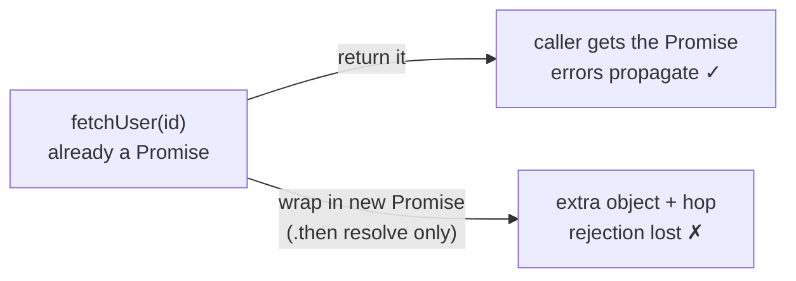
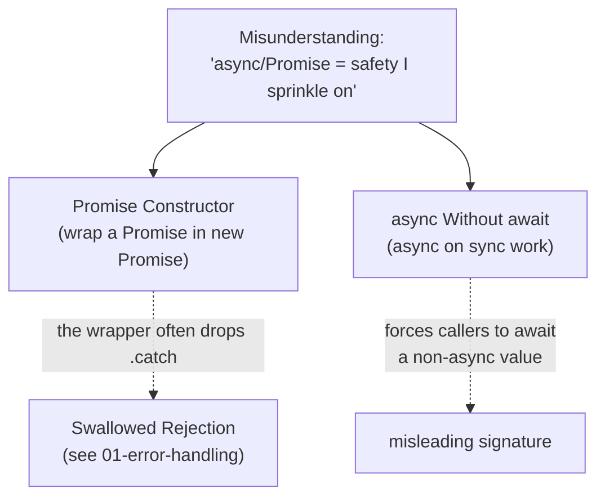

# Async Misuse Anti-Patterns — Junior

> **Category:** [Async Anti-Patterns](../README.md) → **Misuse** — *async machinery applied where it doesn't help, or actively hurts.*
> **Covers (collectively):** Promise Constructor Anti-Pattern · `async` Without `await`

---

## Introduction

> Focus: **What does it look like?** and **Why is it bad?**

The other async anti-patterns are about errors that vanish or code that runs differently than it reads. These two are different: the code is usually *correct*, it just does **needless extra work** and **lies about its own nature**. They are the async equivalent of writing `if (x == true)` instead of `if (x)` — not a bug, but a sign the author hasn't quite internalized how the tool works.

Both come from the same misunderstanding: treating `Promise` (and `async`) as magic incantations you sprinkle on for safety, rather than precise tools with a specific job.

- **Promise Constructor Anti-Pattern** — you already *have* a Promise, but you wrap it inside a brand-new `new Promise(...)` "to be safe." This adds nothing and silently throws your error handling away.
- **`async` Without `await`** — you mark a function `async` even though it never `await`s anything, so it pays for asynchrony it never uses and advertises behavior it doesn't have.

At the junior level your goal is to **recognize both on sight**, understand *why* the extra machinery is wasted (and in the first case, dangerous), and apply the one-line fix: **return the Promise you already have**, and **only write `async` when you actually `await`.**

> **The mindset shift:** a `Promise` is already a complete, composable value. You don't need to "re-wrap" it to make it safe — it's safe already. And `async` is not a label that means "this is important"; it's a switch that changes how the function returns. Use it when you mean it.

---

## Prerequisites

- **Required:** You can read JavaScript/TypeScript `Promise`, `.then()`, `.catch()`, and `async`/`await`.
- **Required:** You know that an `async` function always returns a `Promise`, and that `await` pauses until a Promise settles.
- **Helpful:** A basic mental model of the **microtask queue** — the idea that `.then`/`await` continuations don't run *right now*, they run *after* the current synchronous code finishes.
- **Helpful:** You've seen Python `asyncio` (`async def`, `await`, `asyncio.Future`). The same two mistakes appear there, and we show both.

If "an `async` function always returns a Promise" is new to you, read it again — it's the single fact that explains both anti-patterns.

---

## Glossary

| Term | Definition |
|------|-----------|
| **Promise** | An object representing a value that will exist later — it's *pending*, then becomes *fulfilled* (with a value) or *rejected* (with an error). |
| **Promise constructor** | `new Promise(executor)` — the low-level way to *create* a brand-new Promise from scratch. |
| **Executor** | The function `(resolve, reject) => { ... }` you pass to `new Promise`. It runs **synchronously, immediately**, and is meant to start some operation that later calls `resolve` or `reject`. |
| **`resolve` / `reject`** | The two callbacks the executor receives. `resolve(value)` fulfills the Promise; `reject(error)` rejects it. |
| **`thenable`** | Any object with a `.then()` method — Promises are thenables. `resolve(aPromise)` *adopts* the inner Promise's eventual state. |
| **Microtask** | A small unit of work (a `.then`/`await` continuation) the engine runs after the current synchronous stack empties, before the next timer or I/O event. |
| **Microtask hop** | The unavoidable one-tick delay before a Promise continuation runs. `async`/`await` schedules at least one. Cheap, but not free. |
| **Deferred** | An object that exposes a Promise plus its `resolve`/`reject` from the outside. A common (usually unnecessary) wrapper pattern that leads people into the Promise constructor anti-pattern. |

---

## The Two at a Glance

| Anti-pattern | One-line symptom | The smell you feel |
|---|---|---|
| **Promise Constructor Anti-Pattern** | `new Promise(res => existingPromise.then(res))` | "Why are we re-wrapping a Promise we already have?" |
| **`async` Without `await`** | `async function f() { return x; }` — no `await` inside | "What is the `async` even doing here?" |

Neither is spotted by a crash. You spot them by the *shape*: a `new Promise` wrapped around something that's already a Promise, or an `async` keyword on a function whose body never `await`s. Read each section for the shape, why it's wasteful (and sometimes unsafe), and the fix.

---

## Promise Constructor Anti-Pattern

### What it looks like

You have a function that already returns a Promise — `fetchUser(id)`. For some reason, someone wraps it in a fresh `new Promise`:

```js
// JavaScript — the Promise constructor anti-pattern
function getUser(id) {
  return new Promise((resolve, reject) => {
    fetchUser(id).then((user) => {
      resolve(user);
    });
  });
}
```

`fetchUser(id)` **is already a Promise**. The surrounding `new Promise(...)` does nothing but copy its fulfilled value across — at the cost of extra code, an extra object, an extra microtask hop, and (the real danger) a hole where error handling used to be.

The fix is almost insultingly short — **return the Promise you already have:**

```js
// Fixed — just return it
function getUser(id) {
  return fetchUser(id);
}
```

The same behavior, no wrapper, and — crucially — rejections still propagate.

#### The "deferred" variant

The same anti-pattern wears a fancier costume. A **deferred** pulls `resolve`/`reject` out of the executor so they can be called from elsewhere:

```js
// JavaScript — a hand-rolled "deferred" wrapping an existing Promise
function getUser(id) {
  let resolve, reject;
  const promise = new Promise((res, rej) => { resolve = res; reject = rej; });
  fetchUser(id).then(resolve, reject);   // forward to the deferred
  return promise;
}
```

This is more elaborate but identical in spirit: you built a new Promise by hand to forward another Promise into it. Again — `fetchUser(id)` already *is* the promise you want. `return fetchUser(id);`.

### Why it's bad

- **It throws away errors (the dangerous part).** Look again at the first example: it calls `.then(resolve)` but provides **no second argument and no `.catch`**. If `fetchUser` *rejects*, nothing calls `reject`. The outer Promise stays **pending forever** — your `await getUser(id)` hangs and never resolves, and the original error is lost. The "safe-looking" wrapper is actually *less* safe than the one-liner it replaced.

  ```js
  // The lost-error trap: fetchUser rejects → outer Promise hangs forever
  return new Promise((resolve) => {
    fetchUser(id).then(resolve);   // no reject path — rejection vanishes
  });
  ```

- **It's pure overhead even when correct.** Suppose someone "fixes" it by passing both handlers (`fetchUser(id).then(resolve, reject)`). Now errors propagate — but you've still allocated a second Promise and added a second microtask hop to forward a value that was already in a Promise. You wrote five lines to do what `return` does in one.

- **It hides intent.** A reader sees `new Promise` and assumes you're bridging some *non-Promise* source (a callback, an event). When the body is just another Promise, they waste time looking for the thing that isn't there.



### When `new Promise` IS correct

`new Promise` is not banned — it is the **right and only** tool for *creating* a Promise from something that **isn't a Promise yet**: a callback-based API, an event, or a timer. The rule is narrow: **use `new Promise` to bridge a non-Promise source into the Promise world; never to wrap a value that's already a Promise.**

```js
// CORRECT — wrapping a callback API (no Promise exists yet to return)
function readFilePromise(path) {
  return new Promise((resolve, reject) => {
    fs.readFile(path, "utf8", (err, data) => {
      if (err) reject(err);     // both paths handled — note the reject!
      else resolve(data);
    });
  });
}

// CORRECT — wrapping a timer (setTimeout has no Promise of its own)
const delay = (ms) => new Promise((resolve) => setTimeout(resolve, ms));
```

In both, there was **no Promise to begin with** — `fs.readFile` and `setTimeout` speak callbacks. That's the legitimate job of the constructor. (In Node you'd often reach for `util.promisify(fs.readFile)`, which does this same wrapping for you correctly.)

### Python `asyncio` analog

The same misuse appears when people wrap an existing awaitable in a new coroutine or `Future` for no reason:

```python
# Python — needless wrapping of an awaitable
async def get_user(id):
    fut = asyncio.Future()
    async def _forward():
        fut.set_result(await fetch_user(id))   # forwards result, but...
    asyncio.create_task(_forward())             # ...drops the error path
    return await fut

# Fixed — fetch_user is already awaitable; just await/return it
async def get_user(id):
    return await fetch_user(id)
```

And just like JS, the constructor *is* the right tool when bridging a callback-style API into `asyncio` — `loop.create_future()` + a callback that calls `fut.set_result(...)` / `fut.set_exception(...)` is the canonical adapter. The rule is identical: wrap a **non-awaitable** source, never an awaitable you already hold.

> **Smell test:** if a `new Promise` executor's body contains a `.then(...)` (or your "deferred" forwards another Promise), you almost certainly want to delete the wrapper and `return` the inner Promise. Ask: *"Is the thing inside already a Promise?"* If yes → drop the constructor.

---

## `async` Without `await`

### What it looks like

A function is marked `async`, but its body never `await`s anything — it's all synchronous work:

```js
// JavaScript — async with nothing to await
async function double(x) {
  return x * 2;          // no await anywhere
}
```

Or a function that has *one* call it could just return, dressed up with `async`/`await` for no gain:

```js
async function getConfig() {
  return await loadConfig();   // await-then-return-immediately: pointless await
}
```

The fixes match the cause. If there's genuinely no asynchronous work, **drop `async`:**

```js
// Fixed — it's a plain synchronous function
function double(x) {
  return x * 2;
}
```

If the function only forwards another Promise, you don't need `async`/`await` *or* the wrapper — just return:

```js
// Fixed — return the Promise directly (no async, no await)
function getConfig() {
  return loadConfig();
}
```

### Why it's bad

- **It pays a microtask hop for nothing.** An `async` function *always* returns a Promise, and resolving it costs at least one trip through the microtask queue. `double(2)` could be the number `4` immediately; as written it's a `Promise<4>` that the caller must `await`. You've turned a free synchronous answer into a deferred one — tiny per call, but real in hot loops, and it forces every caller to become async too (the "async creeps up the call stack" effect).

- **It changes the return type and lies about it.** `async function double(x)` returns `Promise<number>`, not `number`. Every caller now has to `await double(2)`. The `async` keyword signaled "this does async work — `await` me," but it does no async work. The signature is now misleading.

  ```js
  const n = double(2);          // n is Promise<2>... not 4
  console.log(n * 2);           // NaN — multiplying a Promise
  ```

- **`return await x` specifically is a code smell.** When you immediately `await` the only call and return it, the `await` adds an extra hop and (historically) muddied stack traces, with no benefit. `return loadConfig();` is simpler and lets the caller's `await` do the waiting. *(There is one narrow exception — see Common Mistakes — but it does not apply to a one-liner like this.)*

> **Note — not every `async` without a literal `await` is wrong.** Marking a function `async` *can* be a deliberate, valid choice: it forces the return value to be a Promise (handy for a consistent interface) and turns any `throw` inside into a rejection rather than a synchronous exception. The anti-pattern is the *thoughtless* case — `async` added as decoration on plain synchronous work, where it only buys overhead and a confusing signature. If you can't name a reason the result *must* be a Promise, drop the keyword.

### Python `asyncio` analog

Identical idea: `async def` with no `await` inside still produces a **coroutine object**, which does nothing until it's awaited or scheduled — easy to forget, easy to break.

```python
# Python — async def with no await
async def double(x):
    return x * 2          # no await; this is just sync work in disguise

double(2)                 # returns a coroutine, NOT 4 — and warns "never awaited"

# Fixed — a plain function
def double(x):
    return x * 2
```

The failure mode is sharper in Python: calling `double(2)` and using the result as a number doesn't quietly give `Promise<4>` — it gives a coroutine object and usually a `RuntimeWarning: coroutine 'double' was never awaited`. The cure is the same: if there's nothing to `await`, it's not a coroutine — make it a normal `def`.

> **Smell test:** scan the body of every `async` function for an `await`. None there? Either the function should not be `async`, or it should genuinely be awaiting something and someone forgot. Decide which — don't leave the keyword as decoration.

---

## How They Relate

Both are **"machinery I don't need"** mistakes, and they often appear together — the deferred/constructor wrapper is frequently *also* a needless `async` function:



The shared root: **both treat async constructs as labels rather than tools.** A `Promise` is already a finished, composable value — you return it, you don't re-wrap it. `async` is a switch that changes how a function returns — you flip it when you `await`, not for decoration. Internalize those two facts and you stop writing both.

The Promise constructor anti-pattern also feeds directly into a *real* bug — a [Swallowed Promise Rejection](../01-error-handling/junior.md) — because the hand-written wrapper so often forgets the `reject` path. That's what makes it the more dangerous of the two.

---

## Quick Spotting Checklist

Run this over any async code you touch this week:

- [ ] Is there a `new Promise(...)` whose body contains a `.then(...)`? → **Promise Constructor Anti-Pattern** (return the inner Promise).
- [ ] Is there a hand-rolled `let resolve; const p = new Promise(...)` "deferred" that just forwards another Promise? → same anti-pattern.
- [ ] Does any `new Promise` wrap something that's already a Promise (rather than a callback/event/timer)? → drop the wrapper.
- [ ] Is there an `async` function with **no `await`** anywhere in its body? → **`async` Without `await`** (drop the keyword, or actually await).
- [ ] Do you see `return await x;` as the whole body? → drop `async`/`await`, just `return x;`.

If you check any box, the fix is almost always *deleting* code, not adding it.

---

## Common Mistakes

Mistakes juniors make *around* these two anti-patterns:

1. **Wrapping a Promise "to make sure it's a Promise."** It already is one. `return existingPromise;` is complete and safe. The wrapper adds risk (lost `reject`) and overhead, never safety.
2. **Forgetting the `reject` path in a real constructor.** When you *do* legitimately use `new Promise` (a callback API), handle the error: `if (err) reject(err); else resolve(data);`. Omitting `reject` is how the constructor anti-pattern silently swallows failures.
3. **Adding `async` "because it might be async later."** Don't. Add it when you actually `await`. Speculative `async` changes the return type now and forces every caller to deal with a Promise that wraps nothing.
4. **Thinking `async` makes synchronous code faster or "non-blocking."** It does not. `async` on CPU work still runs that work synchronously on the same thread — it just defers the *result* by a microtask. It adds latency, not parallelism.
5. **Over-correcting `return await` everywhere.** `return loadConfig();` is the right default. The **one** narrow exception: inside a `try/catch`, `return await loadConfig();` is correct, because without the `await` the function returns before the rejection happens and your `catch` never fires. So: drop `await` on a bare return; *keep* it when the return is inside a `try`.
6. **Confusing the two fixes.** For the constructor anti-pattern the fix is *"return the inner Promise."* For `async`-without-`await` on sync work the fix is *"drop `async`."* When a function does *both* — wraps a Promise *and* is needlessly `async` — `return innerPromise;` (no `async`, no `await`) fixes both at once.

---

## Test Yourself

1. Name the two Async Misuse anti-patterns and give the one-line symptom of each.
2. What is wrong with this function, and what is the one-line fix?
   ```js
   function getOrder(id) {
     return new Promise((resolve) => {
       fetchOrder(id).then((order) => resolve(order));
     });
   }
   ```
3. In question 2's code, what happens at runtime if `fetchOrder(id)` **rejects**? Why is that worse than the simple version?
4. Give one situation where `new Promise(...)` is the *correct* tool, and explain what makes it different from the anti-pattern.
5. What does `double` return here, and what will `console.log(double(5) + 1)` print? What's the fix?
   ```js
   async function double(x) { return x * 2; }
   ```
6. When is `return await something;` actually correct rather than a smell?

---

## Cheat Sheet

| Anti-pattern | Spot it by | Fix it with |
|---|---|---|
| **Promise Constructor Anti-Pattern** | `new Promise(...)` whose body `.then`s another Promise; hand-rolled "deferred" forwarding a Promise | `return theInnerPromise;` — never wrap an existing Promise |
| **`async` Without `await`** | `async` function with no `await`; `return await x;` as the whole body | Drop `async` (sync work) or `return x;` (forwarding a Promise) — or genuinely `await` |
| **(Legit) `new Promise`** | Wrapping a **callback / event / timer** — no Promise exists yet | Keep it — and handle *both* `resolve` **and** `reject` |
| **(Legit) `return await`** | The return is inside a `try/catch` | Keep the `await` so the local `catch` can fire |

> **One rule to remember:** *A Promise is already a complete value — return it, don't re-wrap it. `async` is a switch, not a sticker — flip it only when you `await`.*

---

## Summary

- **Async Misuse anti-patterns** are cases where the async machinery is *unnecessary* — usually not a crash, but wasted work and a misleading signature. The human signal is *"why is this here?"*
- **Promise Constructor Anti-Pattern:** wrapping an existing Promise in `new Promise` adds an extra object and microtask hop, and — most dangerously — the hand-written wrapper usually forgets the `reject` path, so rejections vanish and the outer Promise hangs forever. Fix: `return` the Promise you already have. `new Promise` is correct **only** for bridging a non-Promise source (callback, event, timer) — and then you must handle `reject` too.
- **`async` Without `await`:** marking a function `async` when it never `await`s pays a microtask hop for nothing, changes the return type to `Promise<T>`, and forces every caller to `await` a value that isn't really async. Fix: drop `async` for sync work; `return` the Promise directly when forwarding; keep `async` only when you genuinely `await` (or deliberately need a Promise/throw-as-rejection interface).
- The two share one root: **treating `async`/`Promise` as decoration rather than tools.** A Promise is already complete; `async` is a switch you flip when you `await`.
- The fixes are almost always *deletions*. The same applies in Python `asyncio`: don't wrap an awaitable in a new `Future`, and don't write `async def` with no `await`.
- Next: [`middle.md`](middle.md) — these in real services, the deferred pattern at scale, and where wrapping legitimately earns its keep.

---

## Further Reading

- **You Don't Know JS: Async & Performance** — Kyle Simpson — Promises as values, why re-wrapping is redundant, the microtask model.
- **JavaScript: The Definitive Guide** — David Flanagan (7th ed., 2020) — the `Promise` constructor, `async`/`await`, and what each actually does.
- **MDN — `Promise()` constructor** — when to use it (wrapping callback APIs) and the explicit note against wrapping existing Promises.
- **Async Programming in C#** — Stephen Cleary — names the "elided async/await" and unnecessary-wrapping smells precisely; the lessons transfer directly.
- **Python `asyncio` docs** — coroutines, `Future`, and `loop.create_future()` — the legitimate way to bridge callbacks into `asyncio`.

---

## Related Topics

- [Swallowed Promise Rejection / Floating Promise](../01-error-handling/junior.md) — the *real* bug the Promise constructor anti-pattern so often creates by dropping `reject`.
- [`await` in a Loop / Promise Chain Hell](../02-execution-shape/junior.md) — the sibling category: async that runs differently than it reads.
- [Async Anti-Patterns overview](../README.md) — all nine async anti-patterns and how they cluster.
- Clean Code → Async and Functional — the positive patterns: composing Promises and writing async functions that mean what they say.

---

## Check your understanding

1. Explain Async Misuse Anti-Patterns — Junior Level in your own words and name the problem it solves.
2. How would you apply the ideas around Table of Contents, Introduction, Prerequisites in a realistic engineering change?
3. What failure mode or misuse should you look for, and what evidence would reveal it?
4. What small example would prove that you can apply Async Misuse Anti-Patterns — Junior Level correctly?
5. What observable result would convince you that the approach improved the system?
