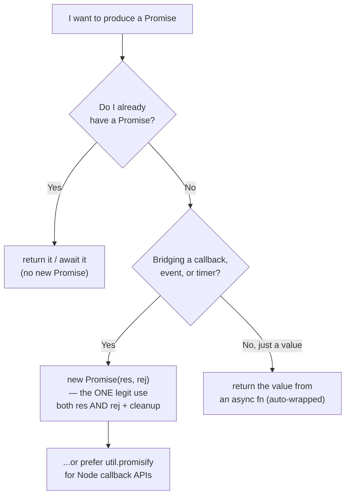

# Async Misuse Anti-Patterns — Middle

> **Category:** [Async Anti-Patterns](../README.md) → **Misuse** — *async machinery applied where it doesn't help.*
> **Covers (collectively):** Promise Constructor Anti-Pattern · `async` Without `await`

---

## Table of Contents

1. [Introduction](#introduction)
2. [Prerequisites](#prerequisites)
3. [The Real Question: When Does This Creep In?](#the-real-question-when-does-this-creep-in)
4. [Promise Constructor — Do You Already Have a Promise?](#promise-constructor--do-you-already-have-a-promise)
5. [The One Legitimate `new Promise`: Bridging a Non-Promise API](#the-one-legitimate-new-promise-bridging-a-non-promise-api)
6. [`async` Without `await` — It's Not Always a Bug](#async-without-await--its-not-always-a-bug)
7. [Python `asyncio` Analogs](#python-asyncio-analogs)
8. [Tooling: Let the Linter Catch These](#tooling-let-the-linter-catch-these)
9. [Common Mistakes](#common-mistakes)
10. [Test Yourself](#test-yourself)
11. [Cheat Sheet](#cheat-sheet)
12. [Summary](#summary)
13. [Further Reading](#further-reading)
14. [Related Topics](#related-topics)

---

## Introduction

> Focus: **When does this creep in?** and **What do I do instead?**

At the junior level you learned to *recognize* these two shapes: a `new Promise` wrapped around something that was already a Promise, and an `async` function that never `await`s anything. The middle-level skill is sharper — knowing the **exact moment** each one is about to be written, and the small reflex that avoids it.

Both anti-patterns share a root cause: **reaching for Promise machinery you don't need.** You already *have* a Promise — so you wrap it in another one and lose the errors. You're doing only synchronous work — so you bolt on `async` and pay for a microtask hop that buys nothing.

But there is a trap in "just delete it," and this is where middle engineers earn their keep. Neither keyword is purely decorative. `new Promise` is the *only* correct way to bridge a callback / event / timer API into the Promise world. And `async` **changes the return semantics** of a function — it wraps the return value and converts synchronous `throw`s into rejections. Strip it blindly and you can change behavior. This file is about telling the genuine misuse from the load-bearing keyword.

---

## Prerequisites

- **Required:** Comfortable reading [`junior.md`](junior.md) — you can identify both anti-patterns on sight.
- **Required:** You understand `Promise`, `then`/`catch`, `async`/`await`, and what "a microtask" means at a high level.
- **Helpful:** You've consumed a callback-style API (`fs.readFile`, an event emitter, `setTimeout`).
- **Helpful:** You run ESLint with `@typescript-eslint` or `eslint-plugin-promise` on a real codebase.
- **Helpful:** Familiarity with the sibling categories — [Error Handling](../01-error-handling/middle.md) and [Execution Shape](../02-execution-shape/middle.md) — since misuse often *feeds* an error-handling bug.

---

## The Real Question: When Does This Creep In?

Both anti-patterns have recognizable triggers. Name the moment and you can stop your own hand:

| Trigger | What you reach for | Anti-pattern | The reflex instead |
|---|---|---|---|
| **"I'll wrap this so I can resolve it later"** — but the thing you wrap is already a Promise | `new Promise(res => existingPromise.then(res))` | Promise Constructor | Just `return existingPromise` |
| **"I need a Promise to return"** — and you forgot you're in an `async` function | `new Promise(res => res(value))` | Promise Constructor | `return value` (the `async` wraps it) |
| **"This function might become async one day"** | `async function f()` with no `await` | `async` Without `await` | Drop `async` until a real `await` lands |
| **"Everything else here is async, I'll match the style"** | `async` on a pure-sync helper | `async` Without `await` | Keep it sync; callers can `await` a plain value |
| **"I'm bridging `setTimeout` / an event / a callback API"** | `new Promise((res, rej) => …)` | *Legitimate* — this is the one correct use | Wire up **both** `res` **and** `rej`, plus cleanup |

The common thread: **you reached for the constructor or the keyword by habit, not by need.** The countermove is always to ask *"do I already have a Promise?"* and *"is there a real `await` in here?"* before the machinery goes in.



---

## Promise Constructor — Do You Already Have a Promise?

### How it creeps in

You're writing a function that needs to do some async work and hand back a Promise. Your mental model says "a Promise is a thing I construct," so you type `new Promise`. Inside it, you call another async function — which *already returns a Promise* — and pipe its result to `resolve`:

```js
// Anti-pattern: wrapping an existing Promise in a new one — the "deferred" / "explicit construction" smell
function getUser(id) {
  return new Promise((resolve, reject) => {
    fetchUser(id)            // fetchUser ALREADY returns a Promise
      .then(user => resolve(user));
  });
}
```

This is pure ceremony. `fetchUser(id)` is already the Promise you want. You have built a second Promise whose only job is to forward the first one's resolution — an extra allocation, an extra microtask, and more lines to read.

Worse, look at the error path. There is **no `reject`**. If `fetchUser` rejects, the `.then(resolve)` never fires, `reject` is never called, and the outer Promise **hangs forever** — a leak that's invisible until something times out. This is the classic *error-loss* failure mode of the wrapped-promise form: the inner rejection has nowhere to go.

```js
// Even "fixing" it by adding reject is still the anti-pattern — just verbose:
function getUser(id) {
  return new Promise((resolve, reject) => {
    fetchUser(id).then(resolve, reject);   // works, but pointless
  });
}
```

### What to do instead

**1. If you already have a Promise, return it.** That's the whole fix.

```js
function getUser(id) {
  return fetchUser(id);          // done. errors propagate, no extra microtask
}
```

**2. Need to transform the result? Use `.then` or `await`, not a wrapper.**

```js
// then-style
function getUserName(id) {
  return fetchUser(id).then(user => user.name);
}

// async/await style — clearer, and rejections propagate automatically
async function getUserName(id) {
  const user = await fetchUser(id);
  return user.name;
}
```

**3. Inside an `async` function, you don't need `new Promise` to produce a Promise at all** — the function body *is* the Promise. Returning a value resolves it; `throw`ing rejects it.

```js
async function getConfig() {
  if (cached) return cached;            // resolves the returned Promise with `cached`
  const cfg = await loadConfig();       // await an existing Promise — no wrapper
  return cfg;
}
```

> **Why error-loss happens specifically here:** in `new Promise(executor)`, only a `throw` *synchronously inside the executor* is auto-converted to a rejection. An async failure inside the executor (a rejected Promise you `.then` from, an error in a callback) is **not** caught — you must route it to `reject` by hand, and the anti-pattern form routinely forgets to. Returning the Promise directly sidesteps the whole problem: its rejection is already wired.

> **Countermove in review:** when you see `new Promise` and the executor body contains `.then(` or `await`, that's almost always the anti-pattern. Ask: *"what is being constructed that wasn't already a Promise?"* Usually the answer is "nothing."

---

## The One Legitimate `new Promise`: Bridging a Non-Promise API

`new Promise` is not banned — it is the **only** tool for one specific job: turning an API that *predates Promises* (Node-style callbacks, event emitters, timers) into one. Here the thing you wrap is genuinely **not** a Promise, so there is nothing to "already have."

The rule for doing it correctly: **wire up both `resolve` and `reject`, and clean up any listeners or timers.**

```js
// Legitimate: bridge setTimeout (a timer API, not a Promise) into a Promise
function delay(ms) {
  return new Promise(resolve => setTimeout(resolve, ms));
  // no reject needed: setTimeout cannot fail
}
```

```js
// Legitimate: bridge a Node-style (err, data) callback API
function readFileP(path) {
  return new Promise((resolve, reject) => {
    fs.readFile(path, "utf8", (err, data) => {
      if (err) reject(err);     // BOTH paths handled
      else resolve(data);
    });
  });
}
```

```js
// Legitimate: bridge an event-emitter, with cleanup so listeners don't leak
function once(emitter, successEvent, errorEvent = "error") {
  return new Promise((resolve, reject) => {
    function cleanup() {
      emitter.off(successEvent, onSuccess);
      emitter.off(errorEvent, onError);
    }
    function onSuccess(value) { cleanup(); resolve(value); }
    function onError(err)     { cleanup(); reject(err); }
    emitter.on(successEvent, onSuccess);
    emitter.on(errorEvent, onError);
  });
}
```

Note what makes these correct and the earlier example wrong:

- **The wrapped thing is not a Promise** — `setTimeout`, `fs.readFile`, `emitter.on` have no `.then`. There is real bridging to do.
- **`reject` is wired** wherever failure is possible (the `err` argument, the `error` event).
- **Resources are released** — the event-emitter version removes both listeners on *either* outcome, so a resolved Promise doesn't leave a live `error` listener behind (which would also fire later and crash the process).

> **Prefer `util.promisify` over hand-rolling.** For Node-style `(err, result)` callbacks, the standard library already does this correctly — see the [Tooling](#tooling-let-the-linter-catch-these) section. Hand-rolled `new Promise` wrappers are where subtle bugs (forgotten `reject`, calling `resolve` twice, leaked listeners) hide.

---

## `async` Without `await` — It's Not Always a Bug

### How it creeps in

Three habits produce it:

1. **Premature `async`:** "this function will *probably* need to await something later," so you mark it `async` now. It never does.
2. **Style-matching:** the surrounding functions are `async`, so a new pure-sync helper gets `async` to "look consistent."
3. **Cargo-culting:** a belief that `async` is required to "return a Promise," when the real requirement was just "be awaitable."

```js
// async with no await — the function does only synchronous work
async function formatName(user) {
  return `${user.first} ${user.last}`;   // no await anywhere
}
```

### Why removing `async` is NOT always safe

Here is the trap. `async` is **not** a no-op when there's no `await`. It changes the function's **return semantics** in two ways:

1. **It wraps the return value in a Promise.** `async () => 42` returns `Promise<42>`; the non-async version returns `42`.
2. **It converts a synchronous `throw` into a rejected Promise.** This is the subtle one:

```js
// async: a sync throw becomes a REJECTION — caller's .catch() / try-await catches it
async function parseAsync(json) {
  return JSON.parse(json);     // if this throws, the returned Promise REJECTS
}
parseAsync("not json").catch(e => console.log("handled:", e.message));  // ✓ caught

// non-async: the throw is SYNCHRONOUS — a .catch() never sees it; it explodes at the call site
function parseSync(json) {
  return JSON.parse(json);     // throws synchronously
}
parseSync("not json").catch(e => {});   // ✗ TypeError thrown BEFORE .catch exists
```

If a caller does `await maybeThrows()` inside a `try/catch`, both forms behave the same (the `try` catches both). But if a caller does `maybeThrows().catch(...)` **without** `await`, the non-async version throws *before* `.catch` is attached and the handler never runs. So **removing `async` can change where and how an error surfaces.**

### So: when is `async`-without-`await` actually fine?

- **Intentional and fine:** you *want* uniform Promise semantics — every path resolves or rejects, never throws synchronously — e.g. a function on an interface where some implementations are async and some aren't. Marking the sync one `async` keeps the contract identical (always returns a Promise, never throws synchronously). This is a legitimate, deliberate use.
- **Genuine misuse:** the function is sync, callers already `await` it inside `try/catch` (so the throw-vs-reject difference is invisible), and the `async` was added by habit. Here it's pure overhead — every call adds a microtask hop, which on a hot path (called thousands of times per request) is measurable.

```js
// On a hot path, this microtask tax adds up for zero benefit:
async function clamp(x, lo, hi) {   // no await, called per-pixel in a render loop
  return Math.max(lo, Math.min(hi, x));
}
// Better: plain sync — no Promise, no microtask, callers don't need to await
function clamp(x, lo, hi) {
  return Math.max(lo, Math.min(hi, x));
}
```

> **Decision rule:** keep `async` if the function is part of a contract that must *uniformly* return Promises and never throw synchronously (the wrapping is the point). Drop it if it's a private sync helper whose throw/return semantics don't matter to callers — especially on hot paths. When in doubt, check **how callers consume it**: `await` inside `try/catch` → safe to drop; bare `.catch()`/`.then()` → dropping changes behavior.

---

## Python `asyncio` Analogs

Python has the same two misuses, dressed differently.

**1. Wrapping an existing awaitable (the Promise-Constructor analog).** The Pythonic mistake is creating a `Future` and manually piping a coroutine's result into it, or scheduling a task just to await it immediately:

```python
import asyncio

# Anti-pattern: manual Future wrapping a coroutine you could just await
async def get_user(id):
    fut = asyncio.get_event_loop().create_future()
    async def run():
        fut.set_result(await fetch_user(id))   # and if fetch_user raises? fut never resolves → hang
    asyncio.ensure_future(run())
    return await fut

# Fix: you already have an awaitable — just await (or return) it
async def get_user(id):
    return await fetch_user(id)
```

As in JS, the wrapped form loses errors: if `fetch_user` raises, nothing calls `fut.set_exception`, so the awaiter hangs forever. The manual-`Future` form is only justified for the *legitimate bridging* case — adapting a callback-based library (e.g. `loop.call_soon`, a protocol's `data_received`) into an awaitable, where you wire both `set_result` **and** `set_exception`.

**2. `async def` with no `await` (the `async`-without-`await` analog).** An `async def` *always* returns a coroutine, even with no `await` inside:

```python
# No await — calling it returns a coroutine object, not the value
async def format_name(user):
    return f"{user.first} {user.last}"

# Callers MUST await it, or they get a coroutine and a "never awaited" warning:
name = format_name(u)            # ✗ name is a coroutine; RuntimeWarning if never awaited
name = await format_name(u)      # ✓
```

As in JS, `async def` changes semantics (the caller now *must* `await`), so it's only worth it when the function genuinely participates in async flow. A pure-sync helper should be a plain `def`. Python's runtime even helps: a coroutine that's created and never awaited triggers a `RuntimeWarning: coroutine '…' was never awaited` — the analog of JS's "forgotten await."

---

## Tooling: Let the Linter Catch These

You should not be policing these by eye. Three tools cover the bulk of it.

**1. `no-async-promise-executor` (ESLint core).** Flags the *most dangerous* constructor mistake: an `async` function passed as the `new Promise` executor. An async executor's rejection is silently swallowed — the worst of both anti-patterns combined.

```js
// ESLint error: Promise executor functions should not be async (no-async-promise-executor)
new Promise(async (resolve, reject) => {
  const x = await something();   // if `something()` rejects, it's LOST — outer Promise hangs
  resolve(x);
});
```

```jsonc
// .eslintrc — it's in eslint:recommended, but be explicit
{ "rules": { "no-async-promise-executor": "error" } }
```

**2. `require-await` (ESLint core / `@typescript-eslint/require-await`).** Flags `async` functions that contain no `await` — exactly the `async`-without-`await` smell. Use the TypeScript version for type-aware accuracy.

```jsonc
{ "rules": { "@typescript-eslint/require-await": "warn" } }
```

> **Treat `require-await` as a prompt, not a verdict.** Remember the legitimate case (uniform Promise contract / never-throw-synchronously). When the rule fires on a deliberately-async function, either keep `async` and add an inline `// eslint-disable-next-line` with a one-line reason, or — if you genuinely want sync-throw-as-rejection without an `await` — keep it. The lint exists to make you *justify* the keyword, not to forbid it.

**3. `util.promisify` (Node standard library) — the antidote to hand-rolled wrappers.** Instead of writing `new Promise` around a Node-style `(err, result)` callback, let the platform do it correctly:

```js
const { promisify } = require("node:util");
const fs = require("node:fs");

const readFileP = promisify(fs.readFile);     // correct reject-on-err, no leaks, done for you
const data = await readFileP("config.json", "utf8");

// Many Node modules already ship Promise versions — prefer those:
const fsp = require("node:fs/promises");
const data2 = await fsp.readFile("config.json", "utf8");
```

`promisify` handles the `(err, result)` convention, wiring `reject(err)` and `resolve(result)` for you — eliminating the forgotten-`reject` and double-`resolve` bugs that plague hand-rolled wrappers. Reserve `new Promise` for APIs `promisify` can't handle (event emitters, multi-argument callbacks, timers).

In Python, the analog is `asyncio.to_thread` / `loop.run_in_executor` for blocking calls, and library-provided coroutine APIs (`aiofiles`, `httpx`) instead of hand-built `Future` wrappers.

---

## Common Mistakes

1. **Adding `reject` to a wrapped Promise and calling it "fixed."** `new Promise((res, rej) => p.then(res, rej))` works but is still the anti-pattern — you're forwarding a Promise you should have returned. The fix is deletion, not patching.
2. **Forgetting `reject` in a *legitimate* bridge.** When you genuinely wrap a callback/event API, omitting the error path makes the Promise hang forever on failure. Always handle both outcomes.
3. **Leaking listeners in an event-emitter bridge.** Resolving without removing the `error` listener leaves a live handler that fires later and can crash the process. Clean up on *both* paths.
4. **Passing an `async` function as a Promise executor.** `new Promise(async (res, rej) => …)` swallows the executor's rejections. This combines both anti-patterns; `no-async-promise-executor` exists precisely to stop it.
5. **Blindly stripping `async` to satisfy the linter.** If callers consume the function with bare `.then`/`.catch` (no `await`), removing `async` turns a rejection into a synchronous throw and breaks their error handling. Check call sites first.
6. **Adding `async` "for the future."** A function that will *maybe* be async someday should be sync today. Add `async` when the first real `await` lands — that's a one-line change, and until then you save a microtask per call.
7. **Hand-rolling `new Promise` around Node callbacks.** Reach for `util.promisify` or the `fs/promises`-style API instead; the hand-rolled version is where forgotten-`reject` and double-resolve bugs live.

---

## Test Yourself

1. You see `return new Promise(r => fetchData().then(r))`. What's wrong with it, including the error behavior, and what's the one-line fix?
2. Name the *only* category of API for which `new Promise` is the correct tool, and the two things you must always do inside the executor.
3. A teammate says "`async` with no `await` is always dead weight — just delete the keyword." Give one concrete case where deleting it changes behavior.
4. Why is `new Promise(async (resolve, reject) => { … })` especially dangerous, and which ESLint rule catches it?
5. In Python, what happens at runtime if you call an `async def` function and never `await` the result?
6. You have a function on an hot path called 10,000×/request that's marked `async` but does only `Math` work. Callers `await` it inside `try/catch`. Is dropping `async` safe, and why does it matter here?

---

## Cheat Sheet

| Situation | Anti-pattern? | Do this |
|---|---|---|
| `new Promise(r => existingPromise.then(r))` | **Yes** — Promise Constructor; also drops errors | `return existingPromise` |
| `new Promise` whose executor contains `await` / `.then` | **Yes** — nothing new is being constructed | Return / await the inner Promise |
| `new Promise(async (res, rej) => …)` | **Yes** — swallows rejections | Never; `no-async-promise-executor` flags it |
| `new Promise((res, rej) => fs.readFile(p, cb))` | **No** — legitimate bridge | Wire **both** `res` & `rej`; prefer `util.promisify` |
| `new Promise(res => setTimeout(res, ms))` | **No** — legitimate timer bridge | Fine (no `reject` needed; timers can't fail) |
| `async fn()` with no `await`, callers use `await`+`try/catch` | **Yes** — pointless microtask | Drop `async`, return value directly |
| `async fn()` with no `await`, callers use bare `.then/.catch` | **Careful** | Dropping `async` changes throw→reject; check call sites |
| `async fn()` on an interface that must uniformly return Promises | **No** — intentional | Keep `async`; the wrapping/never-throw-sync is the point |

**Two golden rules:**
- *Before `new Promise`, ask: "do I already have a Promise?" If yes, return it. The only legit `new Promise` bridges a non-Promise API — and wires both `resolve` and `reject`.*
- *`async` is not free decoration: it wraps the return value and turns sync throws into rejections. Drop it when those semantics don't matter (hot-path sync helpers); keep it when the uniform-Promise contract is the point.*

---

## Summary

- Both misuses come from **reaching for Promise machinery you don't need** — wrapping a Promise you already have, or marking a sync function `async`.
- **Promise Constructor:** if `fetchX()` returns a Promise, `return fetchX()` — never `new Promise(r => fetchX().then(r))`. The wrapper adds overhead and, by routinely forgetting `reject`, **loses errors and hangs forever** on failure.
- **The one legitimate `new Promise`** is bridging a non-Promise API (callbacks, events, timers) — done correctly with **both** `resolve` **and** `reject` plus listener/timer cleanup. For Node callbacks, prefer `util.promisify` over hand-rolling.
- **`async` Without `await`** is *not* always a bug: `async` wraps the return value and converts synchronous throws into rejections. Removing it can change where errors surface. Drop it on hot-path sync helpers (it costs a microtask); keep it when a uniform never-throw-synchronously Promise contract is intentional.
- **Let tooling do the policing:** `no-async-promise-executor` (the dangerous async-executor case), `require-await` (the no-`await` smell, treated as a prompt to justify the keyword), and `util.promisify` (the antidote to hand-rolled wrappers).
- Python's `asyncio` mirrors both: manual `Future` wrapping vs. just awaiting; `async def` with no `await` returning an unawaited coroutine that warns at runtime.
- Next: [`senior.md`](senior.md) — auditing these across a codebase, the microtask-queue cost model, and structured-concurrency alternatives to ad-hoc Promise construction.

---

## Further Reading

- **JavaScript: The Definitive Guide** — David Flanagan (7th ed., 2020) — Promises, `async`/`await`, and the construction pitfalls.
- **You Don't Know JS: Async & Performance** — Kyle Simpson — the event loop, microtasks, and why wrapping Promises misbehaves.
- **Async Programming in C#** — Stephen Cleary — names "elided async" and "the deferred Promise/Task anti-pattern" directly; the reasoning transfers to JS.
- **Node.js `util.promisify` documentation** — [nodejs.org/api/util.html#utilpromisifyoriginal](https://nodejs.org/api/util.html#utilpromisifyoriginal) — the canonical callback-to-Promise adapter.
- **ESLint rule: `no-async-promise-executor`** — [eslint.org/docs/latest/rules/no-async-promise-executor](https://eslint.org/docs/latest/rules/no-async-promise-executor).
- **Python `asyncio` documentation — Futures & Tasks** — [docs.python.org/3/library/asyncio-future.html](https://docs.python.org/3/library/asyncio-future.html) — when a manual `Future` is and isn't warranted.

---

## Related Topics

- [`junior.md`](junior.md) — recognizing both anti-patterns from scratch.
- [Async → Error Handling](../01-error-handling/middle.md) — where the dropped rejections from a bad `new Promise` end up.
- [Async → Execution Shape](../02-execution-shape/middle.md) — the sibling category; mixing callbacks and Promises lives next door.
- [Concurrency Anti-Patterns](../../03-concurrency/README.md) — the multi-thread sibling chapter.
- Concurrency Roadmap — the positive patterns these misuses corrupt.

---

## Check your understanding

1. Explain Async Misuse Anti-Patterns — Middle Level in your own words and name the problem it solves.
2. How would you apply the ideas around Table of Contents, Introduction, Prerequisites in a realistic engineering change?
3. What failure mode or misuse should you look for, and what evidence would reveal it?
4. Which local design trade-off would make you choose or reject Async Misuse Anti-Patterns — Middle Level in an existing codebase?
5. What observable result would convince you that the approach improved the system?
