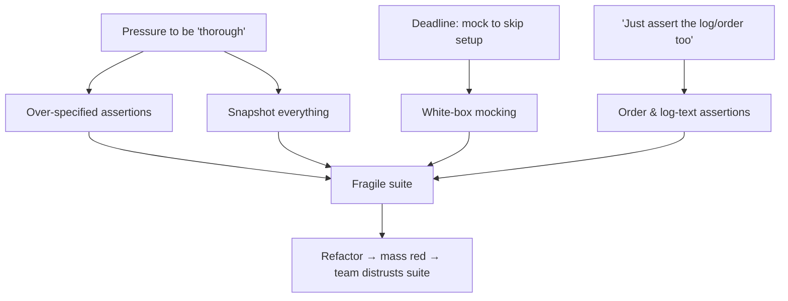

# Fragile Tests — Middle

> **Category:** [Testing Anti-Patterns](../README.md) → **Fragile Tests** — *a test that breaks when you change code without changing its behavior.*

---

## Table of Contents

1. [Introduction](#introduction)
2. [Prerequisites](#prerequisites)
3. [Where Fragility Creeps In](#where-fragility-creeps-in)
4. [Over-Specified Assertions](#over-specified-assertions)
5. [Asserting on Order and Log Text](#asserting-on-order-and-log-text)
6. [Snapshot-Everything](#snapshot-everything)
7. [White-Box Mocking](#white-box-mocking)
8. [The Principle: Test the Contract](#the-principle-test-the-contract)
9. [Refactors in All Three Languages](#refactors-in-all-three-languages)
10. [Common Mistakes](#common-mistakes)
11. [Test Yourself](#test-yourself)
12. [Cheat Sheet](#cheat-sheet)
13. [Summary](#summary)
14. [Further Reading](#further-reading)
15. [Related Topics](#related-topics)

---

## Introduction

> Focus: **When does fragility creep in?** and **What do you write instead?**

`junior.md` defined the smell — a test that breaks on a behavior-preserving change — and gave the three first habits. This file is about the *real* sources of fragility in a growing codebase, the ones that don't look like mistakes when you write them. They look like diligence.

Nobody sets out to write a brittle test. Fragility arrives disguised as thoroughness: you assert on *every* field "to be safe," you snapshot the *whole* response "so nothing slips through," you verify *all* the mock calls "to be precise." Each choice feels rigorous in the moment. Months later they're the reason a one-line refactor turns forty tests red.

The middle-level skill is recognizing the *creep* — the specific patterns that over-couple a test to its subject — and knowing the precise countermove for each. Four patterns cause most of it: **over-specified assertions, order/log-text assertions, snapshot-everything, and white-box mocking.** This file dissects each, then ties them to one unifying principle — **test the contract, not the implementation** — with example refactors in Go, Java, and Python.

> **The mental model:** every assertion is a *promise about the future*. `assert x.total == 25` promises "the total will always be 25 for this input." `assert x._items == [...]` promises "the internal list will always have this exact shape" — a promise you never meant to make and will break on the next cleanup. Fragility is the accumulation of promises you didn't mean to make.

---

## Prerequisites

- **Required:** Fluency with [`junior.md`](junior.md) — you can tell a brittle test from a robust one and name the four things tests couple to.
- **Required:** Comfortable writing and reading mocks/stubs/fakes in at least one of Go (`testify/mock`, hand-rolled fakes), Java (Mockito), Python (`unittest.mock`, `pytest` fixtures).
- **Required:** You've maintained a test suite over time — felt a refactor cascade into unrelated test failures.
- **Helpful:** Exposure to snapshot/golden-master testing (Jest snapshots, `approvaltests`, Go golden files).

---

## Where Fragility Creeps In

Fragility correlates with *growth*. A small suite written by one careful person stays robust; a large suite written under deadline pressure by a rotating team accumulates coupling. The specific entry points:



Each path shares a tell: the test asserts on something *broader or deeper than the contract requires*. The fix is always to *narrow* the assertion to the behavior that actually matters.

---

## Over-Specified Assertions

The most common creep. You're testing one behavior, but you assert on the entire object — including fields the behavior under test never touches.

```python
# Subject: create_user assigns an id and sets status to ACTIVE.
def create_user(name, email):
    return User(id=next_id(), name=name, email=email,
                status="ACTIVE", created_at=now(), version=1)
```

**Over-specified — pins fields the behavior doesn't promise:**

```python
def test_create_user_overspecified():
    u = create_user("Sam", "sam@x.io")
    # Asserts on the ENTIRE object, including volatile/incidental fields.
    assert u == User(id=1, name="Sam", email="sam@x.io",
                     status="ACTIVE", created_at=datetime(2026, 6, 10),  # ← flaky AND fragile
                     version=1)                                          # ← unrelated to this test
```

This breaks when: `next_id()` returns 2 instead of 1, `now()` advances a millisecond, a new `version` scheme ships, or anyone adds a field to `User`. None of those changes the behavior *this test is about* (id assigned, status ACTIVE).

**Robust — assert only what this behavior promises:**

```python
def test_create_user_assigns_id_and_activates():
    u = create_user("Sam", "sam@x.io")
    assert u.id is not None       # an id was assigned (don't pin the value)
    assert u.status == "ACTIVE"   # the one behavior under test
    # name/email are inputs echoed back — assert if THAT'S the behavior; otherwise skip.
```

> **The rule:** one test, one behavior, the *minimum* assertions that pin it. If a field is irrelevant to the behavior under test, don't assert on it — let another test own it, or let no test own incidental details like timestamps.

---

## Asserting on Order and Log Text

Two incidental details that masquerade as contracts.

**Order.** Unless ordering is part of the spec (a sorted result, a stable queue), don't assert on it.

```go
// Subject returns the set of active user IDs. Order is NOT part of the contract.
func ActiveUserIDs(users []User) []int { /* ... */ }
```

```go
// Fragile — pins an order the contract never promised.
func TestActiveUserIDs_fragile(t *testing.T) {
    got := ActiveUserIDs(sample)
    assert.Equal(t, []int{1, 3, 7}, got)   // ← breaks if iteration order changes (e.g. map-backed)
}

// Robust — assert membership, ignore order.
func TestActiveUserIDs_robust(t *testing.T) {
    got := ActiveUserIDs(sample)
    assert.ElementsMatch(t, []int{1, 3, 7}, got)   // same elements, any order
}
```

**Log text.** Logs are debugging prose for humans — the single most volatile text in a codebase. A test that greps for a log message breaks every time someone improves the wording.

```python
# Fragile — pins the exact human-readable log string.
def test_logs_fragile(caplog):
    process(order)
    assert "Successfully processed order #42 for customer Sam" in caplog.text
    #        ↑ breaks on any rewording, capitalization, punctuation, or id format change
```

If the *fact that something was logged* is genuinely part of the contract (an audit requirement, say), assert on structured fields, not prose:

```python
def test_emits_audit_event(audit_sink):
    process(order)
    event = audit_sink.last()
    assert event.type == "order.processed"   # stable contract
    assert event.order_id == 42              # stable field
    # The human-facing message can change freely.
```

> Most of the time the right answer is *don't assert on logs at all.* Assert on the behavior the log is *describing* (the order's status, the response returned). The log is a side effect, not the contract.

---

## Snapshot-Everything

Snapshot (a.k.a. golden-master / approval) testing records a blob of output and fails when it changes. Used surgically it's powerful — for legacy characterization, for output that's genuinely a contract (a public API response schema). Used as a default it's a fragility factory.

```python
# Snapshot-everything: capture the WHOLE rendered HTML and diff it.
def test_dashboard_snapshot(snapshot):
    html = render_dashboard(user)
    snapshot.assert_match(html)   # ← fails on ANY change: a CSS class, whitespace, a timestamp
```

The failure mode: a designer renames a CSS class, the snapshot goes red, and the developer — who has no idea what the "correct" output is supposed to be — just **re-records the snapshot** (`--update-snapshots`) to make it green. The test now blesses whatever the code currently does, including bugs. Snapshot-everything degrades into *"assert the output equals the output,"* which verifies nothing.

**When snapshots are right:**
- **Characterizing legacy code** you don't yet understand — freeze current behavior so you can refactor safely (intentionally temporary; see [`senior.md`](senior.md)).
- **Output that genuinely IS the contract** — a serialized public API payload, a generated file format — *and* the snapshot is small, readable, and reviewed like code.

**When they're wrong:** as a substitute for thinking about *what specifically should be true.* If the snapshot is large, includes volatile data, or nobody reviews the diff, it's fragility you re-record into meaninglessness.

```python
# Better than snapshot-everything: assert the specific facts that matter.
def test_dashboard_shows_user_and_balance():
    page = parse(render_dashboard(user))
    assert page.heading == "Welcome, Sam"
    assert page.balance == "$1,250.00"
    # Volatile chrome (classes, layout, timestamps) is free to change.
```

> **Heuristic:** if you'd hit "update snapshot" without reading the diff, the snapshot isn't a test — it's a rubber stamp. Replace it with assertions on the handful of facts you actually care about.

---

## White-Box Mocking

White-box mocking is the deepest source of fragility because it *inverts* what a test is for. Instead of checking the result, it checks the internal choreography — and that choreography is exactly what refactoring changes.

```java
// Subject: PriceService.quote() computes a price using a tax calc and a discount calc.
@Test
void quote_whiteBox() {       // FRAGILE
    PriceService svc = new PriceService(taxCalc, discountCalc, repo);

    svc.quote(item, customer);

    // Pins the exact internal calls and their order:
    InOrder o = inOrder(repo, taxCalc, discountCalc);
    o.verify(repo).load(item.id());
    o.verify(discountCalc).apply(any(), eq(customer));
    o.verify(taxCalc).add(any(), eq(customer.region()));
    verifyNoMoreInteractions(repo, taxCalc, discountCalc);   // ← forbids ANY change to internals
}
```

This test fails if you: reorder discount and tax, cache the `repo.load`, compute tax inline, or add any new internal step. None changes the *quoted price* — yet every one turns the test red. `verifyNoMoreInteractions` is the worst offender: it freezes the implementation solid.

**Robust — assert on the computed result, use real or fake collaborators:**

```java
@Test
void quote_returnsPriceWithDiscountAndTax() {
    // Use real, simple collaborators (or thin fakes) instead of mocks-with-verification.
    PriceService svc = new PriceService(
        new PercentTax(0.10), new FlatDiscount(5), new InMemoryItemRepo(item));

    Money quote = svc.quote(item, customer);

    assertThat(quote).isEqualTo(Money.of("104.50"));   // (100 - 5) * 1.10 — the actual contract
}
```

The robust test couples to the *price*, which is the contract. The implementation is free to reorder, cache, or inline. This is the dividing line: **mock at real boundaries (network, clock, payment gateway), not at internal seams** — and assert on outcomes, not interactions. The full treatment is in [over-mocking](../06-over-mocking/middle.md).

> **Tell:** if your test would still pass when the method returns the *wrong number* (because it only checks that calls happened), it's white-box and fragile. A test that can't catch a wrong result isn't testing behavior.

---

## The Principle: Test the Contract

Every countermove above is the same idea: **test the contract, not the implementation.** The contract is the set of promises a unit makes to its callers — its inputs, its outputs, its observable side effects, its error behavior. The implementation is *how* it keeps those promises.

| Layer | Examples | Test it? |
|---|---|---|
| **Contract** (public) | return values, public state, emitted domain events, error types, response schema | **Yes** — this is what tests are for |
| **Implementation** (private) | private fields, internal method call order, helper functions, log wording, storage format | **No** — coupling here is fragility |

The boundary is sometimes genuinely hard to draw — *some* breakage on a public-contract change is correct, even desirable. That nuance is `professional.md`. At the middle level, the working rule is blunt and almost always right:

> **If a behavior-preserving refactor would break the assertion, the assertion is on the implementation. Move it to the contract.**

A practical way to apply it: before each assertion, name the *caller-visible behavior* it verifies in plain words. "The total is 25." "The user ends up ACTIVE." "An invalid amount raises a validation error." If you can't name a caller-visible behavior — if the best you can say is "the internal list looks like this" or "save() was called" — the assertion is coupling to implementation.

---

## Refactors in All Three Languages

The same brittle→robust transformation, once per language, on realistic code.

### Go — outcome over interaction

```go
// BEFORE — fragile: asserts the mock was called, in order.
func TestRegister_fragile(t *testing.T) {
    repo := new(MockRepo); mailer := new(MockMailer)
    repo.On("Save", mock.Anything).Return(nil)
    mailer.On("SendWelcome", mock.Anything).Return(nil)

    svc := NewSignup(repo, mailer)
    svc.Register("sam@x.io")

    repo.AssertCalled(t, "Save", mock.Anything)        // ← interaction, not outcome
    mailer.AssertCalled(t, "SendWelcome", mock.Anything)
}

// AFTER — robust: fakes that record state; assert on observable outcome.
func TestRegister_robust(t *testing.T) {
    repo := NewInMemoryRepo()        // a real fake, not a verifying mock
    mailer := NewFakeMailer()

    svc := NewSignup(repo, mailer)
    err := svc.Register("sam@x.io")

    require.NoError(t, err)
    assert.True(t, repo.Exists("sam@x.io"))          // the user was actually persisted
    assert.Equal(t, 1, mailer.CountTo("sam@x.io"))   // a welcome mail actually exists
}
```

### Java — narrow the assertion (drop over-specification)

```java
// BEFORE — fragile: full-object equals pins volatile fields.
@Test
void parseOrder_fragile() {
    Order o = parser.parse(json);
    assertThat(o).isEqualTo(new Order(1L, "Sam", ACTIVE, Instant.parse("2026-06-10T00:00:00Z"), 1));
}

// AFTER — robust: assert the fields THIS behavior is responsible for.
@Test
void parseOrder_extractsCustomerAndStatus() {
    Order o = parser.parse(json);
    assertThat(o.customer()).isEqualTo("Sam");
    assertThat(o.status()).isEqualTo(ACTIVE);
    // id generation and timestamps are other tests' (or no test's) concern.
}
```

### Python — values, not serialized format

```python
# BEFORE — fragile: pins exact JSON string (key order, whitespace, separators).
def test_serialize_fragile():
    assert to_json(cart) == '{"items": [{"sku": "A", "qty": 2}], "total": 20}'

# AFTER — robust: parse, then assert on values. Key order can't break it.
def test_serialize_includes_items_and_total():
    data = json.loads(to_json(cart))
    assert data["total"] == 20
    assert data["items"] == [{"sku": "A", "qty": 2}]
```

---

## Common Mistakes

1. **Equating "more assertions" with "better test."** Each extra assertion on an incidental field is another promise you'll break on a refactor. Assert the minimum that pins the behavior; let other tests own other behaviors.
2. **Using snapshots as the default assertion.** Snapshot-everything degrades into "re-record until green," which verifies nothing. Reserve snapshots for legacy characterization or output that genuinely *is* the contract — and review every diff.
3. **Asserting on logs because they're easy to reach.** The log string is the most volatile text you have. Assert on the behavior the log describes; only check structured audit fields if the emission is a real requirement.
4. **`verifyNoMoreInteractions` / strict mocks by habit.** They freeze the implementation. Strictness belongs only where the *set* of interactions is genuinely the contract (e.g. "must charge the card exactly once"). Otherwise it's pure fragility.
5. **Mocking internal collaborators.** Mock at real boundaries (network, clock, third-party APIs). Mocking an internal helper couples the test to a seam that refactoring will move — see [over-mocking](../06-over-mocking/middle.md).
6. **Pinning generated values (ids, timestamps, UUIDs).** Assert *that* an id exists or matches a shape (`is not None`, a UUID regex), not its exact value. Pinning generated values is both fragile and flaky.

---

## Test Yourself

1. A teammate adds a field to `User` and 30 unrelated tests go red. What anti-pattern is in those tests, and what's the one-word countermove?
2. When is a snapshot test a *good* idea? When does it become a rubber stamp?
3. Why is asserting on log text almost always fragile? What do you assert on instead?
4. Rewrite this Go assertion to be order-independent: `assert.Equal(t, []int{1,3,7}, ActiveUserIDs(users))`.
5. What's the tell that a mock-based test is white-box (and therefore fragile)?
6. State the single rule that decides whether an assertion is on the contract or the implementation.

---

## Cheat Sheet

| Creep | Looks diligent as | Countermove |
|---|---|---|
| **Over-specified assertions** | "assert the whole object to be safe" | Assert the minimum fields the behavior promises |
| **Order assertions** | "the result should be `[1,3,7]`" | `ElementsMatch` / set comparison unless order *is* the spec |
| **Log-text assertions** | "check the log says X" | Assert the behavior the log describes; structured fields if audited |
| **Snapshot-everything** | "snapshot it so nothing slips" | Reserve for legacy/contract output; otherwise assert specific facts |
| **White-box mocking** | "verify it calls save() in order" | Fakes/real objects; assert outcome, mock only real boundaries |

> **One rule to remember:** *test the contract, not the implementation. Every assertion is a promise about the future — only promise what the contract actually makes.*

---

## Summary

- Fragility **creeps in disguised as thoroughness**: over-specified assertions, order/log-text assertions, snapshot-everything, and white-box mocking each feel rigorous and each over-couple the test to its subject.
- The unifying cure is one principle — **test the contract, not the implementation.** Assert on outputs, observable state, and error behavior; never on private state, internal call order, log prose, or serialization format.
- The blunt working rule: *if a behavior-preserving refactor would break the assertion, the assertion is on the implementation — move it to the contract.* Before each assertion, name the caller-visible behavior it verifies.
- Snapshots and strict mocks aren't evil — they're **sharp tools** for narrow cases (legacy characterization, contract output, exactly-once side effects). Used as defaults they manufacture fragility.
- Next: [`senior.md`](senior.md) — *de-fragilizing a real suite: finding brittle clusters, characterization vs over-specification, and reducing coupling to internals across hundreds of tests.*

---

## Further Reading

- **xUnit Test Patterns** — Gerard Meszaros (2007) — *Fragile Test*, *Overspecified Software*, *Sensitive Equality*, and the *State Verification vs Behavior Verification* distinction.
- **"Mocks Aren't Stubs"** — Martin Fowler (martinfowler.com) — state verification vs behavior verification; classicist vs mockist testing, the root of white-box mocking fragility.
- **Growing Object-Oriented Software, Guided by Tests** — Freeman & Pryce (2009) — when interaction testing is appropriate and when it over-specifies.
- **Unit Testing Principles, Practices, and Patterns** — Vladimir Khorikov (2020) — "resistance to refactoring" as one of the four pillars of a good test.

---

## Related Topics

- [Over-Mocking](../06-over-mocking/middle.md) — white-box mocking, the deepest fragility source, in detail.
- [Flaky Tests](../02-flaky-tests/middle.md) — over-specified assertions on timestamps/ids are often *both* fragile and flaky.
- [Mystery Guest](../03-mystery-guest/middle.md) — hidden fixtures compound over-specification.
- Refactoring → Code Smells — the smell-level view of test code.
- The `mocking-strategies` and `unit-testing-patterns` skills — state vs interaction verification, mock/stub/fake choice.

---

## Check your understanding

1. Explain Fragile Tests — Middle Level in your own words and name the problem it solves.
2. How would you apply the ideas around Table of Contents, Introduction, Prerequisites in a realistic engineering change?
3. What failure mode or misuse should you look for, and what evidence would reveal it?
4. Which local design trade-off would make you choose or reject Fragile Tests — Middle Level in an existing codebase?
5. What observable result would convince you that the approach improved the system?
