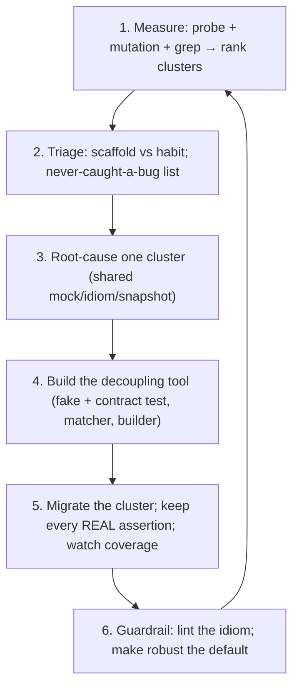

# Fragile Tests — Senior

> **Category:** [Testing Anti-Patterns](../README.md) → **Fragile Tests** — *a test that breaks when you change code without changing its behavior.*

---

## Table of Contents

1. [Introduction](#introduction)
2. [Prerequisites](#prerequisites)
3. [How a Suite Becomes Fragile](#how-a-suite-becomes-fragile)
4. [Finding the Brittle Clusters](#finding-the-brittle-clusters)
5. [Test Behavior, Not Implementation — at Scale](#test-behavior-not-implementation--at-scale)
6. [Characterization vs Over-Specification](#characterization-vs-over-specification)
7. [Reducing Coupling to Internals](#reducing-coupling-to-internals)
8. [Good Test Design Is the Real Fix](#good-test-design-is-the-real-fix)
9. [A De-Fragilization Campaign](#a-de-fragilization-campaign)
10. [When NOT to De-Fragilize](#when-not-to-de-fragilize)
11. [Common Mistakes](#common-mistakes)
12. [Test Yourself](#test-yourself)
13. [Cheat Sheet](#cheat-sheet)
14. [Summary](#summary)
15. [Further Reading](#further-reading)
16. [Related Topics](#related-topics)

---

## Introduction

> Focus: **De-fragilizing a real suite** — finding the brittle clusters, applying *test behavior not implementation* at scale, and reducing coupling to internals without losing coverage.

`junior.md` taught you to recognize a fragile test; `middle.md` taught you the four creep patterns and how to write robust tests instead. This file is about the situation you inherit as a senior: a suite of three thousand tests where a one-line domain refactor turns two hundred of them red, the team has learned to `git checkout` whole test files rather than fix them, and "just rewrite the tests" is a multi-week project nobody will fund.

The senior problem is not "write a robust test" — you can already do that. It is **"this suite punishes change, how do I make it stop, incrementally, without dropping the coverage we depend on?"** That is a different discipline. It requires *measuring* brittleness, *locating* the worst clusters, distinguishing fragility-that-is-a-bug from breakage-that-is-correct, and refactoring tests under the same constraints you'd refactor production code: small reversible steps, never lose a real assertion, never let coverage silently rot.

Two ideas anchor the level:

1. **Brittleness is a property of the *suite*, not a test.** One fragile test is an annoyance; a *cluster* of them sharing the same root cause — a god mock, a full-object `equals`, a snapshot of everything — is a structural defect. You fix the cause, not the symptoms.

2. **Resistance to refactoring is a first-class quality attribute.** A test that catches bugs but blocks every cleanup is failing half its job. The senior measures a suite on *both* axes — does it catch real regressions, *and* does it survive behavior-preserving change — and trades deliberately between them.

> **The senior mindset shift:** the junior asks "is this test fragile?"; the senior asks "where is this suite coupling to internals, what is that coupling costing us per refactor, and what is the smallest change that decouples the most tests?" You are managing the *changeability* of a system, with the test suite as both the safety net and, when fragile, the thing tangling your feet.

---

## Prerequisites

- **Required:** Fluency with [`junior.md`](junior.md) and [`middle.md`](middle.md) — the four creep patterns, the contract/implementation boundary, and robust-test idioms in Go/Java/Python.
- **Required:** You've owned a test suite through significant change — felt a refactor cascade into mass red and had to triage it.
- **Required:** Comfort with characterization testing and the legacy-code seam vocabulary (Feathers).
- **Helpful:** Coverage tooling and the ability to read a coverage diff; familiarity with mutation testing as a quality signal.
- **Helpful:** [over-mocking](../06-over-mocking/senior.md) — over-mocking is the dominant root cause of brittle clusters.

---

## How a Suite Becomes Fragile

Brittle suites are not written; they *accrete*, and almost always from a small number of repeated decisions copied across hundreds of tests:

- **A "test base class" or shared mock setup** that every test inherits, wiring strict mocks for collaborators most tests don't care about. Now any signature change to a collaborator breaks the base, and the base breaks everyone.
- **A copy-pasted assertion style.** One person wrote a full-object `assertEquals(expected, actual)`; it got copied two hundred times. The team's *default* is now over-specification.
- **A snapshot harness adopted suite-wide.** Snapshots were great for the one legacy module; then they became the house style, and now every UI tweak re-records forty `.snap` files unreviewed.
- **Mock-return scripts that mirror the implementation.** Tests `when(repo.load()).thenReturn(...)` in the exact sequence the code calls them, so the test file is a transcript of the implementation. Refactor the implementation, retranscribe every test.

The common structure: **the fragility lives in a shared fixture or a shared idiom**, which is why it shows up in clusters and why fixing it one test at a time never finishes. Find the shared cause.

> **Diagnostic instinct:** when a refactor turns N tests red and N is large, don't open all N. Open three, find what they share, and fix *that*. The cluster has one root.

---

## Finding the Brittle Clusters

You can't de-fragilize a suite you can't see. Make brittleness *observable* before touching it.

**1. The refactor probe (cheapest, most honest signal).** Make a deliberate behavior-preserving change to production code — rename a private field, extract a method, reorder two independent statements, change a log string — and count the failures. Every test that goes red is, by definition, coupled to something other than behavior.

```bash
# Cheap brittleness probe: rename a PRIVATE symbol, run the suite, count red.
# Robust tests don't touch privates → stay green. Fragile ones light up the clusters.
git stash        # park the probe so you don't ship it
```

**2. Mutation testing (the rigorous signal).** Mutation testing flips operators and deletes statements in *production* code and checks whether tests catch it. It surfaces the opposite-but-related problem: tests that are over-coupled to internals often have *low* mutation-killing power, because they assert on calls rather than results. A suite with high coverage but low mutation score is frequently a fragile, over-mocked one.

```bash
# Java: PIT.  Go: go-mutesting / gremlins.  Python: mutmut / cosmic-ray.
mvn org.pitest:pitest-maven:mutationCoverage
# A test that asserts only "save() was called" survives a mutation that returns the
# wrong value → low mutation score is a fingerprint of white-box, fragile tests.
```

**3. Static tells.** Grep the suite for the fragility idioms and rank files by hit count — the high-count files are your clusters.

```bash
# Java fragility fingerprints (rank descending):
grep -rln "verifyNoMoreInteractions\|InOrder\|verify(.*).*never()" src/test/
# Snapshot sprawl:
find . -name '*.snap' -size +5k       # large snapshots = unreviewed rubber stamps
# Reflection / private access in tests (language-dependent):
grep -rln "setAccessible(true)\|ReflectionTestUtils" src/test/
```

**4. Change-failure correlation.** If you have CI history, correlate test failures with commits that touched only refactoring (no behavior change). The tests that fail most on no-behavior commits are your worst offenders. This is the data that justifies the campaign to your manager: *"these 40 tests cost us X engineer-hours per quarter and have never caught a real bug."*

---

## Test Behavior, Not Implementation — at Scale

The middle-level rule ("test the contract") becomes an *architectural* discipline at the suite level. Three moves apply it at scale:

**Pick the right test granularity.** Fragility concentrates where tests sit *too low* — verifying a private helper or a single class's collaboration choreography. Move the assertion *up* to the smallest unit that has a stable, meaningful contract. A handful of tests against a *module's* public behavior are more robust than fifty tests pinning each internal class's interactions, because the module's contract changes far less often than its internals.

```
Fragile:  test every internal class via its collaborators (50 white-box tests)
Robust:   test the module's public behavior (8 sociable tests) + a few focused
          unit tests where genuinely valuable. Internals refactor freely.
```

**Define contracts explicitly.** The reason teams write white-box tests is that the *contract was never written down*, so "what should be true" defaults to "what the code currently does." Make contracts first-class: a documented public API, a published event schema, an interface with a doc comment stating its guarantees. Then tests have something stable to assert against, and the implementation underneath is free.

**Test against interfaces/contracts, not implementations.** Where a real seam exists (a `Repository`, a `Clock`, a `PaymentGateway`), write a single **contract test** that any implementation must pass, and run it against both the real and the fake. This kills two birds: it validates the fake (so fake-based tests are trustworthy) and it pins the *contract* rather than either implementation.

```go
// One contract test, run against every implementation of the seam.
func RepoContract(t *testing.T, newRepo func() UserRepo) {
    repo := newRepo()
    require.NoError(t, repo.Save(User{Email: "a@x.io"}))
    got, err := repo.FindByEmail("a@x.io")
    require.NoError(t, err)
    assert.Equal(t, "a@x.io", got.Email)        // behavior, not SQL or storage
}

func TestPostgresRepo(t *testing.T) { RepoContract(t, func() UserRepo { return NewPostgres(testDB) }) }
func TestInMemoryRepo(t *testing.T) { RepoContract(t, func() UserRepo { return NewInMemory() }) }
```

Now the fake is *proven* equivalent to the real repo on the contract, so every other test can use the fast fake without becoming a lie — and none of them couple to SQL or storage layout.

---

## Characterization vs Over-Specification

These two look identical on the screen — both capture a lot of current behavior — but they are opposites in *intent*, and conflating them is a senior-level mistake.

| | Characterization test | Over-specification |
|---|---|---|
| **Intent** | *Temporarily* freeze unknown behavior to enable a refactor | *Permanently* assert more than the contract requires |
| **Lifespan** | Disposable — replaced by behavioral tests once understood | Lives forever, breaking on every refactor |
| **What it pins** | Whatever the legacy code does, *deliberately and knowingly* | Incidental details, *accidentally* |
| **Health** | A healthy, time-boxed tactic | A chronic suite disease |

A characterization (golden-master) test is the *correct* tool when you inherit code you don't understand and must change it safely: you snapshot current behavior precisely *so that* a refactor that preserves it stays green, then you delete the snapshot once you've replaced it with focused behavioral tests. The fragility is intentional and temporary — a scaffold.

Over-specification is the same shape with no expiry and no intent. Someone asserted on the whole object, the whole JSON, the whole call sequence — not to characterize, but out of habit — and the suite now carries that coupling forever.

> **The senior move:** when you see a high-coupling test, ask *"is this a scaffold or a habit?"* If it's a deliberate, time-boxed characterization protecting an in-flight refactor — leave it, and make sure it has a removal ticket. If it's habitual over-specification, narrow it to the contract. Same code, opposite verdict, decided by intent.

---

## Reducing Coupling to Internals

The concrete techniques, in order of leverage:

**Replace verifying mocks with fakes (highest leverage).** A verifying mock couples N tests to the implementation's call pattern. A fake (a real, simple in-memory implementation of the seam) lets those tests assert on *resulting state* instead. Build the fake once, validate it with a contract test (above), and an entire cluster de-fragilizes at once. This is the single most effective de-fragilization move and is covered in depth in [over-mocking](../06-over-mocking/senior.md).

**Introduce custom matchers / assertion objects.** When over-specification is spread across many tests, centralize "what we assert about a User" into one matcher. Now the *definition* of "a valid created user" lives in one place; narrowing it narrows every test at once.

```python
# One place defines what "an active user" means for assertions.
def assert_active_user(u, *, email):
    assert u.id is not None        # an id exists (value not pinned)
    assert u.email == email
    assert u.status == "ACTIVE"
    # timestamps/version deliberately NOT asserted — incidental.

def test_signup():      assert_active_user(signup("a@x.io"),    email="a@x.io")
def test_invite():      assert_active_user(invite("b@x.io"),    email="b@x.io")
```

**Hide construction behind builders.** Over-specified *setup* (constructing full objects by hand) is fragile too — add a field and every test breaks. A test data builder with defaults absorbs new fields in one place.

```java
// Add a field to Order → update OrderBuilder defaults once, not in 200 tests.
Order o = anOrder().withStatus(ACTIVE).build();   // only the field under test is named
```

**Stop asserting on serialization byte-for-byte.** Parse, then assert on values. Centralize the parse in a helper so the *shape* of the response is asserted in one place if it must be.

**Push log assertions to structured sinks.** If audit logging is contractual, emit structured events and assert on a fake sink's typed fields — never on formatted prose.

---

## Good Test Design Is the Real Fix

De-fragilization is mostly *retrofitting good test design* onto tests that lacked it. Three design properties make a test robust almost automatically:

**One reason to fail (single behavior per test).** A test that asserts one behavior has exactly one reason to go red — and that reason is "this behavior broke." A test that asserts six things has six reasons, five of which are coupling. Splitting a kitchen-sink test into focused tests *is* a de-fragilization: each resulting test pins one contract and survives changes to the other five.

**AAA / Given-When-Then structure.** Clear Arrange-Act-Assert phases make the *contract under test* legible, which makes over-specification obvious: when the Assert block reaches back into Arrange-time internals, the structure shows it. Structure is a fragility detector.

```
Arrange:  build the world through the public API / builders
Act:      one call — the behavior under test
Assert:   the observable outcome of THAT call, and nothing else
```

**Assert on outcomes, name the behavior.** A test named `quote_appliesDiscountThenTax_returns104_50` declares its contract; an assertion that doesn't serve that named behavior stands out as noise. Naming the behavior is a forcing function against over-specification — you can't justify the `version` field assertion in a test named "applies discount and tax."

These aren't separate from fragility — they *are* the fix. A suite written with one-behavior-per-test, AAA structure, builders, and outcome assertions is robust by construction. De-fragilizing an existing suite is the work of imposing these properties on tests that grew without them.

---

## A De-Fragilization Campaign

Run it like a production refactor: measured, incremental, reversible, coverage-preserving.



1. **Measure & rank.** Probe + mutation + static grep produce a ranked list of clusters. Pick the highest-cost one (most red per refactor, lowest mutation score, never caught a real bug).
2. **Triage.** For each test in the cluster, decide *scaffold or habit*. Scaffolds stay (with removal tickets); habits get migrated.
3. **Root-cause.** Find the shared fixture/idiom. Almost always it's one of: a god mock, a full-object `equals`, a suite-wide snapshot harness, a manual-construction setup.
4. **Build the decoupling tool *once*** — the fake + its contract test, the custom matcher, the test data builder. This is the investment that de-fragilizes the whole cluster.
5. **Migrate, preserving every real assertion.** Critically: when you narrow an over-specified test, *keep the behavioral assertions* it contained. The risk in de-fragilization is throwing the baby out — deleting a fragile test that was, among its noise, catching one real thing. Check the coverage diff and mutation score before and after; they must not regress on real behavior.
6. **Guardrail.** Add a lint rule or CI check that flags the idiom (`verifyNoMoreInteractions`, new large snapshots, reflection in tests) so the cluster doesn't regrow. Make the robust idiom the path of least resistance — a shared `assert_active_user`, a `fakeRepo()` helper — so the next engineer copies *that*.

> The campaign's success metric is not "fewer test lines" — it's **"the next behavior-preserving refactor turns fewer tests red, and we lost no real coverage."** Measure it with the same probe you started with.

---

## When NOT to De-Fragilize

Senior judgment includes knowing where the brittleness is *correct* or not worth touching:

- **A test that breaks on a public-contract change is doing its job** — that's not fragility, it's the safety net working. Don't "de-fragilize" it by loosening it; you'd be deleting the guarantee. (The full contract-vs-implementation boundary is `professional.md`.)
- **Characterization scaffolds mid-refactor.** They're *supposed* to be tight. Leave them until the refactor lands.
- **A module being deprecated.** Don't invest in de-fragilizing tests for code that's leaving in a quarter. Let it ride; delete with the module.
- **Exactly-once / strict-ordering contracts.** "Charge the card exactly once," "write-ahead-log before commit" — here the *interaction* genuinely *is* the contract, and strict verification is correct, not fragile.

> The skill is distinguishing *"this test breaks because it's coupled to internals"* (fix it) from *"this test breaks because the behavior or contract changed"* (it's working) from *"the interaction is the contract"* (strictness is correct). Three different verdicts that all look like a red test.

---

## Common Mistakes

1. **De-fragilizing one test at a time.** Brittle tests come in clusters with a shared root (a god mock, a copied idiom). Fixing symptoms never finishes; find and fix the shared cause once.
2. **Loosening assertions until nothing breaks — including real bugs.** "Make it pass" is not the goal; "assert the contract, drop the incidental" is. Over-relaxing turns a fragile test into a useless one. Track mutation score to ensure you didn't gut it.
3. **Confusing characterization with over-specification.** Both pin lots of behavior; only one is a problem. Decide by *intent and lifespan*, not by how much the test asserts.
4. **Mistaking a correct contract-break for fragility.** A test that goes red when a *public* contract changes is working. Loosening it deletes coverage. Verify the change was truly behavior-preserving before blaming the test.
5. **Not preventing regrowth.** A de-fragilized cluster reappears in six months if the fragile idiom is still the easiest thing to copy. Add a lint guardrail and make the robust helper the default.
6. **Ignoring the fake/contract-test pair.** Replacing mocks with fakes without a contract test makes fast tests that may be *lying* (the fake drifts from the real impl). Always validate the fake against the contract.

---

## Test Yourself

1. A domain refactor turns 200 tests red. What's the wrong first move, and what's the right one?
2. Two tests both pin a lot of current behavior. One is healthy, one is a disease. How do you tell them apart?
3. Why does replacing verifying mocks with fakes de-fragilize an entire cluster at once — and what must you add to keep the fakes trustworthy?
4. Your suite has 90% line coverage but a 40% mutation score. What does that gap suggest about fragility?
5. Name three test-design properties that make a test robust "by construction."
6. Give two cases where a brittle-looking test should be left alone.

---

## Cheat Sheet

| Senior task | Tool / move |
|---|---|
| **See the brittleness** | Refactor probe (rename a private, count red) + mutation score + grep for fragile idioms |
| **Locate the cause** | Open 3 of N red tests; find the shared fixture/idiom; fix that |
| **Decouple a cluster** | Fakes + a contract test (validates the fake); custom matchers; builders |
| **Pin the right level** | Test the module's public behavior, not each internal class's choreography |
| **Tell scaffold from disease** | Characterization (temporary, intentional) vs over-specification (forever, habitual) |
| **Prevent regrowth** | Lint the fragile idiom; make the robust helper the default to copy |

> **One rule to remember:** *brittleness is a property of the suite, not a test. Find the shared cause, build one decoupling tool, migrate the cluster — and lose no real assertion on the way.*

---

## Summary

- A fragile *suite* is a structural defect: brittleness comes in **clusters** sharing one root cause (a god mock, a copied over-specified `equals`, a suite-wide snapshot harness). Fix the cause, not the symptoms.
- **Make brittleness observable** before touching it — the refactor probe, mutation testing (high coverage + low mutation score is the fragile fingerprint), and static grep for fragile idioms locate and rank the clusters.
- Apply *test behavior, not implementation* **at scale**: pin the right granularity (module contract over internal choreography), write contracts down, and use **contract tests** so fast fakes are proven equivalent to real implementations.
- Distinguish **characterization** (a deliberate, temporary scaffold — healthy) from **over-specification** (habitual, permanent coupling — a disease). Same shape, opposite verdict, decided by intent and lifespan.
- The real fix is **good test design** — one reason to fail, AAA structure, outcome assertions, builders, and fakes. Run de-fragilization as a measured campaign that **loses no real coverage** and **guards against regrowth**.
- Next: [`professional.md`](professional.md) — *the trade-offs: when some "fragility" is correct (a test SHOULD break when a public contract changes), where the contract/implementation boundary actually sits, and how golden-master and coupling decisions interact with refactoring velocity.*

---

## Further Reading

- **xUnit Test Patterns** — Gerard Meszaros (2007) — *Fragile Test* root causes (Overspecified Software, Sensitive Equality), and the test-refactoring catalog.
- **Working Effectively with Legacy Code** — Michael Feathers (2004) — characterization tests, seams, and getting code under test without coupling to internals.
- **Unit Testing Principles, Practices, and Patterns** — Vladimir Khorikov (2020) — "resistance to refactoring" as a pillar; the trade-off against the other three; mocks vs the London/Detroit schools.
- **"Test Behaviour, Not Implementation"** and **"Mocks Aren't Stubs"** — Martin Fowler (martinfowler.com) — the behavior-vs-implementation argument at the design level.
- **Mutation testing** — PIT (Java), `mutmut`/cosmic-ray (Python), gremlins/go-mutesting (Go) — measuring whether tests catch real behavior change.

---

## Related Topics

- [Over-Mocking](../06-over-mocking/senior.md) — the dominant root cause of brittle clusters; fakes, contract tests, and mock-at-boundaries at scale.
- [Flaky Tests](../02-flaky-tests/senior.md) — the other trust-destroyer; de-flaking and de-fragilizing campaigns share tooling.
- [Mystery Guest](../03-mystery-guest/senior.md) — hidden fixtures compound brittleness; builders fix both.
- Refactoring → Code Smells — test-code smells and the moves to remove them.
- The `mocking-strategies`, `unit-testing-patterns`, and `test-data-management` skills — fakes vs mocks, contract tests, and builders.

---

## Check your understanding

1. Explain Fragile Tests — Senior Level in your own words and name the problem it solves.
2. How would you apply the ideas around Table of Contents, Introduction, Prerequisites in a realistic engineering change?
3. What failure mode or misuse should you look for, and what evidence would reveal it?
4. How would you validate a system-level decision about Fragile Tests — Senior Level under uncertainty?
5. What observable result would convince you that the approach improved the system?
