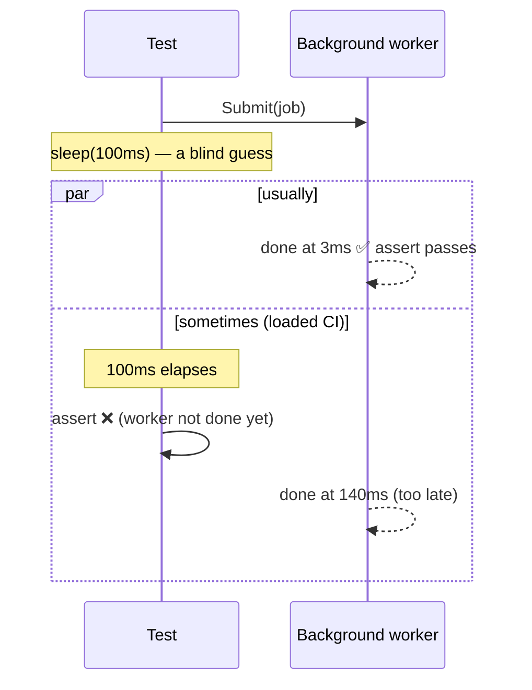

# Flaky Tests — Junior

> **Category:** [Testing Anti-Patterns](../README.md) → **Flaky Tests** — *the same test, on the same code, passes sometimes and fails sometimes.*
> **Also known as:** non-deterministic tests · intermittent tests · heisentests

---

## Table of Contents

1. [Introduction](#introduction)
2. [Prerequisites](#prerequisites)
3. [What "flaky" actually means](#what-flaky-actually-means)
4. [The classic flake: `sleep(100)`](#the-classic-flake-sleep100)
5. [Why "just re-run it" is poison](#why-just-re-run-it-is-poison)
6. [The seven sources of non-determinism](#the-seven-sources-of-non-determinism)
7. [The one rule: await a condition, never a duration](#the-one-rule-await-a-condition-never-a-duration)
8. [Common Mistakes](#common-mistakes)
9. [Test Yourself](#test-yourself)
10. [Cheat Sheet](#cheat-sheet)
11. [Summary](#summary)
12. [Further Reading](#further-reading)
13. [Related Topics](#related-topics)

---

## Introduction

> Focus: **What flaky is and why it's poison.**

A flaky test is one that **passes sometimes and fails sometimes against the exact same code** — no edit, no new commit, just two runs and two answers. Nothing about the code changed, so the test is not telling you about the code. It is telling you about *itself*: it is non-deterministic.

That sounds minor. It is not. A flaky test is the single most corrosive thing you can put in a test suite, because it destroys the only property that makes a suite useful — **trust**. A green suite is supposed to mean "the code is fine." A red test is supposed to mean "you broke something, go look." A flaky test breaks both meanings at once: green might be luck, and red might be noise. Once a team learns that red is *sometimes* noise, they start re-running failures instead of reading them — and the day a flake hides a real regression, it ships.

At the junior level your goal is to **recognize a flake on sight, understand why it happens, and never write the one that causes 80% of them**: the timing flake built on `sleep`. The deeper causes and the suite-wide hunt are `senior.md`; here we build the instinct.

> **The mindset shift:** a test has exactly one job — to give the *same answer every time* for the same code. A test that doesn't isn't a weak test, it's a *broken* one. Determinism is not a nice-to-have; it is the definition of a working test.

---

## Prerequisites

- **Required:** You can write a basic unit test and run a suite (examples use Go's `testing`, JUnit 5, and pytest).
- **Required:** You understand what an assertion is and what it means for a test to "pass" or "fail."
- **Helpful:** A first brush with concurrency — threads, goroutines, async callbacks, or background work. Most flakes involve *something happening on its own schedule*.
- **Helpful:** You've seen a CI pipeline go red, hit "re-run," and watched it go green. That moment is the whole topic.

---

## What "flaky" actually means

Precision matters, because people use "flaky" loosely. A flaky test is specifically:

> A test whose **result is not a pure function of the code under test.** Run it twice on byte-for-byte identical code and you can get pass *and* fail.

That is different from:

- **A failing test** — fails *every* time on this code. That's a real signal: a bug, or a wrong assertion. Not flaky.
- **A bug-found test** — was green, the code changed, now it's red. That's the suite working. Not flaky.
- **A flaky test** — green and red *alternate* with no code change. The result depends on something the test doesn't control: time, ordering, randomness, the network, another thread.

The tell is **irreproducibility**: it fails, you run it again, it passes, and you can't make it fail on demand. If you can reliably reproduce a failure, it's a bug — go fix it. If you *can't*, you've found a flake, and the cause is some uncontrolled, non-deterministic input.

---

## The classic flake: `sleep(100)`

Here is the flake you will write first, the one behind a huge share of all flakiness. The code under test does something **asynchronously** — a background goroutine, a thread, an async task — and the test needs to wait for it to finish before asserting. So the test... sleeps.

```go
// Go — FLAKY. The test guesses how long the work takes.
func TestProcessAsync(t *testing.T) {
    q := NewQueue()
    q.Submit(Job{ID: 1})         // processed on a background goroutine

    time.Sleep(100 * time.Millisecond) // "should be enough time"

    if got := q.Completed(); got != 1 {
        t.Fatalf("want 1 completed, got %d", got)
    }
}
```

`100ms` is a **bet** that the background work finishes within 100 milliseconds. On your laptop, idle, it finishes in 3ms — the test passes a thousand times and you commit it. Then:

- CI runs it on a loaded, shared machine where the goroutine doesn't get scheduled for 140ms → **fail**.
- A coworker runs the whole suite in parallel and the box is saturated → **fail**.
- A teammate adds a database call to the job and now it takes 110ms → **fail**, intermittently, depending on DB latency.

The bug is not the number. **Making the number bigger does not fix it** — it makes the test slower *and still flaky*, just rarer. The bug is the *category of decision*: you are racing a fixed duration against work whose duration you do not control. There is no number that is both fast and safe.



The fix — covered in full in `middle.md` — is to **wait for the actual condition** (`q.Completed() == 1`) instead of guessing a duration. Poll it, or block on a signal the worker sends when it's done. We'll get there; first, why this matters so much.

---

## Why "just re-run it" is poison

When a flaky test goes red in CI, the path of least resistance is to click **Re-run**. It passes. You merge. Problem "solved." This is the single most damaging habit in testing, and here is the chain of consequences:

1. **Re-running normalizes ignoring red.** The team learns that a red build doesn't necessarily mean broken code — it might just be "that flaky test again." So red stops triggering investigation.
2. **A real regression now looks identical to a flake.** When your actual code breaks, the failure looks like every other intermittent failure. The reflex is "re-run it" — and a re-run of a *genuinely broken* build... sometimes passes too (because the regression is itself timing-dependent, or the flake masks it). The bug ships.
3. **Trust collapses across the whole suite.** Flakiness is contagious to *perception*. One unreliable test in a suite of 500 makes people distrust all 500, because they can't tell signal from noise at a glance. They start skipping the suite, or merging over red.
4. **The suite becomes a tax, not a safety net.** A suite you don't trust still costs time to run and maintain — but it no longer gives you the thing you pay for: confidence to change code.

> **The core damage:** a flaky test doesn't just fail to help — it actively *erodes the suite's authority*. The correct response to a flake is never "re-run until green." It is **"stop and find the source of non-determinism,"** and if you can't fix it immediately, **quarantine** it (remove it from the gating build, file a ticket) — never leave it to randomly fail and train everyone to ignore red. (The quarantine workflow is `senior.md`.)

"Just re-run it" treats the symptom (a red build) while feeding the disease (loss of trust). It is the testing equivalent of silencing a smoke alarm by taking the battery out.

---

## The seven sources of non-determinism

Every flake comes from the test depending on something it doesn't control. There are seven usual suspects — learn the list, because diagnosing a flake is mostly *"which of these seven is it?"*

| # | Source | What it looks like | Why it's non-deterministic |
|---|---|---|---|
| 1 | **Timing** | `sleep(n)` waits, real timeouts | The work's duration varies; a fixed wait races it |
| 2 | **Async / concurrency** | background threads, goroutines, callbacks | Thread interleaving differs every run |
| 3 | **Shared mutable state** | one test's data leaks into the next | Result depends on *which tests ran before* |
| 4 | **Unseeded randomness** | `rand.Int()`, `uuid`, shuffles in the test | Different random value each run |
| 5 | **Real wall clock / date / timezone** | `time.Now()`, "today", `LocalDate.now()` | The answer changes at midnight, on DST, in CI's timezone |
| 6 | **External dependencies** | real network, real DB, real filesystem, ports | The outside world is slow, down, or busy at random |
| 7 | **Ordering assumptions** | iterating a map/dict and asserting order | Map/hash iteration order is deliberately unstable |

Each has a specific cure, and `middle.md` walks through all of them with worked examples. The unifying principle is below.

---

## The one rule: await a condition, never a duration

If you remember one sentence from this file, make it this:

> **Wait for the thing you actually care about to become true. Never wait for a number of milliseconds.**

The `sleep` flake waits for *time to pass* and hopes the work finished. The fix waits for the *work to finish*, however long that takes:

```python
# Python — wait for the CONDITION, with a generous timeout as a safety net.
import time

def wait_until(predicate, timeout=2.0, interval=0.01):
    deadline = time.monotonic() + timeout
    while time.monotonic() < deadline:
        if predicate():
            return True          # success the instant the work is done
        time.sleep(interval)
    return False                 # only here if it genuinely never happened

def test_process_async():
    q = Queue()
    q.submit(Job(1))
    assert wait_until(lambda: q.completed() == 1), "job never completed"
```

Read the difference carefully — it's the whole lesson:

- The `sleep(100)` version **passes only if the work is faster than 100ms** and **wastes 100ms even when the work took 3ms**. Slow *and* flaky.
- The `wait_until` version **returns the instant the condition is true** (so it's fast — usually a few milliseconds), and the timeout is a *backstop for genuine failure*, not a guess at normal timing. If the condition is true at 3ms, the test takes 3ms. If it's *never* true, it fails cleanly after 2s with a real message.

This single inversion — *condition, not duration* — eliminates the most common flake entirely. The same principle, applied to time (control the clock), randomness (seed it), state (isolate it), and the outside world (fake it), eliminates the rest. That's `middle.md`.

---

## Common Mistakes

1. **"It only fails sometimes, so it's a minor issue."** Backwards. *Sometimes* is the symptom that defines the worst kind of test problem. A test that always fails is honest; a test that fails 1-in-50 is a landmine.
2. **Fixing a flake by increasing the sleep.** Bigger sleeps make the flake rarer and the suite slower. You've hidden the bug *and* paid for it in wall-clock time. The category of fix is wrong, not the magnitude.
3. **Re-running until green and merging.** This isn't fixing the test; it's training the team to ignore red. The flake is still there, now with social cover.
4. **Blaming "the CI machine being slow."** A slow machine doesn't *cause* a correct test to fail — it *exposes* a test that was secretly racing the clock. The flake was always there; CI just runs it under conditions that reveal it.
5. **Assuming flakes are rare and someone else's problem.** The most-skipped test in most suites is a flake the team gave up on. You will write your first one this month — most likely a `sleep`-based async wait.
6. **Confusing a flaky test with a failing test.** If it fails *every* time, it's not flaky — it's a bug or a wrong assertion. "Flaky" specifically means *non-deterministic*. Don't quarantine a genuinely-failing test as "flaky" to make red go away.

---

## Test Yourself

1. In one sentence, what makes a test *flaky* — as opposed to merely *failing*?
2. Your async test uses `time.Sleep(50ms)` and passes locally but fails ~1 run in 20 on CI. A teammate suggests bumping it to `200ms`. Why is that the wrong fix, and what's the right one?
3. Name four of the seven common sources of non-determinism.
4. Why is "just re-run the flaky test until it's green" described as *poison* rather than a harmless workaround?
5. A test fails. You run it again on the same code and it passes. Is it flaky? What would make you sure it *isn't*?

---

## Cheat Sheet

| Symptom | Likely source | First move |
|---|---|---|
| Async test, passes locally, fails on busy CI | `sleep`-based wait racing the work | Replace `sleep(n)` with **poll-until-condition** + timeout |
| Fails only when run with the full suite | Shared mutable state / test order | Isolate & reset state per test |
| Fails around midnight / in CI's timezone | Real `Now()` / date / timezone | Inject a **fixed clock** |
| Different value each run | Unseeded RNG / random UUID | **Seed** the RNG; pin the value |
| Fails when the network/DB hiccups | Real external dependency | **Fake** the dependency in the test |
| Asserts a specific order, fails randomly | Map/hash iteration order | Compare as a **set**, or sort first |

> **The one rule:** *await a **condition**, never a **duration**.* Apply the same instinct to time, randomness, state, and the outside world: **control the input, don't gamble on it.**

---

## Summary

- A **flaky test** passes sometimes and fails sometimes on **identical code**. Its result isn't a function of the code — it depends on an uncontrolled input. That makes it *non-deterministic*, which makes it broken, not merely weak.
- The most common flake is the **`sleep`-based async wait**: it races a fixed duration against work whose timing you don't control. Bigger sleeps make it rarer and slower, never correct.
- **"Just re-run it" is poison.** It treats the red build, not the non-determinism, and trains the whole team to ignore red — so a real regression eventually ships behind the noise. The right response is *fix the cause*, or *quarantine and ticket*, never *retry forever*.
- Flakes come from **seven sources**: timing, async races, shared state, unseeded randomness, the real clock, external deps, and ordering assumptions. The unifying cure is one rule: **await a condition, control the input — never gamble on a duration or the outside world.**
- Next: [`middle.md`](middle.md) — *each of the seven causes, with the specific, worked fix for every one.*

---

## Further Reading

- **Google Testing Blog — "Flaky Tests at Google and How We Mitigate Them"** (John Micco, 2016) and **"Where do Google's flaky tests come from?"** (2017) — the canonical industrial data on flake sources and the de-flaking process.
- **Martin Fowler — "Eradicating Non-Determinism in Tests"** (martinfowler.com, 2011) — the foundational essay on the causes of non-determinism and why a flaky suite loses its value.
- **Gerard Meszaros — *xUnit Test Patterns* (2007)** — "Erratic Test" and "Test Run War"; the vocabulary the whole testing literature builds on.
- **Google — *Software Engineering at Google* (Winters, Manshreck, Wright, 2020)**, ch. on testing — flakiness as a fleet-scale problem and how it's tracked.

---

## Related Topics

- [Testing Anti-Patterns → Fragile Tests](../01-fragile-tests/junior.md) — the sibling smell: tests that break on changes that *didn't change behavior* (deterministic, but brittle — the opposite axis from flaky).
- [Testing Anti-Patterns → Mystery Guest](../03-mystery-guest/junior.md) — hidden, shared fixture data; a frequent *cause* of order-dependent flakiness.
- [Testing Anti-Patterns → Slow Tests](../05-slow-tests/junior.md) — `sleep`-padded and real-I/O tests are both slow *and* flaky; the cures overlap.
- [Concurrency Anti-Patterns → Shared State](../../03-concurrency/03-shared-state/senior.md) — the production-side version of the races that make async tests flaky.
- Refactoring → Code Smells — flakiness as a test smell, and the moves to remove it.

---

## Check your understanding

1. Explain Flaky Tests — Junior Level in your own words and name the problem it solves.
2. How would you apply the ideas around Table of Contents, Introduction, Prerequisites in a realistic engineering change?
3. What failure mode or misuse should you look for, and what evidence would reveal it?
4. What small example would prove that you can apply Flaky Tests — Junior Level correctly?
5. What observable result would convince you that the approach improved the system?
