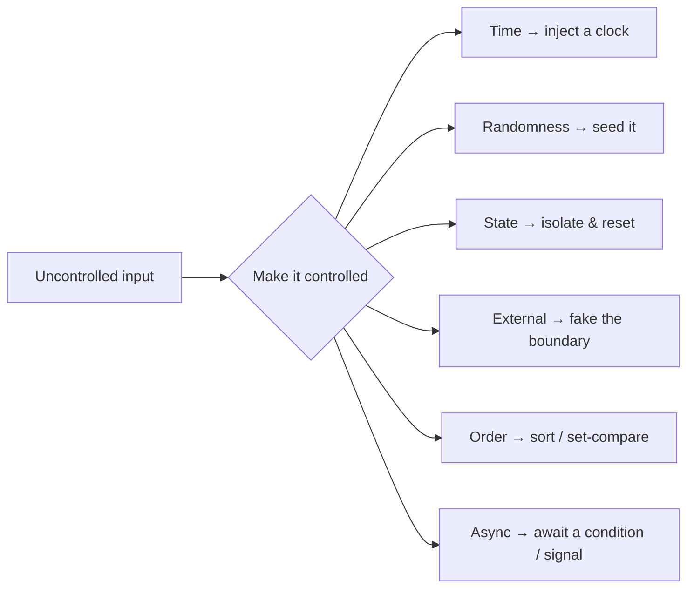

# Flaky Tests — Middle

> **Category:** [Testing Anti-Patterns](../README.md) → **Flaky Tests** — *the same test, on the same code, passes sometimes and fails sometimes.*
> **Also known as:** non-deterministic tests · intermittent tests · heisentests

---

## Introduction

> Focus: **The common causes and the fix for each.**

`junior.md` taught you to recognize a flake and named the seven sources of non-determinism. This file is the toolbox: **for each of the seven causes, the specific countermove**, with worked before/after code in Go, Java, and Python.

The causes look unrelated — a `sleep`, a random UUID, a map iteration, a real HTTP call. But the cure is always the same shape: **find the uncontrolled input and take control of it.** Time, randomness, ordering, the network, the scheduler — each is something the test was implicitly depending on without controlling. Make it explicit and deterministic and the flake disappears. Not "becomes rarer" — *disappears*, because the non-deterministic input is gone.

> **The middle-level skill:** given a flaky test, name *which* of the seven causes it is (often more than one), then apply the matching fix. Diagnosis first, then the standard cure. Don't reach for a retry until you've identified the cause — and usually you won't need one at all.

---

## Prerequisites

- **Required:** [`junior.md`](junior.md) — what flaky means, the `sleep` flake, the seven sources.
- **Required:** You can inject a dependency (pass a collaborator into a constructor/function instead of newing it up inside). Every fix here leans on it. See Designing for Testability if it's new.
- **Helpful:** Comfort with your language's test setup/teardown hooks (`t.Cleanup`, JUnit `@BeforeEach`, pytest fixtures) and its concurrency primitives.

---

## The diagnostic table

Pin this. Diagnosing a flake is matching its symptom to one of these rows, then applying the cure in the same row.

| Cause | Symptom you observe | The cure |
|---|---|---|
| **1. Timing** | Async test passes locally, fails on loaded CI | Poll / await the **condition**, not a duration |
| **2. Async race** | Passes alone, fails under `-race` or load | Synchronize on a real signal (channel, latch, `WaitGroup`) |
| **3. Shared state** | Fails only with the full suite, or in some orders | Fresh state per test; reset in teardown |
| **4. Randomness** | Different value/result each run | Seed the RNG; inject the value |
| **5. Real clock** | Fails at midnight, on DST, in CI's timezone | Inject a fake/fixed clock |
| **6. External dep** | Fails when network/DB/port is slow or busy | Fake the dependency at its boundary |
| **7. Ordering** | Asserts an order; fails randomly | Compare as a set, or sort first |

---

## Cause 1 — Timing: `sleep` → poll / await a condition

The flagship flake. The code does async work; the test sleeps a guessed duration, then asserts.

```go
// BEFORE — Go — flaky: races a fixed 100ms against the worker.
func TestWorker_Processes(t *testing.T) {
    w := StartWorker()
    w.Enqueue("task")
    time.Sleep(100 * time.Millisecond)        // guess
    if w.Done() != 1 {
        t.Fatalf("want 1 done, got %d", w.Done())
    }
}
```

**Fix — poll the actual condition with a generous timeout backstop.** The test returns the moment the work is truly done, and only fails if it genuinely never finishes.

```go
// AFTER — Go — deterministic AND fast.
func waitFor(t *testing.T, cond func() bool, timeout time.Duration) {
    t.Helper()
    deadline := time.Now().Add(timeout)
    for time.Now().Before(deadline) {
        if cond() {
            return
        }
        time.Sleep(time.Millisecond)          // tiny poll interval, not the whole wait
    }
    t.Fatalf("condition not met within %s", timeout)
}

func TestWorker_Processes(t *testing.T) {
    w := StartWorker()
    w.Enqueue("task")
    waitFor(t, func() bool { return w.Done() == 1 }, 2*time.Second)
}
```

Why this is correct, not just rarer-flaky: the `2s` is a **failure backstop**, not a timing guess. If the work takes 3ms, the test takes ~3ms. If it takes 140ms on loaded CI, the test takes 140ms and *passes* (it didn't race a 100ms wall). It only fails if the condition is *never* true — which is a real bug, reported cleanly.

In Java, prefer **Awaitility** over hand-rolled loops:

```java
// AFTER — Java (JUnit 5 + Awaitility)
import static org.awaitility.Awaitility.await;
import static java.util.concurrent.TimeUnit.SECONDS;

@Test
void workerProcessesTask() {
    Worker w = Worker.start();
    w.enqueue("task");
    await().atMost(2, SECONDS).until(() -> w.done() == 1);   // polls the condition
}
```

---

## Cause 2 — Async races: synchronize, don't guess

Polling works when there's a state you can observe. When the code *gives you a signal* — a channel, a callback, a future — **synchronize on that signal directly** instead of polling or sleeping. It's the strongest fix: zero timing dependence at all.

```python
# BEFORE — Python — flaky: sleeps, hoping the callback fired.
def test_download_calls_back():
    result = {}
    downloader.fetch(url, on_done=lambda data: result.update(data=data))
    time.sleep(0.2)                       # did the callback fire? maybe.
    assert result["data"] == EXPECTED     # KeyError if not — flaky
```

**Fix — block on a synchronization primitive the callback releases.**

```python
# AFTER — Python — deterministic: the test blocks until the callback fires.
import threading

def test_download_calls_back():
    done = threading.Event()
    box = {}
    def on_done(data):
        box["data"] = data
        done.set()                        # signal completion
    downloader.fetch(url, on_done=on_done)
    assert done.wait(timeout=2), "callback never fired"   # blocks, then backstop
    assert box["data"] == EXPECTED
```

In Go the idiomatic version is a channel; in Java a `CountDownLatch`:

```go
// Go — synchronize on a channel the worker closes/sends on.
done := make(chan Result, 1)
worker.Run(func(r Result) { done <- r })
select {
case r := <-done:
    require.Equal(t, expected, r)
case <-time.After(2 * time.Second):
    t.Fatal("worker never signalled completion")
}
```

> **Run async tests under the race detector.** `go test -race`, the Java `jcstress`/thread-sanitizer tooling, or Python's `pytest-xdist` stress runs *surface* races that a single quiet run hides. A test that's green alone but red under `-race` is flaky waiting to happen. (`senior.md` makes this a routine.)

---

## Cause 3 — Shared mutable state: isolate and reset

The test passes alone and fails in the full suite — or passes in one order and fails in another. The cause is **leaked state**: a static field, a module global, a shared DB row, a temp file, a singleton — written by one test and read by the next.

```java
// BEFORE — Java — flaky via a shared static registry.
class FeatureFlags {
    static final Map<String,Boolean> FLAGS = new HashMap<>();   // global!
}

class TestA {
    @Test void enablesBeta() {
        FeatureFlags.FLAGS.put("beta", true);
        assertTrue(Service.run().usedBeta());
    }
}
class TestB {
    @Test void defaultsOff() {
        // FLAGS still has beta=true if TestA ran first → FLAKY by order
        assertFalse(Service.run().usedBeta());
    }
}
```

`TestB` passes when it runs first and fails when `TestA` runs first. The flake is **test-order dependence**, and test runners are free to (and increasingly do) randomize order.

**Fix — give each test fresh state and reset what you touch.**

```java
// AFTER — Java — reset shared state in teardown so order can't matter.
@AfterEach
void resetFlags() {
    FeatureFlags.FLAGS.clear();          // every test starts clean
}
```

Better still, **don't share at all**: pass flags in as a constructor argument instead of a static map, so there's no global to leak. The same applies everywhere:

- **Go:** avoid package-level mutable vars in code under test; use `t.Cleanup(func(){ ... })` to reset anything you must.
- **Python:** prefer fixtures that build state fresh; never mutate module globals from a test. Use `monkeypatch` (auto-reverted) rather than assigning directly.
- **Databases/files:** each test gets its own transaction (rolled back) or its own temp dir/schema; never assert against rows a previous test inserted.

> **Acid test for isolation:** if running your tests in a *random order* changes the result, you have shared state. Make that test routine (`go test -shuffle=on`, pytest-randomly, JUnit method ordering) — see `senior.md`.

---

## Cause 4 — Unseeded randomness: seed it

A test that builds input with `rand`, a random UUID, or a shuffle is rolling dice every run. Most rolls pass; the one input that trips an edge case fails — and you can't reproduce it, because next run rolls different dice.

```go
// BEFORE — Go — flaky: a fresh random shuffle every run.
func TestSortStable(t *testing.T) {
    data := makeItems(1000)
    rand.Shuffle(len(data), func(i, j int) {  // global, time-seeded source
        data[i], data[j] = data[j], data[i]
    })
    sorted := Sort(data)
    requireSorted(t, sorted)                  // fails on the rare input that breaks Sort
}
```

**Fix — seed the RNG to a fixed value so the input is identical every run.** Now a failure is reproducible (it fails *every* run on that seed), and you can debug it.

```go
// AFTER — Go — a fixed seed makes the "random" input deterministic.
func TestSortStable(t *testing.T) {
    rng := rand.New(rand.NewSource(42))       // pinned seed → same data every run
    data := makeItems(1000)
    rng.Shuffle(len(data), func(i, j int) {
        data[i], data[j] = data[j], data[i]
    })
    requireSorted(t, Sort(data))
}
```

The same for the other shapes:

```python
# Python — seed the module RNG, or inject a seeded Random.
def test_with_random_input():
    rng = random.Random(42)                    # local, seeded — not the global one
    payload = [rng.randint(0, 100) for _ in range(50)]
    assert process(payload) == expected_for_seed_42
```

For random **UUIDs/IDs**, inject an ID generator and use a deterministic one in tests (`uuid.UUID(int=1)`, an incrementing stub) rather than asserting on a value that changes every run.

> **Note — this is the opposite of property-based testing.** Property-based tests *deliberately* randomize inputs to find edge cases — but a good PBT framework **prints the failing seed** so any failure is reproducible (`reproduce with seed=...`). The flake is not "randomness"; it's *un-loggable, un-reproducible* randomness. Seed it, or log the seed.

---

## Cause 5 — The real clock: inject a fake

Any test that reads `time.Now()`, `LocalDate.now()`, `datetime.now()`, "today", or a real timeout is coupled to *when it runs*. It fails at midnight, on the last day of the month, on a leap day, during DST, or in CI's UTC timezone when you wrote it in UTC+5.

```python
# BEFORE — Python — flaky: "is this token expired?" depends on the real clock.
def is_expired(token):
    return token.expires_at < datetime.now()   # reads the wall clock

def test_not_yet_expired():
    token = Token(expires_at=datetime.now() + timedelta(seconds=1))
    assert not is_expired(token)               # FLAKY: fails if the test pauses >1s
```

That test fails if a GC pause or a loaded CI box delays it past the 1-second window — a classic intermittent. **The production code reaches out to a global (the clock); the fix is to inject the clock like any other dependency.**

```python
# AFTER — Python — inject a clock; tests pass a fixed/fake one.
class Clock:                         # production: real time
    def now(self): return datetime.now(timezone.utc)

class FakeClock:                     # tests: time you control
    def __init__(self, t): self._t = t
    def now(self): return self._t
    def advance(self, delta): self._t += delta

def is_expired(token, clock):
    return token.expires_at < clock.now()

def test_expiry_boundary():
    clock = FakeClock(datetime(2026, 1, 1, tzinfo=timezone.utc))
    token = Token(expires_at=clock.now() + timedelta(seconds=10))
    assert not is_expired(token, clock)
    clock.advance(timedelta(seconds=11))       # jump forward instantly
    assert is_expired(token, clock)            # deterministic, and zero real waiting
```

Bonus: a fake clock makes **time-based tests fast too** — `clock.advance(hours=24)` tests a daily-expiry rule in microseconds instead of waiting a day. The Go and Java equivalents inject a `Clock` interface (Go: a `func() time.Time` or `clockwork.Clock`; Java: `java.time.Clock` — `Clock.fixed(...)` is built for exactly this).

```java
// Java — java.time.Clock is injectable by design.
boolean expired(Token t, Clock clock) {
    return t.expiresAt().isBefore(Instant.now(clock));
}

@Test
void expiryBoundary() {
    Clock clock = Clock.fixed(Instant.parse("2026-01-01T00:00:00Z"), ZoneOffset.UTC);
    Token t = new Token(Instant.now(clock).plusSeconds(10));
    assertFalse(expired(t, clock));
}
```

> **Rule:** production code should never call `now()` from a global. Take the clock as a parameter. Then "now" is whatever the test says it is.

---

## Cause 6 — External dependencies: fake the boundary

A test that hits a **real** network, database, port, or filesystem inherits the outside world's non-determinism: latency spikes, a flaky DNS resolve, a port already in use, a shared DB another test mutated, a service that's down for 200ms during a deploy.

```go
// BEFORE — Go — flaky: depends on a real HTTP endpoint being up and fast.
func TestFetchPrice(t *testing.T) {
    price, err := FetchPrice("https://api.example.com/price/BTC")  // real network!
    require.NoError(t, err)            // fails when the API hiccups, rate-limits, or DNS lags
    require.Greater(t, price, 0.0)
}
```

**Fix — fake the boundary.** Use an in-process fake server (or an injected fake client) that returns a fixed response. No network, no latency, no flake.

```go
// AFTER — Go — httptest.Server: a real HTTP server, in-process, deterministic.
func TestFetchPrice(t *testing.T) {
    srv := httptest.NewServer(http.HandlerFunc(
        func(w http.ResponseWriter, r *http.Request) {
            fmt.Fprint(w, `{"price": 42000.0}`)      // fixed response, instant
        }))
    defer srv.Close()

    price, err := FetchPrice(srv.URL + "/price/BTC")
    require.NoError(t, err)
    require.Equal(t, 42000.0, price)                 // exact, repeatable
}
```

For databases, the deterministic-and-fast options in order of preference:

1. **Fake/in-memory implementation** of the repository interface (a `map`-backed `UserRepo`) — fastest, fully deterministic, unit-test scope.
2. **Ephemeral real DB** (Testcontainers, a throwaway schema) wrapped in a transaction **rolled back per test** — for integration tests that need real SQL behavior. Per-test isolation is what kills the flake.
3. Never a **shared, long-lived** test database that all tests read and write — that's both Cause 3 (shared state) and Cause 6 (external dep) at once, the worst combination.

> Choosing real-vs-fake is a [mocking-strategy](../06-over-mocking/junior.md) decision and overlaps with [Slow Tests](../05-slow-tests/junior.md). The flake angle is simple: **the outside world is non-deterministic, so a unit test must not depend on it.**

---

## Cause 7 — Ordering assumptions: don't depend on iteration order

Hash maps and dicts do **not** guarantee iteration order — Go *randomizes* it on purpose, Java's `HashMap` order is unspecified, and even where order is stable today it isn't a contract. A test that iterates a map and asserts a specific order passes by luck.

```go
// BEFORE — Go — flaky: map iteration order is randomized by the runtime.
func TestTags(t *testing.T) {
    tags := map[string]bool{"go": true, "test": true, "ci": true}
    var got []string
    for tag := range tags {                 // order differs every run!
        got = append(got, tag)
    }
    require.Equal(t, []string{"go", "test", "ci"}, got)   // passes ~1 in 6 runs
}
```

**Fix — remove the order from the assertion.** Either compare as an unordered set, or sort before comparing.

```go
// AFTER — Go — sort to impose a deterministic order, then assert.
func TestTags(t *testing.T) {
    tags := map[string]bool{"go": true, "test": true, "ci": true}
    var got []string
    for tag := range tags {
        got = append(got, tag)
    }
    sort.Strings(got)                                       // deterministic
    require.Equal(t, []string{"ci", "go", "test"}, got)
    // or: require.ElementsMatch(t, []string{"go","test","ci"}, got)  // order-agnostic
}
```

The same principle covers any unordered source: `SELECT` without `ORDER BY`, a set, concurrent appends. **If order isn't guaranteed by the thing producing the data, don't assert on order** — assert on membership, or impose an order yourself first.

---

## The pattern behind every fix

Step back and the seven cures are one cure wearing seven costumes:



> **The principle:** a test must be a **pure function of the code under test.** Anything else the result secretly depends on — the clock, the RNG, the scheduler, the network, leftover state, map order — is an *uncontrolled input*. Flakiness is non-determinism leaking in through one of those inputs. The fix is always to **take control of the input** and make it explicit, fixed, and injected. Never to retry until the dice land green.

---

## Common Mistakes

1. **Polling with a too-short timeout.** Replacing `sleep(100)` with poll-until-condition is right — but if your backstop timeout is 50ms, you've reintroduced the race. The timeout is for *genuine failure*; make it generously larger than any plausible normal time (seconds, not milliseconds).
2. **Seeding the *global* RNG and leaking it.** `rand.Seed(42)` (Go pre-1.20) or `random.seed(42)` mutates a global that other tests share — now you've traded a randomness flake for a shared-state flake. Inject a *local* seeded RNG instead.
3. **Faking the clock in the test but not injecting it into the code.** If production still calls `time.Now()` internally, your fake clock controls nothing. The code under test must *take the clock as a dependency* for the fake to bite.
4. **Resetting state in `setUp` but not after a failing test.** If a test fails mid-way and leaves state dirty, the *next* test inherits it. Reset in teardown (`@AfterEach`, `t.Cleanup`, fixture finalizer), which runs even on failure — not only in setup.
5. **Faking the boundary but keeping one real call "for realism."** One real network call in a unit test reintroduces all of Cause 6. Keep unit tests fully faked; put the real-dependency check in a separate, clearly-labeled integration test.
6. **Sorting the *expected* value instead of the actual.** If you sort one side of an order-agnostic comparison, sort both — or use a set/`ElementsMatch` helper. Half-sorting just moves the flake.

---

## Test Yourself

1. You replace `time.Sleep(100ms)` with a poll loop that has a `100ms` timeout. Is the flake fixed? Why or why not?
2. A test seeds randomness with `random.seed(42)` at the top of the test. Another test in the same file, run after it, now behaves oddly. What happened, and what's the better approach?
3. Why does injecting a clock make time-based tests *faster*, not just *deterministic*? Give a concrete example.
4. A test asserts `["a","b","c"]` from iterating a Go map and fails about one run in six. Name the cause and two valid fixes.
5. Your test hits a real staging API and fails ~2% of the time with timeouts. The team adds a 3× retry around the call. Did they fix the flake? What should they have done?

---

## Cheat Sheet

| Cause | Fix | Key tool |
|---|---|---|
| **Timing** | Poll/await the condition with a generous timeout | `waitFor` loop, Awaitility |
| **Async race** | Synchronize on a real signal | channel, `CountDownLatch`, `Event`; run under `-race` |
| **Shared state** | Fresh state per test; reset in teardown | `t.Cleanup`, `@AfterEach`, fixtures; `-shuffle` to detect |
| **Randomness** | Seed a *local* RNG; inject IDs | `rand.New(rand.NewSource(seed))`, `random.Random(seed)` |
| **Real clock** | Inject the clock; fix it in tests | `java.time.Clock.fixed`, `FakeClock`, `clockwork` |
| **External dep** | Fake the boundary; isolate real DBs per test | `httptest.Server`, in-memory fakes, Testcontainers + rollback |
| **Ordering** | Don't assert order; sort or set-compare | `sort`, `ElementsMatch`, `ORDER BY` |

> **One principle:** make the test a **pure function of the code under test.** Control every other input — never gamble on it, never retry around it.

---

## Summary

- Every flake is the test depending on an **uncontrolled input**. The seven inputs are time, async scheduling, shared state, randomness, the real clock, external deps, and iteration order — and each has a standard, worked fix.
- **Timing → await a condition** (generous timeout backstop). **Async → synchronize on a signal** and run under `-race`. **Shared state → isolate and reset per test** (and detect with random order). **Randomness → seed a local RNG / inject IDs**. **Clock → inject it, fix it in tests** (also makes them fast). **External → fake the boundary** / isolate real DBs. **Order → don't assert order; sort or compare as a set.**
- The fixes look different but are one move: **take control of the input** so the test's result is a pure function of the code. Determinism is engineered, not hoped for.
- Reach for diagnosis, not retries. A retry hides the cause and slows the suite; it's almost never the right fix at this level. (When it legitimately is — `professional.md`.)
- Next: [`senior.md`](senior.md) — *hunting flakiness across a real suite: detecting it with re-runs / `-race` / `-shuffle`, root-causing, the quarantine workflow, and tracking flake-rate as a metric.*

---

## Further Reading

- **Google Testing Blog — "Flaky Tests at Google and How We Mitigate Them"** (2016) — the cause taxonomy this file mirrors, with real proportions.
- **Martin Fowler — "Eradicating Non-Determinism in Tests"** (2011) — cause-by-cause treatment; the source of "lack of isolation," "asynchronous behaviour," and "time" as named categories.
- **Awaitility** (awaitility.org) — the Java library for awaiting conditions instead of sleeping; the reference implementation of the "await, don't sleep" cure.
- **Gerard Meszaros — *xUnit Test Patterns* (2007)** — "Fresh Fixture," "Test Double," and the isolation patterns behind Causes 3 and 6.
- **Testcontainers** (testcontainers.org) — ephemeral, per-test real dependencies (Cause 6) when a fake won't do.

---

## Related Topics

- [Testing Anti-Patterns → Mystery Guest](../03-mystery-guest/junior.md) — hidden shared fixtures, a prime source of Cause 3 (shared-state flakiness).
- [Testing Anti-Patterns → Slow Tests](../05-slow-tests/junior.md) — fakes-over-real-I/O and killing sleeps fix slowness and flakiness together.
- [Testing Anti-Patterns → Over-Mocking](../06-over-mocking/junior.md) — where to draw the fake/real boundary for Cause 6 without over-isolating.
- [Concurrency Anti-Patterns → Shared State](../../03-concurrency/03-shared-state/senior.md) — the production version of the races behind Causes 2 and 3.
- Refactoring → Code Smells — Extract Class / Inject Dependency, the refactorings that make clocks and deps fakeable.

---

## Check your understanding

1. Explain Flaky Tests — Middle Level in your own words and name the problem it solves.
2. How would you apply the ideas around Table of Contents, Introduction, Prerequisites in a realistic engineering change?
3. What failure mode or misuse should you look for, and what evidence would reveal it?
4. Which local design trade-off would make you choose or reject Flaky Tests — Middle Level in an existing codebase?
5. What observable result would convince you that the approach improved the system?
