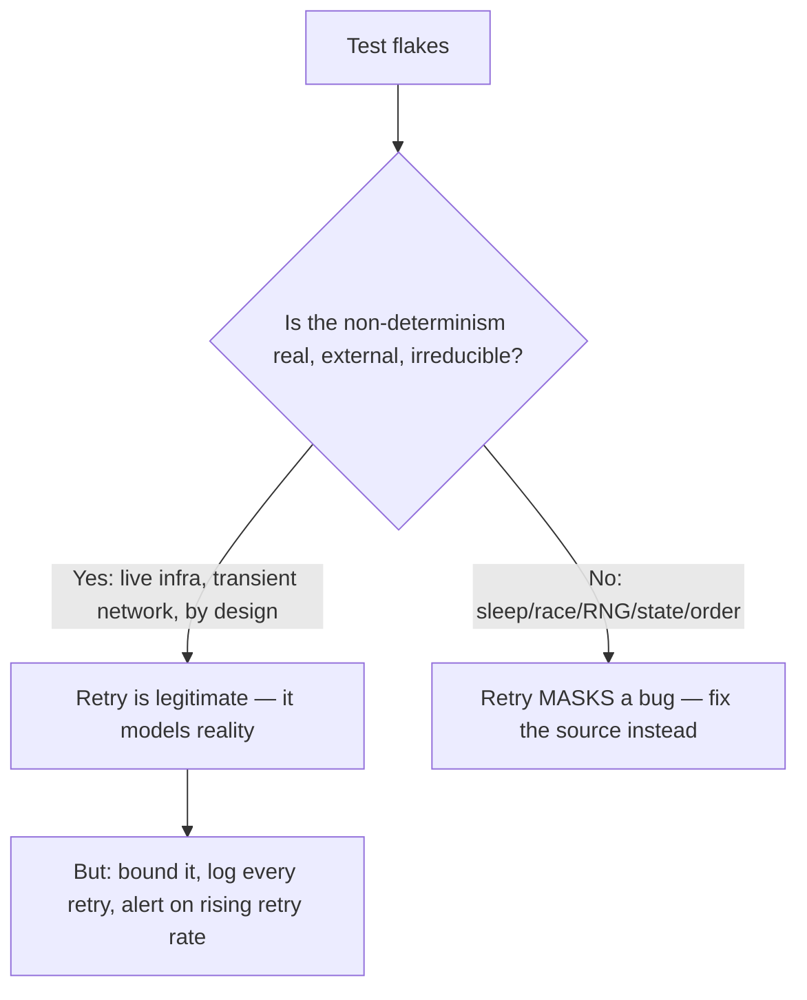
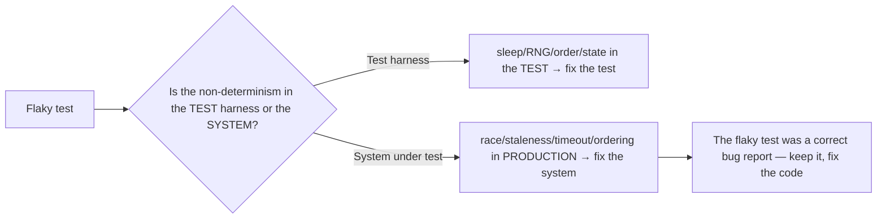

# Flaky Tests — Professional

> **Category:** [Testing Anti-Patterns](../README.md) → **Flaky Tests** — *the same test, on the same code, passes sometimes and fails sometimes.*
> **Also known as:** non-deterministic tests · intermittent tests · heisentests

---

## Table of Contents

1. [Introduction](#introduction)
2. [Memory-model and async races in tests](#memory-model-and-async-races-in-tests)
3. [Deterministic simulation: control time and scheduling](#deterministic-simulation-control-time-and-scheduling)
4. [When a retry is legitimate vs masking a bug](#when-a-retry-is-legitimate-vs-masking-a-bug)
5. [The flaky test is telling you the *system* is flaky](#the-flaky-test-is-telling-you-the-system-is-flaky)
6. [The cost of flakiness on CI throughput](#the-cost-of-flakiness-on-ci-throughput)
7. [Eliminating order-dependence at scale](#eliminating-order-dependence-at-scale)
8. [Trade-offs, summarized](#trade-offs-summarized)
9. [Common Mistakes](#common-mistakes)
10. [Test Yourself](#test-yourself)
11. [Cheat Sheet](#cheat-sheet)
12. [Summary](#summary)
13. [Further Reading](#further-reading)
14. [Related Topics](#related-topics)

---

## Introduction

> Focus: **Hard cases and trade-offs.**

The previous files give you a complete, correct model: flakiness is uncontrolled non-determinism; control the input and it goes away; manage the residue with quarantine and metrics. This file is for the cases where that model gets *contested* — where the honest answer is a trade-off, not a fix.

Four hard questions structure it:

1. **Some races are in the memory model, not the code you can see.** How do you make tests deterministic when the non-determinism is in *thread interleaving and visibility*?
2. **Some systems are inherently time- and schedule-dependent.** How do you test them deterministically — by *simulating* time and scheduling rather than waiting on the real ones?
3. **When is a retry actually correct?** There are legitimate uses; there are bug-masking uses; the line matters enormously and is widely gotten wrong.
4. **Sometimes the test isn't flaky — the system is.** The deepest reframing: a flaky test can be a *true report* about a non-deterministic production system. Distinguishing "fix the test" from "fix the system" is the senior-most judgment in this topic.

> **The professional stance:** you stop asking "how do I make this test pass reliably?" and start asking "*what* is non-deterministic, *should* it be, and *where* does the determinism belong — in the test, or in the system?" Sometimes the right fix to a flaky test is a change to *production code*, because the test correctly found a real race or an unbounded timeout. Knowing which is the whole skill.

---

## Memory-model and async races in tests

The `middle.md` cure for async was "synchronize on a real signal." That's necessary but not sufficient, because some non-determinism lives below the level of "did the callback fire" — it's in the **memory model**: *when* one thread's writes become *visible* to another, and *in what order*. These flakes are the nastiest because they depend on CPU, compiler reordering, and cache coherence — they may *never* reproduce on x86 and reliably fail on ARM, or vice versa.

```go
// FLAKY — Go — a data race the race detector catches but a quiet run hides.
func TestCounter(t *testing.T) {
    c := &Counter{}                       // c.n is a plain int, no sync
    var wg sync.WaitGroup
    for i := 0; i < 100; i++ {
        wg.Add(1)
        go func() { defer wg.Done(); c.Inc() }()   // c.n++ from many goroutines
    }
    wg.Wait()
    if c.n != 100 { t.Fatalf("got %d", c.n) }      // sometimes 97, 98, 100...
}
```

The test *synchronizes correctly* (`wg.Wait()` guarantees all goroutines finished) yet still flakes — because `c.Inc()` does an unsynchronized `c.n++`, a non-atomic read-modify-write, and concurrent increments lose updates. The flake is a **real data race in the production code**, and the test is correctly (if intermittently) exposing it.

The professional handling:

- **Run async/concurrent tests under the race detector as a gate, not an afterthought.** `go test -race`, Java's thread-sanitizer / `jcstress`, C/C++ TSan, Rust's loom. A data race is undefined behavior; a test that races is reporting a *production* bug, and the detector turns the intermittent flake into a *deterministic* "RACE DETECTED" failure. The fix is in the code under test (`atomic.AddInt64`, a mutex, a channel), not the test.
- **Don't "fix" a memory-model flake by sleeping or retrying.** A sleep between the writes and the read may make the stale read rarer, but the race is still UB — it'll resurface under a different scheduler, compiler, or CPU. Sleeping here is the most dangerous form of bug-masking because it hides a *correctness* defect behind a *timing* coincidence.
- **For exhaustive interleaving, use a model checker.** Tools like Go's `-race`, Rust's `loom`, or Java's `jcstress` explore *many* interleavings deterministically, so a race that would flake 1-in-a-million in production fails *every* run in the tool. This is the only way to make concurrency tests truly deterministic: enumerate the schedules instead of sampling them.

> **The reframe:** a "flaky concurrency test" is usually not a test problem at all — it's a **race in the production code** that the test samples occasionally. The right response is to make the race *deterministically detectable* (race detector / model checker) and fix the code, not to stabilize the test.

---

## Deterministic simulation: control time and scheduling

Some systems are *fundamentally* about time and ordering: a scheduler, a retry-with-backoff, a rate limiter, a token bucket, a distributed timeout, a Raft election. You cannot fake these away with a single injected `Clock.now()` — they involve *sequences* of timed events and concurrent actors. Testing them against the real clock and the real scheduler is hopelessly flaky (and slow). The professional technique is **deterministic simulation**: replace *both* the clock *and* the scheduler with controllable, in-test fakes, so the entire system runs on **logical time** you advance by hand.

```python
# Deterministic simulation — a virtual clock + a single-threaded event loop
# the test drives. Time only advances when the test says so.
class SimClock:
    def __init__(self): self.now = 0.0; self._timers = []   # min-heap by fire-time
    def call_at(self, t, fn): heapq.heappush(self._timers, (t, fn))
    def call_later(self, delay, fn): self.call_at(self.now + delay, fn)
    def advance_to_idle(self):
        while self._timers:                 # fire every scheduled event in time order
            t, fn = heapq.heappop(self._timers)
            self.now = t                    # logical time jumps to the event
            fn()                            # deterministic: one event at a time

def test_retry_backoff_schedule():
    clock = SimClock()
    client = Client(clock=clock, retries=3, base_delay=1.0)   # backoff: 1s,2s,4s
    client.send(failing_request)            # schedules retries on the sim clock
    clock.advance_to_idle()                 # runs the whole backoff sequence instantly
    assert client.attempts == 4             # deterministic, exact, sub-millisecond
    assert client.fired_at == [0, 1, 3, 7]  # exact logical timestamps, every run
```

This is how mature async runtimes are tested. Notable instances:

- **`asyncio` / virtual event loops** — pytest's `asyncio` fixtures and libraries like `aiotools`/`time-machine` advance a virtual loop clock.
- **Akka / Pekko `TestScheduler`**, **Reactor `VirtualTimeScheduler`**, **RxJava `TestScheduler`** — JVM schedulers built specifically so tests advance time logically: `scheduler.advanceTimeBy(4, SECONDS)` fires every timer in between, instantly and deterministically.
- **FoundationDB's deterministic simulation** — the canonical industrial example: the *entire* database (network, disk, clock, concurrency) runs in a single-threaded deterministic simulator, so a multi-node distributed test with injected faults is *byte-for-byte reproducible from a seed*. A failure replays identically every time. This is the gold standard for testing distributed systems without flakiness.

> **The principle:** for time/schedule-dependent systems, don't *eliminate* time from the test — *take ownership* of it. Run the system on logical time and a controlled scheduler the test drives. You get determinism *and* speed (a 30-second backoff sequence runs in microseconds) *and* reproducibility (a seed replays the exact interleaving). It's a larger investment than a fake clock, and it's worth it precisely for the systems where flakiness is otherwise unavoidable.

---

## When a retry is legitimate vs masking a bug

"Never retry" is the right *default* and a useful slogan, but at this level you need the precise boundary, because there are legitimate retries and the discipline is knowing which is which.

A retry is **legitimate** when the non-determinism is **real, external, and irreducible** — a property of the world the test cannot and should not control:

- **A genuine end-to-end test against real infrastructure** (a smoke test hitting a live staging deployment) may retry a network call, because transient network failure *is* part of what "the real system" does, and the test's purpose is to exercise the real path. The retry models reality, it doesn't hide a defect.
- **Testing the production retry logic itself.** If the system-under-test is *supposed* to tolerate transient failure, the test asserts it does — and may legitimately involve real flakiness it's designed to absorb.

A retry is **masking a bug** when the non-determinism is **internal and controllable** — something the test *could* have made deterministic but didn't:

- Retrying a **unit test** that flakes because of a `sleep`, a race, unseeded randomness, or leaked state. All of these are fixable at the source; a retry just lowers the visible failure rate while leaving the defect (`junior.md`'s "just re-run it," industrialized).
- Retrying around a **race in production code** (the `Counter` above). The retry hides a real correctness bug behind a probability.
- Retrying to absorb a test's dependency on a **real DB/clock/order** that should have been faked/injected/isolated.



Even a *legitimate* retry comes with obligations: **bound it** (a finite count, not infinite), **log every retry**, and **alert when the retry rate rises** — because a climbing retry rate on a legitimate-retry test is itself a signal that the real system is degrading. A retry you don't measure is indistinguishable from a bug you're ignoring.

> **The test:** ask *"could I have made this deterministic by controlling an input?"* If yes (clock, RNG, state, scheduler, faked dependency) → the retry masks a bug; fix the source. If no (the non-determinism is the real external world, and exercising it is the point of the test) → a *bounded, logged, monitored* retry is legitimate.

---

## The flaky test is telling you the *system* is flaky

The deepest professional reframing: **a flaky test is sometimes a perfectly *correct* test reporting a real non-determinism in production.** When that's true, "de-flaking the test" by faking the cause away would be *deleting a true bug report*.

Cases where the flake is the *system's* fault, not the test's:

- **A data race in production code** (the `Counter`). The test flakes because the *system* loses updates under concurrency. Fix: the production code. Faking concurrency away in the test would hide a real data-loss bug.
- **An eventually-consistent dependency** the system reads too soon. The test flakes because production *itself* sometimes reads stale data — a real bug (missing read-after-write handling, no proper await). The test found it.
- **An unbounded or too-tight timeout in production.** A test that intermittently times out may be reporting that the *production* timeout is mis-tuned and real users hit it too.
- **Order-dependence in production logic** (a feature that works only if events arrive in a particular order). The test flakes because the *system* has an ordering bug, not because the test is sloppy.

The diagnostic:



> **The hard judgment:** before faking, seeding, or isolating away a flake, ask **"is the thing I'm about to control a *test artifact* or a *real property of the system*?"** Injecting a fake clock to stabilize a unit test is right (the wall clock is a test artifact). Injecting a fake clock to hide that production's timeout is mis-tuned is *wrong* — you've silenced a true alarm. The flakiest tests on critical paths are sometimes your most valuable reliability signals. Treat de-flaking as a diagnosis, not a reflex.

---

## The cost of flakiness on CI throughput

At professional scale, flakiness is an *economic* problem, and quantifying it is how you justify the investment in fixing it.

The compounding costs:

- **Direct rerun cost.** Every flake that triggers an auto-rerun doubles (or triples) the compute for that job. At a 1% per-test flake rate across a 5,000-test suite, *most builds contain at least one flake* (1 − 0.99⁵⁰⁰⁰ ≈ 100%), so nearly every build pays the rerun tax. Flake rate compounds across suite size — this is why large suites are so sensitive to it.
- **Wall-clock latency.** Reruns serialize behind the original run, adding minutes-to-hours to merge latency. On a busy repo, that throttles the whole team's throughput.
- **Human cost, the largest.** Every flake interrupts an engineer: read the failure, decide if it's real, rerun, context-switch back. At scale this is thousands of engineer-hours; Google and others publish that flaky-test triage is among the larger hidden taxes on a large org.
- **Erosion cost.** The intangible from `junior.md`, now priced: once trust drops, engineers merge over red, real bugs ship, and incidents cost far more than the CI time ever did.

> **The throughput math that justifies the work:** suite-level flake probability ≈ 1 − (1 − p)ⁿ for per-test rate *p* over *n* tests. It's *super-linear* in suite size — doubling the suite more than doubles the chance any build flakes. So as the suite grows, the *per-test* flake rate you can tolerate **shrinks**. A 0.1% flake rate that's fine at 500 tests means ~40% of builds flake at 5,000 tests, and ~63% at 10,000. This is why mature orgs drive *p* relentlessly toward zero and budget de-flaking as ongoing infrastructure work, not a one-time cleanup.

---

## Eliminating order-dependence at scale

`senior.md` covered bisecting a single order-dependent flake. At professional scale, order-dependence is a *systemic* property to design out, because in a suite of thousands the polluting-test/victim-test pairs are too numerous to chase individually.

The structural approach:

- **Make random order the default, permanently.** Run the suite in randomized order on *every* CI run (not just nightly), seeded and logged. This converts order-dependence from a latent landmine into an immediate, reproducible failure — and crucially, *prevents new ones* from being introduced, because they break the build the day they're written.
- **Forbid shared mutable state by construction, not by discipline.** The durable fix isn't "remember to reset" — it's architecture: per-test database schemas/transactions, no static singletons in code under test, `t.TempDir`-style per-test resources, hermetic test sandboxes. Where a global is unavoidable (a metrics registry), reset it in a *base fixture* every test inherits, so it can't be forgotten.
- **Detect pollution automatically.** Run each test *both* in the full suite *and* in isolation; any test whose result differs between the two is order-dependent — flag it in CI automatically rather than waiting for a human to bisect. (Tools and homegrown harnesses do exactly this.)
- **Enforce with a fitness function.** A CI gate that *fails the build* if the suite isn't order-independent (e.g. runs twice with two different seeds; any divergence fails). This makes order-independence a property the build *guarantees*, not one you hope for.

> **The scale lesson:** you don't *fix* order-dependence one pair at a time forever — you *design it out* and then *guard the boundary* with always-on random order so it can never come back. The same shift applies to every flake class: at scale, move from "detect and fix instances" to "make the bad state structurally impossible and enforce it in CI."

---

## Trade-offs, summarized

| Situation | The tension | The professional call |
|---|---|---|
| Concurrency test flakes | Race detector is slower per run | Gate async tests on `-race`/model checker anyway; the race is a real prod bug |
| Time/schedule-heavy system | Deterministic simulation is a big investment | Worth it for schedulers, backoff, distributed timeouts; logical time buys determinism + speed + replay |
| Test hits real infra and flakes | Retry hides bugs, but transient failure is real | Retry *only* if the non-determinism is external/irreducible; bound, log, alert |
| Flake on a critical path | De-flaking might delete a real signal | Diagnose first: test artifact → fix test; system property → fix the system |
| Large suite, rising flake tax | Zero flakes is unattainable | Drive *p* down relentlessly (cost is super-linear in *n*); budget it as infra |
| Pervasive order-dependence | Chasing pairs never ends | Design it out + always-on random order as a build-failing fitness function |

---

## Common Mistakes

1. **Sleeping or retrying to fix a memory-model race.** It makes the data race rarer, not gone — it's still undefined behavior that resurfaces on another CPU/compiler. The fix is atomics/locks in production, surfaced deterministically by the race detector.
2. **Faking time to silence a mis-tuned production timeout.** You've controlled a *real system property* (the timeout users actually hit) as if it were a test artifact, deleting a true reliability signal. Diagnose whether the non-determinism belongs to the test or the system first.
3. **Treating all retries as equally evil — or all as equally fine.** Both extremes are wrong. The boundary is *"could I have made this deterministic by controlling an input?"* — controllable → retry masks a bug; real-external-irreducible → bounded, logged retry is legitimate.
4. **Investing in deterministic simulation prematurely.** For a simple expiry check, an injected `Clock.fixed` is enough; full sim-time is overkill. Reserve simulation for genuinely schedule-dependent systems (schedulers, backoff, distributed coordination).
5. **Ignoring the super-linear cost curve.** Tolerating a "small" per-test flake rate that's fine today guarantees most builds flake once the suite grows. Drive *p* toward zero *before* the suite is large; retrofitting is far more expensive.
6. **Fixing order-dependent pairs one at a time forever.** At scale this is endless. Switch to always-on random order as a build-failing gate so new order-dependence is impossible to merge.

---

## Test Yourself

1. A concurrency test passes 999/1000 runs and fails with a slightly-low counter. Sleeping before the assertion makes it pass. Why is that the *worst* possible fix, and what's correct?
2. You're testing a retry-with-exponential-backoff client (1s, 2s, 4s). Why is a fake `Clock.now()` insufficient, and what technique do you need?
3. Give one example of a retry that is *legitimate* and one that *masks a bug*, and state the single question that distinguishes them.
4. A test on a critical payment path flakes intermittently. Before you fake the cause away, what must you determine, and why does it matter more here than elsewhere?
5. A 0.1% per-test flake rate is "fine" at 500 tests. Explain, with the math, why it isn't fine at 5,000 — and what that implies about a growing suite.
6. Your suite has hundreds of order-dependent pairs. Why is bisecting them individually the wrong strategy at this scale, and what replaces it?

---

## Cheat Sheet

| Hard case | Professional move |
|---|---|
| Memory-model / async race | Gate on `-race`/model checker (loom, jcstress); fix the *production* race, never sleep/retry |
| Time/schedule-dependent system | Deterministic simulation: virtual clock + controlled scheduler; logical time you advance |
| Retry decision | Controllable input → masks a bug, fix source. External/irreducible → bounded, logged, monitored retry OK |
| Flake on critical path | Diagnose: test artifact (fix test) vs system property (fix system); don't fake away a true signal |
| Growing suite, flake tax | Cost ≈ 1−(1−p)ⁿ, super-linear; drive *p*→0 as infra work |
| Order-dependence at scale | Design it out + always-on random order as a build-failing gate |

> **The professional rule:** ask *what* is non-deterministic and *where determinism belongs*. A flaky test is sometimes a true bug report about a non-deterministic **system** — fix the code, not the test.

---

## Summary

- **Memory-model races** flake below the level of "did it finish": fix them with the race detector / model checkers and a change to *production* code — never a sleep or retry, which hide undefined behavior.
- **Time- and schedule-dependent systems** (schedulers, backoff, distributed timeouts) need **deterministic simulation** — a virtual clock plus a controlled scheduler running on logical time — which buys determinism, speed, *and* seed-reproducible replay. Reserve it for systems that genuinely need it.
- **Retries** are legitimate only when the non-determinism is **real, external, and irreducible**, and even then must be bounded, logged, and monitored. When the input was controllable, a retry **masks a bug**.
- The deepest reframing: a flaky test is sometimes a **correct report that the *system* is non-deterministic** (a race, a stale read, a mis-tuned timeout). De-flaking is a *diagnosis* — fix the test only when the non-determinism is a test artifact; fix the *system* when it's a real property. Faking away a true signal is the worst outcome.
- Flakiness is an **economic problem**: its cost is super-linear in suite size (≈ 1 − (1 − p)ⁿ), so drive the per-test rate toward zero as infrastructure work, and **design order-independence in** with always-on random order as a build-failing gate rather than chasing instances forever.

---

## Further Reading

- **FoundationDB — "Testing Distributed Systems w/ Deterministic Simulation"** (Will Wilson, Strange Loop 2014) — the canonical deep dive on seed-reproducible deterministic simulation of an entire distributed system.
- **Google Testing Blog — "Flaky Tests at Google and How We Mitigate Them"** (2016) and *Software Engineering at Google* (2020) — the fleet-scale cost model and quarantine economics.
- **The Go Memory Model** (go.dev/ref/mem) and **`go test -race`** docs — why an unsynchronized test flake is undefined behavior, and how the detector makes it deterministic.
- **Rust `loom`**, **OpenJDK `jcstress`** — model checkers that exhaustively explore interleavings so concurrency bugs fail deterministically.
- **Reactor `VirtualTimeScheduler` / RxJava `TestScheduler` / Akka `TestScheduler`** docs — production examples of logical-time testing for schedule-dependent code.
- **Martin Fowler — "Eradicating Non-Determinism in Tests"** (2011) — still the clearest statement of "fix the cause, quarantine the rest, never live with non-determinism."

---

## Related Topics

- [Concurrency Anti-Patterns → Shared State](../../03-concurrency/03-shared-state/senior.md) — the production races that a flaky concurrency test is truly reporting.
- [Testing Anti-Patterns → Slow Tests](../05-slow-tests/professional.md) — deterministic simulation and fakes serve both speed and reliability; the trade-offs intertwine.
- [Testing Anti-Patterns → Over-Mocking](../06-over-mocking/professional.md) — where faking the boundary helps vs where it hides the real (sometimes flaky) system behavior.
- [Development Anti-Patterns → Bad Structure](../../01-development/01-bad-structure/senior.md) — globals and untestable structure are what force the order-dependence this file designs out.
- Architecture Anti-Patterns — system-level non-determinism (eventual consistency, distributed timeouts) that surfaces first as a "flaky test."
- Refactoring → Code Smells — the refactorings that make a clock, scheduler, or dependency injectable enough to simulate.

---

## Check your understanding

1. Explain Flaky Tests — Professional Level in your own words and name the problem it solves.
2. How would you apply the ideas around Table of Contents, Introduction, Memory-model and async races in tests in a realistic engineering change?
3. What failure mode or misuse should you look for, and what evidence would reveal it?
4. How would you introduce and govern Flaky Tests — Professional Level across teams through reversible, measurable increments?
5. What observable result would convince you that the approach improved the system?
