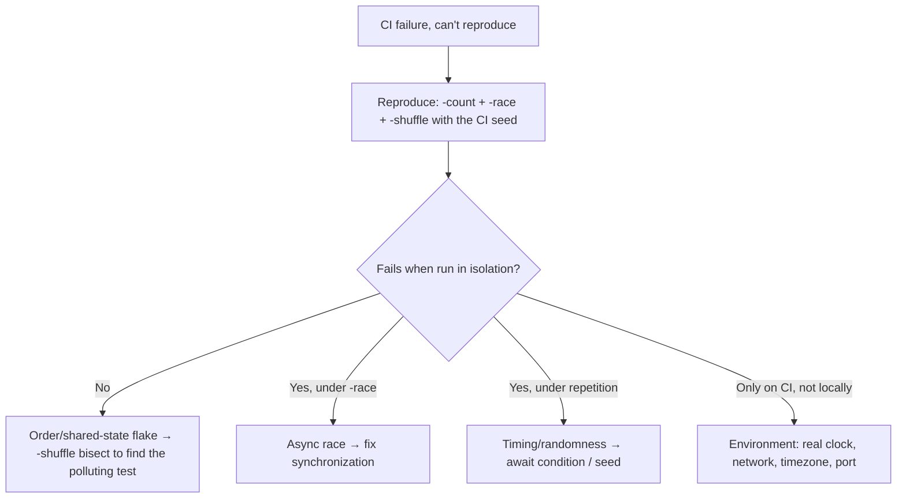
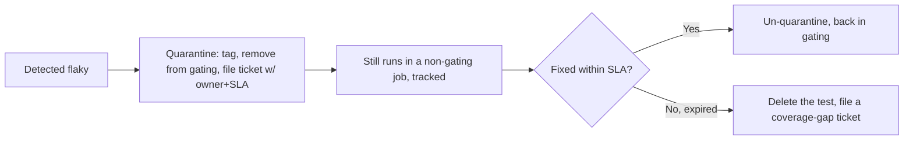

# Flaky Tests — Senior

> **Category:** [Testing Anti-Patterns](../README.md) → **Flaky Tests** — *the same test, on the same code, passes sometimes and fails sometimes.*
> **Also known as:** non-deterministic tests · intermittent tests · heisentests

---

## Introduction

> Focus: **Hunting flakiness in a real suite.**

`middle.md` fixed flakes one at a time, when you already knew which test and which cause. At senior level the job changes: you own a suite of thousands of tests, dozens flake at some rate, they fail in CI not on your laptop, and "which test, which cause" is itself the hard part. The work splits into five competencies:

1. **Detect** flakiness deliberately — force the non-determinism to show itself instead of waiting for CI to stumble on it.
2. **Root-cause** efficiently — turn a one-off red into a reproducible failure and a named cause.
3. **Isolate** at scale — make the suite safe to run in parallel and in random order, which removes whole classes of flake.
4. **Quarantine** — a disciplined workflow that gets a flaky test *out of the gating signal* without losing it or letting it rot forever.
5. **Measure** — track flake rate as a first-class metric so the problem is visible, owned, and trending down.

> **The senior reframing:** at this level a flaky test is not a nuisance you fix in passing — it is a **liability on the team's velocity** that you manage with a process. The goal isn't zero flakes (unattainable at scale); it's a *flake rate low enough, and a response fast enough, that a red build still means "go look."* Protecting that meaning is the whole job.

---

## Prerequisites

- **Required:** [`junior.md`](junior.md) and [`middle.md`](middle.md) — the seven causes and their per-cause cures.
- **Required:** You run and read a CI pipeline, and you've debugged at least one intermittent failure to root cause.
- **Helpful:** Familiarity with your test runner's flags for repetition, race detection, and randomized order (`go test -count -race -shuffle`, JUnit `@RepeatedTest` + thread-sanitizer, `pytest-repeat` + `pytest-randomly`).
- **Helpful:** Some exposure to CI analytics or a flaky-test dashboard (BuildPulse, Datadog CI, an in-house equivalent).

---

## Detecting flakiness on purpose

Waiting for CI to randomly catch a flake is slow and incomplete — by definition a flake fails *rarely*, so passive observation under-counts. The senior move is **active detection**: deliberately stress the non-deterministic inputs so flakes surface on demand, in a dev loop, before they reach the gating build.

**Re-run the same test many times.** If a test fails ~1 in 50 runs, run it 500 times — you'll see it fail ~10 times and you can attach a debugger.

```bash
# Go — run one test 1000×; -race on; randomize intra-package order.
go test -run TestWorker -count=1000 -race -shuffle=on ./worker/

# Python — repeat + randomize order across the suite.
pytest tests/test_worker.py --count=1000 -p no:cacheprovider   # pytest-repeat
pytest -p randomly                                              # pytest-randomly: random order each run
```

```java
// Java (JUnit 5) — repeat to expose intermittency.
@RepeatedTest(1000)
void workerIsDeterministic() { /* the suspect test */ }
```

Three flags do most of the detection work; run them in CI on a schedule (nightly), not just on demand:

| Flag / tool | What it surfaces | Cause it catches |
|---|---|---|
| **`-count=N` / `@RepeatedTest` / pytest-repeat** | Rare intermittents, by brute repetition | Timing, randomness, async |
| **`-race` / thread-sanitizer / `jcstress`** | Data races on shared memory | Async races (Cause 2), shared state (Cause 3) |
| **`-shuffle=on` / pytest-randomly / random method order** | Hidden test-order dependence | Shared mutable state (Cause 3) |

> **`-shuffle` is the highest-leverage flag you're not using.** Most suites have latent order-dependence that's invisible because the runner happens to use a stable order. Turn on random ordering in CI: it converts "passes today, mysteriously breaks when we add a test" into "fails today, with a seed you can reproduce." Go prints the seed (`-shuffle=on` → `-shuffle=<seed>` to reproduce); pytest-randomly prints `Using --randomly-seed=...`.

**A targeted detector for the suite as a whole:** run the full suite N times in CI nightly with race+shuffle on, and record every test that wasn't 100% consistent. That list *is* your flake backlog.

---

## Root-causing: from "it failed once" to a named cause

A CI failure screenshot is not a root cause. The senior skill is converting an irreproducible red into a reproducible one and then a named cause from `middle.md`'s seven. The workflow:



Concrete tactics:

- **Capture the seed.** Both `-shuffle` and randomized-input frameworks print a seed on failure. Re-running with that exact seed makes the failure deterministic — the single most useful step. If your harness doesn't log seeds, that's the first bug to fix.
- **Bisect the order, not the code.** For an order-dependent flake, `-shuffle` with a fixed failing seed, then binary-search which *earlier* test pollutes state: run halves of the suite before the victim until you find the culprit. The polluter, not the victim, is the bug.
- **Diff the environment.** "Fails on CI, not locally" is almost always Cause 5 or 6: CI runs in UTC (timezone flake), on a loaded box (timing flake), with a different DB (shared-state flake), or with a port already bound. Reproduce by matching the environment (`TZ=UTC`, `--cpus` limit, container parity), not by staring at the diff.
- **Read the failure for the *category*, not the *line*.** A `KeyError`/NPE that appears intermittently is shared-state or async; an assertion off by a small time delta is the clock; an order assertion is map iteration. Map the symptom to the seven-cause table before touching code.

> **The reproducibility test:** you have not root-caused a flake until you can make it fail **on demand**. "I think it's timing" without a reproduction is a guess, and guesses produce the worst fix of all — a speculative retry that hides the still-present cause.

---

## Test isolation and parallelism

Two of the seven causes — shared state and async races — are *structural*: they're properties of how the suite is organized, and you fix them once, suite-wide, rather than test by test. The lever is **isolation**.

**Isolation makes parallelism safe, and parallelism exposes weak isolation.** They're two sides of one coin:

- **Process/goroutine isolation.** Go's `t.Parallel()`, JUnit 5's parallel execution, `pytest-xdist` (`-n auto`) run tests concurrently. This is desirable for speed — but it *immediately surfaces* every shared-state and race bug, because tests now genuinely overlap. Turning on parallelism is therefore also a *detector*.
- **Data isolation.** Each test owns its data: a fresh temp dir, its own DB schema or a per-test transaction rolled back at the end, its own in-memory fake. Nothing a test writes is visible to another. This is what makes both random order *and* parallel execution safe.
- **Global isolation.** No mutable package vars, static singletons, or module globals shared across tests. Where the production design forces a global (a registry, a metrics singleton), reset it in teardown (`t.Cleanup`, `@AfterEach`) so it can't leak.

```go
// Go — parallel-safe by construction: each test owns its temp dir and DB schema.
func TestImport(t *testing.T) {
    t.Parallel()                              // safe ONLY because state below is isolated
    dir := t.TempDir()                        // unique per test; auto-removed
    db := newTestSchema(t)                    // throwaway schema; t.Cleanup drops it
    // ... no shared globals touched ...
}
```

> **The order of operations matters.** Isolate *first*, parallelize *second*. Turning on `t.Parallel()` over a suite riddled with shared state doesn't cause the flakiness — it *reveals* flakiness that was always there and was being hidden by serial, stable-order execution. That revelation is good; do it deliberately in a controlled run, not by surprise in the gating build.

A practical sequence to harden a legacy suite: (1) turn on `-shuffle`/random order in a nightly job and fix every order-dependence it finds; (2) turn on `-race`/thread-sanitizer and fix every reported race; (3) only then enable parallel execution for speed, now that isolation is real.

---

## The quarantine workflow

You cannot fix every flake the instant you find it, and you must not leave it failing in the gating build (that's the "train everyone to ignore red" failure mode). The disciplined middle path is **quarantine**: move the flaky test *out of the blocking signal* into a non-gating bucket, with an owner and a deadline.



The non-negotiable rules that make quarantine work and not become a graveyard:

1. **Quarantine ≠ retry.** A retry leaves the test in the gating build, still randomly failing, just re-run until green — this *trains the team to ignore red* and is the anti-pattern. Quarantine *removes it from the gating signal entirely* so the gate stays meaningful, while the test still runs (and is tracked) in a separate job.
2. **Every quarantined test has an owner and an SLA.** A ticket, assigned, with a deadline (e.g. 2 weeks). Quarantine is a *holding cell*, not a *landfill*.
3. **Quarantine expires.** If it isn't fixed by the SLA, the test is **deleted** (and a coverage-gap ticket filed). A test that's been quarantined for six months provides zero protection and pure noise; deleting it is honest. This rule is what prevents the quarantine bucket from growing without bound.
4. **A quarantine cap.** Cap the number of quarantined tests (say, 1% of the suite). Hitting the cap blocks new quarantines and forces fixes — it keeps flakiness from being swept under the rug indefinitely.

```go
// Go — a simple quarantine gate keyed on a build tag / env var.
func skipIfQuarantined(t *testing.T) {
    if os.Getenv("RUN_QUARANTINED") == "" {
        t.Skip("QUARANTINED: flaky, see JIRA-1234 (owner: @nadia, SLA 2026-06-24)")
    }
}
// Gating CI runs without RUN_QUARANTINED; a separate nightly job sets it and reports.
```

> **Why quarantine beats "auto-retry the whole suite":** an auto-retry on the gating build hides *every* flake indiscriminately — including the one that's actually a real, intermittent product bug. Quarantine is **selective and visible**: only known-flaky tests are exempted, each is tracked, and the gating signal stays trustworthy for everything else.

---

## Flake rate as a tracked metric

What gets measured gets fixed. The senior deliverable is making flakiness *visible* as a number the team watches, not a vibe ("CI feels flaky lately").

**Flake rate**, the core metric, is computed by **re-running tests on unchanged code** (or by comparing same-commit reruns) and counting non-deterministic outcomes:

> **flake rate = (runs that flipped result on identical code) / (total runs)** — per test, and aggregated per suite.

How to source it:

- **Same-commit reruns.** When CI re-runs a failed job on the same SHA and it passes, that's a recorded flake — log it. Most CI analytics tools (BuildPulse, Datadog CI Visibility, GitHub's flaky-test detection) do exactly this automatically.
- **Nightly N-run job.** Run the whole suite K times against `main` nightly; any test not 100% consistent contributes to the rate. This catches flakes that haven't yet failed in normal CI.

Track and act on:

| Metric | Use |
|---|---|
| **Per-test flake rate** | Rank the worst offenders; quarantine/fix top of list first |
| **Suite flake rate** | Trend line — is the suite getting more or less trustworthy over time? |
| **Quarantine count vs cap** | Is flakiness being managed or accumulating? |
| **Mean time-to-fix quarantined** | Is the team actually clearing the backlog or hoarding? |

Set a budget. A reasonable target for a healthy suite is a per-run failure-due-to-flake rate **well under 1%** — low enough that a red build is almost always real. Make the trend visible on a dashboard; review the worst offenders in the team's regular cadence. The point of the number is to convert flakiness from an invisible, diffuse tax into a *prioritizable backlog*.

---

## CI signal vs noise

Everything above serves one goal: **keep the CI signal trustworthy.** A red build must mean "you broke something," or the whole pipeline is theater. Flakiness is noise that corrupts the signal; here's the senior view of protecting it:

- **The gating build must be (near-)deterministic.** Anything non-deterministic — known flake, real-network test, real-clock test — belongs *out* of the gate (quarantine, or a separate non-blocking job), not in it.
- **Distinguish "flaky test" from "flaky infrastructure."** A CI agent that loses network, an OOM-killed runner, a registry timeout — those are *infrastructure* flakes, not test flakes. They need their own mitigation (retry the *job*, not the *test*; right-size runners) and shouldn't be conflated with test non-determinism. Tag failures by category.
- **Retry the *job* for infra, never the *test* for product code.** Retrying an entire CI job once to absorb an agent hiccup is reasonable. Wrapping a *product* test in `@Retry(3)` to absorb its own non-determinism is masking a bug — see `professional.md`.
- **Fail loudly on new flakiness.** If the nightly N-run job finds a *newly* flaky test, it should alert and create a ticket the same day. Flakes are cheapest to fix when fresh, while the introducing change is still in memory.

---

## A team policy that actually holds

Tools don't fix flakiness; a policy the team follows does. The policy that works in practice:

1. **Red on `main` is sacred.** Nobody merges over a red gating build. This rule is only *affordable* because flakes are quarantined out of the gate — which is exactly why quarantine matters.
2. **Detect proactively.** Nightly `-race -shuffle -count` job; same-commit-rerun logging; a flake dashboard.
3. **Quarantine, don't retry.** Found flaky → out of the gate, ticketed, owned, SLA'd. Capped. Expires to deletion.
4. **Measure and review.** Flake rate on a dashboard; worst offenders triaged in the regular cadence.
5. **Treat a flaky test as a real bug.** It gets a ticket, an owner, and priority proportional to its flake rate — not "we'll get to it." A 5%-flake test on a hot path is a P1.

> **The senior insight to carry to `professional.md`:** sometimes the test is flaky because the *system* is non-deterministic in a way that matters — a race in production code, an eventually-consistent dependency, an unbounded timeout. In those cases the flaky test is **doing its job**: it found a real reliability defect. The discipline above is what lets you tell *that* signal apart from test-harness noise.

---

## Common Mistakes

1. **Adding suite-wide auto-retry to "make CI green."** It hides every flake indiscriminately, including real intermittent product bugs, and removes all pressure to fix the underlying non-determinism. It's the institutional version of "just re-run it."
2. **Quarantining without an SLA or a cap.** The quarantine bucket becomes a graveyard of permanently-disabled tests that provide zero protection and full false-comfort. Quarantine must *expire*.
3. **Never turning on `-shuffle`/random order.** Order-dependence stays invisible until a new test perturbs the order and "unrelated" tests break. You're sitting on flakes you've chosen not to detect.
4. **Enabling parallelism before isolation.** Parallel execution over shared state doesn't *create* flakiness — it *exposes* it — but if you flip it on suite-wide in the gating build first, you get a flood of new red and blame the parallelism. Isolate, then parallelize.
5. **Treating "fails only on CI" as "CI's fault."** That phrase almost always means a real environment-coupling flake (timezone, load, real DB, port). The fix is in the test (inject the clock, fake the dep, isolate the data), not in the CI config.
6. **Not capturing the seed.** Without logging the shuffle/RNG seed, every flake is a fresh irreproducible mystery. Seed-logging is the cheapest, highest-leverage de-flaking investment.

---

## Test Yourself

1. You suspect order-dependence but the suite passes in CI every time. What single change makes the latent flake reproducible, and why does it work?
2. Distinguish **quarantine** from **auto-retry**. Why does one protect the CI signal and the other corrupt it?
3. Define **flake rate** and describe two ways to source the data for it.
4. Why is "enable `t.Parallel()` everywhere" sometimes blamed for *causing* flakiness, and what's the correct framing and sequence?
5. A test fails on CI but never locally. List the four environment causes you'd check first, and how you'd reproduce one of them.
6. Your quarantine bucket has 40 tests and keeps growing. What two policy rules are missing, and what should happen to a test quarantined past its deadline?

---

## Cheat Sheet

| Activity | Tooling | Catches |
|---|---|---|
| **Detect — repeat** | `-count=N`, `@RepeatedTest`, pytest-repeat | Rare timing/randomness/async flakes |
| **Detect — race** | `-race`, thread-sanitizer, `jcstress` | Async races, shared-memory bugs |
| **Detect — order** | `-shuffle=on`, pytest-randomly | Test-order / shared-state dependence |
| **Root-cause** | Reproduce with the printed seed; bisect the order; match env | A named cause, on demand |
| **Isolate** | `t.TempDir`, per-test schema/transaction, `t.Cleanup`/`@AfterEach` | Removes shared-state class entirely |
| **Quarantine** | Tag + non-gating job + ticket + SLA + cap | Keeps the gate trustworthy |
| **Measure** | Same-commit reruns, nightly N-run, dashboard | Flake rate as a managed backlog |

> **The senior rule:** *protect the meaning of red.* Detect proactively, quarantine (never retry), isolate suite-wide, and track flake rate so a red build always means "go look."

---

## Summary

- At scale, flakiness is **managed by process**, not fixed in passing. The five competencies: **detect, root-cause, isolate, quarantine, measure.**
- **Detect on purpose** with repetition (`-count`), the race detector (`-race`), and randomized order (`-shuffle`) — the highest-leverage flags most teams leave off. **Root-cause** by turning a one-off red into a reproducible failure (capture the seed!) and matching the symptom to one of the seven causes.
- **Isolation is structural** — fix shared state and races once, suite-wide. Isolate *first*, parallelize *second*; parallelism and random order *expose* weak isolation rather than causing flakiness.
- **Quarantine, never blanket-retry.** Move known flakes out of the *gating* signal with an owner, an SLA, a cap, and an expiry-to-deletion — so the gate stays meaningful and the bucket can't become a graveyard.
- **Track flake rate as a metric** so flakiness is a prioritizable backlog, not a vibe. The unifying goal is to **protect the meaning of a red build**.
- Next: [`professional.md`](professional.md) — *the hard cases: memory-model races in tests, deterministic simulation of time and scheduling, when a retry is legitimate vs masking a bug, and flaky tests as a signal that the **system** — not just the test — is non-deterministic.*

---

## Further Reading

- **Google Testing Blog — "Flaky Tests at Google and How We Mitigate Them"** (John Micco, 2016) and **"Where do Google's flaky tests come from?"** (Jeff Listfield, 2017) — fleet-scale detection, the rerun-based flake metric, and quarantine.
- **Google — *Software Engineering at Google* (2020)**, testing chapters — flakiness budgets and the cost of flaky tests on a large CI fleet.
- **Martin Fowler — "Eradicating Non-Determinism in Tests"** (2011) — the quarantine-vs-fix discipline and isolation-first argument.
- **John Micco & Atif Memon — "Taming Google-Scale Continuous Testing"** (ICSE-SEIP 2017) — empirical data on flake rates and their CI cost.
- **BuildPulse / Datadog CI Visibility docs** — how same-commit-rerun flake detection and dashboards work in practice.

---

## Related Topics

- [Testing Anti-Patterns → Slow Tests](../05-slow-tests/senior.md) — parallelism and fakes serve both speed and determinism; the suite-hardening work overlaps.
- [Testing Anti-Patterns → Mystery Guest](../03-mystery-guest/senior.md) — shared fixtures are the most common root of the order-dependent flakes you'll bisect.
- [Concurrency Anti-Patterns → Shared State](../../03-concurrency/03-shared-state/senior.md) — the production races that the race detector surfaces in your tests.
- [Development Anti-Patterns → Bad Structure](../../01-development/01-bad-structure/senior.md) — untestable structure (globals, God Objects) is what blocks the isolation this file requires.
- Refactoring → Code Smells — the refactorings (Inject Dependency, Extract Class) that make a flaky suite isolable.

---

## Check your understanding

1. Explain Flaky Tests — Senior Level in your own words and name the problem it solves.
2. How would you apply the ideas around Table of Contents, Introduction, Prerequisites in a realistic engineering change?
3. What failure mode or misuse should you look for, and what evidence would reveal it?
4. How would you validate a system-level decision about Flaky Tests — Senior Level under uncertainty?
5. What observable result would convince you that the approach improved the system?
