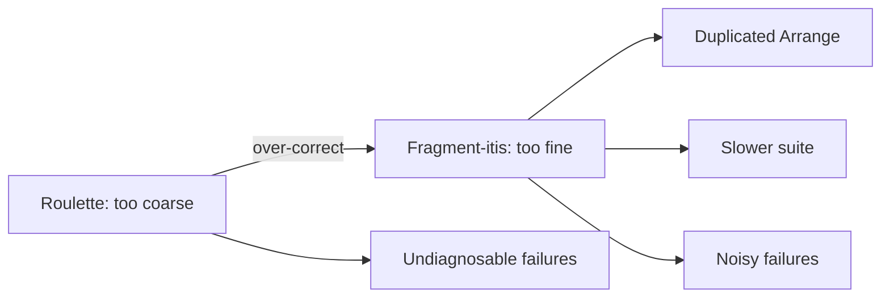

# Assertion Roulette — Professional

> **Category:** [Testing Anti-Patterns](../README.md) → **Assertion Roulette** — *a test with many unlabelled assertions, so when one fails you cannot tell which — or why.*

---

## Introduction

> Focus: **The trade-offs.** When several assertions in one test are not a smell but the *right* design; the measurable cost of over-splitting; soft-assert vs fail-fast as a genuine engineering choice; and treating failure output as a product you owe your future self.

By this level you can de-roulette any suite. The professional question is no longer "how do I split?" but "**should** I?" — because every cure has a cost, and applied dogmatically each one produces its own anti-pattern. Over-split and you get a slow suite of duplicated setup and a wall of green noise. Over-soften and you trade clear stack traces for collected failures that hide the *causal* one. Over-message and you maintain prose that drifts from the code.

The senior framing from `senior.md` — **one reason to fail** — is necessary but not sufficient at scale. This file is about the second-order trade-offs: the cases where the textbook advice ("split it," "one assert per test," "use soft assertions") is *wrong* for your situation, and how to tell.

> **The mental model:** test output is a product with a user (a future engineer under time pressure) and a cost (authoring + maintenance + runtime). You are optimizing diagnostic value per unit of cost — not maximizing assertion granularity. The smell is *undiagnosable failure*, not *plural assertions*.

---

## Prerequisites

- **Required:** Fluent with [`senior.md`](senior.md) — one-reason-to-fail, AAA, parameterized tests, custom assertions.
- **Required:** You own a suite where runtime and maintenance cost are real budgets, not abstractions.
- **Helpful:** You've felt the pain of *both* failure modes — a roulette wheel you couldn't diagnose, and a 4,000-test suite of one-assert fragments nobody can navigate.

---

## When Multiple Assertions in One Test Are Correct

Assertion Roulette is about **unlabelled assertions across multiple behaviors**. It is *not* "more than one assert." Several assertions in one test are not just tolerable but *correct* when they verify **multiple facets of a single outcome**. Splitting them would be the *opposite* mistake.

Legitimate multi-assert cases:

- **One object, several fields.** After `register`, the new user is active, has the given email, role `member`, and a non-null id. That's *one* behavior — "registration produces a correct user" — with four facets. Asserting them together (labelled) is right; one would-be reason to fail, four observations.
- **A computed result with parts.** An invoice's subtotal, tax, discount, and total are one calculation. They're coupled — if the formula is wrong, you *want* to see all the wrong numbers at once to diagnose it.
- **Asserting the negative space.** "This update changed `name` and left `email`, `role`, `createdAt` untouched." Verifying what *didn't* change is part of one behavior and often needs several asserts.
- **Sequenced post-conditions of one operation.** After `transfer(a, b, 100)`: `a` decreased by 100, `b` increased by 100, a ledger entry exists. One operation, three consequences — splitting forces three identical Arrange blocks and loses the *relationship* between the consequences.

```java
// CORRECT multi-assert: one behavior (a valid transfer), facets reported together
@Test
void transferMovesMoneyAndRecordsLedger() {
    // Arrange
    Account from = account(500), to = account(0);
    // Act
    bank.transfer(from, to, 100);
    // Assert — facets of ONE outcome; soft-assert so all show at once
    assertAll("transfer post-conditions",
        () -> assertEquals(400, from.balance(), "source balance"),
        () -> assertEquals(100, to.balance(),   "dest balance"),
        () -> assertEquals(1, ledger.count(),   "ledger entries"));
}
```

The test of legitimacy: **could this fail for two *unrelated* reasons?** If no — if all the asserts are downstream of the same single operation and conceptually one fact — they belong together. Splitting them duplicates Arrange and severs the diagnostic relationship between the numbers.

---

## The Cost of Over-Splitting

The "split everything to one assert" reflex has measurable costs that compound across a suite:

- **Duplicated Arrange.** Each micro-test rebuilds the fixture. For the transfer example, three one-assert tests = three copies of account setup. Across a suite, this is the dominant source of test-code bloat — and Arrange is where Mystery Guest and fixture drift creep in.
- **Runtime.** More test methods = more setup/teardown cycles, more framework overhead, more container/DB spin-ups if the fixture is heavy. A suite split from 800 cohesive tests into 3,000 fragments can run multiples slower for *zero* added coverage — and a slow suite gets skipped (see [Slow Tests](../05-slow-tests/professional.md)).
- **Navigability.** A red run of 12 related failures from one over-split behavior looks like 12 problems; it's one. The signal-to-noise ratio of the failure report drops.
- **Maintenance.** A behavior change now means editing N fragment-tests instead of one cohesive test, multiplying churn.



Both ends are anti-patterns. The cost curve is U-shaped, and "one reason to fail" is the bottom of the U — not the far edge.

---

## Soft-Assert vs Fail-Fast: a Real Trade-Off

Soft assertions ("report all failures") and fail-fast ("stop at the first") are not "soft is modern, hard is legacy." Each is correct in different situations, and choosing wrong degrades diagnosis.

**Prefer soft assertions (assert-all) when:**
- The assertions are **independent facets of one outcome** and you want the full picture in one run (the transfer/invoice cases). Seeing all three wrong numbers diagnoses the formula faster than three round-trips.
- A long acceptance/contract test checks many independent fields of a response — you'd rather get the whole list of mismatches than fix-and-rerun.

**Prefer fail-fast (hard assert) when:**
- Later assertions are **meaningless or dangerous** after an earlier one fails. If you assert `response != null` and it *is* null, continuing to assert `response.body == ...` produces a `NullPointerException` whose stack trace *buries* the real failure (the null) under a secondary crash. Here fail-fast (`require` in Go, plain `assertNotNull` first) gives a cleaner diagnosis than soft-asserting into an NPE.
- There's a **causal chain**: assertion 2 only makes sense if assertion 1 held. Soft-asserting a chain reports a cascade of derived failures that obscure the single root cause.

```go
// Go — the dependency dictates require (fail-fast) THEN assert (soft)
func TestFetchUser(t *testing.T) {
    u, err := Fetch(id)
    require.NoError(t, err)        // fail-fast: nothing below is valid if this fails
    require.NotNil(t, u)           // fail-fast: avoid nil-deref masking the real bug
    assert.Equal(t, "ada", u.Name) // soft: independent facets from here on
    assert.Equal(t, "pro", u.Plan)
}
```

The professional pattern is **hybrid**: `require`/hard-assert the *preconditions* of meaningful further assertion (non-null, no error, right type), then *soft-assert* the independent facets. Pure soft or pure hard both lose information in one direction.

> **The asymmetry to remember:** fail-fast risks *hiding sibling failures*; soft-assert risks *drowning the root cause in derived failures*. Match the mode to whether the assertions are independent (soft) or dependent (fail-fast).

---

## Assertion-Message Discipline at Scale

Messages are the cheapest cure and the easiest to do badly at scale. Discipline:

- **Prefer matchers over hand-written messages.** `assertThat(x.getStatus()).isEqualTo(CONFIRMED)` generates a correct, value-bearing message forever. A hand-written `"status should be confirmed"` can *drift* — someone changes the assertion to check `SHIPPED` and forgets the message, which now lies. **A wrong message is worse than none** because it misdirects. Let the library generate messages from the actual code wherever possible.
- **Messages should add what the values can't.** `assertEquals(100, tax, "tax")` — the "100" and actual are already printed; the word "tax" adds the missing *identity*. Don't restate the value (`"expected 100"`); name the *thing* (`"10% tax on 1000 subtotal"`).
- **Encode the *why*, not the *what*.** `"trial days for pro plan"` beats `"trial days"`; it tells the reader the business rule, which is what they actually need to debug.
- **Centralize via custom assertions** so the message lives in one place and can't drift per-call-site (see `senior.md`).
- **Don't message-spam green tests.** Messages only ever appear on failure; over-investing prose in assertions that rarely fail is wasted maintenance. Spend the discipline where failures are frequent and confusing.

```python
# Bad: message restates the value (redundant) and can drift
assert inv.tax == 100, "tax should be 100"
# Good: message names the rule; the matcher prints the values
assert inv.tax == 100, "tax = 10% of subtotal (1000)"
```

---

## The Diagnostic Value of Good Failure Output

The entire topic reduces to one economic claim: **the value of a test is realized at the moment it fails, and that value is bounded by how fast the failure points to the cause.** A test that catches a regression but reports "line 48 false" has high *detection* value and near-zero *localization* value — and localization is where the engineer's time actually goes.

Quantify it: a self-describing failure (`tax = 10% of subtotal ==> expected: <100> but was: <95>`) is debuggable in seconds without opening the test. A roulette failure (`assertion failed: order_test.go:48`) costs a context-switch into the test file, a re-read of every assert, a hypothesis, and often a re-run with added logging — minutes to tens of minutes, multiplied by every failure over the suite's life. Across a team and years, the difference is enormous, and it's *all* recovered by message discipline + matchers + one-reason-to-fail.

This is why "fix the failure output" beats "add more tests" as a maturity investment: a suite that diagnoses itself is one the team keeps trusting and running. A suite of roulette wheels gets distrusted, then skipped, then deleted — and you're back to no safety net.

> **The professional reframing:** you are not writing assertions, you are writing the *failure messages your future team will read under pressure*. The assertion is just the trigger; the message is the deliverable.

---

## A Decision Framework

When facing a test with several assertions, ask in order:

1. **Could it fail for two *unrelated* reasons / multiple behaviors?** → **Split** (Eager Test).
2. **Are these facets of *one* outcome?** → **Keep together.** Then:
3. **Are later asserts meaningless if earlier ones fail (causal chain, null/error preconditions)?** → **Hard-assert (fail-fast)** the preconditions; soft-assert the rest.
4. **Are they independent facets you want all reported?** → **Soft-assert.**
5. **Does this multi-facet check recur?** → Extract a **custom domain assertion**.
6. **Are there many *cases*, not behaviors?** → **Parameterized test**, named cases.
7. **For whatever remains:** ensure each assertion is **value-bearing and identity-labelled** — prefer matchers over hand-written messages.

This is the whole topic operationalized: it never says "always split" or "always soften." It routes each test to the cure that maximizes diagnostic value at minimum cost.

---

## Common Mistakes

1. **Treating plural assertions as the smell.** The smell is *undiagnosable failure across multiple behaviors*. Facets of one outcome belong together. Don't split a coherent post-condition check.
2. **Pure soft-assert dogma.** Soft-asserting a causal chain turns one root failure into a cascade of derived failures and can crash on a null you should have hard-asserted first. Hard-assert preconditions.
3. **Over-splitting into fragment-itis.** Duplicated Arrange, slower suite, noisy red runs — the opposite anti-pattern, and just as real a cost.
4. **Hand-written messages that drift.** A message that contradicts the assertion misdirects debugging. Prefer library-generated messages; reserve prose for the *why*.
5. **Optimizing failure output uniformly.** Spend message/assertion effort on the tests that fail often and confusingly; don't gold-plate rarely-failing happy-path tests.
6. **Forgetting the relationship between facets.** Splitting `transfer` into three tests loses the diagnostic value of seeing source-down, dest-up, and ledger-entry *together* when the math is off.

---

## Test Yourself

1. Give two concrete cases where multiple assertions in one test are *correct*, not a smell, and state the test that distinguishes them from roulette.
2. Name three measurable costs of over-splitting a suite into one-assert tests.
3. State the asymmetry between fail-fast and soft-assert, and the hybrid rule that resolves it.
4. Why can a hand-written assertion message be *worse* than no message at all?
5. Why is "improve failure output" often a better investment than "add more tests" for a mature suite?

---

## Cheat Sheet

| Question | Answer routes to |
|---|---|
| Two unrelated reasons to fail? | Split (Eager Test) |
| Facets of one outcome? | Keep together |
| Later asserts meaningless if earlier fail? | Hard-assert preconditions, then soft |
| Independent facets, want all reported? | Soft-assert |
| Recurring facet-check? | Custom domain assertion |
| Many cases, not behaviors? | Parameterized, named cases |
| Message strategy | Matchers > hand-written; name the *why*, not the value |

> **One rule to remember:** *the smell is the undiagnosable failure, not the plural assertion. Optimize diagnostic value per unit of cost — split for unrelated reasons, keep for shared outcomes, and make every failure read like a sentence.*

---

## Summary

- Multiple assertions in one test are **correct** when they're facets of *one* outcome; the smell is unlabelled assertions across *multiple behaviors*. The discriminator: "could it fail for two unrelated reasons?"
- **Over-splitting is its own anti-pattern** — duplicated Arrange, slower suite, noisy failures. The cost curve is U-shaped; "one reason to fail" is the bottom, not the far edge.
- **Soft-assert vs fail-fast is a real trade-off.** Hybrid rule: hard-assert preconditions (no error, non-null), soft-assert independent facets — fail-fast hides siblings, soft-assert drowns root causes.
- **Message discipline:** prefer library-generated (drift-proof) messages; hand-written prose should name the *why*; spend effort where failures are frequent and confusing.
- The whole topic is economic: **diagnostic value per unit of cost.** Good failure output keeps a suite trusted; roulette gets it skipped.

---

## Further Reading

- **xUnit Test Patterns** — Gerard Meszaros (2007) — *Assertion Roulette*, *Eager Test*, *Verify One Condition per Test*, *Custom Assertion*.
- **Unit Testing: Principles, Practices, and Patterns** — Vladimir Khorikov (2020) — test value, one reason to fail, the cost of granularity.
- **AssertJ** `SoftAssertions`; **JUnit 5** `assertAll`; **testify** `assert` vs `require`; **pytest-check** — the soft/hard mechanisms compared.
- **Working Effectively with Unit Tests** — Jay Fields (2014) — solitary vs sociable tests and assertion granularity in practice.

---

## Related Topics

- [Slow Tests](../05-slow-tests/professional.md) — the runtime cost over-splitting creates; why a skipped suite is the end state.
- [Fragile Tests](../01-fragile-tests/professional.md) — over-asserting internals; the sibling over-specification failure.
- [Mystery Guest](../03-mystery-guest/professional.md) — duplicated Arrange from over-splitting feeds hidden-fixture smells.
- Architecture Anti-Patterns — system-scale trade-offs.
- [Bad Structure](../../01-development/01-bad-structure/professional.md) — the production-code trade-offs this mirrors in test code.

---

## Check your understanding

1. Explain Assertion Roulette — Professional Level in your own words and name the problem it solves.
2. How would you apply the ideas around Table of Contents, Introduction, Prerequisites in a realistic engineering change?
3. What failure mode or misuse should you look for, and what evidence would reveal it?
4. How would you introduce and govern Assertion Roulette — Professional Level across teams through reversible, measurable increments?
5. What observable result would convince you that the approach improved the system?
