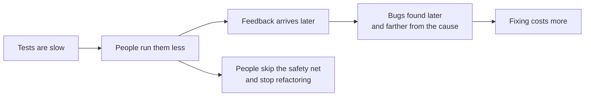
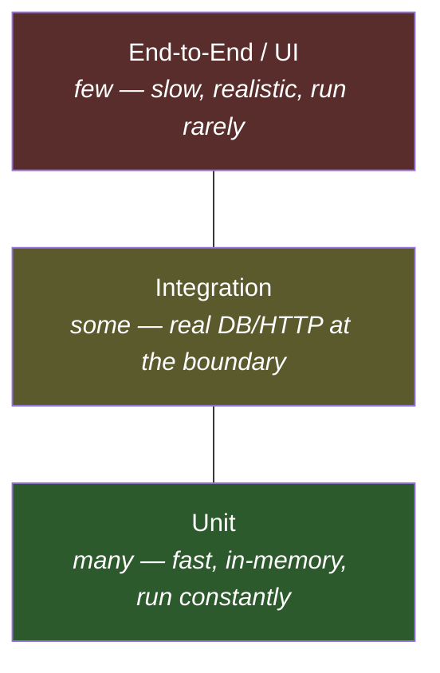

# Slow Tests — Junior

> **Category:** [Testing Anti-Patterns](../README.md) → **Slow Tests** — *a suite so slow the team stops running it before pushing.*

---

## Table of Contents

1. [Introduction](#introduction)
2. [Prerequisites](#prerequisites)
3. [What "Slow" Actually Costs](#what-slow-actually-costs)
4. [The One Cause You'll Create First: Real I/O](#the-one-cause-youll-create-first-real-io)
5. [The Second Cause: `sleep`](#the-second-cause-sleep)
6. [The Test Pyramid, in One Picture](#the-test-pyramid-in-one-picture)
7. [Fast Is a Feature](#fast-is-a-feature)
8. [Common Mistakes](#common-mistakes)
9. [Test Yourself](#test-yourself)
10. [Cheat Sheet](#cheat-sheet)
11. [Summary](#summary)
12. [Further Reading](#further-reading)
13. [Related Topics](#related-topics)

---

## Introduction

> Focus: **Why slow tests quietly kill the suite.**

A test suite has one job: tell you, fast, whether your change broke anything. The "fast" is not a nicety — it's the whole point. The value of a test is the feedback it gives, and feedback you get in 3 seconds shapes how you work; feedback you get in 18 minutes does not, because you've already moved on, opened a different file, lost the context.

Here is the trap, and it's almost invisible while you build it. You write a unit test for `createUser`. It needs a user in the database, so your test connects to a real Postgres, inserts a row, runs the function, asserts, deletes the row. It takes **2 seconds**. That feels fine — 2 seconds is nothing. You ship it.

Then it happens 400 more times, across the whole team, over a year.

> 400 tests × 2 seconds = **13 minutes** for a suite that should run in **8 seconds**.

Now nobody runs the suite before pushing. They push and hope, or they run "just the test I touched," or they wait for CI and context-switch away. The suite still exists. It's still green. But it has stopped doing its job, because **a test nobody runs is not a safety net** — it's a 13-minute decoration.

That's the anti-pattern. **Slow Tests** is not one broken test; it's a suite that got slow one reasonable-looking 2-second test at a time, until the team's habit changed from "run it" to "skip it."

> **The mindset shift:** a unit test that touches a real database is not a slow unit test — it's a *misclassified integration test*. The speed problem is a symptom; the real problem is testing the wrong thing at the wrong layer. Fix the layer and the speed follows.

---

## Prerequisites

- **Required:** You can write a basic unit test in at least one language (examples here use Go, Java with JUnit 5, and Python with pytest).
- **Required:** You know the difference between *your code* and a *dependency* it talks to — a database, an HTTP API, the filesystem, the clock.
- **Helpful:** You've waited for a slow CI run and felt the urge to push without running tests locally. That urge is exactly what this file is about.
- **Helpful:** Basic familiarity with the idea of a *test double* (a stand-in for a real dependency) — covered properly in the `unit-testing-patterns` and `mocking-strategies` skills.

---

## What "Slow" Actually Costs

The cost of a slow suite isn't the wall-clock time. It's the **behavior change** the slowness causes. Watch the chain:



A bug caught by a unit test on your laptop costs seconds to fix — you know exactly what you just changed. The *same bug* caught in CI 20 minutes later costs minutes, because you've context-switched. Caught in a teammate's branch next week, it costs an investigation. Caught in production, it costs an incident. **Slowness pushes every bug down that chain**, toward the expensive end.

There's a second, quieter cost. A fast suite makes refactoring safe and cheap — change the code, run the tests, know in seconds whether you broke anything. A slow suite makes refactoring *expensive*, so people stop doing it, and the production code rots into the [structural anti-patterns](../../01-development/01-bad-structure/junior.md) the rest of this roadmap warns about. Slow tests don't just fail to catch bugs; they remove the safety net that keeps the whole codebase healthy.

---

## The One Cause You'll Create First: Real I/O

By far the most common way a junior creates a slow test is **doing real I/O in a unit test** — talking to a real database, a real HTTP endpoint, the real filesystem, or the real clock. I/O is *thousands of times slower* than running code in memory.

| Operation | Rough cost | Relative |
|---|---|---|
| Call a pure function | ~10 nanoseconds | 1× |
| Read in-memory map | ~50 nanoseconds | 5× |
| Round-trip to a local DB | ~1–5 **milliseconds** | ~100,000× |
| HTTP call to a real service | ~50–500 **milliseconds** | ~10,000,000× |

A unit test should exercise *your logic*, and your logic runs in memory. The database round-trip in the test below isn't testing your logic — it's testing Postgres, which already works, and paying a 100,000× speed tax to do it.

```python
# Python — a "unit" test that is secretly an integration test
import psycopg2

def test_discount_for_gold_member():
    conn = psycopg2.connect("dbname=test")          # real DB connection
    cur = conn.cursor()
    cur.execute("INSERT INTO members (id, tier) VALUES (1, 'gold')")
    conn.commit()

    result = compute_discount(conn, member_id=1)     # the thing we care about

    assert result == 0.20
    cur.execute("DELETE FROM members WHERE id = 1")   # cleanup
    conn.commit()
    conn.close()
# ~30–80 ms per run. Multiply by your whole suite.
```

The logic we actually want to test is *"gold members get 20% off."* That rule lives in `compute_discount`. The database is just where the member *happens* to be stored. So **don't store it in a real database for the test** — hand the function the data directly, through a tiny in-memory stand-in (a **fake**):

```python
# Python — same logic, no I/O. Microseconds, not milliseconds.
class FakeMembers:
    def __init__(self, members):
        self._members = members
    def tier_of(self, member_id):
        return self._members[member_id]

def test_discount_for_gold_member():
    members = FakeMembers({1: "gold"})       # data in memory, visible in the test
    result = compute_discount(members, member_id=1)
    assert result == 0.20
```

This requires that `compute_discount` take its data through an interface it doesn't own (here, a `tier_of` method) rather than reaching for a global connection — which is exactly the dependency-injection habit (see Clean Code → Boundaries) that makes code testable. The test is now **microseconds**, reads top-to-bottom (no [Mystery Guest](../03-mystery-guest/junior.md) hidden in a database), and tests *your rule* instead of Postgres.

> Real databases and real HTTP calls absolutely belong in tests — just not in *unit* tests. They go in a smaller number of **integration tests** (the `integration-testing` skill), which you keep deliberately few and run on their own. That separation is the test pyramid, below.

---

## The Second Cause: `sleep`

The other slowness you'll create early is waiting with `sleep`. Something happens asynchronously — a background job, a goroutine, a callback — and you need it to finish before you assert. The tempting fix is to wait "long enough":

```go
// Go — the sleep anti-pattern
func TestJobCompletes(t *testing.T) {
    queue.Submit(job)
    time.Sleep(2 * time.Second) // "should be done by now"
    if !job.Done() {
        t.Fatal("job did not complete")
    }
}
```

This is slow **and** unreliable, which is why it shows up in both this chapter and [Flaky Tests](../02-flaky-tests/junior.md). It's slow because you pay the full 2 seconds *even when the job finished in 5 ms*. It's flaky because on a loaded CI machine the job might take 2.1 seconds and the test fails for no real reason. You can't win: short sleeps are flaky, long sleeps are slow.

The fix is to **wait for the condition, not for the clock** — poll cheaply until the thing is true (or a timeout fires):

```go
// Go — await the condition; returns the instant it's true
func TestJobCompletes(t *testing.T) {
    queue.Submit(job)
    waitUntil(t, 2*time.Second, func() bool { return job.Done() })
}

func waitUntil(t *testing.T, timeout time.Duration, cond func() bool) {
    t.Helper()
    deadline := time.Now().Add(timeout)
    for time.Now().Before(deadline) {
        if cond() {
            return // success — we stop the moment it's true
        }
        time.Sleep(5 * time.Millisecond) // cheap poll, not the whole wait
    }
    t.Fatal("condition not met before timeout")
}
```

The timeout is the *ceiling* (so a real hang still fails the test), but the common case returns in milliseconds. Same correctness, a hundredth of the time, and no flakiness.

---

## The Test Pyramid, in One Picture

Where the I/O lesson and the layering lesson meet is the **test pyramid** (Mike Cohn, *Succeeding with Agile*; popularized by Martin Fowler). It's a budget for how many tests of each kind you should have:



- **Many unit tests** — fast, in-memory, no I/O. These are the bulk. They run in seconds, so you run them constantly.
- **Some integration tests** — real database, real HTTP, real filesystem, at the boundaries. Slower, so fewer. Run before merge, not on every keystroke.
- **Few end-to-end tests** — the whole system through the front door. Slowest and most realistic; a handful for the critical flows.

The **Slow Tests** anti-pattern is what you get when this pyramid flips upside-down into an "ice-cream cone": a few unit tests on top and a huge base of slow end-to-end tests. Everything goes through every layer (and a real database), so everything is slow, and the suite takes an hour. Senior-level files cover reshaping that inverted pyramid; at your level, just don't *build* it — when you can test a rule with an in-memory fake, do, and reserve the real database for the small number of tests that genuinely need it.

---

## Fast Is a Feature

A useful target for the suite you run before every push: **under 10 seconds for the unit tests, ideally under 2.** That number isn't arbitrary — it's roughly the limit of patience. Below it, running the tests is frictionless and becomes automatic. Above it, every run is a small decision ("is it worth waiting?"), and decisions get skipped.

So treat test speed the way you treat correctness: as a property worth protecting. When a test you write does real I/O, that's a signal to ask *"is this actually a unit test?"* — and usually the answer, and the fix, is to push the I/O behind a fake and test your logic directly.

---

## Common Mistakes

1. **"2 seconds is fine."** It is — once. The anti-pattern is *aggregate*: 2 seconds × the whole suite is what kills it. Always think about a test's cost multiplied by how many tests like it will exist.
2. **Putting a real database in a unit test.** If the test needs a running service to pass, it isn't a unit test. Use a fake for the unit test; keep a *few* real-DB integration tests separately.
3. **Waiting with `sleep`.** It's slow on the happy path and flaky under load. Await the condition with a polling helper and a timeout ceiling instead.
4. **Measuring the whole suite, never the parts.** "The suite takes 12 minutes" is not actionable. "These 6 tests take 9 of the 12 minutes" is. (How to find them: `middle.md`.)
5. **Assuming slow = thorough.** A slow test is not a *better* test. Realism has value (that's what integration tests are for), but a unit test that's slow is usually slow by accident, not by design.
6. **Treating speed as separate from quality.** A suite people skip catches nothing. Speed *is* part of whether the suite works at all.

---

## Test Yourself

1. A teammate says "each test only takes 1.5 seconds, that's fast." Why is this the wrong way to think about test speed?
2. You have a unit test that connects to a real Redis to check a caching rule. What's the cleaner design, and what does it require of the code under test?
3. Why is `time.Sleep(3 * time.Second)` both slow *and* flaky? What replaces it?
4. In the test pyramid, which layer should have the *most* tests, and why?
5. What is the "ice-cream cone," and why does it produce a slow suite?
6. Your suite takes 15 minutes and the team has stopped running it locally. Name two distinct costs this is creating beyond the wasted 15 minutes.

---

## Cheat Sheet

| Symptom | Cause | Fix |
|---|---|---|
| Unit test takes 30+ ms | Real DB / HTTP / filesystem I/O | Replace the dependency with an in-memory **fake**; inject it |
| Test waits a fixed time | `sleep`-based waiting | **Await the condition** with a polling helper + timeout ceiling |
| Whole suite takes minutes | Too many tests go through every layer | Push logic into **unit tests**; keep real-I/O tests few (pyramid) |
| Suite is green but nobody runs it | It's too slow to run before pushing | Get the unit suite **under ~10 s**; segregate the slow tests |

> **One rule to remember:** *A test's job is fast feedback. A unit test that does real I/O isn't a slow unit test — it's an integration test in the wrong place.*

---

## Summary

- A test exists to give **fast feedback**. When the suite gets slow, people run it less, bugs are caught later and farther from their cause, and refactoring stops because the safety net is too expensive to use.
- Slowness is **aggregate**: each 2-second test feels fine, but the suite is the sum. Always weigh a test's cost against how many like it will exist.
- The two causes you'll create first are **real I/O in unit tests** (replace the dependency with an in-memory fake and inject it) and **`sleep`-based waiting** (await the condition with a polling helper and a timeout ceiling).
- The **test pyramid** is the budget: many fast unit tests, some integration tests, few end-to-end. The Slow Tests anti-pattern is this pyramid flipped into an "ice-cream cone."
- Treat speed as a feature: aim for a unit suite that runs in **under ~10 seconds**, so running it stays automatic.
- Next: [`middle.md`](middle.md) — *the full catalogue of causes and fixes, and how to find exactly which tests are slow.*

---

## Further Reading

- **Succeeding with Agile** — Mike Cohn (2009) — introduces the **test automation pyramid**: many unit tests, fewer service/integration, few UI.
- **xUnit Test Patterns** — Gerard Meszaros (2007) — the catalogue of test smells, including **Slow Tests** and its causes and cures.
- **Test Pyramid** — Martin Fowler (martinfowler.com) — the canonical short write-up of the pyramid and the ice-cream-cone anti-pattern.
- **Unit Test** (bliki) — Martin Fowler — what "unit test" means, and the *sociable* vs *solitary* distinction that decides what to fake.

---

## Related Topics

- [Flaky Tests](../02-flaky-tests/junior.md) — the sibling smell that `sleep`-based waiting also causes; awaits fix both.
- [Mystery Guest](../03-mystery-guest/junior.md) — a real database hides test data; in-memory fakes make it visible *and* fast.
- [Over-Mocking](../06-over-mocking/junior.md) — the opposite hazard: too many doubles, asserting on mocks instead of behavior.
- [Performance → Premature Optimization Traps](../../06-performance/01-premature-optimization-traps/junior.md) — measure before you optimize; the same discipline applies to test time.
- Architecture → Anti-Patterns — the system-level view of structures that resist change.

---

## Check your understanding

1. Explain Slow Tests — Junior Level in your own words and name the problem it solves.
2. How would you apply the ideas around Table of Contents, Introduction, Prerequisites in a realistic engineering change?
3. What failure mode or misuse should you look for, and what evidence would reveal it?
4. What small example would prove that you can apply Slow Tests — Junior Level correctly?
5. What observable result would convince you that the approach improved the system?
