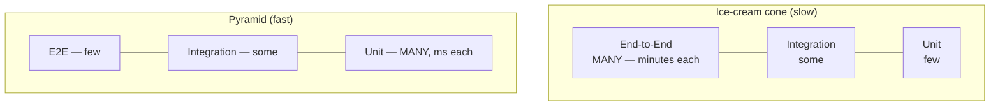

# Slow Tests — Middle

> **Category:** [Testing Anti-Patterns](../README.md) → **Slow Tests** — *a suite so slow the team stops running it before pushing.*

---

## Introduction

> Focus: **Causes & fixes** — the full catalogue of what makes a suite slow, and the specific countermove for each.

At the junior level you learned the headline cause — real I/O in unit tests — and the headline cure — push the I/O behind a fake. This file is the complete working catalogue. A slow suite is almost always slow for one of a small number of reasons, and each has a known, mechanical fix:

| Cause | What's slow | Fix |
|---|---|---|
| Real I/O in unit tests | DB / HTTP / filesystem round-trips | **Fakes** at the boundary; keep real I/O in few integration tests |
| `sleep`-based waiting | Fixed delays, paid every run | **Await** the condition with a polling helper |
| Inverted pyramid (ice-cream cone) | Everything is end-to-end | Move tests **down** to the cheapest layer that can catch the bug |
| Per-test heavyweight setup | Container/context built per test | Build it **once**, share it safely |
| Oversized fixtures / combinatorics | Huge data, exponential cases | **Minimal** fixtures; parametrize the cases that matter |

But before any of that: **you cannot fix what you haven't measured.** The first half of the middle-level skill is finding *which* tests are slow.

---

## Prerequisites

- **Required:** Comfortable with [`junior.md`](junior.md) — you understand why slow tests get skipped, and the real-I/O and `sleep` causes.
- **Required:** You can write tests with fakes/stubs and inject dependencies into the code under test.
- **Helpful:** Familiarity with the test pyramid and the difference between a unit and an integration test (`unit-testing-patterns`, `integration-testing` skills).
- **Helpful:** You've run a CI pipeline and seen per-job timing.

---

## Measure First: Find the Slow Tests

"The suite is slow" is not actionable. "These 5 tests are 80% of the runtime" is. Test time follows a power law — almost always a small number of tests dominate — so the win is to **find and fix the top offenders**, not to shave milliseconds off everything. Every runner can rank tests by duration.

**Python (pytest)** — `--durations` prints the slowest tests:

```bash
pytest --durations=10              # the 10 slowest tests (and their setup/teardown)
pytest --durations=0 -vv           # every test, sorted by time — the full picture
```

```text
============================= slowest 10 durations =============================
8.41s call     tests/test_checkout.py::test_full_purchase_flow
6.02s call     tests/test_users.py::test_create_user_writes_to_db
0.98s setup    tests/test_reports.py::test_monthly_report
...
```

The first two lines are your whole problem. Note pytest separates `setup`, `call`, and `teardown` — a slow *setup* line points at expensive fixtures (Cause 4), a slow *call* points at the test body itself.

**Go** — emit machine-readable timings and sort them:

```bash
go test -json ./... | \
  jq -r 'select(.Action=="pass" and .Test!=null) | "\(.Elapsed)\t\(.Package).\(.Test)"' | \
  sort -rn | head
```

`go test` also flags anything slow at the package level, and `go test -count=1` defeats the result cache so you measure real time, not a cached pass.

**Java (JUnit 5)** — a `TestWatcher` extension records each test's duration; register it and log the outliers:

```java
public class TimingExtension implements TestWatcher, BeforeTestExecutionCallback {
    private long start;
    @Override public void beforeTestExecution(ExtensionContext ctx) { start = System.nanoTime(); }
    @Override public void testSuccessful(ExtensionContext ctx) {
        long ms = (System.nanoTime() - start) / 1_000_000;
        if (ms > 100) System.out.printf("SLOW %dms  %s%n", ms, ctx.getDisplayName());
    }
}
// register globally via src/test/resources/META-INF/services or @ExtendWith
```

Maven Surefire and Gradle also write per-test XML reports with `time="..."` you can sort. The point is the same in every language: **rank by time, fix the top of the list.**

> **Make slowness visible in CI.** Print the slowest 10 on every run. A test that creeps from 50 ms to 4 s should show up in a diff, not be discovered a year later when the whole suite is unbearable. This is the test-time equivalent of watching a [performance budget](../../06-performance/01-premature-optimization-traps/middle.md).

---

## Cause 1 — Real I/O in Unit Tests → Fakes

The most common offender, and the one with the biggest payoff. A unit test that round-trips to a database pays ~1–5 ms; an HTTP call pays tens-to-hundreds of ms. Across a suite that's minutes. The fix is a **fake**: an in-memory implementation of the dependency's interface that's correct enough for the test but has no I/O.

Note the levels of test double (the `mocking-strategies` skill covers these precisely): a **stub** returns canned answers; a **mock** records calls so you can assert on them; a **fake** is a *working* lightweight implementation. For speed, **prefer fakes** — they let you test real behavior (insert then read it back) without I/O, and they don't couple the test to call sequences the way mocks do (which is the [Over-Mocking](../06-over-mocking/middle.md) trap).

```java
// Before — JUnit 5 unit test against a real database. ~40 ms each.
class DiscountServiceTest {
    @Test
    void goldMembersGet20Percent() throws Exception {
        try (Connection c = DriverManager.getConnection(TEST_DB_URL)) {
            c.createStatement().execute("INSERT INTO members VALUES (1, 'gold')");
            DiscountService svc = new DiscountService(c);
            assertEquals(0.20, svc.discountFor(1));
            c.createStatement().execute("DELETE FROM members WHERE id = 1");
        }
    }
}
```

Define the boundary the service depends on as an interface, then fake it:

```java
// The seam: the service depends on this, not on java.sql.Connection.
interface MemberRepository { String tierOf(long id); }

// A fake — a real, working, in-memory implementation. No I/O.
class FakeMemberRepository implements MemberRepository {
    private final Map<Long, String> tiers = new HashMap<>();
    void put(long id, String tier) { tiers.put(id, tier); }
    @Override public String tierOf(long id) { return tiers.get(id); }
}

// After — microseconds, and the test data is right there in the test.
class DiscountServiceTest {
    @Test
    void goldMembersGet20Percent() {
        FakeMemberRepository repo = new FakeMemberRepository();
        repo.put(1, "gold");
        DiscountService svc = new DiscountService(repo);
        assertEquals(0.20, svc.discountFor(1));
    }
}
```

The real `MemberRepository` (the one that talks to Postgres) still gets tested — *once*, in a small number of **integration tests** that verify the SQL is correct. You don't re-pay that I/O cost in every test that merely needs *a member to exist*. That division of labour is the test pyramid in practice.

> **Where to fake.** Fake at *your* boundaries — the interfaces you own that wrap external systems. Don't fake deep third-party internals; wrap the third party in a thin interface of your own and fake that. The `integration-testing` skill covers verifying the real wrapper.

---

## Cause 2 — `sleep`-Based Waits → Awaits

Asynchronous code tempts you into `sleep`. As `junior.md` showed, a fixed sleep is slow on the happy path and flaky under load. The cure is to **wait for the condition**, returning the instant it's true. Most ecosystems have a library for this so you don't hand-roll it:

```python
# Python — replace sleep with polling. (tenacity, or a tiny helper.)
import time

def wait_until(predicate, timeout=2.0, interval=0.01):
    deadline = time.monotonic() + timeout
    while time.monotonic() < deadline:
        if predicate():
            return
        time.sleep(interval)          # cheap poll, not the whole wait
    raise AssertionError("condition not met within timeout")

def test_job_completes():
    queue.submit(job)
    wait_until(lambda: job.done())     # returns in ms, not the full timeout
```

| Language | Idiomatic await tool |
|---|---|
| Java | **Awaitility** — `await().atMost(2, SECONDS).until(job::isDone)` |
| Go | poll loop with `time.After` for the deadline; or testify's `Eventually` |
| Python | a `wait_until` helper, or `tenacity` |

Better still, when you control the async code, **inject a signal** — a channel, a `CountDownLatch`, a future — so the test blocks until *exactly* the completion event rather than polling at all. Polling is the fix when you can't see inside; a real completion signal is faster and cleaner when you can.

---

## Cause 3 — The Inverted Pyramid → Push Tests Down

The structural cause. When most tests are end-to-end — driving the whole system through HTTP, hitting a real database, asserting on rendered output — *everything* is slow, because every test pays for every layer. This is the **ice-cream cone**: the pyramid upside-down.



The fix is **test at the lowest layer that can catch the bug**. Ask: *what is this test actually verifying?*

- *"Gold members get 20% off"* — a pure business rule. It does **not** need HTTP, a database, or rendering. Test it as a **unit test** against the discount function with a fake repository. Milliseconds.
- *"The `/checkout` endpoint returns 402 when the card is declined"* — needs the HTTP layer and the controller wiring. Test it as a focused **integration test** of that slice, with the payment gateway faked.
- *"A user can complete a purchase end to end"* — genuinely a flow across the whole system. Keep **one** e2e test for the critical path. Don't write twenty.

The discipline: don't write an end-to-end test to check a rule a unit test could verify. Every test you can move down a layer gets dramatically faster and less brittle. The senior file covers reshaping an *existing* inverted pyramid; the middle skill is not creating one — when you reach for an e2e test, ask whether a lower-layer test would catch the same bug.

---

## Cause 4 — Per-Test Heavyweight Setup → Share It

Some setup is genuinely expensive and unavoidable for a group of tests: spinning up a database container, booting a Spring context, building a large object graph. The anti-pattern is paying that cost **per test** when you could pay it **once per class** (or once per suite).

```java
// SLOW — a fresh Spring context for EVERY test method (seconds each).
class OrderFlowTest {
    @BeforeEach void setUp() { context = SpringApplication.run(App.class); }  // wrong scope
}

// FAST — Spring caches the context; @SpringBootTest reuses it across the class
// and across other test classes with the same configuration.
@SpringBootTest
class OrderFlowTest {
    @Autowired OrderService service;   // context booted once, reused
}
```

The same idea, expressed by lifecycle scope in each runner:

| Runner | Per-test (slow) | Shared (fast) |
|---|---|---|
| JUnit 5 | `@BeforeEach` | `@BeforeAll` (static) + `@TestInstance(PER_CLASS)` |
| pytest | function-scoped fixture | `@pytest.fixture(scope="module"/"session")` |
| Go | setup inside each `TestX` | `TestMain` for once-per-package setup |
| Spring | new context per test | cached `@SpringBootTest` context |
| Testcontainers | container per test | one container, reused (see `professional.md`) |

```python
# pytest — pay the expensive setup once per module, not per test.
@pytest.fixture(scope="module")
def db_schema():
    container = start_postgres()       # ~2 s, paid ONCE for the whole module
    apply_migrations(container)
    yield container
    container.stop()

def test_a(db_schema): ...             # both tests reuse the same container
def test_b(db_schema): ...
```

> **The catch (and why it's a middle-level skill):** shared setup creates **shared state**. If `test_a` writes a row that `test_b` reads, the tests are no longer independent — they order-couple, and you've traded slowness for [flakiness](../02-flaky-tests/middle.md) and a [Mystery Guest](../03-mystery-guest/middle.md). The rule: share the *expensive, immutable* part (the running container, the booted context, the loaded schema) and keep the *mutable, per-test* part isolated (each test wraps its writes in a transaction that rolls back, or uses unique keys). Share the engine, not the data. The senior file develops this tension in full.

---

## Cause 5 — Oversized Fixtures & Combinatorial Explosion

Two smaller but common causes:

**Oversized fixtures.** A test loads a 10,000-row CSV or builds a giant object graph to check a rule that one row would prove. The setup dominates the runtime and obscures *what the test is actually about*. Build the **minimum** data the assertion needs:

```python
# Slow & opaque — loads a 5 MB fixture file to test one validation rule.
def test_rejects_negative_price():
    catalog = load_fixture("full_catalog_5mb.json")   # 800 ms just to parse
    assert validate(catalog).errors == []             # ...and unrelated to the rule

# Fast & clear — one crafted item makes the rule obvious.
def test_rejects_negative_price():
    item = {"sku": "X", "price": -1}
    assert "price must be >= 0" in validate_item(item).errors
```

**Combinatorial explosion.** A parametrized test that crosses every dimension — 5 currencies × 4 tiers × 6 countries × 3 payment methods = 360 cases — when the logic only branches on a few of them. Most of those cases test nothing new and just cost time. Use **pairwise/representative** cases: cover each *interesting* value at least once, not every *combination*. Parametrize the boundaries and the distinct branches, not the Cartesian product.

```python
# Test the branches that matter, not all 360 combinations.
@pytest.mark.parametrize("tier,expected", [
    ("gold",   0.20),   # the discount branches
    ("silver", 0.10),
    ("none",   0.0),
])
def test_discount_by_tier(tier, expected):
    assert discount_for(tier) == expected
```

---

## A Routine for Keeping the Suite Fast

Speed rots back if you don't defend it. A practical routine:

1. **Measure on a schedule.** Print the slowest 10 tests on every CI run; review the list weekly.
2. **Set a budget.** Decide a number — e.g. "the unit suite stays under 30 seconds" — and treat a breach like a failing test.
3. **Tag and split.** Mark slow tests (`@Tag("slow")`, `@pytest.mark.slow`, Go build tags) and run the fast set on every push, the slow set before merge. (Senior file goes deep on CI staging.)
4. **Fix the top of the list, not everything.** Test time is power-law distributed. Fixing the slowest 3 tests usually beats micro-optimizing the other 300.

---

## Common Mistakes

1. **Optimizing tests you haven't ranked.** Without `--durations` / `-json` timing you'll shave milliseconds off fast tests while one 8-second test dominates. Measure, then fix the top.
2. **Replacing a fake with a mock and asserting on calls.** Mocks couple the test to *how* the code works; a refactor breaks the test even though behavior is unchanged. Prefer fakes; assert on results. (See [Over-Mocking](../06-over-mocking/middle.md).)
3. **Sharing mutable setup.** Class-level setup is great for the *expensive, immutable* engine and a disaster for *mutable* per-test data — it order-couples tests and creates flakiness.
4. **Deleting integration tests to go fast.** The pyramid says *fewer* real-I/O tests, not *zero*. You still need them to verify the SQL, the serialization, the wiring. Move logic down; don't abandon the boundary.
5. **Loading giant fixtures "to be realistic."** A unit test's realism is its *logic coverage*, not its data volume. One crafted row that triggers the branch beats a 5 MB file.
6. **Testing every combination.** Cross-products explode. Cover representative/boundary values; the Cartesian product mostly re-tests the same branches.

---

## Test Yourself

1. Your suite takes 9 minutes. What's the *first* command you run, and what are you looking for in its output?
2. A test's `setup` line is slow in `pytest --durations`, but its `call` line is fast. What does that tell you, and which cause is likely?
3. You replace a real-DB unit test with a fake. Where does the real-database coverage go — or is it gone?
4. Why is a **fake** usually preferable to a **mock** for keeping tests both fast *and* maintainable?
5. You move expensive setup from `@BeforeEach` to a static `@BeforeAll` and two tests start failing intermittently. What did you most likely introduce, and what's the rule that prevents it?
6. A parametrized test has 240 cases and takes 90 seconds. The function branches on 3 values. How do you cut the time without losing coverage?

---

## Cheat Sheet

| Cause | Find it with | Fix |
|---|---|---|
| Real I/O in unit test | slow `call` line; DB/HTTP in setup | In-memory **fake** at the boundary; inject it |
| `sleep` waiting | grep for `sleep`/`Thread.sleep` | **Await** the condition (Awaitility / poll helper / signal) |
| Inverted pyramid | most tests are end-to-end | Move each test **down** to the cheapest layer that catches the bug |
| Per-test heavy setup | slow `setup` line | Share the **expensive immutable** part once; isolate mutable data |
| Oversized fixture | big files loaded in setup | Build the **minimal** data the assertion needs |
| Combinatorial explosion | 100s of parametrized cases | **Representative/boundary** cases, not the Cartesian product |

> **One rule to remember:** *Rank tests by time, fix the top of the list, and test each thing at the lowest layer that can catch the bug.*

---

## Summary

- **Measure before you fix.** `pytest --durations`, `go test -json`, and a JUnit `TestWatcher` all rank tests by time. Test time is power-law distributed — a few tests dominate, so fix the top, not everything.
- **Real I/O → fakes.** Replace the real DB/HTTP/filesystem with an in-memory **fake** at a boundary you own; keep the real-I/O coverage in a few integration tests.
- **`sleep` → awaits.** Wait for the *condition* (Awaitility / a poll helper / an injected signal), returning the instant it's true — fast and not flaky.
- **Inverted pyramid → push down.** Test each behavior at the lowest layer that can catch its bug; reserve end-to-end tests for a few critical flows.
- **Per-test heavy setup → share it,** but only the *expensive immutable* part; isolate mutable per-test data or you trade slowness for flakiness.
- **Trim fixtures and combinatorics** — minimal data, representative cases.
- Next: [`senior.md`](senior.md) — *profiling and reshaping a real, slow suite: parallelization with isolation, test slicing, and fast/slow CI staging.*

---

## Further Reading

- **Succeeding with Agile** — Mike Cohn (2009) — the **test automation pyramid** and why the base must be unit tests.
- **xUnit Test Patterns** — Gerard Meszaros (2007) — **Slow Tests** smell; *Fresh Fixture* vs *Shared Fixture*; *Test Double* taxonomy (stub/mock/fake).
- **Test Pyramid** — Martin Fowler — the pyramid vs the ice-cream cone.
- **Unit Test** (bliki) — Martin Fowler — *solitary* vs *sociable* tests and what to fake.

---

## Related Topics

- [Flaky Tests](../02-flaky-tests/middle.md) — `sleep` and shared mutable state cause both slowness and flakiness; awaits and isolation fix both.
- [Mystery Guest](../03-mystery-guest/middle.md) — shared fixtures hide test data; the tension with sharing-for-speed.
- [Over-Mocking](../06-over-mocking/middle.md) — why fakes beat mocks for speed *and* maintainability.
- [Performance → Premature Optimization Traps](../../06-performance/01-premature-optimization-traps/middle.md) — measure-first discipline, applied to test time.
- Architecture → Anti-Patterns — system-level structures that resist change.

---

## Check your understanding

1. Explain Slow Tests — Middle Level in your own words and name the problem it solves.
2. How would you apply the ideas around Table of Contents, Introduction, Prerequisites in a realistic engineering change?
3. What failure mode or misuse should you look for, and what evidence would reveal it?
4. Which local design trade-off would make you choose or reject Slow Tests — Middle Level in an existing codebase?
5. What observable result would convince you that the approach improved the system?
