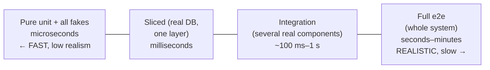
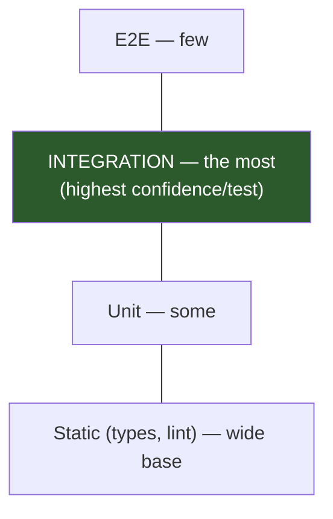
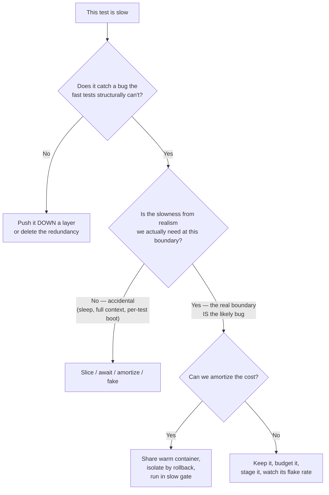

# Slow Tests — Professional

> **Category:** [Testing Anti-Patterns](../README.md) → **Slow Tests** — *a suite so slow the team stops running it before pushing.*

---

## Table of Contents

1. [Introduction](#introduction)
2. [Prerequisites](#prerequisites)
3. [The Real Trade-Off: Speed vs Realism](#the-real-trade-off-speed-vs-realism)
4. [Pyramid vs Trophy vs Honeycomb](#pyramid-vs-trophy-vs-honeycomb)
5. [Test-Time Budgets as an SLO](#test-time-budgets-as-an-slo)
6. [The Fast-vs-Flaky Tension at Scale](#the-fast-vs-flaky-tension-at-scale)
7. [CI Cost Economics](#ci-cost-economics)
8. [Amortizing an Expensive Shared Container](#amortizing-an-expensive-shared-container)
9. [Selective Testing: Run Less, Not Just Faster](#selective-testing-run-less-not-just-faster)
10. [A Decision Framework](#a-decision-framework)
11. [Common Mistakes](#common-mistakes)
12. [Test Yourself](#test-yourself)
13. [Cheat Sheet](#cheat-sheet)
14. [Summary](#summary)
15. [Further Reading](#further-reading)
16. [Related Topics](#related-topics)

---

## Introduction

> Focus: **Trade-offs & scale** — when fast-but-shallow loses to slow-but-realistic, how to budget test time like an SLO, and the economics of CI.

The earlier files treated "make it fast" as the goal. At the professional level that's too simple, because **the fastest possible suite is also the least trustworthy one** — a suite of pure unit tests with everything faked runs in two seconds and catches almost no integration bug. The real objective isn't *minimum time*; it's *maximum confidence per second of test time*, under a budget, without flakiness. That reframes every decision in this file as an optimization with a cost function, not a rule to follow.

This is also where the test-pyramid orthodoxy gets contested. Kent C. Dodds and others argue the pyramid undervalues integration tests, which often deliver the highest confidence-per-test of any layer. They're not wrong, and the senior engineer holds both ideas: the pyramid's *speed* discipline and the trophy's *realism* discipline. Knowing when each applies — and being able to defend the shape your suite actually has — is the professional skill.

> **The mental model:** a test suite is a portfolio. Each test is an asset with a *cost* (time, maintenance, flakiness risk) and a *return* (the bugs it uniquely catches × their severity). You're not minimizing cost or maximizing coverage — you're maximizing *risk-adjusted return per unit of CI time and engineer attention*, within a budget you defend like any other SLO.

---

## Prerequisites

- **Required:** Fluency with [`senior.md`](senior.md) — profiling, slicing, parallel-with-isolation, CI staging.
- **Required:** You've operated CI at a scale where its cost and queue time are line items people notice.
- **Required:** A working model of flakiness causes and quarantine (see [Flaky Tests](../02-flaky-tests/professional.md)).
- **Helpful:** Familiarity with Testcontainers / ephemeral environments, coverage-based test selection, and build-graph tools (Bazel, Nx, Gradle test-distribution).
- **Helpful:** `integration-testing`, `unit-testing-patterns`, `ci-cd-pipeline-design` skills.

---

## The Real Trade-Off: Speed vs Realism

Every test sits on a spectrum between **fast-but-shallow** and **slow-but-realistic**, and both ends fail in their own way:



- **Fast-but-shallow can be green while the system is broken.** Fake the database and your test never discovers that your SQL uses a Postgres-only operator, your `@Transactional` boundary is wrong, your JSON serializer drops a field, or your two services disagree on a contract. The fakes encode *your belief* about the boundary; if the belief is wrong, every test built on it passes anyway. This is the failure mode of an over-faked unit suite.
- **Slow-but-realistic catches those, but at a cost** that compounds: minutes of CI, maintenance of test infrastructure, and a higher flakiness surface (more real moving parts = more ways to be nondeterministic).

The professional judgment is **per boundary, not per dogma**: at boundaries where your *belief about the boundary is the likely bug* (SQL, serialization, cross-service contracts, transaction semantics), pay for realism — a fake there tests your assumption, not reality. At boundaries that are pure computation (a pricing rule, a parser, a state machine), realism buys nothing — fake the I/O and keep it fast. "Fast" and "realistic" aren't a global setting; they're a choice you make at each seam.

---

## Pyramid vs Trophy vs Honeycomb

The pyramid (Cohn/Fowler) says: *many unit, fewer integration, few e2e* — optimize for speed and a stable base. It's been the default for fifteen years, and it's right that an inverted pyramid (ice-cream cone) is a disaster.

The **testing trophy** (Kent C. Dodds) reweights toward **integration**:



The trophy's argument is empirical: an integration test that exercises a real route through a real component catches the bugs that *actually ship* — wiring mistakes, contract drift, serialization — which a unit test with mocks structurally cannot. With modern in-process slicing (Spring slices, Testcontainers reuse, `httptest`, MSW for HTTP), integration tests are far cheaper than the pyramid assumed when it was formulated, so their cost/confidence ratio improved and the "keep them few" advice weakened.

The **honeycomb** (Spotify) makes the same point for service architectures: favor *integrated* tests of a service against its real collaborators (or faithful test doubles), de-emphasize both isolated unit tests of glue code and brittle full-system e2e.

These are **not contradictions to resolve** — they're different *cost landscapes*:

| Your code is mostly… | The bug usually lives in… | Lean toward |
|---|---|---|
| Rich domain logic, algorithms | the logic | **Pyramid** — many fast unit tests on the rules |
| Glue: HTTP ↔ service ↔ DB, thin logic | the wiring / boundaries | **Trophy** — integration tests through real routes |
| A service in a mesh | inter-service contracts | **Honeycomb** — integrated tests + contract tests |

The slow-tests anti-pattern is **not** "you have integration tests." It's "your tests are slow *for no confidence gain*" — an e2e test re-verifying a rule a unit test covers, a full context booted to test one query, a real HTTP call to assert a calculation. The shape is right when **every slow test earns its time by covering a bug the fast tests structurally can't.** Defend your suite's shape with *that* test, not with a diagram.

> **The synthesis:** keep the pyramid's *speed discipline* (don't pay for layers you don't need; slice; fake pure computation) and adopt the trophy's *realism discipline* (spend your integration budget where wiring bugs live). They agree on the enemy — the inverted pyramid and the over-faked unit suite are both failures.

---

## Test-Time Budgets as an SLO

At scale you manage test time the way you manage latency: a **budget**, monitored, with an owner and an alarm. "Keep tests fast" without a number erodes silently.

Set explicit budgets per stage:

| Stage | Budget | Rationale |
|---|---|---|
| Pre-commit / local fast suite | **< 10 s** | below the patience threshold; runs constantly |
| PR fast gate (unit + sliced, parallel) | **< 2–3 min** | a coffee-sip, not a context-switch |
| Full pre-merge (incl. integration/e2e) | **< 10–15 min** | tolerable as an async pre-merge gate |
| Nightly / full matrix | hours OK | runs unattended |

Then **enforce and attribute** the budget:

- **Track p50/p95 suite duration over time**, not a single run. A creeping p95 is the early warning; a suite doesn't get slow overnight, it gets slow 200 ms at a time.
- **Fail the build on a per-test regression threshold.** A test that jumps from 50 ms to 4 s should surface in *that PR's* check, attributed to *that* change — the test-time analogue of a [performance budget](../../06-performance/01-premature-optimization-traps/professional.md). The cheap version: print the slowest 10 and diff against the baseline.
- **Make slowness a review smell.** "This adds a 6-second test for a rule a unit test covers" is a legitimate review comment, the same way "this adds an N+1 query" is.

```yaml
# Sketch: a budget gate in CI — fail if the fast suite blows its budget.
- name: fast-suite-budget
  run: |
    start=$(date +%s)
    go test -short ./...
    elapsed=$(( $(date +%s) - start ))
    echo "fast suite: ${elapsed}s (budget 60s)"
    test "$elapsed" -le 60 || { echo "::error::fast suite over budget"; exit 1; }
```

Without a budget, "fast" loses to "just one more integration test, it's only a few seconds" — repeated until the suite is the very anti-pattern this chapter is about. The budget is what converts a vague value into an enforced constraint.

---

## The Fast-vs-Flaky Tension at Scale

Speed and reliability pull against each other, and at scale you must hold both — because **a flaky suite is ignored for the same reason a slow one is.** Both stop being trusted; both stop being run. Optimizing one while degrading the other is not a win.

The specific tensions:

- **Parallelism** buys speed but multiplies the cost of any non-isolation (races surface only under concurrency). More workers = more flakiness *if* isolation is imperfect.
- **Shared fixtures** buy speed but risk order-coupling — a flake that appears only in a particular execution order.
- **Real I/O / e2e** buys realism but adds nondeterminism (network, timing, external state) — the natural home of flakes.
- **Tight timeouts** speed up failure detection but turn a slow-under-load test into a flaky one.

The professional posture isn't to pick a side; it's to **make both observable and pay down both as debt**:

- **Quarantine, don't delete or ignore.** A flaky test moves to a non-blocking quarantine lane (still run, still reported, not gating) with an owner and a deadline — not `@Disabled` forever (a disabled test is a [Boat Anchor](../../01-development/01-bad-structure/professional.md)) and not deleted (you lose the coverage).
- **Track a fl*ake rate* alongside the time budget.** A test that fails 0.5% of runs on unchanged code is a flake; surface the rate per test and treat a rising one like a rising p95.
- **Spend the isolation investment once.** DB-per-worker, port `:0`, injected clocks, transaction-rollback — these simultaneously *enable* parallel speed and *remove* the flakiness it would otherwise expose. The same money buys both, which is why [Flaky Tests](../02-flaky-tests/professional.md) and Slow Tests share a cure.

> The trap to name: "we turned off parallelism because the suite got flaky." That trades speed away to *hide* a non-isolation bug rather than fix it. The bug is still there; you've just stopped it from showing — and paid in wall-clock time to do so.

---

## CI Cost Economics

At scale, test time is money and queue time, and the math is not intuitive.

**What you actually pay for:**

- **Compute minutes** — runners are billed by the minute (or you own the machines and they have a fixed throughput). A 15-minute suite × N PRs/day × M pushes/PR is a real bill.
- **Engineer wait time** — the expensive resource. An engineer blocked on a 20-minute pipeline either context-switches (losing flow) or waits (losing time). At a loaded cost of, say, $100/hr, a 20-minute gate run 30×/day across a team costs *engineer-hours*, dwarfing the compute bill.
- **Queue time** — under contention, a 5-minute suite can take 25 minutes to *start*. Parallel sharding cuts wall-clock but consumes more concurrent runners, trading money for latency.

**The non-obvious levers:**

| Lever | Cuts | Costs |
|---|---|---|
| Parallel sharding | wall-clock, engineer wait | more concurrent runners (money) |
| Caching deps/build/test results | repeated work | cache infra + invalidation bugs |
| Selective testing (run only affected) | total work | build-graph complexity, correctness risk |
| Staging (fast gate first) | wasted slow-stage runs on doomed PRs | pipeline complexity |
| Reusing one warm container | per-test setup | shared-state isolation discipline |

The key insight: **engineer wait time usually dominates compute cost**, so spending *more* compute (parallel shards, beefier runners) to cut *wall-clock* is frequently the right trade even though it raises the cloud bill. Optimizing the cloud invoice while engineers wait 20 minutes is optimizing the cheap resource. Conversely, running a full integration matrix on every keystroke burns money for confidence you don't need until merge — hence staging.

A useful frame: **the fast gate optimizes engineer flow (latency); the slow gate optimizes confidence (coverage); caching and selection optimize the bill (throughput).** Tune each for its own metric instead of one global "make CI faster."

---

## Amortizing an Expensive Shared Container

Sometimes realism genuinely requires a real dependency — a real Postgres to catch dialect bugs, a real Kafka to catch serialization/partitioning bugs. **Testcontainers** spins these up in Docker for the test run. A container boot costs seconds; boot one *per test* and you've rebuilt the inverted pyramid in infrastructure form. The professional skill is **amortizing** that cost.

**Boot once, reuse many — safely:**

```java
// One Postgres container for the whole class (and, with reuse, across classes).
@Testcontainers
class OrderRepositoryIT {
    @Container
    static final PostgreSQLContainer<?> PG =
        new PostgreSQLContainer<>("postgres:16").withReuse(true);  // static = once per class

    @DynamicPropertySource
    static void props(DynamicPropertyRegistry r) {
        r.add("spring.datasource.url", PG::getJdbcUrl);
    }

    @Test @Transactional                     // rollback per test → isolation on the SHARED container
    void findsPendingOrders() { /* ... */ }
}
```

The amortization techniques, in order of leverage:

1. **`static` container (once per class)** instead of instance (once per test). The single biggest win — boots drop from O(tests) to O(classes).
2. **Singleton / reuse across classes.** A `static` container in a shared base class, or Testcontainers' `withReuse(true)` + Ryuk reuse, keeps *one* container alive for the whole run (and even across runs locally for fast iteration). Boots drop to O(1).
3. **Isolate on the shared container, don't re-create it.** Each test gets isolation via **transaction-rollback** or **unique schemas/keys** — *not* by booting a fresh container. This is the senior speed/isolation resolution applied to infra: share the warm engine, isolate the data.
4. **Migrate once.** Apply schema migrations to the container *once* (suite-scoped), not per test or per class.
5. **Parallelism strategy.** If tests run in parallel against one container, isolate by **schema-per-worker** or strict transaction-rollback. If that's too entangled, one *container* per worker (boot O(workers)) is still vastly better than O(tests).
6. **Run them in the slow gate.** Even amortized, container tests belong in the staged slow gate, not the every-push fast gate.

**The economics:** suppose container boot is 4 s and you have 80 integration tests across 12 classes.

| Strategy | Boots | Boot cost |
|---|---|---|
| Container per test | 80 | ~320 s |
| `static`, per class | 12 | ~48 s |
| Singleton / reuse | 1 | ~4 s |

A 320 s → 4 s reduction (80×) from *amortization alone*, before any other optimization — and isolation is preserved by rollback, not by re-creation. **When is the expensive container right?** When the bug you're hunting lives in the *real* dependency (SQL dialect, serialization, transaction semantics, partitioning) and a faithful fake would encode the very assumption that's wrong. Then realism is worth the amortized seconds. When the test only needs *some data to exist*, a fake is right and the container is waste.

---

## Selective Testing: Run Less, Not Just Faster

Beyond making each test faster, the largest-scale lever is **running fewer tests per change** — execute only the tests affected by the diff, determined by a dependency graph:

- **Build-graph tools** (Bazel, Nx, Gradle, Turborepo) know which targets a changed file feeds, and run only those tests + their reverse-dependents. A one-line change in a leaf module runs that module's tests, not the monorepo's.
- **Coverage-based test selection / Test Impact Analysis** maps each test to the production lines it executes; a diff selects the tests that cover the changed lines.
- **Caching test results**: an unchanged target with unchanged inputs reuses its prior green result instead of re-running.

The payoff is sublinear test time as the codebase grows — without it, every new test taxes every change forever. The cost is **correctness risk**: a wrong dependency graph skips a test that *would* have caught the bug. So selective testing is for the **fast PR gate** (optimize for latency, accept a small miss risk), while a **full run on `main` / nightly** (optimize for coverage, accept the time) is the backstop. You get fast feedback *and* a guarantee, at different cadences — the staging idea extended to *which tests*, not just *which stage*.

---

## A Decision Framework

When a test is slow, walk this before "just make it faster":



The branches encode the whole chapter: *redundant slow tests get pushed down; accidental slowness gets engineered away; essential realism gets amortized and staged.* Only the last leaf — irreducibly slow, genuinely necessary, un-amortizable — is a test you *keep slow on purpose*, and even that one gets a budget line and a CI stage of its own.

---

## Common Mistakes

1. **Treating the pyramid as dogma.** "Few integration tests" was costed before cheap slicing/Testcontainers. Spend your integration budget where wiring bugs actually live (the trophy's point); the enemy is *slow without confidence gain*, not integration tests.
2. **Over-faking into a green-but-broken suite.** Fakes encode your belief about a boundary; at boundaries where the belief is the likely bug (SQL, serialization, contracts), fakes test your assumption, not reality. Pay for realism *there*.
3. **No budget.** "Keep tests fast" without a number loses to "just one more slow test." Set a per-stage budget, track p95 over time, fail on regressions.
4. **Optimizing the cloud bill while engineers wait.** Engineer wait time usually dominates compute cost. Spending more compute (parallel shards) to cut wall-clock is often correct even though it raises the invoice.
5. **Booting a container per test.** Amortize: `static` (per class) → singleton/reuse (per run), isolate by rollback. 80× wins come from amortization alone.
6. **Disabling flaky tests to keep CI green / fast.** A disabled test is a Boat Anchor and a coverage hole; turning off parallelism to hide a flake trades speed for a hidden non-isolation bug. Quarantine with an owner and a deadline instead.
7. **Selective testing without a backstop.** A wrong dependency graph silently skips a catching test. Use selection for the fast gate; run the full suite on `main`/nightly.

---

## Test Yourself

1. A staff engineer says "delete the integration tests, they're slow and the unit tests cover it." When are they right, and when catastrophically wrong?
2. Your CI bill doubled after you added parallel sharding, but PR feedback dropped from 22 min to 6 min. Is this a good trade? What's the deciding factor?
3. Contrast the pyramid and the trophy. What changed in the world that strengthened the trophy's argument?
4. Container boot is 4 s; you have 60 integration tests in 10 classes. Give the boot count and cost for per-test, per-class (`static`), and singleton reuse. How is isolation preserved in the last two?
5. Why is a *fast but flaky* suite a regression rather than a win? What's the link to the slow-tests problem?
6. Design a budget-enforcement scheme: what do you measure, what gates the build, and what's the early-warning signal?
7. When is selective (affected-only) testing safe, and what's the mandatory backstop?

---

## Cheat Sheet

| Decision | Professional answer |
|---|---|
| Pyramid or trophy? | Both — pyramid's speed discipline + trophy's realism where wiring bugs live. Enemy = slow *without* confidence. |
| Fake or real at a boundary? | Real when *your belief about the boundary* is the likely bug (SQL, serialization, contracts); fake for pure computation. |
| How fast is fast enough? | A **budget per stage** (<10 s local, <3 min PR gate), tracked as p95, gated in CI. |
| Optimize cloud bill or wall-clock? | Usually wall-clock — **engineer wait dominates compute cost**. |
| Container per test? | No — `static` (per class) → singleton/reuse; isolate by rollback. Run in the slow gate. |
| Flaky after speed-up? | Quarantine + fix isolation. Never disable-forever or turn off parallelism to hide it. |
| Run every test per change? | Selective on the fast gate (build graph / TIA) + **full run on main** as backstop. |

> **One rule to remember:** *Maximize confidence-per-second under a defended budget — pay for realism only where a fake would test your assumption instead of reality, amortize the cost when you do, and never buy speed with flakiness.*

---

## Summary

- The goal isn't minimum time — it's **maximum confidence per second under a budget, without flakiness.** The fastest suite (all fakes) is also the least trustworthy; "fast" and "realistic" are chosen **per boundary**.
- **Pyramid vs trophy vs honeycomb** are different cost landscapes, not contradictions. Keep the pyramid's speed discipline and the trophy's realism discipline; the common enemy is *slow tests that gain no confidence* and over-faked suites that pass while broken.
- **Budget test time like an SLO:** explicit per-stage budgets, p95 tracked over time, regressions gated and attributed in CI.
- **Hold fast and reliable together** — both a slow suite and a flaky suite get ignored. Quarantine flakes; spend the isolation investment that buys parallel speed *and* removes flakiness.
- **CI economics:** engineer wait time usually dominates compute, so trading more compute for less wall-clock is often right; stage to avoid wasted slow runs; cache and select to cut total work.
- **Amortize expensive containers:** `static`/singleton/reuse drops boots from O(tests) to O(1), isolation by rollback — an 80× win before any other change. Use the real dependency only where its realism catches the bug.
- **Selective testing** runs only affected tests on the fast gate, with a full run on `main` as the correctness backstop.

---

## Further Reading

- **Succeeding with Agile** — Mike Cohn (2009) — the test pyramid, the model the trophy and honeycomb argue with.
- **xUnit Test Patterns** — Gerard Meszaros (2007) — **Slow Tests** and the *Shared Fixture* trade-offs underpinning container amortization.
- **Test Pyramid** & **Unit Test** — Martin Fowler — the canonical pyramid statement and the solitary/sociable distinction the realism debate turns on.
- **Write tests. Not too many. Mostly integration.** / **The Testing Trophy** — Kent C. Dodds — the integration-weighted counterargument.
- **Testing of Microservices** — Spotify Engineering — the honeycomb model for service architectures.

---

## Related Topics

- [Flaky Tests](../02-flaky-tests/professional.md) — the fast-vs-flaky tension; shared isolation cure; quarantine over disable.
- [Mystery Guest](../03-mystery-guest/professional.md) — the clarity cost when amortized shared fixtures hide test data.
- [Over-Mocking](../06-over-mocking/professional.md) — over-faking as the cause of fast-but-green-while-broken suites.
- [Performance → Premature Optimization Traps](../../06-performance/01-premature-optimization-traps/professional.md) — budgets and measure-first economics, applied to test time.
- [Bad Structure → Boat Anchor](../../01-development/01-bad-structure/professional.md) — a permanently-disabled test as dead weight.
- Architecture → Anti-Patterns — system structures that resist change.

---

## Check your understanding

1. Explain Slow Tests — Professional Level in your own words and name the problem it solves.
2. How would you apply the ideas around Table of Contents, Introduction, Prerequisites in a realistic engineering change?
3. What failure mode or misuse should you look for, and what evidence would reveal it?
4. How would you introduce and govern Slow Tests — Professional Level across teams through reversible, measurable increments?
5. What observable result would convince you that the approach improved the system?
