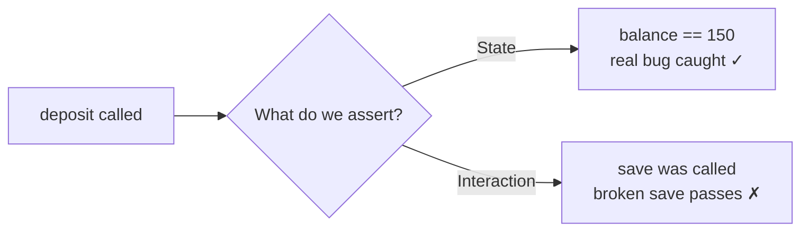

# Over-Mocking — Junior

> **Category:** [Testing Anti-Patterns](../README.md) → **Over-Mocking** — *mocking so much that the test verifies the mocks, not the behavior.*

---

## Table of Contents

1. [Introduction](#introduction)
2. [Prerequisites](#prerequisites)
3. [Glossary](#glossary)
4. [What Over-Mocking Looks Like](#what-over-mocking-looks-like)
5. [The Test That Passes While the Code Is Broken](#the-test-that-passes-while-the-code-is-broken)
6. [State Testing vs Interaction Testing](#state-testing-vs-interaction-testing)
7. [Why Over-Mocking Is Bad](#why-over-mocking-is-bad)
8. [The Junior-Level Fix](#the-junior-level-fix)
9. [A Spotting Checklist](#a-spotting-checklist)
10. [Common Mistakes](#common-mistakes)
11. [Test Yourself](#test-yourself)
12. [Cheat Sheet](#cheat-sheet)
13. [Summary](#summary)
14. [Further Reading](#further-reading)
15. [Related Topics](#related-topics)

---

## Introduction

> Focus: **What does over-mocking look like?** and **Why is it bad?**

A **mock** is a stand-in for a real object — a fake `Database`, a fake `EmailSender` — that lets you run a unit test without a real database or a real mail server. Used in moderation, mocks are essential. **Over-mocking** is what happens when you reach for one reflexively, replacing *every* collaborator until the test no longer checks what the code *does* — only which methods got *called*.

The tell is an assertion like this:

```java
verify(repo).save(any(Order.class));   // "did we call save?"
```

That line asserts the code *called* `save`. It does **not** assert that anything was actually saved, that the right data was saved, or that saving worked. If `save` is broken, the test still passes — it mocked away the only thing that could have caught the bug.

At the junior level your goal is to **recognize this shape on sight** and understand the difference between testing what the code *did to the world* (state) and testing *which calls it made* (interaction). You don't need to redesign a test suite yet — that's [`senior.md`](senior.md). You need to stop writing tests that are green theatre.

> **The mindset shift:** a test exists to catch a bug you didn't mean to write. A test that mocks the thing it's supposed to verify can't catch that bug — it just restates the code you already wrote, in a second language.

---

## Prerequisites

- **Required:** You can write a basic unit test (examples here use Go, Java, and Python).
- **Required:** You know what a *dependency* / *collaborator* is — an object your code calls to get its job done.
- **Helpful:** You've used a mocking library once (Mockito, `unittest.mock`, testify/mock, gomock) — enough to recognize `when(...).thenReturn(...)` and `verify(...)`.
- **Helpful:** You've felt the pain at least once — a test stayed green while a real bug shipped, or a test broke when you renamed a method without changing behavior. Both are over-mocking symptoms.

---

## Glossary

| Term | Definition |
|------|-----------|
| **Test double** | Any stand-in for a real collaborator in a test. The umbrella term; *mock*, *stub*, *fake*, *spy*, *dummy* are kinds of double. |
| **Stub** | A double that returns canned answers (`when(x).thenReturn(y)`). It feeds the test input; you don't assert on it. |
| **Mock** | A double you set *expectations* on and then *verify* — "this method must be called, with these args." It asserts on interactions. |
| **Fake** | A double with a real, working (but simplified) implementation — e.g. an in-memory map standing in for a database. Behaves like the real thing. |
| **State testing** | Asserting on the *observable result*: a return value, or the state the system is left in. "After this runs, the balance is 90." |
| **Interaction testing** | Asserting on *which calls were made* to collaborators. "`save` was called once with this order." |
| **Over-mocking** | Mocking so many collaborators, or verifying so many interactions, that the test asserts on the mocks instead of the behavior. |

---

## What Over-Mocking Looks Like

Here is a deposit operation and a test that mocks everything in sight.

```python
# Python — the code under test
class Wallet:
    def __init__(self, repo):
        self.repo = repo

    def deposit(self, account_id, amount):
        account = self.repo.get(account_id)
        account.balance += amount
        self.repo.save(account)
        return account.balance
```

```python
# Python — an over-mocked test
from unittest.mock import MagicMock

def test_deposit():
    repo = MagicMock()
    account = MagicMock()
    account.balance = 100
    repo.get.return_value = account

    wallet = Wallet(repo)
    wallet.deposit("acc-1", 50)

    repo.get.assert_called_once_with("acc-1")   # interaction
    repo.save.assert_called_once_with(account)  # interaction
```

Count what this test actually proves: that `deposit` calls `get` and calls `save`. That's it. It **never checks that the balance became 150.** `account` is a `MagicMock`, so `account.balance += amount` runs against a mock attribute and the test never looks at the result. The one thing a deposit must do — increase the balance by the amount — is unverified.

---

## The Test That Passes While the Code Is Broken

The danger isn't theoretical. Watch the test stay green through an obvious bug.

```python
def deposit(self, account_id, amount):
    account = self.repo.get(account_id)
    account.balance += 0          # BUG: ignores `amount`
    self.repo.save(account)
    return account.balance
```

The deposit now adds nothing. Yet the over-mocked test above **still passes** — it only checked that `get` and `save` were called, and they still are. The test gives you confidence that is entirely false. This is the defining cost of over-mocking: **green tests that don't depend on the code being correct.**

A test that asserted on the *outcome* would have failed instantly:

```python
def test_deposit_increases_balance():
    repo = FakeRepo({"acc-1": Account(balance=100)})   # a real-ish fake
    wallet = Wallet(repo)

    new_balance = wallet.deposit("acc-1", 50)

    assert new_balance == 150                  # outcome
    assert repo.get("acc-1").balance == 150    # state, after the fact
```

With `amount` ignored, `new_balance` is 100 and the assertion fails. The fake let the real logic run; the assertion checked the real result.

---

## State Testing vs Interaction Testing

These two styles answer different questions:

| | **State testing** | **Interaction testing** |
|---|---|---|
| Asks | "What is the result / final state?" | "Which methods were called?" |
| Asserts on | Return values, object state | Mock call records (`verify`, `assert_called`) |
| Survives refactor? | Yes — only behavior matters | No — breaks if the *how* changes |
| Catches a broken collaborator? | Yes — wrong result shows up | No — the call was still made |
| Junior default | **Prefer this** | Use sparingly, at real boundaries |



Interaction testing isn't *wrong* — there are cases where the only observable effect is a call to a collaborator (an email getting sent, a log line written), and there you have to verify the interaction. [`middle.md`](middle.md) draws that line precisely. The junior rule is simpler: **default to asserting outcomes; reach for `verify` only when there is no outcome to assert.**

---

## Why Over-Mocking Is Bad

Three concrete costs, all of which you'll feel within a sprint:

1. **False confidence.** As shown above, the suite stays green while real integration is broken. The test mocked away the bug. This is the most dangerous cost because it's invisible until production.

2. **Fragility — breaks on every refactor.** Because the test pins down *which calls happen in what order*, any change to the internal wiring breaks it, even when behavior is identical. Rename `save` to `persist`, or batch two saves into one, and red tests light up though nothing the user sees changed. This is the seam where over-mocking feeds [Fragile Tests](../01-fragile-tests/junior.md) — the test is coupled to the implementation, not the contract.

3. **It just restates the code.** An over-mocked test is the implementation written backwards: "the code calls `get` then `save`; the test asserts it calls `get` then `save`." It duplicates the production code in assertions, so it can't disagree with it — and a test that can't disagree with the code can't catch a mistake in it.

---

## The Junior-Level Fix

You don't need advanced technique. Three moves cover most cases:

**1. Prefer a fake over a mock for stateful collaborators.** A repository, a cache, a key-value store — these have *state*. Replace them with a small in-memory implementation that actually works, and your test can assert on real results.

```go
// Go — an in-memory fake repository (a hand-written fake, not a mock)
type FakeAccountRepo struct{ m map[string]*Account }

func NewFakeAccountRepo() *FakeAccountRepo { return &FakeAccountRepo{m: map[string]*Account{}} }
func (r *FakeAccountRepo) Get(id string) (*Account, error) {
	a, ok := r.m[id]
	if !ok {
		return nil, errors.New("not found")
	}
	return a, nil
}
func (r *FakeAccountRepo) Save(a *Account) error { r.m[a.ID] = a; return nil }
```

**2. Assert on the outcome, not the call.** After the action, check the return value or read the state back out of the fake:

```go
func TestDeposit(t *testing.T) {
	repo := NewFakeAccountRepo()
	repo.Save(&Account{ID: "acc-1", Balance: 100})
	wallet := NewWallet(repo)

	balance, err := wallet.Deposit("acc-1", 50)

	require.NoError(t, err)
	require.Equal(t, 150, balance)                 // outcome
	stored, _ := repo.Get("acc-1")
	require.Equal(t, 150, stored.Balance)          // state
}
```

**3. Don't mock value objects.** A `Money`, a `Date`, an `Account` struct — these are plain data. They have no behavior worth faking and no boundary worth isolating. Mocking them (`account = MagicMock()`) is exactly how the balance check disappeared above. Use the real value object; construct it directly.

> **Smell test:** if removing a line of production code (deleting `account.balance += amount`) does **not** turn any test red, your tests aren't checking behavior — they're checking calls.

---

## A Spotting Checklist

Run this over any test you write or review this week:

- [ ] Does the test end with `verify(...)` / `assert_called(...)` and **no** assertion on a return value or final state? → over-mocked.
- [ ] If I broke the production logic (but kept the same calls), would this test catch it? If no → over-mocked.
- [ ] Did I mock a plain data object (a value with no I/O)? → don't; use the real one.
- [ ] Did I mock something with state (repo, cache) instead of faking it? → prefer a fake so I can assert on results.
- [ ] Would renaming an internal method break this test even though behavior is unchanged? → too coupled to the implementation.

Any checked box is a test to rewrite toward outcomes.

---

## Common Mistakes

1. **Mocking everything by reflex.** New testers learn `MagicMock()`/`mock(...)` and apply it to every constructor argument. Mock only what you must isolate (real I/O at a boundary); use real objects and fakes for the rest.
2. **Asserting `verify(repo).save(...)` and stopping there.** That proves a call happened, not that the work is right. Add an assertion on the result or the resulting state.
3. **Mocking value objects.** Mocking `Money`, `Order`, `Date` throws away the real arithmetic — the exact thing the test should verify. Construct real values.
4. **Confusing "the test is green" with "the code works."** With heavy mocking, green means "the calls I scripted happened," not "the behavior is correct."
5. **Stubbing return values and then verifying the same call.** Setting `when(repo.get(id)).thenReturn(x)` *and* `verify(repo).get(id)` is testing your own stub. The stub already guaranteed the call; verifying it adds nothing.
6. **Reaching for a mock when a fake would let you assert real results.** Stateful collaborators almost always want a fake, not a mock — see the `mocking-strategies` skill.

---

## Test Yourself

1. What is the difference between **state testing** and **interaction testing**? Which should a junior reach for first?
2. A test ends with only `verify(emailService).send(any())` and no other assertion. What kind of bug could ship without this test noticing?
3. Why is mocking a **value object** like `Money` almost always wrong?
4. This test passes. Explain why it would *still* pass if `deposit` were changed to ignore its `amount` argument:
   ```python
   def test_deposit():
       repo = MagicMock(); acc = MagicMock(); acc.balance = 100
       repo.get.return_value = acc
       Wallet(repo).deposit("a", 50)
       repo.save.assert_called_once_with(acc)
   ```
5. You want to test a `Wallet` that depends on an `AccountRepository`. Should you mock the repository or fake it? Why?

---

## Cheat Sheet

| Signal | What it means | Fix |
|---|---|---|
| Test ends with only `verify(...)` | Asserts interaction, not behavior | Add an outcome/state assertion |
| Every collaborator is a `MagicMock`/`mock()` | Over-mocking; bug can hide in any of them | Use real objects + fakes; mock only real boundaries |
| `account = MagicMock()` (a value object) | Mocking data; arithmetic untested | Construct the real value object |
| Test breaks when you rename an internal method | Coupled to implementation | Assert on outcomes, not call shape ([fragile tests](../01-fragile-tests/junior.md)) |
| Stub a call, then verify the same call | Testing your own stub | Drop the redundant `verify` |
| Stateful dependency mocked | Can't assert results | Write an in-memory **fake** |

> **One rule to remember:** *Assert what the code did to the world, not which methods it called along the way.*

---

## Summary

- A **mock** is a stand-in you set expectations on and then `verify`; **over-mocking** is replacing so many collaborators (or verifying so many calls) that the test asserts on the mocks instead of the behavior.
- The signature symptom is a test that ends with `verify(repo).save(...)` and nothing else — it stays **green even when the real logic is broken** (false confidence) and breaks on harmless refactors (fragility).
- **State testing** (assert the result/final state) catches real bugs and survives refactors; **interaction testing** (assert which calls happened) is for the rare case where a call *is* the only observable effect.
- Junior fixes: prefer **fakes** over mocks for stateful collaborators, **assert outcomes** not calls, and **never mock value objects**. If deleting a line of logic turns no test red, your tests check calls, not behavior.
- Next: [`middle.md`](middle.md) — *when to mock and when not to: mock only at boundaries, fake your repositories, and never mock what you don't own.*

---

## Further Reading

- **Mocks Aren't Stubs** — Martin Fowler (2007) — the essay that named state vs interaction testing and the classicist/mockist split. Start here.
- **xUnit Test Patterns** — Gerard Meszaros (2007) — the precise taxonomy of test doubles (dummy, stub, spy, mock, fake) used throughout this topic.
- **Growing Object-Oriented Software, Guided by Tests** — Freeman & Pryce (2009) — the "mockist" school done right, and the rule *don't mock what you don't own*.
- **Unit Testing Principles, Practices, and Patterns** — Vladimir Khorikov (2020) — a modern, opinionated take favoring state-based tests at the public API.

---

## Related Topics

- [Fragile Tests](../01-fragile-tests/junior.md) — the sibling anti-pattern over-mocking most often produces.
- [Mystery Guest](../03-mystery-guest/junior.md) — another way tests stop reflecting real behavior.
- [Slow Tests](../05-slow-tests/junior.md) — the pressure that *correctly* pushes toward fakes (but can be over-applied into mocks).
- The `mocking-strategies` skill — choosing between mocks, stubs, spies, and fakes.
- The `dependency-injection` skill — how injecting collaborators makes fakes easy to substitute.

---

## Check your understanding

1. Explain Over-Mocking — Junior Level in your own words and name the problem it solves.
2. How would you apply the ideas around Table of Contents, Introduction, Prerequisites in a realistic engineering change?
3. What failure mode or misuse should you look for, and what evidence would reveal it?
4. What small example would prove that you can apply Over-Mocking — Junior Level correctly?
5. What observable result would convince you that the approach improved the system?
