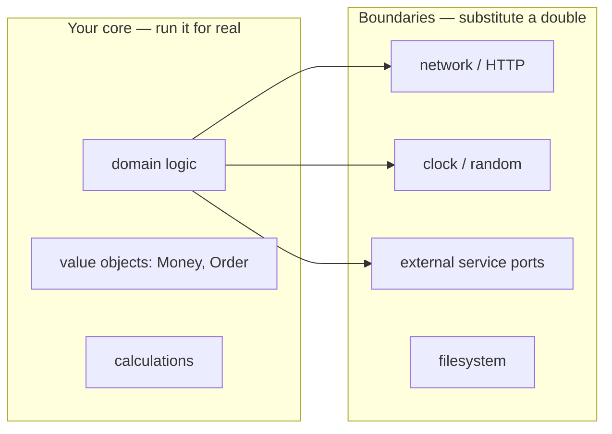

# Over-Mocking — Middle

> **Category:** [Testing Anti-Patterns](../README.md) → **Over-Mocking** — *mocking so much that the test verifies the mocks, not the behavior.*

---

## Table of Contents

1. [Introduction](#introduction)
2. [Prerequisites](#prerequisites)
3. [The One Question: Is This a Boundary?](#the-one-question-is-this-a-boundary)
4. [What to Mock — and What Not To](#what-to-mock--and-what-not-to)
5. [Don't Mock What You Don't Own](#dont-mock-what-you-dont-own)
6. [Fakes Over Mocks for Stateful Collaborators](#fakes-over-mocks-for-stateful-collaborators)
7. [Side by Side: Mock-Heavy vs Fake-Based](#side-by-side-mock-heavy-vs-fake-based)
8. [Assert Outcomes, Not Interactions](#assert-outcomes-not-interactions)
9. [Common Mistakes](#common-mistakes)
10. [Test Yourself](#test-yourself)
11. [Cheat Sheet](#cheat-sheet)
12. [Summary](#summary)
13. [Further Reading](#further-reading)
14. [Related Topics](#related-topics)

---

## Introduction

> Focus: **When to mock and when NOT to.** Mock at boundaries; fake your repositories; never mock value objects or what you don't own; assert outcomes.

[`junior.md`](junior.md) taught you to recognize over-mocking and to default to state assertions. This file gives you the decision procedure: a small set of rules that tell you, for any given collaborator, whether it deserves a mock, a fake, or no double at all.

The core realization at this level is that **"how much to mock" is not a style preference — it's a function of *what kind of thing* the collaborator is.** A network client is not a value object is not an in-memory repository, and each wants a different treatment. Over-mocking is what happens when you apply the same reflex (`mock(...)`) to all three.

> **The rule in one line:** mock at the **architectural boundaries** you own an interface for (network, clock, external services); use **real objects** for pure logic and value objects; use **fakes** for stateful collaborators you can simulate. Assert on what came out, not on which calls went in.

---

## Prerequisites

- **Required:** You can write tests with a mocking library and have felt at least one test break on a refactor that didn't change behavior.
- **Required:** Comfortable with [`junior.md`](junior.md) — state vs interaction testing, the false-confidence problem.
- **Helpful:** You've used dependency injection to pass collaborators into a constructor rather than `new`-ing them inside (the `dependency-injection` skill).
- **Helpful:** Basic familiarity with the test-double taxonomy (stub, mock, fake, spy) from the `mocking-strategies` skill.

---

## The One Question: Is This a Boundary?

Before you create any double, ask one question about the collaborator: **is it a true architectural boundary?**

A boundary is a place where your code hands control to something slow, non-deterministic, external, or with real-world side effects:

- the **network** (HTTP clients, gRPC stubs, message brokers),
- the **clock** and randomness (`time.Now()`, `rand`, UUID generation),
- **external services you own an interface for** (a payment gateway, an email sender),
- the **filesystem** and other OS resources.

Everything *inside* the boundary — your domain logic, value objects, pure calculations, in-memory data structures — is **not** a boundary and should run for real in tests.



If you find yourself mocking something in the left box, that's over-mocking. The whole point of a unit test is to exercise that left box; mocking it deletes the test's reason to exist.

---

## What to Mock — and What Not To

A decision table you can apply mechanically:

| Collaborator | Treatment | Why |
|---|---|---|
| HTTP client to a third party | **Mock/stub at *your* interface** (see next section) | Slow, flaky, external; you can't run it in a unit test |
| Clock / random / UUID | **Stub** (inject a fixed value) | Non-determinism is the only reason to isolate it |
| Email sender, SMS, push (a port you own) | **Mock** — and here verifying the call is *correct* | The send *is* the observable effect; there's no state to assert |
| Repository / DAO (stateful) | **Fake** (in-memory) | You want to assert real results; a fake gives you state to read back |
| Value object (`Money`, `Order`, `Date`) | **Real object** — never double it | It's pure data + logic; that logic is what you're testing |
| Pure function / calculator | **Real** | No I/O, no boundary; deterministic |
| Another domain service in your module | **Real** if cheap; fake if it has its own boundary | Prefer sociable tests within the core |

The two rows people get wrong most often are the last value-object row (mocked needlessly) and the repository row (mocked when it should be faked). Get those two right and most over-mocking disappears.

---

## Don't Mock What You Don't Own

This is the single most important rule in the topic, from Freeman & Pryce's *GOOS*. **Do not write mocks for third-party types** — a database driver, an SDK client, a JSON library, a framework class. Three reasons:

1. **You're guessing the contract.** When you stub `stripeClient.charge(...)` to return a fixed `Charge`, you're asserting how Stripe behaves — from memory. If the real API returns a different shape, throws a different exception, or paginates, your mock is a fiction and your test passes against a lie.
2. **It couples you to their API surface.** Mocking the third-party type bakes its method names and signatures into your tests. When they release a new major version, every mock breaks.
3. **You can't make them tell the truth.** A mock of code you don't own can never drift back toward reality, because you control the mock, not the library.

**The cure is to wrap it.** Define a thin interface *you* own that expresses what *your* code needs, implement it with a small adapter over the third-party type, and mock (or fake) *your* interface in tests.

```go
// Go — DON'T mock the Stripe SDK type. Wrap it behind YOUR port.

// Port your domain owns — expressed in your terms, not Stripe's:
type PaymentGateway interface {
	Charge(ctx context.Context, amountCents int64, token string) (ChargeID, error)
}

// Adapter — the ONLY place that touches the third-party SDK:
type stripeGateway struct{ client *stripe.Client }

func (g *stripeGateway) Charge(ctx context.Context, amountCents int64, token string) (ChargeID, error) {
	ch, err := g.client.Charges.New(&stripe.ChargeParams{ /* ... */ })
	if err != nil {
		return "", fmt.Errorf("stripe charge: %w", err)
	}
	return ChargeID(ch.ID), nil
}
```

Now tests mock `PaymentGateway` — a tiny interface you defined and understand — and an **integration test** (the `integration-testing` skill) exercises `stripeGateway` against Stripe's sandbox to prove the adapter actually matches reality. The unit tests are fast and honest; the seam the mock hides is covered by the one real test that crosses it. This division is the heart of avoiding over-mocking: *mock your own narrow ports, integration-test the adapters.*

---

## Fakes Over Mocks for Stateful Collaborators

A repository is stateful: you save, then later you get. A mock can't model that — every call returns whatever you scripted, with no memory. So mock-based repository tests devolve into scripting both sides of every interaction, which is brittle and verbose. A **fake** — a working in-memory implementation — models the state for real, so your test can *act* and then *assert on the result*.

```java
// Java — a hand-written fake repository (implements YOUR interface)
public class InMemoryAccountRepository implements AccountRepository {
    private final Map<String, Account> store = new HashMap<>();

    @Override public Optional<Account> findById(String id) {
        return Optional.ofNullable(store.get(id));
    }
    @Override public void save(Account a) {
        store.put(a.id(), a);   // real behavior: a later findById sees it
    }
}
```

A fake is written *once* and reused across the whole suite. It pays for itself immediately: tests become short, read like usage examples, and assert on real outcomes. Build it against the same interface the production adapter implements, and a **contract test** (see [`senior.md`](senior.md)) can run the *same* test suite against both the fake and the real DB to keep them honest.

---

## Side by Side: Mock-Heavy vs Fake-Based

Same scenario in three languages: a `TransferService` moves money between two accounts. Watch the mock-heavy version assert on calls (and miss the actual transfer), and the fake-based version assert on the resulting balances.

### Go

```go
// ❌ Over-mocked: verifies calls, never checks balances.
func TestTransfer_Mocked(t *testing.T) {
	repo := new(MockAccountRepo)
	from := &Account{ID: "a", Balance: 100}
	to := &Account{ID: "b", Balance: 0}
	repo.On("Get", "a").Return(from, nil)
	repo.On("Get", "b").Return(to, nil)
	repo.On("Save", mock.Anything).Return(nil)

	NewTransferService(repo).Transfer("a", "b", 30)

	repo.AssertCalled(t, "Save", from)
	repo.AssertCalled(t, "Save", to)   // green even if no money moved
}

// ✅ Fake-based: asserts on the outcome.
func TestTransfer_Fake(t *testing.T) {
	repo := NewFakeAccountRepo()
	repo.Save(&Account{ID: "a", Balance: 100})
	repo.Save(&Account{ID: "b", Balance: 0})

	err := NewTransferService(repo).Transfer("a", "b", 30)

	require.NoError(t, err)
	a, _ := repo.Get("a")
	b, _ := repo.Get("b")
	require.Equal(t, 70, a.Balance)   // real result
	require.Equal(t, 30, b.Balance)
}
```

### Java

```java
// ❌ Over-mocked
@Test void transfer_mocked() {
    AccountRepository repo = mock(AccountRepository.class);
    Account from = new Account("a", 100), to = new Account("b", 0);
    when(repo.findById("a")).thenReturn(Optional.of(from));
    when(repo.findById("b")).thenReturn(Optional.of(to));

    new TransferService(repo).transfer("a", "b", 30);

    verify(repo).save(from);
    verify(repo).save(to);   // passes regardless of the math
}

// ✅ Fake-based
@Test void transfer_changes_balances() {
    var repo = new InMemoryAccountRepository();
    repo.save(new Account("a", 100));
    repo.save(new Account("b", 0));

    new TransferService(repo).transfer("a", "b", 30);

    assertThat(repo.findById("a")).get().extracting(Account::balance).isEqualTo(70);
    assertThat(repo.findById("b")).get().extracting(Account::balance).isEqualTo(30);
}
```

### Python

```python
# ❌ Over-mocked
def test_transfer_mocked():
    repo = MagicMock()
    a, b = MagicMock(balance=100), MagicMock(balance=0)
    repo.get.side_effect = lambda i: {"a": a, "b": b}[i]

    TransferService(repo).transfer("a", "b", 30)

    assert repo.save.call_count == 2   # says nothing about balances

# ✅ Fake-based
def test_transfer_changes_balances():
    repo = InMemoryAccountRepo({"a": Account("a", 100), "b": Account("b", 0)})

    TransferService(repo).transfer("a", "b", 30)

    assert repo.get("a").balance == 70
    assert repo.get("b").balance == 30
```

In every language the mock-heavy test would pass even if `transfer` moved 0 (or moved money the wrong direction), because it only checks that `save` was called. The fake-based test pins the *behavior*: balances must end at 70 and 30. Introduce the classic transfer bug — debit and credit the *same* account — and only the fake-based tests go red.

---

## Assert Outcomes, Not Interactions

A practical reframing: when you finish writing a test, look at its last assertions and ask *"could the production logic be wrong while these still pass?"*

- `verify(repo).save(any())` → **yes**, logic can be wrong. Weak.
- `verify(repo).save(argThat(o -> o.total() == 150))` → better — it pins the *argument*, so wrong data is caught. But it's still coupled to the save call existing.
- `assertThat(repo.findById(id)).get().extracting(...).isEqualTo(150)` → **strongest** for stateful work — it reads the actual end state through a fake and doesn't care *how* you got there.

There's one legitimate exception, and it's worth stating now because [`professional.md`](professional.md) develops it: for a **side-effect-only collaborator** — a notifier, a logger, an outbound event publisher — there *is* no state to read back. The observable behavior of "an order shipped" genuinely *is* "a `ShipmentRequested` message was published with this order ID." There, verifying the interaction (with the right arguments) is the correct test, not over-mocking. The skill is telling the two apart: assert state when there's state; verify interactions only when the interaction is the whole point.

---

## Common Mistakes

1. **Mocking the database driver / SDK directly.** Wrap it behind your own interface and mock that; integration-test the adapter. Mocking what you don't own bakes a guessed contract into your suite.
2. **Mocking a repository instead of faking it.** You lose the ability to assert on results and end up scripting both sides. Write one in-memory fake and reuse it.
3. **Mocking value objects.** `Money`, `Order`, `DateRange` are pure data — construct them. Mocking them deletes the arithmetic you're testing.
4. **Verifying a getter / query.** `verify(repo).findById(id)` asserts a *query* was made — but queries have no side effects, so there's nothing to verify. Only assert interactions for *commands* with no observable result.
5. **Tightening a mock until the test mirrors the code.** If your `when/verify` script reads line-for-line like the method body, the test can't disagree with the code. Switch to a fake + outcome assertion.
6. **Skipping the integration test after wrapping.** A thin port you mock everywhere with *no* integration test over the adapter means nothing ever checks the real seam — that's where the false-confidence bug hides.

---

## Test Yourself

1. Give the rule of thumb for deciding whether a collaborator should be mocked, faked, or used real. What single question drives it?
2. Why is "don't mock what you don't own" a rule? What do you do *instead* of mocking a third-party SDK?
3. You have an `AccountRepository`. Why prefer a fake over a mock here specifically?
4. Name a collaborator for which **verifying the interaction** is the *correct* test (not over-mocking), and say why.
5. Rewrite this toward an outcome assertion (assume `OrderService` depends on an `OrderRepository`):
   ```python
   def test_place_order():
       repo = MagicMock()
       OrderService(repo).place(Order(items=[Item(price=10, qty=2)]))
       repo.save.assert_called_once()
   ```

---

## Cheat Sheet

| Collaborator kind | Use | Assert on |
|---|---|---|
| Network / HTTP to third party | Mock *your* wrapping interface | Result; integration-test the adapter |
| Clock / random | Stub a fixed value | The deterministic outcome |
| Notifier / logger / event port | **Mock + verify** (legit interaction test) | The call + its arguments |
| Repository / cache (stateful) | **Fake** (in-memory) | State read back out |
| Value object (`Money`, `Order`) | **Real** — never mock | Its computed value |
| Pure function | **Real** | Return value |

> **Two rules to live by:** *Don't mock what you don't own — wrap it.* And: *assert state when there's state; verify interactions only when the interaction is the whole point.*

---

## Summary

- The amount to mock depends on **what the collaborator is**, not on habit. Ask one question: *is this a true boundary?* Boundaries (network, clock, owned external ports) get doubles; the core runs real.
- **Don't mock what you don't own.** Wrap third-party SDKs behind a narrow interface *you* define, mock that interface in unit tests, and cover the adapter with an **integration test** so the real seam is actually verified.
- For **stateful** collaborators (repositories, caches), prefer a **fake** — a working in-memory implementation — so tests can assert on real results and read state back, instead of scripting calls.
- **Never mock value objects;** construct them. Mocking them deletes the very logic under test.
- **Assert outcomes, not interactions** — except for side-effect-only collaborators (notifier, logger, outbound port) where the call *is* the observable behavior.
- Next: [`senior.md`](senior.md) — *right-sizing doubles across a whole suite, reading "hard to test without mocking everything" as a design smell, and contract tests for the boundaries mocks hide.*

---

## Further Reading

- **Mocks Aren't Stubs** — Martin Fowler (2007) — the state-vs-interaction framing this file operationalizes.
- **xUnit Test Patterns** — Gerard Meszaros (2007) — fakes (Ch. on Fake Object), and when each double fits.
- **Growing Object-Oriented Software, Guided by Tests** — Freeman & Pryce (2009) — *don't mock what you don't own*, and "mock roles, not objects."
- **Unit Testing** — Vladimir Khorikov (2020) — "London vs Classical schools," and why he defaults to fakes + state assertions at the public API.

---

## Related Topics

- [Fragile Tests](../01-fragile-tests/middle.md) — what over-mocking produces when you verify implementation details.
- [Mystery Guest](../03-mystery-guest/middle.md) — keeping fixtures local and explicit, the cousin discipline to building fakes.
- [Slow Tests](../05-slow-tests/middle.md) — the legitimate pressure toward doubles, and where it tips into over-mocking.
- [Design → Coupling and State](../../02-design/02-coupling-and-state/senior.md) — why "needs many mocks" signals too many dependencies.
- The `mocking-strategies`, `dependency-injection`, and `integration-testing` skills — the techniques this file applies.

---

## Check your understanding

1. Explain Over-Mocking — Middle Level in your own words and name the problem it solves.
2. How would you apply the ideas around Table of Contents, Introduction, Prerequisites in a realistic engineering change?
3. What failure mode or misuse should you look for, and what evidence would reveal it?
4. Which local design trade-off would make you choose or reject Over-Mocking — Middle Level in an existing codebase?
5. What observable result would convince you that the approach improved the system?
