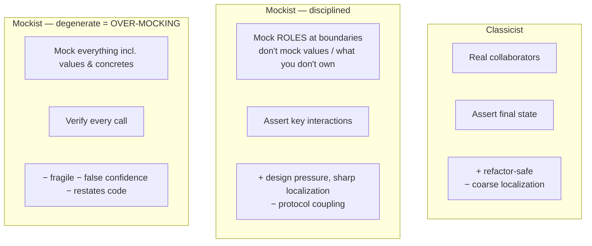
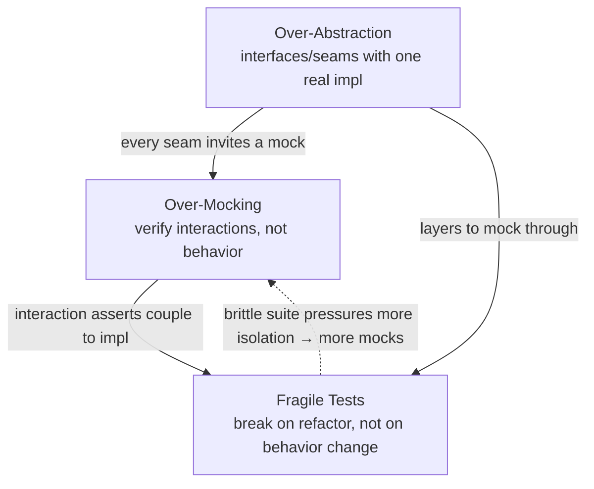

# Over-Mocking — Professional

> **Category:** [Testing Anti-Patterns](../README.md) → **Over-Mocking** — *mocking so much that the test verifies the mocks, not the behavior.*

---

## Introduction

> Focus: **The trade-offs and the deep debate.** Mockist vs classicist in full (Fowler / GOOS); when interaction testing is *genuinely* the right tool; the false-confidence economics of mocks that drift; the precise test-double taxonomy; and how over-mocking, fragile tests, and over-abstraction form one triangle.

By this level the mechanics are settled — you know *how* to write a fake, *how* to wrap a third party, *how* to push I/O to the edges. What remains is **judgment under genuine disagreement**. The mockist/classicist debate is not a beginner's confusion to be cleared up; it is a real, unresolved trade-off between *isolation* and *fidelity* that thoughtful engineers land differently on. The professional skill is holding both positions accurately, knowing the precise vocabulary, and choosing per-seam with the costs made explicit.

The throughline of this file is **honesty under time**. Every double is a claim about reality frozen at the moment you wrote it. The question that organizes everything below is: *as the system evolves, does this double tell the truth — and if it stops, who finds out?*

> **The professional frame:** over-mocking is not "too many `mock()` calls." It is **substituting verification of internal interactions for verification of behavior, in places where behavior was observable** — trading durable confidence for the illusion of isolation. The cure is not "fewer mocks" as a slogan; it's matching the double to what's observable and backing every boundary double with something that checks it against reality.

---

## Prerequisites

- **Required:** Fluent with [`senior.md`](senior.md) — design-smell reading, functional core/imperative shell, contract tests.
- **Required:** You can articulate *why* a given test uses the double it does, in terms of observability and cost — not habit.
- **Required:** You've owned a suite across a refactor and a dependency upgrade and watched where the doubles lied.
- **Helpful:** Exposure to consumer-driven contract tooling (Pact), and to property/mutation testing as confidence measures.
- **Helpful:** The `mocking-strategies`, `integration-testing`, and `dependency-injection` skills for shared vocabulary.

---

## The Test-Double Taxonomy, Used Precisely

Loose usage of "mock" is itself a source of over-mocking, because if everything is "a mock" you reach for `mock()` indiscriminately. Meszaros's taxonomy is the precise vocabulary; use it exactly.

| Double | What it is | Does it assert? | Typical use |
|---|---|---|---|
| **Dummy** | A placeholder passed to fill a parameter, never used | No | Satisfy a signature you don't exercise |
| **Stub** | Returns canned answers to calls | No (feeds *input* to the test) | Provide indirect inputs: `when(x).thenReturn(y)` |
| **Spy** | A stub that *also records* how it was called | Indirectly (you inspect the record afterward) | Capture calls/args for a later assertion |
| **Mock** | Pre-programmed with *expectations*; fails if they're not met | **Yes — built-in, on interactions** | Assert a command was issued to a collaborator |
| **Fake** | A working but simplified implementation | No (you assert on its *state*) | In-memory repo/queue; behaviourally real |

The two distinctions that matter most for over-mocking:

- **Stub vs Mock.** A *stub* answers questions and you never assert on it; a *mock* carries an expectation and *fails the test if the call doesn't happen*. The over-mocking smell is using a **mock** (with verification) where a **stub** (just feeding input) was all you needed — turning an incidental call into a test requirement.
- **Mock vs Fake.** A *mock* asserts on the *call*; a *fake* lets you assert on the *resulting state*. For stateful collaborators the fake is almost always superior because it survives refactoring (it doesn't care *how* state was reached). A **spy** is the middle ground — a recording stub you inspect, which expresses interaction checks as after-the-fact state, more robustly than a strict mock.

> **A precise reframing of over-mocking:** it is the over-use of *mocks* (expectation-bearing, interaction-verifying doubles) where *stubs*, *fakes*, or *real objects* were the correct tool. Naming the double correctly is half of avoiding the anti-pattern.

---

## Mockist vs Classicist — The Debate in Full

Fowler's *Mocks Aren't Stubs* and Freeman & Pryce's *GOOS* are the two poles. The disagreement is genuine and worth stating without strawmanning either side.

**The classicist (Detroit) position.** Use real collaborators in tests wherever practical; substitute doubles only at awkward boundaries (I/O, non-determinism). A test exercises a *cluster* of cooperating real objects and asserts on **final state**. Strength: tests verify *behavior*, are decoupled from implementation, and survive internal refactoring — you can re-shape the cluster freely as long as the outcome holds. Weakness: when a test fails, the bug could be in any of several real objects (coarser localization), and large object graphs can be awkward to set up.

**The mockist (London) position.** Drive design *outside-in* by mocking each collaborator (a "role") and specifying the conversation between objects. A test isolates *one* object and asserts on its **interactions** with mocked neighbours. Strength: pinpoint failure localization (only the unit under test runs), and the mocks *pressure the design* toward small objects with clear, tell-don't-ask roles — the act of "what do I need to mock here" surfaces missing abstractions. Weakness: tests become coupled to the *interaction protocol*; refactoring the collaboration breaks tests even when behavior is unchanged (**fragility**), and careless application slides straight into over-mocking.

The crucial, often-missed point: **the London school as its authors describe it is not over-mocking.** GOOS prescribes *mock roles, not objects*; *don't mock value objects*; *don't mock what you don't own*; *mock only at the boundaries of your own code*. Over-mocking is the **degenerate mockism** that ignores those constraints — mocking concrete classes, value types, queries, and verifying every call. Most "mockist tests are brittle" complaints are really complaints about *bad* mockist tests.



Where professionals land: **classicist by default for the domain core** (durable, behavior-focused), **disciplined mockist at boundaries** (where interaction is the observable), and a standing rule that *degenerate mockism is the anti-pattern to police in review*.

---

## When Interaction Testing Is Genuinely Right

Interaction testing is not a lesser tool — it is the **correct** tool in a specific, identifiable situation: **the unit's job is to produce a side effect that has no readable resulting state in the system under test.** In those cases there is nothing to assert *but* the interaction.

Canonical legitimate cases:

1. **Outbound ports / events.** A `ShipmentService` whose contract is "when an order ships, publish a `ShipmentRequested` event." The event leaves the system; there is no local state that captures it. Verifying the publish call *with the correct payload* is the behavior.
2. **Notifiers / mailers.** "On password reset, send a reset email to the user's address." The email's existence is the behavior; you verify `send(to=user.email, template=RESET)`.
3. **Audit / security logging that is a requirement.** When "log this access for compliance" is part of the spec, the log call is an observable contractual effect, and verifying it is appropriate.
4. **Cache write-through / invalidation as a contract.** "On update, invalidate the cache key." The invalidation call is the behavior being specified.

The discipline even here:

- **Verify arguments, not just occurrence.** `verify(mailer).send(any())` is weak — it permits an empty or misdirected email. `verify(mailer).send(eq(user.email), argThat(body -> body.contains(token)))` pins the behavior. A bare occurrence check is over-mocking even at a legitimate boundary.
- **Prefer a recording fake/spy over a strict mock** where you can. Recording the published events and asserting on the recorded list (state) is more robust than a strict mock that also enforces *ordering* and *no-other-calls* you didn't mean to require.
- **Don't over-specify.** Strict mocks that fail on *any* unexpected call ("verifyNoMoreInteractions") couple the test to the full call set and refactor-break constantly. Verify the calls the contract requires; ignore incidental ones.

```java
// Legit interaction test, done well: pin the ARGUMENTS, ignore incidentals.
@Test void shipping_an_order_requests_shipment_with_correct_payload() {
    var publisher = mock(EventPublisher.class);
    var svc = new ShippingService(new InMemoryOrderRepo(seeded("order-1")), publisher);

    svc.ship("order-1");

    var captor = ArgumentCaptor.forClass(ShipmentRequested.class);
    verify(publisher).publish(captor.capture());
    assertThat(captor.getValue().orderId()).isEqualTo("order-1");   // payload, not just "a call"
    // no verifyNoMoreInteractions(): we don't forbid incidental calls
}
```

> **The test:** is the effect you care about *readable as state* anywhere in the system under test? If yes → assert the state (classicist). If the effect *leaves* the system with no local trace → verify the interaction, with arguments (disciplined mockist). That single question resolves nearly every "mock or not" argument.

---

## The False-Confidence Cost and Its Economics

The most expensive property of over-mocking is **drift**: a double is correct the day it's written and silently wrong some months later, while the test stays green. Mocks don't fail when reality changes — they keep returning what you scripted. The cost is paid not in red tests but in **bugs that reach production past a green suite**, which is the most expensive place to find them.

A concrete failure timeline:

1. You stub `paymentClient.charge(...)` to return `Charge{status: "succeeded"}`.
2. The provider adds an async-settlement state: real charges now return `"pending"`, settling later.
3. Your code assumes `"succeeded"` means money is captured. Production now ships goods for unsettled payments.
4. **Every unit test is green.** The mock never learned about `"pending"`. The suite actively *hides* the bug because it asserts your code calls `charge` and handles the *stubbed* response — a response reality no longer sends.

The economics: a mock buys you **speed and isolation now** by **borrowing fidelity from the future**, at interest. The interest is the probability-weighted cost of a drift-induced production incident. That trade is *worth it* for fast inner-loop tests — provided you **pay down the borrowed fidelity** with a test that checks the seam against reality:

| Confidence mechanism | Speed | Fidelity | Catches drift? |
|---|---|---|---|
| Mock of external service | Fast | Frozen guess | **No** |
| In-process fake + contract test (fake vs real adapter) | Fast | High (verified) | Yes — for owned adapters |
| Integration test vs sandbox/testcontainer | Slow | Real | Yes |
| Consumer-driven contract (provider-verified) | Medium | Real, continuous | **Yes — for external services** |

The professional rule: **a mock at a boundary is only acceptable when a slower, higher-fidelity test covers the same seam.** A mocked boundary with *no* contract or integration test behind it is an unbacked promise — the textbook false-confidence configuration. The mocks aren't wrong; the *missing backstop* is.

---

## Consumer-Driven Contracts: Making Mocks Honest

For seams to services you don't own, the highest-leverage mechanism is the **consumer-driven contract (CDC)**. It converts your mock's assumptions into a verifiable artifact that the *provider* checks against their real implementation.

How it closes the loop:

1. In your tests, you interact with a **mock provider** (Pact's local stub) and declare: "when I send *this* request, I expect *this* response shape."
2. Those declarations are recorded as a **pact** (the contract) — a machine-readable record of exactly what your mock assumes.
3. The pact is published to a broker; the **provider's CI runs it against their real service**.
4. If the provider changes their API so your assumptions no longer hold, **the provider's build fails** — they learn *before* deploying that they'd break you. Your green suite is now backed by a continuously verified promise.

This is the structural answer to the drift problem for external services: the mock can no longer silently lie, because someone re-checks its assumptions against reality on every provider change. It does *not* replace your unit tests' speed — it underwrites their honesty. (See the `integration-testing` skill and `senior.md`'s contract-test layering.)

> **Boundary rule restated for externals:** never let a mock of another team's service stand alone. Pair it with a CDC, or you've shipped a frozen guess about an API you don't control.

---

## The Triangle: Over-Mocking ↔ Fragile Tests ↔ Over-Abstraction

Over-mocking rarely travels alone. It sits at the corner of a triangle, each vertex pulling in the others:



- **Over-mocking → fragile tests.** Asserting on the call protocol couples the test to *how* the code works; any refactor that changes the conversation reds the suite though behavior is identical. This is the direct line into [Fragile Tests](../01-fragile-tests/professional.md) — same root, different face.
- **Over-abstraction → over-mocking.** Every speculative interface (a port with one implementation, introduced "for flexibility") is a *mock magnet*: it exists to be substituted, so tests substitute it, and now you're mocking a seam that bought nothing. Over-mocking and over-abstraction are mutually reinforcing — abstractions added for testability you don't need create mocks for behavior you could have tested directly. (See [Over-Engineering / Speculative Generality](../../01-development/03-over-engineering/professional.md).)
- **Fragile tests → more mocking.** A brittle, slow suite makes engineers retreat into ever-more-isolated unit tests (more mocks) to get *something* fast and green — accelerating the spiral.

Breaking the triangle is a single move applied at the right corner: **delete abstractions that exist only to be mocked, assert on behavior instead of interactions, and reserve mocks for real boundaries backed by contract tests.** Fix one vertex and the other two relax.

---

## A Decision Framework You Can Defend

Put in front of any test, this resolves the double choice and is defensible in review:

1. **Is the collaborator a value object or pure logic?** → Use it **real**. (No double. Ever.)
2. **Is the effect observable as state** in the system under test (return value, fake's state, DB row)? → Assert **state** with a real object or **fake**. (Classicist.)
3. **Does the effect leave the system with no local trace** (event, email, external call)? → **Verify the interaction with arguments** — prefer a recording fake/spy over a strict mock. (Disciplined mockist.)
4. **Is the collaborator a boundary you don't own?** → **Wrap it**; mock/fake *your* port; back the seam with an **integration test** (owned adapter) or **consumer-driven contract** (external service).
5. **Did you need to mock a chain or many collaborators to get here?** → Stop. That's a **design smell** ([coupling](../../02-design/02-coupling-and-state/senior.md)). Fix the production code first.
6. **Could the production logic be wrong while this test stays green?** → If yes and the effect *was* observable, you've over-mocked. Re-assert on the outcome.

> The framework reduces to one sentence: **assert on what's observable, double only at real boundaries, and never let a boundary double stand without a higher-fidelity test behind it.**

---

## Common Mistakes

1. **Using "mock" to mean every double.** Imprecision breeds over-use. Distinguish dummy/stub/spy/mock/fake and pick the *least* powerful one that does the job — usually a stub or fake, not a mock.
2. **Verifying occurrence without arguments** at a legitimate boundary. `verify(mailer).send(any())` is still over-mocking — it permits a misdirected, empty email. Pin the payload.
3. **`verifyNoMoreInteractions` everywhere.** Forbidding incidental calls couples the test to the full call set; it reds on harmless refactors. Verify only the contractually required calls.
4. **Mocking an external service with no CDC/integration backstop.** A frozen guess about an API you don't control — the canonical false-confidence setup. Add a consumer-driven contract.
5. **Introducing an interface so a test can mock it,** when a real object or fake would test the behavior directly. That's the over-abstraction → over-mocking link; the seam buys nothing.
6. **Treating the mockist/classicist debate as solved.** It's a real trade-off (isolation vs fidelity). Choosing dogmatically — "always mock" or "never mock" — is how you get either brittle suites or untestable ones.
7. **Mocking to dodge a design smell.** When a unit needs many mocks, the fix is fewer dependencies, not better mocks. Mocks should never be the workaround for [coupling](../../02-design/02-coupling-and-state/senior.md).

---

## Test Yourself

1. Define dummy, stub, spy, mock, and fake — and state which distinction is most central to diagnosing over-mocking.
2. Steelman both the classicist and the mockist positions, then say where each genuinely fails.
3. Why is "the London school is brittle" usually a critique of *bad* mockist tests rather than the school itself? Cite two GOOS rules that prevent the brittleness.
4. Give the one-sentence test that decides whether to assert state or verify an interaction.
5. Explain mock **drift** with a concrete timeline, and name the *specific* test that makes a mocked external boundary honest.
6. Why are over-mocking and over-abstraction mutually reinforcing? Describe the single move that relaxes both.
7. A legitimate interaction test verifies `publisher.publish(event)`. What two disciplines keep it from sliding into over-mocking?

---

## Cheat Sheet

| Situation | Right tool | Backstop |
|---|---|---|
| Value object / pure logic | Real object | — |
| Effect readable as state | Real object or **fake**, assert state | — |
| Effect leaves system (event/email) | Verify interaction **+ args**, or recording fake | — |
| Owned boundary adapter | Mock/fake your port | **Integration test** of adapter |
| External service you don't own | Mock your wrapper | **Consumer-driven contract** |
| Needed many mocks to set up | — | **Refactor the design** (coupling smell) |

> **Professional rules:** *Name the double precisely and pick the weakest one that works.* *A boundary double is only honest if a higher-fidelity test backs the same seam.* *Assert on what's observable; verify interactions only when nothing else is.*

---

## Summary

- Use the **taxonomy precisely** — dummy, stub, spy, mock, fake. Over-mocking is over-using *mocks* (interaction-verifying) where *stubs*, *fakes*, or real objects belonged. Picking the weakest sufficient double prevents most of it.
- The **mockist/classicist debate is a real trade-off** (isolation vs fidelity), not a confusion. Disciplined mockism (mock roles at boundaries, never values, never what you don't own) is sound; **degenerate mockism is the anti-pattern**. Default classicist for the core, disciplined mockist at effect-only boundaries.
- **Interaction testing is genuinely right** when an effect leaves the system with no local state — outbound ports, mailers, required audit logs. Even then: **verify arguments, not occurrence**, and don't over-specify.
- The defining cost is **false confidence from drift**: mocks freeze a guess and stay green when reality moves on. A boundary mock is only acceptable when a **higher-fidelity test** (integration or **consumer-driven contract**) covers the same seam.
- Over-mocking, **fragile tests**, and **over-abstraction** form a self-reinforcing triangle; break it by deleting mock-only abstractions and asserting on behavior. When a test needs many mocks, the fix is in the **design**, not the test.

---

## Further Reading

- **Mocks Aren't Stubs** — Martin Fowler (2007) — the definitive classicist-vs-mockist treatment; read it twice.
- **Growing Object-Oriented Software, Guided by Tests** — Freeman & Pryce (2009) — disciplined mockism: mock roles not objects, don't mock what you don't own, outside-in TDD.
- **xUnit Test Patterns** — Gerard Meszaros (2007) — the dummy/stub/spy/mock/fake taxonomy this file uses.
- **Unit Testing Principles, Practices, and Patterns** — Khorikov (2020) — the modern classicist case; mocks and false fragility; observable behavior vs implementation details.
- **Consumer-Driven Contracts: A Service Evolution Pattern** — Ian Robinson / Fowler (martinfowler.com) and the **Pact** docs — making cross-service mocks honest.
- **Mockito docs — "How not to mock"** and **"don't mock types you don't own"** — pragmatic guardrails distilled into a library's guidance.

---

## Related Topics

- [Fragile Tests](../01-fragile-tests/professional.md) — the corner of the triangle over-mocking pulls hardest on.
- [Mystery Guest](../03-mystery-guest/professional.md) — another way tests lose touch with observable behavior.
- [Slow Tests](../05-slow-tests/professional.md) — the speed pressure that justifies doubles, and where it over-reaches.
- [Development → Over-Engineering](../../01-development/03-over-engineering/professional.md) — speculative abstraction, the mock magnet.
- [Design → Coupling and State](../../02-design/02-coupling-and-state/senior.md) — the design smell behind "needs many mocks."
- Architecture → Anti-Patterns — boundary and dependency smells at the system level.
- The `mocking-strategies`, `integration-testing`, and `dependency-injection` skills.

---

## Check your understanding

1. Explain Over-Mocking — Professional Level in your own words and name the problem it solves.
2. How would you apply the ideas around Table of Contents, Introduction, Prerequisites in a realistic engineering change?
3. What failure mode or misuse should you look for, and what evidence would reveal it?
4. How would you introduce and govern Over-Mocking — Professional Level across teams through reversible, measurable increments?
5. What observable result would convince you that the approach improved the system?
