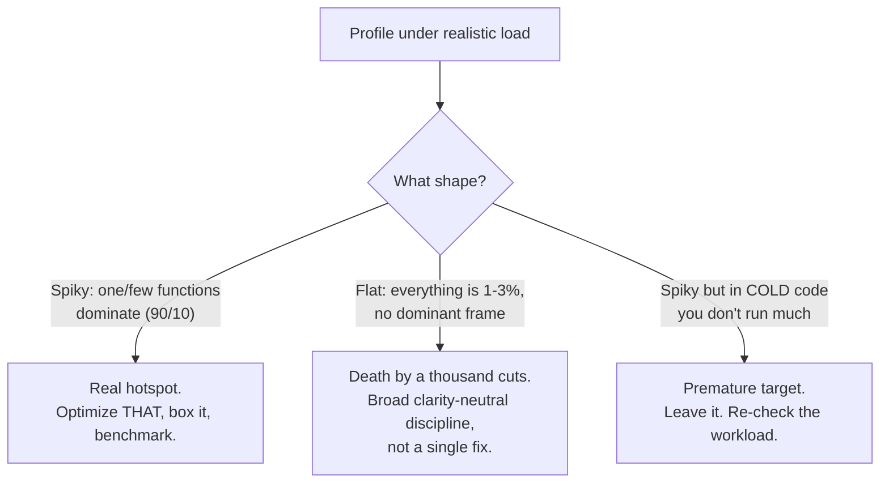

# Premature Optimization Traps — Professional

> **Category:** [Performance Anti-Patterns](../README.md) → **Premature Optimization Traps** — *code twisted for speed that was never measured and rarely matters.*

---

## Table of Contents

1. [Introduction](#introduction)
2. [Prerequisites](#prerequisites)
3. [Two Opposite Failures, Two Different Cures](#two-opposite-failures-two-different-cures)
4. [Death by a Thousand Cuts](#death-by-a-thousand-cuts)
5. [The Real Cost of Premature Optimization](#the-real-cost-of-premature-optimization)
6. [The Compiler and JIT Already Did It](#the-compiler-and-jit-already-did-it)
7. [Benchmarking Pitfalls That Make You Lie to Yourself](#benchmarking-pitfalls-that-make-you-lie-to-yourself)
8. [Performance Budgets and SLO-Driven Optimization](#performance-budgets-and-slo-driven-optimization)
9. [A Combined Worked Example](#a-combined-worked-example)
10. [Common Mistakes](#common-mistakes)
11. [Test Yourself](#test-yourself)
12. [Cheat Sheet](#cheat-sheet)
13. [Summary](#summary)
14. [Further Reading](#further-reading)
15. [Related Topics](#related-topics)

---

## Introduction

> Focus: **The hard line and the opposite failure** — when a flat profile means *everything* is slow (death by a thousand cuts), why the compiler already did your micro-opts, how benchmarks lie if you let them, and how SLOs and perf budgets decide what's worth optimizing.

Every prior level pushed one direction: *don't optimize without measuring.* This level adds the counter-truth that makes the advice professional rather than dogmatic. There are **two failure modes**, and they have **opposite cures**:

1. **Premature optimization** — a single function twisted for unmeasured speed. Cure: stop; profile; leave it clear.
2. **Death by a thousand cuts** — *every* function 2% wasteful, so the profile is flat and the whole program is slow with no hotspot to fix. Cure: a broad discipline of clarity-neutral efficiency, applied everywhere, *because* no single fix exists.

Confuse them and you prescribe the wrong medicine: you tell someone with a flat-profile system to "find the hotspot" (there isn't one), or you let a real hotspot fester because "we don't do premature optimization." The professional reads the *profile's shape* — spiky or flat — and picks the cure.

This level also closes the loop on rigor: the compiler/JIT already performs most micro-optimizations (so hand-doing them is usually worse than useless), and benchmarks routinely lie via dead-code elimination, warm-up, and noise — which means a "measured" optimization can still be an artifact. Honest numbers are a discipline, not a default.

---

## Prerequisites

- **Required:** Fluent with [`senior.md`](senior.md) — you exercise the design-vs-optimization and box-the-hot-path judgments reflexively.
- **Required:** You can read assembly/bytecode at a survey level and interpret `-gcflags=-m`, `-XX:+PrintInlining`, and a JMH/`benchstat` report including its variance.
- **Required:** You own or have owned a service with latency/throughput SLOs and a cost budget.
- **Helpful:** Working knowledge of a managed runtime's optimizer (escape analysis, inlining, devirtualization, vectorization) and the CPU's (branch prediction, caches). The `profiling-techniques`, `memory-leak-detection`, and `big-o-analysis` skills.

---

## Two Opposite Failures, Two Different Cures

The decision pivots entirely on the **shape of the profile**.



| | Premature optimization | Death by a thousand cuts |
|---|---|---|
| **Profile shape** | (the code isn't even hot — no profile was taken) | **Flat** — no dominant frame |
| **The error** | Twisting one cold function for unmeasured speed | A thousand small wastes, each negligible, summing to slow |
| **Where time goes** | Nowhere that matters | Smeared evenly across everything |
| **Cure** | Stop; profile; keep it clear | Broad efficiency discipline; sometimes a systemic fix (allocator, framework, data layout) |
| **What fails** | "Optimize the slow function" — there's a hotspot | "Find the hotspot" — there *isn't* one |

The trap for professionals is applying the premature-optimization gospel to a thousand-cuts system. "We don't micro-optimize" is correct advice for a spiky profile and *actively harmful* for a flat one, where the only cure *is* a pervasive habit of not wasting cycles. Knuth's "97% / 3%" assumes a spiky profile; a flat profile is the case his quote doesn't cover.

---

## Death by a Thousand Cuts

A flat profile is the signature: you open the flame graph expecting a tall tower and find a flat plateau — `json.Marshal` 3%, `time.Format` 2%, a defensive `copy()` 2%, a `fmt.Sprintf` in a log line 2%, an allocation in a hot accessor 1.5%, repeated thirty times. No single fix helps; the slowness is *systemic*.

```go
// Each line is individually defensible; together they cost 30% across a hot loop.
func handle(r Request) Response {
	id := fmt.Sprintf("%d", r.ID)            // Sprintf for an int → strconv.Itoa is free + faster
	tags := append([]string{}, r.Tags...)    // defensive copy nobody mutates
	body := strings.ToLower(strings.TrimSpace(r.Body)) // two passes, two allocations
	log.Printf("handling %s", id)            // formats even when log level filters it out
	m := map[string]bool{}                   // fresh map per call for a 3-element set
	for _, t := range tags { m[t] = true }
	// ... and twenty more sites just like this across the codebase ...
}
```

**Why it's the opposite of premature optimization:** here, *each* clarity-neutral fix is free and correct — `strconv.Itoa` reads as well as `Sprintf`; dropping a copy nobody mutates is pure subtraction. The waste came from the *over-corrected* habit ("don't optimize, just write the easy thing"), and the cure is the discipline `senior.md` prescribed: **take every clarity-neutral win, always.** None of these is a measurement-gated micro-opt; they're competent defaults that were skipped.

**The diagnostic that distinguishes the two failures:** if optimizing your single biggest profile frame to *zero* would still leave you over budget (Amdahl says the ceiling is small), you have a thousand-cuts problem, not a hotspot. Sum the top 20 frames — if no handful dominates, stop hunting for a hotspot and start a broad clarity-neutral sweep, or look for a *systemic* lever (a framework swap, a different allocation strategy, a data-layout change) that moves all the small frames at once.

---

## The Real Cost of Premature Optimization

It's not just "wasted effort." Premature optimization actively damages a codebase in ways that compound:

- **Bugs.** The clever version is harder to get right. Hand-rolled pools leak or hand back live objects; bit tricks have off-by-one and sign-extension errors; caches serve stale data. You traded a clarity win for a *correctness liability* — on code that wasn't hot.
- **Blocked refactors.** Optimized code is rigid. The hand-unrolled loop can't be changed without re-deriving the unroll; the inlined helper can't be reused. Premature optimization *freezes* the design exactly where it should stay fluid (most code).
- **Maintenance tax forever.** Every reader pays the comprehension cost; every change risks breaking the optimization silently (no benchmark guard) or being blocked by it.
- **Misdirected attention.** Time spent optimizing the 97% is time *not* spent on the 3% that's actually slow — so premature optimization makes systems slower in aggregate by stealing the budget from where it would help.
- **False confidence.** "We optimized it" becomes folklore; nobody re-checks; the real hotspot (often introduced later) goes unexamined because the team believes performance was "handled."

The asymmetry is brutal: the *upside* of a premature optimization is, by definition, an unmeasured and usually negligible speed-up on cold code. The *downside* is bugs, rigidity, and stolen attention. You're risking real costs for an imaginary gain — which is why Knuth called it the root of (most) evil.

---

## The Compiler and JIT Already Did It

Most micro-optimizations people write by hand are ones the compiler or JIT performs automatically — and usually *better*, because it has the full cost model and won't make an arithmetic mistake. Hand-doing them frequently *prevents* the optimizer's superior version. Prove it on your own code:

### Go — `-gcflags=-m` shows inlining and escape analysis

```bash
go build -gcflags='-m -m' ./...
# ./x.go:12:6: can inline isEven           <- the compiler inlines your helper FOR you
# ./x.go:20:13: inlining call to isEven
# ./x.go:8:9:  &buf does not escape         <- escape analysis stack-allocates; no manual pool needed
```

If the compiler already inlines `isEven`, hand-inlining it bought nothing and cost a name. If escape analysis already stack-allocates `buf`, your object pool is pure liability.

### Java — JIT inlining and vectorization logs

```bash
java -XX:+UnlockDiagnosticVMOptions -XX:+PrintInlining -XX:+PrintCompilation -jar app.jar
#   @ 12  Helper::isEven (4 bytes)   inline (hot)     <- C2 inlined it after warm-up
# The JIT also auto-vectorizes counted loops (SuperWord); manual unrolling often DEFEATS it
# by producing a shape the vectorizer no longer recognizes.
```

The JVM's C2 compiler inlines hot methods, eliminates bounds checks it can prove safe, devirtualizes monomorphic calls, and vectorizes simple loops — *after* warm-up. A hand-unrolled loop frequently benchmarks *slower* under C2 than the clean one, because the clean one gets SuperWord vectorized and the unrolled one doesn't.

### Python — the exception that proves the rule

CPython has no JIT (pre-3.13's experimental one) and does *not* perform these optimizations — which is why the right move in Python is almost never a hand micro-opt either. It's to **move the hot loop into C** (NumPy, a vectorized library, a native extension) or to a JIT (PyPy). Hand-tuning Python bytecode is the most premature optimization of all: tiny wins, large readability cost, and the real lever (drop to C, or don't loop in Python) is elsewhere.

> **The professional stance:** before hand-optimizing, check what the optimizer already does. On Go/JVM the answer is usually "the thing you were about to do, and better." Fighting the optimizer is a special, expert-level case — done only with a benchmark proving the manual version actually wins on *this* compiler version (and re-checked when the toolchain upgrades, because optimizers improve and your manual version can become a regression).

---

## Benchmarking Pitfalls That Make You Lie to Yourself

A "measured" optimization is only as honest as the measurement. These pitfalls turn a benchmark into a lie — and a lie that *confirms* a premature optimization is worse than no benchmark, because now it has a number to defend it.

| Pitfall | What goes wrong | The fix |
|---|---|---|
| **Dead-code elimination** | The optimizer deletes work whose result is unused; you benchmark *nothing* and it looks infinitely fast. | Consume the result: JMH `Blackhole`, Go `runtime.KeepAlive`/assign to a package sink, return it. |
| **Constant folding** | Inputs known at compile time get precomputed; you measure the answer, not the work. | Feed inputs the compiler can't see (from a field, a file, a `b.N`-indexed slice). |
| **No warm-up (JVM)** | First iterations run interpreted/C1 before C2 kicks in; you measure the cold path. | JMH warm-up iterations (`-wi 5`); never `nanoTime` a raw loop on the JVM. |
| **One run = noise** | A single number includes GC, scheduling, turbo/throttle jitter. | Many runs + distribution: `benchstat` p-values, `pyperf`, JMH forks (`-f 3`). |
| **Measuring noise as signal** | A 2% "win" inside a 5% variance band is nothing. | Trust `benchstat`'s `~ (p>0.05)`; report the variance, not just the mean. |
| **Unrealistic input/scale** | Fast at n=10, the opposite at n=10⁶ (or vice versa). | Benchmark at production scale and shape. |
| **Co-located runs** | Old and new measured under different machine load. | Interleave runs; use `benchstat` on `-count=10` of each, ideally on a quiesced machine. |

```go
// WRONG: dead-code-eliminated. `hash(x)` is computed and discarded → ~0 ns, a lie.
func BenchmarkHash(b *testing.B) {
	for i := 0; i < b.N; i++ { hash(data) }
}

// RIGHT: the result escapes to a package-level sink, so the work can't be deleted.
var sink uint64
func BenchmarkHash(b *testing.B) {
	var h uint64
	for i := 0; i < b.N; i++ { h = hash(data) }
	sink = h
}
```

```text
# benchstat with -count=10 is the arbiter. This change is NOISE — do not ship it as a win:
                │   old.txt   │              new.txt              │
                │   sec/op    │   sec/op     vs base              │
Encode-10         48.10n ± 3%   47.20n ± 4%   ~ (p=0.243 n=10)
#                                             ^^^ ~ = no significant difference
```

The rigor here is what separates a justified micro-opt (`senior.md`) from a premature one wearing a benchmark as a disguise. If the measurement isn't honest, "I measured it" is just premature optimization with a footnote.

---

## Performance Budgets and SLO-Driven Optimization

The professional answer to "is this worth optimizing?" is not a feeling — it's a **budget** derived from an SLO. This converts the entire premature-optimization question into arithmetic.

- **Define the SLO.** "p99 latency ≤ 200ms," "this batch finishes in 1h," "≤ $0.002 per request." Now "fast enough" is a number, and optimization has a finish line — the cure for the *other* failure mode of optimizing forever.
- **Budget the path.** Allocate the SLO across the request's stages: 50ms DB, 30ms serialization, 100ms business logic, 20ms slack. A stage *under* its budget is **off-limits to optimization** — touching it is premature by definition, no matter how clever the idea.
- **Optimize only the over-budget stage**, and only until it's back under budget — then **stop**. Beyond the budget, further optimization is premature even with a profile, because the profile says "hot" but the budget says "we don't need it faster."
- **Guard the budget in CI.** A benchmark or load test that fails the build when a stage blows its budget catches *regressions* (the inverse problem) and tells you when optimization is actually required — replacing guesswork with a tripwire.

```text
Request budget (SLO p99 = 200ms):
  parse        15ms   [budget 20ms]  ✓ under  → DO NOT optimize (premature)
  db.fetch     90ms   [budget 60ms]  ✗ OVER   → optimize THIS, to 60ms, then stop
  serialize    25ms   [budget 30ms]  ✓ under  → leave it clear
  ----------------------------------------------------------------
  the only legitimate optimization target is db.fetch, until it's ≤ 60ms.
```

SLO-driven optimization is the institutional cure for both failures at once: it forbids optimizing under-budget stages (kills premature optimization) and forces optimizing over-budget ones (kills the "we never optimize" over-correction). The budget, not anyone's instinct, decides.

---

## A Combined Worked Example

A payments service misses its p99 = 150ms SLO, sitting at 240ms. Two engineers propose opposite things.

**Engineer A** (premature): *"I'll replace the `BigDecimal` money math with scaled `long` arithmetic and hand-unroll the fee loop — `BigDecimal` is notoriously slow."* No profile.

**Engineer B** (disciplined): *"Profile first."* The flame graph (async-profiler) shows:

```text
  42%  TLS handshake on a NEW connection per request   (no connection pooling)
  31%  JSON deserialization of a 2MB response we use 3 fields of
  11%  db round-trips (N+1 over line items)
   2%  BigDecimal fee math          <-- Engineer A's target
   1%  the fee loop                 <-- Engineer A's other target
```

The verdict writes itself. Engineer A's `BigDecimal`→`long` rewrite targets **2%** — and would introduce *rounding bugs in money*, the worst place to have them. Even made free, Amdahl caps the win at ~2%; the service stays at ~235ms. That is a textbook premature optimization: unmeasured, clarity-and-correctness-costing, on a cold path.

Engineer B budgets and fixes the over-budget stages, in order, each guarded by a benchmark:

```text
  fix connection pooling (reuse TLS)        240ms → 150ms   (-90ms, the 42%)
  stream-parse only the 3 needed fields      150ms → 120ms   (-30ms, the 31%)
  batch the line-item queries (kill N+1)     120ms → 105ms   (-15ms, the 11%)
  ---------------------------------------------------------------
  p99 = 105ms ≤ 150ms SLO → STOP. BigDecimal math is never touched.
```

The lessons, all professional-level:

1. **Profile shape chose the work.** Spiky, in *hot* code — the opposite of where Engineer A looked.
2. **The compiler/correctness argument settles `BigDecimal`.** It's 2%; the JIT can't fix the cold path's irrelevance, and `long` money math risks correctness. Not a candidate, ever, until the budget says so.
3. **The SLO is the stop sign.** At 105ms ≤ 150ms, *all* further optimization — including any real hotspot — is now premature. You ship and move on.

---

## Common Mistakes

1. **Prescribing the hotspot cure for a flat profile.** "Find the slow function" fails when there isn't one. A flat profile needs a broad clarity-neutral sweep or a systemic lever, not a hotspot hunt.
2. **Prescribing "don't optimize" for a thousand-cuts system.** The over-corrected gospel makes flat-profile systems *worse*; the cure there is pervasive efficiency, applied everywhere, by default.
3. **Hand-optimizing what the compiler already does.** Inlining, bounds-check elision, vectorization, escape-analysis stack allocation — check `-gcflags=-m` / `PrintInlining` before fighting the optimizer, and re-check after toolchain upgrades.
4. **Shipping a benchmark that lies.** Dead-code elimination and missing warm-up produce "infinite speed-ups." A dishonest benchmark defending a premature opt is worse than none.
5. **Optimizing an under-budget stage.** If it meets its SLO budget, touching it for speed is premature *by definition* — even with a profile showing it's "hot."
6. **Never stopping.** Without an SLO, optimization has no finish line and you over-invest. The budget is the stop sign; respect it.

---

## Test Yourself

1. You profile and the flame graph is flat — no frame over 3%. Which failure is this, what does *not* work as a cure, and what does?
2. Why is hand-unrolling a counted loop on the JVM often a *regression*? Name the compiler feature it defeats and the flag that shows it.
3. Give three real costs of a premature optimization beyond "wasted effort," and explain the upside/downside asymmetry that makes the trade irrational.
4. A benchmark shows your change is infinitely fast (≈0 ns). What almost certainly happened, and what are the Go and JMH fixes?
5. A stage runs at 15ms with a 30ms budget. A profiler shows a hot function inside it. Should you optimize it? Why or why not?
6. In the combined example, the JIT can inline and vectorize Engineer A's fee loop. Why doesn't that rescue the proposal?

---

## Cheat Sheet

| Symptom / question | Diagnosis | Action |
|---|---|---|
| Flat profile, no dominant frame | Death by a thousand cuts | Broad clarity-neutral sweep or systemic lever — not a hotspot hunt |
| Spiky profile in hot code | Real hotspot | Optimize it, box it, benchmark-guard it |
| Spiky profile in cold code | Premature target | Leave it; re-check the workload |
| "It's faster" / ≈0 ns benchmark | DCE / no warm-up / 1 run | `Blackhole`/`KeepAlive`, warm-up, `benchstat` p-value |
| About to hand-inline/unroll | Compiler likely does it | `-gcflags=-m`, `PrintInlining` — check first |
| Stage under its SLO budget | Premature by definition | Don't touch it; optimize the over-budget stage, then stop |

> **One rule to remember:** *Read the profile's shape and respect the budget. Spiky-and-hot → fix and box it; flat → sweep broadly; under-budget → hands off. The numbers decide, not the cleverness.*

---

## Summary

- There are **two opposite failures**: premature optimization (one cold function twisted for unmeasured speed) and **death by a thousand cuts** (a flat profile where everything is slightly wasteful). They have **opposite cures**, and the *profile's shape* tells you which.
- A flat profile breaks the 90/10 assumption Knuth's quote relies on; its cure is **pervasive clarity-neutral efficiency**, applied everywhere — the very discipline the over-corrected "never optimize" reading skips.
- Premature optimization's real costs are **bugs, blocked refactors, maintenance tax, and stolen attention** — real downsides traded for an imaginary, unmeasured gain.
- The **compiler/JIT already performs** inlining, bounds-check elision, vectorization, and escape-analysis stack allocation; check `-gcflags=-m` / `PrintInlining` before fighting it — hand-doing it often regresses.
- **Benchmarks lie** via dead-code elimination, constant folding, missing warm-up, and noise; `benchstat`/JMH rigor (Blackholes, forks, p-values) is what keeps a "measured" optimization from being premature optimization with a fake footnote.
- **SLO-driven perf budgets** make the whole question arithmetic: optimize only the over-budget stage, only until it's under budget, then stop. The budget forbids both failures at once.
- You've completed the Premature Optimization Traps suite. Continue to the sibling anti-pattern a profiler most often points you *to*: [N+1 in Code](../02-n-plus-one-in-code/junior.md).

---

## Further Reading

- **Structured Programming with `go to` Statements** — Donald Knuth (1974) — the full efficiency section; the 97%/3% framing assumes a spiky profile.
- **Programming Pearls** — Jon Bentley (2nd ed., 1999) — estimation and the discipline of optimizing only what the budget requires.
- **Systems Performance** — Brendan Gregg (2nd ed., 2020) — flame-graph shapes, the USE method, and methodology for flat-vs-spiky diagnosis.
- **The Art of Computer Programming, Vol. 1–3** — Knuth — when the 3% genuinely matters, this is where the real algorithmic work lives.
- **JMH samples** and **Go's `testing` / `benchstat` docs** — the canonical rigor for honest microbenchmarks.

---

## Related Topics

- [Premature Optimization → senior.md](senior.md) — the judgment layer beneath these professional hard lines.
- [Premature Optimization → middle.md](middle.md) — the profiling/benchmarking workflow these pitfalls refine.
- [N+1 in Code](../02-n-plus-one-in-code/professional.md) — the spiky hotspot the combined example actually fixed.
- [Unnecessary Allocation](../03-unnecessary-allocation/professional.md) — a frequent ingredient in flat, thousand-cuts profiles.
- [Wrong Data Structure](../04-wrong-data-structure/professional.md) — a systemic lever that can move many small frames at once.
- [Over-Engineering → senior.md](../../01-development/03-over-engineering/senior.md) — speculative "for scale" perf work; the same evidence-first bar applies.
- Architecture → Anti-Patterns — system-level premature scaling and its budgets.
- The `profiling-techniques`, `memory-leak-detection`, and `big-o-analysis` skills — the measurement foundation under every decision here.

---

## Check your understanding

1. Explain Premature Optimization Traps — Professional Level in your own words and name the problem it solves.
2. How would you apply the ideas around Table of Contents, Introduction, Prerequisites in a realistic engineering change?
3. What failure mode or misuse should you look for, and what evidence would reveal it?
4. How would you introduce and govern Premature Optimization Traps — Professional Level across teams through reversible, measurable increments?
5. What observable result would convince you that the approach improved the system?
