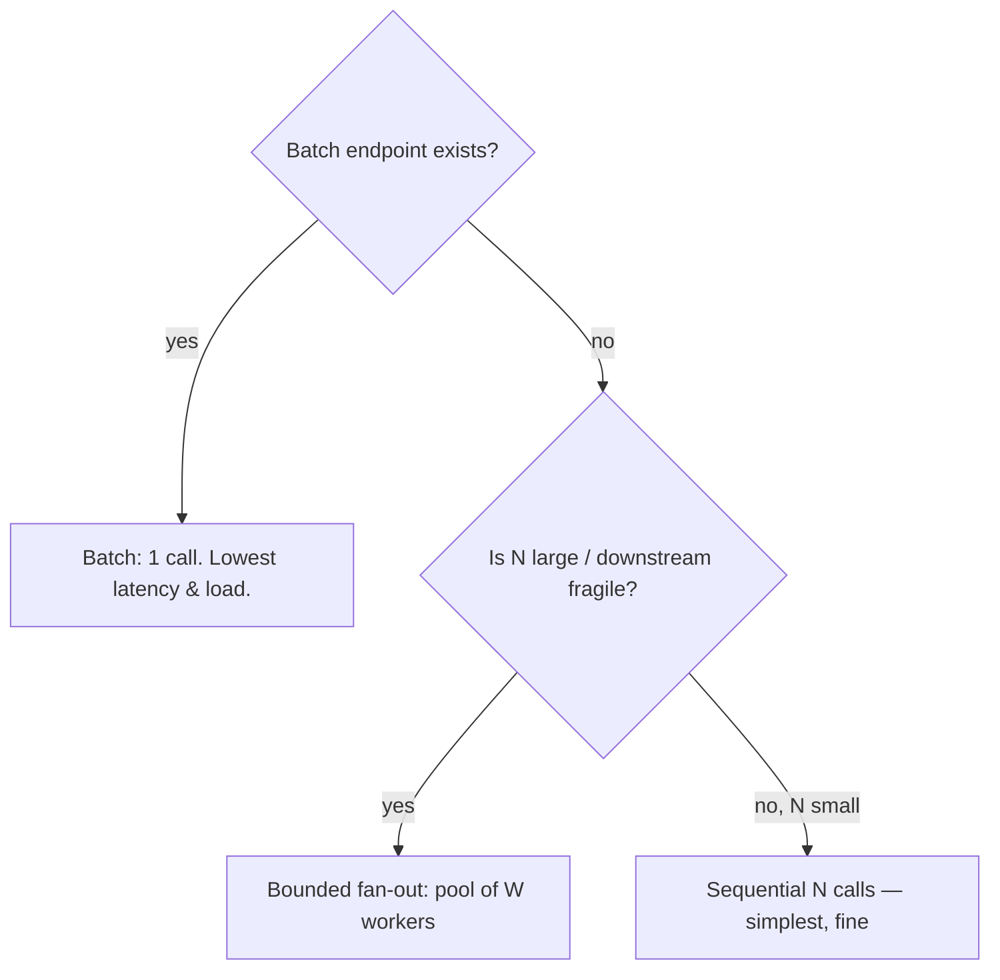

# N+1 in Code — Professional

> **Category:** [Performance Anti-Patterns](../README.md) → **N+1 in Code** — *per-item work in a loop that should have been done once.*

---

## Table of Contents

1. [Introduction](#introduction)
2. [Prerequisites](#prerequisites)
3. [Batch Size Has Limits — and Pagination](#batch-size-has-limits--and-pagination)
4. [The Preload-Everything Trap (Over-Fetch)](#the-preload-everything-trap-over-fetch)
5. [Latency vs Throughput: Batching vs Fan-Out](#latency-vs-throughput-batching-vs-fan-out)
6. [Bounded-Concurrency Fan-Out](#bounded-concurrency-fan-out)
7. [Backpressure and the Downstream](#backpressure-and-the-downstream)
8. [When N Small Calls Are Actually Fine](#when-n-small-calls-are-actually-fine)
9. [The Connection to Wrong Data Structure](#the-connection-to-wrong-data-structure)
10. [Common Mistakes](#common-mistakes)
11. [Test Yourself](#test-yourself)
12. [Cheat Sheet](#cheat-sheet)
13. [Summary](#summary)
14. [Further Reading](#further-reading)
15. [Related Topics](#related-topics)

---

## Introduction

> Focus: **The trade-offs that appear when "just batch it" meets real scale.**

At junior/middle level the answer to N+1 is "batch it." At scale that answer sprouts caveats, and getting them wrong replaces one performance bug with another:

- A batch can't be unbounded — **batch size has limits** (parameter caps, payload size, memory), so batching becomes *paginated* batching.
- Preloading *everything* to avoid N queries can pull gigabytes you never use — the **over-fetch trap**, the mirror image of N+1.
- Batching optimizes **latency** (one round-trip); **fan-out concurrency** optimizes a different axis and is the right tool when batching isn't available — but it loads the downstream `n×` harder.
- Fan-out without bounds is a self-inflicted DDoS; you need **bounded parallelism** and **backpressure**.
- Sometimes `N` small calls are *genuinely fine*, and adding batching is the premature optimization.

This file is about holding all of these in tension and choosing deliberately, with numbers.

> **The professional reframe:** "fix the N+1" is not a binary. It's a choice along a curve trading **round-trips, downstream load, memory, and latency** against each other. The right point depends on `n`, the cost per call, the downstream's capacity, and your latency budget. There is no default; there's measurement.

---

## Prerequisites

- **Required:** `senior.md` — detection, dataloader, guard tests.
- **Required:** Working knowledge of concurrency primitives (worker pools, semaphores, `errgroup`, async gather) and of database parameter/payload limits.
- **Helpful:** The `database-performance`, `concurrency-patterns`, `rate-limiting-throttling`, and `system-design-estimation` skills.
- **Helpful:** You've run a batch job that OOM'd or a fan-out that took down a dependency.

---

## Batch Size Has Limits — and Pagination

"One batched call for all `n`" works until `n` is large. Real limits bite:

- **Parameter caps.** Postgres allows ~65,535 bind parameters per statement; an `IN ($1, …, $n)` with 100k ids fails or degrades. MySQL's `max_allowed_packet` caps the query text size. Many RPC frameworks cap message size (gRPC default 4 MB).
- **Payload / memory.** A bulk response for 1M keys may be gigabytes — both sides must hold it.
- **Planner behavior.** A huge `IN (...)` list can defeat index usage and produce a worse plan than chunked queries.

So at scale, batching becomes **chunked (paginated) batching**: split the keys into fixed-size pages, one batched call per page.

```go
// Chunked batching: O(n / chunk) calls instead of O(n) or one giant call.
func loadUsers(ctx context.Context, ids []int64) (map[int64]User, error) {
    const chunk = 1000                       // tuned to the DB's sweet spot
    out := make(map[int64]User, len(ids))
    for i := 0; i < len(ids); i += chunk {
        end := min(i+chunk, len(ids))
        users, err := userRepo.FindByIDs(ctx, ids[i:end]) // 1 query per chunk
        if err != nil {
            return nil, err
        }
        for _, u := range users {
            out[u.ID] = u
        }
    }
    return out, nil
}
```

For 50,000 ids at chunk 1,000: **50 queries**, not 50,001 (N+1) and not one 50k-parameter monster. The chunk size is a tunable — benchmark it; the optimum is usually 500–2,000 depending on row width and the driver.

> **N+1 and "1 giant call" are two ends of a spectrum.** N+1 is `n` tiny calls (latency death by round-trips); the giant call is one call that breaks limits and over-fetches. Chunked batching is the middle, and the chunk size is where you tune between them.

---

## The Preload-Everything Trap (Over-Fetch)

The lazy cure for query-N+1 is "preload it all up front." Taken literally — `SELECT * FROM users` to avoid per-user queries — it trades N+1 for **over-fetch**: you load 2M users to serve a page that shows 20.

```python
# WRONG cure — kills the N+1 by loading the entire table into memory.
all_users = {u.id: u for u in user_repo.find_all()}   # 2M rows, ~4 GB
for order in page_of_orders:                          # 20 orders
    order.user = all_users[order.user_id]             # used 20 of 2,000,000
```

This is the *opposite* failure on the same axis. N+1 under-fetches (one row at a time); naive preload over-fetches (everything at once). The right answer preloads **exactly the keys the loop will touch**:

```python
# RIGHT — preload only the ids this page references.
ids = {o.user_id for o in page_of_orders}             # 20 distinct ids
users = {u.id: u for u in user_repo.find_by_ids(ids)} # 1 query, 20 rows
for order in page_of_orders:
    order.user = users[order.user_id]
```

| Approach | Queries | Rows fetched | Memory |
|---|---|---|---|
| N+1 | 1 + 20 | 20 | tiny |
| Preload-all | 1 | 2,000,000 | ~4 GB |
| **Preload-needed** | 1 + 1 | 20 | tiny |

Preload-needed wins on every axis. "Preload to fix N+1" must mean *preload the working set*, never *preload the table*.

---

## Latency vs Throughput: Batching vs Fan-Out

When a true batch endpoint exists, **batch** — one round-trip, lowest latency, lowest downstream load. But sometimes there's *no* batch API (a third-party REST endpoint that only takes one id). Then you have two shapes, optimizing different axes:

| | **Batching** | **Fan-out (concurrent)** |
|---|---|---|
| Round-trips | 1 | N (concurrent) |
| Wall-clock latency | one call's latency | ~slowest call (if unbounded) |
| Downstream load | 1 request | N requests at once |
| Needs | a bulk endpoint | a per-item endpoint + concurrency |
| Risk | payload/param limits | overwhelming the downstream |

Fan-out doesn't *reduce* the work — it still makes `N` calls — it just stops paying them *sequentially*. It cuts wall-clock latency by trading it for a burst of concurrent load. Batching is strictly better when available because it reduces the work itself. Reach for fan-out only when no batch endpoint exists.



---

## Bounded-Concurrency Fan-Out

Unbounded fan-out — fire all `N` calls at once — is a classic outage: spawn 10,000 goroutines/promises, exhaust the connection pool, and hammer the downstream into a tailspin. **Bound the parallelism** with a worker pool or semaphore.

```go
// Go — bounded fan-out: at most `workers` calls in flight at once.
func fetchAll(ctx context.Context, ids []int64) ([]User, error) {
    const workers = 16                       // tune to downstream capacity, not len(ids)
    g, ctx := errgroup.WithContext(ctx)
    g.SetLimit(workers)                      // the bound — never more than 16 in flight

    out := make([]User, len(ids))
    for i, id := range ids {
        i, id := i, id
        g.Go(func() error {
            u, err := userAPI.Get(ctx, id)   // per-item call, but parallel & capped
            if err != nil {
                return err                   // errgroup cancels ctx, stops the rest
            }
            out[i] = u
            return nil
        })
    }
    return out, g.Wait()
}
```

```python
# Python — bounded fan-out with a semaphore.
async def fetch_all(ids, limit=16):
    sem = asyncio.Semaphore(limit)
    async def one(i):
        async with sem:                      # at most `limit` concurrent
            return await user_api.get(i)
    return await asyncio.gather(*(one(i) for i in ids))
```

The worker count is tuned to the **downstream's** capacity (and your connection pool size), *not* to `len(ids)`. Sixteen workers against 10,000 ids gives ~`10000/16` waves of concurrent calls — fast, but the downstream never sees more than 16 at once. `concurrency-patterns` covers pool sizing and cancellation semantics.

---

## Backpressure and the Downstream

Even bounded fan-out can outpace a downstream under load. **Backpressure** is the downstream's ability to say "slow down," and your obligation to listen:

- **Respect rate limits.** A `429 Too Many Requests` or a `Retry-After` header means *back off*, not retry-immediately. Combine the worker pool with a rate limiter (`rate-limiting-throttling`). A retry storm on top of fan-out is how a blip becomes an outage.
- **Bound queues.** If you buffer work for the pool, bound the buffer. An unbounded queue converts downstream slowness into your-service OOM.
- **Prefer batch under pressure.** One batched call applies *natural* backpressure — it's one request the downstream queues normally. Fan-out multiplies your footprint on a struggling dependency exactly when it's least able to cope.
- **Connection pool ceiling.** Your fan-out width is implicitly capped by your DB/HTTP connection pool; exceeding it just queues threads and can deadlock. Size the worker count *below* the pool (`connection-pooling`).

> **Fan-out is load amplification.** Batching sends *less* work to the downstream; fan-out sends the *same* work *faster and more concurrently*. When the dependency is the bottleneck, batching helps it and fan-out hurts it. Choose with the downstream's health in mind, not just your latency number.

---

## When N Small Calls Are Actually Fine

Not every N+1 is worth fixing. The trap is treating "loop with a call" as automatically wrong. It's fine when:

- **`n` is small and bounded.** A loop over a fixed 3–10 element list. Three sequential calls at 5 ms is 15 ms — below the noise floor. Batching machinery is pure cost here. This is a [premature optimization](../01-premature-optimization-traps/professional.md).
- **The "call" is in-memory.** A map lookup or local computation per item is `O(1)` and cheap; that's just a normal loop, not an N+1.
- **The calls are already batched by a lower layer.** An HTTP client with pipelining, a DB driver with statement caching, or a connection-multiplexed protocol may amortize the per-call cost. Measure before assuming.
- **Correctness or freshness requires per-item.** If each item needs an independent, point-in-time read (e.g., a lock check), batching may change semantics. Don't trade correctness for round-trips.

The discipline is `senior.md`'s: **confirm it's on a hot path** (counter/trace) before paying the readability and complexity cost of batching. An N+1 that fires twice a day over 4 items is not a bug worth engineering around.

---

## The Connection to Wrong Data Structure

The membership-scan shape (`middle.md` Shape 4) is *simultaneously* an N+1 and a [Wrong Data Structure](../04-wrong-data-structure/professional.md) bug. A `list.contains()` inside a loop is:

- **N+1-shaped:** per-item expensive work (a linear scan) that should be done once (build the set).
- **Wrong-structure-shaped:** you used a slice/list (`O(n)` membership) where a set/map (`O(1)`) was the right tool for the access pattern.

The fix — build a set once — resolves both framings. This is why these two anti-patterns share a cure and why a profiler flagging "all the time is in this nested loop" can point at either name. At the professional level the label matters less than the cost model: *what operation am I doing `n×` that the data structure should make `1×`?* Both anti-patterns are answered by matching the structure (and the batching) to the access pattern. The `big-o-analysis` skill is the shared lens.

---

## Common Mistakes

1. **Replacing N+1 with one unbounded giant query/call.** Hits parameter caps, blows memory, or defeats the query planner. Chunk it.
2. **"Preload to fix N+1" → `find_all()`.** Over-fetching the whole table is the mirror-image bug. Preload only the keys the loop touches.
3. **Unbounded fan-out.** `gather(*all_calls)` or a goroutine per id exhausts pools and DDoSes the downstream. Bound it with a pool/semaphore sized to the *downstream*, not `n`.
4. **Fan-out + naive retries under a 429.** A retry storm layered on concurrency turns a transient downstream blip into a sustained outage. Honor `Retry-After`; add backoff (`retry-pattern`).
5. **Fanning out when a batch endpoint exists.** Fan-out keeps `N` units of downstream work; batching reduces it to 1. Prefer batch; fan-out is the fallback.
6. **Batching a 3-item loop.** Adding collect-fetch-map machinery to save microseconds on a tiny fixed `n` is premature optimization — and it hurts readability.
7. **Ignoring the connection-pool ceiling.** Worker count above pool size just queues threads or deadlocks. Keep fan-out width under the pool.

---

## Test Yourself

1. You replace a query-N+1 (`1 + 100,000`) with one `WHERE id IN (...)` of 100,000 ids and it errors. Why, and what's the fix?
2. A colleague "fixed" N+1 by preloading with `SELECT * FROM products` (5M rows) into a dict. Latency improved locally but production OOMs. Diagnose and correct it.
3. A third-party API has no batch endpoint, only `GET /user/{id}`. You have 2,000 ids. Compare sequential, unbounded-concurrent, and bounded-concurrent. Which do you ship, and how do you size it?
4. Why does batching apply backpressure naturally while fan-out can defeat it?
5. Give two cases where leaving `N` per-item calls in place is the correct decision.
6. Why is a `list.contains()` inside a loop both an N+1 *and* a wrong-data-structure bug, and what single change fixes both?

---

## Cheat Sheet

| Trade-off | Professional answer |
|---|---|
| **Batch too big** | Chunk into pages (param caps ~65k, packet/payload limits); tune chunk 500–2,000 |
| **Preload too much** | Preload only the keys the loop touches — never `find_all()` |
| **No batch endpoint** | Bounded fan-out (pool/semaphore sized to downstream, not `n`) |
| **Downstream fragile** | Prefer batch (less load); honor `429`/`Retry-After`; bound queues |
| **Tiny fixed `n`** | Leave the `N` calls — batching is premature optimization here |
| **Scan in loop** | Both N+1 *and* wrong structure — build a set once (`O(n×m) → O(n+m)`) |

> **One rule:** *Batch reduces the work; fan-out only parallelizes it. Prefer batch, chunk it within limits, fan out (bounded) only when no batch exists — and confirm the hot path first.*

---

## Summary

- "Just batch it" gains caveats at scale. A batch can't be unbounded — **chunk** it within parameter, payload, and memory limits (N+1 and "one giant call" are opposite ends of a spectrum; the chunk size tunes between them).
- The naive preload cure (`find_all()`) is the **over-fetch trap** — the mirror of N+1. Preload only the working set the loop will touch.
- **Batching** reduces downstream work to one round-trip (best); **fan-out** only parallelizes the same `N` calls and amplifies load. Use fan-out only when no batch endpoint exists, always **bounded**, sized to the downstream and connection pool.
- Respect **backpressure**: honor rate limits, bound queues, and remember batch applies backpressure naturally while fan-out defeats it.
- Sometimes `N` small calls are **correct** — small fixed `n`, in-memory calls, cold paths. Confirm the hot path before adding batching machinery (don't premature-optimize).
- The scan-in-loop shape is **both N+1 and Wrong Data Structure**; one change — a set built once — fixes both. The shared lens is `big-o-analysis`.

---

## Further Reading

- **Patterns of Enterprise Application Architecture** — Martin Fowler (2002) — *Lazy Load*, *Identity Map*; the load-once-vs-load-per-item trade-off.
- **Programming Pearls** — Jon Bentley (2nd ed., 1999) — back-of-envelope cost estimation, the basis for choosing batch vs fan-out.
- **Release It!** — Michael Nygård (2nd ed., 2018) — backpressure, bulkheads, and how unbounded fan-out causes cascading failure.
- The `database-performance`, `concurrency-patterns`, `rate-limiting-throttling`, `connection-pooling`, and `system-design-estimation` skills — batch limits, bounded fan-out, backpressure, and capacity math.

---

## Related Topics

- [N+1 in Code → senior.md](senior.md) — detection and dataloader (the batching this file scales).
- [Wrong Data Structure → professional.md](../04-wrong-data-structure/professional.md) — the scan-in-loop shape from the structure angle.
- [Unnecessary Allocation → professional.md](../03-unnecessary-allocation/professional.md) — preloading large working sets touches the allocation/memory trade-off.
- [Premature Optimization Traps → professional.md](../01-premature-optimization-traps/professional.md) — when N small calls are fine and batching is premature.
- Refactoring → Refactoring Techniques — Split Loop, pipeline, and batching refactors.

---

## Check your understanding

1. Explain N+1 in Code — Professional Level in your own words and name the problem it solves.
2. How would you apply the ideas around Table of Contents, Introduction, Prerequisites in a realistic engineering change?
3. What failure mode or misuse should you look for, and what evidence would reveal it?
4. How would you introduce and govern N+1 in Code — Professional Level across teams through reversible, measurable increments?
5. What observable result would convince you that the approach improved the system?
