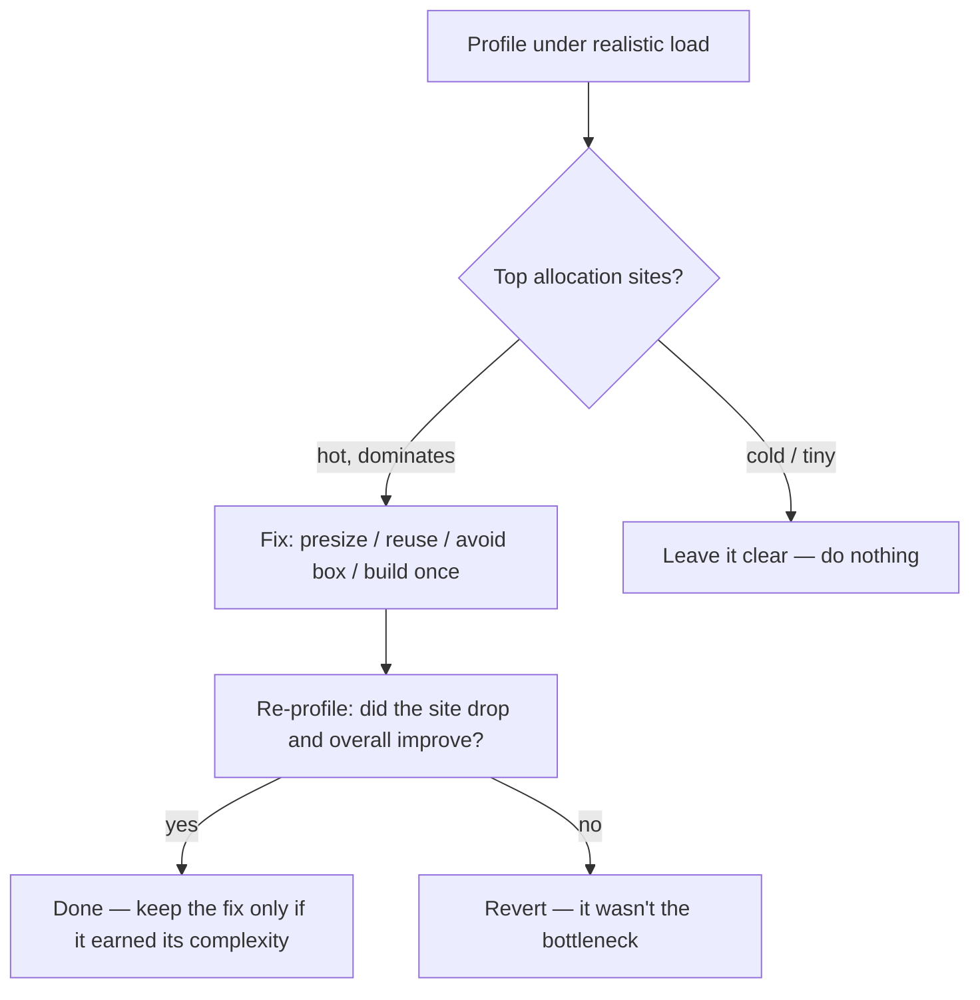

# Unnecessary Allocation — Senior

> **Category:** [Performance Anti-Patterns](../README.md) → **Unnecessary Allocation** — *throwaway objects, boxing, and copies churned in a hot path.*

---

## Introduction

> Focus: **Reducing allocation in a real hot path** — read the profile, understand *why* it allocates, fix it, and know when to stop.

At the middle level you learned to *see* allocations with `-benchmem` and fix the five common forms. At the senior level you do this in a **real system under real load**, where you cannot afford to optimize everything and the cost of a wrong "optimization" (a pooling bug, an unreadable hot path) is a production incident.

Three senior skills define this file:

1. **Find the allocation that matters** — read an allocation profile and let it, not intuition, choose the target.
2. **Explain *why* code allocates** — escape analysis, `-gcflags=-m`, and the heap-vs-stack decision the compiler actually makes.
3. **Know the dangerous cures** — `sync.Pool` and object reuse can backfire (correctness bugs, retained garbage, contention). You reach for them *last*, with measurement.

> **The senior rule, stated flatly:** *profile first.* The overwhelming majority of allocations in a codebase are irrelevant — collected cheaply, invisible to users. You spend effort only on the allocations a profiler proves are hot, and you keep the rest of the code clear.

---

## Prerequisites

- **Required:** [`middle.md`](middle.md) — the five forms and `-benchmem`/JMH-`-prof gc`.
- **Required:** You can run a profiler — Go `pprof`, JFR/async-profiler for the JVM, `tracemalloc`/`memray` for Python — and read its output.
- **Helpful:** A working model of a tracing GC (mark phase scans live objects; allocation rate drives collection frequency).
- **Helpful:** The `profiling-techniques` and `memory-leak-detection` skills — allocation profiling and the failure mode where reuse/pooling *retains* memory.

---

## Rule Zero: Profile First — Most Allocations Don't Matter

A codebase has thousands of allocation sites. A profiler will show you that a *handful* account for the bulk of the bytes. Optimizing anything else is wasted effort that also costs you readability. So the senior workflow inverts the junior instinct:



This is the same discipline as [premature optimization](../01-premature-optimization-traps/senior.md), applied to memory: **measure, fix the proven hotspot, leave the rest alone.** The difference between a senior and a mid-level engineer here is mostly *restraint* — knowing which 5% to touch.

---

## Reading an Allocation Profile

### Go — `pprof` with `-alloc_objects` vs `-alloc_space`

```go
func BenchmarkPipeline(b *testing.B) {
	b.ReportAllocs()
	for i := 0; i < b.N; i++ { _ = pipeline(input) }
}
```

```bash
go test -bench=Pipeline -benchmem -memprofile=mem.out
go tool pprof -alloc_objects mem.out   # WHERE the allocation COUNT is
go tool pprof -alloc_space   mem.out   # WHERE the BYTES are
```

The two views answer different questions, and seniors check both:

- **`-alloc_objects`** ranks sites by *number* of allocations. High object count → GC pressure (the GC's cost scales with object *count*, not just bytes). This finds the death-by-a-thousand-allocations pattern.
- **`-alloc_space`** ranks by *bytes*. This finds the single fat allocation (a 50 MB slice).

```text
(pprof) top -alloc_objects
      flat  flat%   cum   cum%
  4194304  61%   4194304  61%  myapp/parse.tokenize     ← 4.2M objects: the target
   524288   8%    524288   8%  myapp/parse.normalize
```

`list tokenize` then shows the exact source line. Usually it's one of the five forms from `middle.md` — a `[]byte→string` conversion, an un-presized append, a per-token struct.

### JVM — JFR / async-profiler allocation profiling

```bash
# Java Flight Recorder, low-overhead, production-safe:
java -XX:+FlightRecorder -XX:StartFlightRecording=settings=profile,filename=app.jfr -jar app.jar
# async-profiler in allocation mode → a flame graph by allocating call stack:
asprof -e alloc -d 30 -f alloc.html <pid>
```

JFR's "Allocation by Class" and the async-profiler `alloc` flame graph point at the type and the call stack doing the allocating. The JVM's TLAB (thread-local allocation buffer) makes *eden* allocation extremely cheap, so on the JVM the cost is usually **promotion pressure**: short-lived objects that escape eden and get copied into survivor/old space. The profile finds the allocating site; the GC logs tell you whether it's actually hurting.

### Python — `tracemalloc` / `memray`

```python
import tracemalloc
tracemalloc.start()
run_hot_path()
for stat in tracemalloc.take_snapshot().statistics("lineno")[:10]:
    print(stat)   # top 10 lines by allocated size
```

`memray` gives a flame graph and tracks native allocations too. In Python the GC is reference-counting plus a cycle collector, so the cost model differs — but the *site-finding* discipline is identical.

---

## Escape Analysis: Why a Value Allocates

A value that the compiler can prove never outlives its function stays on the **stack** — freed for free when the function returns, zero GC cost. A value that *escapes* (its address outlives the call) must go on the **heap**. Knowing *why* a value escapes is how you make it stop allocating.

In Go, the compiler tells you, exactly:

```bash
go build -gcflags="-m" ./...        # one -m: escape decisions
go build -gcflags="-m -m" ./...     # two: the reasoning chain
```

```go
func sumStack() int {
	p := point{1, 2}        // does NOT escape → stack, no allocation
	return p.x + p.y
}

func leakPoint() *point {
	p := point{1, 2}        // escapes: pointer returned
	return &p               // ./main.go:N: moved to heap: p
}
```

```text
./main.go:?: p does not escape
./main.go:N: moved to heap: p
```

Common escape triggers you'll learn to recognize in the `-m` output:

- **Returning a pointer to a local** (the obvious one).
- **Putting a value in an `interface{}`/`any`** — `fmt.Println(x)`, `[]any{x}`, storing in a `map[K]any`. The interface conversion forces the value to the heap.
- **Capturing a variable by reference in a closure** that escapes.
- **A slice/map whose size the compiler can't bound**, or that's passed somewhere it can't track.
- **Calling through an interface** the compiler can't devirtualize — it must assume the callee keeps the argument.

The JVM does escape analysis too (`-XX:+DoEscapeAnalysis`, on by default), enabling **scalar replacement** — a non-escaping object's fields are kept in registers and *never allocated at all*. You can't annotate it; you *enable* it by not letting the object escape (don't store it in a field, don't return it, don't pass it to a polymorphic call the JIT can't inline). `-XX:+PrintEscapeAnalysis` (debug builds) or simply watching `gc.alloc.rate.norm` drop to 0 in JMH confirms it kicked in.

> **The lever:** you rarely "tell" the compiler to stack-allocate. You *remove the escape* — stop returning the pointer, stop boxing into `interface{}`, keep the object local — and stack allocation follows automatically.

---

## Presizing From a Known Size

The highest-leverage, lowest-risk hot-path fix: when the final size is known or boundable, allocate exactly once.

```go
// You're decoding n records; you know n from a header.
recs := make([]Record, 0, n)        // 1 alloc instead of ~log2(n)
seen := make(map[string]struct{}, n) // presize the map → no rehash storm
```

The subtlety at this level: **even an estimate helps.** If you don't know `n` exactly but know it's "usually a few thousand," presizing to a reasonable estimate eliminates most reallocations; the occasional over-grow is far cheaper than starting from zero. Presizing has no reuse contract, no pool to drain, no aliasing risk — which is exactly why it's the first hot-path fix you try and often the only one you need.

---

## Object Reuse and `sync.Pool` — and Its Dangers

When a hot path allocates the *same large temporary* on every call, and presizing/stack-allocation can't help (the object genuinely escapes), reuse is the next tool. `sync.Pool` is Go's standard mechanism: a free-list of reusable objects the GC may reclaim under pressure.

```go
var bufPool = sync.Pool{
	New: func() any { return make([]byte, 0, 64*1024) },
}

func handle(w io.Writer, r *Request) error {
	buf := bufPool.Get().([]byte)
	buf = buf[:0]                 // MUST reset — Get returns a dirty object
	defer bufPool.Put(buf[:0])    // return it; reset so we don't pin huge data

	buf = render(buf, r)
	_, err := w.Write(buf)
	return err
}
```

```text
BenchmarkHandle        85000   14200 ns/op   65536 B/op   1 allocs/op
BenchmarkHandlePooled 410000    2700 ns/op      32 B/op   0 allocs/op
```

The win is real here — but `sync.Pool` is a **loaded gun**, and seniors respect every one of these hazards:

- **Dirty objects.** `Get()` returns whatever was last `Put`. You **must** reset (`buf[:0]`, clear the struct). Forget, and you serve another request's leftover data — a correctness and *security* bug.
- **Retained garbage.** If you `Put` a buffer that grew to 50 MB, the pool now pins 50 MB indefinitely. Either don't pool oversized objects or shrink before `Put`. This is a [memory leak](../../02-design/02-coupling-and-state/professional.md) the `memory-leak-detection` skill exists to catch.
- **Escape into the pool.** Anything reachable from a pooled object is kept alive by the pool. Pool a struct holding a pointer to a request and you've leaked the request.
- **It's not a cache.** `sync.Pool` is cleared (at least partly) on every GC. Don't use it for things you need to persist; use it only for transient scratch.
- **Contention & false sharing.** Under high concurrency, a poorly-shaped pool (or pooled objects packed onto the same cache line) can cost more than it saves — the cache effects of object layout are covered in [coupling-and-state](../../02-design/02-coupling-and-state/professional.md).
- **Measure that it helped.** Pooling adds real complexity. If the profile doesn't show the allocation site dominating, the pool is a liability with no upside — revert it.

The JVM analog is an explicit object pool or `ThreadLocal` scratch buffer, with the same hazards plus one more: pooled objects survive into old-gen, so a leaky pool defeats the generational GC's main advantage. Modern advice on the JVM leans *away* from pooling small objects (the allocator + young GC are faster than a pool) and toward it only for genuinely expensive-to-create resources.

---

## The Readability Trade-off

Every allocation cure costs clarity:

| Cure | Readability cost |
|---|---|
| Presize a collection | ~none — arguably *clearer* (states the size) |
| Build a string once | ~none — also clearer |
| Reuse a buffer (`buf[:0]`) | small — adds a reset + a "don't alias" rule |
| `sync.Pool` | large — Get/Put/reset/defer + a correctness contract |
| Hand-rolled arena / value flattening | large — non-idiomatic, hard to review |

The senior judgment is to **spend clarity in proportion to the measured win**, and only on the hot path the profile fingered. A pooled, buffer-reused, escape-tuned function is *appropriate* in the inner loop of a serializer that runs a million times a second — and *malpractice* in a request handler that runs ten times a minute, where it just makes the code harder to change for no benefit.

---

## A Worked Decision

A JSON-line ingester processes 2M records/sec and the service is CPU-bound on GC. The allocation profile:

```text
(pprof) top -alloc_objects
  68%  ingest.parseLine    →  string(b) conversion per field + per-line map
  19%  ingest.toRecord     →  []any boxing for a generic sink
```

The senior sequence:

1. **`parseLine` (68%)** — `string(fieldBytes)` allocates a new string per field. If the string is only used to look up a key, use the bytes directly (`map[string]` lookups accept a `string(b)` key that the compiler can keep on the stack in some cases, or use a `[]byte`-keyed structure). The per-line `map` → presize or replace with a reused struct. **Re-profile:** site drops to 9%, GC CPU halves.
2. **`toRecord` (19%)** — `[]any` boxes every field. Replace the generic sink with a typed one on the hot path. **Re-profile:** gone.
3. **Stop.** The remaining sites are <5% each. Touching them trades readability for nothing. Ship.

Note what we did *not* do: no `sync.Pool` (presizing + removing the string conversion sufficed), no clever arena. The simplest cure that the profile justified, and then *stop*.

---

## Common Mistakes

1. **Optimizing without a profile.** Guessing the hot allocation is wrong most of the time; you'll harden cold code and miss the real site. Profile first, always.
2. **Reaching for `sync.Pool` first.** Presizing and removing escapes are simpler, safer, and usually enough. Pooling is the last resort, not the first.
3. **Forgetting to reset a pooled object.** Dirty reuse leaks data across requests — a correctness/security bug, not just a perf issue.
4. **Pooling oversized objects.** A pool that retains a giant buffer is a memory leak. Cap or shrink before `Put`.
5. **Reading only `-alloc_space`.** Bytes find the fat allocation; *objects* find the GC-pressure pattern. Check both views.
6. **Fighting the escape analyzer blindly.** Reorganize so the value *doesn't* escape (don't return the pointer, don't box into `interface{}`); don't sprinkle `//go:noescape` or micro-tricks you can't justify.
7. **Keeping a cure the profile no longer justifies.** After a refactor the hotspot may move. A pool that once paid for itself can become dead complexity. Re-profile and remove it.

---

## Test Yourself

1. What's the difference between `pprof -alloc_objects` and `-alloc_space`, and when do you reach for each?
2. You run `go build -gcflags=-m` and see `moved to heap: p`. Name two reasons a local value escapes to the heap.
3. Give three distinct ways `sync.Pool` can cause a bug or a leak.
4. Why is "tell the compiler to stack-allocate" the wrong framing? What do you actually do to get stack allocation?
5. A hot path allocates one 64 KB buffer per call and the profile shows it dominating. You have presizing, escape-removal, and `sync.Pool` available. In what order do you try them, and why?
6. The JVM's eden allocation is nearly free. So why does a high allocation rate still hurt JVM performance?

---

## Cheat Sheet

| Step | Tool | What you're looking for |
|---|---|---|
| **Find the site** | `pprof -alloc_objects`/`-alloc_space`, JFR/async-profiler, `tracemalloc`/`memray` | The few sites that dominate count/bytes |
| **Explain it** | `go build -gcflags=-m`; JVM escape analysis | *Why* the value escapes to the heap |
| **Cheap cure** | `make([]T,0,n)`, presize maps | Known/bounded size → 1 allocation |
| **Remove the alloc** | Stop the escape (no pointer return, no `interface{}` box) | Value moves to the stack / scalar-replaced |
| **Last resort** | `sync.Pool`, buffer reuse | Large escaping temporary, *measured* hot — mind reset/retention/contention |

> **Rule zero, repeated:** profile first; most allocations don't matter. Spend clarity in proportion to the measured win, and re-profile to confirm it.

---

## Summary

- In a real system you **cannot optimize every allocation** — and shouldn't. Profile under realistic load; let `pprof -alloc_objects`/`-alloc_space`, JFR/async-profiler, or `tracemalloc`/`memray` choose the few sites that dominate.
- Understand *why* code allocates: **escape analysis**. Use `go build -gcflags=-m` to see escape decisions; the lever is to *remove the escape* (no pointer return, no `interface{}` boxing), after which stack allocation/scalar replacement is automatic.
- **Presizing from a known (or estimated) size** is the first, safest hot-path cure. **Removing the escape** eliminates the allocation entirely.
- **`sync.Pool` / object reuse is the last resort** — real wins, real hazards: dirty objects (correctness/security), retained garbage (leaks), escape-into-pool, contention/false sharing. Reach for it only when the profile justifies the complexity, and re-profile to confirm.
- Spend **readability in proportion to the measured win**, and only on the hot path. The same restraint as premature-optimization, applied to memory.
- Next: [`professional.md`](professional.md) — *GC models (Go's concurrent GC, JVM generational/G1/ZGC) and why allocation rate drives GC CPU; stack-vs-heap and escape pitfalls; false sharing; when pooling backfires; honest allocation benchmarking.*

---

## Further Reading

- **Systems Performance** — Brendan Gregg (2nd ed., 2020) — allocation rate, working set, and the page/cache effects that follow from churn.
- **Java Performance** — Scott Oaks (2nd ed., 2020) — TLABs, promotion, escape analysis/scalar replacement, and reading GC logs to confirm an allocation fix.
- **The Go Blog — escape analysis** (go.dev/blog) and the `pprof` documentation — `-gcflags=-m` and `-alloc_objects` in practice.
- **Go pprof docs / `runtime/pprof`** — capturing and reading memory profiles under realistic load.

---

## Related Topics

- [Premature Optimization Traps](../01-premature-optimization-traps/senior.md) — rule zero is the same: profile first, optimize the proven hotspot, leave the rest clear.
- [Coupling and State → false sharing / cache](../../02-design/02-coupling-and-state/professional.md) — object layout, cache lines, and the contention hazards of pooling.
- [N+1 in Code](../02-n-plus-one-in-code/senior.md) — repeated work in a loop; often co-located with repeated allocation.
- [Wrong Data Structure](../04-wrong-data-structure/senior.md) — choosing a structure whose allocation behavior fits the access pattern.
- Architecture Anti-Patterns — where memory pressure becomes a system-level concern.
- The `profiling-techniques` and `memory-leak-detection` skills — allocation profiling and the retained-memory failure mode of reuse/pooling.

---

## Check your understanding

1. Explain Unnecessary Allocation — Senior Level in your own words and name the problem it solves.
2. How would you apply the ideas around Table of Contents, Introduction, Prerequisites in a realistic engineering change?
3. What failure mode or misuse should you look for, and what evidence would reveal it?
4. How would you validate a system-level decision about Unnecessary Allocation — Senior Level under uncertainty?
5. What observable result would convince you that the approach improved the system?
