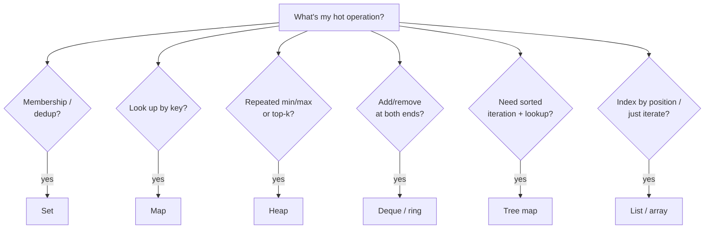

# Wrong Data Structure — Middle

> **Category:** [Performance Anti-Patterns](../README.md) → **Wrong Data Structure** — *a collection whose cost model fights the access pattern.*

---

## Table of Contents

1. [Introduction](#introduction)
2. [Prerequisites](#prerequisites)
3. [The Cost-Table Cheat Sheet](#the-cost-table-cheat-sheet)
4. [Mismatch 1 — Membership: List → Set](#mismatch-1--membership-list--set)
5. [Mismatch 2 — Find by Key: Repeated Scan → Map](#mismatch-2--find-by-key-repeated-scan--map)
6. [Mismatch 3 — Repeated Min/Max & Top-K: Re-sort → Heap](#mismatch-3--repeated-minmax--top-k-re-sort--heap)
7. [Mismatch 4 — Queue: List Pop-Front → Deque](#mismatch-4--queue-list-pop-front--deque)
8. [Mismatch 5 — Nested-Loop Join → Hash Join](#mismatch-5--nested-loop-join--hash-join)
9. [The Decision Procedure](#the-decision-procedure)
10. [Common Mistakes](#common-mistakes)
11. [Test Yourself](#test-yourself)
12. [Cheat Sheet](#cheat-sheet)
13. [Summary](#summary)
14. [Further Reading](#further-reading)
15. [Related Topics](#related-topics)

---

## Introduction

> Focus: **The common mismatches and the right pick** — for each everyday access pattern, the structure that fits, with the big-O and a benchmark to prove it.

`junior.md` taught the one move: membership in a loop wants a set, not a list. This file is the full catalog. Every mismatch below follows the same template — a natural-looking operation that's quietly O(n) on the wrong structure, and the O(1) or O(log n) structure built for it.

The thread connecting all of them is a single habit: **before you choose a collection, name the operation you'll perform on it most often, then pick the structure that makes *that* operation cheap.** You won't memorize a hundred rules; you'll learn to read the cost table and ask one question.

> **The mental model:** a collection has a "fast column" and a "slow column" in the cost table. The anti-pattern is doing your hot operation in the slow column. The fix is always to move it to a structure where that operation is in the fast column — usually by spending one O(n) pass to *preprocess* into the right shape.

---

## Prerequisites

- **Required:** Comfortable with `junior.md` — you can spot a membership scan and fix it with a set.
- **Required:** You can read big-O notation and know that O(n·m) and O(n²) blow up while O(n) and O(n log n) stay tame.
- **Required:** You can write and read a microbenchmark in your language (Go `testing.B`, Java JMH, Python `timeit`/`pyperf`). The `profiling-techniques` skill covers the discipline.
- **Helpful:** Familiarity with your language's standard collections: list/slice, set, map/dict, deque, and a heap/priority queue.

---

## The Cost-Table Cheat Sheet

Pin this. It's the single most useful artifact in the topic — most wrong-structure bugs are just a glance at this table away from being obvious.

| Operation | Array / List | Hash Set / Map | Tree Map (sorted) | Heap (priority queue) | Deque (double-ended) | Linked List |
|---|---|---|---|---|---|---|
| Index by position | **O(1)** | — | — | — | O(1) ends only | O(n) |
| Append / push back | O(1)* | O(1) avg | O(log n) | O(log n) | **O(1)** | O(1) |
| Insert/delete at front | O(n) | — | — | — | **O(1)** | O(1) |
| Insert/delete in middle | O(n) | — | O(log n) | — | O(n) | O(1)** |
| Membership (`contains`) | **O(n)** | **O(1)** avg | O(log n) | O(n) | O(n) | O(n) |
| Look up by key | O(n) scan | **O(1)** avg | O(log n) | — | — | O(n) |
| Min / max | O(n) | O(n) | **O(1)** | **O(1)** peek | O(1) ends | O(n) |
| Pop min / max | O(n) | O(n) | O(log n) | **O(log n)** | O(1) ends | O(n) |
| Iterate in sorted order | O(n log n) | O(n log n) | **O(n)** | O(n log n) | O(n log n) | O(n log n) |
| Ordered (insertion) iterate | **O(n)** | O(n) random | O(n) sorted | — | O(n) | O(n) |

<sub>\*Amortized; a dynamic array doubles on growth — see `professional.md`. \*\*O(1) *if* you already hold the node; finding it is O(n).</sub>

Three reading rules:

1. **Find your hot operation's row.** The cheapest cell in that row names your structure.
2. **A blank (—) means "this structure can't do that"** — e.g., a heap can't do membership cheaply; a set can't give you min.
3. **You often need two cheap operations** (e.g., "look up by key" *and* "iterate in sorted order"). That points you to a tree map, or to two structures kept in sync. More in `senior.md`.

---

## Mismatch 1 — Membership: List → Set

The `junior.md` case, with a benchmark to make it concrete. **Pattern:** repeated `contains` against a growing collection.

**Before** — O(n·m):

```python
def dedup_seen(stream, seen_list):       # seen_list is a list
    fresh = []
    for item in stream:
        if item not in seen_list:        # O(n)
            seen_list.append(item)
            fresh.append(item)
    return fresh
```

**After** — O(n + m), build the set once and let it grow:

```python
def dedup_seen(stream, seen_set):        # seen_set is a set
    fresh = []
    for item in stream:
        if item not in seen_set:         # O(1) average
            seen_set.add(item)
            fresh.append(item)
    return fresh
```

**Benchmark** (`pyperf`, 50,000-item stream, CPython 3.12, illustrative):

| Version | Time | Big-O |
|---|---|---|
| list membership | ~9.8 s | O(n·m) |
| set membership | ~6 ms | O(n + m) |

Three orders of magnitude from one word changing type. The set *is* the dedup data structure; a list pretending to be one is the anti-pattern.

---

## Mismatch 2 — Find by Key: Repeated Scan → Map

**Pattern:** you have a list of records and repeatedly find "the one whose id equals k." Each find is an O(n) scan; doing it `q` times is O(n·q).

**Before** — Go, scan-per-lookup:

```go
// findUser scans the whole slice every call: O(n).
func findUser(users []User, id int) (User, bool) {
    for _, u := range users {
        if u.ID == id {
            return u, true
        }
    }
    return User{}, false
}

// Called once per incoming request → O(n) per request, O(n·q) total.
func enrich(reqs []Request, users []User) {
    for i := range reqs {
        if u, ok := findUser(users, reqs[i].UserID); ok {  // O(n) each
            reqs[i].UserName = u.Name
        }
    }
}
```

**After** — index once into a map, then O(1) lookups:

```go
// Build the index once: O(n). Every lookup is then O(1) average.
func indexByID(users []User) map[int]User {
    idx := make(map[int]User, len(users))
    for _, u := range users {
        idx[u.ID] = u
    }
    return idx
}

func enrich(reqs []Request, users []User) {
    idx := indexByID(users)              // O(n), once
    for i := range reqs {
        if u, ok := idx[reqs[i].UserID]; ok {  // O(1) average
            reqs[i].UserName = u.Name
        }
    }
}
```

**Benchmark** (Go `testing.B`, 10,000 users × 10,000 requests, `benchstat`, illustrative):

| Version | ns/op (whole `enrich`) | Big-O |
|---|---|---|
| scan per lookup | 41,000,000 | O(n·q) |
| map index | 980,000 | O(n + q) |

The map-index version is ~40× faster here and the gap *widens* with size — that's the signature of fixing a quadratic. **Key insight:** the cost of building the index (one O(n) pass) is paid back the moment you do more than a couple of lookups.

---

## Mismatch 3 — Repeated Min/Max & Top-K: Re-sort → Heap

**Pattern:** you repeatedly need the smallest (or k smallest) of a changing collection, and you re-sort the whole thing each time.

**Before** — Java, sort-to-get-min in a loop: O(n log n) *per* query:

```java
// Pull the cheapest job repeatedly by re-sorting every time. O(n log n) each.
Job nextJob(List<Job> jobs) {
    jobs.sort(Comparator.comparingInt(Job::cost));  // O(n log n)
    return jobs.remove(0);                           // O(n) shift, too
}
```

**After** — a heap (priority queue): O(log n) per pop, O(1) peek:

```java
// Heap maintains the min at the root. Pop is O(log n); no re-sort.
PriorityQueue<Job> pq = new PriorityQueue<>(Comparator.comparingInt(Job::cost));
pq.addAll(jobs);                 // O(n) heapify
Job cheapest = pq.poll();        // O(log n)
```

**Top-K** is the same lesson sharpened. To get the 10 largest of a million items, *don't sort the million* (O(n log n)) — keep a **bounded min-heap of size k** and stream through once: O(n log k).

```python
import heapq

# Top-k largest in O(n log k), O(k) memory — never sorts the whole stream.
def top_k(stream, k):
    heap = []                                  # min-heap of the k best so far
    for x in stream:
        if len(heap) < k:
            heapq.heappush(heap, x)
        elif x > heap[0]:                      # x beats the current k-th best
            heapq.heapreplace(heap, x)         # pop min, push x — O(log k)
    return sorted(heap, reverse=True)
```

| Approach | Time | Memory |
|---|---|---|
| `sorted(stream)[:k]` | O(n log n) | O(n) |
| bounded min-heap | **O(n log k)** | **O(k)** |

For k=10 over a million items, `log k` ≈ 3 vs `log n` ≈ 20 — and you hold 10 items, not a million. Python's `heapq.nlargest(k, stream)` does exactly this; use it.

---

## Mismatch 4 — Queue: List Pop-Front → Deque

**Pattern:** you use a list as a FIFO queue, removing from the front. Front-removal on an array shifts every remaining element down one slot — O(n) per pop, O(n²) to drain.

**Before** — Python, the textbook trap:

```python
queue = list(tasks)
while queue:
    task = queue.pop(0)          # O(n) — shifts the whole list left every time
    process(task)
# draining the queue is O(n²)
```

**After** — `collections.deque`, O(1) at both ends:

```python
from collections import deque

queue = deque(tasks)
while queue:
    task = queue.popleft()       # O(1)
    process(task)
# draining is O(n)
```

| Language | Wrong (O(n) front-op) | Right (O(1) front-op) |
|---|---|---|
| Python | `list.pop(0)` / `list.insert(0, x)` | `collections.deque` |
| Java | `ArrayList.remove(0)` | `ArrayDeque` |
| Go | `q = q[1:]` (leaks the backing array) or shifting | ring buffer, or `container/list`, or index + periodic compaction |

> **Go note:** `q = q[1:]` is O(1) *time* but pins the original backing array in memory (the elements before the slice header aren't freed). For a long-lived queue, use a ring buffer or a head index. This is a structure choice with a *memory* cost, not just a time one.

---

## Mismatch 5 — Nested-Loop Join → Hash Join

**Pattern:** you "join" two collections by matching keys with a nested loop — for each item in A, scan all of B. That's O(n·m). Build a hash index of B once and the join becomes O(n + m). This is the membership fix generalized to "match and combine."

**Before** — Go, O(n·m):

```go
// For each order, scan all customers to attach the name. O(n·m).
func joinNames(orders []Order, customers []Customer) []Labeled {
    var out []Labeled
    for _, o := range orders {            // n
        for _, c := range customers {     // × m
            if c.ID == o.CustomerID {
                out = append(out, Labeled{o, c.Name})
                break
            }
        }
    }
    return out
}
```

**After** — hash the smaller side once, probe it: O(n + m):

```go
func joinNames(orders []Order, customers []Customer) []Labeled {
    byID := make(map[int]string, len(customers))
    for _, c := range customers {         // build phase: O(m)
        byID[c.ID] = c.Name
    }
    out := make([]Labeled, 0, len(orders))
    for _, o := range orders {            // probe phase: O(n)
        if name, ok := byID[o.CustomerID]; ok {
            out = append(out, Labeled{o, name})
        }
    }
    return out
}
```

This is literally what a database does when it picks a *hash join* over a *nested-loop join*. The same logic in your application code: hash the smaller collection, probe with the larger.

---

## The Decision Procedure

When you're about to pick a collection, run this:



Most of the time the answer is a one-line change at the point where you *create* the collection or *preprocess* into it. The cost of the wrong choice, by contrast, is paid on every operation forever.

---

## Common Mistakes

1. **Optimizing the lookup but rebuilding the index every call.** Building the map/set inside the loop re-pays O(n) each iteration. Build it **once**, outside.
2. **Sorting to get the minimum.** A full sort is O(n log n) to surface one element. A heap gives you the min in O(1) (peek) and maintains it in O(log n).
3. **Sorting everything for top-k.** `sorted(x)[:k]` is O(n log n); a bounded heap is O(n log k) and O(k) memory. For k ≪ n, that's a huge difference.
4. **Using a list as a queue.** `pop(0)` / `remove(0)` is O(n). Reach for a deque the moment you remove from the front.
5. **Nested-loop joins in app code.** Matching two collections by key with nested loops is O(n·m). Hash the smaller side.
6. **Forgetting Go's slice-reslice memory leak.** `q = q[1:]` doesn't free the dropped head; a long-lived queue needs a ring buffer or compaction.
7. **Picking a structure for the operation you *write*, not the one you *do most*.** You write `append` once at setup but `contains` a million times in the loop. Optimize for the million.

---

## Test Yourself

1. You have a list of 100k products and repeatedly look one up by SKU. What structure, and what's the before/after big-O for `q` lookups?
2. Why is `sorted(stream)[:10]` worse than a size-10 heap for finding the top 10 of a billion-item stream? Give both the time and memory complexity.
3. A queue built on `list.pop(0)` is slow. Why is `pop(0)` O(n), and what replaces it?
4. Rewrite this O(n·m) join to O(n + m):
   ```python
   def attach_dept(employees, departments):  # both lists
       for e in employees:
           for d in departments:
               if d.id == e.dept_id:
                   e.dept_name = d.name
   ```
5. When is keeping the data in a plain list the *right* call, even though a set would make membership O(1)?

---

## Cheat Sheet

| Access pattern | Wrong (and its cost) | Right | New cost |
|---|---|---|---|
| Membership / dedup | list `contains` in loop — O(n·m) | **Set** | O(n + m) |
| Find by key | scan list per lookup — O(n·q) | **Map** (index once) | O(n + q) |
| Repeated min/max | re-sort each query — O(n log n)/query | **Heap** | O(log n)/op |
| Top-k of n | `sorted[:k]` — O(n log n), O(n) mem | **Bounded heap** | O(n log k), O(k) mem |
| FIFO queue | `list.pop(0)` — O(n)/pop | **Deque / ring** | O(1)/pop |
| Join two collections | nested loop — O(n·m) | **Hash join** (index smaller) | O(n + m) |

> **One rule:** *name your hottest operation, find its row in the cost table, pick the structure with the cheapest cell — then preprocess into it once.*

---

## Summary

- Every wrong-structure bug is the same story: a natural-looking operation running in a structure's **slow column**. The fix moves it to a structure where that operation is in the fast column.
- The **cost-table cheat sheet** answers most of it on sight: membership → set, key lookup → map, repeated min/max & top-k → heap, queue → deque, join → hash join.
- The recurring technique is **preprocess once**: spend a single O(n) pass building the right structure, and every subsequent operation is cheap. The build cost is repaid after just a few operations.
- Benchmarks confirm the gains are large and *grow with input* — the signature of turning O(n²)/O(n·m) into O(n) — but always measure your real sizes (`senior.md` finds the crossover where a simple list still wins).
- Next: [`senior.md`](senior.md) — *choosing well in a real codebase: profiling a hot scan, preprocess-once vs per-query, the cache-locality trade-off, and the small-n crossover where the "worse" big-O wins.*

---

## Further Reading

- **Programming Pearls** — Jon Bentley (2nd ed., 1999) — Columns on data-structure choice and the discipline of fitting structure to problem.
- **Algorithms** — Robert Sedgewick & Kevin Wayne (4th ed., 2011) — Priority Queues (heaps) and Symbol Tables (hash vs tree), with the exact cost tables used here.
- **Introduction to Algorithms (CLRS)** — Cormen, Leiserson, Rivest, Stein (3rd ed.) — Ch. 6 (Heapsort/Priority Queues), Ch. 11 (Hash Tables) for the formal guarantees.
- **Language docs:** Python [TimeComplexity](https://wiki.python.org/moin/TimeComplexity), Java `ArrayDeque`/`PriorityQueue`/`HashMap` Javadoc, Go `container/heap` and the maps blog.

---

## Related Topics

- [Premature Optimization Traps](../01-premature-optimization-traps/middle.md) — make sure the scan you're fixing is actually hot first.
- [N+1 in Code](../02-n-plus-one-in-code/middle.md) — the same "do it once, not per item" principle applied to I/O and calls.
- [Unnecessary Allocation](../03-unnecessary-allocation/middle.md) — string-building and buffer reuse; structure choice affects allocation too.
- [Bad Structure (Development)](../../01-development/01-bad-structure/middle.md) — structural anti-patterns at the design level.
- The `hash-table-design`, `big-o-analysis`, and `profiling-techniques` skills — sets/maps internals, cost analysis, and the benchmarking discipline behind every table above.

---

## Check your understanding

1. Explain Wrong Data Structure — Middle Level in your own words and name the problem it solves.
2. How would you apply the ideas around Table of Contents, Introduction, Prerequisites in a realistic engineering change?
3. What failure mode or misuse should you look for, and what evidence would reveal it?
4. Which local design trade-off would make you choose or reject Wrong Data Structure — Middle Level in an existing codebase?
5. What observable result would convince you that the approach improved the system?
