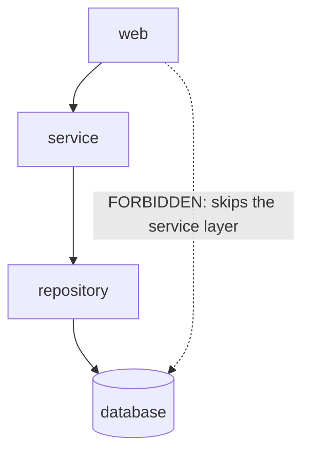

# Architecture Fitness Functions — Junior

> **Category:** [Anti-Patterns at Scale](../README.md) → **Architecture Fitness Functions** — *executable rules that fail the build when the architecture drifts toward an anti-pattern.*
> **Covers (collectively):** Layering & dependency rules · Cycle-detection gates · Allowed-dependency contracts · Metric thresholds · Evolutionary architecture & CI gating

---

## Table of Contents

1. [Introduction](#introduction)
2. [Prerequisites](#prerequisites)
3. [Glossary](#glossary)
4. [A Test for the Shape, Not the Output](#a-test-for-the-shape-not-the-output)
5. [The Simplest Rule: A Forbidden Dependency](#the-simplest-rule-a-forbidden-dependency)
6. [Hello, World — Three Tools](#hello-world--three-tools)
7. [Why a Wiki Rule Is Not Enforcement](#why-a-wiki-rule-is-not-enforcement)
8. [Reading Your First Violation](#reading-your-first-violation)
9. [Common Mistakes](#common-mistakes)
10. [Test Yourself](#test-yourself)
11. [Cheat Sheet](#cheat-sheet)
12. [Summary](#summary)
13. [Further Reading](#further-reading)
14. [Related Topics](#related-topics)

---

## Introduction

> Focus: **What is a fitness function?** and **Why automate "module A must not import module B"?**

You already know how to spot a bad shape in one file — a God Object, a circular dependency, a layer reaching into a layer it shouldn't. The problem is that *spotting* is a one-time act done by one person, and a codebase is edited by many people, forever. The rule "the web layer must never call the database directly" is true on Monday, agreed in a meeting on Tuesday, and quietly violated on Thursday by someone who never saw the meeting.

An **architecture fitness function** closes that gap. It is **an automated test that checks the *shape* of the code** — which module imports which, how deep a package nests, whether a layer is bypassed — and **fails the build** when the shape drifts toward the thing you agreed to avoid. The agreement stops being a sentence on a wiki and becomes a red CI check that blocks the merge.

The name comes from evolutionary biology by way of *Building Evolutionary Architectures*: a fitness function measures how close a system is to the characteristic you want it to keep. Here the characteristic is structural — "the dependency graph points the right way" — and the function is just a test you can run.

> **The mindset shift:** a normal test asserts *what the code does* (`add(2, 2) == 4`). A fitness function asserts *what the code is allowed to look like* (`package web does not import package db`). Both fail the build. Only one of them notices when a teammate quietly couples two things that should stay apart.

At the junior level your goal is to understand **what** a fitness function is, write the **simplest** one (a single forbidden dependency), and run it in three ecosystems. Designing a whole suite for a real codebase is `senior.md`; making the checks fast and trustworthy is `professional.md`.

---

## Prerequisites

- **Required:** You can read and write code in at least one of Go, Java, or Python (examples use all three).
- **Required:** You understand `import` / `package` — what it means for one file to depend on another module.
- **Required:** You've run a unit test and seen it pass and fail. A fitness function *is* a test.
- **Helpful:** You've seen a CI pipeline turn red and block a merge. That red check is where a fitness function does its job.
- **Helpful:** You've felt the pain of an anti-pattern at least once — a "quick" import that coupled two things that should have stayed apart ([Coupling & State](../../02-design/02-coupling-and-state/professional.md) is the in-the-file view of what we now enforce from outside).

---

## Glossary

| Term | Definition |
|------|-----------|
| **Fitness function** | An automated check that asserts a structural / architectural property of the code and fails the build when it's violated. |
| **Structural test** | A test about the *shape* of the code (dependencies, naming, nesting) rather than its runtime behavior. |
| **Forbidden dependency** | A rule that says "package A must not depend on package B" — the simplest fitness function. |
| **Layer** | A horizontal slice of an app (e.g. `web` → `service` → `repository`) with rules about which slice may call which. |
| **Dependency graph** | The directed graph of "X imports Y" across your modules. Fitness functions are assertions about this graph. |
| **Cycle** | A loop in the dependency graph (A → B → A). Almost always a smell; easy to detect and forbid. |
| **CI gate** | A check in continuous integration that blocks a merge when it fails. A fitness function only bites if it's a gate. |
| **ArchUnit / import-linter / madge** | The "hello world" tools for fitness functions in Java, Python, and JS/TS. Go usually uses `go list` plus a small custom check. |

---

## A Test for the Shape, Not the Output

Hold two tests side by side. They look similar — both are functions the test runner executes, both pass or fail — but they assert completely different things.

```python
# A BEHAVIORAL test: asserts what the code DOES at runtime.
def test_total_includes_tax():
    cart = Cart(items=[Item(price=100)])
    assert cart.total(tax_rate=0.1) == 110      # about the OUTPUT
```

```python
# A FITNESS FUNCTION (structural test): asserts what the code IS ALLOWED to look like.
# Using import-linter's API directly to make the idea concrete:
def test_web_does_not_import_db():
    graph = build_import_graph("shop")
    assert not graph.find_path(                  # about the SHAPE
        importer="shop.web", imported="shop.db"
    ), "shop.web must not import shop.db — go through the service layer"
```

The behavioral test would still pass if someone made `web` import `db` directly — the totals are still correct, the tax still adds up. Nothing about the *output* changed. What changed is the *shape*: a layer was bypassed, and the next person who needs to swap the database now has a hidden dependency to untangle.

A fitness function is the test that notices that. It never touches a cart or a tax rate. It loads the dependency graph and asserts a property of it.

> Behavioral tests protect **correctness**. Fitness functions protect **structure**. A codebase with green behavioral tests can still be rotting — the rot just isn't a wrong answer, it's a wrong shape. That's exactly the kind of decay no behavioral test will ever catch.

---

## The Simplest Rule: A Forbidden Dependency

Every fitness-function journey starts with one rule:

> **Package A must not import package B.**

This single shape covers a huge fraction of real architecture rules, because most layering and isolation rules are forbidden dependencies in disguise:

| Architecture intent | The forbidden dependency |
|---|---|
| "The web layer can't touch the DB directly." | `web` must not import `db` |
| "Domain logic must not depend on the framework." | `domain` must not import `spring` / `django` / `gin` |
| "No module may import the `legacy` package." | `*` must not import `legacy` |
| "The `payment` and `audit` modules must not form a cycle." | `payment` must not import `audit` **and** vice-versa |

Pick one real rule your codebase already wants — most teams have at least the first one — and that's your first fitness function. You are not boiling the ocean; you are writing *one* assertion about *one* edge that should not exist in the dependency graph.



The dotted edge is what the fitness function forbids. If it appears, the build goes red.

---

## Hello, World — Three Tools

Here is the *same* rule — "the web layer must not import the data layer" — written as a runnable check in three ecosystems. Don't memorize the APIs; notice that all three do the same thing: build the dependency graph, assert an edge is absent, fail if it's present.

### Java — ArchUnit

ArchUnit is a plain JUnit test. It scans compiled classes, builds the dependency graph, and lets you assert rules in a fluent DSL. Because it's *just a test*, it runs everywhere your tests already run — no extra CI plumbing.

```java
// src/test/java/com/shop/ArchitectureTest.java
import com.tngtech.archunit.junit.AnalyzeClasses;
import com.tngtech.archunit.junit.ArchTest;
import com.tngtech.archunit.lang.ArchRule;
import static com.tngtech.archunit.lang.syntax.ArchRuleDefinition.noClasses;

@AnalyzeClasses(packages = "com.shop")          // scan this package tree
class ArchitectureTest {

    @ArchTest
    static final ArchRule web_must_not_touch_db =
        noClasses().that().resideInAPackage("..web..")
            .should().dependOnClassesThat().resideInAPackage("..db..");
    // Reads almost like English: no web class should depend on a db class.
}
```

### Python — import-linter

`import-linter` reads a config file describing your allowed/forbidden imports, then `lint-imports` checks it. The "forbidden" contract type is the hello-world rule.

```ini
# setup.cfg  (or .importlinter)
[importlinter]
root_package = shop

[importlinter:contract:web-not-db]
name = Web layer must not import the db layer
type = forbidden
source_modules =
    shop.web
forbidden_modules =
    shop.db
```

```bash
lint-imports            # exits non-zero (fails CI) if shop.web imports shop.db
```

### JS/TS — madge (and dependency-cruiser)

For polyglot repos, `madge` is the one-liner for the most common rule of all — *no cycles* — and `dependency-cruiser` expresses richer forbidden-edge rules. `madge --circular` is the "hello world" of fitness functions in the JS world because it needs zero config.

```bash
# Fail the build if any import cycle exists anywhere under src/
npx madge --circular --extensions ts,tsx src/
```

### Go — `go list` + a tiny check

Go forbids *import cycles* at compile time, so you get the no-cycles rule for free. For "layer A must not import layer B," a few lines over `go list` is the idiomatic hello-world; richer rules later use ArchUnit-style libraries or `go vet` analyzers.

```bash
# Fail if anything in .../web imports .../db
go list -deps ./web/... | grep -q 'myapp/db' \
  && { echo "FORBIDDEN: web imports db"; exit 1; } \
  || echo "ok: web does not import db"
```

All four answer the same question — *does a forbidden edge exist in the dependency graph?* — and all four exit non-zero (red CI) when it does.

---

## Why a Wiki Rule Is Not Enforcement

It is tempting to think you already *have* this rule: it's on the architecture wiki, it's in the onboarding doc, the tech lead mentions it in reviews. Why automate it?

Because none of those is **enforcement** — they're all **hope**.

| "Enforcement" by hope | Why it fails |
|---|---|
| **Wiki page / ADR** | Nobody re-reads the wiki before each commit. New hires never saw it. It silently goes stale. |
| **Code-review comment** | Depends on the reviewer *noticing* a bad import among 400 changed lines, *this time and every time*, forever. Humans miss it — especially in a big diff at 6pm. |
| **A linter warning** | A warning that doesn't fail the build is a warning everyone scrolls past. Ten thousand warnings = zero warnings. |
| **"Everyone knows that"** | Tribal knowledge evaporates the moment the person who held it changes teams. |

A fitness function is different in exactly one way that matters: **it cannot be politely ignored.** It is not advice the reviewer might give; it is a red X that blocks the merge button. The rule is enforced by the machine, identically, on every commit, with no fatigue and no exceptions it forgot to mention.

> **The core argument:** a rule that isn't executable isn't a rule — it's a suggestion. The only architecture decisions that survive contact with a growing team and a deadline are the ones a machine checks. Everything else regresses to "whatever compiled."

This is the whole reason the chapter exists. You don't write a fitness function because you distrust your teammates; you write it because *every* team, including yours, eventually ships the import the wiki forbade — and a red build catches it in seconds, while a human catches it in months (if ever).

---

## Reading Your First Violation

When a fitness function fails, it doesn't just say "no." A good one tells you the **exact edge** that broke the rule and **why** it's forbidden. Learning to read that output is half the skill.

Here's a typical ArchUnit failure:

```
Architecture Violation [Priority: MEDIUM] -
Rule 'no classes that reside in a package '..web..'
should depend on classes that reside in a package '..db..'' was violated (1 times):
  Method <com.shop.web.OrderController.list()>
  calls method <com.shop.db.OrderRows.findAll()>
  in (OrderController.java:42)
```

Read it as three facts:

1. **Which rule broke** — `web` must not depend on `db`.
2. **The exact offending edge** — `OrderController` → `OrderRows`.
3. **Where to look** — `OrderController.java:42`.

The fix is mechanical: line 42 reached straight into the data layer, so route it through the service layer instead (the layer that *is* allowed to talk to `db`). import-linter prints the same information as an import *chain* (`shop.web.orders -> shop.db.rows`), and madge prints the *cycle* it found (`a.ts > b.ts > a.ts`). In every case the output names the edge; your job is to remove that edge, not to weaken the rule.

> **First instinct check:** when a fitness function goes red, the wrong move is to edit the *rule* to allow the new import. The right move is to fix the *code* so the forbidden edge disappears. The rule is the thing you agreed protects the architecture — relaxing it the moment it bites defeats the entire purpose. (When the rule *itself* is wrong, that's a real case too — handled deliberately in `senior.md`, not reflexively at 6pm.)

---

## Common Mistakes

Mistakes juniors make with their first fitness functions:

1. **Writing the rule but not making it a CI gate.** A fitness function that lives on your laptop and never runs in CI enforces nothing. It must fail the *shared* build, or it's just a private opinion.
2. **Confusing it with a behavioral test.** "Does the cart total work?" is not a fitness function. "Does the web layer avoid importing the db layer?" is. One checks output; the other checks shape.
3. **Relaxing the rule the instant it fails.** Adding the forbidden import to an "allowed" list to get green is undoing the rule. Fix the code, not the rule (unless the rule is genuinely wrong — a senior-level decision, not a reflex).
4. **Trying to encode the whole architecture on day one.** Start with *one* forbidden dependency that the team already agrees on. A single enforced rule beats a grand un-merged ruleset.
5. **Thinking a code-review comment is "enforcement."** Review catches the violation it happens to notice; a gate catches every violation, every time. They are not equivalent.
6. **Writing a rule no one understands.** A rule with no message (`should.not.depend...` and nothing else) produces a cryptic red build. Always attach the *why* ("go through the service layer") so the next person fixes the code instead of cursing the check.

---

## Test Yourself

1. In one sentence, what is the difference between a behavioral test and an architecture fitness function?
2. Your team's wiki says "the `domain` package must not depend on the web framework." Why is that sentence *not* enforcement, and what turns it into enforcement?
3. The rule "the `web` layer must not call the `db` layer directly" is an example of which simplest fitness-function shape? Name two other architecture intents that reduce to the same shape.
4. A fitness function and all behavioral tests are green, yet a senior engineer says the architecture just got worse. How is that possible?
5. Your ArchUnit rule fails with `OrderController calls OrderRows`. A teammate "fixes" it by adding `..web..` to the rule's allowed packages and the build goes green. What's wrong with that fix?
6. Why is `madge --circular` often the very first fitness function a team adds, even before any layering rules?

---

## Cheat Sheet

| Concept | What it means | Tool (hello-world) |
|---|---|---|
| **Fitness function** | Automated test of the code's *shape*, fails the build on drift | ArchUnit / import-linter / madge |
| **Forbidden dependency** | "A must not import B" — the simplest rule | `noClasses()...dependOnClassesThat()`, `type = forbidden` |
| **No-cycle rule** | Forbid loops in the dependency graph | `madge --circular`; Go rejects cycles at compile time |
| **Layering rule** | Web → service → repo, no upward/skip imports | ArchUnit `..web..` ↛ `..db..` |
| **CI gate** | The check that blocks the merge | exit non-zero in the pipeline |

> **One rule to remember:** *a structural rule that isn't an executable CI gate isn't a rule — it's a suggestion, and suggestions lose to deadlines.*

---

## Summary

- An **architecture fitness function** is an automated test of the code's *shape* (its dependency graph, naming, nesting) that **fails the build** when the architecture drifts toward an anti-pattern. It complements behavioral tests, which only check output.
- The **simplest** fitness function is a **forbidden dependency** — "package A must not import package B." Most layering and isolation rules reduce to this one shape.
- The same rule is one short check in every ecosystem: **ArchUnit** (Java), **import-linter** (Python), **madge / dependency-cruiser** (JS/TS), and **`go list` + a tiny script** (Go). All build the dependency graph and assert a forbidden edge is absent.
- A **wiki page, an ADR, a review comment, or "everyone knows"** is *hope*, not enforcement. Only a **CI gate** enforces a rule identically on every commit, with no fatigue and no exceptions.
- When a fitness function fails, **read the named edge and fix the code** — don't relax the rule to go green. Always give the rule a message that explains *why*.
- Next: [`middle.md`](middle.md) — *writing real layered-architecture rules, no-cycle and naming gates, and wiring them into CI so a violation actually fails the build.*

---

## Further Reading

- **Building Evolutionary Architectures** — Ford, Parsons, Kua (2nd ed., 2022) — the source of the term; fitness functions as the spine of an architecture that's allowed to change.
- **ArchUnit User Guide** — Peick et al. (ongoing) — the canonical examples for layering, naming, and cycle rules in Java.
- **import-linter documentation** — David Seddon (ongoing) — the `forbidden`, `layers`, and `independence` contract types with runnable configs.
- **Clean Architecture** — Robert C. Martin (2017) — the dependency rule (dependencies point inward) that most fitness functions encode.
- **The Pragmatic Programmer** — Hunt & Thomas (20th anniv. ed., 2019) — "automate everything," and why a check beats a convention.

---

## Related Topics

- [Anti-Pattern Budgets & Ratcheting](../02-anti-pattern-budgets-and-ratcheting/senior.md) — what to do when you *can't* fix every existing violation today: freeze the count and forbid new ones.
- [Hotspot Analysis](../03-hotspot-analysis/senior.md) — which part of the codebase deserves a fitness function first.
- [Coupling & State Anti-Patterns](../../02-design/02-coupling-and-state/professional.md) — the in-the-file view of the circular dependencies and hidden coupling these rules forbid from outside.
- [Bad Structure Anti-Patterns](../../01-development/01-bad-structure/senior.md) — the shapes (God Object, tangled flow) that motivate layering rules.
- Clean Code → Modules & Packages — how to draw the package boundaries a fitness function then defends.
- Architecture → Anti-Patterns — the system-level siblings (Big Ball of Mud) these rules guard against.

---

## Check your understanding

1. Explain Architecture Fitness Functions — Junior Level in your own words and name the problem it solves.
2. How would you apply the ideas around Table of Contents, Introduction, Prerequisites in a realistic engineering change?
3. What failure mode or misuse should you look for, and what evidence would reveal it?
4. What small example would prove that you can apply Architecture Fitness Functions — Junior Level correctly?
5. What observable result would convince you that the approach improved the system?
